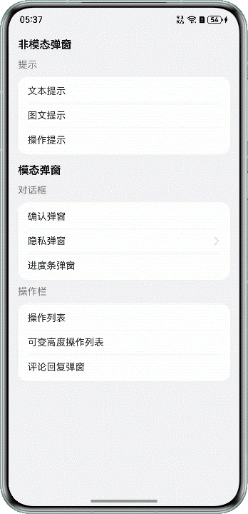

# 自定义弹窗选型与开发

更新时间：2026-03-12 08:45:02

来源：https://developer.huawei.com/consumer/cn/doc/best-practices/bpta-customdialog-selection-and-development

## 概述


在进行弹窗开发时，需要针对不同的弹窗类型选择对应的实现方案，例如常见的弹窗类型包括文本提示弹窗、对话框、菜单、操作栏等。本文将围绕弹窗的基本类型、不同类型弹窗的特性展开，结合当前推荐的弹窗类型、能力支持情况、弹窗的使用建议，来介绍弹窗的选型与开发流程。帮助开发者解决在使用弹窗时的常见问题（例如：实现侧滑拦截、切换页面返回后弹窗不消失等）。


## 弹窗能力介绍


本章节将从弹窗的关键特性、能力支持、使用建议三个方面对弹窗的能力进行介绍：

- [关键特性](#section43517717431)：从交互角度出发，介绍开发者对于弹窗的高频要求。
- [能力支持](#section183771115161711)：详细说明当前推荐弹窗方案所支持的具体能力与功能。
- [使用建议](#section1627323364216)：对比当前推荐弹窗方案的区别，提供弹窗选型的建议。


### 弹窗的关键特性


在进行弹窗开发时，除了弹窗的内容、样式以外，从用户交互角度出发，弹窗还有一些常见的交互诉求如：


| 交互诉求 | 是否允许侧滑手势关闭弹窗，由交互决定，不让用户太轻易退出。 | 点击弹窗外是否关闭弹窗，弹窗内容比较关键或重要时，为确保用户关注并处理，可能不允许点击弹窗外关闭。 | 是否需要自定义配置进出场动画以及动画类型。 |
| --- | --- | --- | --- |
| 效果图 |  |  |  |
| 交互诉求 | 弹窗的内容是否需要在跳转后，保留在之前页面，如隐私弹窗。 | 是否抢占焦点，部分使用dialog实现的自定义弹窗在弹出时会抢占焦点，导致键盘被收起再弹出。 | 是否需要弹窗与键盘避让，为了确保在键盘弹窗时，弹窗及其内容不会被遮挡，也有不需要避让的场景，例如评论回复弹窗。 |
| 效果图 |  |  |  |


### 能力支持情况


当前系统提供了多种自定义弹窗能力，具体如下：

- **主要推荐的弹窗**基于UIContext实现的自定义弹窗：UIContext弹窗是一种基于上下文（Context）的弹窗管理机制，通过ComponentContent封装内容可以与UI界面解耦，调用更加灵活，可以满足开发者的封装诉求。具有较高的灵活性，弹窗样式完全自定义。当关联的UIContext销毁时（如页面关闭），弹窗会自动关闭，无需手动管理。其次，弹窗的层级由UIContext管理，与页面路由解耦，适合复杂场景。当前实现弹窗的主要API有[UIContext.openBindSheet()](https://developer.huawei.com/consumer/cn/doc/harmonyos-references/arkts-apis-uicontext-uicontext#openbindsheet12)、[UIContext.getPromptAction().openCustomDialog()](https://developer.huawei.com/consumer/cn/doc/harmonyos-references/arkts-apis-uicontext-promptaction#opencustomdialog12)、[UIContext.getOverlayManager()](https://developer.huawei.com/consumer/cn/doc/harmonyos-references/arkts-apis-uicontext-uicontext#getoverlaymanager12)等。
- 基于Navigation.Dialog实现的自定义弹窗：[NavDestination.Dialog](https://developer.huawei.com/consumer/cn/doc/harmonyos-guides/arkts-navigation-navigation#页面显示类型)是基于Navigation组件实现的弹窗效果，它本质上属于路由页面，存在于路由栈中，可用于实现模态、半模态等形式，适用于透明页面、切换页面弹窗不消失等场景。以上两种弹窗在技术实现上具备良好的灵活性和拓展性，对页面解耦及弹窗样式自定义等能力支持度较高，关于它们的具体能力支持详情，可参考：[能力支持](#table14106534122814)。
- **不推荐使用的弹窗**[基础自定义弹出框 (CustomDialog)](https://developer.huawei.com/consumer/cn/doc/harmonyos-guides/arkts-common-components-custom-dialog)：[CustomDialogController](https://developer.huawei.com/consumer/cn/doc/harmonyos-references/ts-methods-custom-dialog-box#customdialogcontroller) 在使用上存在较多限制，不支持动态创建和动态刷新，只能在@Component修饰的自定义组件内部使用。这导致弹窗的创建与管理必须依赖具体组件，增加了代码复杂度和维护成本。此外，当一个页面需要展示多个自定义弹窗时，需为每个弹窗单独声明对应的 CustomDialogController，进一步造成 UI 层代码冗余，难以实现弹窗与页面逻辑的解耦。
- [@ohos.promptAction (弹窗)](https://developer.huawei.com/consumer/cn/doc/harmonyos-references/js-apis-promptaction)：@ohos.promptAction是一种全局方法，在没有UIContext上下文的场景中执行时会有问题，或者因为开发者不能指定UIContext可能导致弹窗显示到非开发者预期的窗口里，所以不推荐使用。此外，其采用系统默认弹窗样式，无法进行深度样式自定义，适用于希望保持与系统风格一致的简单提示类弹窗，适用范围较为有限。


由于弹窗类型的差异，其在功能实现、交互体验和适配场景上存在一定局限性。当前主要推荐的弹窗能力支持情况梳理如下表，供参考：


| 场景描述 | UIContext弹窗 | Navigation |  |  |
| --- | --- | --- | --- | --- |
| UIContext.openBindSheet() | UIContext.getPromptAction().openCustomDialog() | UIContext.getOverlayManager() | NavDestination.Dialog |  |
| 弹窗侧滑拦截/响应 | √ | √ | √ | √ |
| 点击弹窗外关闭弹窗 | √ | √ | × | × |
| 自定义显示和退出动画 | × | √ | ⍻ (默认不支持动画，可通过自定义动画的方式配置） | ⍻ (API version 13之前，默认无系统转场动画。从API version 13开始，支持系统转场动画。） |
| 切换页面弹窗不消失 | √ | √ | √ | √ |
| 弹窗获取焦点选择 | √ | √ | √ | √ |
| 键盘避让模式选择 | × | √ | ⍻ (结合窗口设置) | ⍻ (结合窗口设置) |


上述六种场景均可与前文常见的交互诉求相对应，除此之外，还有一些能力支持情况，例如是否支持页面与弹窗解耦、弹窗样式自定义等，具体如下：


| 页面解耦 | √ | √ | √ | √ |
| --- | --- | --- | --- | --- |
| 弹窗样式自定义（背景、圆角等） | √ | √ | √ | √ |
| 弹窗蒙层 | √ | √ | √ | √ |
| 层级管理 | √ | √ | √ | √ |
| 路由解耦 | √ | √ | √ | × |
| 事件分发到页面 | × | × | √ | √ |


### 弹窗使用建议


目前，UIContext弹窗和Navigation Dialog作为主推的弹窗类型，它们在位置与展示形式、适用场景等方面存在一些差异，建议开发者结合开发需求和场景进行选择。


|  | UIContext弹窗 | Navigation |  |  |
| --- | --- | --- | --- | --- |
| UIContext.openBindSheet() | UIContext.getPromptAction().openCustomDialog() | UIContext.getOverlayManager() | NavDestination.Dialog |  |
| 位置与展示形式 | 通常从屏幕底部弹出，是一种半模态弹窗，占据部分屏幕高度。 | 默认居中显示，可通过isModal参数设置为模态或非模态。 | 可以在屏幕的任意位置显示，独立于页面布局，可覆盖在所有组件之上，弹窗之下。 | 基于Navigation导航路由形式，以Component组件页面存在于路由栈中，默认透明显示。 |
| 适用场景 | 适合用于展示一些底部操作选项列表，如底部操作，底部列表选项等。 | 适用于各种需要高度自定义弹窗内容和样式的场景，如操作确认提示、表单输入弹窗等。 | 用于实现全局的悬浮提示或操作按钮，如客服入口浮球、活动图标入口、引导提示等。 | 适用于各个形式的弹窗，但需要注意该弹窗实际是以页面形式实现的，会占用页面栈。 |


## 应用常见弹窗场景实现


根据不同的业务需求，弹窗有多种类型可供选择。本文选取了几种常见的弹窗实现案例，结合对应的能力特点进行介绍。


### 实现类Toast的图文提示框


图文提示弹窗常用于显示用户操作的结果，如成功或失败提示，也可以在等待系统响应时展示加载动画等。





实现方案

由于showToast仅支持弹出文本类型，无法实现图文混合形式的提示弹窗，针对此类场景可以使用UIContext.getPromptAction().openCustomDialog()实现。

示例代码

通过@Builder自定义构建函数buildText()，用于封装图文提示弹窗的内容和样式，给弹窗添加图片Image和文本Text。

```text
// Graphic and text prompt.
@Builder
function buildText(params: Params) {
Row() {
Image($r('app.media.checkmark_circle'))
.width(24)
.height(24)
.margin({ right: 16 })
Text(params.text)
.fontSize(16)
}
.justifyContent(FlexAlign.Center)
.backgroundColor(Color.White)
.padding({ left: 24, right: 24 })
.height(50)
.borderRadius(24)
}
```

通过UIContext.getPromptAction().openCustomDialog()打开弹窗，使用BaseDialogOptions配置弹窗样式。

```text
// Open the graphic and text prompts
let uiContext = this.getUIContext();
PromptActionClass.setContext(uiContext);
PromptActionClass.setContentNode(imageTipsContentNode);
PromptActionClass.setOptions({
isModal: false,
alignment: DialogAlignment.Bottom,
offset: { dx: 0, dy: -80 },
focusable: false
});
PromptActionClass.openDialog();
setTimeout(() => {
PromptActionClass.closeDialog(imageTipsContentNode);
}, 3000)
```

需要注意的是，dialog类型弹窗在弹出时会抢占焦点，此处如果存在正在输入的文本框，会导致键盘收起。在需要保持原有界面可用性的场景下，用户希望弹窗不主动获取焦点，避免打断用户的当前操作，可以通过设置弹窗的promptAction.BaseDialogOptions的focusable属性为false，即不允许弹窗获取焦点。

```text
PromptActionClass.setOptions({
isModal: false,
alignment: DialogAlignment.Bottom,
offset: { dx: 0, dy: -80 },
focusable: false
});
```


### 实现隐私弹窗效果


隐私弹窗主要用于确保法律合规性，要求应用在收集用户数据前必须获得用户的同意。当用户打开隐私弹窗时，可以通过点击弹窗内的超链接跳转至详细的隐私协议页面。返回后，隐私弹窗依旧保持显示状态，确保用户能够在充分了解相关信息的基础上做出选择。


在隐私页面中，需要关注的点主要有两个：

1、当点击隐私弹窗中隐私界面链接，跳转到新页面，弹窗应该处于页面下层，并且返回页面时，弹窗的状态依旧保留；

2、用户执行侧滑手势时，可以设置拦截用户侧滑操作，让用户需要点击确认或者拒绝方式退出弹窗；

实现方案

可以使用UIContext.getPromptAction().openCustomDialog()实现，其支持通过levelMode和levelUniqueId配置页面级弹窗。

- **切换****页面弹窗不消失**首先，引入自定义弹窗的封装类**PromptActionClass**，其定义了弹窗的打开和关闭方法，以及选项设置。
```text
import { PromptActionClass } from '../utils/PromptActionClass';
```
 通过自定义弹窗选项[BaseDialogOptions](https://developer.huawei.com/consumer/cn/doc/harmonyos-references/js-apis-promptaction#basedialogoptions11)中的levelMode和levelUniqueId设置弹出框在指定页面内弹出，此参数接收页面内的节点id，设置后，弹出框显示时会自动查询此id对应的节点所在的Navigation页面，并将其挂载在此页面下。如下代码示例所示，Button节点为指定页面的节点，设置自定义id后，通过[getFrameNodeById()](https://developer.huawei.com/consumer/cn/doc/harmonyos-references/arkts-apis-uicontext-uicontext#getframenodebyid12)方法获取该节点，再通过[getUniqueId](https://developer.huawei.com/consumer/cn/doc/harmonyos-references/ts-custom-component-api#getuniqueid12)获取节点的内部id，并将其作为levelUniqueId的值传入。
```text
Column() {
Row() {
Image($r('app.media.chevron_left'))
.width(16)
.height(16)
.margin({ left: 12 })
}
.width(40)
.height(40)
.borderRadius(48)
.margin({ top: 42 })
.backgroundColor('#e6eaeb')
.onClick(() => {
this.pageStack.pop();
})

Row() {
Button('OPEN')
.id('privacyDialog')
.fontSize(16)
.width('100%')
.borderRadius(20)
.margin({ bottom: 16 })
.backgroundColor('#0A59F7')
.onClick(() => {
const node: FrameNode | null = this.getUIContext().getFrameNodeById('privacyDialog');
let uiContext = this.getUIContext();
PromptActionClass.setContext(uiContext);
PromptActionClass.setContentNode(privacyContentNode);
PromptActionClass.setOptions({
levelMode: LevelMode.EMBEDDED,
levelUniqueId: node?.getUniqueId(),
onWillDismiss: (dismissDialogAction: DismissDialogAction) => {
hilog.info(0xFF00, 'TAG', JSON.stringify(dismissDialogAction.reason));
}
})
PromptActionClass.openDialog();
})
}
.width('100%')
.alignItems(VerticalAlign.Center)
}
.width('100%')
.height('100%')
.padding({
left: 16,
right: 16,
bottom: 32
})
.justifyContent(FlexAlign.SpaceBetween)
.alignItems(HorizontalAlign.Start)
```


- **侧滑拦截**通过UIContext.getPromptAction弹窗的onWillDismiss回调函数实现侧滑拦截。当用户执行点击遮障层关闭、侧滑、三键back、键盘ESC关闭交互操作时，注册该回调函数后，弹窗不会立刻关闭。在回调函数中通过[DismissReason](https://developer.huawei.com/consumer/cn/doc/harmonyos-references/ts-universal-attributes-popup#dismissreason12枚举说明)枚举确定关闭原因，从而选择是否关闭弹窗。
```text
PromptActionClass.setOptions({
levelMode: LevelMode.EMBEDDED,
levelUniqueId: node?.getUniqueId(),
onWillDismiss: (dismissDialogAction: DismissDialogAction) => {
hilog.info(0xFF00, 'TAG', JSON.stringify(dismissDialogAction.reason));
}
})
```


API 16之前的版本，可以使用NavDestinationMode.DIALOG弹窗实现，Dialog方式本质上是基于路由页面出入路由栈的方式实现对弹窗的保留。

使用NavDestinationMode.DIALOG弹窗实现

- **切换页面弹窗不消失**若使用NavDestinationMode.DIALOG模式实现弹窗，即需要将NavDestination的显示模式mode设置为NavDestinationMode.DIALOG弹窗类型。
```text
NavDestination() {
// ... 弹窗内容
}
.mode(NavDestinationMode.DIALOG)
```


- **侧滑拦截**通过NavDestination的回调函数[onBackPressed()](https://developer.huawei.com/consumer/cn/doc/harmonyos-references/ts-basic-components-navdestination#onbackpressed10)实现侧滑拦截。当点击物理返回按钮或使用手势滑动时，触发该回调。返回值为true时，表示重写返回键逻辑，即可实现侧滑拦截。
```text
NavDestination() {
// ...
}
.hideTitleBar(true)
.mode(NavDestinationMode.DIALOG)
.onBackPressed((): boolean => {
return true;
})
```


### 实现进度展示弹窗


展示进度条的弹窗是一种常见的弹窗组件，用于在耗时操作中向用户反馈任务进度，此类弹窗中主要涉及的特点在于弹窗与页面之间的数据交互，刷新弹窗的内容。


实现方案

- **在页面中更新弹窗内容**：更新弹窗中自定义组件的内容可以通过ComponentContent提供的[update()](https://developer.huawei.com/consumer/cn/doc/harmonyos-references/js-apis-arkui-componentcontent#update)方法来实现，即contentNode.update()更新弹窗的数据并同步到UI进行展示。
```text
Text(isProgressRunning ? $r('app.string.pause') : $r('app.string.start'))
.fontSize(16)
.fontColor('#0A59F7')
.margin({ top: 8 })
.onClick(() => {
isProgressRunning = !isProgressRunning;
if (isProgressRunning) {
timer = setInterval(() => {
if (value === 100) {
value = 0;
}
value += 10;
progressContentNode.update(new ProgressParams($r('app.string.progress'), value, isProgressRunning));
}, 1000)
} else {
clearInterval(timer);
}
progressContentNode.update(new ProgressParams($r('app.string.progress'), value, isProgressRunning));
})
```


- **点击弹窗外是否关闭弹窗**为保证任务在进度条弹窗关闭后仍持续运行，需将弹窗配置为非自动取消，即设置autoCancel为true。这样用户点击弹窗外区域关闭弹窗时，不会中断任务流程。后续重新打开弹窗时，进度条将根据当前任务状态继续更新。
```text
// Open the progress bar pop-up window
let uiContext = this.getUIContext();
PromptActionClass.setContext(uiContext);
PromptActionClass.setContentNode(progressContentNode);
PromptActionClass.setOptions({
autoCancel: true,
transition: TransitionEffect.asymmetric(
TransitionEffect.OPACITY.animation({ duration: 1000 }),
TransitionEffect.OPACITY.animation({ delay: 500, duration: 1000 })
)
})
PromptActionClass.openDialog();
```
- **自定义弹窗显示和退出动画**在应用开发中，系统弹窗的显示和退出动画通常不满足需求。若要实现自定义弹窗出入动画，可以使用以下方式：1）渐隐渐显的方式弹出；2）从左往右弹出，从右往左收回；3）从下往上的抽屉式弹出，关闭时从上往下收回。本文以渐隐渐显的方式为例，介绍自定义弹窗的显示和退出动画。 可以使用[BaseDialogOptions](https://developer.huawei.com/consumer/cn/doc/harmonyos-references/js-apis-promptaction#basedialogoptions11)的transition参数设置弹窗显示和退出的过渡效果，以此实现以渐隐渐显的方式呈现自定义弹窗的显示和退出动画。
```text
transition: TransitionEffect.asymmetric(
TransitionEffect.OPACITY.animation({ duration: 1000 }),
TransitionEffect.OPACITY.animation({ delay: 500, duration: 1000 })
)
```


### 实现底部操作弹窗


操作栏弹窗通常是指在应用界面中，用户点击操作栏（如右上角的“更多”按钮）后触发的半模态菜单，通常具备分享、增删改查类功能。操作列表弹窗的内容主体是列表，分为固定高度，可变高度两种。


实现方案

使用openBindsheet，通过ComponentContent封装半模态页面中显示的组件内容，SheetOptions设置半模态页面样式。

- **固定高度操作弹窗**设置height为SheetSize.MEDIUM，此时弹窗为固定高度显示，无法跟手拖动。
```text
Text($r('app.string.operation_list'))
.onClick(() => {
// Open the operation list pop-up window
let contentNode =
new ComponentContent(this.getUIContext(), wrapBuilder(buildActionList));
let uiContext = this.getUIContext();
let uniqueId = this.getUniqueId();
let frameNode: FrameNode | null = uiContext.getFrameNodeByUniqueId(uniqueId);
let targetId = frameNode?.getFirstChild()?.getUniqueId();
uiContext.openBindSheet(contentNode, {
title: { title: $r('app.string.more') },
height: SheetSize.MEDIUM,
backgroundColor: '#F1F3F5',
preferType: SheetType.BOTTOM
}, targetId)
.then(() => {
hilog.info(0xFF00, 'TAG', 'openBindSheet success');
})
.catch((err: BusinessError) => {
hilog.info(0xFF00, 'TAG', 'openBindSheet error: ' + err.code + ' ' + err.message);
})
})
.width('100%')
```
- **可变高度操作弹窗**可以通过[SheetOptions](https://developer.huawei.com/consumer/cn/doc/harmonyos-references/ts-universal-attributes-sheet-transition#sheetoptions)的detents参数设置为可变高度，跟手拖动。
```text
uiContext.openBindSheet(contentNode, {
title: { title: $r('app.string.more') },
height: SheetSize.MEDIUM,
backgroundColor: '#F1F3F5',
preferType: SheetType.BOTTOM,
detents: [SheetSize.MEDIUM, SheetSize.LARGE, 200]
}, targetId)
.then(() => {
hilog.info(0xFF00, 'TAG', 'openBindSheet success');
})
.catch((err: BusinessError) => {
hilog.info(0xFF00, 'TAG', 'openBindSheet error: ' + err.code + ' ' + err.message);
})
```


### 实现评论回复弹窗


评论回复模块在图文和视频应用中被广泛使用，包含编辑区域、好友列表、常用表情列表和表情面板（见下图），它允许用户进行输入文字、表情、@好友、选择图片等操作。具体实现方案请参见：评论回复弹窗开发实践。


## 示例代码


- [自定义弹窗选型与开发](https://gitcode.com/harmonyos_samples/custom-dialog-selection-and-development)
