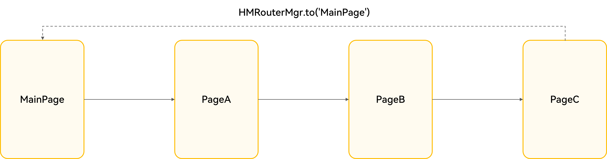
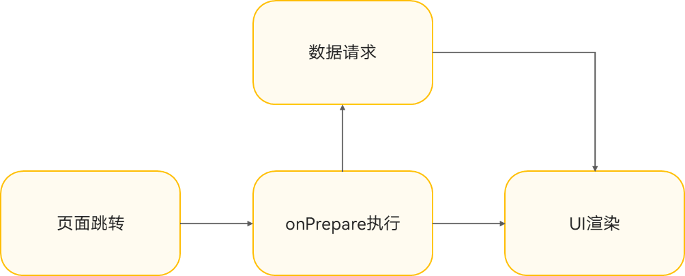
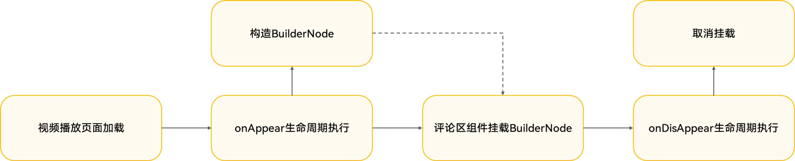
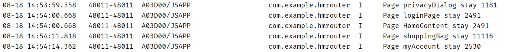

# 基于HMRouter的页面跳转

更新时间：2026-05-18 00:55:31

来源：https://developer.huawei.com/consumer/cn/doc/best-practices/bpta-hmrouter

**   


##### 概述

HMRouter是HarmonyOS上页面跳转的场景解决方案，主要解决页面间相互跳转的问题，开发者可以参考[HMRouter使用说明](https://gitcode.com/harmonyos_samples/HMRouter#hmrouter使用说明)进行安装配置与快速上手，本文主要以实际开发中的各项场景为例，介绍HMRouter路由框架的使用。HMRouter路由框架提供了下列功能特性：
 
- 使用自定义注解实现路由跳转。
- 支持HAR/HSP。
- 支持路由拦截、路由生命周期。
- 简化自定义动画配置：配置全局动画，单独指定某个页面的切换动画。
- 支持不同的页面类型：单例页面、Dialog页面。

 
该框架底层对Navigation相关能力进行了封装，帮助开发者减少对Navigation相关细节内容的关注、提高开发效率，同时该框架对页面跳转能力进行了增强，例如其中的路由拦截、单例页面等。下文以页面跳转、弹窗提示、转场动效、数据加载、维测场景为切入点，介绍HMRouter路由框架的使用。
 
 

##### 页面跳转场景

 

##### 页面跳转与返回

HMRouter提供了基于自定义注解的页面跳转与返回功能，使用步骤如下：
 1. 为需要跳转的页面添加@HMRouter注解，并配置其中的pageUrl参数，例如此处配置为ProductContent。
```ArkTS
@HMRouter({ pageUrl: 'ProductContent' })
@Component
export struct ProductContent {
  // ...
  @State param: ParamsType | null = null;

  aboutToAppear(): void {
    this.param = HMRouterMgr.getCurrentParam() as ParamsType;
  }

  // ...
}
```

2. 在需要进行页面跳转的位置，使用HMRouterMgr提供的to方法进行页面跳转，在参数中配置目标页面的页面地址，如需传参可配置withParam参数。此外，也可以配置页面栈唯一标识navigationId，当使用多个HMNavigation时建议开发者手动指定navigationId，当使用单个HMNavigation时，开发者可以不传递navigationId参数，系统会默认处理。onResult参数可用于配置当从其他页面返回到当前页面时的回调函数，在回调函数内可以通过参数的srcPageInfo.name属性获取由哪个页面跳转到当前页，还可以通过参数的result属性获取返回当前页面时携带的参数。
```ArkTS
HMRouterMgr.to('ProductContent')
  .withNavigation('mainNavigationId')
  .withParam({ a: 1, b: 2 })
  .onResult((popInfo: HMPopInfo) => {
    const pageName = popInfo.srcPageInfo.name;
    const params = popInfo.result;
    console.log(`page name is ${pageName}, params is ${JSON.stringify(params)}`);
  })
  .pushAsync()
```

3. 在跳转的目标页面使用HMRouterMgr.getCurrentParam()获取到传递的页面参数。
```ArkTS
@Component
export struct ProductContent {
  // ...
  @State param: ParamsType | null = null;

  aboutToAppear(): void {
    this.param = HMRouterMgr.getCurrentParam() as ParamsType;
  }

  // ...
}
```

4. 如需使用页面返回功能，在对应的业务逻辑位置使用HMRouterMgr提供的pop方法实现页面返回，同样的pop方法支持传入navigationId，同时HMRouter还支持在返回时通过配置param参数向其所返回的页面传递参数。
```ArkTS
HMRouterMgr.pop({ navigationId: 'mainNavigationId', param: this.param })
```

 
 

##### 多次页面跳转，返回指定页面

当页面跳转路径如HomePage->PageA->PageB->PageC，开发者希望在PageC的页面逻辑中直接返回到HomePage并携带参数，开发者仅需使用HMRouterMgr提供的to方法，并传入需要返回的目标页面的地址以及携带的参数，即可直接带参返回到指定页面。
 
```ArkTS
HMRouterMgr.to('MainPage')
  .withNavigation('mainNavigationId')
  .withParam(0)
  .pushAsync()
```
 
 
图1 **返回指定页面示意图**


 

##### 应用未登录，点击跳转登录页的校验场景

应用中经常会有当用户未登录应用时，点击某些应用内容会自动跳转到登录页面的场景，在使用HMRouter对此场景进行实现时，可以采用以下步骤：
 1. 定义拦截器类LoginCheckInterceptor实现IHMInterceptor接口。
2. 为定义的拦截器类添加@HMInterceptor注解，通过interceptorName配置拦截器名称LoginCheckInterceptor。
3. 实现IHMInterceptor的intercept异步拦截器方法，在该方法中根据当前的登录状态来控制页面跳转的目标。
- 当用户已登录，通过执行chain.onContinue()，正常执行后续页面跳转逻辑。

4. 当用户未登录，通过Toast弹窗向用户提示登录，然后跳转到登录页面，最后通过执行chain.onIntercept()来拦截此次跳转请求。
```ArkTS
@HMInterceptor({ interceptorName: 'LoginCheckInterceptor' })
export class LoginCheckInterceptor implements IHMInterceptor {
  async intercept(chain: IHMInterceptorChain): Promise<void> {
    const info = chain.getRouterInfo();
    const context = chain.getContext();
    // ...
      if (!!AppStorage.get('isLogin')) {
        await chain.onContinue()
      } else {
        info.context.getPromptAction().showToast({ message: '请先登录' });
        HMRouterMgr.push({
          pageUrl: 'loginPage',
          skipAllInterceptor: true
        });
        await chain.onIntercept();
      }
      // ...
  }
}
```

- 在需要进行拦截的页面中配置@HMRouter的interceptors参数即可，由于一个页面可以配置多个拦截器，所以需要将关联的拦截器名称封装为一个数组进行传入。

 
运行效果如下图所示。
 


 
 

##### 实现单例页面的跳转

当应用中存在初始化加载资源消耗大且有复用需求的页面时，就可以使用单例页面。典型的业务场景如视频类应用中的视频播放页面，此类页面通常需要加载视频解码器资源并对其初始化，且该页面在视频类应用中会频繁出现。实现上开发者只需要配置@HMRouter注解参数中的singleton参数为true即可。
 
```ArkTS
@HMRouter({
  pageUrl: 'liveHome',
  singleton: true,
  animator: 'liveInteractiveAnimator',
  lifecycle: 'liveHomeLifecycle'
})
@Component
export struct LiveHome {
  // ...
}
```
 
 

##### 弹窗提示场景

 

##### 实现弹窗类型的页面

在HMRouter路由框架中，开发者只需要设置@HMRouter注解的dialog配置为true即可将当前页面作为弹窗使用。
 
```ArkTS
@HMRouter({
  pageUrl: PageConstant.PRIVACY_DIALOG_DETAIL,
  dialog: true,
  // ...
})
@Component
export struct PrivacyDialogDetail {
  // ...
}
```
 
 

##### 返回时弹窗，提示用户是否确认返回

当从某些页面返回时，应用希望通过弹窗方式让用户确认是否要执行返回操作，例如在订单支付页面中用户执行返回操作时，通常会弹窗提示用户是否确认退出，当用户点击确认后才会执行页面退出逻辑，此场景下就可以考虑使用弹窗类型页面加上自定义生命周期来实现。操作步骤如下：1. 开发者首先需要根据自己的业务需求，来进行自定义弹窗的开发。
```ArkTS
@HMRouter({ pageUrl: 'PayCancel', dialog: true,animator:'PayCancelDialog' })
@Component
export struct PayCancel {
  // ...
  build() {
    Stack({ alignContent: Alignment.Center }) {
      ConfirmDialog({
        title: '取消订单',
        content: '您确认要取消此订单吗?',
        leftButtonName: '再看看',
        rightButtonName: '取消订单',
        leftButtonFunc: () => {
          HMRouterMgr.popAsync({
            navigationId: this.queryNavigationInfo()?.navigationId
          });
        },
        rightButtonFunc: () => {
          // ...
        }
      });
    }
    .width('100%')
    .height('100%')
    .position({
      x: '50%',
      y: '50%'
    })
    .markAnchor({
      x: '50%',
      y: '50%'
    });
  }
}
```

2. 定义ExitPayLifecycle类来实现IHMLifecycle接口，为ExitPayLifecycle加上@HMLifecycle注解，传入生命周期名称ExitPayLifecycle，在类的内部，重写onBackPressed回调函数，当用户执行返回操作时，该回调函数触发，弹出刚刚定义的PayCancel弹窗。
```ArkTS
@HMLifecycle({ lifecycleName: 'ExitPayLifecycle' })
export class ExitPayLifecycle implements IHMLifecycle {
  model: ObservedModel = new ObservedModel();

  onBackPressed(): boolean {
    HMRouterMgr.to('PayCancel')
      .withParam(this.model.pageUrl)
      .pushAsync()
    return true;
  }
}
```

3. 将定义的生命周期与支付页面绑定，只需要将刚刚定义的生命周期传入对应组件@HMRouter注解的lifecycle参数即可。
```ArkTS
@HMRouter({
  pageUrl: 'PayDialogContent',
  dialog: true,
  lifecycle: 'ExitPayDialog',
  interceptors: ['LoginCheckInterceptor']
})
@Component
export struct PayDialogContent {
  // ...
}
```

 
 
 
运行效果如下图所示。
 


 

 

##### 首页两次返回退出应用

该场景下用户第一次触发应用返回退出时向用户提示“再次返回退出”，第二次用户触发返回操作时应用真正退出。实现上可参考以下步骤：
 1. 定义一个生命周期类ExitAppLifecycle实现IHMLifecycle接口。
2. 使用@HMLifecycle注解传入生命周期名称参数lifecycleName为ExitAppLifecycle。
3. 重写其中的onBackPressed方法（此处是由于上述业务场景需要，实际开发中根据实际业务场景按需重写方法），通过判断上次返回操作与当前返回操作的时间间隔，按如下逻辑处理：
- 当两次返回操作的时间间隔大于设置值时（此处为1000ms），重新弹窗对用户进行提示，此处返回true，表示不执行默认返回逻辑。

4. 当两次返回操作的时间间隔小于设置值时（此处为1000ms），返回为false表示执行默认返回逻辑，退出应用。
```ArkTS
@HMLifecycle({ lifecycleName: 'ExitAppLifecycle' })
export class ExitAppLifecycle implements IHMLifecycle {
  private lastTime: number = 0;

  onBackPressed(ctx: HMLifecycleContext): boolean {
    let time = new Date().getTime();
    if (time - this.lastTime > 1000) {
      this.lastTime = time;
      ctx.uiContext.getPromptAction().showToast({
        message: '再次返回退出应用',
        duration: 1000
      });
      return true;
    } else {
      return false;
    }
  }
}
```

- 将定义好的生命周期类与页面进行关联，开发者只需在@HMRouter注解中配置lifecycle为要关联的生命周期名称即可。

 
 
运行效果如下图所示。
 


 

 

##### 转场动效场景

 

##### 全局自定义转场动效

- 定义全局页面转场效果。开发者只需要创建出IHMAnimator.Effect实例，在参数中按照业务需求对动画方向direction，透明度opacity，横纵方向页面缩放效果scale进行配置即可。
```ArkTS
const globalPageTransitionEffect: IHMAnimator.Effect = new IHMAnimator.Effect({
  direction: IHMAnimator.Direction.BOTTOM_TO_TOP,
  opacity: { opacity: 0.5 },
  scale: { x: 0.5, y: 0.2 }
})
```
 定义完成后，只需要将实例传入HMNavigation组件的dialogAnimator参数即可。

  
```ArkTS
HMNavigation({
  navigationId: 'mainNavigationId', homePageUrl: 'HomeContent', options: {
    dialogAnimator: globalPageTransitionEffect,
  }
})
```

- 定义全局弹窗效果。同样的，开发者也只需要按照业务需求创建出对应的IHMAnimator.Effect实例，代码示例如下。
```ArkTS
const globalPageTransitionEffect: IHMAnimator.Effect = new IHMAnimator.Effect({
  direction: IHMAnimator.Direction.BOTTOM_TO_TOP,
  opacity: { opacity: 0.5 },
  scale: { x: 0.5, y: 0.2 }
})
```
 将创建好的实例作为dialogAnimator的参数进行传入即可。

  
```ArkTS
HMNavigation({
  navigationId: 'mainNavigationId', homePageUrl: 'HomeContent', options: {
    dialogAnimator: globalPageTransitionEffect,
  }
})
```


 
 

##### 特定页面设置自定义转场

开发者可以自定义动画类并实现IHMAnimator接口中的effect方法，该方法会将页面进出场的效果对象enterHandle与exitHandle作为参数传入，可通过参数对象上的start、finish方法，设置对应效果的起止状态，支持设置的常用属性还有：
 
- curve：设置动画速度曲线，支持通过Curve枚举传入值，默认Curve.EaseInOut。
- duration：动画持续时长，单位ms。

 
以下代码示例表示入场时由屏幕底部以线性速度向屏幕顶部运动，入场动画持续时长为400ms。出场时从屏幕顶部以线性速度向屏幕底部运动，出场动画持续时长也为400ms。
 
```ArkTS
@HMAnimator({ animatorName: 'CustomAnimator' })
export class CustomAnimator implements IHMAnimator {
  effect(enterHandle: HMAnimatorHandle, exitHandle: HMAnimatorHandle): void {
    // to animator
    enterHandle.start((modifier: AttributeUpdater<NavDestinationAttribute>) => {
      modifier.attribute?.translate({ y: '100%' }).scale({ x: 0.7 }).opacity(0.3)
    }).finish((modifier: AttributeUpdater<NavDestinationAttribute>) => {
      modifier.attribute?.translate({ y: '0' }).scale({ x: 1 }).opacity(1)
    })
    enterHandle.duration = 400;
    enterHandle.curve = Curve.Linear;

    // cut animator
    exitHandle.start((modifier: AttributeUpdater<NavDestinationAttribute>) => {
      modifier.attribute?.translate({ y: '0' }).scale({ x: 1 }).opacity(1)
    }).finish((modifier: AttributeUpdater<NavDestinationAttribute>) => {
      modifier.attribute?.translate({ y: '100%' }).scale({ x: 0.7 }).opacity(0.3)
    })
    exitHandle.duration = 400;
    enterHandle.curve = Curve.Linear;
  }
}
```
 
自定义动画定义完成后，其实例可以作为新版链式API跳转方法的animator参数进行传入。
 
```ArkTS
HMRouterMgr.to('ProductContent')
  .withAnimator(new CustomAnimator())
  .pushAsync()
```
 
 
运行效果如下图所示。
 


 

 

##### 根据条件呈现不同转场动效

相同的页面可能在不同情况下出现不同的转场效果，常见的有短视频播放时的评论页面弹出时的转场：
 
- 当短视频横屏播放时，评论页面由右至左弹出，视频向左缩放。
- 当短视频竖屏播放时，评论页面由下至上弹出，视频向上缩放。

 
此处以评论区组件打开的视角进行动画定义，定义竖屏播放时评论区进出场动画如下：
 
```ArkTS
@HMAnimator({ animatorName: 'myAnimator1' })
export class MyAnimator1 implements IHMAnimator {
  effect(enterHandle: HMAnimatorHandle, exitHandle: HMAnimatorHandle): void {
    enterHandle.start((modifier: AttributeUpdater<NavDestinationAttribute>) => {
      modifier.attribute?.translate({ y: '100%' })
    }).finish((modifier: AttributeUpdater<NavDestinationAttribute>) => {
      modifier.attribute?.translate({ y: '0' })
    })

    exitHandle.start((modifier: AttributeUpdater<NavDestinationAttribute>) => {
      modifier.attribute?.translate({ y: '0' })
    }).finish((modifier: AttributeUpdater<NavDestinationAttribute>) => {
      modifier.attribute?.translate({ y: '100%' })
    })
  }
}
```
 
定义短视频横屏播放时评论区进出场动画如下：
 
```ArkTS
@HMAnimator({ animatorName: 'myAnimator2' })
export class MyAnimator2 implements IHMAnimator {
  effect(enterHandle: HMAnimatorHandle, exitHandle: HMAnimatorHandle): void {
    enterHandle.start((modifier: AttributeUpdater<NavDestinationAttribute>) => {
      modifier.attribute?.translate({ x: '100%', y: '0' })
    }).finish((modifier: AttributeUpdater<NavDestinationAttribute>) => {
      modifier.attribute?.translate({ x: 0 })
    })
    enterHandle.duration = 500;

    exitHandle.start((modifier: AttributeUpdater<NavDestinationAttribute>) => {
      modifier.attribute?.translate({ x: '0' })
    }).finish((modifier: AttributeUpdater<NavDestinationAttribute>) => {
      modifier.attribute?.translate({ x: '100%' })
    })
    exitHandle.duration = 500;
  }
}
```
 
最后根据条件选择不同的动效，例如此处根据视频播放方向是否为横向，在页面跳转时使用不同的animator值。
 
```ArkTS
@Component
export struct CommentInput {
  // ...

  build() {
    Row() {
      Image($r('app.media.icon_comments'))
        .width(24)
        .height(24)
        .margin({ right: 16 })
        .onClick(() => {
          if (this.isLandscape) {
            HMRouterMgr.to('liveComments')
              .withNavigation(this.queryNavigationInfo()?.navigationId)
              .withParam({commentRenderNode: ''})
              .withAnimator(new MyAnimator2())
              .onResult((paramInfo: PopInfo)=>{
                this.videoWidth = '100%';
              })
              .pushAsync()
            this.videoWidth = '50%';
          } else {
            HMRouterMgr.to('liveComments')
              .withNavigation(this.queryNavigationInfo()?.navigationId)
              .withParam({commentRenderNode: ''})
              .withAnimator(new MyAnimator1())
              .onResult((paramInfo: PopInfo)=>{
                this.videoHeight = '100%';
              })
              .pushAsync()
            this.videoHeight = '30%'
          }
        });
    }
  }
}
```
 
 
运行效果如下图所示。
 


 

 

##### 交互式转场

当应用中有页面的进出场效果与用户手势操作同步的诉求时，即当用户手指在屏幕上移动时，页面跟随用户手势移动，可以参考以下实现，通过IHMAnimator的interactive函数控制动画播放进度，在actionStart中判断向右移动执行页面返回操作，在updateProgress更新动画进度，在actionEnd中获取到动画的最终状态，根据最终状态判断是继续执行动画与页面返回还是关闭动画取消页面返回。
 
```ArkTS
@HMAnimator({ animatorName: 'liveInteractiveAnimator' })
export class LiveInteractiveAnimator implements IHMAnimator {
  effect(enterHandle: HMAnimatorHandle, exitHandle: HMAnimatorHandle): void {
    // ...
  }

  interactive(handle: HMAnimatorHandle): void {
    handle.actionStart((event: GestureEvent) => {
      if (event.offsetX > 0) {
        HMRouterMgr.popAsync();
      }
      handle.startOffset = event.fingerList[0].localX;
    });
    handle.updateProgress((event, proxy, operation, startOffset) => {
      if (!proxy?.updateTransition || !startOffset) {
        return;
      }
      let offset = 0;
      if (event.fingerList[0]) {
        offset = Math.abs(event.fingerList[0].localX - startOffset);
      }
      if (offset < 0) {
        proxy?.updateTransition(0);
        return;
      }
      let rectWidth = event.target.area.width as number;
      let rate = offset / rectWidth;
      proxy?.updateTransition(rate);
    });
    handle.actionEnd((event, proxy, operation, startOffset) => {
      if (!startOffset) {
        return;
      }
      let rectWidth = event.target.area.width as number;
      let rate = 0;
      if (event.fingerList[0]) {
        rate = Math.abs(event.fingerList[0].localX - startOffset) / rectWidth;
      }
      if (rate > 0.4) {
        proxy?.finishTransition();
      } else {
        proxy?.cancelTransition?.();
      }
    });
  }
}
```
 
 
运行效果如下图所示。
 


 

 

##### 数据加载场景

 

##### 数据请求预加载，与页面跳转并行化

该场景下，开发者希望提前网络请求的位置并在其他线程中执行网络请求而不阻塞主线程，代码实现参考如下步骤。
 1. 定义网络请求函数，可使用[TaskPool简介](https://developer.huawei.com/consumer/cn/doc/harmonyos-guides/taskpool-introduction)在其他线程执行网络请求并返回请求结果。
```ArkTS
@Concurrent
async function networkRequest(lifecycle: string): Promise<string> {
  // ...
}
```

2. 定义生命周期，在onPrepare回调函数中，执行对应的网络请求函数，该回调触发时机为拦截器执行后，路由栈真正push前。
```ArkTS
@HMLifecycle({ lifecycleName: 'requestLifecycle' })
export class ExampleLifecycle implements IHMLifecycle {
  private requestModel: RequestModel = new RequestModel();

  onPrepare(): void {
    console.log(this.requestModel.data);
    let task: taskpool.Task = new taskpool.Task(networkRequest, 'onPrepare');
    taskpool.execute(task).then((res: Object) => {
      console.log(res + '');
    });
  }

  // ...
}
```

3. 关联生命周期与对应组件。将生命周期的lifecycleName作为@HMRouter注解的lifecycle参数进行传入完成关联。
 
 
图2 **数据请求预加载流程**


 

##### 页面重开数据恢复

该场景下当页面关闭时，之前浏览的相关记录依然存在，典型的场景例如短视频评论，当用户打开评论区页进行翻阅后停留在某处，此时关闭评论区再打开，评论内容会仍然停留在上一次浏览的位置。实现上可以参考如下步骤。
 1. 使用[BuilderNode](https://developer.huawei.com/consumer/cn/doc/harmonyos-guides/arkts-user-defined-arktsnode-buildernode)构造出评论区组件，在makeNode函数中，若评论区不存在则创建，存在便直接返回。
```ArkTS
@Builder
function buildComment(liveComments: LiveCommentsProduct[]) {
  // ...
}

export class CommentNodeController extends NodeController {
  commentList: BuilderNode<[LiveCommentsProduct[]]> | null = null;
  commentListData: LiveCommentsProduct[] = new LiveCommentsModel().getLiveCommentsList();

  constructor() {
    super();
  }

  makeNode(context: UIContext): FrameNode | null {
    if (this.commentList === null) {
      this.nodeBuild(context);
    }
    return this.commentList!.getFrameNode();
  }

  nodeBuild(context: UIContext) {
    this.commentList = new BuilderNode(context);
    if (this.commentList !== null) {
      this.commentList.build(wrapBuilder<[LiveCommentsProduct[]]>(buildComment), this.commentListData);
    }
  }

  dispose() {
    if (this.commentList !== null) {
      this.commentList.dispose();
    }
  }
}
```

2. 通过在@HMLifecycle生命周期中，将CommentNodeController类的实例跟随视频播放页面的生命周期创建与释放，而非跟随评论区组件的生命周期创建与释放，使得当用户处在视频播放页时，内存中保存着评论区组件的BuilderNode，从而达成当用户关闭评论区再打开，浏览进度与关闭前一致的诉求。
```ArkTS
@HMLifecycle({ lifecycleName: 'liveHomeLifecycle' })
export class LiveHomeLifecycle implements IHMLifecycle {
  commentRenderNode: CommentNodeController = new CommentNodeController();
  // ...
  onAppear(ctx: HMLifecycleContext): void {
    this.commentRenderNode.makeNode(ctx.uiContext);
  }

  onDisAppear(ctx: HMLifecycleContext): void {
    this.commentRenderNode.dispose();
  }
}
```

3. 在对应的UI组件处获取到生命周期内的commentRenderNode，并在后续业务逻辑中使用NodeContainer进行挂载。
```ArkTS
@Component
export struct CommentInput {
  @StorageLink('changeVideoHeight') videoHeight: string | number = CommonConstants.FULL_PERCENT;
  commentRenderNode: CommentNodeController = new CommentNodeController();

  // ...
  }
```

 
 
图3 **页面重开数据恢复流程**


 

##### 维测场景

 

##### 页面埋点开发

当需要统计类似于页面加载耗时等数据，或者有其他自定义打点数据需要统计时，可以使用生命周期回调，在对应的位置进行打点，以下示例为页面停留时长的数据打点统计，实现上参考以下步骤：
 1. 定义一个类PageDurationLifecycle实现IHMLifecycle接口。
2. 为该类添加@HMLifecycle注解，并配置global为true，将该生命周期配置到全局，所有页面都会执行该生命周期。
3. 在页面显示时（onShown）记录当前的时间戳，在页面隐藏时（onHidden）计算页面停留时长。
```ArkTS
@HMLifecycle({ lifecycleName: 'PageDurationLifecycle', global: true })
export class PageDurationLifecycle implements IHMLifecycle {
  private time: number = 0;

  onShown(): void {
    this.time = new Date().getTime();
  }

  onHidden(ctx: HMLifecycleContext): void {
    const duration = new Date().getTime() - this.time;
    console.log(`Page ${ctx.navContext?.pathInfo.name} stay ${duration}`);
  }
}
```

 
 
图4 **页面埋点日志记录



 
 

##### 示例代码

- [HMRouter](https://gitcode.com/harmonyos_samples/HMRouter)
