# 常见导航样式案例

更新时间：2026-03-19 08:43:01

来源：https://developer.huawei.com/consumer/cn/doc/best-practices/bpta-multi-tab-practice

**   


#### 概述

不同的页签导航在基本功能上，会因产品形态的不同衍生出不同样式的UI效果。本文为满足开发者对于不同导航样式的需求，介绍了多种导航的实现。
 
本文基于常见应用的页签导航效果，给出对应的实现方案。不同页签导航效果如下图所示。
 
图1 **底部导航效果示意图**
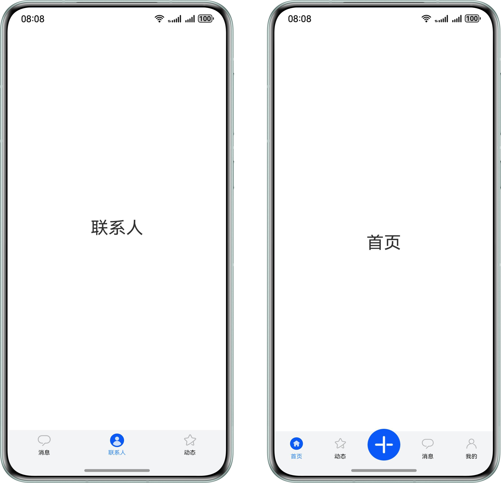

 
图2 **顶部导航效果示意图**
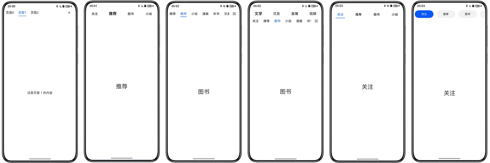

 
图3 **侧边导航效果示意图

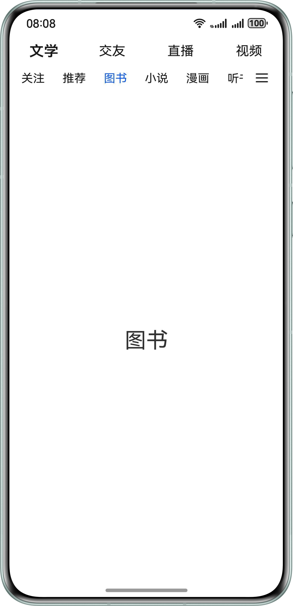

 
 

#### 底部导航

 

#### 基础底部导航

基础底部导航属于常规导航，一般以图标加文字的形式展示。
 

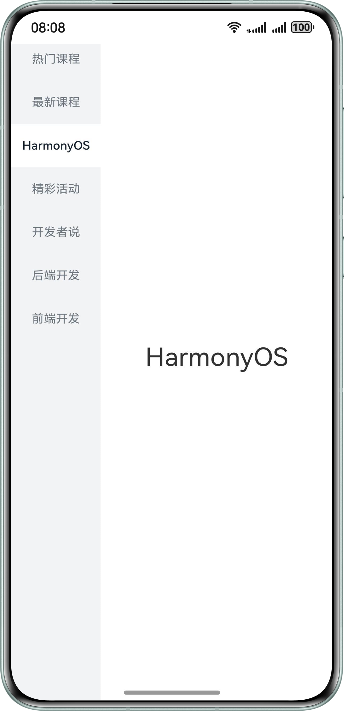

 1. 使用Tabs组件，设置barPosition为BarPosition.End控制导航条底部展示。Tabs组件嵌套tabContentBuilder自定义组件。
```ArkTS
build() {
  Tabs({
    barPosition: BarPosition.End,
    controller: this.tabsController
  }) {
    this.tabContentBuilder($r('app.string.message'),
      Constants.TAB_INDEX_ZERO, $r('app.media.activeMessage'), $r('app.media.message'))
    this.tabContentBuilder($r('app.string.people'),
      Constants.TAB_INDEX_ONE, $r('app.media.activePeople'), $r('app.media.people'))
    this.tabContentBuilder($r('app.string.activity'),
      Constants.TAB_INDEX_TWO, $r('app.media.activeStar'), $r('app.media.star'))
  }
  .width('100%')
  .backgroundColor('#F3F4F5')
  .barHeight(52)
  .barMode(BarMode.Fixed)
  .onAnimationStart((index: number, targetIndex: number) => {
    hilog.info(0x0000, 'index', index.toString());
    this.currentIndex = targetIndex;
  })
}
```

2. tabContentBuilder自定义组件嵌套TabContent组件实现内容区，并设置tabBar属性实现导航条。
```ArkTS
@Builder
tabContentBuilder(text: Resource, index: number, selectedImg: Resource, normalImg: Resource) {
  TabContent() {
    Row() {
      Text(text)
        .height(300)
        .fontSize(30)
    }
    .width('100%')
    .justifyContent(FlexAlign.Center)
  }
  .padding({ left: 12, right: 12 })
  .backgroundColor(Color.White)
  .tabBar(this.tabBuilder(text, index, selectedImg, normalImg))
}
```

3. 导航布局代码如下所示：
```ArkTS
@Builder
tabBuilder(title: Resource, index: number, selectedImg: Resource, normalImg: Resource) {
  Column() {
    if (index === 0) {
      Badge({
        count: this.msgNum,
        style: { badgeSize: 14 },
        maxCount: 999,
        position: BadgePosition.RightTop
      }) {
        Image(this.currentIndex === index ? selectedImg : normalImg)
          .width(24)
          .height(24)
          .objectFit(ImageFit.Contain)
      }
      .width(30)
    } else if (index === 1) {
      Image(this.currentIndex === index ? selectedImg : normalImg)
        .width(24)
        .height(24)
        .objectFit(ImageFit.Contain)
    } else {
      Badge({
        value: '',
        style: { badgeSize: 6 },
        position: BadgePosition.RightTop
      }) {
        Image(this.currentIndex === index ? selectedImg : normalImg)
          .width(24)
          .height(24)
          .objectFit(ImageFit.Contain)
      }
      .width(30)
    }

    Text(title)
      .margin({ top: 4 })
      .fontSize(10)
      .fontColor(this.currentIndex === index ? '#3388ff' : '#E6000000')
  }
  .justifyContent(FlexAlign.Center)
  .height(52)
  .width('100%')
  .onClick(() => {
    this.currentIndex = index;
    this.tabsController.changeIndex(this.currentIndex);
  })
}
```

 
 

#### 舵式底部导航

舵式导航是基础底部导航的一种扩展，中间按钮一般为核心功能，并且在设计效果上中心图标可以超出导航条的高度，两侧为普通操作按钮。
 

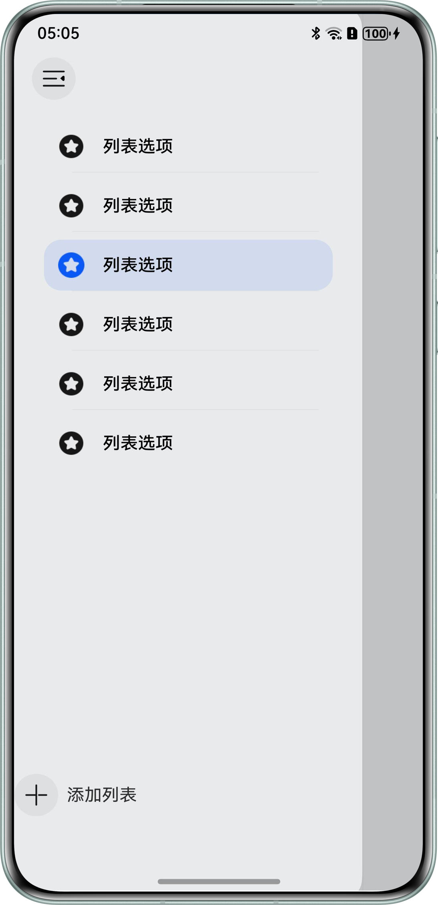

 1. 使用Tabs组件，设置barPosition为BarPosition.End控制导航条底部展示。Tabs组件嵌套TabContent组件实现内容区。
```ArkTS
Tabs({ barPosition: BarPosition.End, controller: this.controller }) {
  ForEach(this.tabArray, (item: BottomTabModel, index: number) => {
    if (index === Constants.TAB_INDEX_TWO) {
      TabContent()
      .backgroundColor(Color.White)
    } else {
      TabContent() {
        Row() {
          Text(item.title)
            .fontSize(30)
        }
        .height(300)
        .width('100%')
        .justifyContent(FlexAlign.Center)
      }
      .backgroundColor(Color.White)
    }
  }, (item: BottomTabModel, index: number) => JSON.stringify(item) + index)
}
```

2. 导航条通过自定义布局实现，替代tabBar属性设置。
```ArkTS
Flex() {
  ForEach(this.tabArray, (item: BottomTabModel, index: number) => {
    this.Tab(item.selectImage, item.defaultImage, item.title, item.middleMode, index)
  }, (item: BottomTabModel, index: number) => JSON.stringify(item) + index)
}
```

3. 实现导航条布局，通过offset控制中心图标与两侧图标的位置。
```ArkTS
@Builder
Tab(selectImage: Resource, defaultImage: Resource, title: string | Resource, middleMode: boolean, index: number) {
  Column() {
    if (index === Constants.TAB_INDEX_TWO) {
      Image(defaultImage)
        .size({ width: 56, height: 56 })
        .offset({ y: -15 })
    } else {
      Image(this.currentIndex === index ? selectImage : defaultImage)
        .size({ width: 22, height: 22 })
        .offset({
          y: (this.currentIndex === index && this.currentIndex !== Constants.TAB_INDEX_TWO)
            ? this.iconOffset : this.initNumber
        })
        .objectFit(ImageFit.Contain)
        .animation({
          duration: Constants.ANIMATION_DURATION,
          curve: Curve.Ease,
          playMode: PlayMode.Normal
        })
    }

    if (!middleMode) {
      Text(title)
        .fontSize(10)
        .margin({ top: 6 })
        .fontColor(this.currentIndex === index ? '#3388ff' : '#E6000000')
    }
  }
  .padding({ top: 11 })
  .width('100%')
  .backgroundColor('#F3F4F5')
  .height(90)
  .translate({ y: 40 })
  .onClick(() => {
    if (index !== Constants.TAB_INDEX_TWO) {
      this.currentIndex = index;
      this.controller.changeIndex(index);
      this.iconOffset = Constants.ICON_Offset;
    }
  })
}
```

 
 

#### 顶部导航

 

#### 居左对齐样式

居左对齐导航属于常规导航，由于Tabs组件导航只能居中展示，无法通过tabBar属性设置导航条。为实现居左对齐样式，可使用自定义布局替代tabBar控制按钮对齐方向。
 

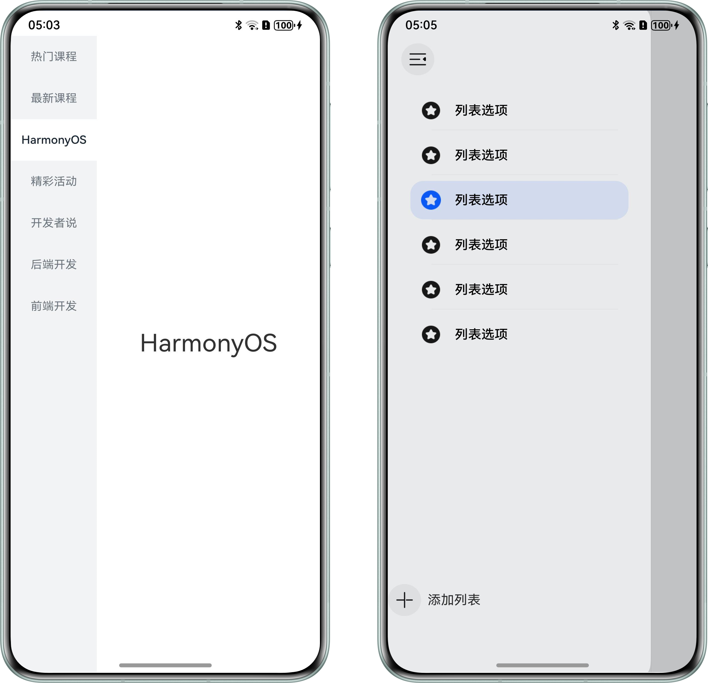

 1. Stack组件中嵌套Row组件和Column组件，实现导航条文字和下划线两部分。
```ArkTS
Stack({ alignContent: Alignment.TopStart }) {
  // The text of tab.
  Row() {
    ForEach(this.tabArray, (item: number, index: number) => {
      this.tab(this.tabStr + item, item, index);
    }, (item: number, _index: number) => item.toString())
    Blank()
    Text('+')
      .width(24)
      .height(24)
      .fontSize(24)
      .textAlign(TextAlign.Center)
      .margin({ right: 24 })
  }
  .justifyContent(FlexAlign.Start)
  .width('100%')

  // The underline of tab.
  Column()
    .width(this.indicatorWidth)
    .height(1.5)
    .backgroundColor('#0A59F7')
    .borderRadius(1)
    .margin({ left: this.indicatorLeftMargin, top: 35 })

}
.height(56)
.margin({ left: this.tabLeftOffset })
```

2. 在onAreaChange()中计算当前激活Tab距离屏幕左侧的偏移量，赋值给indicatorLeftMargin变量，控制下划线的位置。
```ArkTS
@Builder
tab(tabName: string, _tabItem: number, tabIndex: number) {
  Row() {
    Text(tabName)
      .fontSize(16)
      .lineHeight(22)
      .fontColor(tabIndex === this.currentIndex ? '#0A59F7' : '#E6000000')
      .id(tabIndex.toString())
      .onAreaChange((_, newValue: Area) => {
        if (this.currentIndex === tabIndex && (this.indicatorLeftMargin === 0 || this.indicatorWidth === 0)) {
          let positionX: number;
          let width: number = Number.parseFloat(newValue.width.toString());
          if (newValue.position.x !== undefined) {
            positionX = Number.parseFloat(newValue.position.x?.toString())
            this.indicatorLeftMargin = Number.isNaN(positionX) ? 0 : positionX;
          }
          this.indicatorWidth = width;
        }
      })
  }
  .justifyContent(FlexAlign.Center)
  .constraintSize({ minWidth: 35 })
  .width(64)
  .height(35)
  .onClick(() => {
    this.controller.changeIndex(tabIndex);
    this.currentIndex = tabIndex;
  })
}
```

3. 在点击页签过程中，实时计算选中页签距离左侧的偏移量和页签的宽度，并更新下划线的位置和宽度。
```ArkTS
.onAnimationStart((_index: number, targetIndex: number, _event: TabsAnimationEvent) => {
      this.currentIndex = targetIndex;
      let targetIndexInfo = this.getTextInfo(targetIndex);
      this.startAnimateTo(this.animationDuration, targetIndexInfo.left, targetIndexInfo.width);
    })
private getTextInfo(index: number): Record<string, number> {
  let modePosition: componentUtils.ComponentInfo | null = null;
  try {
    modePosition = this.getUIContext().getComponentUtils().getRectangleById(index.toString());
  } catch (error) {
    hilog.error(0x0000, 'testTag',`getRectangleById failed, Code:${error.code}, message:${error.message}`);
  }
  return { 'left': this.getUIContext().px2vp(modePosition?.windowOffset.x), 'width': this.getUIContext().px2vp(modePosition?.size.width) };
}

private startAnimateTo(duration: number, leftMargin: number, width: number) {
  this.getUIContext().animateTo({
    duration: duration,
    curve: Curve.Linear,
    iterations: 1,
    playMode: PlayMode.Normal,
  }, () => {
    this.indicatorLeftMargin = leftMargin;
    this.indicatorWidth = width;
  })
}
```

4. 在左右滑动页面过程中，当滑动距离超出屏幕宽度一半时，更新下划线的位置和宽度。
```ArkTS
.onGestureSwipe((index: number, event: TabsAnimationEvent) => {
      let currentIndicator = this.getCurrentIndicatorInfo(index, event);
      this.currentIndex = currentIndicator.index;
      this.indicatorLeftMargin = currentIndicator.left;
      this.indicatorWidth = currentIndicator.width;
    })

private getCurrentIndicatorInfo(index: number, event: TabsAnimationEvent): Record<string, number> {
  let nextIndex = index;
  if (index > 0 && event.currentOffset > 0) {
    // swipe to left.
    nextIndex--;
  } else if (index < this.tabArray.length - 1 && event.currentOffset < 0) {
    // swipe to right.
    nextIndex++;
  } else {
    // error condition.
    hilog.info(0x0000, 'leftTab', 'the index is out of boundary: %{public}s', index);
  }
  let indexInfo = this.getTextInfo(index);
  let nextIndexInfo = this.getTextInfo(nextIndex);

  let swipeRatio = Math.abs(event.currentOffset / this.tabsWidth);
  let currentIndex = swipeRatio > 0.5 ? nextIndex : index;
  let currentIndicatorLeft: number = indexInfo.left + (nextIndexInfo.left - indexInfo.left) * swipeRatio;
  let currentIndicatorWidth: number = indexInfo.width + (nextIndexInfo.width - indexInfo.width) * swipeRatio;
  return { 'index': currentIndex, 'left': currentIndicatorLeft, 'width': currentIndicatorWidth };
}
```

 
 

#### 可滑动居左对齐样式

可滑动导航样式在居左对齐基础上增加滑动功能，适合页签数较多场景。
 

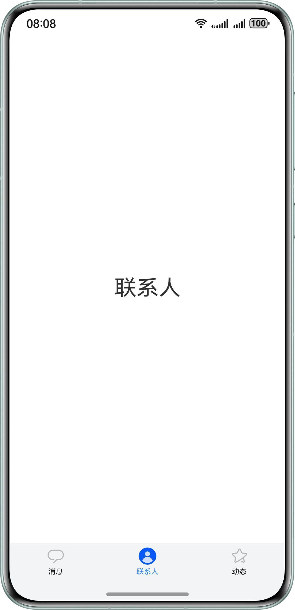

 
实现方式与居左对齐样式相同，唯一区别在于导航布局中嵌套List组件实现可滑动效果。
 
```ArkTS
Row() {
  List({ initialIndex: 0, scroller: this.listScroller }) {
    ForEach(this.tabArray, (item: TabItem, index: number) => {
      this.Tab(item.name, index)
    }, (item: TabItem, index: number) => JSON.stringify(item) + index)
  }
  .listDirection(Axis.Horizontal)
  .height(30)
  .scrollBar(BarState.Off)
  .width('85%')
  .friction(0.6)
  .onWillScroll((xOffset: number) => {
    this.indicatorLeftMargin -= xOffset;
  })

  Image($r('app.media.more'))
    .width(20)
    .height(15)
    .margin({ left: 16 })
}
.height(52)
.width('100%')
```
 
 

#### 下划线样式

下划线导航样式属于常规导航，以文字加下划线的形式展示。
 

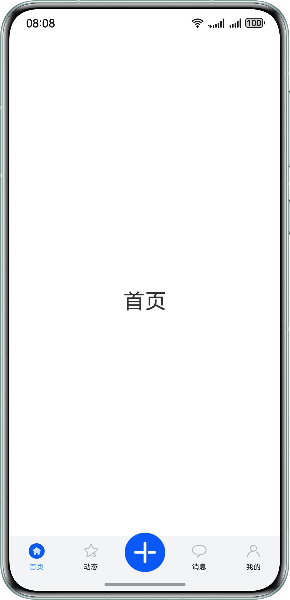

 1. 使用Tabs组件，设置barPosition为BarPosition.Start控制导航条顶部展示。通过tabBar属性和Builder装饰器实现导航。
```ArkTS
Tabs({ barPosition: BarPosition.Start }) {
  ForEach(this.tabArray.slice(0, 4), (item: TabItem) => {
    TabContent() {
      Row() {
        Text(item.name)
          .height(300)
          .fontSize(30)
      }
      .width('100%')
      .justifyContent(FlexAlign.Center)
      .height('100%')
    }.tabBar(this.tabBuilder(item.id, item.name))
  }, (item: TabItem, index: number) => JSON.stringify(item) + index)
}
```

2. 使用Divider组件实现下划线。
```ArkTS
@Builder
tabBuilder(index: number, name: string | Resource) {
  Column() {
    Text(name)
      .fontColor(this.currentIndex === index ? '#0A59F7' : '#E6000000')
      .fontSize(16)
      .fontWeight(this.currentIndex === index ? FontWeight.Normal : FontWeight.Medium)
      .lineHeight(22)
      .margin({ top: 17, bottom: 7 })
    Divider()
      .width(48)
      .strokeWidth(Constants.STROKE_WIDTH)
      .color('#0A59F7')
      .opacity(this.currentIndex === index ? 1 : 0)
  }
}
```

 
 

#### 背景高亮式

背景高亮导航样式属于常规导航，通过背景色突出选中页签。
 

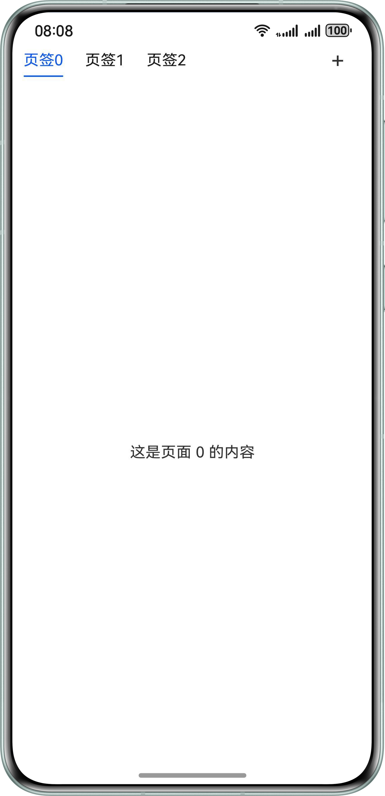

 1. 使用Tabs组件，设置barPosition为BarPosition.Start控制导航条顶部展示。通过自定义布局实现导航背景高亮样式。
```ArkTS
Tabs({ barPosition: BarPosition.Start, controller: this.controller }) {
  ForEach(this.tabArray.slice(0, 6),
    (item: TabItem) => {
      TabContent() {
        Row() {
          Text(item.name)
            .height(300)
            .fontSize(30)
        }
        .width('100%')
        .justifyContent(FlexAlign.Center)
      }
      .backgroundColor(Color.White)
    }, (item: TabItem, index: number) => JSON.stringify(item) + index)
}
.width('100%')
```

2. 使用List组件实现可滑动效果。
```ArkTS
List({ scroller: this.listScroller }) {
  ForEach(this.tabArray.slice(0, 6),
    (item: TabItem, index: number) => {
      this.tabBuilder(item.name, index);
    }, (item: TabItem, index: number) => JSON.stringify(item) + index)
}
```

3. 其中在tabBuilder组件中判断tab的索引值与激活tab索引是否相同，控制背景色的变化。
```ArkTS
@Builder
tabBuilder(tabName: string | Resource, tabIndex: number) {
  Row() {
    Text(tabName)
      .fontSize(14)
      .fontColor(tabIndex === this.focusIndex ? Color.White : '#E6000000')
      .id(tabIndex.toString())
  }
  .justifyContent(FlexAlign.Center)
  .width(96)
  .backgroundColor(tabIndex === this.focusIndex ? '#0A59F7' : '#0D000000')
  .borderRadius(21)
  .height(40)
  .margin({ left: 8, right: 8 })
  .onClick(() => {
    this.controller.changeIndex(tabIndex);
    this.listScroller.scrollToIndex(tabIndex, true, ScrollAlign.CENTER);
  })
}
```

 
 

#### 文字缩放式

文字缩放式导航样式属于常规导航，通过字体加粗放大突出选中页签。
 

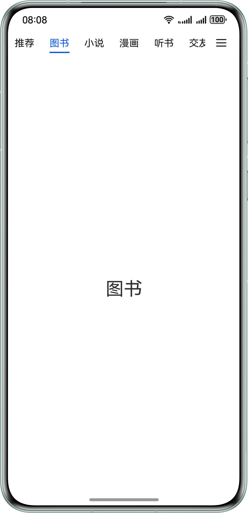

 1. 使用Tabs组件，设置barPosition为BarPosition.Start。通过tabBar属性和Builder装饰器实现导航。
```ArkTS
Tabs({ barPosition: BarPosition.Start }) {
  ForEach(this.tabArray.slice(0, 4), (item: TabItem) => {
    TabContent() {
      Row() {
        Text(item.name)
          .height(300)
          .fontSize(30)
      }
      .width('100%')
      .justifyContent(FlexAlign.Center)
      .height('100%')
    }.tabBar(this.tabBuilder(item.id, item.name))
  }, (item: TabItem, index: number) => JSON.stringify(item) + index)
}
```

2. 其中在tabBuilder组件判断tab的索引值与选中tab索引是否相同，控制字体大小的变化。
```ArkTS
@Builder
tabBuilder(index: number, name: string | Resource) {
  Text(name)
    .fontColor(Color.Black)
    .fontSize(this.currentIndex === index ? 20 : 16)
    .fontWeight(this.currentIndex === index ? 600 : FontWeight.Normal)
    .lineHeight(22)
    .id(index.toString())
}
```

 
 

#### 双层嵌套式

双层嵌套样式拥有两层导航，外层嵌套内层，与单层导航相比可以容纳更多页签。
 

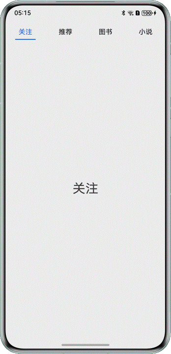

 
外层导航通过在TabContent组件设置tabBar属性，其中TabContent中嵌套List和子级Tabs。List组件嵌套subTabBuilder自定义组件实现内层导航。子级Tabs组件嵌套TabContent组件实现内容区。
 
```ArkTS
@Builder
subTabBuilder(tabName: string | Resource, tabIndex: number) {
  Row() {
    Text(tabName)
      .fontSize(16)
      .fontColor(tabIndex === this.focusIndex ? '#0A59F7' : '#E6000000')
      .id(tabIndex.toString())
  }
  .justifyContent(FlexAlign.Center)
  .padding({ left: 12, right: 12 })
  .height(30)
  .onClick(() => {
    this.subController.changeIndex(tabIndex);
    this.focusIndex = tabIndex;
  })
}
      TabContent() {
        Column() {
          Column() {
            Row() {
              List({ initialIndex: Constants.TAB_INDEX_ZERO, scroller: this.listScroller }) {
                ForEach(this.tabArray, (item: TabItem, index: number) => {
                  this.subTabBuilder(item.name, index)
                }, (item: TabItem, index: number) => JSON.stringify(item) + index)
              }
              .listDirection(Axis.Horizontal)
              .height(30)
              .scrollBar(BarState.Off)
              .width('85%')
              .friction(0.6)

              Image($r('app.media.more'))
                .width(20)
                .height(15)
                .margin({ left: 16 })
            }
            .height(25)
            .width('100%')
          }
          .alignItems(HorizontalAlign.Center)
          .width('100%')
          .padding({ left: 4 })
          Tabs({ barPosition: BarPosition.Start, controller: this.subController }) {
            // ...
          }
          .barHeight(0)
          .animationDuration(Constants.ANIMATION_DURATION)
          .onAnimationStart((index: number, targetIndex: number) => {
            hilog.info(0x0000, 'index', index.toString());
            this.focusIndex = targetIndex;
            this.listScroller.scrollToIndex(targetIndex, true, ScrollAlign.CENTER);
          })
        }
      }
      .tabBar(this.tabBuilder(Constants.TAB_INDEX_ZERO, this.topTabData[Constants.TAB_INDEX_ZERO]))
```
 
 

#### 侧边导航

 

#### 基础侧边导航

属于侧边导航类，通过List去实现左侧导航条区域。
 

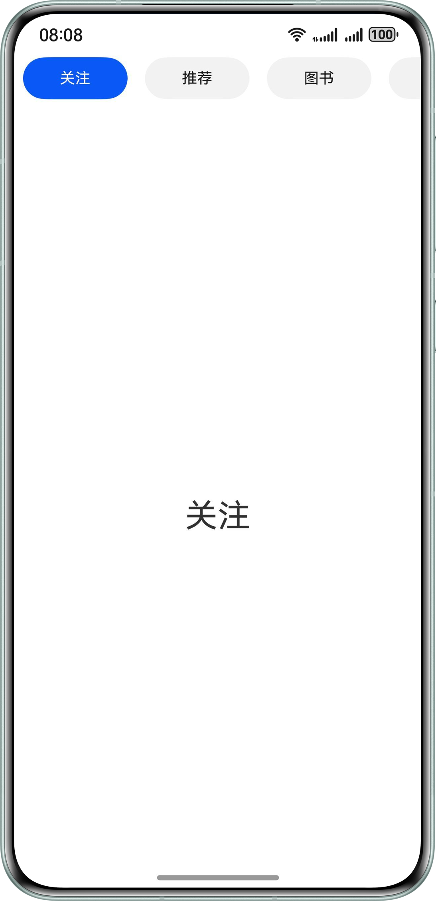

 
基础侧边导航使用左右布局：左侧通过List组件与ListItem组件实现导航布局，右侧实现导航内容区。
 
```ArkTS
List({ scroller: this.classifyScroller }) {
  ForEach(this.ClassifyArray, (item: ClassifyModel, index?: number) => {
    ListItem() {
      ClassifyItem({
        classifyName: item.classifyName,
        isSelected: this.currentClassify === index,
        onClickAction: () => {
          if (index !== undefined) {
            this.classifyChangeAction(index, true);
          }
        }
      })
    }
  }, (item: ClassifyModel, index: number) => JSON.stringify(item) + index)
}
.height('110%')
.width('27.8%')
.backgroundColor($r('app.color.side_background_color'))
.scrollBar(BarState.Off)
.margin({ top: 74 })

Column() {
  ForEach(this.ClassifyArray, (item: ClassifyModel, index: number) => {
    Text(this.currentClassify === index ? item.classifyName : '')
      .fontSize(30)
  },(item: ClassifyModel, index: number) => JSON.stringify(item) + index)
}
.width('72.2%')
```
 
 

#### 抽屉式侧边导航

抽屉式导航属于侧边导航类，核心思路是“隐藏”，点击入口或侧滑可以像“抽屉”一样拉出菜单。
 

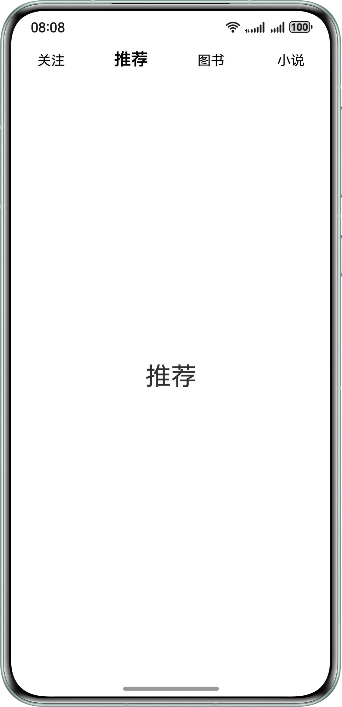

 1. 使用[SideBarContainer组件](https://developer.huawei.com/consumer/cn/doc/harmonyos-references/ts-container-sidebarcontainer#示例)实现侧边导航，并且通过设置该组件的showSideBar控制显示隐藏。在SideBarContainer实现左侧导航样式和右侧内容区。controlButton属性控制侧边导航按钮位置。
```ArkTS
SideBarContainer(SideBarContainerType.Overlay) {
  Column() {
    // ...
  }
  .height('100%')
  .padding({ top: 104 })
  .backgroundColor('#E9EAEC')
  .width(272)
  .height(344)
  .backgroundColor(Color.White)
  .borderRadius(20)
  Column() {
    // ...
  }
  .onClick(() => {
    this.getUIContext().animateTo({
      duration: Constants.ANIMATION_DURATION,
      curve: Curve.EaseOut,
      playMode: PlayMode.Normal,
    }, () => {
      this.show = false;
    })
  })
  .width('100%')
  .height('110%')
  .backgroundColor(this.show ? '#c1c2c4' : '')
}
.showSideBar(this.show)
.controlButton({
  left: 16,
  top: 48,
  height: 40,
  width: 40,
  icons: {
    shown: $r('app.media.changeBack'),
    hidden: $r('app.media.change'),
    switching: $r('app.media.change')
  }
})
.onChange((value: boolean) => {
  this.show = value;
})
```

2. 左侧导航使用Image和Text实现图标加文字的效果。
```ArkTS
Column() {
  ForEach(this.navList, (item: number, index: number) => {
    Column() {
      Row() {
        Image(this.active === item ? $r('app.media.activeList') : $r('app.media.list'))
          .width(24)
          .height(24)
        Text($r('app.string.list_name'))
          .fontSize(16)
          .fontColor(Color.Black)
          .fontWeight(FontWeight.Medium)
          .margin({ left: 17 })
      }
      .height(48)
      .width('100%')

      if (this.navList.length - 1 !== index) {
        Row()
          .height(0.5)
          .backgroundColor('#0D000000')
          .width('90%')
      }
    }
    .onClick(() => {
      this.active = item;
    })
    .margin({
      top: 4,
      left: 4,
      right: 4,
      bottom: 4
    })
    .justifyContent(FlexAlign.Center)
    .width(264)
    .height(48)
    .padding({ left: 13 })
    .borderRadius(16)
    .backgroundColor(this.active === item ? '#1A0A59F7' : '')
  }, (item: number, index: number) => JSON.stringify(item) + index)

  Row() {
    Image($r('app.media.add'))
      .width(40)
      .height(40)
    Text($r('app.string.add_list')).margin({ left: 8 })
  }
  .width('100%')
  .margin({ top: 284 })
}
.height('100%')
.padding({ top: 104 })
.backgroundColor('#E9EAEC')
.width(272)
.height(344)
.backgroundColor(Color.White)
.borderRadius(20)
```

 
 

#### 示例代码

- [基于Tabs组件实现常见导航样式](https://gitcode.com/harmonyos_samples/multi-tab-navigation)
