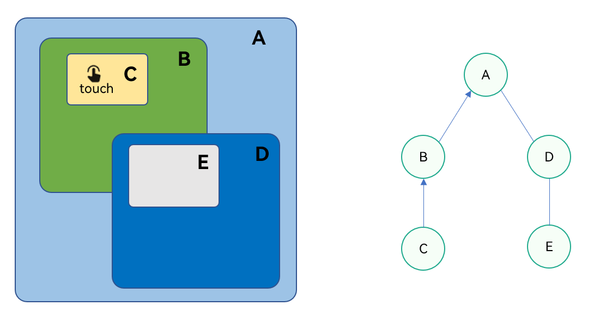
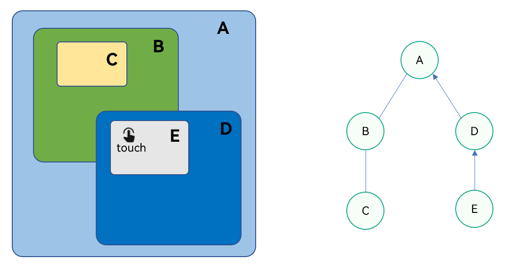
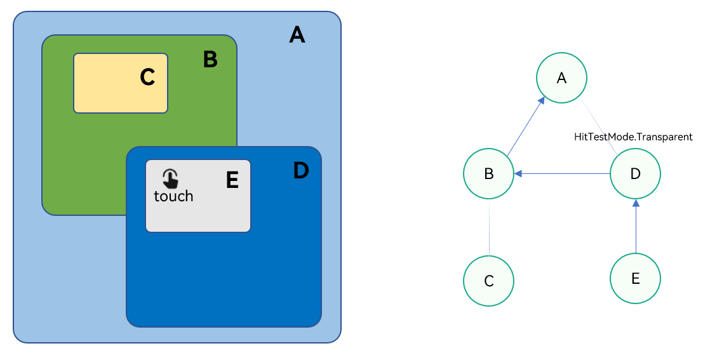
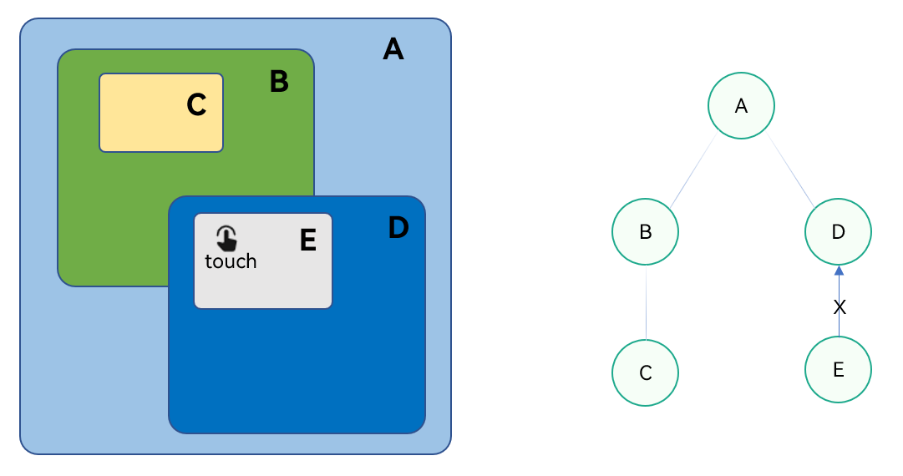
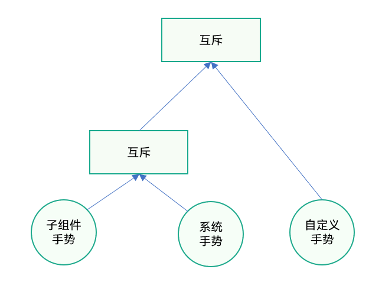
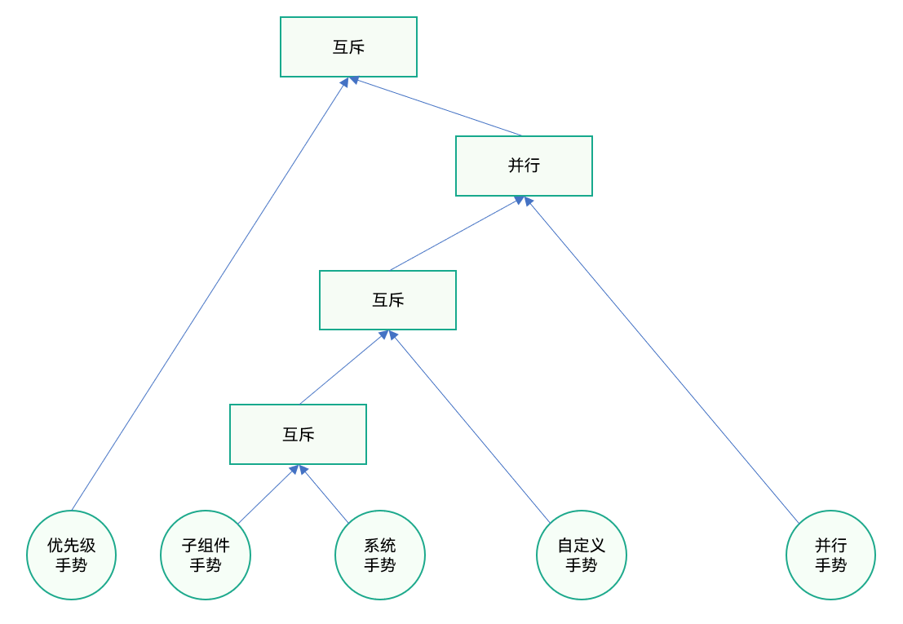

# 手势事件冲突解决方案

更新时间：2026-05-22 09:46:30

来源：https://developer.huawei.com/consumer/cn/doc/best-practices/bpta-gestures-practice

**   


#### 概述

在复杂的应用界面中，多个组件嵌套时同时绑定手势事件，或者同一个组件同时绑定多个手势，都有可能导致手势事件产生冲突，达不到用户的预期效果。
 
本文从事件响应的机制入手，介绍手势触发的基本流程，以及如何响应手势事件，了解背后的执行原理，并用来解决冲突问题等。主要包括以下内容：
 
- 事件响应链收集
- 手势响应优先级
- 手势响应控制
- 常见手势冲突问题

 
 

#### 事件响应链收集

在HarmonyOS开发中，[触摸事件](https://developer.huawei.com/consumer/cn/doc/harmonyos-references/ts-universal-events-touch)（onTouch事件）是用户与设备交互的基础，是所有手势事件组成的基础，有Down，Move，Up，Cancel四种[触摸事件的类型](https://developer.huawei.com/consumer/cn/doc/harmonyos-references/ts-appendix-enums#touchtype)。手势均由触摸事件组成，例如，点击为Down+Up，滑动为Down+一系列Move+Up。
 
触摸事件的分发由触摸测试（TouchTest）结果决定，其结果会直接决定哪些控件的事件加入事件响应链（事件响应成员组成的链表），并最终按照响应链顺序判定是否消费。因此了解触摸事件的响应链收集过程，有助于开发者处理手势事件冲突问题。
 
ArkUI事件响应链收集，根据右子树（按组件布局的先后层级）优先的后序遍历流程。下面通过一个示例来介绍响应链收集的流程，示例伪代码如下：
 
```text
build() {
  StackA() {
    ComponentB() {
      ComponentC()
    }

    ComponentD() {
      ComponentE()
    }
  }
}
```
 
其中A是最外层组件，B和D是A的子组件，C是B的子组件，E是D的子组件。界面效果示例以及组件树结构图如下：
 


 
用户触摸的动作如果发生在组件C上，事件响应链收集的流程如下，根据右子树（按组件布局的先后层级）优先的后序遍历流程，因为触摸点不在右边的树上，所以事件会从左边树的C节点开始往上传，触摸事件（onTouch事件）是冒泡事件默认会向上一直传递下去，直到被消费或者丢弃，允许多个组件同时触发。最终收集到的响应链是C->B->A。
 



 
用户触摸的动作如果发生在组件E上，事件响应链收集的流程如下，根据右子树优先的后序遍历流程，所以事件会从右边树的D节点开始往上传。虽然触摸点在组件D和组件B的交集上，但组件D的[hitTestBehavior](https://developer.huawei.com/consumer/cn/doc/harmonyos-references/ts-universal-attributes-hit-test-behavior)属性默认为HitTestMode.Default，D组件收集到事件后会阻塞兄弟节点（组件B），所以没有收集组件A的左子树，最终收集到的响应链是E->D->A。
 



 
上面介绍的事件响应链是系统默认的行为，如果需要改变响应的成员，比如触摸组件E的时候，希望把事件传递给B，该怎么实现呢？开发者可以通过设置D组件的hitTestBehavior属性为HitTestMode.None或者HitTestMode.Transparent来实现，比如设置为HitTestMode.Transparent，那么组件D自身进行触摸测试，同时不阻塞兄弟及父组件。最终收集到的响应链是E->D->B->A。
 



 
又例如触摸E组件的时候，只希望E响应触摸事件，不让其它组件响应触摸事件。可以通过[TouchEvent](https://developer.huawei.com/consumer/cn/doc/harmonyos-references/ts-universal-events-touch#touchevent对象说明)的stopPropagation()方法来阻止事件冒泡，阻止触摸事件往上传递；也可以通过设置E组件的hitTestBehavior属性为HitTestMode.Block来实现，那么最终收集到的响应链成员只有组件E。
 



 
除了hitTestBehavior和stopPropagation，影响事件响应链的更多因素可以参考：[触摸测试控制](https://developer.huawei.com/consumer/cn/doc/harmonyos-references/ts-universal-attributes-hit-test-behavior)。
 
 

#### 手势响应

前面根据事件响应链收集，确定了响应链成员和事件响应的顺序。然而往往在处理一些业务的时候，需要给组件/不同组件添加更多的手势和事件，比如onClick、API手势gesture 等等，那么哪个事件会得到响应呢？这就需要了解手势响应的优先级了，本节将主要介绍手势的优先级和手势的控制。
 
 

#### 手势响应优先级

手势按是否为系统手势，可以分为以下两类：
 
- 系统手势：系统控件默认实现的手势（系统内置手势），即调用某些通用事件内置的手势，比如拖拽，onClick；比如bindMenu内置的点击事件，bindContextMenu内置的长按手势。
- 自定义手势：通过绑定手势API，例如使用gesture声明的事件回调，绑定长按手势事件方法。

 
除了触摸事件（onTouch事件）外的所有手势与事件，均是通过基础手势或者组合手势实现的。例如，拖拽事件是由长按手势和滑动手势组成的一个顺序手势。
 
在默认情况下，这些手势为非冒泡事件，当父组件和子组件绑定同类型的手势时，父子组件绑定的手势事件会发生竞争，子组件会优先识别绑定的手势。
 
因此，除非显式声明允许多个手势同时成功，否则同一时间只会有一个手势响应。
 1. 当父子组件均绑定同一类手势时，子组件优先于父组件触发。
2. 当同一个组件同时绑定多个手势时，先达到手势触发条件的手势优先触发。
3. 当同一个组件绑定相同事件类型的系统手势和自定义手势时，系统手势会优先响应。比如自定义手势TapGesture和系统手势onClick都是单击事件，但是会优先响应onClick事件。
 
图1 **手势响应优先级（从左至右，优先级由高到低）
 



 
 

#### 手势响应控制

上面介绍了手势默认的优先级顺序，在父子组件嵌套时，父子组件均绑定了手势或事件，或者同一个组件同时绑定多个手势时，根据业务逻辑可能需要对手势是否需要响应、分发给谁响应、响应的顺序等做出控制。那么有哪些控制手段呢？下面列举了一些手势响应的控制方法。
 
1 手势绑定
 
[**绑定手势方法**](https://developer.huawei.com/consumer/cn/doc/harmonyos-guides/arkts-gesture-events-binding)
 
设置绑定手势的方法可以实现在多层级场景下，当父组件与子组件绑定了相同的手势时，设置不同的绑定手势方法有不同的响应优先级。手势绑定支持常规手势绑定方法（gesture）、带优先级手势绑定方法（priorityGesture）、并行手势绑定方法（parallelGesture）。
  
| 绑定手势方法 | 功能规格 | 配参1 | 配参2 | 约束 |
| --- | --- | --- | --- | --- |
| gesture | 绑定手势事件，父子组件交叠区域均绑定，响应子组件 | GestureType | GestureMask | 与通用事件抢占 |
| priorityGesture | 当父组件配置priorityGesture时，优先识别父组件priorityGesture绑定的手势。 | GestureType | GestureMask | 与通用事件抢占 |
| parallelGesture | 父组件绑定parallelGesture时，父子组件相同的手势事件都可以触发 | GestureType | GestureMask | 无 |
 
 
前面讲到的手势的优先级是默认的，在加入了priorityGesture和parallelGesture绑定方法后，手势的响应顺序如下图所示：
 
**图2 **手势响应优先级（从左至右，优先级由高到低）
 



 

 
**GestureMask枚举说明**
  
| 名称 | 描述 |
| --- | --- |
| Normal | 不屏蔽子组件的手势，按照默认手势识别顺序进行识别。 |
| IgnoreInternal | 屏蔽子组件的手势，包括子组件上的系统内置的手势，如子组件为List组件时，内置的滑动手势同样会被屏蔽。 若父子组件区域存在部分重叠，则只会屏蔽父子组件重叠的部分。 |
 
 
**不同手势绑定参数方案规格**
  
| 父手势 | 子手势 | GestureMask（父） | 交叠区域相同事件响应方 | 交叠区域不同事件响应方 |
| --- | --- | --- | --- | --- |
| gesture | gesture | default | 子组件 | 各自响应 |
| gesture | gesture | IgnoreInternal | 父组件 | 父组件 |
| priorityGesture | gesture | default | 父组件 | 各自响应 |
| priorityGesture | gesture | IgnoreInternal | 父组件 | 父组件 |
| parallelGesture | gesture | default | 各自响应 | 各自响应 |
| parallelGesture | gesture | IgnoreInternal | 父组件 | 父组件 |
 
 
**[组合手势](https://developer.huawei.com/consumer/cn/doc/harmonyos-guides/arkts-gesture-events-combined-gestures)（GestureGroup）**
 
手势组合是指多种手势组合为复合手势，通过GestureGroup属性，可以给同一个组件添加多个手势，支持连续识别、并行识别和互斥识别模式。开发者可以根据业务需求，选择合适的组合模式。
  
| 接口 | 可选模式 | 描述 | 注册事件 |
| --- | --- | --- | --- |
| GestureGroup | Sequence | 手势顺序队列，需要按预定的手势组顺序执行，有一个失败则全部失败 | onCancel |
| GestureGroup | Parallel | 手势组合，直到所有已识别的手势执行完 | 无 |
| GestureGroup | Exclusive | 互斥识别，成功完成一个手势，则完成手势任务 | 无 |
 
 
2 [事件独占控制](https://developer.huawei.com/consumer/cn/doc/harmonyos-references/ts-universal-attributes-monopolize-events)
 
通过monopolizeEvents属性设置组件是否独占事件，事件范围包括组件自带的事件和开发者自定义的点击、触摸、手势事件。先响应事件的控件作为第一响应者，在手指离开屏幕前其他组件不会响应任何事件。
 
在一个窗口内，设置了独占控制的组件上的事件如果首先响应，则本次交互只允许此组件上设置的事件响应，窗口内其他组件上的事件不会响应。
 
如果开发者通过[parallelGesture](https://developer.huawei.com/consumer/cn/doc/harmonyos-references/ts-gesture-settings#parallelgesture)绑定了与子组件同时触发的手势，如[PanGesture](https://developer.huawei.com/consumer/cn/doc/harmonyos-references/ts-basic-gestures-pangesture)，子组件设置了独占控制且首个响应事件，则父组件的手势不会响应。
 
3 [自定义手势判定](https://developer.huawei.com/consumer/cn/doc/harmonyos-references/ts-gesture-customize-judge)
 
为组件提供自定义手势判定能力。开发者可根据需要，在手势识别期间，根据自己的业务逻辑来决定是否响应手势。使用[onGestureJudgeBegin](https://developer.huawei.com/consumer/cn/doc/harmonyos-references/ts-gesture-customize-judge#ongesturejudgebegin)方法对手势进行判定，开发者可以根据自身业务逻辑，选择是否响应自定义手势。
 
4 [手势拦截增强](https://developer.huawei.com/consumer/cn/doc/harmonyos-references/ts-gesture-blocking-enhancement)
 
为组件提供手势拦截能力。开发者可根据需要，将系统内置手势和响应链上更高优先级的手势做并行化处理，并可以动态控制手势事件的触发。
 
5 [responseRegion](https://developer.huawei.com/consumer/cn/doc/harmonyos-references/ts-universal-attributes-touch-target)和[hitTestBehavior](https://developer.huawei.com/consumer/cn/doc/harmonyos-references/ts-universal-attributes-hit-test-behavior)
 
[触摸测试](https://developer.huawei.com/consumer/cn/doc/harmonyos-guides/arkts-interaction-basic-principles#触摸测试)同样也可能会影响到手势的响应流程。例如responseRegion属性和hitTestBehavior属性可以控制Touch事件的分发，从而可以影响到onTouch事件和手势的响应。而绑定手势方法属性可以控制手势的竞争从而影响手势的响应，但不会影响到onTouch事件。
 
6 ArkUI组件自身的属性控制手势响应
 
ArkUI组件自身的属性，也可以对手势事件的响应做出控制。例如Grid、List、Scroll、Swiper、WaterFlow等滚动容器组件提供了nestedScroll属性，来解决和父组件的嵌套滚动的冲突问题；例如Swiper组件的[disableSwipe](https://developer.huawei.com/consumer/cn/doc/harmonyos-references/ts-container-swiper#disableswipe8)可以设置禁用组件滑动切换的功能；又例如List组件可以通过设置[enableScrollInteraction](https://developer.huawei.com/consumer/cn/doc/harmonyos-references/ts-container-list#enablescrollinteraction10)属性来设置是否支持手势滚动列表。
 
 

#### 常见手势冲突问题

前面列举了一些常用的手势响应的控制方法，接下来我们通过这些方法来解决以下一些常见的手势响应冲突问题。
 
 

#### 滚动容器嵌套滚动容器事件冲突

1 Scroll组件嵌套List组件滑动事件冲**突**
 
Scroll组件嵌套List组件，子组件List组件的滑动手势优先级高于父组件Scroll的滑动手势，所以当List列表滚动时，不会响应Scroll组件的滚动事件，List不会和Scroll一起滚动。如果需要List和Scroll组件同步滚动可以使用nestedScroll属性来解决，设置向前向后两个方向上的嵌套滚动模式，实现与父组件的滚动联动。
 
使用nestedScroll属性设置List组件的嵌套滚动方式，NestedScrollMode设置成SELF_FIRST时，List组件滚动到页面边缘后，父组件继续滚动。NestedScrollMode设置为PARENT_FIRST时，父组件先滚动，滚动至边缘后通知List组件继续滚动。示例代码如下：
 
```ArkTS
@Entry
@Component
struct GesturesConflictScene1 {
  build() {
    Scroll() {
      Column() {
        Column()
          .height('30%')
          .width('100%')
          .backgroundColor(Color.Blue)
        List() {
          ForEach([1, 2, 3, 4, 5, 6], (item: string) => {
            ListItem() {
              Text(item.toString())
                .height(300)
                .fontSize(50)
                .fontWeight(FontWeight.Bold)
            }
          }, (item: number) => item.toString())
        }
        .edgeEffect(EdgeEffect.None)
        .nestedScroll({
          scrollForward: NestedScrollMode.PARENT_FIRST,
          scrollBackward: NestedScrollMode.SELF_FIRST
        })
        .height('100%')
        .width('100%')
      }
    }
    .height('100%')
    .width('100%')
  }
}
```
 
2 List、Scroller等滚动容器嵌套Web组件，滑动事件冲突
 
比如List组件嵌套Web组件，当Web加载的网页中也包含滚动视图的时候，这时候上下滚动Web组件，不能和List列表整体一起滑动。这是因为Web的滑动事件和List组件的冲突，如果想让Web随List一起整体滚动，解决方案和前面的例子一样，给Web组件添加nestedScroll属性。
 
```ArkTS
Web(
  // ...
)
  .nestedScroll({
    scrollForward: NestedScrollMode.PARENT_FIRST,
    scrollBackward: NestedScrollMode.SELF_FIRST
  })
```
 
具体实现可以参考：[Web组件嵌套滚动](https://developer.huawei.com/consumer/cn/doc/harmonyos-guides/web-nested-scrolling)。
 
 

#### 使用组合手势同时绑定多个同类型手势冲突

例如给组件同时设置单击和双击的点击手势TapGesture，按如下方式设置会发现双击手势失效，这是因为在互斥识别的组合手势中，手势会按声明的顺序进行识别，若有一个手势识别成功，则结束手势识别。因为单击手势放在了前面，所以当双击的时候会优先识别了单击手势，单击成功后后面的双击回调就不会执行了。
 
```ArkTS
@Entry
@Component
struct GesturesConflictScene2 {
  @State count1: number = 0;
  @State count2: number = 0;

  build() {
    Column() {
      Text('Exclusive gesture\n' + 'Click count is:' + this.count1 + '\nDouble click count is:' + this.count2 + '\n')
        .fontSize(28)
    }
    .height(200)
    .width('100%')
    // The following gestures are mutually exclusive. After the gesture is successfully recognized, the gesture cannot be recognized by double-clicking
    .gesture(
      GestureGroup(GestureMode.Exclusive,
        TapGesture({ count: 1 })
          .onAction(() => {
            this.count1++;
          }),
        TapGesture({ count: 2 })
          .onAction(() => {
            this.count2++;
          })
      )
    )
  }
}
```
 
可以设置手势为并行识别来解决，设置对应的GestureMode为Parallel：
 
```ArkTS
.gesture(
  GestureGroup(GestureMode.Parallel,
    TapGesture({ count: 2 })
      .onAction(() => {
        this.count2++;
      }),
    TapGesture({ count: 1 })
      .onAction(() => {
        this.count1++;
      })
  )
)
```
 
 

#### 系统手势和自定义手势之间冲突

对于一般同类型的手势，系统手势优先于自定义手势执行，可以通过priorityGesture或者parallelGesture的方式来绑定自定义手势**，**例如下面这个示例**：**
 
图片长按手势响应失败或冲突，在Image控件上添加长按手势后，长按图片无法响应对应方法，而是图片放大的动画，示例代码如下：
 
```ArkTS
@Entry
@Component
struct GesturesConflictScene3 {
  @State message: string = 'Hello World';

  build() {
    Row() {
      Column() {
        Text(this.message)
          .fontSize(50)
          .fontWeight(FontWeight.Bold)
        Image($r('app.media.startIcon'))
          .margin({ top: 100 })
          .width(360)
          .height(360)
          .gesture(
            LongPressGesture({ repeat: true })
              .onAction((event: GestureEvent) => {
              })
              // The long press action ends
              .onActionEnd(() => {
                try {
                  this.getUIContext().getPromptAction().showToast({ message: 'Long Press' });
                } catch (err) {
                  let error = err as BusinessError;
                  hilog.error(0x0000, 'testTag', `showToast err, code: ${error.code}, mesage: ${error.message}`);
                }
              })
          )
      }
      .width('100%')
    }
    .height('100%')
  }
}
```
 
这是因为Image组件内置的长按动画和用户自定义的长按手势LongPressGesture冲突了。可以使用priorityGesture绑定手势的方式替代gesture的方式，这样就会只响应自定义手势LongPressGesture了。如果需要两者都执行可以使用parallelGesture的绑定方式。
 
```ArkTS
.priorityGesture(
  LongPressGesture({ repeat: true })
    .onAction((event: GestureEvent) => {
    })
    .onActionEnd(() => {
      try {
        this.getUIContext().getPromptAction().showToast({ message: 'Long Press' });
      } catch (err) {
        let error = err as BusinessError;
        hilog.error(0x0000, 'testTag', `showToast err, code: ${error.code}, mesage: ${error.message}`);
      }
    })
  )
```
 
 

#### 手势事件透传

和触摸事件一样，手势事件也可以通过hitTestBehavior属性来进行透传，例如下面这个示例，上层的Column组件设置hitTestBehavior属性为HitTestMode.none后，可以将滑动手势SwipeGesture透传给被覆盖的Column组件。HitTestMode.none：自身不接收事件，但不会阻塞兄弟组件和子组件继续做触摸测试。
 
```ArkTS
import { BusinessError } from '@kit.BasicServicesKit';
import { hilog } from '@kit.PerformanceAnalysisKit';

@Entry
@Component
struct GesturesConflictScene4 {
  build() {
    Stack() {
      Column()// The bottom column
        .width('100%')
        .height('100%')
        .backgroundColor(Color.Black)
        .gesture(
          SwipeGesture({ direction: SwipeDirection.Horizontal })//水平方向滑动手势
            .onAction((event) => {
              if (event) {
                try {
                  this.getUIContext().getPromptAction().showToast({ message: 'SwipeGesture' });
                } catch (err) {
                  let error = err as BusinessError;
                  hilog.error(0x0000, 'testTag', `showToast err, code: ${error.code}, mesage: ${error.message}`);
                }
              }
            })
        )
      Column()// The upper-level column
        .width(300)
        .height(100)
        .backgroundColor(Color.Red)
        .hitTestBehavior(HitTestMode.None)
    }
    .width(300)
    .height(300)
  }
}
```
 
 

#### 多点触控场景下手势冲突

当一个页面中有多个组件可以响应手势事件，在多个手指触控的情况下，多个组件可能会同时响应手势事件，从而导致业务异常。ArkUI提供了手势独占的属性[monopolizeEvents](https://developer.huawei.com/consumer/cn/doc/harmonyos-references/ts-universal-attributes-monopolize-events#monopolizeevents)，设置需要单独响应事件的组件的monopolizeEvents属性为true，可以解决这一问题。
 
例如下面这个示例，给按钮Button1设置了.monopolizeEvents(true)之后，当手指首先触摸在Button1之后，在手指离开之前，其它组件的手势和事件都不会触发。
 
```ArkTS
import { hilog } from '@kit.PerformanceAnalysisKit';
import { BusinessError } from '@kit.BasicServicesKit';

@Entry
@Component
struct GesturesConflictScene5 {
  @State message: string = 'Hello World';

  build() {
    Column() {
      Row({ space: 20 }) {
        Button('Button1')
          .width(100)
          .height(40)
          .monopolizeEvents(true)
        Button('Button2')
          .width(200)
          .height(50)
          .onClick(() => {
              try {
                this.getUIContext().getPromptAction().showToast({ message: 'GesturesConflictScene5 Button2 click' });
              } catch (err) {
                let error = err as BusinessError;
                hilog.error(0x0000, 'testTag', `showToast err, code: ${error.code}, mesage: ${error.message}`);
              }
          })
      }
      .margin(20)

      Text(this.message)
        .margin(15)
    }
    .width('100%')
    .gesture(
      TapGesture({ count: 1 })
        .onAction(() => {
          console.info('GesturesConflictScene5 TapGesture onAction.');
        }),
    )
  }
}
```
 
 

#### 动态控制自定义手势是否响应

在手势识别期间，开发者决定是否响应手势，例如下面的示例代码，通过[onGestureJudgeBegin](https://developer.huawei.com/consumer/cn/doc/harmonyos-references/ts-gesture-customize-judge#ongesturejudgebegin)回调方法在手势识别期间进行判定，当手势为GestureType.DRAG的时候，不响应该手势，所以会使定义的onDragStart事件失效。
 
```ArkTS
@Entry
@Component
struct GesturesConflictScene6 {
  @State message: string = 'Hello World';

  build() {
    Column()
      .width('100%')
      .height(200)
      .backgroundColor(Color.Brown)
      .onDragStart(() => {
        console.info('GesturesConflictScene6 Drag start.');
      })
      .gesture(
        TapGesture({ count: 1 })
          .tag('tap1')
          .onAction(() => {
            console.info('GesturesConflictScene6 TapGesture onAction.');
          }),
      )
      .onGestureJudgeBegin((gestureInfo: GestureInfo, event: BaseGestureEvent) => {
        if (gestureInfo.type === GestureControl.GestureType.LONG_PRESS_GESTURE) {
          let longPressEvent = event as LongPressGestureEvent;
          console.info('GesturesConflictScene6: ' + longPressEvent.repeat);
        }
        if (gestureInfo.type === GestureControl.GestureType.DRAG) {
          // Returning to the REJECT will fail the drag gesture
          return GestureJudgeResult.REJECT;
        } else if (gestureInfo.tag === 'tap1' && event.pressure > 10) {
          return GestureJudgeResult.CONTINUE
        }
        return GestureJudgeResult.CONTINUE;
      })
  }
}
```
 
 

#### 父组件如何管理子组件手势

父子组件嵌套滚动发生手势冲突，父组件有机制可以干预子组件的手势响应。下面例子介绍了如何使用**[手势拦截增强](https://developer.huawei.com/consumer/cn/doc/harmonyos-references/ts-gesture-blocking-enhancement)**，在外层Scroll组件的[shouldBuiltInRecognizerParallelWith](https://developer.huawei.com/consumer/cn/doc/harmonyos-references/ts-gesture-blocking-enhancement#shouldbuiltinrecognizerparallelwith)和[onGestureRecognizerJudgeBegin](https://developer.huawei.com/consumer/cn/doc/harmonyos-references/ts-gesture-blocking-enhancement#ongesturerecognizerjudgebegin)回调中，动态控制内外层Scroll手势事件的滚动。
 
1 首先在父组件Scroll的shouldBuiltInRecognizerParallelWith方法中收集需做并行处理的手势。下面示例代码中收集到了子组件的手势识别器childRecognizer，使其和父组件的手势识别器currentRecognizer并行处理。
 
2 调用onGestureRecognizerJudgeBegin方法，判断滚动组件是否滑动到顶部或者底部，做业务逻辑处理，通过动态控制手势识别器是否可用，来决定并行处理器的childRecognizer和currentRecognizer是否可用。
 
```ArkTS
@Entry
@Component
struct GesturesConflictScene7 {
  scroller: Scroller = new Scroller();
  scroller2: Scroller = new Scroller();
  private arr: number[] = [0, 1, 2, 3, 4, 5, 6, 7, 8, 9];
  private childRecognizer: GestureRecognizer = new GestureRecognizer();
  private currentRecognizer: GestureRecognizer = new GestureRecognizer();

  build() {
    Stack({ alignContent: Alignment.TopStart }) {
      Scroll(this.scroller) { // External rolling container
        Column() {
          Text('Scroll Area')
            .width('100%')
            .height(150)
            .backgroundColor(0xFFFFFF)
            .borderRadius(15)
            .fontSize(16)
            .textAlign(TextAlign.Center)
            .margin({ top: 10 })
          Scroll(this.scroller2) { // internal rolling container
            Column() {
              Text('Scroll Area2')
                .width('100%')
                .height(150)
                .backgroundColor(0xFFFFFF)
                .borderRadius(15)
                .fontSize(16)
                .textAlign(TextAlign.Center)
                .margin({ top: 10 })
              Column() {
                ForEach(this.arr, (item: number) => {
                  Text(item.toString())
                    .width('100%')
                    .height(200)
                    .backgroundColor(0xFFFFFF)
                    .borderRadius(15)
                    .fontSize(20)
                    .textAlign(TextAlign.Center)
                    .margin({ top: 10 })
                }, (item: string) => item)
              }
              .width('100%')
            }
          }
          .id('innerScroll')
          .scrollBar(BarState.Off) // The scroll bar is always displayed
          .width('100%')
          .height(800)
        }.width('100%')
      }
      .id('outerScroll')
      .height(600)
      .scrollBar(BarState.Off) // The scroll bar is always displayed
      .shouldBuiltInRecognizerParallelWith((current: GestureRecognizer, others: Array<GestureRecognizer>) => {
        for (let i = 0; i < others.length; i++) {
          let target = others[i].getEventTargetInfo();
          if (target) {
            if (target.getId() === 'innerScroll' && others[i].isBuiltIn() &&
              others[i].getType() === GestureControl.GestureType.PAN_GESTURE) { // Find the recognizer that will form the parallel gesture
              this.currentRecognizer = current; // Save the recognizer of the current component
              this.childRecognizer = others[i]; // Save the recognizer that will form the parallel gesture
              return others[i]; // Return the recognizer that will form the parallel gesture
            }
          }
        }
        return undefined;
      })
      .onGestureRecognizerJudgeBegin((event: BaseGestureEvent, current: GestureRecognizer,
        others: Array<GestureRecognizer>) => { // When the recognizer is about to succeed, set the recognizer enabling status according to the current component status
        if (current) {
          let target = current.getEventTargetInfo();
          if (target) {
            if (target.getId() === 'outerScroll' && current.isBuiltIn() &&
              current.getType() === GestureControl.GestureType.PAN_GESTURE) {
              if (others) {
                for (let i = 0; i < others.length; i++) {
                  let target = others[i].getEventTargetInfo() as ScrollableTargetInfo;
                    if (target instanceof ScrollableTargetInfo && target.getId() == 'innerScroll') { // Find the corresponding parallel recognizer on the response chain
                    let panEvent = event as PanGestureEvent;
                    if (target.isEnd()) { // isEnd returns whether the current rolling container component is at the bottom of the dynamic control status of the recognizer based on the current component status and movement direction
                      if (panEvent && panEvent.offsetY < 0) {
                        this.childRecognizer.setEnabled(false) // When it's the end, pull up
                        this.currentRecognizer.setEnabled(true)
                      } else {
                        this.childRecognizer.setEnabled(true)
                        this.currentRecognizer.setEnabled(false)
                      }
                    } else if (target.isBegin()) {
                      if (panEvent.offsetY > 0) { // Pull down at the beginning
                        this.childRecognizer.setEnabled(false)
                        this.currentRecognizer.setEnabled(true)
                      } else {
                        this.childRecognizer.setEnabled(true)
                        this.currentRecognizer.setEnabled(false)
                      }
                    } else {
                      this.childRecognizer.setEnabled(true)
                      this.currentRecognizer.setEnabled(false)
                    }
                  }
                }
              }
            }
          }
        }
        return GestureJudgeResult.CONTINUE;
      })
    }
    .width('100%')
    .height('100%')
    .backgroundColor(0xF1F3F5)
    .padding(12)
  }
}
```
 
 

#### 总结

手势冲突在界面开发中往往不可避免，特别是在复杂的应用界面中。针对不同的冲突场景和手势交互需求，需要选择合适的解决方案。可以参考前面介绍的影响触摸测试因素，以及手势响应控制里面的方法，进行尝试。
 
- Grid、List、Scroll、Swiper、WaterFlow等滚动容器的嵌套，可以尝试使用nestedScroll属性来解决视图滚动冲突的问题。
- 对于单个组件组合手势的使用产生的冲突，以及自定义手势和系统手势冲突，可以尝试使用组合手势中的[顺序识别](https://developer.huawei.com/consumer/cn/doc/harmonyos-guides/arkts-gesture-events-combined-gestures#顺序识别)、[并行识别](https://developer.huawei.com/consumer/cn/doc/harmonyos-guides/arkts-gesture-events-combined-gestures#并行识别)和[互斥识别](https://developer.huawei.com/consumer/cn/doc/harmonyos-guides/arkts-gesture-events-combined-gestures#互斥识别)来解决。
- 对于多层组件手势响应冲突，可以参考[多层级手势事件](https://developer.huawei.com/consumer/cn/doc/harmonyos-guides/arkts-gesture-events-multi-level-gesture)。
- 如果需要将系统手势和比其优先级高的手势做并行化处理，并可以动态控制手势事件的触发，可以参考[手势拦截增强](https://developer.huawei.com/consumer/cn/doc/harmonyos-references/ts-gesture-blocking-enhancement)。
- 如果只是需要动态控制自定义手势是否响应，可以参考[自定义手势判定](https://developer.huawei.com/consumer/cn/doc/harmonyos-references/ts-gesture-customize-judge)。
- 对于多点触控产生的手势冲突可以参考[事件独占控制](https://developer.huawei.com/consumer/cn/doc/harmonyos-references/ts-universal-attributes-monopolize-events)。

 
希望通过对本篇文章的阅读，能帮助您解决常见的一些手势事件冲突问题。
 
 

#### 示例代码

- [手势事件冲突解决方案](https://gitcode.com/harmonyos_samples/BestPracticeSnippets/tree/master/GesturesConfictPractice)
