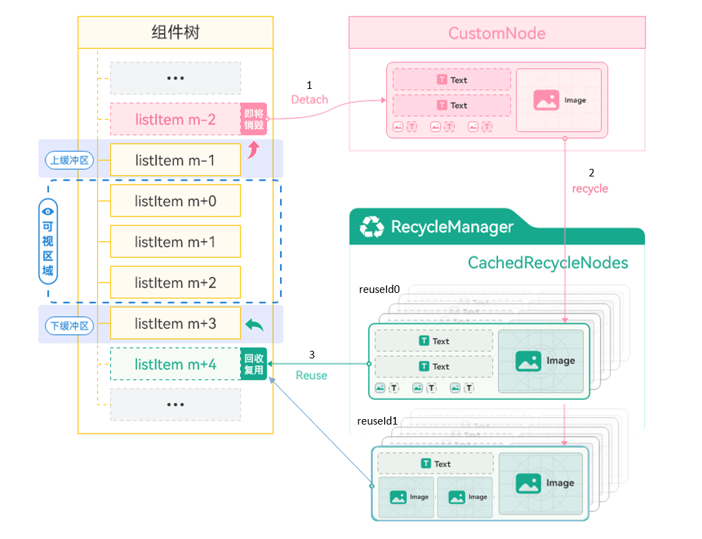
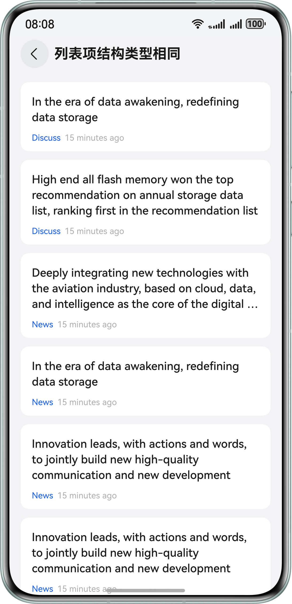
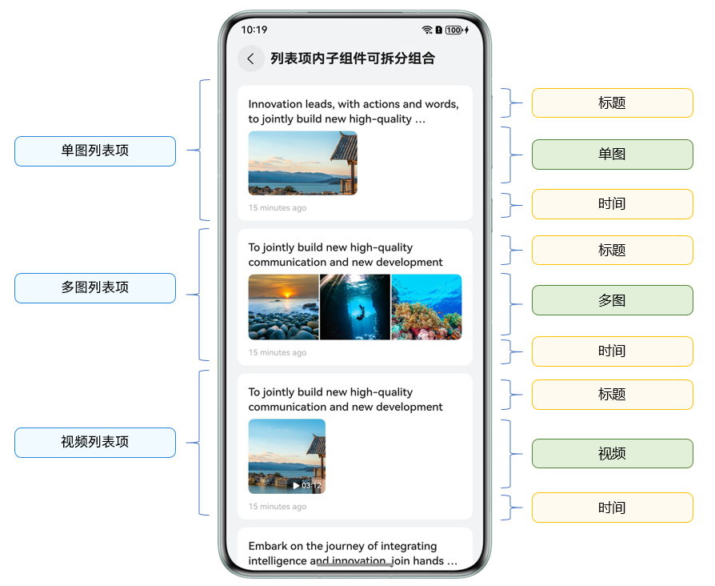
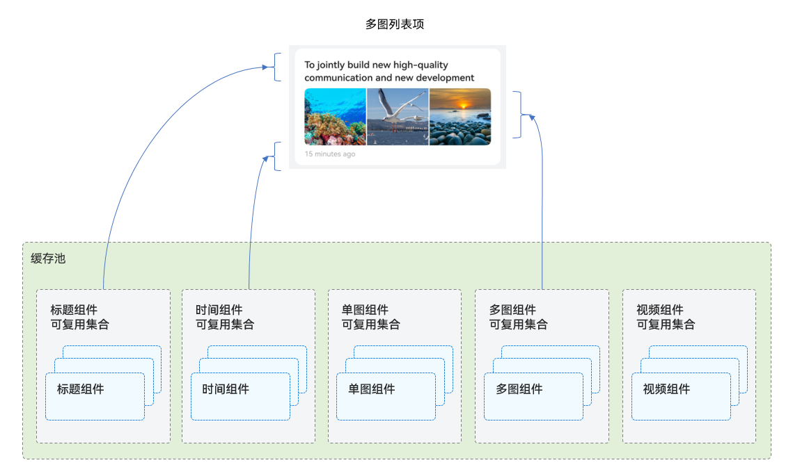
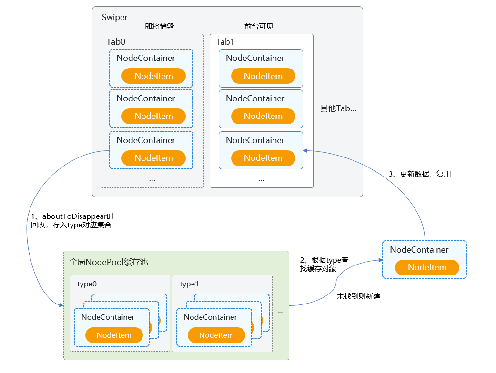
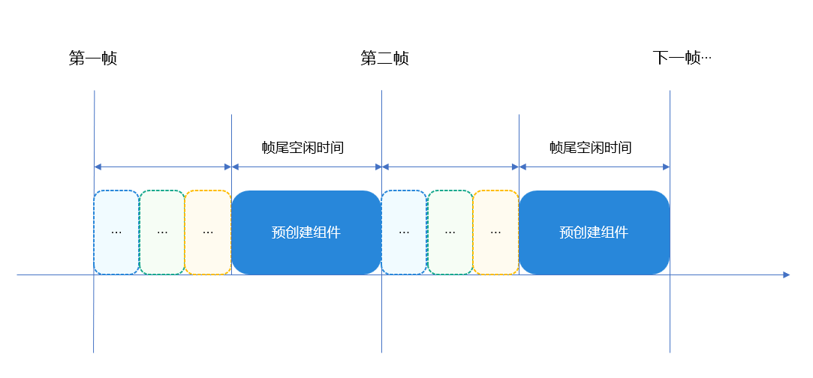

# 组件复用

更新时间：2026-03-17 02:20:01

来源：https://developer.huawei.com/consumer/cn/doc/best-practices/bpta-component-reuse

## 概述


组件复用是指自定义组件从组件树上移除后被放入缓存池，后续在创建相同类型的组件节点时，直接复用缓存池中的组件对象。

在应用开发时，组件复用是优化UI性能，确保应用流畅的重要手段。合理使用可复用组件，一方面，可以避免频繁创建和销毁对象的过程，减少内存回收的频率；另一方面，复用缓存中的组件可以直接绑定数据进行显示，与创建新视图相比，降低了计算开销，提升了显示效率。

常见的组件复用开发场景是长列表滑动：在应用展示大量数据的列表界面中，当用户快速地进行滑动操作，列表项反复创建销毁可能导致卡顿等性能问题。这种情况下，使用组件复用机制可以重用已经创建过的列表项视图，提高滑动的流畅度。

本文介绍以下组件复用开发场景，帮助开发者更好地理解复用机制，进而优化应用性能。

- [同一列表内的组件复用](#section142674274329)
- [多个列表间的组件复用](#section1032053073217)


> [!NOTE]
> 本文以列表相关场景为例介绍，但实际只要发生了自定义组件的销毁和再创建，都可以考虑使用组件复用。包括以下情形：
>  滑动场景下对子组件进行频繁创建和销毁。例如List、Grid、WaterFlow、Swiper等布局容器中的滑动。界面中反复切换条件渲染的控制分支，且控制分支中的子组件树结构比较复杂。


## 场景：同一列表内的组件复用


### 场景描述


同一列表内的列表项组件复用是典型的应用开发场景。列表在滑动时，超出屏幕一定范围的列表项，被放入缓存池中，当新的列表项滑动进入屏幕范围内时，从缓存池中取出对象，绑定对应数据后呈现到列表界面中。

在实际业务中，同一列表内可能呈现一种或多种不同结构的列表项，可以进一步划分以下子场景：

- [列表项结构类型相同](#section182174216314)
- [列表项结构类型不同](#section43301824133220)
- [列表项内子组件可拆分组合](#section11716134215321)


### 实现原理


ArkUI提供了@Reusable装饰器以实现自定义组件的复用，其原理如图所示：





1. 标记了@Reusable的自定义组件listItem列表项，在滑动出屏幕一定范围后，从组件树上被移除，组件的对象实例被放入CustomNode虚拟结点（与自定义组件一一对应的自定义结点）。
2. 在不断滑动过程中，列表的RecycleManager将这些CustomNode虚拟结点回收，根据复用标识[reuseId](https://developer.huawei.com/consumer/cn/doc/harmonyos-references/ts-universal-attributes-reuse-id)分组，形成CachedRecycleNodes的集合，即视图对象的复用缓存池。
3. 继续滑动，新的listItem需要在列表上显示时，RecycleManager优先从复用缓存池（CachedRecycleNodes集合）中查找对应reuseId的视图对象，然后将新的数据绑定到该视图，重用该节点并添加到组件树上。


### 开发步骤


1. 定义可复用组件：使用@Reusable装饰器修饰可复用的自定义组件。
2. 实现复用回调：可复用组件需要实现aboutToReuse()生命周期回调。当组件从缓存中重新加入到节点树时，触发aboutToReuse()生命周期回调，组件的构造参数会传递进来，开发者根据需要在回调中处理数据刷新。
3. 布局中使用可复用组件：设置reuseId划分组件的复用组别，以区分缓存池。未设置reuseId时，组件名会默认作为reuseId。
```ts
@Entry
@Component
struct Index {
  // ...

  build() {
    Column() {
      // ...
      if (this.switch) {
        // 3.layout the component and set reuse id
        ReusableComponent({ text: this.typeStr })
        .reuseId(this.typeStr)
      }
    }
    // ...
  }

  // ...
}

// 1.add @Reusable to mark component
@Reusable
@Component
struct ReusableComponent {
  @State text: string = ''

  // 2.update data in aboutToReuse
  aboutToReuse(params: Record<string, Object>): void {
    this.text = params.text as string;
  }

  build() {
    // ...
  }
}
```


- @Reusable修饰的组件需要布局在同一个父自定义组件（后文简称”父组件”）下才能实现缓存复用。
- 不建议在@Reusable修饰的组件中嵌套使用另一个@Reusable组件。


更多注意事项参考指南限制条件。


### 列表项结构类型相同


这种场景下，列表中的每一项都是由相同类型的元素和布局构成，列表项组件可以作为复用逻辑的基本单位。





实现步骤：

1. 将列表项封装为自定义组件ItemView，添加@Reusable修饰。
2. 在ItemView组件内的aboutToReuse()方法中进行新数据绑定逻辑。
3. 在列表的LazyForEach()中使用ItemView组件，设置reuseId。


下面的示例中，ItemView组件添加了@Reusable和aboutToReuse()方法，然后在OneTypeItemPage页面中使用，对ItemView组件设置reuseId('item_id')，表示此处以item_id为复用分组id。

```ts
@Component
export struct OneTypeItemPage {
  // ...
  build() {
    NavDestination() {
      Column() {
        List() {
          LazyForEach(this.dataSource, (item: ItemData) => {
            // layout the component, and set reuse id (or no set with using name as default id)
            ItemView({ title: item.title, from: item.from, tail: item.tail })
            .reuseId('item_id')
          }, (item: ItemData) => item.id.toString())
        }
        // ...
      }
      // ...
    }
    // ...
  }
}

// add @Reusable to mark component
@Reusable
@Component
struct ItemView {
  @State title: string | Resource = '';
  @State from: string | Resource = '';
  @State tail: string | Resource = '';

  // update data in aboutToReuse method
  aboutToReuse(params: Record<string, Object>): void {
    this.title = params.title as string;
    this.from = params.from as string;
    this.tail = params.tail as string;
  }

  build() {
    // ...
  }
}
```


### 列表项结构类型不同


这种场景下，列表中会有多种类型的列表项，如下图包含了文本、单图、多图等三种列表项，其布局、组成元素存在一定差异，可以将每种类型的列表项分别作为复用单位。


在滑动的过程中，不同类型的列表项将分别回收进入各自的缓存池，当需要复用时，根据类型找到对应视图缓存进行显示。

实现步骤：

1. 将不同类型的列表项分别封装为自定义组件，添加@Reusable修饰。
2. 在组件内的aboutToReuse()方法中进行新的数据绑定逻辑。
3. 在列表的LazyForEach()中，根据业务逻辑进行if条件选择，布局相应类型的列表项组件，分别设置reuseId。


```ts
@Component
export struct MultiTypeItemPage {
  // ...

  build() {
    NavDestination() {
      Column() {
        List() {
          LazyForEach(this.dataSource, (item: ItemData) => {
            if (item.type === 0) {
              TextTypeItemView({ item: item })
              .reuseId('text_item_id')
            } else if (item.type === 1) {
              ImageTypeItemView({ item: item })
              .reuseId('image_item_id')
            } else if (item.type === 2) {
              ThreeImageTypeItemView({ item: item })
              .reuseId('three_image_item_id')
            }
          }, (item: ItemData) => item.id.toString())
        }
        // ...
      }
      // ...
    }
    // ...
  }
}

@Reusable
@Component
struct TextTypeItemView {
  // ...
}


@Reusable
@Component
struct ImageTypeItemView {
  // ...
}

@Reusable
@Component
struct ThreeImageTypeItemView {
  // ...
}
```


### 列表项内子组件可拆分组合


这种情况下，列表项也具有多种结构类型。通过观察可知，列表项内部子组件都是纵向分布排列，相同之处是顶部的文本标题、底部的发布时间，而不同之处是中间的区域部分：有单图、多图、视频三种情况。





因此，可以创建五种复用子组件，通过子组件的选择组合，实现不同类型的列表项。





实现步骤：

1. 将单图、多图、视频、顶部标题、底部时间等分别封装为子组件，添加@Reusable修饰。
2. 在组件内的aboutToReuse()方法中进行新的数据绑定逻辑。
3. 通过组合子组件，实现三个不同的@Builder函数，与三种列表项一一对应。
4. 在列表的LazyForEach()中，根据业务逻辑进行条件选择，分别调用相应类型的@Builder函数。


> [!NOTE]
> 为什么使用@Builder实现，而不直接使用自定义组件嵌套子组件？
>  由于缓存池位于自定义组件上，嵌套子组件后会将缓存池分割，导致复用不生效。而使用@Builder可以使内部的自定义组件依然汇聚在同一个缓存池里，从而实现相互复用。


正例：

itemBuilderSingleImage()函数使用@Builder装饰器实现，ComposableItemPage中调用this.itemBuilderSingleImage(item)布局，itemBuilderSingleImage()内部的自定义组件就会汇聚在ComposableItemPage对应的缓存池里，即TopView、MiddleSingleImageView、BottomView等Reusable组件汇聚在同一缓存池里，当调用ComposableItemPage中其他@Builder函数时，也可复用内部@Reusable装饰的组件。

```ts
@Component
export struct ComposableItemPage {
  // ...

  @Builder
  itemBuilderSingleImage(item: ItemData) {
    TopView({ item: item }).reuseId('top_id')
    MiddleSingleImageView({ item: item }).reuseId('middle_image_id')
    BottomView({ item: item }).reuseId('bottom_id')
  }

  @Builder
  itemBuilderThreeImage(item: ItemData) {
    TopView({ item: item }).reuseId('top_id')
    MiddleThreeImageView({ item: item }).reuseId('middle_three_image_id')
    BottomView({ item: item }).reuseId('bottom_id')
  }

  @Builder
  itemBuilderVideoImage(item: ItemData) {
    TopView({ item: item }).reuseId('top_id')
    MiddleVideoView({ item: item }).reuseId('middle_video_id')
    BottomView({ item: item }).reuseId('bottom_id')
  }

  build() {
    NavDestination() {
      Column() {
        List() {
          LazyForEach(this.dataSource, (item: ItemData) => {
            ListItem() {
              Column() {
                if (item.type === 0) {
                  this.itemBuilderSingleImage(item)
                } else if (item.type === 1) {
                  this.itemBuilderThreeImage(item)
                } else if (item.type === 2) {
                  this.itemBuilderVideoImage(item)
                }
              }
              // ...
            }
          }, (item: ItemData) => item.id.toString())
        }
        // ...
      }
      // ...
    }
    // ...
  }
}

@Reusable
@Component
struct TopView {
  // ...
}

@Reusable
@Component
struct BottomView {
  // ...
}

@Reusable
@Component
struct MiddleSingleImageView {
  // ...
}

@Reusable
@Component
struct MiddleThreeImageView {
  // ...
}

@Reusable
@Component
struct MiddleVideoView {
  // ...
}
```

反例：

如果将itemBuilderSingleImage()、itemBuilderThreeImage()等@Builder函数改为@Component装饰器实现，比如分别命名为SingleImageComponent、ThreeImageComponent等，这会导致SingleImageComponent内部的TopView、MiddleSingleImageView、BottomView等组件仅汇聚在SingleImageComponent组件对应的缓存池中，ThreeImageComponent内部同理。这些@Reusable组件因处在不同@Component的缓存池中，ComposableItemPage在最后布局绘制时，复用将不生效。

```ts
@Component
export struct ComposableItemPage {
  // ...
  build() {
    NavDestination() {
      Column() {
        List() {
          LazyForEach(this.dataSource, (item: ItemData) => {
            ListItem() {
              Column() {
                if (item.type === 0) {
                  SingleImageComponent({ item: item })
                } else if (item.type === 1) {
                  ThreeImageComponent({ item: item })
                } else if (item.type === 2) {
                  VideoComponent({ item: item })
                }
              }
              // ...
            }
          }, (item: ItemData) => item.id.toString())
        }
        // ...
      }
      // ...
    }
    // ...
  }
}

@Component
struct SingleImageComponent{
  // ...
  build() {
    Column() {
      TopView({ item: item }).reuseId('top_id')
      MiddleSingleImageView({ item: item }).reuseId('middle_image_id')
      BottomView({ item: item }).reuseId('bottom_id')
    }
  }
}

@Component
struct ThreeImageComponent{
  // ...
  build() {
    Column() {
      TopView({ item: item }).reuseId('top_id')
      MiddleThreeImageView({ item: item }).reuseId('middle_three_image_id')
      BottomView({ item: item }).reuseId('bottom_id')
    }
  }
}

@Component
struct VideoComponent{
  // ...
  build() {
    Column() {
      TopView({ item: item }).reuseId('top_id')
      MiddleVideoView({ item: item }).reuseId('middle_video_id')
      BottomView({ item: item }).reuseId('bottom_id')
    }
  }
}

@Reusable
@Component
struct TopView {
  // ...
}

@Reusable
@Component
struct BottomView {
  // ...
}

@Reusable
@Component
struct MiddleSingleImageView {
  // ...
}

@Reusable
@Component
struct MiddleThreeImageView {
  // ...
}

@Reusable
@Component
struct MiddleVideoView {
  // ...
}
```


## 场景：多个列表间的组件复用


### 场景描述


应用开发有这种场景：在不同的标题页面中展示数据，每一页面下实现了一个列表，这样在页面切换时，列表与列表之间如果存在结构相同的列表项，就有组件复用的优化可能。例如下图，News、Hot等页签下，绘制了类型相同的列表项。


### 实现原理


在ArkUI中，可以采用Swiper+List实现这种功能场景，其中Swiper中的每个页面都使用一个List列表呈现内容。从@Reusable的复用机制可知，复用缓存池需要在同一父组件中，而列表项Item的父组件是当前页面的列表List，当Swiper内的页面切换时，无法直接复用上一个页面的列表项。

此时可以自定义一个全局的复用缓存池NodePool，利用BuilderNode的节点复用能力，根据页面状态创建、回收、复用子组件，实现这种跨页面多个列表间的组件复用。


> [!NOTE]
> 为什么不使用Tabs+List，而是用Swiper+List组件实现？
>  当前Tabs内容页不支持使用LazyForEach()，只能使用ForEach+TabContent。如果使用ForEach()，Tabs页面显示时会一次性将所有的TabContent创建，TabContent子页面切换时也不会执行aboutToDisappear()，无法回收组件，进而不存在复用优化的可能。





在需要布局自定义组件的位置，使用NodeContainer占位，然后继承NodeController实现NodeItem结点类，其内部需要持有BuilderNode实例以实现结点的创建和复用，同时需要持有视图相应的数据对象以更新界面显示。

1. 当NodeItem随着视图组件即将销毁时，在aboutToDisappear()中回收NodeItem到NodePool缓存池，存入type类型对应的集合中。
2. 每次需要创建自定义组件时，优先根据type类型查找对应的NodeItem对象，若未找到则新建一个NodeItem。
3. 视图组件随着NodeContainer的生命周期显示时，执行数据更新，完成组件的复用过程。


这种方式需要自行维护复用池，开发者也可以考虑使用同一原理实现的全局组件复用池三方库：nodepool。


### 开发步骤


1. 实现列表项占位结点类NodeItem，继承NodeController实现makeNode()方法，根据node是否存在，执行创建或刷新数据的逻辑，并在aboutToDisappear()时回收组件结点。
```ts
export class NodeItem extends NodeController {
  public builder: WrappedBuilder<ESObject> | null = null;
  public node: BuilderNode<ESObject> | null = null;
  public data: ESObject = {};
  public type: string = '';
  public id: number = 0;

  aboutToDisappear(): void {
    // recycle node into cache pool when UI disappear
    NodePool.getInstance().recycleNode(this.type, this);
  }

  update(data: ESObject) {
    this.data = data;
    this.node?.reuse(data);
  }

  makeNode(uiContext: UIContext): FrameNode | null {
    // build new node or update node in the cache
    if (!this.node) {
      this.node = new BuilderNode(uiContext);
      this.node.build(this.builder, this.data);
    } else {
      this.update(this.data);
    }
    return this.node.getFrameNode();
  }

  // ...
}
```
2. 使用单例模式实现复用缓存池NodePool工具类，在应用内统一管理组件的复用逻辑：实现取缓存getNode()方法，根据传入的type类型，获取对应的NodeItem，如果未找到，则新创建后绑定数据；实现缓存回收recycleNode()方法，根据type类型存入相应的集合中。
```ts
export class NodePool {
  private static instance: NodePool;
  private idGen: number;
  private nodePool: HashMap<string, LinkedList<NodeItem>>;

  private constructor() {
    this.nodePool = new HashMap();
    this.idGen = 0;
  }

  // single instance mode, managing the cache pool
  public static getInstance() {
    if (!NodePool.instance) {
      NodePool.instance = new NodePool();
    }
    return NodePool.instance;
  }

  public getNextId(): number {
    this.idGen += 1;
    return this.idGen;
  }

  public getNode(
    type: string,
    item: ESObject,
    builder: WrappedBuilder<ESObject>,
  ): NodeItem | undefined {
    let nodeItem: NodeItem | undefined = undefined;
    try {
      // get the cached node based on type
      if (this.nodePool.get(type)) {
        for (let i = 0; i < this.nodePool.get(type)?.length; i++) {
          let tmpItem: NodeItem | undefined = this.nodePool.get(type)?.get(i);
          // if the parent node is null, it means the node is reusable, so get it out
          if (!tmpItem.node?.getFrameNode()?.getParent()) {
            nodeItem = tmpItem;
            this.nodePool.get(type)?.removeByIndex(i);
            break;
          }
        }
      }
    } catch (e) {
      let err = e as BusinessError;
      hilog.error(
        DOMAIN,
        'testTag',
        `failed code=${err.code}, message=${err.message}`,
      );
    }

    if (!nodeItem) {
      // No valid reusable node found, so create new one
      nodeItem = new NodeItem();
      nodeItem.builder = builder;
      nodeItem.type = type;
      nodeItem.data.item = item;
    } else {
      // update cached node
      nodeItem.data.item = item;
    }
    return nodeItem;
  }

  // cache the node based on type
  public recycleNode(type: string, node: NodeItem) {
    try {
      let nodeArray: LinkedList<NodeItem> = this.nodePool.get(type);
      if (!nodeArray) {
        nodeArray = new LinkedList();
        this.nodePool.set(type, nodeArray);
      }
      // reset data
      node.data.item = {};
      nodeArray.add(node);
    } catch (e) {
      let err = e as BusinessError;
      hilog.error(
        DOMAIN,
        'testTag',
        `failed code=${err.code}, message=${err.message}`,
      );
    }
  }

  // ...
}
```


- getNode()方法中，如果找到的NodeItem父结点不为空（说明未完全下树），需要继续遍历查找下一个有效的NodeItem对象。
- recycleNode()方法中，需要对NodeItem对象属性重置，使节点内容还原，避免复用显示异常情况。
3. 将步骤1中的列表项占位结点包装成组件，在对应的生命周期中分别取缓存、回收、复用。
```ts
// The list item placeholder component with NodeContainer
@Component
export struct DiffListItemNode {
  @State type: string = '';
  @State item: ItemData = new ItemData('', 0);
  @State itemHeight: number = 0;
  @State builder: WrappedBuilder<ESObject> | null = null;
  private nodeItem: NodeItem = new NodeItem();

  aboutToAppear(): void {
    this.nodeItem = NodePool.getInstance().getNode(this.type, this.item, this.builder!)!;
  }

  aboutToRecycle(): void {
    this.nodeItem?.node?.recycle();
  }

  aboutToReuse(params: ESObject): void {
    this.nodeItem?.node?.reuse(params);
  }

  build() {
    NodeContainer(this.nodeItem)
  }
}
```
4. 封装列表项的界面视图组件，使用listItemBuilder函数对外export该组件。
```ts
// export the list item component
@Builder
export function listItemBuilder(data: ESObject) {
  DiffListItemView({
    item: data.item
  })
}

// The list item view component
@Component
export struct DiffListItemView {
  // ...

  aboutToReuse(params: ESObject): void {
    this.item = params.item;
  }

  build() {
    Row() {
      // ...
    }
    // ...
  }
}
```
5. 在列表的LazyForEach()中，将步骤4的实际列表项视图wrapBuilder后作为参数传递给步骤3封装的占位组件，实现复用组件的布局。
```ts
// wrapBuilder the list item view component
export const listItemWrapper: WrappedBuilder<ESObject> = wrapBuilder<ESObject>(listItemBuilder);

// The list component in the swiper
@Component
export struct TabContentView {
  // ...

  build() {
    List() {
      LazyForEach(this.dataSource, (item: ItemData) => {
        DiffListItemNode({
          type: REUSE_VIEW_TYPE_ITEM,
          item: item,
          builder: listItemWrapper
        })
      }, (item: ItemData) => item.id.toString())
    }
    // ...
  }
}
```


### 使用onIdle()预创建组件


在当前场景下，首次进入页面可能耗时较高，因为在第一次进入时，自定义组件复用池中没有缓存可以复用，列表项都需要新创建。优化这个问题，可以考虑预创建组件，将组件对象提前放入复用缓存池中。

当组件数量较多，集中预创建本身也耗时较长，容易导致主线程阻塞。ArkUI中提供了onIdle()接口，会返回每一帧帧尾的空闲时间，可以将组件预创建分布到每一帧帧尾的空闲时间中执行，这样预创建过程就被平摊在多个周期里执行，避免集中运行的耗时影响，进而优化应用体验。





1. 需要根据业务准确预估组件预创建耗时，同时将业务逻辑颗粒度拆小，以便能够分到多个onIdle()时机中完成。例如，单个组件预创建耗时在2ms左右，帧尾空闲时间只有1ms，那么就不能在当前帧进行预创建，而是延迟到下一帧中执行。

2. 需要合理控制自定义组件复用池中预创建的数量，否则内存占用较多，可能会影响性能。


1. 在NodePool工具类中实现预创建preBuild()方法：新建NodeItem实例，设置builder等属性，执行recycleNode()提前放入缓存池中。
```ts
export class NodeItem extends NodeController {
  // ...

  prebuild(uiContext: UIContext) {
    this.node = new BuilderNode(uiContext);
    this.node.build(this.builder, this.data);
  }
}

export class NodePool {
  // ...

  public preBuild(
    type: string,
    item: ESObject,
    builder: WrappedBuilder<ESObject>,
    uiContext: UIContext,
  ) {
    if (type) {
      let nodeItem: NodeItem | undefined = new NodeItem();
      nodeItem.builder = builder;
      nodeItem.data.item = item;
      nodeItem.type = type;
      nodeItem.prebuild(uiContext);
      this.recycleNode(type, nodeItem);
    }
  }
}
```
2. 继承FrameCallback实现帧回调类，在构造器中传入预创建的数据，并实现onIdle()接口。系统会通过onIdle()回调，将帧尾空闲时间通过参数idleTimeInNano传递出来，可根据单个组件的预创建耗时，设置预创建的剩余空闲时间上限（示例代码假设单个组件预创建耗时最长1ms=1000000ns）。
3. 当剩余空闲时间足够创建组件时，在这一帧中进行组件预创建，并不断更新当前帧的剩余空闲时间。
4. 若当前帧剩余空闲时间不足以创建组件，通过postFrameCallback()方法，将回调传递到下一帧，继续进行剩余组件的预创建。
```ts
export class IdleCallback extends FrameCallback {
  private uiContext: UIContext;
  // Pre build component index, start from 0
  private todoCount: number = 0;
  private dataArray: ItemData[] = [];

  constructor(context: UIContext, preBuildData: ItemData[]) {
    super();
    this.uiContext = context;
    this.dataArray = preBuildData;
  }

  onIdle(idleTimeInNano: number): void {
    if (this.todoCount >= this.dataArray.length) {
      // All pre build completed
      return;
    }
    let cur: number = systemDateTime.getTime(true);
    let timeLeft = idleTimeInNano;
    // if the build time for a single component is 1000000 ns
    while (timeLeft >= 1000000) {
      hiTraceMeter.startTrace('onIdle_prebuild', 1);
      // prebuild the component
      NodePool.getInstance().preBuild(
        'reuse_type_',
        this.dataArray[this.todoCount],
        listItemWrapper,
        this.uiContext,
      );
      hiTraceMeter.finishTrace('onIdle_prebuild', 1);
      // update the idle time
      let now = systemDateTime.getTime(true);
      timeLeft = timeLeft - (now - cur);
      cur = now;
      this.todoCount++;
      if (this.todoCount >= this.dataArray.length) {
        // All pre build completed
        return;
      }
      if (this.todoCount < this.dataArray.length) {
        // Pre build not completed, proceed to the next frame
        this.uiContext.postFrameCallback(this);
      }
    }
  }
}
```


在进入Swiper+List的页面之前，选择合适的时机执行context.postFrameCallback()，开启IdleCallback帧回调逻辑。


```ts
@Entry
@Component
struct Index {
  // ...

  aboutToAppear(): void {
    let dataArray: ItemData[] = [];
    dataArray.push(...genMockItemData(100))
    let context = this.getUIContext();
    context.postFrameCallback(new IdleCallback(context, dataArray));
  }

  // ...
}
```


## 更多优化方法


### 使用attributeUpdater实现组件属性的部分刷新


在可复用组件中使用attributeUpdater可以控制指定属性的刷新，避免不必要的重绘、减少渲染负载，从而提升应用性能。

默认情况下，直接使用状态变量在aboutToReuse()中进行数据赋值，会导致组件全部属性刷新。实际需求中，可能只需要更新组件的部分属性。例如，当组件复用显示时，只希望设置文本的字体颜色，那么可以使用attributeUpdater在aboutToReuse()修改fontColor属性。

反例：

这里通过aboutToReuse()对fontColor状态变量更新，导致组件全部属性进行刷新，造成不必要的耗时。

```ts
@Component
export struct LessEmbeddedComponent {
  aboutToAppear(): void {
    momentData.getFriendMomentFromRawfile();
  }

  build() {
    Column() {
      Text('use nothing')
      List({ space: ListConstants.LIST_SPACE }) {
        LazyForEach(momentData, (moment: FriendMoment) => {
          ListItem() {
            OneMomentNoModifier({ color: moment.color })
            .onClick(() => {
              console.log(`my id is ${moment.id}`)
            })
          }
        }, (moment: FriendMoment) => moment.id)
      }
      .width("100%")
      .height("100%")
      .cachedCount(5)
    }
  }
}

@Reusable
@Component
export struct OneMomentNoModifier {
  @State color: string | number | Resource = "";

  aboutToReuse(params: Record<string, Object>): void {
    this.color = params.color as number;
  }

  build() {
    Column() {
      Text('This is title')
      Text('This is desc text')
      .fontColor(this.color)
      .textAlign(TextAlign.Center)
      .fontStyle(FontStyle.Normal)
      .fontSize(13)
      .lineHeight(30)
      .opacity(0.6)
      .margin({ top: 10 })
      .fontWeight(30)
      .clip(false)
      .backgroundBlurStyle(BlurStyle.NONE)
      .foregroundBlurStyle(BlurStyle.NONE)
      .borderWidth(1)
      .borderColor(Color.Pink)
      .borderStyle(BorderStyle.Solid)
      .alignRules({
        'top': { 'anchor': '__container__', 'align': VerticalAlign.Top },
        'left': { 'anchor': 'image', 'align': HorizontalAlign.End }
      })
    }
  }
}
```

正例：

通过attributeUpdater对Text组件中的fontColor属性进行精准刷新，避免重绘Text中不需要更改的属性。

```ts
export class MyTextUpdater extends AttributeUpdater<TextAttribute> {
  private color: string | number | Resource | Color = '';

  constructor(color: string | number | Resource | Color) {
    super();
    this.color = color;
  }

  initializeModifier(instance: TextAttribute): void {
    instance.fontColor(this.color) // Differentiated update
  }
}

// ...

@Reusable
@Component
export struct OneMomentNoModifier {
  @State text: string = '';
  color: string | number | Resource | Color = '';
  textUpdater: MyTextUpdater | null = null;

  aboutToAppear(): void {
    this.textUpdater = new MyTextUpdater(this.color);
  }

  aboutToReuse(params: Record<string, Object>): void {
    this.color = params.color as string;
    this.text = params.text as string;
    this.textUpdater?.attribute?.fontColor(this.color);
  }

  build() {
    Column() {
      Text(this.text)
      .fontSize(18)
      .textAlign(TextAlign.Center)
      .fontWeight(500)
      .lineHeight(24)
      .fontColor(Color.Black)
      .opacity(0.6)
      Column() {
        Text('AAAAAAAAAAAAAAAAAAAAAAAAAAAAAAAAAAAAAAAAAAAAAAAAAAAAAAAAAAAAAAAAA')
        .attributeModifier(this.textUpdater) // Precise refresh
        .textAlign(TextAlign.Start)
        .fontSize(16)
        .fontWeight(400)
        .lineHeight(21)
      }
      // ...
    }
    // ...
  }
}
```


### 使用@Link/@ObjectLink替代@Prop以减少深拷贝


在可复用组件中，建议使用@Link/@ObjectLink替代@Prop。因为@Prop装饰变量时会进行深拷贝，增加了创建时间及内存消耗，而改用@Link/@ObjectLink，变量会共享同一地址。

反例：

```ts
@Entry
@Component
struct lessEmbeddedComponent {
  aboutToAppear(): void {
    getFriendMomentFromRawfile();
  }

  build() {
    Column() {
      TopBar()
      List({ space: ListConstants.LIST_SPACE }) {
        LazyForEach(momentData, (moment: FriendMoment) => {
          ListItem() {
            OneMoment({moment: moment})
          }
        }, (moment: FriendMoment) => moment.id)
      }
      .cachedCount(Constants.CACHED_COUNT)
    }
  }
}

@Reusable
@Component
export struct OneMoment {
  @Prop moment: FriendMoment;

  build() {
    Column() {
      ...
      Text(`${this.moment.userName}`)
      ...
    }
  }
}

export class FriendMoment {
  id: string;
  userName: string;
  avatar: string;
  text: string;
  size: number;
  image?: string;
}
```

正例：

将子组件moment变量@Prop改为@ObjectLink即可。

父子组件之间的数据同步用了@ObjectLink来进行，子组件@ObjectLink包装类把当前this指针注册给父组件，会直接将父组件的数据同步给子组件，实现父子组件数据的双向同步，降低子组件创建时间和内存消耗。


### 避免对@Link/@ObjectLink/@Prop等自动更新的状态变量，在aboutToReuse()中重复赋值


如果可复用组件中使用了@Link/@ObjectLink/@Prop等自动同步父子组件数据的状态变量，则不需要在aboutToReuse()中对这些数据重复赋值。如果重新赋值这些变量，会导致组件的内容重新触发状态刷新，造成额外的计算更新耗时。

反例：

```ts
@Reusable
@Component
export struct OneMoment {
  @ObjectLink moment: FriendMoment;

  aboutToReuse(params: Record<string, Object>): void {
    this.moment.id = (params.moment as FriendMoment).id
    this.moment.userName = (params.moment as FriendMoment).userName
    this.moment.avatar = (params.moment as FriendMoment).avatar
    this.moment.text = (params.moment as FriendMoment).text
    this.moment.image = (params.moment as FriendMoment).image
  }

  build() {
    Column() {
      ...
      Text(`${this.moment.userName}`)
      ...
    }
  }
}
```

正例：

将aboutToReuse()中的赋值语句删除。

@ObjectLink修饰的moment状态变量已包含自动刷新功能，不需要再重复赋值刷新。


### 使用reuseId标记布局发生变化的组件


在同一段自定义组件代码中，如果使用if/else条件语句控制布局结构，会导致在不同逻辑分支中创建不同布局的组件，从而造成组件树结构的差异。此时可以使用reuseId来区分发生变化的分支逻辑，确保系统能够根据reuseId缓存各种结构的组件，提升复用性能。

反例：

组件通过if条件创建包含Image的Flex组件。不使用reuseId时，复用后根据if条件，可能会删除Flex或重新创建Flex，存在性能消耗。

```ts
@Entry
@Component
struct AboutReuseId {

  build() {
    Column() {
      TopBar()
      List({ space: ListConstants.LIST_SPACE }) {
        LazyForEach(momentData, (moment: FriendMoment) => {
          ListItem() {
            OneMoment({
              moment: moment,
              fontSize: moment.size
            })
          }
        }, (moment: FriendMoment) => moment.id)
      }
      .cachedCount(Constants.CACHED_COUNT)
    }
  }
}

@Reusable
@Component
export struct OneMoment {
  @Prop moment: FriendMoment;

  build() {
    Column() {
      ...
      Text(this.moment.text)

      if (this.moment.image !== '') {
        Flex({ wrap: FlexWrap.Wrap }) {
          Image($r(this.moment.image))
          Image($r(this.moment.image))
          Image($r(this.moment.image))
        }
      }
      ...
    }
  }
}
```

正例：

根据分支逻辑设置不同的reuseId，缓存不同布局结构下的组件，省去重复执行if的删除或创建逻辑。

```ts
@Entry
@Component
struct WithReuseId {
  // ...

  build() {
    Column() {
      List({ space: this.LIST_SPACE }) {
        LazyForEach(this.momentData, (moment: FriendMoment) => {
          ListItem() {
            OneMoment({ moment: moment })// ReusId is used to control component reuse
            .reuseId((moment.image !== '') ? 'withImage_id' : 'noImage_id')
          }
        }, (moment: FriendMoment) => moment.id)
      }
      // ...
    }
  }
}

@Reusable
@Component
export struct OneMoment {
  @ObjectLink moment: FriendMoment;

  build() {
    Column() {
      // ...

      if (this.moment.image !== '') {
        Flex({ wrap: FlexWrap.Wrap }) {
          Image($r(this.moment.image))
          .width(Constants.LAYOUT_MAX)
          .height('27.5%')
          .borderRadius(16)
          Image($r(this.moment.image))
          .width(Constants.LAYOUT_MAX)
          .height('27.5%')
          .borderRadius(16)
          .margin({ top: 10 })
        }
        .width(Constants.LAYOUT_MAX)
        .margin({ top: 14 })
      }
    }
    // ...
  }
}
```


### 避免使用函数方法作为复用组件的入参


如果可复用组件的入参使用了函数方法，因每次复用都需要重新创建组件关联的数据对象，该函数会在每次复用时执行，造成性能问题。建议改为通过状态变量传递参数，从而减少重复执行入参中的函数所带来的性能消耗。

反例：

复用的子组件参数sum是通过模拟耗时函数countAndReturn()生成。该函数在每次组件复用时都执行，会造成性能问题，甚至导致列表滑动过程中的卡顿丢帧。

```ts
@Entry
@Component
struct withFuncParam {
  aboutToAppear(): void {
    getFriendMomentFromRawfile();
  }

  countAndReturn(): number {
    let temp: number = 0;
    for (let index = 0; index < 100000; index++) {
      temp += index;
    }
    return temp;
  }

  build() {
    Column() {
      TopBar()
      List({ space: ListConstants.LIST_SPACE }) {
        LazyForEach(momentData, (moment: FriendMoment) => {
          ListItem() {
            OneMoment({
              moment: moment,
              sum: this.countAndReturn()
            })
          }
        }, (moment: FriendMoment) => moment.id)
      }
      .cachedCount(Constants.CACHED_COUNT)
    }
  }
}

@Reusable
@Component
export struct OneMoment {
  @Prop moment: FriendMoment;
  @State sum: number = 0;

  aboutToReuse(params: Record<string, Object>): void {
    this.sum = params.sum as number;
  }

  build() {
    Column() {
      ...
      Text(`${this.moment.userName} （${this.moment.id} / ${this.sum}）`)
      ...
    }
  }
}
```

正例：

可以先将countAndReturn()计算放到页面初始时执行，将结果赋值给this.sum变量。在复用组件的参数传递时，通过this.sum来进行。

```ts
@Entry
@Component
struct WithFuncParam {
  @State sum: number = 0;
  // ...
  private readonly MOCK_ASYNC_DEFAULT_NUM: number = 1000000;
  private readonly MOCK_ASYNC_TIME_OUT_NUM: number = 2000;

  aboutToAppear(): void {
    this.momentData.getFriendMomentFromRawFile();
    // Execute the asynchronous function
    this.countAndReturn();
  }

  async countAndReturn(): Promise<void> {
    await this.sleep();
    this.sum = this.MOCK_ASYNC_DEFAULT_NUM;
  }

  sleep(): Promise<string> {
    return new Promise<string>((resolve) => {
      setTimeout(() => {
        resolve('ok');
      }, this.MOCK_ASYNC_TIME_OUT_NUM)
    });
  }

  build() {
    Column() {
      List({ space: this.LIST_SPACE }) {
        LazyForEach(this.momentData, (moment: FriendMoment) => {
          ListItem() {
            // Parameters of subcomponents are transferred through status variables
            OneMoment({
              moment: moment,
              sum: this.sum
            })
          }
        }, (moment: FriendMoment) => moment.id)
      }
      // ...
    }
  }
}

@Reusable
@Component
export struct OneMoment {
  @ObjectLink moment: FriendMoment;
  @State sum: number = 0;
  // ...

  aboutToReuse(params: Record<string, Object>): void {
    this.sum = params.sum as number;
  }

  // ...
}
```


## 常见问题


### 如何检查组件复用是否生效


- 使用[Code Linter扫描工具](https://developer.huawei.com/consumer/cn/doc/harmonyos-guides/ide-code-linter)进行代码检查，重点关注[@performance/hp-arkui-use-reusable-component](https://developer.huawei.com/consumer/cn/doc/harmonyos-guides/ide_hp-arkui-use-reusable-component)规则。
- 通过Profiler工具抓取Trace，搜索组件名称，根据BuildRecycle字段识别是否触发复用渲染。具体可参考[通过Trace识别懒加载渲染流程](https://developer.huawei.com/consumer/cn/doc/best-practices/bpta-optimization-overview#section1588117331934)。
- 通过Profiler工具抓取Trace，识别是否发生丢帧，判断子组件创建的次数。具体分析过程可参考[优化长列表-组件复用性能分析](https://developer.huawei.com/consumer/cn/doc/best-practices/bpta-best-practices-long-list#section1069111015296)。


## 示例代码


- [实现组件复用](https://gitcode.com/harmonyos_samples/component-reuse/)
