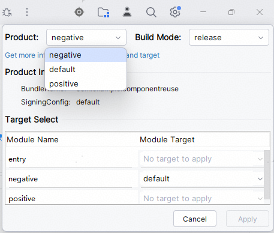
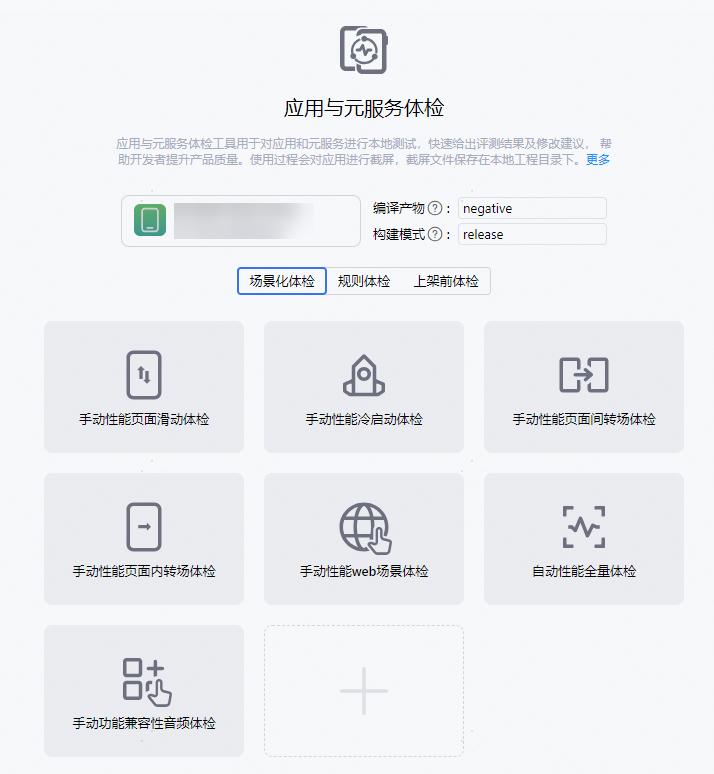
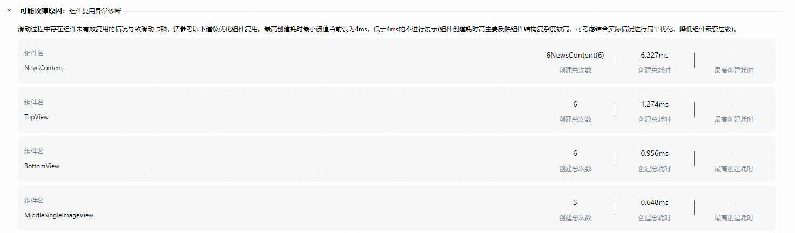
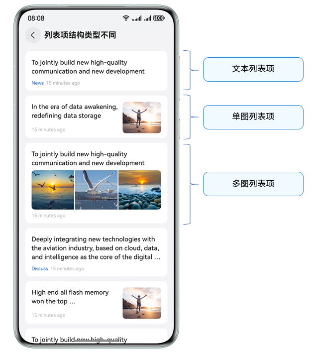
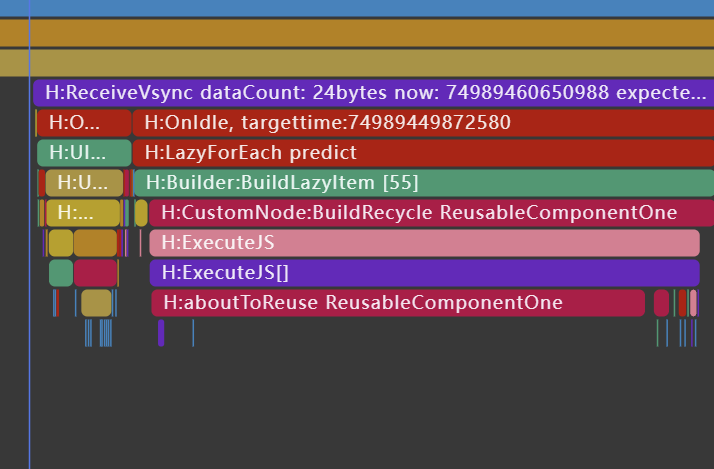
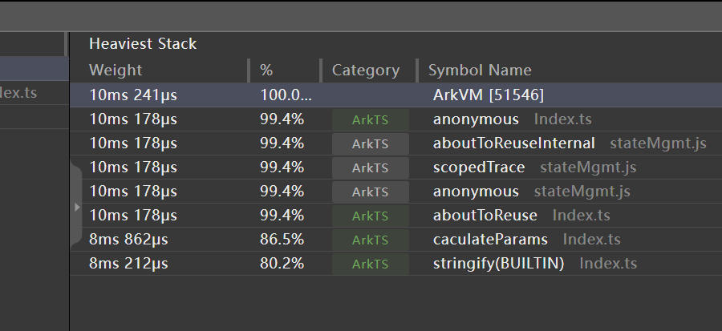

# 组件复用问题诊断分析

更新时间：2026-03-17 02:20:01

来源：https://developer.huawei.com/consumer/cn/doc/best-practices/bpta-component-reuse-issue-diagnosis-and-analysis

## 概述


组件复用的本质是自定义组件的缓存池。使用@Reusable装饰器标记自定义组件后，当该组件进入销毁流程时，将改为进入缓存池。当需要创建此自定义组件时，优先尝试从缓存池中寻找对应reuseId的自定义组件，若未找到再进行创建。此缓存池的实例位于@Reusable标记的自定义组件的父自定义组件上，会随父自定义组件的销毁一并销毁。关于自定义组件复用的详细使用方法，可参考组件复用文档。综上所述，组件复用的关键概念如下：

- 缓存池：用于存放自定义组件，位于父自定义组件对象上。
- @Reusable装饰器：标记自定义组件，使其在释放时进入缓存池。
- reuseId：自定义组件在缓存池中的键，用于区分池中的自定义组件类型。


理解了这些关键概念，即可对组件复用的问题进行分析和定位。本文以列表组件为例，介绍组件复用常见问题的分析与解决方案。


## 同一列表内的组件复用问题分析与解决


开发者可以通过AppAnalyzer对应用组件复用问题进行检测，执行场景化+手动滑动场景检查后，生成组件复用问题的体检报告，为开发者展示列表组件的结构化特征，并提供针对性的优化指导建议。

使用AppAnalyzer工具检测组件复用步骤如下。

1. 在DevEco Studio中启动AppAnalyzer工具，详细请参见[AppAnalyzer](https://developer.huawei.com/consumer/cn/doc/best-practices/bpta-performance-detection#section135451444171)。
2. 本文展示的[正反例代码](https://gitcode.com/harmonyos_samples/BestPracticeSnippets/tree/master/ComponentReuse)分别位于positive和negative模块中，检测时需选择相应模块。

3. 点击工具“手动性能页面滑动体检”，按照提示进行检测操作。

4. 通过分析检测结果，结合滑动过程中列表卡片的创建次数，可以分析出当前列表的组件未使用复用或者复用未生效。



以下将介绍几种复用场景问题，通过代码分析和优化建议对组件复用问题进行修复。


### 未使用组件复用


- **场景一：****列表项结构类型相同**ListItem的根组件只有一个，且根组件整体结构组成不变。

 例如以下示例中，NewsContent是新闻列表的内容组件，其内部包含三个子组件：顶部的文本，中部的图片以及底部的发布时间。 **反例**
```text
// NewsListPage
List() {
LazyForEach(this.dataSource, (item: ItemData) => {
ListItem() {
NewsContent({ item: item })
}
}
}, (item: ItemData) => item.id.toString())
}
```

```text
@Component
struct NewsContent {
// ...
@Builder
myBuilder(item: ItemData) {
TopView({ item: item }) // Top Text.
MiddleSingleImageView({ item: item }) // Image
BottomView({ item: item }) // Bottom text.
}
build() {
Column() {
this.myBuilder(this.item)
}
// ...
}
}
```
 **代码分析** ListItem模块的组件结构采用总-分式结构，未使用if-else实现子组件的条件渲染。父组件NewsContent缺少组件复用机制，导致每次使用时都需要重新创建实例，在组件较为复杂创建耗时较长的情况下，会影响滑动的性能，造成卡顿。 **优化建议** 这种场景下，列表中的每一项都是由相同类型的元素和布局构成，列表项组件可以作为复用逻辑的基本单位，给父组件NewsContent添加@Reusable装饰器即可。 **正例**
```text
@Reusable
@Component
struct NewsContent {
// ...
}
```
- **场景二：****列表项结构类型不同****①"总-分式"子组件可变结构**：ListItem的根组件只有一个，且根组件整体结构组成不变，局部子组件进行替换。

 如以下示例中，NewsContent是新闻列表的内容组件，其内部包含三个子组件：顶部文本、底部发布时间，根据展示类型不同，中部可展示单张图片、三张图片或视频。 **反例**
```text
// NewsListPage
List() {
LazyForEach(this.dataSource, (item: ItemData) => {
ListItem() {
NewsContent({ item: item }) // The root component of ListItem is singular, and the overall structure of the root component remains unchanged.
}
}, (item: ItemData) => item.id.toString())
}
```

```text
@Component
struct NewsContent {
// ...
@Builder
myBuilder(item: ItemData) {
TopView({ item: item })
if (item.type === 0) { // Replace the local subcomponent.
MiddleSingleImageView({ item: item })
} else if (item.type === 1) {
MiddleThreeImageView({ item: item })
} else {
MiddleVideoView({ item: item })
}
BottomView({ item: item })
}
// ...
}
```
 **代码分析** 父组件NewsContent支持多种列表项类型，通过if-else条件渲染不同子组件，包含了单图、三图和视频三种形式，其布局、组成元素存在一定差异。 **优化建议** 给父组件NewsContent添加@Reusable装饰器，同时根据if-else分支合理配置[reuseId](https://developer.huawei.com/consumer/cn/doc/harmonyos-references/ts-universal-attributes-reuse-id#reuseid)。在同一段自定义组件代码中，如果使用if/else条件语句控制布局结构，会导致在不同逻辑分支中创建不同布局的组件，从而造成组件树结构的差异。此时可以使用reuseId来区分发生变化的分支逻辑，确保系统能够根据reuseId缓存各种结构的组件，提升复用性能。具体请参考：[使用reuseId标记布局发生变化的组件](https://developer.huawei.com/consumer/cn/doc/best-practices/bpta-component-reuse#section1239555818211)。若if/else条件分支过多，会导致reuseId分类过细，可参考[reuseId分类过细](#section511719116258)进行优化。 **正例**
```text
List() {
LazyForEach(this.dataSource, (item: ItemData) => {
ListItem() {
NewsContent({ item: item }).reuseId(`${item.type}`)
}
}, (item: ItemData) => item.id.toString())
}
```

```text
@Reusable
@Component
struct NewsContent {
// ...
}
```
**②分类组合式结构**：ListItem的根组件有多种类型，不同类型的根组件布局组成不同。

 例如以下示例中，新闻列表的内容列表页，根据展示类型的不同，可分别展示包含单张图片、三张图片、视频的内容NewsContent。 **反例**
```text
List() {
LazyForEach(this.dataSource, (item: ItemData) => {
ListItem() {
if (item.type === 0) { // The root component of ListItem comes in various types.
SingleImageNewsContent({ item: item })
} else if (item.type === 1) {
ThreeImageNewsContent({ item: item })
} else {
VideoNewsContent({ item: item })
}
}
}, (item: ItemData) => item.id.toString())
}
```

```text
// Different types of root component layouts are composed differently.
@Component
struct SingleImageNewsContent {}

@Component
struct ThreeImageNewsContent{}

@Component
struct VideoNewsContent{}
```
 **代码分析** ListItem列表项根据type的不同，通过if条件渲染对应的自定义组件，包含SingleImageNewsContent、ThreeImageNewsContent、VideoNewsContent，均未添加@Reusable装饰器。在处理长列表渲染时，如果未对组件进行复用，每次渲染都会创建新的组件实例，将会导致内存使用增加、渲染时间变长，造成界面卡顿。 **优化建议** 将不同类型的列表项封装的自定义组件添加@Reusable修饰。此方法虽可实现组件复用，但由于被复用的组件内部包含了单图、多图、视频、顶部标题、底部时间等多种子组件，导致复用粒度过粗，仍存在性能优化空间。建议参考正例二进行细粒度拆分，将不同类型的内容模块独立封装，以提升复用效率和渲染性能。 **正例**一
```text
@Reusable
@Component
struct SingleImageNewsContent {
// ...
}

@Reusable
@Component
struct ThreeImageNewsContent {
// ...
}

@Reusable
@Component
struct VideoNewsContent {
// ...
}
```
 **正例二** 为了更灵活地复用和更新局部内容，通常需要降低复用粒度，即给组件内部需要复用的子组件做复用，而不是组件自身，避免全量更新。通过降低复用粒度，可以显著提升列表滚动的流畅度，减少内存占用。具体可参考[场景三：列表项内子组件可拆分组合](#li15198164511246)。
- **场景三****：****列表项内子组件可拆分组合**ListItem没有根组件，通过不同子组件相互组合，形成多种布局形态。

 例如以下示例中，ListItem列表项根据type的不同，其子组件包含了顶部文本元素、底部的文本元素，根据展示类型的不同，中间可分别展示单张图片、三张图片、视频。 **反例**
```text
// ...
@Builder
itemBuilderVideo(item: ItemData) {
Column() {
// By combining different subcomponents, various layout forms can be created.
TopView({ item: item })
MiddleVideoView({ item: item })
BottomView({ item: item })
}
}
// ...
List() {
LazyForEach(this.dataSource, (item: ItemData) => {
ListItem() {
// ListItem does not have a root component.
if (item.type === 0) {
this.itemBuilderSingleImage(item)
} else if (item.type === 1) {
this.itemBuilderThreeImage(item)
} else {
this.itemBuilderVideo(item)
}
}
}, (item: ItemData) => item.id.toString())
}
// ...
```

```text
@Component
struct TopView {}

@Component
struct MiddleVideoView {}

@Component
struct BottomView {}
```
 **代码分析** 列表项ListItem根据if-else做@Builder构建函数的条件渲染，其自定义组件TopView、MiddleVideoView、BottomView未添加@Reusable装饰器。在处理长列表渲染时，如果未对组件进行复用，每次渲染都会创建新的组件实例，将会导致内存使用增加、渲染时间变长，造成界面卡顿。 **优化建议** 由于@Reusable装饰器需与自定义组件配合使用，可将@Builder内的自定义组件添加@Reusable修饰。通过将不同类型的列表项分别封装为独立的自定义组件并应用@Reusable，实现更细粒度的复用，从而提升组件复用效率与整体渲染性能。 **正例**
```text
@Reusable
@Component
struct TopView {
// ...
}

@Reusable
@Component
struct BottomView {
// ...
}

@Reusable
@Component
struct MiddleSingleImageView {
// ...
}

@Reusable
@Component
struct MiddleThreeImageView {
// ...
}

@Reusable
@Component
struct MiddleVideoView {
// ...
}
```


### 组件复用使用不当


- **场景一：父组件未使用复用，子组件使用复用**

 例如以下示例中，NewsContent是新闻列表的内容组件，其内部包含三个子组件：顶部的文本，中部的图片以及底部的发布时间。 **反例**
```text
@Component
struct NewsContent {
// ...
@Builder
myBuilder(item: ItemData) {
TopView({ item: item })
MiddleSingleImageView({ item: item })
BottomView({ item: item })
}

build() {
Column() {
this.myBuilder(this.item)
}
}
}

@Reusable
@Component
struct TopView {
// ...
}
```
 **代码分析** 父组件NewsContent未使用组件复用，TopView等子组件使用了组件复用。当父组件未使用复用，但子组件使用了复用时，会引发复用机制失效的问题。由于父组件在离开屏幕或被销毁时都需要重新创建，其挂载的子组件及对应的复用池也随之销毁，子组件的复用池无法被有效保留和利用，导致子组件也被迫进行重建，失去了复用的意义。 **优化建议** 提升复用层级，在父组件启用复用，给父组件NewsContent添加@Reusable装饰器，取消子组件复用。 **正例** 以下为简单示例参考。若通过if-else条件渲染不同子组件，例如包含单图、三图和视频三种形式，可参考[未使用组件复用](#section10228161101910)的[场景二：列表项结构类型不同](#li1441155123913)和[场景三：列表项内子组件可拆分组合](#li15198164511246)进行优化。
```text
@Reusable
@Component
struct NewsContent {
// ...
}
```
- **场景二：复用嵌套**

 例如以下示例中，NewsContent是新闻列表的内容组件，其内部包含三个子组件：顶部的文本，中部的图片以及底部的发布时间。 **反例**
```text
@Reusable
@Component
struct NewsContent {
// ...
@Builder
myBuilder(item: ItemData) {
TopView({ item: item })
MiddleSingleImageView({ item: item })
BottomView({ item: item })
}

build() {
Column() {
this.myBuilder(this.item)
}
}
}

@Reusable
@Component
struct TopView {
// ...
}

// ...
```
 **代码分析** 父组件NewsContent使用了组件复用，其子组件（如TopView等）也各自启用了组件复用，形成“复用嵌套”结构。在此模式下，虽然每个复用组件被封装为独立的自定义组件并支持整体复用，但当子组件自身内容更新时，仍会触发其独立的复用机制。由于子组件的复用行为受外层组件复用状态的制约，难以充分发挥复用优势。当不同类型的复用组件内容差异较大时，仍会发生频繁的创建与销毁，导致性能开销增加，复用效果大打折扣。 **优化建议** 在父组件已启用复用的前提下，若子组件内容简单，应取消子组件自身的复用，由父组件整体控制复用。避免“复用中的复用”，防止因内层复用ID不匹配导致的重建。 **正例** 以下为简单示例参考。若通过if-else条件渲染不同子组件，例如包含单图、三图和视频三种形式，可参考[未使用组件复用](#section10228161101910)的[场景二：列表项结构类型不同](#li1441155123913)和[场景三：列表项内子组件可拆分组合](#li15198164511246)进行优化。
```text
@Component
struct TopView {
// ...
}

@Component
struct BottomView {
// ...
}

@Component
struct MiddleSingleImageView {
// ...
}
```
- **场景三：****reuseId分类过粗**

 如以下示例中，NewsContent是新闻列表的内容组件，其内部包含三个子组件：顶部文本、底部发布时间，根据展示类型不同，中部可展示单张图片、三张图片或视频。 **反例**
```text
// NewsListPage
List() {
LazyForEach(this.dataSource, (item: ItemData) => {
ListItem() {
NewsContent({ item: item })
}
}, (item: ItemData) => item.id.toString())
}
```

```text
@Reusable
@Component
struct NewsContent {
// ...
@Builder
myBuilder(item: ItemData) {
TopView({ item: item })
if (item.type === 0) {
MiddleSingleImageView({ item: item })
} else if (item.type === 1) {
MiddleThreeImageView({ item: item })
} else {
MiddleVideoView({ item: item })
}
BottomView({ item: item })
}
// ...
}
```
 **代码分析** 父组件NewsContent虽启用了组件复用，但未显式设置reuseId，导致其默认复用id为其组件名NewsContent。由于未根据if-else分支中的不同类型（单图、三图、视频）设置差异化的reuseId，导致复用分类粒度过粗。当多个结构或内容差异较大的组件实例共用相同或过于笼统的reuseId时，复用池无法准确区分不同类型，从而发生错误复用或频繁创建。 **优化建议** 应根据组件的结构、布局和特征，为不同类别分别配置独立稳定的reuseId，通过设置精细化、语义化的reuseId，让复用机制真正发挥性能优势，同时保障渲染正确性。 **正例**
```text
List() {
LazyForEach(this.dataSource, (item: ItemData) => {
ListItem() {
NewsContent({ item: item }).reuseId(`${item.type}`)
}
}, (item: ItemData) => item.id.toString())
}
```


### reuseId分类过细


下图中简单示意了常见的列表效果，显示区域中有三种不同类型的列表项，真实场景中还会有更多类型的列表项，复杂场景可能会多达几十种，此时如果严格按照列表项类型分类，会造成分类过细，滑动时不断有新的类型元素进入可视区，创建新的类型列表项，此时就容易发生滑动卡顿。





例如以下示例中，NewsContent是新闻列表的内容组件，其内部包含多种子组件：顶部文本、底部发布时间，根据展示类型不同，中部可展示文本、单张图片、三张图片、视频等。

反例

```text
// NewsListPage
List() {
LazyForEach(this.dataSource, (item: ItemData) => {
ListItem() {
NewsContent({ item: item }).reuseId(`${item.type}`)
}
}, (item: ItemData) => item.id.toString())
}
```

```text
@Reusable
@Component
struct NewsContent {
// ...
@Builder
myBuilder(item: ItemData) {
TopView({ item: item })
if (item.type === 0) {
MiddleTextView({ item: item })
} else if (item.type === 1) {
MiddleTextNoTitleView({ item: item })
} else if (item.type === 2) {
MiddleSingleImageView({ item: item })
} else if (item.type === 3) {
MiddleThreeImageView({ item: item })
} else if (item.type === 4) {
MiddleVideoView({ item: item })
} else if (item.type === 5) {
// ...
} else {
// ...
}
BottomView({ item: item })
}
// ...
}
```

代码分析

每个布局结构有差异的列表项都设置有独立的reuseId，每种列表项都独立实现，滑动过程中，模板命中率极低，易造成卡顿。当reuseId设置过于细化，例如，为每个数据项分配唯一ID，会导致复用缓存池被过度拆分，形成多个小型缓存桶，降低组件复用率。

优化建议

将结构相近的列表项合并到一个类型中，以提升复用的命中率，在上述例子中，MiddleTextView、MiddleTextNoTitleView列表项仅存在标题的差异，因此可以考虑合并成相同类型的模板MiddleTextView，通过visibility显隐属性进行效果切换。

常见的模板可合并因素如下：

- 少量内容元素显隐差异（需平衡新建时的耗时开销）
- 布局差异，如横向布局切换成纵向布局，可考虑通过相对布局更新布局条件
- 文本内容/图片内容/样式效果差异


当上述问题无法适用时，可以考虑进一步拆解复用组件粒度，通过使用全局复用池实现跨列表项的复用。

正例

```text
@Component
struct MiddleTextView {
@ObjectLink item: ItemData;

build() {
Column() {
Text('title')
.visibility(this.item.isShowTitle) // Switch effects through the visibility property.
Text()
}

// ...
}
}
```


### 复用缓存池为空


当一个已启用复用的自定义组件仍触发创建操作，表明其未从复用缓存池中成功获取实例，复用未能生效。这意味着缓存池中不存在可用的该类型组件实例，常见的情况列举如下：

- **列表的首次滑动**在列表首次滑动过程中，复用缓存池为空属于正常现象。这是因为在初始渲染时，所有可见组件均需通过新建（BuildItem）方式创建组件实例，尚未有组件被移出屏幕并回收至缓存池。只有当列表项滚动至可视区域后，系统才会将其放入复用缓存池；后续新进入可视区域的列表项将优先从缓存池中获取并复用（BuildRecycle），从而提升性能。
- **列表滑动速度突然变快**当列表项快速滑动时，若观察到大量组件以BuildItem方式创建，且复用行为（BuildRecycle）显著减少或消失，表明复用机制未能及时响应高频滚动事件。在持续高速滑动中频繁新建组件，可能导致内存激增和页面卡顿。例如，初始以一帧一个ListItem的速度滑动列表，每帧有一个ListItem划出屏幕进入缓存池，有一个ListItem被复用，形成动态平衡。若此时突然加速滑动，变为一帧两个ListItem，原先缓存池中的缓存仅能满足一帧复用一个ListItem的需求，因此会复用一个ListItem后再创建一个。

| 问题 | 原因 | 表现 |
| --- | --- | --- |
| 回收滞后 | 滚动速度过快，系统来不及回收移出的组件 | 缓存池无法填充，新项只能通过新建（BuildItem）方式进行创建 |
| 缓存池溢出 | 短时间内产生大量待回收项，超出缓存容量 | 旧实例被丢弃，新项仍需重建 |


## 组件复用后的卡顿问题


### 复用过程函数耗时长


在复用过程中会触发应用复用生命周期回调和内容刷新，若复用成功但仍有丢帧时，优先检查复用过程中是否存在耗时函数，并对耗时函数进行优化，以提升性能。


典型Trace分析





上述案例中，BuildRecycle是典型的复用成功回调，此处执行耗时过长造成了应用丢帧，虽然当前操作在帧间，但是长耗时仍然会影响下一帧的执行。通过耗时函数检测，可以定位到具体的耗时方法。





这个场景下识别到Index文件中有stringify耗时长，此时可迅速定位到问题点，通过逻辑优化或者异步方案进行优化。

异步化方案

应用并发设计


### 复用过程刷新耗时长


复用过程的更新与状态管理的标准更新一致，可参考文档：状态管理最佳实践。


## 总结


开发者可通过AppAnalyzer对应用的组件复用问题进行诊断，结合本文介绍的未使用组件复用、复用使用不当、reuseId分类过细等典型场景，参考相应的代码分析与优化建议，针对性地对组件复用问题进行性能优化。需要注意，本文列举的场景仅是对实际开发中复杂问题的抽象归纳，真实开发业务可能更加多样化。因此，开发者应灵活运用文中方案，合理组合策略，以实现高效稳定的组件复用，提升组件渲染性能。
