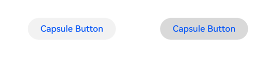
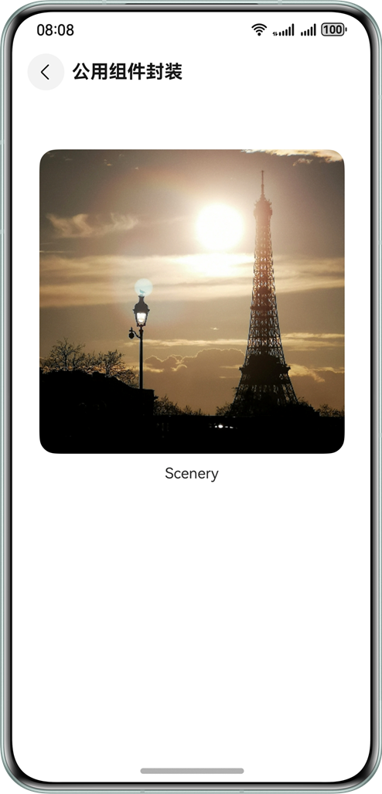
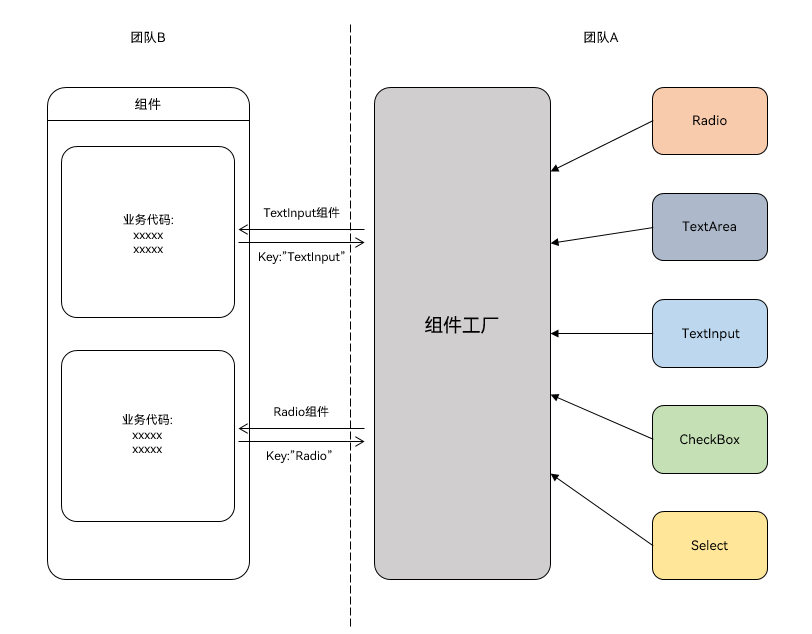

# 组件封装

更新时间：2026-05-18 00:55:31

来源：https://developer.huawei.com/consumer/cn/doc/best-practices/bpta-ui-component-encapsulation

#### 概述
在ArkUI应用开发中，常常需要对UI组件或样式进行封装。封装是为了复用相同或相似的代码功能，提高开发效率，同时也便于工程维护和团队协作。
通常组件封装包含以下典型场景：
- [组件公共样式封装](#section16593152733118)
- [自定义组件封装](#section299514487282)
- [组件工厂类封装](#section178216212105)

#### 组件公共样式封装
#### 场景描述
在开发不同的业务功能时，可能需要使用相同样式的组件。例如，登录页面的登录按钮与购物页面的结算按钮，二者在同一应用中且表示确认操作，可能会采用相同的UI样式。这时可以抽取按钮Button组件的公共样式，封装后实现全局复用。下图是一个在默认态、按压态两种不同情况下的Button按钮。



#### 实现原理
组件的公共样式通过设置组件的属性实现，ArkUI可以使用[AttributeModifier属性修改器](https://developer.huawei.com/consumer/cn/doc/harmonyos-guides/arkts-user-defined-extension-attributemodifier)，将属性封装在同一个AttributeModifier实现类中，在需要复用样式的组件中应用AttributeModifier实例对象。

#### 开发步骤
1. 提供方定义AttributeModifier接口的实现类，封装公共样式属性。// The provider creates a custom Class that implements the system's AttributeModifier interface.
export class MyButtonModifier implements AttributeModifier&lt;ButtonAttribute&gt; {
  private buttonType: ButtonType = ButtonType.Normal;

  constructor() {
  }

  applyNormalAttribute(instance: ButtonAttribute): void {
 instance.type(this.buttonType);
 instance.width(200);
 instance.height(50);
 instance.fontSize(20);
 instance.fontColor('#0A59F7')
 instance.backgroundColor('#0D000000')
  }

  applyPressedAttribute(instance: ButtonAttribute): void {
 instance.fontColor('#0A59F7')
 instance.backgroundColor('#26000000')
  }

  type(type: ButtonType): MyButtonModifier {
 this.buttonType = type;
 return this;
  }
}
2. 使用方创建AttributeModifier实例，将其作为参数传入到系统组件的attributeModifier()方法中，封装的样式会应用到该组件上。@Entry
@Component
struct AttributeStylePage {
  modifier = new MyButtonModifier()
 .type(ButtonType.Capsule)

  build() {
 NavDestination() {
 Column() {
 Button('Capsule Button')
 .attributeModifier(this.modifier)
 }
 .margin({ top: \$r('app.float.margin_top') })
 .justifyContent(FlexAlign.Start)
 .alignItems(HorizontalAlign.Center)
 .width('100%')
 .height('100%')
 }
 .title(getResourceString(\$r('app.string.common_style_extract'), this))
  }
}  AttributeModifier应用在系统组件上，暂不支持修改自定义组件的属性。 AttributeModifier实例可以跨文件导出复用，支持多态样式下的属性/事件修改。 更多参考AttributeModifier使用说明。

#### 自定义组件封装
#### 场景描述
应用开发中，除了UI样式，布局、逻辑等也可能需要复用，这时可以考虑将相同功能或样式的UI内容封装成一个自定义组件。例如，下图是一个包含图片文字的自定义组件，由Image组件和Text组件纵向排列实现，其中Image和Text的样式可由使用方修改。



#### 实现原理
使用@Component[创建自定义组件](https://developer.huawei.com/consumer/cn/doc/harmonyos-guides/arkts-create-custom-components)，将不变的部分实现在组件内部，将可能发生变化的部分，使用参数变量暴露出去。
当前场景下，添加变量设置子组件的attributeModifier()方法，外部使用方通过参数传入AttributeModifier实例，从而实现内部子组件的样式修改。

#### 开发步骤
1. 提供方封装默认属性样式：分别实现Image组件和Text组件的AttributeModifier接口实现类，提供方法设置可能发生变化的属性，例如width、height等。// The AttributeModifier interface implementation class for the Image component.
export class CustomImageModifier implements AttributeModifier&lt;ImageAttribute&gt; {
  private imageWidth: Length = 0;
  private imageHeight: Length = 0;

  constructor(width: Length, height: Length) {
 this.imageWidth = width;
 this.imageHeight = height;
  }

  width(width: Length) {
 this.imageWidth = width;
 return this;
  }

  height(height: Length) {
 this.imageHeight = height;
 return this;
  }

  applyNormalAttribute(instance: ImageAttribute): void {
 instance.width(this.imageWidth);
 instance.height(this.imageHeight);
 instance.borderRadius(\$r('app.float.border_radius'))

  }
}

// Text component's AttributeModifier interface implementation class.
export class CustomTextModifier implements AttributeModifier&lt;TextAttribute&gt; {
  constructor() {
  }

  applyNormalAttribute(instance: TextAttribute): void {
 instance.fontSize(\$r('app.float.font_size_l'));
  }
}
2. 提供方封装自定义组件CustomImageText，添加相关变量，使用默认AttributeModifier对象设置Image、Text。@Component
export struct CustomImageText {
  @Prop imageAttribute: AttributeModifier&lt;ImageAttribute&gt; = new CustomImageModifier(100, 100);
  @Prop textAttribute: AttributeModifier&lt;TextAttribute&gt; = new CustomTextModifier();
  @Prop imageSrc: PixelMap | ResourceStr | DrawableDescriptor;
  @Prop text: string;
  onClickEvent?: () => void;

  build() {
 Column({ space: 12 }) {
 Image(this.imageSrc)
 .attributeModifier(this.imageAttribute)
 Text(this.text)
 .attributeModifier(this.textAttribute)
 }.onClick(() => {
 if (this.onClickEvent !== undefined) {
 this.onClickEvent();
 }
 })
  }
}
3. 使用方在布局中添加自定义组件CustomImageText，可以选择创建Image、Text组件的AttributeModifier实现类实例，传参到CustomImageText组件中修改属性样式。@Component
struct CommonComponent {
  imageAttribute: CustomImageModifier = new CustomImageModifier(330, 330);

  build() {
 NavDestination() {
 Column() {
 CustomImageText({
 imageAttribute: this.imageAttribute,
 imageSrc: \$r('app.media.image'),
 text: 'Scenery',
 onClickEvent: () => {
 this.getUIContext().getPromptAction().showToast({ message: 'Clicked' })
 }
 })
 }
 .margin({ top: \$r('app.float.margin_top') })
 .justifyContent(FlexAlign.Start)
 .alignItems(HorizontalAlign.Center)
 .width('100%')
 .height('100%')
 }
 .title(getResourceString(\$r('app.string.common'), this))
  }
}

#### 组件工厂类封装
#### 场景描述
如下图所示，团队A实现了一个组件工厂类，其中封装了多个组件。业务团队B在不同的开发场景下，希望通过组件名从工厂类实例中获取对应的组件。例如，当B团队向实例中传入参数"TextInput"或"Radio"，可以分别获取TextInput或Radio组件模板。



#### 实现原理
系统提供了[@Builder装饰器](https://developer.huawei.com/consumer/cn/doc/harmonyos-guides/arkts-builder)，其装饰的方法遵循自定义组件build()函数语法规则。将@Builder装饰的方法传入[wrapBuilder](https://developer.huawei.com/consumer/cn/doc/harmonyos-guides/arkts-wrapbuilder)后，会返回[WrappedBuilder](https://developer.huawei.com/consumer/cn/doc/harmonyos-guides/arkts-wrapbuilder)对象，该对象支持赋值和传递。
借助wrapBuilder函数，组件工厂可以使用Map结构存入各种组件，其中key为组件名，value为WrappedBuilder对象，使用时可以通过key值获取相应的组件。

#### 开发步骤
1. 在组件工厂实现方，将需要工厂化的组件通过全局@Builder方法封装。@Builder
function myRadio() {
  Text(\$r('app.string.radio'))
 .width('100%')
 .fontColor(\$r('sys.color.mask_secondary'))
  Row() {
 Radio({ value: '1', group: 'radioGroup' })
 .margin({ right: \$r('app.float.margin_right') })
 Text('man')
  }
  .width('100%')

  Row() {
 Radio({ value: '0', group: 'radioGroup' })
 .margin({ right: \$r('app.float.margin_right') })
 Text('woman')
  }
  .width('100%')
}

@Builder
function myCheckBox() {
  Text(\$r('app.string.checkbox'))
 .width('100%')
 .fontColor(\$r('sys.color.mask_secondary'))
  Row() {
 CheckboxGroup({ group: 'checkboxGroup' })
 .checkboxShape(CheckBoxShape.ROUNDED_SQUARE)
 Text('all')
 .margin({ left: \$r('app.float.margin_right') })
  }
  .width('100%')

  Row() {
 Checkbox({ name: '1', group: 'checkboxGroup' })
 .shape(CheckBoxShape.ROUNDED_SQUARE)
 .margin({ right: \$r('app.float.margin_right') })
 Text('text1')
  }
  .width('100%')

  Row() {
 Checkbox({ name: '0', group: 'checkboxGroup' })
 .shape(CheckBoxShape.ROUNDED_SQUARE)
 .margin({ right: \$r('app.float.margin_right') })
 Text('text2')
  }
  .width('100%')
}
2. 在组件工厂实现方，将封装好的全局@Builder方法使用wrapBuilder函数包裹，并将返回值作为组件工厂Map的value值存入。全部组件存入后，将组件工厂导出供外部使用。// Define the component factory Map.
let factoryMap: Map<string, object> = new Map();

// The components that need to be factory stored in the component factory.
factoryMap.set('Radio', wrapBuilder(myRadio));
factoryMap.set('Checkbox', wrapBuilder(myCheckBox));

// Export assembly factory
export { factoryMap };
3. 在使用方，引入组件工厂并通过key值获取对应的WrappedBuilder对象。// Import the component factory. The path must be based on the actual location.
import { factoryMap } from '../view/FactoryMap';
// ...
// Get the corresponding WrappedBuilder object from the key value of the component factory Map.
let myRadio: WrappedBuilder<[]> = factoryMap.get('Radio') as WrappedBuilder<[]>;
let myCheckbox: WrappedBuilder<[]> = factoryMap.get('Checkbox') as WrappedBuilder<[]>;
4. 在使用方，build()函数中调用WrappedBuilder对象的builder()方法应用具体组件。@Component
struct ComponentFactory {
  build() {
 NavDestination() {
 Column({ space: 12 }) {
 // myRadio and myCheckbox are WrappedBuilder objects obtained from the component factory.
 myRadio.builder();
 myCheckbox.builder();
 }
 .width('100%')
 .padding(\$r('app.float.padding'))
 }
 .title(getResourceString(\$r('app.string.factory'), this))
  }
}

> [!NOTE] 说明
> 使用wrapBuilder方法有以下限制： wrapBuilder方法只支持传入全局@Builder方法。wrapBuilder方法返回的WrappedBuilder对象的builder属性方法只能在struct内部使用。

#### 常见问题
#### 如何调用子组件中的方法
主要有以下方法：
- **方法一****：****使用Controller类**定义Controller类，添加一个方法变量。在子组件中封装具体方法，添加Controller变量，在aboutToAppear()时将方法赋值。父组件中创建Controller实例，并传递给子组件。当父组件执行Controller实例中的方法，会间接调用子组件中的方法。export class Controller {
  action = () => {
  };
}

@Component
export struct ChildComponent {
  @State bgColor: ResourceColor = Color.White;
  controller: Controller | undefined = undefined;
  private switchColor = () => {
 if (this.bgColor === Color.White) {
 this.bgColor = Color.Red;
 } else {
 this.bgColor = Color.White;
 }
  }

  aboutToAppear(): void {
 if (this.controller) {
 this.controller.action = this.switchColor;
 }
  }

  build() {
 Column() {
 Text('Child Component')
 }.backgroundColor(this.bgColor).borderWidth(1)
  }
}

@Entry
@Component
struct Index {
  private childRef = new Controller();

  build() {
 Column() {
 ChildComponent({ controller: this.childRef })

 Button('Switch Color')
 .onClick(() => {
 this.childRef.action();
 })
 .margin({ top: 16 })
 }
 .width('100%')
 .alignItems(HorizontalAlign.Center)
  }
}
- **方法二：****使用@Watch**使用@Watch监听状态变量，当父组件修改此变量时，@Watch的回调方法将被执行，即实现了子组件中的方法调用。 @Component
export struct ChildComponent {
  @State bgColor: ResourceColor = Color.White;
  @Link @Watch('switchColor') checkFlag: boolean;

  private switchColor() {
 if (this.checkFlag) {
 this.bgColor = Color.Red;
 } else {
 this.bgColor = Color.White;
 }
  }

  build() {
 Column() {
 Text('Child Component')
 }.backgroundColor(this.bgColor)
 .borderWidth(1)
  }
}

@Entry
@Component
struct Index {
  @State childCheckFlag: boolean = false;

  build() {
 Column() {
 ChildComponent({ checkFlag: this.childCheckFlag })

 Button('Switch Color')
 .onClick(() => {
 this.childCheckFlag = !this.childCheckFlag;
 })
 .margin({ top: 16 })
 }
 .width('100%')
 .alignItems(HorizontalAlign.Center)
  }
}
- **方法三：使用事件通信**使用Emitter通信机制，在子组件中添加事件监听，在父组件emit发布对应事件，监听的事件被执行，即实现了子组件中的方法调用。 @Component
export struct ChildComponent {
  public static readonly EVENT_ID_SWITCH_COLOR = 'SWITCH_COLOR';
  @State bgColor: ResourceColor = Color.White;
  private switchColor = () => {
 if (this.bgColor === Color.White) {
 this.bgColor = Color.Red;
 } else {
 this.bgColor = Color.White;
 }
  }

  aboutToAppear(): void {
 emitter.on(ChildComponent.EVENT_ID_SWITCH_COLOR, this.switchColor);
  }

  aboutToDisappear(): void {
 emitter.off(ChildComponent.EVENT_ID_SWITCH_COLOR, this.switchColor);
  }

  build() {
 Column() {
 Text('Child Component')
 }.backgroundColor(this.bgColor)
 .borderWidth(1)
  }
}

@Entry
@Component
struct Index {
  build() {
 Column() {
 ChildComponent()

 Button('Switch Color')
 .onClick(() => {
 emitter.emit(ChildComponent.EVENT_ID_SWITCH_COLOR);
 })
 .margin({ top: 16 })
 }
 .width('100%')
 .alignItems(HorizontalAlign.Center)
  }
}

#### 如何调用父组件中的方法
在子组件中添加一个回调方法，当父组件在使用子组件时，将父组件中的方法做为参数传递进去即可。

```ArkTS
import { BusinessError } from '@kit.BasicServicesKit';
import { hilog } from '@kit.PerformanceAnalysisKit';

@Component
export struct ChildComponent {
  call = () => {
  };

  build() {
    Column() {
      Button('Child Component')
        .onClick(() => {
          this.call();
        })
    }
  }
}

@Entry
@Component
struct Index {
  parentAction() {
    try {
      this.getUIContext().getPromptAction().showToast({ message: 'Parent Action' });
    } catch (error) {
      let err = error as BusinessError;
      hilog.warn(0x000, 'testTag', `showToast failed, code=${err.code}, message=${err.message}`);
    }
  }

  build() {
    Column() {
      ChildComponent({ call: this.parentAction })
    }
    .width('100%')
    .alignItems(HorizontalAlign.Center)
  }
}
```

#### 如何将UI的可变部分提取出来，实现类似插槽的功能
使用[@BuilderParam参数](https://developer.huawei.com/consumer/cn/doc/harmonyos-guides/arkts-builderparam#参数初始化组件)或[@BuilderParam尾随闭包](https://developer.huawei.com/consumer/cn/doc/harmonyos-guides/arkts-builderparam#尾随闭包初始化组件)的方法，在封装的子组件中，将可变的UI内容做为变量开放出去，当父组件在应用子组件时实现具体的UI内容。

```ArkTS
@Component
export struct ChildComponent {
  @Builder
  customBuilder() {
  }

  @BuilderParam customBuilderParam: () => void = this.customBuilder;

  build() {
    Column() {
      Text('Text in Child')
      this.customBuilderParam();
    }
  }
}

@Entry
@Component
struct Index {
  @Builder
  componentBuilder() {
    Text(`Parent builder`)
  }

  build() {
    Column() {
      ChildComponent() {
        this.componentBuilder();
      }
    }
    .width('100%')
    .alignItems(HorizontalAlign.Center)
  }
}
```

#### 如何传递UI组件数组，实现ForEach循环渲染
先将UI组件包装成全局@Builder，然后使用[wrapBuilder](https://developer.huawei.com/consumer/cn/doc/harmonyos-guides/arkts-wrapbuilder)依次封装每个@Builder，这样得到的WrappedBuilder对象/数组可以用于参数传递，可以使用ForEach对传递的数组进行渲染。
参考：[builder方法赋值给变量在ui语法中使用](https://developer.huawei.com/consumer/cn/doc/harmonyos-guides/arkts-wrapbuilder#builder方法赋值给变量在ui语法中使用)

#### 示例代码
- [实现组件的封装](https://gitcode.com/harmonyos_samples/ComponentEncapsulation)