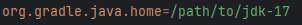

# 变更说明

更新时间：2026-01-21 11:07:33

来源：https://developer.huawei.com/consumer/cn/doc/harmonyos-releases/change-description-600-beta1

##### DevEco Studio 6.0.0 Beta3引入的变更

 

##### hot reload不再支持箭头函数内this变量的首次新增或彻底删除

升级到DevEco Studio 6.0.0 Beta3及以上版本，在hot reload模式下对箭头函数内this变量进行首次新增或彻底删除会报错。
 
**变更影响**
 
hot reload不再支持箭头函数内this变量的首次新增或彻底删除。
 
如用户编写如下代码：
```ArkTS
// test.ets
class Foo {
  str: string = "this is string"
  test() {
    let a = () => {
      console.log(this.str)
    }
    a()
  }
}
let foo = new Foo()
```
 
 
使用hot reload模式进行调试。调试时，修改代码为：
 
```text
class Foo {
  str: string = "this is string"
  test() {
    let a = () => {
      console.log("this is change")
    }
    a()
  }
}
let foo = new Foo()
```
 
进行hot reload则会报错，报错内容如下：
 
```text
compile error: 10706001 Unsupported Change in Hot Reload 
compile error: Error Message: Found lexical variable added or removed in 'xxxxx', not supported! 
compile error: [Patch] Found unspported change in file, will not generate patch!
```
 
**适配指导**
 
若需要在hot reload时对箭头函数内this变量进行首次新增或彻底删除，则需要重新编译并调试。
 
 

##### DevEco Studio 6.0.0 Beta1引入的变更

 

##### DevEco Studio底座升级，语言切换方式变更，部分插件不可使用

DevEco Studio 6.0.0 Beta1版本适配IntelliJ 2024.3.3底座升级后，语言切换方式变更，部分插件不可使用。
 
**变更影响**
 1. 语言插件生效机制变更：之前版本需要通过Plugins中启用语言插件来控制界面语言的显示；新版本中，中文化插件无需下载，默认安装开启，切换界面显示语言方式变更。
2. 部分插件不可使用：如果插件未适配IntelliJ 2024.3.3版本，可能会出现不可使用的情况。
 
**适配指导**
 1. 如需切换DevEco Studio语言显示效果，在菜单栏进入**File > Settings... > Appearance & Behavior > System Settings** > **Language**，语言选择**Chinese**并点击**Apply**，在弹窗中点击**Restart**重启即可完成语言切换。
2. 请更换使用已适配新底座IntelliJ 2024.3.3的插件版本。
 
 

##### ArkTS日志位置调整

升级到DevEco Studio 6.0.0 Beta1及以上版本，ArkTS日志位置变更如下。
  
| 场景 | hvigor日志参数 | 输出位置 | ArkTS的日志信息（变更前） | ArkTS的日志信息（变更后） |
| --- | --- | --- | --- | --- |
| ArkTS报错 | --info | stdout | null | info |
| ArkTS报错 | stderr | --info | info、warn、error | warn、error |
| ArkTS报错 | --warn | stdout | null | null |
| --warn | stderr | info、warn、error | warn、error |
| --error | stdout | null | null |
| --error | stderr | info、warn、error | error |
| 编译成功 | --info | stdout | info、warn | info |
| 编译成功 | stderr | --info | error | warn、error |
 
 
**变更影响**
 
通过hvigor-config.json5文件的[level](https://developer.huawei.com/consumer/cn/doc/harmonyos-guides/ide-hvigor-set-options#section85176471028)字段指定日志级别，或通过[命令行方式](https://developer.huawei.com/consumer/cn/doc/harmonyos-guides/ide-hvigor-commandline#section682961710111)指定日志级别，不同的日志级别打印的信息变化如下：
 
- ArkTS报错场景：
--info：info日志的输出位置从stderr移动到stdout。
- --warn：不再打印info日志。
- --error：不再打印info、warn日志。

 - 编译成功场景：
ArkTS的warn日志从stdout移动到stderr。

 
 
**适配指导**
 
根据上面表格找到变更后的日志位置进行适配。
 
 

##### ArkUI-X工程配套的gradle版本变更

升级到DevEco Studio 6.0.0 Beta1及以上版本，历史版本创建的ArkUI-X工程会构建失败。
 
**变更影响**
 
如果ArkUI-X工程是使用DevEco Studio 6.0.0 Beta1以下版本创建的，升级到Beta1及以上版本，编译会失败，并提示Could not open settings generic class cache for settings file。
 


 
**适配指导**
 
- **方式一：升级gradle版本**修改gradle-wrapper.properties中的distributionUrl，升级为8.4版本。

  
```text
<span style="color: rgb(181,106,1);">distributionUrl</span><span style="color: rgb(128,128,128);">=</span><span style="color: rgb(80,160,79);">https</span>\:<span style="color: rgb(80,160,79);">//repo.huaweicloud.com/gradle/gradle-8.4-bin.zip</span>
```


 
- **方式二：指定使用jdk17**如果本地有jdk17，可以在gradle.properties中通过org.gradle.java.home变量指定使用jdk17。

  

