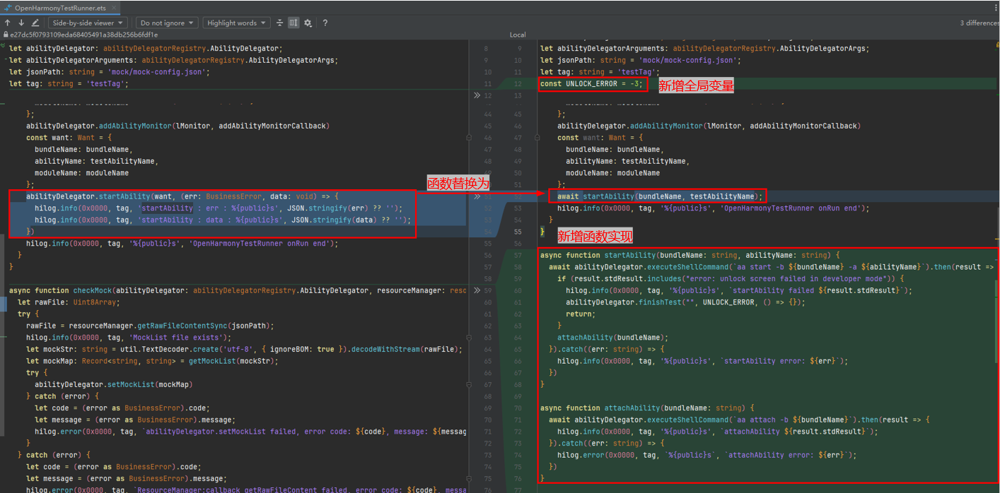
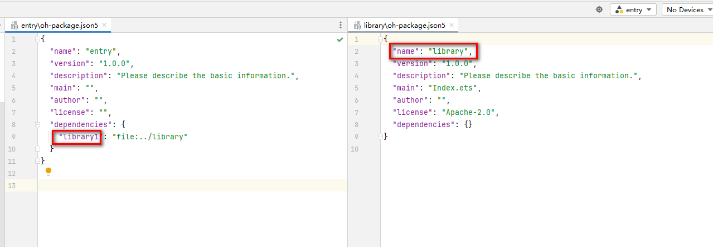
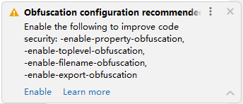

# 变更说明

更新时间：2026-01-21 11:07:33

来源：https://developer.huawei.com/consumer/cn/doc/harmonyos-releases/ide-changelog-500-release

#### 5.0.3.814至5.0.3.900

 

#### OpenHarmonyTestRunner.ets文件onRun接口内容变更

**变更原因**
 
受[startAbility锁屏时限制拉起行为](https://developer.huawei.com/consumer/cn/doc/harmonyos-releases/changelogs-for-all-apps-b071#startabilityopenlink锁屏时限制拉起行为)影响，测试框架原先调用abilityDelegator.startAbility接口拉起的TestAbility应用无法在锁屏状态下拉起，需要对工程进行适配。
 
**变更影响**
 
此变更涉及应用适配。
 
变更前：锁屏时可调用abilityDelegator.startAbility接口正常拉起TestAbility应用并正常保持应用窗口为前台状态，可以正常测试。
 
变更后：锁屏时调用abilityDelegator.startAbility接口拉起TestAbility应用时，当应用窗口到前台状态时会被窗口管理阻止进而关闭窗口和应用，无法正常测试。
 
**起始API Level**
 
6
 
**适配指导**
 
对于DevEco Studio NEXT Developer Beta1（5.0.3.403）之前版本创建的历史工程，在使用了版本配套的新镜像（NEXT.0.0.71）后，如果遇到测试框架没有正确测试结果返回或者运行异常的问题，可以尝试将“模块名称/src/ohosTest/ets/testrunner/OpenHarmonyTestRunner.ets”文件的以下代码：
 
```json
async onRun() {
    ...
    abilityDelegator.startAbility(want, (err: BusinessError, data: void) => {
      hilog.info(0x0000, tag, 'startAbility : err : %{public}s', JSON.stringify(err) ?? '');
      hilog.info(0x0000, tag, 'startAbility : data : %{public}s', JSON.stringify(data) ?? '');
    })
    ...
}
```
 
修改为：
 
```text
// 新增全局变量
const UNLOCK_ERROR = -3;
```
 
```text
// 替换函数
async onRun() {
    ...
    await startAbility(bundleName, testAbilityName);
    ...
}
```
 
```bash
// 新增函数实现
async function startAbility(bundleName: string, abilityName: string) {
  await abilityDelegator.executeShellCommand(`aa start -b ${bundleName} -a ${abilityName}`).then(result => {
    if (result.stdResult.includes("error: unlock screen failed in developer mode")) {
      hilog.info(0x0000, tag, '%{public}s', `startAbility failed ${result.stdResult}`);
      abilityDelegator.finishTest("", UNLOCK_ERROR, () => {});
      return;
    }
    attachAbility(bundleName);
  }).catch((err: string) => {
    hilog.info(0x0000, tag, '%{public}s', `startAbility error: ${err}`);
  })
}
 
async function attachAbility(bundleName: string) {
  await abilityDelegator.executeShellCommand(`aa attach -b ${bundleName}`).then(result => {
    hilog.info(0x0000, tag, '%{public}s', `attachAbility ${result.stdResult}`);
  }).catch((err: string) => {
    hilog.error(0x0000, tag, `%{public}s`, `attachAbility error: ${err}`);
  })
}
```
 



 
 

#### 5.0.3.706至5.0.3.800

 

#### SDK路径变更

升级到DevEco Studio NEXT Beta1（5.0.3.800）版本，SDK路径发生变化，hdc环境变量失效，需根据新的sdk路径重新配置hdc环境变量。
 
**变更影响**
 
旧版本hdc工具路径：DevEco Studio安装目录/sdk/HarmonyOS-NEXT-DBx/openharmony/toolchains
 
新版本hdc工具路径：DevEco Studio安装目录/sdk/default/openharmony/toolchains
 
**适配指导**
 
请根据新的sdk路径重新配置hdc环境变量。
 

 
 

#### @security/specified-interface-call-chain-check配置字段变更

Code Linter检查安全规则@security/specified-interface-call-chain-check中，namespace字段配置类型从字符串变更为数组。
 
**适配指导**
 
若应用代码工程根目录code-linter.json5文件中存在该规则时，需要将namespace字段配置类型修改为数组。具体请参考[@security/specified-interface-call-chain-check](https://developer.huawei.com/consumer/cn/doc/harmonyos-guides-V5/ide-specified-interface-call-chain-check-V5)。
 
 

#### 编译构建校验增强

升级到DevEco Studio NEXT Beta1（5.0.3.800）版本后，编辑器、编译构建针对上架检测的部分规则增强校验。
 
**变更影响**
 
可能会导致部分历史工程在编辑器报错，编译构建失败。增强校验的检测规则如下：
 
- module.json5中type为form的ExtensionAbility中的metadata字段不能缺省，也不能是空数组。
- module.json5中type为form的ExtensionAbility中的metadata必须要存在一个name为‘ohos.extension.form’的对象值，且对应的resource值不能缺省。
- module.json5中的requestPermissions字段使用的权限必须为系统已定义好的权限或者definePermissions字段中定义的权限。

 
**适配指导**
 
- 在module.json5中type为form的ExtensionAbility中增加metadata字段，补充一个name为‘ohos.extension.form’的对象值，并配置对应的resource值，具体配置方式参考[metadata标签](https://developer.huawei.com/consumer/cn/doc/harmonyos-guides-V5/module-configuration-file-V5#metadata标签)。
- 将module.json5中的requestPermissions字段使用的权限修改为系统已定义好的权限或者definePermissions字段中定义的权限。

 
 

#### 默认构建字节码HAR

升级到DevEco Studio NEXT Beta1（5.0.3.800）及以上版本，新建工程的工程级build-profile.json5的[useNormalizedOHMUrl](https://developer.huawei.com/consumer/cn/doc/harmonyos-guides-V5/ide-hvigor-build-profile-V5)字段默认为true。
 
**变更影响**
 
升级到DevEco Studio NEXT Beta1（5.0.3.800）及以上版本，
 
- 对于历史工程：
如果工程级build-profile.json5文件的useNormalizedOHMUrl字段为true，则默认将[noExternalImportByPath](https://developer.huawei.com/consumer/cn/doc/harmonyos-guides-V5/ide-hvigor-build-profile-V5)设置为true，即通过相对路径跨模块或绝对路径导入文件，编译会报错。
```text
import {MainPage} from '../../../../../library/src/main/ets/MainPage'  // 相对路径跨模块导入，编译报错
```

- 如果工程级build-profile.json5文件的useNormalizedOHMUrl字段为true，则oh-package.json5中依赖的包使用的别名需要和依赖包的oh-package.json5的name保持一致，否则编译会报错。



 - 新建工程时，默认构建[字节码格式的HAR](https://developer.huawei.com/consumer/cn/doc/harmonyos-guides-V5/ide-hvigor-build-har-V5#section179161312181613)。

 
**适配指导**
 
- 在报错代码所在模块的oh-package.json5文件中配置dependencies依赖，并通过以下方式导入文件。
```text
import {MainPage} from 'library'
```

- 将oh-package.json5中依赖的包使用的别名，修改为依赖包的oh-package.json5中的name。

 
 

#### 5.0.3.600至5.0.3.700

 

#### HAR模块so打包规格变更

 
当har模块（如harA）链接了“依赖har模块（如harB）中的so”时，默认此so不会被打包到harA中。
 
**变更影响**
 
- 从DevEco Studio 5.0.403升级到5.0.500版本时，构建native工程使用的cmake版本从3.16.5升级到3.28.2，当某har模块（如harA）的CMakeLists.txt中链接了“依赖har模块（如harB）中的so”时，此so会被打包到harA中，可能导致最终打HAP包时so版本冲突，具体请参考[cmake版本升级](https://developer.huawei.com/consumer/cn/doc/harmonyos-releases/changelogs-for-all-apps-b031#应用编译构建对不支持命令强校验)。
- 升级到DevEco Studio 5.0.3.700版本之后，当har模块（如harA）链接了“依赖har模块（如harB）中的so”时，默认此so不会被打包到harA中。

 
**适配指导**
 
如果开发者希望修改此默认规格，在harA模块打包的产物中包含harB的so，请在工程级或模块级build-profile.json5文件中buildOption下添加nativeLib/excludeFromHar字段，并设置为false。具体请参考[build-profile.json5](https://developer.huawei.com/consumer/cn/doc/harmonyos-guides-V5/ide-hvigor-build-profile-V5)。
```text
<span style="color: rgb(255,0,170);">"buildOption"</span>: {
  <span style="color: rgb(255,0,170);">"nativeLib"</span>: {
    <span style="color: rgb(255,0,170);">"excludeFromHar"</span>: false
  }
}
```
 
 

#### 5.0.3.502至5.0.3.600

 

#### 代码混淆变更

升级到DevEco Studio NEXT Developer Beta3（5.0.3.600）及以上版本，新建工程/模块时，模块中的build-profile.json5文件的代码混淆开关enable字段默认值由true改为false；打开历史工程时，DevEco Studio会提示用户增加推荐的混淆规则。
 
**变更影响**
 
升级到DevEco Studio NEXT Developer Beta3（5.0.3.600）及以上版本：
 
- 如果历史工程开启了代码混淆功能，并且obfuscation-rules.txt文件中未配置规则，打开DevEco Studio后会弹窗提示用户增加推荐的混淆规则，包含-enable-property-obfuscation、-enable-toplevel-obfuscation、-enable-filename-obfuscation、-enable-export-obfuscation四项混淆规则，以保护代码资产。
- 新建工程及模块默认关闭代码混淆功能，如需开启，请打开混淆开关并配置混淆项，具体请参考[代码混淆](https://developer.huawei.com/consumer/cn/doc/harmonyos-guides-V5/ide-build-obfuscation-V5)。

 
**适配指导**
 
打开历史工程，请根据DevEco Studio提示进行操作，点击Enable按钮，配置完成后会在obfuscation-rules.txt文件中增加四项推荐的混淆规则。
 



 
 

#### 5.0.3.500至5.0.3.502

 

#### strip字段缺省默认值变更

工程级和模块级build-profile.json5文件中的strip字段缺省默认值由false改为true。
 
**变更影响**
 
升级到DevEco Studio NEXT Developer Beta2（5.0.3.502）及以上版本：
 
- 打包到har包的.so文件默认不带调试信息，har包内的.so文件无法进行调试。
- 打包的.so文件默认不带符号表，导致DevEco Profiler工具的基础耗时分析和内存分析可能采集不到符号名称。

 
**适配指导**
 
如需对har包内的.so文件进行CPP代码调试或采集完整的符号名称，请在模块打包之前，在工程级或模块级build-profile.json5文件中buildOption下添加nativeLib/debugSymbol/strip字段并设置为false。具体请参考[build-profile.json5](https://developer.huawei.com/consumer/cn/doc/harmonyos-guides-V5/ide-hvigor-build-profile-V5)。
 
```text
<span style="color: rgb(255,0,170);">"buildOption"</span>: {
  <span style="color: rgb(255,0,170);">"nativeLib"</span>: {
    <span style="color: rgb(255,0,170);">"debugSymbol"</span>: {
      <span style="color: rgb(255,0,170);">"strip"</span>: <span style="color: rgb(0,0,255);">false</span>
    }
  }
}
```
 
 

#### 5.0.3.403至5.0.3.500

 

#### 编辑器校验增强

DevEco Studio NEXT Developer Beta2（5.0.3.500）及以上版本，对@Component组件状态属性的类型限制、@ComponentV2组件构造传参的使用方式进行增强校验。
 
**变更影响**
 
新增校验规则：
 
- @Component组件中，以下框架内置的属性装饰器(@State/@Prop/@Link/@Provide/@Consume/@ObjectLink/@BuilderParam/@StorageProp/@StorageLink/@LocalStorageLink/@LocalStorageProp)装饰的struct成员属性不能为CustomDialogController等限制类型。限制类型请参考DevEco Studio安装路径下（deveco-studio\sdk\HarmonyOS-NEXT-DB2\openharmony\ets\component），build_config.json文件中forbiddenUseStateType字段所含类型。变更前：编辑器不会报错，编译构建会报错。

  变更后：历史工程可能出现新增的编辑器报错。
- @ComponentV2组件中，只有@Param/@Event/@BuilderParam装饰的属性能接收参数。变更前：编辑器、编译构建均不会报错。

  变更后：历史工程可能出现新增的报错信息。
- 对没有被@Component、@ComponentV2、@CustomDialog修饰的组件struct会进行告警，其告警级别从warn调整为error。变更前：编辑器报错为warn。

  变更后：编辑器报错为error。

 
**适配指导**
 
请根据上述校验规则要求及页面提示信息进行修改，避免影响后续编译。
 

 
 

#### hdc新增鉴权机制变更

5.0.0.30版本之前镜像ROM（后面统称为旧版本ROM）和5.0.3.404之前SDK对应hdc（后面统称为旧版本hdc）不具备鉴权机制，5.0.0.30版本及之后的镜像ROM（后面统称为新版本ROM）和5.0.3.404或以上版本SDK对应hdc（后面统称为新版本hdc）新增鉴权机制。
 
**变更影响**
 
若同时升级新版本的ROM和配套的hdc工具，在首次连接设备时将出现授权的提示，需要手动点击确认授权弹窗；
 
若升级了新版本的ROM，但未使用新版本配套的hdc工具，将出现识别不到设备的问题。
 
- 场景一：

 
升级了ROM，但未升级DevEco Studio。由于一体化后，SDK已打包进DevEco Studio，若DevEco Studio未升级，SDK里的hdc工具也无法升级，导致hdc工具版本过旧，无法识别到设备。
 
- 场景二：

 
升级了ROM，同时升级了新版本配套的DevEco Studio，但当前启动的hdc不是新版本DevEco Studio（5.0.3.404或以上版本）自带的hdc工具。可能由于之前配置过旧版本hdc环境变量，在脱离IDE场景下启动了旧版本的hdc，导致当前使用的hdc工具版本过旧，无法识别到设备。
 
> [!NOTE]
> 可通过如下方式确认当前启动的hdc是否为新版本DevEco Studio自带的hdc工具：使用任务管理器/活动监视器查找hdc，并查看文件所在位置（新版本自带的hdc工具位置：新版本DevEco Studio安装目录/sdk/HarmonyOS-NEXT-DB2/openharmony/toolchains）。

 
**适配指导**
 
请升级DevEco Studio至配套版本。
 
 

#### SDK路径变更

升级到DevEco Studio NEXT Developer Beta2（5.0.3.500）版本，SDK路径发生变化，hdc环境变量失效，需根据新的sdk路径重新配置hdc环境变量。
 
**变更影响**
 
旧版本hdc工具路径：DevEco Studio安装目录/sdk/HarmonyOS-NEXT-DB1/openharmony/toolchains
 
新版本hdc工具路径：DevEco Studio安装目录/sdk/HarmonyOS-NEXT-DB2/openharmony/toolchains
 
**适配指导**
 
请根据新的sdk路径重新配置hdc环境变量。
