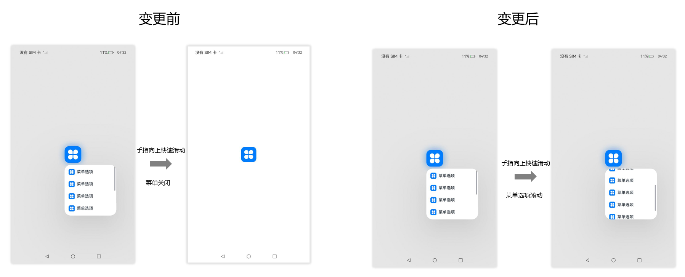
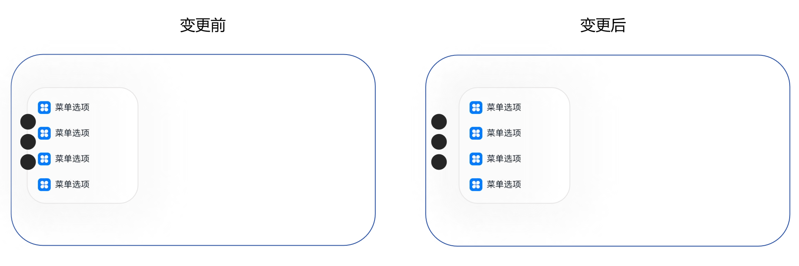
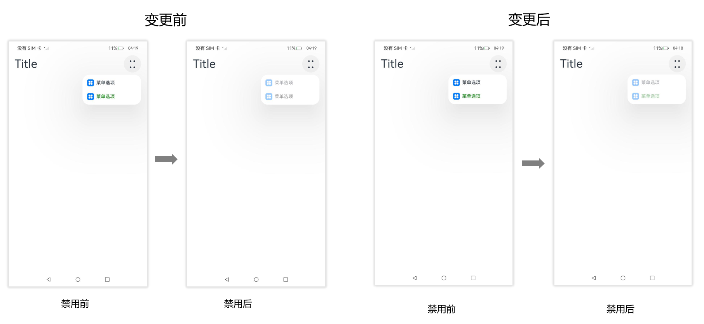
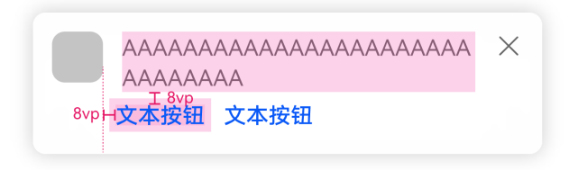
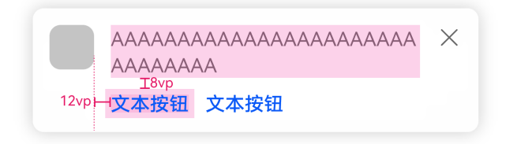

# UX样式或效果的变更

更新时间：2026-01-21 11:07:33

来源：https://developer.huawei.com/consumer/cn/doc/harmonyos-releases/changelogs-ux-b035

## bindContentCover动效参数变更


变更原因

为满足应用诉求和UX规格，全模态动效参数改为与半模态一致。

变更影响

此变更涉及应用适配。

变更前，全模态动效参数为interpolatingSpring(velocity:n, mass:1, stiffness:100, damping:20)，动效时长约为1200ms。

变更后，全模态动效参数为interpolatingSpring(velocity:n, mass:1, stiffness:328, damping:36)，动效时长约为800ms。

起始API Level

11

变更的接口/组件

bindContentCover组件

适配指导

默认行为变更，应注意变更后的默认效果是否符合开发者预期，如不符合则自定义修改效果控制变量以达到预期。可通过transition接口自定义动效。


## DatePickerDialog显示时间时分割线延长


变更原因

修正视觉效果以获得更好的用户体验。

变更影响

此变更涉及应用适配。


| 变更前 | 变更后 |
| --- | --- |
|  |  |


起始API Level

12

变更的接口/组件

涉及的组件：DatePickerDialog。

适配指导

默认行为变更，无需适配。


## 子窗显示的Toast不响应返回事件


变更原因

按照业界惯例，Toast默认不会响应返回手势事件，当前子窗下的Toast会响应返回事件，不符合规范。

变更影响

此变更涉及应用适配。

变更前：Toast会响应返回手势，Toast消失。

变更后：Toast不会响应返回手势，Toast不消失，返回手势事件传递到页面其他组件。

起始API Level

9

变更的接口/组件

promptAction.showToast

适配指导

默认行为变更，应注意后续不支持通过返回手势退出toast。


## 带按钮的气泡样式变更


变更原因

popup的按钮文本过长时，布局显示异常。

变更影响

此变更涉及应用适配。


| 变更前 | 变更后 |
| --- | --- |
| 按钮文本的最大行数没有限制，按钮内容会相互交叉 | 最多可显示两行文本，文本逐渐缩小到9vp，仍然超长"..."省略 |
|  |  |


起始API Level

7

变更的接口/组件

bindPopup

适配指导

默认效果变更，无需适配。


## 半模态挡位内容经过开发者动态改变后，挡位索引默认为0


变更原因

为解决半模态拖动到悬浮窗时半模态需保持拖拽后的挡位，引入该体验问题，需要修复引入的问题。

变更影响

此变更涉及应用适配。

变更前：半模态经过手指拖拽并且在开发者动态改变挡位后，因挡位索引保持为手指拖拽的索引，半模态刷新成新挡位数组对应索引的高度。

变更后：半模态挡位内容在开发者动态改变后，挡位索引标记为0，半模态刷新成开发者设的新挡位数组第一位的高度。


| 变更前(点击Button) | 变更后(点击Button) |
| --- | --- |
|  |  |


起始API Level

10

变更的接口/组件

detents接口/BindSheet组件

适配指导

默认行为变更，应注意变更后的行为是否对整体应用逻辑产生影响。


## Toast样式变更


变更原因

Toast文本有两行时，有概率出现文本居中显示，不符合规范，规范为Toast多行显示时，需左对齐显示。

变更影响

此变更涉及应用适配。


| 变更前 | 变更后 |
| --- | --- |
| 文本居中显示 | 文本左对齐显示 |
|  |  |


起始API Level

9

变更的接口/组件

promptAction.showToast

适配指导

默认效果变更，无需适配。


## 高级组件ComposeListItem右边按钮OperateItem类型为arrow或者arrow+text时，在没有配置action的时候，不需要单独响应点击效果，应显示全局的按压效果


变更原因

高级组件ComposeListItem整个组件分为左右两部分，左边是内容区，右边是按钮操作区。现在问题是右边操作区按钮的OperateItem类型为arrow或者arrow+text时，在没有提供action的时候，会单独响应点击效果，预期不应该显示的；需要修改为在没有提供action的时候，右侧操作区不应该响应单独点击效果，而是整个组件响应按压效果。

变更影响

此变更涉及应用适配。


| 变更前 | 变更后 |
| --- | --- |
| 右侧操作区OperateItem类型为arrow或者arrow+text时，没有提供action，右侧操作区单独响应了阴影效果。 | 右侧操作区OperateItem类型为arrow或者arrow+text时，没有提供action，整个组件响应了阴影效果。 |
|  |  |


起始API Level

11

变更的接口/组件

高级组件ComposeListItem组件

适配指导

默认行为变更，无需适配。


## Navigation分割线触摸直接响应


变更原因

基于UX人因规格，区隔拖拽和滑动体验，针对分割线的拖拽行为进行时延显示调整。

变更影响

此变更涉及应用适配。

变更前：手指需长按500ms，Navigation的分割线才可响应滑动。

变更后：手指触摸Navigation的分割线可立即响应滑动。

起始API Level

9

适配指导

默认行为变更，无需适配。


## BindContextMenu上下文菜单内容可滚动时快滑不再关闭菜单


变更原因

BindContextMenu上下文菜单选项过多会出现滚动条，此时手指快速滑动菜单选项，该行为不会上下滚动菜单选项，而是自动关闭菜单，影响用户体验。

变更影响

此变更涉及应用适配。

变更前：上下文菜单无论是否有滚动条时，手指快速滑动菜单选项均会自动关闭菜单。

变更后：上下文菜单选项没有滚动条时，手指快速滑动菜单选项会自动关闭菜单；上下文菜单选项过多出现滚动条时，手指快速滑动菜单选项只会上下滚动菜单选项，不再主动关闭菜单。





起始API Level

8

变更的接口/组件

Menu组件的BindContextMenu接口

适配指导

默认行为变更，无需适配。


## Menu组件箭头离宿主节点默认安全边距变更


变更原因

带箭头菜单离宿主节点过远，变更后效果更佳。

变更影响


| 变更前箭头离宿主节点16vp | 变更后箭头离宿主节点8vp |
| --- | --- |
|  |  |


起始API Level

10

变更的接口/组件

Menu组件。

适配指导

带箭头菜单离宿主节点的默认安全距离变小，若需要更大的间距，可设置菜单的offset进行调整。


## MenuItemGroup嵌套MenuItem且MenuItem设置margin top或者bottom时，布局效果变更


变更原因

MenuItemGroup高度没有加上MenuItem的margin高度，布局错乱，变更后布局正常。

变更影响

示例代码：

```ts
@Entry
@Component
struct Index {
build() {
Row() {
Button("菜单1").bindMenu(this.TestMarginTop())
}
}

@Builder
TestMarginTop() {
Menu() {
MenuItemGroup() {
MenuItem({content:"第一个"}).margin({top:20, bottom:20}).borderWidth(2).borderColor(Color.Black)
MenuItem({content:"第二个"}).margin({top:20}).borderWidth(2).borderColor(Color.Black)
MenuItem({content:"第三个"}).margin({bottom:20}).borderWidth(2).borderColor(Color.Black)
MenuItem({content:"第四个"}).borderWidth(2).borderColor(Color.Black)
}
}
}
}
```


| 变更前布局错乱 | 变更后布局正常 |
| --- | --- |
|  |  |


起始API Level

7

变更的接口/组件

Menu组件。

适配指导

菜单布局效果变更，应用无需适配。


## Menu中MenuItem全部设置margin后，左右边距布局效果变更


变更原因

Menu中MenuItem全部设置margin后，左右边距不对称，变更后左右对称。

变更影响

示例代码：

```ts
@Entry
@Component
struct Index {
build() {
Column() {
Text('click for Menu')
.fontSize(20)
.margin({ top: 20 })
.bindMenu(this.TestMenuItemMarginLeftAndRight)
}
.height('100%')
.width('100%')
}

@Builder
TestMenuItemMarginLeftAndRight() {
Menu() {
MenuItem({content:"这是menuitem1"}).margin(10).borderWidth(1)
}
.borderWidth(2)
.borderColor(Color.Red)
.width(200)
}
}
```


| 变更前边距不对称 | 变更后左右对称 |
| --- | --- |
|  |  |


起始API Level

7

变更的接口/组件

Menu组件。

适配指导

菜单布局效果变更，应用无需适配。


## 菜单避让手机挖孔变更


变更原因

开发者在应用侧的module.json5中配置开启避让手机挖孔时，菜单未避让挖孔。

```json
{
  "module": {
    "metadata": [
      {
        "name": "avoid_cutout",
        "value": "true"
      }
    ]
  }
}
```

变更影响

此变更涉及应用适配。

变更前：竖屏时菜单默认避让挖孔；横屏时，应用配置开启避让手机挖孔，菜单不会避让挖孔。

变更后：竖屏时菜单默认避让挖孔；横屏时，应用配置开启避让手机挖孔，菜单会避让挖孔。





起始API Level

- Menu组件BindMenu：7
- Menu组件BindContextMenu：8


变更的接口/组件

Menu组件的BindMenu

Menu组件的BindContextMenu

适配指导

默认行为变更，无需适配。


## TimePickerDialog标题高度变更


变更原因

修正视觉效果以获得更好的用户体验。

变更影响

此变更涉及应用适配。

变更前：标题高度为46vp。

变更后：标题高度为56vp。


| 变更前 | 变更后 |
| --- | --- |
|  |  |


起始API Level

8

变更的接口/组件

TimePickerDialog组件。

适配指导

默认行为变更，无需适配。


## SubMenu避让底部导航条距离变更


变更原因

Menu避让能贴近底部导航条，而SubMenu避让位置无法贴近底部导航条，视觉效果不好。

变更影响

此变更涉及应用适配。

变更前：SubMenu避让底部导航条之后避让了一个固定高度的padding。

变更后：SubMenu仅避让底部导航条，不额外添加固定高度的padding。


| 变更前 | 变更后 |
| --- | --- |
|  |  |


起始API Level

7

变更的接口/组件

Menu组件。

适配指导

默认行为变更，无需适配。


## MenuItem组件禁用状态下字体颜色变更


变更原因

MenuItem设置enable为false时, 组件将处于禁用状态，此时字体颜色为默认的灰色，开发者设置的字体颜色将不会生效。

变更影响

此变更涉及应用适配

变更前：MenuItem设置enable为false时，无论开发者是否设置字体颜色，组件禁用状态下的字体颜色均为默认字体颜色 * 不透明度40%。

变更后：MenuItem设置enable为false时，若开发者未设置字体颜色，则组件禁用状态下的字体颜色为默认字体颜色 * 不透明度40%；若开发者设置了字体颜色，则组件禁用状态下的字体颜色为自定义字体颜色 * 不透明度40%；





起始API Level

9

变更的接口/组件

MenuItem组件。

适配指导

默认行为变更，无需适配。


## Menu、Toast修改阴影参数


变更原因

当前Menu、Toast组件阴影不明显，背景颜色和组件颜色接近时，区分度不高。

变更影响

此变更涉及应用适配。


| 变更前阴影 | 变更后阴影 |
| --- | --- |
|  |  |
|  |  |


起始API Level

- Menu组件的BindMenu：7
- Menu组件的BindContextMenu：8
- Toast组件的ShowToast：9


变更发生版本

从OpenHarmony SDK 5.0.0.35开始。

变更的接口/组件

Menu组件的BindMenu接口

Menu组件的BindContextMenu接口

Toast组件ShowToast接口

适配指导

默认效果变更，无需适配。


## Scroll、List、Grid、WaterFlow组件scrollBarColor接口变更


变更原因

统一Scroll、List、Grid、WaterFlow组件scrollBarColor接口在设置负数时的行为。

变更影响

此变更涉及应用适配。

变更前，Scroll组件scrollBarColor接口设置负数时按默认值0x66182431处理，List、Grid、WaterFlow组件scrollBarColor接口设置负数时按黑色0xFF000000处理。

变更后，Scroll、List、Grid、WaterFlow组件scrollBarColor接口设置负数时按无符号整数对应的ARGB颜色处理。

起始API Level

7

变更的接口/组件

Scroll、List、Grid、WaterFlow组件scrollBarColor接口

适配指导

默认行为变更，无需适配。


## 手机横屏及其他设备，上下文菜单placement变更


变更原因

手机横屏及其他设备场景，布局计算未按照用户设置的placement进行，导致显示异常。变更后布局效果符合预期。

变更影响

此变更涉及应用适配。

变更前：手机横屏及其他设备，布局计算基于默认的Placement.BOTTOM_RIGHT进行，导致上下文菜单大小、位置异常。

变更后：手机横屏及其他设备，布局计算基于用户设置的placement进行，当用户未设置placement时，使用默认的Placement.BOTTOM_RIGHT进行，最终布局效果符合预期。


| 变更前 | 变更后 |
| --- | --- |
|  |  |


起始API Level

8

变更的接口/组件

bindContextMenu的placement属性。

适配指导

默认行为变更，无需适配。


## Toggle/Switch按压反馈样式变更


变更原因

UX规范变更

变更影响

变更前：Toggle/Switch有按压反馈，点击时会有按压效果。

变更后：去除Toggle/Switch按压反馈，点击时无按压效果。


| 变更前 | 变更后 |
| --- | --- |
|  |  |


起始API Level

8

适配指导

按压显示效果变化，无需适配。


## Tabs组件的页签可滚动且为非子页签样式时增加页签默认切换动效


变更原因

快速连续切换页签时，页签产生跳变现象，视觉效果不佳。

变更影响

变更前：Tabs组件的barMode为BarMode.Scrollable，TabContent组件的tabBar为子页签样式时有默认切换动效，即切换页签后，选中页签执行动画平移至tabBar中间位置。但非子页签样式时无默认切换动效，即切换页签后，选中页签立即跳变至tabBar中间位置。

变更后：Tabs组件的barMode为BarMode.Scrollable，TabContent组件的tabBar为任意页签样式时均有默认切换动效，切换动效的时长为Tabs组件的animationDuration属性值。


| 变更前 | 变更后 |
| --- | --- |
|  |  |


起始API Level

7

变更的接口/组件

Tabs组件

适配指导

若希望关闭页签的默认切换动效，可设置Tabs组件的animationDuration属性值为0，但同时TabContent页面的默认切换动效也会被关闭。示例代码如下：

```ts
@Entry
@Component
struct TabsSample {
@State currentIndex: number = 0;

@Builder TabBuilder(index: number, name: string) {
Text(name)
.fontColor(this.currentIndex === index ? Color.White : Color.Black)
.fontSize(this.currentIndex === index ? 18 : 16)
.fontWeight(this.currentIndex === index ? 500 : 400)
.textAlign(TextAlign.Center)
.width(100)
.height(48)
.margin({ left: 4, right: 4 })
.backgroundColor(this.currentIndex === index ? '#007DFF' : '#F1F3F5')
.borderRadius(24)
}

build() {
Column() {
Tabs({ index: this.currentIndex }) {
TabContent() {
Column().width('100%').height('100%').backgroundColor('#00CB87')
}.tabBar(this.TabBuilder(0, 'green'))

TabContent() {
Column().width('100%').height('100%').backgroundColor('#007DFF')
}.tabBar(this.TabBuilder(1, 'blue'))

TabContent() {
Column().width('100%').height('100%').backgroundColor('#FFBF00')
}.tabBar(this.TabBuilder(2, 'yellow'))

TabContent() {
Column().width('100%').height('100%').backgroundColor('#E67C92')
}.tabBar(this.TabBuilder(3, 'pink'))
}
.height(300)
.barMode(BarMode.Scrollable, { margin: 16 })
.fadingEdge(false)
.animationDuration(0)
.onChange((index: number) => {
this.currentIndex = index
})
}.width('100%')
}
}
```


## Popup（气泡组件）UX样式变更


变更原因

Popup（气泡组件）UX样式不符合规范

变更影响

此变更涉及应用适配。

变更前：

1、按钮与文本左侧没有对齐

2、按钮上方与文本下方间距不足8vp





变更后：

1、按钮与文本左侧对齐

2、按钮上方与文本下方间距8vp





起始API Level

11

变更的接口/组件

Popup（气泡组件）

适配指导

默认效果变更，无需适配，但应注意变更后的默认效果是否符合开发者预期，如不符合则应自定义修改效果控制变量以达到预期。


## Contextmenu组件hoverScale接口过渡动效默认行为变更


变更原因

UX规格变更。

变更影响

此变更涉及应用适配。

变更前：

1. 需长按800ms后，组件截图做600ms缩放动效，然后切换自定义预览图, 切换时使用弹簧动效。
2. hoverScale与scale接口组合使用时，整个动效流程生效的缩放动效的参数为 hoverScale From -> scaleFrom -> scaleTo。
3. hoverScale动效过程中不支持打断动效。
4. hoverScale动效过程中，组件截图与预览图切换时，组件截图和预览图做相反的透明度动效。


变更后：

1. 需长按250ms后，组件截图做200ms缩放动效，然后切换自定义预览图, 切换时弹簧动效速度较之前版本变快。
2. hoverScale与scale接口组合使用时，整个动效流程生效的缩放动效的参数为 hoverScaleFrom -> hoverScaleTo -> scaleTo。
3. hoverScale动效过程中，在组件截图缩放动效的200ms可以点击空白处取消动效，并以弹簧动效返回原始状态。
4. hoverScale动效过程中，组件截图切换预览图时，组件截图不做透明度变化动效，仅预览图做透明度动效。


| 变更前 | 变更后 |
| --- | --- |
|  |  |


起始API Level

12

变更的接口/组件

contextmenu的hoverScale接口

适配指导

默认行为变更，应注意变更后的行为是否对整体应用逻辑产生影响。
