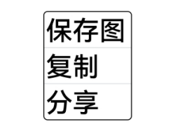
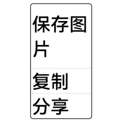

# UX样式或效果的变更

更新时间：2026-01-21 11:07:33

来源：https://developer.huawei.com/consumer/cn/doc/harmonyos-releases/changelogs-ux-b060

## 移动窗口布局模式瀑布流行为变更


变更原因

优化移动窗口布局模式瀑布流使用LazyForEach增删节点时布局方式。

变更影响

此变更涉及应用适配。

变更前：在显示范围上方增加节点，显示范围节点会下移；在显示范围上方删除节点，显示范围节点会上移。

变更后：在显示范围上方增删节点，显示范围不变。

下表显示在显示范围上方增加一个节点时变更前后的效果对比：


| 增加节点前 | 变更前：图7显示到原图8的位置 | 变更后：图8位置不变 |
| --- | --- | --- |
|  |  |  |


起始API Level

12

变更的接口/组件

WaterFlow组件布局模式WaterFlowLayoutMode.SLIDING_WINDOW。

适配指导

默认行为变更，应注意变更后的行为是否对整体应用逻辑产生影响。


## 滚动类组件默认最大抛划限速变更


变更原因

滚动类组件（List、Scroll、Grid、WaterFlow）快速抛划时，划动距离太近，需要优化为快速划动，提升体验。

变更影响

此变更涉及应用适配。

变更前：滚动类组件最大抛划限速默认为4200vp/s

变更后：滚动类组件最大抛划限速默认为12000vp/s

下表变更前后快速抛划效果对比：


| 变更前 | 变更后 |
| --- | --- |
|  |  |


起始API Level

11

变更的接口/组件

滚动类组件flingSpeedLimit属性。

适配指导

无需适配，如果滚动速度过快导致性能问题，可以使用flingSpeedLimit接口设置最大抛划限速。

```ts
@Entry
@Component
struct ListItemExample {
private arr: number[] = []

aboutToAppear(): void {
for (let i = 0; i < 50; i++) {
this.arr.push(i)
}
}

build() {
Column() {
List({ space: 20, initialIndex: 0 }) {
ForEach(this.arr, (item: number) => {
ListItem() {
Text('' + item)
.width('100%')
.height(100)
.fontSize(16)
.textAlign(TextAlign.Center)
.borderRadius(10)
.backgroundColor(0xFFFFFF)
}
}, (item: string) => item)
}.width('90%')
.flingSpeedLimit(4200) // 设置抛划限速
}.width('100%').height('100%').backgroundColor(0xDCDCDC).padding({ top: 5 })
}
}
```


## RichEditor收起键盘后，选中区状态变更


变更原因

UX规格变更

变更影响

此变更涉及应用适配。

变更前：RichEditor非用户手动点击收起键盘按钮收起键盘时，触发组件失焦，关闭菜单，复位选中区。


变更后：RichEditor非用户手动点击收起键盘按钮收起键盘时，仅小窗模式下触发组件失焦，其他场景不触发组件失焦，不关闭菜单，不复位选中区。


起始API Level

10

变更的接口/组件

RichEditor组件。

适配指导

非用户手动点击收起键盘按钮收起键盘时收起键盘时焦点状态变更，应用无需适配。


## Toast弹窗UX样式变更


变更原因

UX规格变更

变更影响

此变更涉及应用适配。

- API version 11及之前，Toast弹窗背景色为深黑色、字色为白色，最大高度没有限制，界面语超长没有截断。
- API version 12及之后，Toast弹窗在常规亮色显示风格下toast透明模糊背景、字色黑色，暗色显示风格下透明模糊背景、字色白色。 Toast的最大高度 =（屏幕高度-信号栏-导航条）*0.65，最大宽度：基于屏幕宽度-2侧margin，根据容器自适应，最大到400vp不再变化。 界面语超长逐级缩小字号至12fp，超出截断。
- API version 11及之前对比API version 12及之后属性变更如下


| 属性名 | 变更前 | 变更后 |
| --- | --- | --- |
| 背景色 | bg_color | COMPONENT_ULTRA_THICK |
| 圆角 | toast_border_radius | corner_radius_level9 |
| padding-left | toast_padding_horizontal | padding_level8 |
| padding-top | toast_padding_vertical | padding_level4 |
| padding-right | toast_padding_horizontal | padding_level8 |
| padding-bottom | toast_padding_vertical | padding_level4 |
| 字体大小 | text_font_size | Body_M |
| 字体颜色 | text_color | font_primary |
| 字重 | toast_text_font_weight | font_weight_regular |


示例如下：

如下图所示为变更前后效果对比：


| 变更前 | 变更后 |
| --- | --- |
|  |  |


API Level

12

变更的接口/组件

promptAction.showToast

适配指导

UX默认行为变更，无需适配。可以通过promptAction中ShowToastOptions接口自定义Toast背景色、字色等。


## 安全控件宽度设定默认行为变更


变更原因

若安全控件设定的宽度小于当前属性组合下允许的最小宽度（安全控件完整显示的最小宽度）时，此时安全控件的背托宽度会自适应增大，实际布局宽度会大于所设定宽度，以保证安全控件显示的完整性。Menu等组件集成安全控件后，若安全控件的实际宽度大于父组件的设定宽度，安全控件的按钮信息会被截断，导致安全控件不可用。

变更影响

此变更涉及应用适配。

变更前：

若安全控件设定的宽度小于当前属性组合下允许的最小宽度时，此时安全控件背托宽度会自适应增大，实际布局宽度会大于所设定宽度，以保证安全控件显示的完整性。

例如：

在适老化场景，Menu集成保存控件“保存图片”，由于字体的尺寸增大，保存控件的实际布局宽度会大于所设定宽度，可能会出现截断情况。





变更后：

若安全控件设定的宽度小于当前属性组合下允许的最小宽度时，此时安全控件受限于所设定的宽度信息，包括父组件的宽度约束，实际布局宽度即所设定的宽度，按钮文本信息会自动换行，以保证安全控件显示的完整性。安全控件按钮文本信息换行后，相关布局的高度会增大，如果布局的变化不能满足当前需要，需要对安全控件的高度或宽度值做相应调整。

例如：

变更后，在相同的参数条件下，安全控件完整显示的最小宽度超过所设定的宽度，按钮文本信息会自动换行，控件高度会自适应增大，以保证安全控件显示的完整性。换行后，组件的高度增大，如果布局不满足实际要求，需要根据实际需要对安全控件的宽度和高度做调整。





起始API Level

12

变更的接口/组件

@internal/component/ets/location_button.d.ts中 LocationButton接口。

@internal/component/ets/save_button.d.ts中 SaveButton接口。

@internal/component/ets/paste_button.d.ts中 PasteButton接口。

适配指导

接口使用的示例代码可参考：

LocationButton接口指导

SaveButton接口指导

PasteButton接口指导
