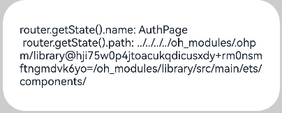

# OS平台API行为的变更

更新时间：2026-01-21 11:07:33

来源：https://developer.huawei.com/consumer/cn/doc/harmonyos-releases/changelogs-for-all-apps-b106

## Ability Kit


### 禁止Extension进程拉起启动框架


变更原因

Extension进程不应拉起启动框架，启动框架是用于优化UIAbility启动时的一些启动任务，当Extension可以拉起启动框架时，可能会导致应用未启动便执行启动框架，导致一些代码在不应执行的时间点执行。

变更影响

此变更涉及应用适配。

变更前：Extension进程可以拉起启动框架并执行启动任务。

变更后：Extension进程无法拉起启动框架，只有UIAbility可以拉起启动框架并执行启动任务。

起始API Level

12

变更的接口/组件

AppStartup启动框架模块默认行为。

适配指导

默认行为变更，应注意变更后的行为是否对整体应用逻辑产生影响。


## ArkTS


### convertXml模块未支持parentKey属性的行为变更


变更原因

convertXml模块未实现parentKey属性，生成的object中不具有parentKey属性的值。

变更影响

此变更涉及应用适配。


> [!NOTE]
> 此变更已做版本隔离，变更仅在应用的targetSdkVersion设置为大于等于5.0.1(13)时生效。


变更前：

convertToJSObject接口对xml字符串的入参进行解析时，无法设置parentKey属性的值。

变更后：

convertToJSObject接口对xml字符串的入参进行解析时，可以正确设置parentKey属性的值。

起始API Level

9

变更的接口/组件

ConvertXML模块下的接口：

convertToJSObject(xml: string, options?: ConvertOptions): Object;

适配指导

变更：convertToJSObject接口对xml字符串的入参进行解析时，可以正确设置parentKey属性的值。

```ts
import { convertxml } from '@kit.ArkTS';

let xml =
  '<?xml version="1.0" encoding="utf-8"?>' +
  '<note importance="high" logged="true">' +
  ' <title>Happy</title>' +
  ' <todo>Work</todo>' +
  ' <todo>Play</todo>' +
  '</note>';
let conv = new convertxml.ConvertXML();
let options: convertxml.ConvertOptions = {
  trim: false,
  declarationKey: '_declaration',
  instructionKey: '_instruction',
  attributesKey: '_attributes',
  textKey: '_text',
  cdataKey: '_cdata',
  doctypeKey: '_doctype',
  commentKey: '_comment',
  parentKey: '_parent',
  typeKey: '_type',
  nameKey: '_name',
  elementsKey: '_elements',
};
let result: ESObject = conv.convertToJSObject(xml, options);

// 变更前：result的值实际为： {"_declaration":{"_attributes":{"version":"1.0","encoding":"utf-8"}},"_elements":[{"_type":"element","_name":"note","_attributes":{"importance":"high","logged":"true"},"_elements":[{"_type":"element","_name":"title","_elements":[{"_type":"text","_text":"Happy"}]},{"_type":"element","_name":"todo","_elements":[{"_type":"text","_text":"Work"}]},{"_type":"element","_name":"todo","_elements":[{"_type":"text","_text":"Play"}]}]}]}

// 变更后：result的值实际为（新增parentKey属性）： {"_declaration":{"_attributes":{"version":"1.0","encoding":"utf-8"}},"_elements":[{"_type":"element","_name":"note","_attributes":{"importance":"high","logged":"true"},"_elements":[{"_type":"element","_name":"title","_parent":"note","_elements":[{"_type":"text","_text":"Happy"}]},{"_type":"element","_name":"todo","_parent":"note","_elements":[{"_type":"text","_text":"Work"}]},{"_type":"element","_name":"todo","_parent":"note","_elements":[{"_type":"text","_text":"Play"}]}]}]}

// 对于开发者使用场景来说，不影响开发者使用。
// 获取title标签的parentKey属性的方法是：result1["_elements"][0]["_elements"][0]._parent
// 变更前：获取title标签的parentKey属性为：undefined
// 变更后：获取title标签的parentKey属性为实际值：note
```


## ArkUI


### 在字节码HAR中通过router.getState()获取的path内容变更


变更原因

当开发者使用中间码HAR升级到字节码HAR时，通过router.getState()方法获取的path信息不正确。

变更影响

此变更涉及应用适配。

此前提是：源码HAR或者中间码HAR升级为字节码HAR时产生的偏差。

场景示例1：

变更前：

当开发者使用的是源码HAR时使用router.getState()方法获取的是相对路径。


通过router.getState()方法获取的path信息为"../../../../library/src/main/ets/components/"。

当开发者把源码HAR升级为字节码HAR时，通过router.getState()方法获取的path信息为"/__harDefaultPagePath__"，不能获取正确的name和path值。


变更后：

当开发者把源码HAR升级为字节码HAR时使用router.getState()方法获取的是绝对路径。


通过router.getState()方法获取的path信息为"library/src/main/ets/components/"。

场景示例2：

变更前：

当开发者使用的是中间码HAR时使用router.getState()方法获取的是相对路径。





通过router.getState()方法获取的path信息为"../../../../ + 哈希值 + library/src/main/ets/components/"。

当开发者把中间码HAR升级为字节码HAR时，通过router.getState()方法获取的path信息为"/__harDefaultPagePath__"，不能获取正确的name和path值。


变更后：

当开发者把中间码HAR升级为字节码HAR时使用router.getState()方法获取的是绝对路径。


通过router.getState()方法获取的path信息为"library/src/main/ets/components/"。

起始API Level

10

变更的接口/组件

router.getState()

适配指导

当开发者在代码中有通过router.getState()使用path值时，需要根据获取到的内容进行整改。


### 禁止在转场动画过程中，更新消失节点的属性。


变更原因

在转场动画过程中改变正在消失节点的属性，可能造成数据访问异常，产生crash。例如，动画过程中将data置为undefined，Text组件增加默认转场不会立即被删除，在更新状态时，数据访问异常产生crash。因此，需要变更为在转场动画过程中，禁止更新消失节点的属性。

```ts
class Mydata {
str: string;
constructor(str: string) {
this.str = str;
}
}
@State data: Mydata|undefined = new MyData("branch");
if (this.data) {
// 对于删除时增加的默认转场，会延长组件生命周期。Text没有立即被删除，而是等转场动画结束后才被删除
Text(this.data.str)
}
Button("play with animation")
.onClick(()=>{
animateTo({},()=>{
if (this.data) {
// 在动画过程中，会给if下的第一层组件增加默认转场
this.data = undefined;
}
})
})
```

变更影响

此变更涉及应用适配。


> [!NOTE]
> 此变更已做版本隔离，变更仅在应用的targetSdkVersion设置为大于等于5.0.1(13)时生效。


变更前：转场动画过程中，正在消失的节点可以更新属性。

变更后：转场动画过程中，禁止消失的节点更新属性。

起始API Level

10

变更的接口/组件

transition属性

适配指导

如果要对转场动画过程中，消失的节点进行属性更新，应当在节点下树之前产生，而不是在消失过程中。

示例：

```ts
@Entry
@Component
struct Index {
@State flag: Boolean = true;
@State color: Color = Color.Red;
build() {
Column(){
if (this.flag) {
Text('abc')
.transition(TransitionEffect.OPACITY)
.backgroundColor(this.color)
}

Button("play with animation")
.onClick(()=>{
// 变更前，消失过程中的节点可以更新属性，Text组件的颜色在消失过程中变为蓝色
// animateTo({},()=>{
//   this.flag ? this.color = Color.Blue : this.color = Color.Red;
//   this.flag = !this.flag;
// })

// 变更后，消失过程中的节点无法更新属性，Text组件的颜色在消失过程中一直为红色
// 如果需要更新属性，使Text组件的颜色在消失过程中变为蓝色，应当在节点下树之前更新
animateTo({},()=>{
this.flag ? this.color = Color.Blue : this.color = Color.Red;
}) // 节点下树前改变颜色属性
animateTo({},()=>{
this.flag = !this.flag;
})
})
.width("100%")
.padding(10)
}
}
}
```


### 优化getWindowProperties，增加返回值中drawableRect的实时性，调用行为变更


变更原因

应用调用getWindowProperties可以获取窗口属性，返回的结构体中表示可绘制区域的字段为drawableRect，如果在on('windowSizeChange')回调中调用getWindowproperties，可能获得未更新的drawableRect。

通过本次变更，在on('windowSizeChange')回调中同步更新windowRect和drawableRect，应用可基于此进行更加灵活的自绘制布局。

变更影响

此变更涉及应用适配。

变更前：on('windowSizeChange')回调中调用getWindowProperties获取drawableRect，可能获得未更新的drawableRect。

变更后：on('windowSizeChange')回调中调用getWindowProperties获取drawableRect，可以获取更新后的drawableRect。

起始API Level

11

变更的接口/组件

@ohos.window.d.ts

系统能力：SystemCapability.WindowManager.WindowManager.Core

接口：getWindowProperties

适配指导

drawableRect字段从API 11开始提供。

在API 11、API 12中，不建议使用该字段进行布局，可以基于windowRect进行布局。

在API 13及之后的版本，建议使用该字段进行布局，可以获得精准的布局效果。


### RichEditor（富文本）从组件外拖入内容onWillChange、onDidChange回调变更


变更原因

从组件外拖入内容时，onWillChange、onDidChange多回调了一次相同的内容，不符合实际文本变化情况。

变更影响

此变更涉及应用适配。

变更前：

从组件外拖入内容时，onWillChange、onDidChange回调了两次同样的内容。

变更后：

从组件外拖入时，onWillChange、onDidChange回调一次。

起始API Level

12

变更的接口/组件

RichEditor

适配指导

默认行为变更，应注意变更后的行为是否对整体应用逻辑产生影响。


### RichEditor（富文本）onWillChange接口返回值变更


变更原因

在添加Symbol时onWillChange接口返回值中缺少了SymbolId。

变更影响

此变更涉及应用适配。

变更前：

在使用addSymbolSpan接口添加symbol时，onWillChange接口返回的RichEditorTextSpanResult中的value字段为空。

变更后：

在使用addSymbolSpan接口添加symbol时，onWillChange接口返回的RichEditorTextSpanResult中的value字段返回SymbolId。

起始API Level

12

变更的接口/组件

RichEditor

适配指导

默认行为变更，应注意变更后的行为是否对整体应用逻辑产生影响。


### RichEditor（富文本）TypingStyle默认字体大小变更


变更原因

开发者在设置TypingStyle但是没有设置其中的字体大小时，TypingStyle的默认字体大小为14px，显示效果异常。

变更影响

此变更涉及应用适配。

变更前：

开发者使用setTypingStyle接口设置TypingStyle但是没有设置其中的字体大小时，输入新的内容，新输入的文本字体大小为14px。

变更后：

开发者使用setTypingStyle接口设置TypingStyle但是没有设置其中的字体大小时，输入新的内容，新输入的文本字体大小为16fp。

起始API Level

12

变更的接口/组件

RichEditor

适配指导

默认行为变更，应注意变更后的行为是否对整体应用逻辑产生影响。


### RichEditor（富文本）onDidChange接口变更


变更原因

在用户执行删除操作，但实际未删除内容时（例如在aboutToDelete接口中拦截了删除操作），也回调了OnDidChange接口，不符合接口行为定义。


> [!NOTE]
> 该变更在11月19日更新的ROM版本引入，ROM版本号为5.0.0.107。


变更影响

此变更涉及应用适配。

变更前：

在用户执行删除操作，但实际未删除内容时回调了OnDidChange接口。

变更后：

在用户执行删除操作，但实际未删除内容时不回调OnDidChange接口。

起始API Level

12

变更的接口/组件

RichEditor

适配指导

默认行为变更，应注意变更后的行为是否对整体应用逻辑产生影响。


### RichEditor（富文本）删除完成后光标位置变更


变更原因

开发者在aboutToDelete回调中设置光标/选中区后，删除完成后，光标位置异常。


> [!NOTE]
> 该变更在11月19日更新的ROM版本引入，ROM版本号为5.0.0.107。


变更影响

此变更涉及应用适配。

变更前：

1、开发者在aboutToDelete回调中设置光标，删除完成后，光标位置为开发者设置的光标位置。

2、开发者在aboutToDelete回调中设置选中区，删除完成后，光标位置为开发者设置的选中区的右边界。

变更后：

开发者在aboutToDelete回调中设置光标/选中区，删除完成后，光标位置为被删除内容的起始索引位置。

起始API Level

12

变更的接口/组件

RichEditor

适配指导

默认行为变更，应注意变更后的行为是否对整体应用逻辑产生影响。


## Localization Kit


### 国家、地区本地化名称变更


变更原因

1、当前中国香港、中国澳门、中国台湾地区的本地化名称中使用逗号或空格作为分隔符，当多个国家并列时，存在歧义。

2、巴勒斯坦国家名称在国际上已由“巴勒斯坦领土”变更为“巴勒斯坦”

变更影响

此变更涉及应用适配。

变更前：使用逗号或者空格作为地区与归属地国家之间的分隔符。

变更后：使用将归属地国家放入地区后的小括号中，例如“Hong Kong(China)”。

变更前：巴勒斯坦国家名称为“巴勒斯坦领土”。

变更后：巴勒斯坦国家名称为“巴勒斯坦”。

起始API Level

9

变更的接口/组件

i18n.System.getDisplayCountry

适配指导

不要对接口返回值做特殊判断，该接口返回值仅用于界面显示。


### 时间日期格式“十一月”格式化结果错误问题修改


变更原因

参考业界标准，农历中“十一月”应该显示为“冬月”。


> [!NOTE]
> 该变更在11月19日更新的ROM版本引入，ROM版本号为5.0.0.107。


变更影响

此变更涉及应用适配。

变更前：接口格式化结果中的十一月份显示为“十一月”。

变更后：接口格式化结果中的十一月份显示为“冬月”。

起始API Level

6

变更的接口/组件

intl.DateTimeFormat.format

适配指导

不要对该接口的返回值做特殊的判断，该接口返回值仅用于界面显示。


### 日期时间段格式化在zh-Hant-HK下结果错误问题修改


变更原因

当区域为zh-Hant-HK时，日期时间段格式化结果返回空字串。

变更影响

此变更涉及应用适配。

变更前：当区域为zh-Hant-HK时，日期时间段格式化结果返回空字串。

变更后：当区域为zh-Hant-HK时，日期时间段格式化结果返回正确的格式化结果。

起始API Level

6

变更的接口/组件

intl.DateTimeFormat.formatRange

适配指导

不要对该接口的返回值做特殊的判断，该接口返回值仅用于界面显示。


### 归属地获取接口对无效号码的归属计算错误问题修改


变更原因

归属地获取接口在传入无效号码时，会返回PhoneNumberFormat对象创建时传入的地区作为号码归属地。

变更影响

此变更涉及应用适配。

变更前：归属地获取接口在传入无效号码时，会返回PhoneNumberFormat对象创建时传入的地区作为号码归属地。

变更后：归属地获取接口在传入无效号码时，返回空字串。

起始API Level

9

变更的接口/组件

i18n.PhoneNumberFormat.getLocationName

适配指导

不要对该接口的返回值做特殊的判断，该接口返回值仅用于界面显示。


### 系统支持国家地区列表变更


变更原因

不丹当前不在系统支持的国家地区列表中。


> [!NOTE]
> 该变更在11月19日更新的ROM版本引入，ROM版本号为5.0.0.107。


变更影响

此变更涉及应用适配。

变更前：系统支持的国家地区列表中不包含不丹。

变更后：系统支持的国家地区列表中包含不丹。

起始API Level

9

变更的接口/组件

i18n.System.getSystemCountries

适配指导

不要对接口返回字符串数字的数量做强制判断。


## 工具


### 禁止bm命令进行跨用户操作


变更原因

bm命令行工具未对sh调用方用户身份做校验，用户A可以通过bm命令安装、卸载其他用户空间下的应用，并且可以通过bm命令嗅探其他空间下已安装的应用，违反安全规范。


> [!NOTE]
> 该变更在11月19日更新的ROM版本引入，ROM版本号为5.0.0.107。


变更影响

此变更涉及应用适配。

变更前：

bm命令中install（安装）、uninstall（卸载）、dump（查询）、clean（清空缓存）等命令可以通过-u参数指定其他用户。

变更后：

bm命令中install、uninstall、dump、clean等命令通过-u参数指定其他用户无效，仅支持对当前用户下的应用进行相应操作。

起始API Level

不涉及

变更的接口/组件

bm命令行工具

适配指导

若要对其他用户下的应用执行bm命令行的相关操作，必须先切换至相应的用户，才能执行。
