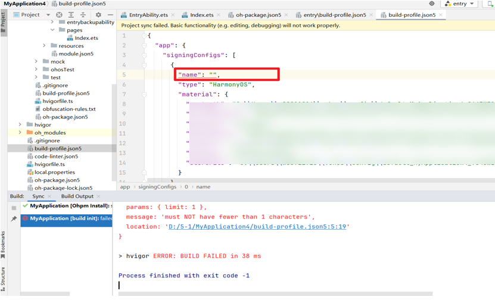

# 变更说明

更新时间：2026-01-21 11:07:33

来源：https://developer.huawei.com/consumer/cn/doc/harmonyos-releases/ide-changelogs-502

## 5.0.5.315至5.0.7.100

### 编译构建对签名配置的name字段增加非空字符串校验

升级到DevEco Studio 5.0.2 Beta1（5.0.7.100）及以上版本，工程级build-profile.json5文件中signingConfigs下的name字段不允许为空字符串。

变更影响

如果历史工程的工程级build-profile.json5文件中signingConfigs下的name字段为空字符串，编译时会报错。

适配指导

将signingConfigs下的name字段配置为非空字符串。
