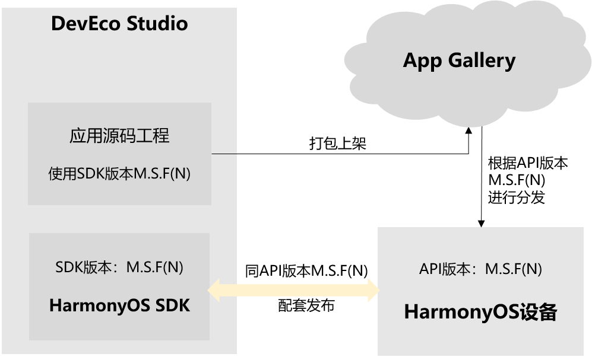

# 关于应用兼容性的介绍

更新时间：2026-06-27 01:41:31

来源：https://developer.huawei.com/consumer/cn/doc/harmonyos-releases/app-compatibility-intro

HarmonyOS应用和元服务（为方便描述，下文简称为应用）的开发者通过开发套件所提供的HarmonyOS SDK进行功能开发，调用HarmonyOS SDK中的API来实现业务功能逻辑。终端用户从华为应用市场获取应用，并安装到终端设备的系统（即ROM）上，系统运行应用后将功能呈现给消费者。

在这一流程中，开发应用时所使用的HarmonyOS SDK版本（简称SDK版本）、运行应用的设备ROM所搭载的API版本（可在HarmonyOS设备的“设置 > 点击设备名称 > 关于本机 > API版本”中查看）、以及应用中所定义的API/SDK版本兼容信息（如编译应用的SDK版本、应用运行的目标SDK版本、应用运行的最低SDK版本等，详见[影响应用兼容性的关键信息](https://developer.huawei.com/consumer/cn/doc/harmonyos-releases/app-compatibility-influence-factor)），共同决定了应用在现网不同设备上的运行情况。

这其中，对应用兼容性起到决定因素的是API版本。API版本是贯穿开发态和运行态非常关键的信息，也是HarmonyOS能力提供者和开发者之间的纽带。

#### API版本号说明

从API版本26.0.0开始，API版本号做如下调整：

 - 从API版本26.0.0开始，API版本号统一采用[语义化版本（Semantic Versioning，简称SemVer）](https://semver.org/lang/zh-CN/)格式（X.Y.Z），取代原有的格式。       
**X：**主版本号，包含大量的新功能以及重要的变更，变更可能包含对API的修改，需要开发者对已开发的应用进行适配修改。
 - **Y：**次版本号，包含新功能，原则上向后兼容，但重大安全隐患或关键体验问题可能引入不兼容变更，会在版本说明中提供详细的变更说明指导。
 - **Z：**修订版本号，问题修复和小改进，保持向后兼容。

      - 在26.0.0之前，API版本号采用X.Y.Z(N)格式，其中：       
**X****：**主版本号，取值1-99，表示API大版本更新。
 - **Y****：**次版本号，取值0-99，表示API小版本更新。
 - **Z****：**修订版本号，取值0-99，表示API微小更新。
 - **N****：**OpenHarmony底座API level，取值1-99。

应用兼容性主要是通过API版本信息进行兼容性处理，下图简要说明API版本在各个环节的关键作用：

> [!NOTE]
> 本文所描述的SDK版本和API版本两者本质上是一个版本号，取值格式一致，两者配套使用。 SDK版本是提供给开发者使用的接口和工具集合；API版本是指设备侧支持的最高的API能力集合。

#### 应用和设备系统兼容性原则说明
1. 基于老版本HarmonyOS SDK开发的应用，在上架华为应用市场后，默认可分发到新版本的HarmonyOS设备，并正常运行。       例外情况：API在不断演进迭代过程中，因体验优化或安全等因素，可能会发生行为变更，并对已上架应用产生影响，针对这部分变更会专门在版本说明中详细阐述，请开发者在升级API版本时，关注版本说明。
2. 针对基于新版本HarmonyOS SDK开发的应用，使用了新版本API，开发者对这些新版本API进行兼容性判断保护后，应用在老HarmonyOS设备上使用新API部分功能降级，并运行正常。

#### 示例说明

> [!TIP]
> API版本号格式从26.0.0开始进行调整（详见 版本号格式调整说明 ），不影响对API兼容性判断的基本逻辑，因此在文档的示意性描述中暂时仍保持旧版本格式的说明。 近期API版本号的大小关系如下： 26.0.0 > 6.1.1(24) > 6.1.0(23) > 6.0.2(22) > 6.0.1(21) > 6.0.0(20) > 5.1.1(19) > 5.1.0(18) > 5.0.4(17)

App1是基于SDK版本5.0.2(14）开发的应用，则默认可以在后续API版本为5.0.3(15)和5.0.4(16)的HarmonyOS现网设备正常运行；

App2是基于SDK版本5.0.3(15）开发的应用，并且使用了新API D， 则默认可以在后续的API版本为5.0.4(16)的HarmonyOS现网设备正常运行；但如果要在API版本为5.0.2(14)的HarmonyOS现网老设备正常运行，则开发者需对D进行条件判断保护。

App3是基于SDK版本5.0.4(16）开发的应用，并且使用了API D和E ， 默认可以在API版本为5.0.4(16)的HarmonyOS现网设备正常运行；如果要在API版本为5.0.2(14)的HarmonyOS现网老设备正常运行，则开发者需对D和E进行条件判断保护；如果要在API版本为5.0.3(15)的HarmonyOS现网老设备正常运行，则开发者需对E进行条件判断保护。

本文旨在阐述应用兼容性的原理以及影响兼容性的因素，希望开发者在了解这些内容后能正确配置应用兼容性的参数，或者提前识别兼容性风险，保障终端用户的使用体验。
