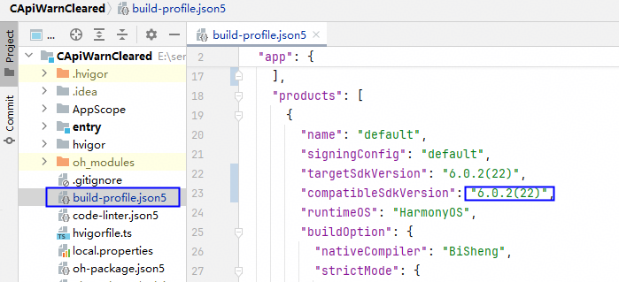
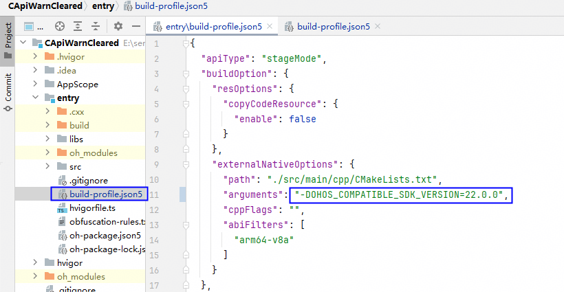
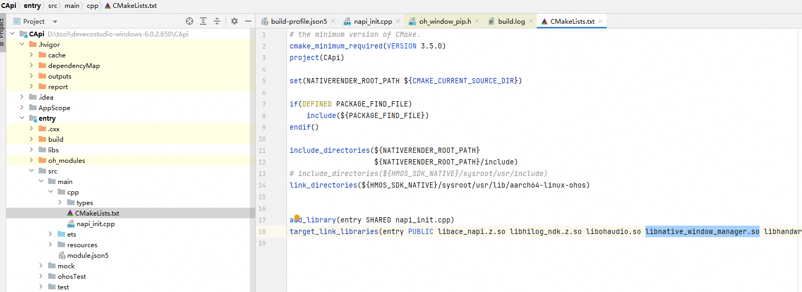
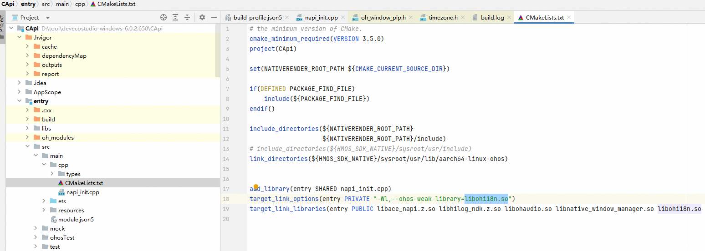
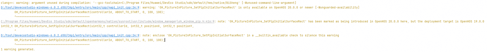
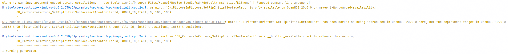
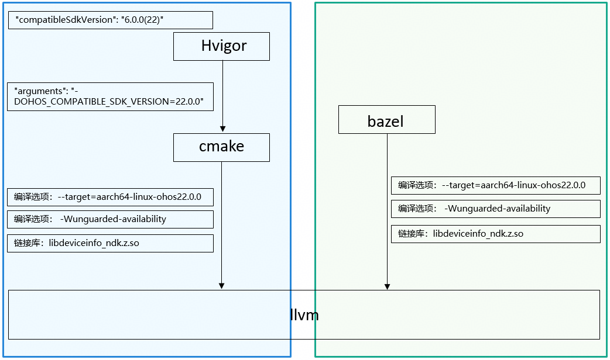

# CAPI兼容性保护高阶用法

更新时间：2026-05-08 01:49:00

来源：https://developer.huawei.com/consumer/cn/doc/harmonyos-releases/c-api-compatibility-warning


背景知识

强引用：在编译器/链接器的语境下，一个符号的引用，如果链接器在处理时无法找到其定义，就一定会报错并终止链接，那么这个引用就是强引用；

弱引用：在编译器/链接器的语境下，一个符号的引用，即使符号未定义，链接器也不会报错，而是会将其地址设置为0；

弱库：在编译器/链接器的语境下，一个完整库中的所有引用都是“弱引用”，那么这个库就是弱库；

在DevEco Studio和编译脚本中未增加额外编译参数情况下，应用中对 C API 的引用是强引用。动态加载器会在加载库时立即尝试解析它们，如果未找到强引用，应用将被中止。

如果代码中有使用高版本C API，且想实现一套代码能在高版本、低版本运行，有以下两种方式，如下表所示：


| 方案 | 缺点 | 优点 | 技术门槛 |
| --- | --- | --- | --- |
| 从SDK API 22版本开始，可以启用C API弱引用，使用APIAVAILABLE接口，进行兼容性判断保护 | 配置步骤长，依赖库容易配漏，验证不充分，存在运行时崩溃风险 （由于弱引用和弱库特性，在依赖库配置漏的情况下，无法在编译时报错拦截，不经过充分测试，可能会在运行时出现崩溃现象） | 代码简洁 | 高 会使用到弱引用和弱库机制，在下面配置步骤中会涉及 |


## 使用APIAVAILABLE接口，进行兼容性判断保护


### Hvigor方式构建Hap包操作步骤


因为此特性在DevEco Studio和SDK都有新增功能，所以此功能需要DevEco Studio和SDK配套使用，请勿使用非配套的DevEco Studio和SDK版本。


步骤1  开启C API弱引用


弱引用在编译时不做强校验检查，依赖运行态的判断处理，因此使用弱引用而没有添加此弱引用的依赖库会通过编译。例如，如果您的 compatibleSdkVersion 为 20，并且您调用了 OH_PictureInPicture_SetPipInitialSurfaceRect() - 该函数在API 20引入，但忘记了与 libnative_window_manager.so 链接，您的应用将成功编译，但在应用运行 OH_PictureInPicture_SetPipInitialSurfaceRect() 时，您的应用将崩溃。暴露此问题的唯一方法是测试。


通过把 compatibleSdkVersion 的版本号传递给编译器，开启C API弱引用。不同的DevEco Studio版本开启的方法存在一定差异。

- **当 DevEco Studio版本大于6.0.2.640 Release（API 22 Release），且版本不是  6.1.0.830(API 23 Release)时:**
在模块级的build-profile.json5配置文件中增加编译参数 "arguments": "-DOHOS_COMPATIBLE_SDK_VERSION=x.x.x"，其中x.x.x版本号根据工程级build-profile.json5文件中的compatibleSdkVersion字段的值进行配置，规则如下：针对HarmonyOS工程，"compatibleSdkVersion"："M.S.F(N)"，"-DOHOS_COMPATIBLE_SDK_VERSION=N.0.0"。
- 针对OpenHarmony工程，"compatibleSdkVersion"：N，"-DOHOS_COMPATIBLE_SDK_VERSION=N.0.0"。
- 示例：工程级build-profile.json5文件中的compatibleSdkVersion配置的版本号为6.0.2(22)，





模块级build-profile.json5配置文件中增加编译参数 "arguments": "-DOHOS_COMPATIBLE_SDK_VERSION=22.0.0"。





- **当DevEco Studio版本是  6.1.0.830(API 23 Release) 时，默认自动开启弱引用（必须按照步骤完成步骤1-步骤5，特别是增加使用的API的依赖库步骤，否则存在风险）：**
会自动根据工程级 build-profile.json5 文件中的 compatibleSdkVersion 配置来进行兼容性判断，不需要额外在entry目录下的build-profile.json5配置文件中配置 "arguments": "-DOHOS_COMPATIBLE_SDK_VERSION=x.x.x"；如果已经存在"arguments": "-DOHOS_COMPATIBLE_SDK_VERSION=x.x.x"配置，**必须保证版本号和compatibleSdkVersion同步更新**（或者直接删除 -DOHOS_COMPATIBLE_SDK_VERSION=x.x.x 参数），其中x.x.x版本号根据工程级build-profile.json5文件中的compatibleSdkVersion字段的值进行配置，规则如下：针对HarmonyOS工程，"compatibleSdkVersion"："M.S.F(N)"，"-DOHOS_COMPATIBLE_SDK_VERSION=N.0.0"。
- 针对OpenHarmony工程，"compatibleSdkVersion"：N，"-DOHOS_COMPATIBLE_SDK_VERSION=N.0.0"。


步骤2  配置弱引用依赖库（依赖库在低版本设备上存在）


使用API所依赖的库，需要手动添加到链接库中，否则会在运行时崩溃。

验证方法：验证是否存在依赖库缺失配置，先关闭步骤1中的启用弱引用，保证能编译通过，再开启弱引用。


示例如下：

在代码中使用了OH_PictureInPicture_SetPipInitialSurfaceRect()函数，需要把此函数依赖的库文件 libnative_window_manager.so 加到链接库中，需要在模块级CMakelists.txt配置文件中增加 libnative_window_manager.so 链接库依赖，如下图所示：





步骤3  配置弱库依赖库（依赖库在低版本设备上不存在，且设备版本低于API 22不支持此功能）


如果使用的API所依赖的动态库，在老版本设备上不存在此动态库，需要使用弱库机制。

验证方法：验证是否存在依赖库缺失配置，先关闭步骤1中的启用弱引用，保证能编译通过，再开启弱引用。


示例如下：

在代码中使用了OH_i18n_GetFirstStartFromTimeArrayTimeZoneRule()函数，此函数是在全新新增的动态库 libohi18n.so 中，需要在模块级CMakelists.txt配置文件中增加链接选项  "-Wl,--ohos-weak-library=libohi18n.so", 同时在target_link_libraries中也需要增加libohi18n.so依赖，如下图所示：





步骤4  兼容性保护


> [!NOTE]
> APIAVAILABLE宏是对编译器内置函数 __builtin_available 的简单封装，作用是在运行时获取设备版本号，来和当前__builtin_available 所带的版本号进行比较，进入到相应的分支进行处理。
>  #define __INNER_CONCAT(a, b) a##.##b
> #define __INNER_APIAVAILABLE(ver) __builtin_available(ohos ver, *)
> /**
>   * @brief To ensure compatibility and stability of an application across different versions.
>   * Prevent crashes caused by invoking non-existent APIs on older systems through compile-time
>   * and runtime conditional checks.
>   * Whenever using APIs that are newer than the distribution target version,
>   * it is essential to protect them with the APIAVAILABLE method and provide a reasonable fallback solution.
>   *
>   * @param maj, int value 0 - 99.
>   * @param min, int value 0 - 99.
>   * @param patch, int value 0 - 99.
>   * @since 22
>   */
> #define APIAVAILABLE(maj, min, patch) __INNER_APIAVAILABLE(__INNER_CONCAT(maj, min##.##patch))


- 针对HarmonyOS独有特性接口，即接口标记为since M.S.F(N)（文档中标记“起始版本：M.S.F(N)”, SDK物理包中hms路径下所包含的接口），使用APIAVAILABLE接口进行进行兼容性判断保护。接口声明：
```text
/**
 * @brief Query Device Security Mode.
 *
 * This method is used to query device security mode.
 *
 * @return Current device security mode, see {@link DSM_DeviceSecurityMode}.
 * @since 5.0.1(13)
 */
DSM_DeviceSecurityMode HMS_DSM_GetDeviceSecurityMode(void);
```
 使用APIAVAILABLE进行兼容性保护：
```text
if (APIAVAILABLE(13,0,0)) {
// 调用5.0.1(13)的API接口
HMS_DSM_GetDeviceSecurityMode();
} else {
// 降级方案
}
```


- 针对OpenHarmony底座接口，即接口标记为since N（文档中标记“起始版本：N”，SDK物理包中openharmony路径下所包含的接口），使用APIAVAILABLE接口进行进行兼容性判断保护。接口声明：
```text
/**
 * @brief Start locating and subscribe location changed.
 *
 * @param requestConfig - Pointer to the locating request parameters.\n
 * For details, see {@link Location_RequestConfig}.\n
 * You can use {@link OH_Location_CreateRequestConfig} to create an instance.\n
 * @return Location functions result code.\n
 * For a detailed definition, please refer to {@link Location_ResultCode}.\n
 * {@link LOCAION_SUCCESS} Successfully start locating.\n
 * {@link LOCATION_INVALID_PARAM} The input parameter requestConfig is a null pointer.\n
 * {@link LOCATION_PERMISSION_DENIED} Permission verification failed. The application does not have the\n
 * permission required to call the API.\n
 * {@link LOCATION_NOT_SUPPORTED} Capability not supported.\n
 * Failed to call function due to limited device capabilities.\n
 * {@link LOCATION_SERVICE_UNAVAILABLE} Abnormal startup of location services.\n
 * {@link LOCATION_SWITCH_OFF} The location switch is off.\n
 * @permission ohos.permission.APPROXIMATELY_LOCATION
 * @since 13
 */
Location_ResultCode OH_Location_StartLocating(const Location_RequestConfig* requestConfig);
```
 使用APIAVAILABLE进行兼容性保护：
```text
if (APIAVAILABLE(13,0,0)) {
// 调用13的API接口
OH_Location_StartLocating(requestConfig);
} else {
// 降级方案
}
```
 补充说明： 编译报错场景1：代码中使用了高版本API，没有使用 APIAVAILABLE进行保护，报错如下：

 需要调整代码如下：
```text
报错代码：
OH_PictureInPicture_SetPipInitialSurfaceRect(controllerId, ABOUT_TO_START, 0, 100, 100);

修改后代码：
if (APIAVAILABLE(20,0,0)) {
OH_PictureInPicture_SetPipInitialSurfaceRect(controllerId, ABOUT_TO_START, 0, 100, 100);
}
```
 编译报错场景2：代码中使用了高版本API，没有正确使用 APIAVAILABLE进行保护，报错如下：

 需要调整代码如下（OH_PictureInPicture_SetPipInitialSurfaceRect 是 API 20新增的函数）：
```text
报错代码：
if (APIAVAILABLE(19,0,0)) {
OH_PictureInPicture_SetPipInitialSurfaceRect(controllerId, ABOUT_TO_START, 0, 100, 100);
}

修改后代码：
if (APIAVAILABLE(20,0,0)) {
OH_PictureInPicture_SetPipInitialSurfaceRect(controllerId, ABOUT_TO_START, 0, 100, 100);
}
```


步骤5  功能测试


由于启用弱引用机制后，弱引用是否存在在编译阶段无法闭环，需要在运行时才能暴露出来，需要进行充分验证，否则存在应用崩溃风险。


1、使用 APIAVAILABLE 兼容性保护特性，需要覆盖测试compatibleSdkVersion版本的设备，确保应用能正常启动（例如 compatibleSdkVersion 是 API 20，需要在API 20的设备上进行启动验证）；

2、使用 APIAVAILABLE 兼容性保护特性，需要在编译配套的SDK版本进行测试，覆盖测试此新增CAPI功能，确保调用此CAPI功能正常（例如 使用了OH_i18n_GetFirstStartFromTimeArrayTimeZoneRule函数，需要在测试时，确保应用能运行到OH_i18n_GetFirstStartFromTimeArrayTimeZoneRule函数处，且功能正常）；


### 非Hvigor方式构建Hap包操作步骤


步骤1  传递 compatibleSdkVersion 版本号给编译器，开启C API弱引用


弱引用在编译时不做强校验检查，依赖运行态的判断处理，因此使用弱引用而没有添加此弱引用的依赖库会通过编译。例如，如果您的 compatibleSdkVersion 为 20，并且您调用了 OH_PictureInPicture_SetPipInitialSurfaceRect() - 该函数在API 20引入，但忘记了与 libnative_window_manager.so 链接，您的应用将成功编译，但在应用运行 OH_PictureInPicture_SetPipInitialSurfaceRect() 时，您的应用将崩溃。暴露此问题的唯一方法是测试。


非Hvigor方式构建Hap包场景下，例如bazel，需要开发者传递"--target=aarch64-linux-ohosx.x.x"和"-Wunguarded-availability"编译选项给llvm，同时增加依赖库libdeviceinfo_ndk.z.so，参数中的版本号x.x.x是根据工程级 build-profile.json5 文件中 compatibleSdkVersion 配置的版本号来配置的。

其中x.x.x版本号根据工程级build-profile.json5文件中的compatibleSdkVersion字段的值进行配置，规则如下：
- 针对HarmonyOS工程，"compatibleSdkVersion"："M.S.F(N)"，"--target=aarch64-linux-ohosN.0.0"。
- 针对OpenHarmony工程，"compatibleSdkVersion"：N，"--target=aarch64-linux-ohosN.0.0"。补充说明： Hvigor方式构建Hap包：**通过Hvigor把**compatibleSdkVersion版本号转换为** **"arguments": "-DOHOS_COMPATIBLE_SDK_VERSION=x.x.x" 参数传递给cmake，cmake解析后转换为 "--target=aarch64-linux-ohosx.x.x"编译选项传递给llvm编译器，同时增加编译选项："-Wunguarded-availability"和增加依赖库libdeviceinfo_ndk.z.so，在llvm编译器中编译阶段和运行时阶段进行判断，最终进行API兼容性判断保护。


具体传递过程如下图所示：





步骤2  配置弱引用依赖库（依赖库在低版本设备上存在）


使用API所依赖的库，需要手动添加到链接库中，否则会在运行时崩溃。

验证方法：验证是否存在依赖库缺失配置，先关闭步骤2中的启用弱引用，保证能编译通过，再开启弱引用。


配置API函数所需的依赖库，放到链接库中。


步骤3  配置弱库依赖库（依赖库在低版本设备上不存在，且设备版本低于API 22不支持此功能）


如果使用的API，在高版本中是一个全新的动态库（老版本设备上不存在此动态库），需要使用弱库机制。

验证方法：验证是否存在依赖库缺失配置，先关闭步骤1中的启用弱引用，保证能编译通过，再开启弱引用。


配置API函数所需的依赖库，放到链接库中，同时增加链接选项  "-Wl,--ohos-weak-library=libxxx.so" ,libxxx.so 需要填具体的动态库。


步骤4  兼容性保护

参考 Hvigor方式构建Hap包操作步骤中的步骤4。


步骤5  功能测试

参考 Hvigor方式构建Hap包操作步骤中的步骤5。


补充说明：

本文档示例中使用的版本号、函数名、库名都是示例，请以实际为准。
