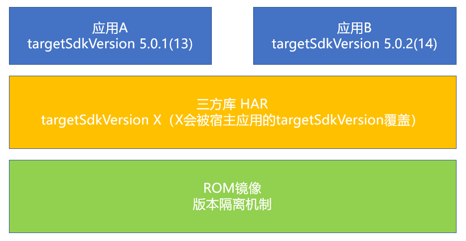

# 应用集成三方库（har包）的兼容性指导

更新时间：2026-01-21 11:07:33

来源：https://developer.huawei.com/consumer/cn/doc/harmonyos-releases/app-compatibility-third-har

在应用开发过程中，会依赖大量的三方库，应用hap和三方库har之间因为SDK版本属性字段的版本差异，会存在各种兼容性问题。
 
针对三方库本身的开发，建议开发者使用最新的编译的SDK版本，并且通过API兼容性判断机制，将运行的最低SDK版本配置为尽可能低（尤其是针对不依赖HarmonyOS SDK中API的三方库，建议将compatibleSdkVersion配置为12），这样能够满足尽可能多的应用集成，但可能需增加较多API兼容性判断保护，因此开发者需根据现网设备API版本占比情况综合评估后，有选择的进行设置。
  
| sdk属性 | 应用集成方关注点 | 三方库提供方关注点 | 应用集成三方库的规则 |
| --- | --- | --- | --- |
| compileSdkVersion | 1. 应用使用最新Release版本SDK进行开发； 2. 选择稳定且性能好的三方库版本进行集成； | 1. 不依赖系统API的三方库，该值建议设置为最新的Release的API版本； 2. 依赖系统API的三方库，该值建议设置为最新的Release的API版本。该值决定了可调用的API范围，如果需兼容运行到低版本，则需要对高版本的API进行兼容性判断保护。 | 1. 针对源码格式三方库，要求应用配置的compileSdkVersion版本≥三方库配置的compileSdkVersion版本，否则应用集成三方库编译时会报错； 2. 针对字节码格式三方库，无要求。 |
| targetSdkVersion | 1. 应用根据实际情况配置targetSdkVersion字段，从6.0.0(20)版本开始打开IDE时候，会提醒开发者配置该字段； 2. 应用升级该字段需要关注版本升级前后涉及到的API版本行为变更，需要进行适配； 3. 应用集成三方库时，需要关注和三方库targetSdkVersion值的差异。 | 1. 不依赖系统API的三方库，该值建议设置为最新的Release的API版本； 2. 依赖系统API的三方库： （1）不存在行为变更API，则该值建议设置为最新的Release的API版本； （2）存在行为变更API，则该值建议设置为最新的Release的API版本，并且需将使用的行为变更API全部都适配好，为应用集成方屏蔽差异。 | 1. 三方库中配置的targetSdkVersion版本和应用中配置的版本不同，则最终打包后会以应用中配置的targetSdkVersion版本为准； 2. 如果应用配置的targetSdkVersion版本和三方库配置的targetSdkVersion版本不一致，则需要关注三方库中targetSdkVersion版本变化是否会有API行为变更，从而进行相应适配（推荐由三方库统一屏蔽API行为差异；次选应用侧进行差异屏蔽）。 |
| compatibleSdkVersion | 1. 应用根据HarmonyOS系统现网API版本分布以及自身成本等情况选择合理值，建议支持至少95%以上的现网设备； 2. 应用集成三方库时，需要关注三方库该字段的值，并且关注三方库是否对高版本的API进行兼容性判断保护。 | 1. 不依赖系统API的三方库，该值可设置为5.0.0(12)，任意应用都可集成; 2. 依赖系统API的三方库，如果想被尽可能多的应用集成，则该值建议设置为≥近两年内最小的API版本。 | 1. 要求应用配置的compatibleSdkVersion版本≥三方库配置的compatibleSdkVersion版本，否则编译构建会报错。 |
 
 
为被targetSdkVersion值不同的宿主应用集成且三方库行为保持一致，三方库的提供方需在开发过程中，针对不同版本的API行为变更，通过调用getBundleInfoForSelf接口获取到宿主应用的bundleinfo.targetversion信息，从而对这些API行为进行适配处理。
 
**【示例1：应用集成三方库（含行为变更API）】**
 
（1）应用A的targetSdkVersion配置为5.0.1(13); 应用B的targetSdkVersion配置为5.0.2(14)；
 
（2）三方库的targetSdkVersion配置为5.0.2(14)， 且使用了@ohos.display.d.ts文件中屏幕Display对象的orientation属性，而该属性在5.0.2(14)版本进行了行为变更，系统侧为了不影响已上架应用，对该API行为进行了版本隔离。
 
（3）因为在应用集成三方库的时候，最终打包到应用中的targetSdkVersion字段值会填写为应用的值，则为了让三方库被应用集成后的行为一致，需要进行一些适配。
 



 
```text
<span style="color: rgb(255,0,170);">import</span> <span style="color: rgb(0,0,255);">bundleManager</span> <span style="color: rgb(255,0,170);">from</span> <span style="color: rgb(181,106,1);">'@ohos.bundle.bundleManager'</span>;
<span style="color: rgb(255,0,170);">import</span> <span style="color: rgb(0,0,255);">display</span> <span style="color: rgb(255,0,170);">from</span> <span style="color: rgb(181,106,1);">'@ohos.display'</span>;
<span style="color: rgb(255,0,170);">import</span> <span style="color: rgb(0,0,255);">hilog</span> <span style="color: rgb(255,0,170);">from</span> <span style="color: rgb(181,106,1);">'@ohos.hilog'</span>;
<span style="color: rgb(255,0,170);">import</span> <span style="color: rgb(0,0,255);">deviceInfo</span> <span style="color: rgb(255,0,170);">from</span> <span style="color: rgb(181,106,1);">'@ohos.deviceInfo'</span>;
<span style="color: rgb(0,0,255);">const</span> <span style="color: rgb(0,0,255);">TAG</span> = <span style="color: rgb(181,106,1);">'DisplayCompat'</span>;
<span style="color: rgb(0,0,255);">const</span> <span style="color: rgb(0,0,255);">SDK_VER_14</span> = <span style="color: rgb(80,160,79);">14</span>;
<span style="color: rgb(0,0,255);">const</span> <span style="color: rgb(0,0,255);">COMP_ID</span> = <span style="color: rgb(80,160,79);">0xFF00</span>;
<span style="color: rgb(0,0,255);">enum</span> <span style="color: rgb(0,0,255);">Orientation</span> {
  <span style="color: rgb(0,0,255);">PORTRAIT</span> = <span style="color: rgb(80,160,79);">0</span>,
  <span style="color: rgb(0,0,255);">LANDSCAPE</span> = <span style="color: rgb(80,160,79);">1</span>,
  <span style="color: rgb(0,0,255);">PORTRAIT_INVERTED</span> = <span style="color: rgb(80,160,79);">2</span>,
  <span style="color: rgb(0,0,255);">LANDSCAPE_INVERTED</span> = <span style="color: rgb(80,160,79);">3</span>
}
<span style="color: rgb(0,0,255);">class</span> <span style="color: rgb(0,0,255);">DisplayCompat</span> {
  <span style="color: rgb(0,0,255);">private</span> <span style="color: rgb(0,0,255);">static</span> <span style="color: rgb(0,0,255);">targetVer</span> = <span style="color: rgb(80,160,79);">0</span>;
  <span style="color: rgb(0,0,255);">private</span> <span style="color: rgb(0,0,255);">static</span> <span style="color: rgb(0,0,255);">deviceVer</span>: <span style="color: rgb(0,0,255);">number</span>;
  <span style="color: rgb(0,0,255);">private</span> <span style="color: rgb(0,0,255);">static</span> <span style="color: rgb(0,0,255);">callback</span>: <span style="color: rgb(0,0,255);">Callback</span><<span style="color: rgb(0,0,255);">number</span>>|<span style="color: rgb(0,0,255);">null</span>;
  <span style="color: rgb(0,0,255);">public</span> <span style="color: rgb(0,0,255);">static</span> <span style="color: rgb(0,0,255);">async</span> <span style="color: rgb(181,106,1);">init</span>() {
    <span style="color: rgb(255,0,170);">if</span> (!<span style="color: rgb(0,0,255);">DisplayCompat</span>.<span style="color: rgb(0,0,255);">targetVer</span>) {
      <span style="color: rgb(255,0,170);">try</span> {
        <span style="color: rgb(0,0,255);">let</span> <span style="color: rgb(0,0,255);">bundleInfo</span>:<span style="color: rgb(0,0,255);">bundleManager</span>.<span style="color: rgb(0,0,255);">BundleInfo</span> = <span style="color: rgb(255,0,170);">await</span> <span style="color: rgb(0,0,255);">bundleManager</span>.<span style="color: rgb(181,106,1);">getBundleInfoForSelf</span>(
          <span style="color: rgb(0,0,255);">bundleManager</span>.<span style="color: rgb(0,0,255);">BundleFlag</span>.<span style="color: rgb(0,0,255);">GET_BUNDLE_INFO_WITH_APPLICATION</span>
        );
        <span style="color: rgb(0,0,255);">const</span> <span style="color: rgb(0,0,255);">targetSdkVersion</span> = <span style="color: rgb(0,0,255);">bundleInfo</span>.<span style="color: rgb(0,0,255);">targetVersion</span>;
        <span style="color: rgb(0,0,255);">DisplayCompat</span>.<span style="color: rgb(0,0,255);">targetVer</span> = <span style="color: rgb(0,0,255);">targetSdkVersion</span>;
      } <span style="color: rgb(255,0,170);">catch</span> (<span style="color: rgb(0,0,255);">e</span>) {
        <span style="color: rgb(0,0,255);">hilog</span>.<span style="color: rgb(181,106,1);">error</span>(<span style="color: rgb(0,0,255);">COMP_ID</span>, <span style="color: rgb(0,0,255);">TAG</span>, <span style="color: rgb(181,106,1);">'Init failed: %{public}s'</span>, <span style="color: rgb(0,0,255);">e</span>);
      }
    }
    <span style="color: rgb(255,0,170);">if</span> (!<span style="color: rgb(0,0,255);">DisplayCompat</span>.<span style="color: rgb(0,0,255);">deviceVer</span>) {
      <span style="color: rgb(0,0,255);">DisplayCompat</span>.<span style="color: rgb(0,0,255);">deviceVer</span> = <span style="color: rgb(0,0,255);">deviceInfo</span>.<span style="color: rgb(0,0,255);">sdkApiVersion</span>;
    }
  }
  <span style="color: rgb(0,0,255);">public</span> <span style="color: rgb(0,0,255);">static</span> <span style="color: rgb(181,106,1);">register</span>(<span style="color: rgb(0,0,255);">cb</span>: <span style="color: rgb(0,0,255);">Callback</span><<span style="color: rgb(0,0,255);">number</span>>) {
    <span style="color: rgb(255,0,170);">if</span> (<span style="color: rgb(0,0,255);">typeof</span> <span style="color: rgb(0,0,255);">cb</span> !== <span style="color: rgb(181,106,1);">'function'</span>) <span style="color: rgb(255,0,170);">return</span>;
    <span style="color: rgb(0,0,255);">DisplayCompat</span>.<span style="color: rgb(0,0,255);">callback</span> = <span style="color: rgb(0,0,255);">cb</span>;
    <span style="color: rgb(0,0,255);">display</span>.<span style="color: rgb(181,106,1);">on</span>(<span style="color: rgb(181,106,1);">'change'</span>, <span style="color: rgb(0,0,255);">DisplayCompat</span>.<span style="color: rgb(181,106,1);">handleRotation</span>);
  }
  <span style="color: rgb(0,0,255);">public</span> <span style="color: rgb(0,0,255);">static</span> <span style="color: rgb(181,106,1);">unregister</span>() {
    <span style="color: rgb(0,0,255);">display</span>.<span style="color: rgb(181,106,1);">off</span>(<span style="color: rgb(181,106,1);">'change'</span>, <span style="color: rgb(0,0,255);">DisplayCompat</span>.<span style="color: rgb(181,106,1);">handleRotation</span>);
    <span style="color: rgb(0,0,255);">DisplayCompat</span>.<span style="color: rgb(0,0,255);">callback</span> = <span style="color: rgb(0,0,255);">null</span>;
  }
  <span style="color: rgb(0,0,255);">private</span> <span style="color: rgb(0,0,255);">static</span> <span style="color: rgb(181,106,1);">handleRotation</span> = <span style="color: rgb(0,0,255);">async</span> (<span style="color: rgb(0,0,255);">rot</span>: <span style="color: rgb(0,0,255);">number</span>) <span style="color: rgb(0,0,255);">=</span><span style="color: rgb(0,0,255);">></span> {
    <span style="color: rgb(255,0,170);">if</span> (!<span style="color: rgb(0,0,255);">DisplayCompat</span>.<span style="color: rgb(0,0,255);">callback</span>) <span style="color: rgb(255,0,170);">return</span>;
    <span style="color: rgb(255,0,170);">try</span> {
      <span style="color: rgb(255,0,170);">if</span> (!<span style="color: rgb(0,0,255);">DisplayCompat</span>.<span style="color: rgb(0,0,255);">targetVer</span> || !<span style="color: rgb(0,0,255);">DisplayCompat</span>.<span style="color: rgb(0,0,255);">deviceVer</span>) <span style="color: rgb(255,0,170);">await</span> <span style="color: rgb(0,0,255);">DisplayCompat</span>.<span style="color: rgb(181,106,1);">init</span>();
      <span style="color: rgb(0,0,255);">const</span> <span style="color: rgb(0,0,255);">disp</span> = <span style="color: rgb(0,0,255);">display</span>.<span style="color: rgb(181,106,1);">getDefaultDisplaySync</span>();
      <span style="color: rgb(255,0,170);">if</span> (!<span style="color: rgb(0,0,255);">disp</span>) <span style="color: rgb(255,0,170);">return</span>;
      <span style="color: rgb(80,160,79);">// 判断是否使用旧版行为逻辑</span>
      <span style="color: rgb(0,0,255);">console</span>.<span style="color: rgb(181,106,1);">info</span>(<span style="color: rgb(181,106,1);">`mast shouldConvert()`</span>+<span style="color: rgb(0,0,255);">this</span>.<span style="color: rgb(181,106,1);">shouldConvert</span>())
      <span style="color: rgb(0,0,255);">DisplayCompat</span>.<span style="color: rgb(181,106,1);">callback</span>(<span style="color: rgb(0,0,255);">this</span>.<span style="color: rgb(181,106,1);">shouldConvert</span>() ?
        <span style="color: rgb(0,0,255);">this</span>.<span style="color: rgb(181,106,1);">convertOrientation</span>(<span style="color: rgb(0,0,255);">disp</span>.<span style="color: rgb(0,0,255);">orientation</span>) : <span style="color: rgb(0,0,255);">disp</span>.<span style="color: rgb(0,0,255);">rotation</span>);
    } <span style="color: rgb(255,0,170);">catch</span> (<span style="color: rgb(0,0,255);">e</span>) {
      <span style="color: rgb(0,0,255);">hilog</span>.<span style="color: rgb(181,106,1);">error</span>(<span style="color: rgb(0,0,255);">COMP_ID</span>, <span style="color: rgb(0,0,255);">TAG</span>, <span style="color: rgb(181,106,1);">'Rotation error: %{public}s'</span>, <span style="color: rgb(0,0,255);">e</span>);
    }
  }
  <span style="color: rgb(80,160,79);">/**</span>
<span style="color: rgb(80,160,79);">   * 判断是否使用旧版行为</span>
<span style="color: rgb(80,160,79);">   */</span>
  <span style="color: rgb(0,0,255);">private</span> <span style="color: rgb(0,0,255);">static</span> <span style="color: rgb(181,106,1);">shouldConvert</span>() {
    <span style="color: rgb(80,160,79);">// 目标版本</span><span style="color: rgb(80,160,79);"><</span><span style="color: rgb(80,160,79);">14 或 目标版本≥14但设备版本</span><span style="color: rgb(80,160,79);"><</span><span style="color: rgb(80,160,79);">14</span>
    <span style="color: rgb(255,0,170);">return</span> <span style="color: rgb(0,0,255);">DisplayCompat</span>.<span style="color: rgb(0,0,255);">targetVer</span> % <span style="color: rgb(80,160,79);">100</span> < <span style="color: rgb(0,0,255);">SDK_VER_14</span> ||
      (<span style="color: rgb(0,0,255);">DisplayCompat</span>.<span style="color: rgb(0,0,255);">targetVer</span> % <span style="color: rgb(80,160,79);">100</span> >= <span style="color: rgb(0,0,255);">SDK_VER_14</span> && <span style="color: rgb(0,0,255);">DisplayCompat</span>.<span style="color: rgb(0,0,255);">deviceVer</span> < <span style="color: rgb(0,0,255);">SDK_VER_14</span>);
  }
  <span style="color: rgb(80,160,79);">/**</span>
<span style="color: rgb(80,160,79);">   * 转换到旧版方向值</span>
<span style="color: rgb(80,160,79);">   * </span><span style="color: rgb(0,0,255);">@param</span> <span style="color: rgb(0,0,255);">orientation</span><span style="color: rgb(80,160,79);"> 原始方向值</span>
<span style="color: rgb(80,160,79);">   */</span>
  <span style="color: rgb(0,0,255);">private</span> <span style="color: rgb(0,0,255);">static</span> <span style="color: rgb(181,106,1);">convertOrientation</span>(<span style="color: rgb(0,0,255);">orientation</span>: <span style="color: rgb(0,0,255);">number</span>): <span style="color: rgb(0,0,255);">number</span> {
    <span style="color: rgb(80,160,79);">// 设备在旧版本上的特殊处理</span>
    <span style="color: rgb(255,0,170);">switch</span> (<span style="color: rgb(0,0,255);">orientation</span>) {
      <span style="color: rgb(255,0,170);">case</span> <span style="color: rgb(0,0,255);">Orientation</span>.<span style="color: rgb(0,0,255);">LANDSCAPE</span>:
        <span style="color: rgb(255,0,170);">return</span> <span style="color: rgb(0,0,255);">Orientation</span>.<span style="color: rgb(0,0,255);">LANDSCAPE_INVERTED</span>;
      <span style="color: rgb(255,0,170);">case</span> <span style="color: rgb(0,0,255);">Orientation</span>.<span style="color: rgb(0,0,255);">LANDSCAPE_INVERTED</span>:
        <span style="color: rgb(255,0,170);">return</span> <span style="color: rgb(0,0,255);">Orientation</span>.<span style="color: rgb(0,0,255);">LANDSCAPE</span>;
      <span style="color: rgb(255,0,170);">default</span>:
        <span style="color: rgb(255,0,170);">return</span> <span style="color: rgb(0,0,255);">orientation</span>;
    }
  }
}
<span style="color: rgb(255,0,170);">export</span> <span style="color: rgb(255,0,170);">default</span> <span style="color: rgb(0,0,255);">DisplayCompat</span>;
```
 

 
**【示例2: 应用集成三方库（具有更高compatibleSdkVersion版本】**
 
应用配置compatibleSdkVersion为5.0.0(12)，三方库配置的compatibleSdkVersion为5.0.1(13)， 当应用依赖这个三方库，编译构建时提示如下：
 
```text
> hvigor<span style="color: rgb(255,0,0);"> ERROR: Failed :entry:default@MergeProfile...</span>
> hvigor <span style="color: rgb(255,0,0);">ERROR: 00306004 Specification Limit Violation</span>
<span style="color: rgb(255,0,0);">Error Message: The compatibleSDKVersion 12 cannot be smaller than 13 declared in library har.</span>
```
