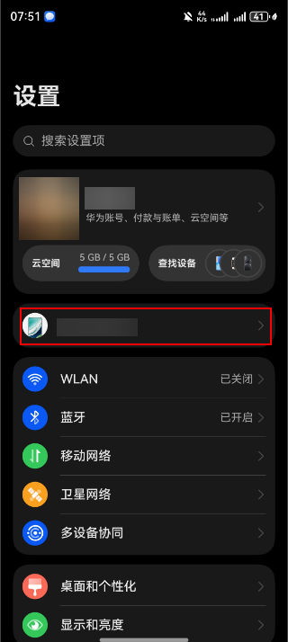
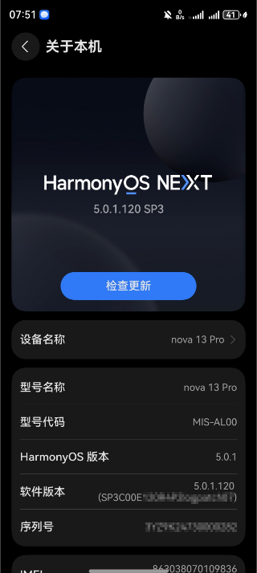
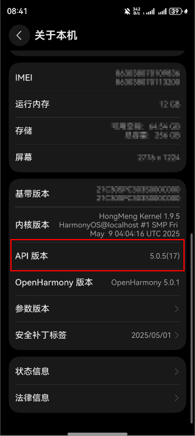
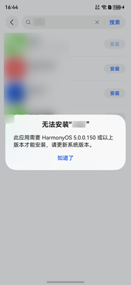

# 影响应用兼容性的关键信息

更新时间：2026-04-30 02:39:31

来源：https://developer.huawei.com/consumer/cn/doc/harmonyos-releases/app-compatibility-influence-factor

#### 应用开发过程使用的SDK版本

如简介所述，开发应用时使用的SDK版本决定了API能力范围以及具体的API行为。在应用开发过程中，有如下SDK版本属性：
  
| SDK版本属性 | 源码工程中配置项 （build-profile.json5文件中） | 应用打包后的对应字段 （module.json5文件中） | 说明 |
| --- | --- | --- | --- |
| 编译应用的SDK版本 | compileSdkVersion | compileSdkVersion | 编译应用工程的SDK版本，该字段决定了应用开发过程中可自动联想的API范围和使用的工具链版本。 取值默认为DevEco Studio自带的SDK版本，如需显式配置，只能配置为当前DevEco Studio自带的SDK版本。 |
| 应用运行的目标SDK版本 | targetSdkVersion | targetAPIVersion | 应用运行的目标SDK版本。默认取值为编译该应用的SDK版本号，即与compileSdkVersion的取值相同。 针对系统侧进行API版本隔离的变更，应用在终端设备上运行时会呈现以targetSdkVersion版本为目标版本的行为。 例如当前设备API版本为5.0.2(14)，而运行在该设备上的某应用targetSdkVersion配置为5.0.1(13)，则经过API版本隔离的变更会以5.0.1(13)版本的API行为呈现。在5.0.2(14)发生的API变更不会影响该应用在当前设备的实际表现。 建议开发者在升级SDK后重新编译应用工程时充分考虑API行为变更的影响，并合理配置targetSdkVersion的值。 |
| 应用运行的最低SDK版本 | compatibleSdkVersion | minAPIVersion | 应用运行要求的最低SDK版本。运行该应用的终端设备系统搭载的API版本不能低于该字段的值，低于则无法安装。 该字段版本值不能高于目标SDK版本。 可将compatibleSdkVersion的值设置为较小值，从而可在更低版本的系统上安装该应用，但应用是否能在compatibleSdkVersion对应系统版本上面正常运行，需要开发者针对无法在compatibleSdkVersion版本使用的API进行兼容性判断保护。 |
 
 
在应用的工程配置中，三个SDK版本属性之间的大小关系为：compatibleSdkVersion值≤targetSdkVersion值≤compileSdkVersion值，如果配置不符合这个规则，会有报错提示。
 
**示例：**
 
作为应用开发者，使用并适配了API版本6.0.2(22)，同时希望应用能够运行到尽可能多的HarmonyOS现网设备，那么可以在应用工程的build-profile.json5 文件中进行如下配置：
 
```text
<span style="color: rgb(132,63,161);">"products"</span><span style="color: rgb(181,106,1);">: </span>[
  {
    <span style="color: rgb(132,63,161);">"name"</span><span style="color: rgb(181,106,1);">: </span><span style="color: rgb(80,160,79);">"default"</span><span style="color: rgb(181,106,1);">,</span>
    <span style="color: rgb(132,63,161);">"signingConfig"</span><span style="color: rgb(181,106,1);">: </span><span style="color: rgb(80,160,79);">"default"</span><span style="color: rgb(181,106,1);">,</span>
    <span style="color: rgb(132,63,161);">"compileSdkVersion"</span><span style="color: rgb(181,106,1);">: </span><span style="color: rgb(80,160,79);">"6.0.2(22)"</span><span style="color: rgb(181,106,1);">,</span>
    <span style="color: rgb(132,63,161);">"targetSdkVersion"</span><span style="color: rgb(181,106,1);">: </span><span style="color: rgb(80,160,79);">"6.0.2(22)"</span><span style="color: rgb(181,106,1);">,</span>
    <span style="color: rgb(132,63,161);">"compatibleSdkVersion"</span><span style="color: rgb(181,106,1);">: </span><span style="color: rgb(80,160,79);">"6.0.0(20)"</span><span style="color: rgb(181,106,1);">,</span>
    <span style="color: rgb(132,63,161);">"runtimeOS"</span><span style="color: rgb(181,106,1);">: </span><span style="color: rgb(80,160,79);">"HarmonyOS"</span><span style="color: rgb(181,106,1);">,</span>
    ...
  }
]
```
 
本示例中，将compatibleSdkVersion值配置为6.0.0(20)（注意：compatibleSdkVersion字段具体配置的最低值，可根据应用运营策略和[HarmonyOS现网设备API版本分布](https://developer.huawei.com/consumer/cn/doc/harmonyos-releases/sdk-version-percentage)来决定），但因为该应用升级到了6.0.2(22)，并使用了该版本的新API，考虑到新的API在6.0.2(22)版本会运行异常，所以需通过API版本判断进行保护，具体保护方式可以参考后续章节：[API兼容性保护和告警屏蔽](https://developer.huawei.com/consumer/cn/doc/harmonyos-releases/app-compatibility-apis-compatibility)。
 
 

#### 运行应用的设备系统所搭载的API版本

如简介所述，应用能否正常运行在终端设备上，与终端设备系统所搭载的API版本是否匹配应用中声明的SDK版本相关。
 
设备系统（ROM）所搭载的API版本可通过以下三种方式获取：
 
- **【方式一】**终端设备系统（ROM）所搭载的API版本可在设备设置页面进入“关于本机”查看“API版本”的值。关于本机的进入方式如下：

  







  注意：上述界面的API版本的取值是从deviceInfo的distributionOSApiName和sdkApiVersion属性组合而成。
- **【方式二】**可通过以下hdc命令来查询设备ROM的API版本号。
```bash
hdc shell param get <strong>const.product.os.dist.apiname</strong>
<strong>hdc shell param get const.product.os.dist.apiversion</strong>
<strong>hdc shell param get const.ohos.apiversion</strong>
```
 其中：

  
const.product.os.dist.apiname和const.product.os.dist.apiversion是HarmonyOS API版本前半部分的表示，即M.S.F(N)中的M.S.F。const.product.os.dist.apiname是该字段的字符串表示，格式为M.S.F。

  const.product.os.dist.apiversion是该字段的数值表示，由apiname转换而来，apiversion的值=M*10000+S*100+F 。
- const.ohos.apiversion是OpenHarmony底座的API Level。

 
运行示例如下：
 
```bash
><strong> hdc shell param get const.product.os.dist.apiname</strong>
> 5.0.5
><strong> hdc shell param get const.product.os.dist.apiversion</strong>
> 50005
><strong> hdc shell param get const.ohos.apiversion</strong>
> 17
```
 
 
- **【方式三】**可通过public API接口获取。以ArkTS语言为例，可以通过deviceinfo中的distributionOSApiVersion/sdkApiVersion接口获取，具体可以参考[deviceInfo接口参考](https://developer.huawei.com/consumer/cn/doc/harmonyos-references/js-apis-device-info)。

 
 

#### 应用包中所记录的SDK版本信息

参考上述SDK版本属性表格， 在应用包的module.json5中会记录compileSdkVersion，targetAPIVersion和minAPIVersion三个字段，其字段作用在上述表格有详细说明。
 
应用市场分发时主要根据minAPIVersion进行分发范围的控制，该字段表示能够分发到的最小API版本的现网设备。
 
当用户设备的API版本低于应用包中的minAPIVersion时，该应用仍可在该设备的应用市场推荐页被展示，或通过搜索被查看到。但当用户点击安装此应用时，会提示此应用“无法安装”并给出所需要的系统版本要求（如下图所示）。
 



 
 

#### 对API的行为变更进行API版本隔离

API版本在演进过程中可能会引入一些API的行为变更，系统对这些变更是否进行了API版本隔离也会直接影响应用的兼容性。
 
API实施行为变更时进行版本隔离是一种对应用的保护机制，应用开发者可以通过在应用源码工程中配置targetSdkVersion字段来告诉系统该应用运行的目标版本，从而决定使用什么样的API行为。
 
- 如果API在行为变更时已进行版本隔离，在低于变更发生的API版本设备上将保留变更前的API行为，仅在变更发生的版本及其后续版本中按照新的API行为执行。针对某个应用使用了行为变更的API：

  
如果配置的targetSdkVersion＜该API行为变更引入的版本，那么该应用完全无需关注此变更的影响，仍能在搭载更高API版本的系统（ROM搭载的API版本≥该API行为变更引入的版本）上正常运行；
- 如果配置的targetSdkVersion≥该API行为变更引入的版本，则应用需要关注此API行为变更，如果需在搭载更高API版本的系统（ROM搭载的API版本≥该API行为变更引入的版本）正常运行，需要应用进行适配。

 - 如果API在行为变更时未进行版本隔离，则将影响使用该API的所有应用。这些应用都必须按照变更说明中的适配指导进行调整，重新声明应用的SDK版本要求，并完成编译上架，否则在搭载更高版本SDK的系统上运行时将受到API行为变更的影响。

 
> [!NOTE]
> 从2025年1月起，将对所有API行为变更是否进行版本隔离进行明确声明。 针对所有的应用，要求显式配置targetSdkVersion信息，方便系统根据该字段值判断应用的目标版本，从而决定版本隔离API的行为。从API版本6.0.0(20)开始，在开发者使用DevEco Studio打开工程时，如果源码工程中未配置targetSdkVersion，将会弹框提示开发者进行配置。
