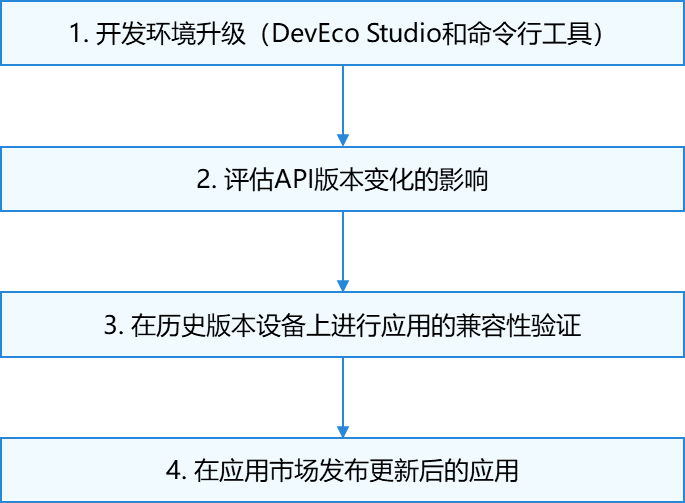

# 应用升级适配简介

更新时间：2026-01-21 11:07:33

来源：https://developer.huawei.com/consumer/cn/doc/harmonyos-releases/app-upgrade-intro

本文档指导开发者将HarmonyOS应用的开发工具套件升级至6.0.0(20)并完成应用的升级适配，确保开发者平稳切换并保证终端用户在HarmonyOS 6.0（指设备ROM版本）上获得良好的应用使用体验。
 
HarmonyOS版本在快速迭代更新的过程中，新增了大量的API，少量API会被废弃或者发生行为变更。为确保兼容性，在应用升级前需要参考API变更文档评估废弃API以及API行为变更对应用的影响。此外，我们提供了API隔离机制（通过targetSdkVersion进行隔离）以及API变更工具来帮助开发者升级应用。完成应用在开发套件的升级适配后，需要在新老设备上进行兼容性测试，以确保应用的正确运行，验证完成后，将最新应用发布到应用市场。
 
迁移阶段包含以下几个阶段：
 

