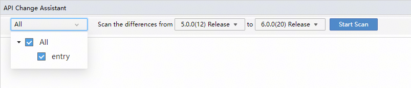
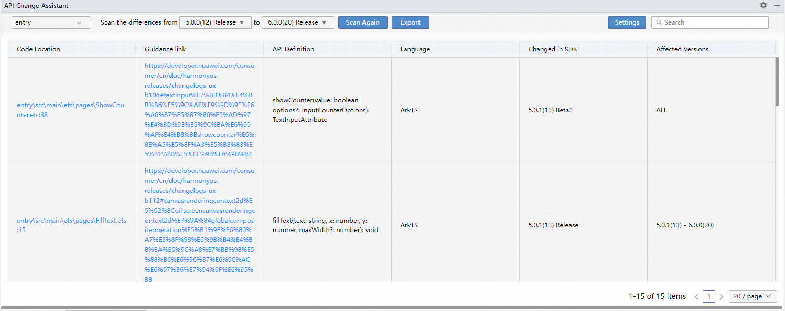
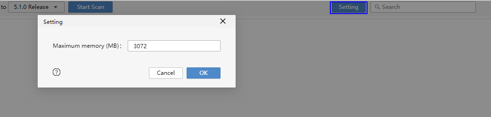

# 评估API版本变化的影响并适配

更新时间：2026-01-21 11:07:33

来源：https://developer.huawei.com/consumer/cn/doc/harmonyos-releases/adapt-api-changes

DevEco Studio升级到6.0.0(20)配套版本后，如果应用工程中未显式配置targetSdkVersion版本，targetSdkVersion版本会同步升级为6.0.0(20)。同时，编译应用默认使用的compileSdkVersion也将会同步升级为6.0.0(20)，如果希望应用兼容老版本SDK，可通过compatibleSdkVersion配置能够兼容的最低SDK版本，此时需要注意高于应用运行设备ROM的SDK版本的API需要进行版本判断以便保证应用运行正常，详情请阅读应用开发中的兼容性场景开发指导。

由于默认使用的SDK版本发生了变更，开发者在升级后需要对API的行为变更进行评估，确认是否对应用的兼容性产生了影响。部分API的行为变更可能会通过targetSdkVersion字段进行API版本隔离，以便提供前向兼容手段，详情请阅读应用兼容性说明。

对于具体的API行为变更对应用带来的影响，开发者可通过以下两种手段来识别，并参考变更说明文档进行适配。

## 通过DevEco Studio的API变更助手检测

开发者可以通过DevEco Studio的API变更助手查看当前工程中使用到的ArkTS API/C API是否存在行为变更，并根据工具提供的适配指导链接完成工程代码适配修改。步骤如下：

1. 在DevEco Studio菜单栏点击“**Tools > API Change Assistant**”打开API变更助手，此时编辑区下方的API Change Assistant页签中，支持按模块查看API变更情况。选择需要对比的SDK版本号范围，点击**Start Scan**开始扫描。

2. 扫描完成将展示当前工程中使用的API是否在选择比较的SDK版本之间发生行为变更。点击Code Location中的代码地址，跳转到相应的代码编写位置；如需更多指导，可点击Guidance link中的链接，跳转至版本说明文档中查看详情。

3. 点击**Export**，选择API变更的存放位置后导出变更数据；点击**Scan Again**可重新进行扫描。通过右侧Setting按钮，可以设置在扫描API时，可使用的最大堆内存的大小，默认值为3072MB，当工程代码量较大导致扫描缓慢时，可以适当调大该参数。

## 查看官网发布的全量变更

如果需要了解HarmonyOS在历次版本迭代中产生的所有变更清单，可参见HarmonyOS行为变更汇总。
