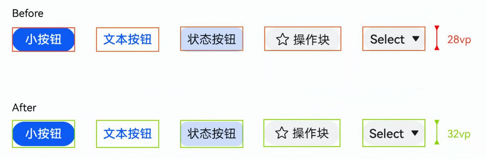
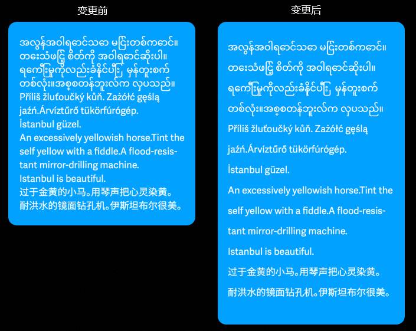
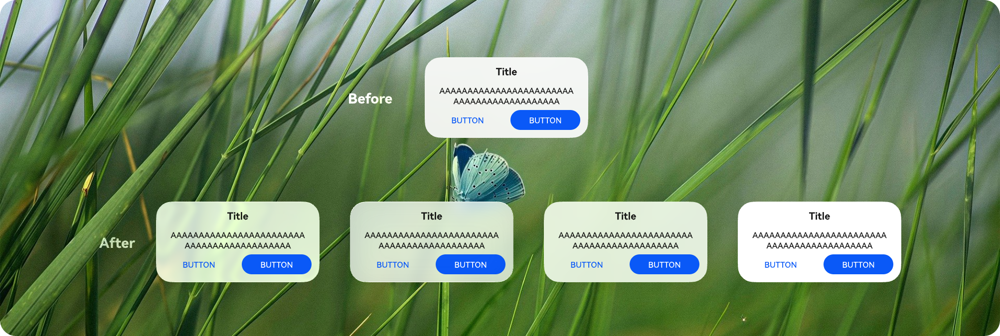
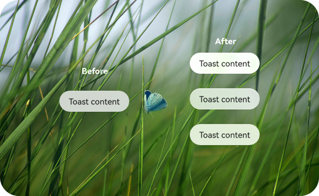
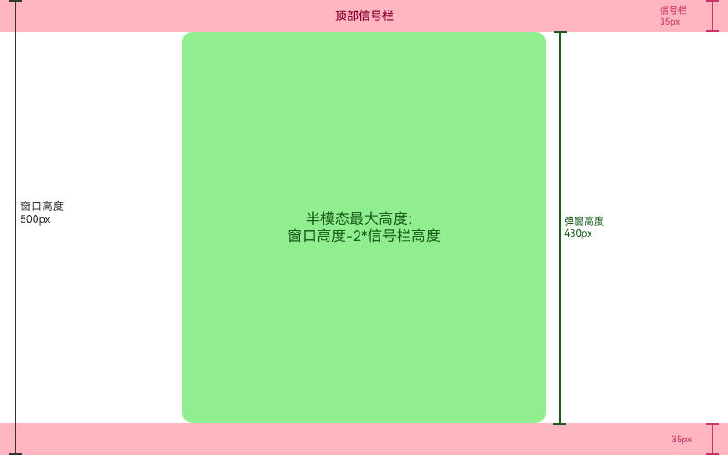
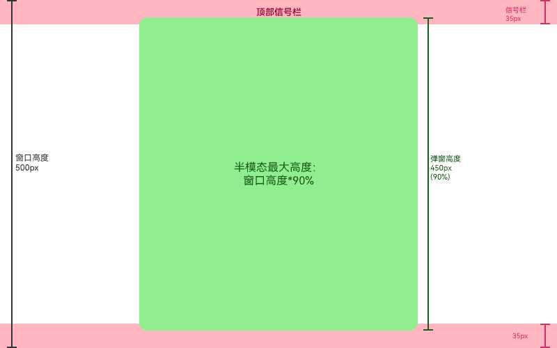
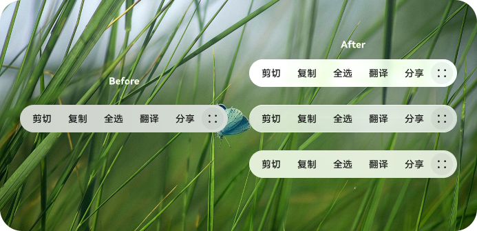

# UX样式或效果的变更

更新时间：2026-07-28 11:14:31

来源：https://developer.huawei.com/consumer/cn/doc/harmonyos-releases/changelogs-ux-7001

#### notofonts三方件小语种字体升级变更

**变更原因**
 
当前版本存在错别字的问题，变更后可修复错别字和优化数学字符的显示。
 
**变更影响**
 
此变更涉及应用适配。
 
变更前：蒙古语（NotoSansMongolian-Regular.ttf）、天城体（NotoSansDevanagari[wdth,wght].ttf）、缅甸语（NotoSansMyanmar[wdth,wght].ttf）部分显示不正确。
 
变更后：蒙古语（NotoSansMongolian-Regular.ttf）、天城体（NotoSansDevanagari[wdth,wght].ttf）、缅甸语（NotoSansMyanmar[wdth,wght].ttf）显示正确，部分数学符号字体（NotoSansMath-Regular.ttf）显示变大。
 
**起始 API Level**
 
11
 
**变更的接口/组件**
 
不涉及
 
**适配指导**
 
数学符号变大后，显示更清晰，效果会更好。由于数学符号变大，可能出现界面排版变动，需要应用根据实际情况调整界面排版。
 
 

#### 表单类组件触摸热区最小高度变更

**变更原因**
 
[Button](https://developer.huawei.com/consumer/cn/doc/harmonyos-references/ts-basic-components-button)、[样式为Button的Toggle](https://developer.huawei.com/consumer/cn/doc/harmonyos-references/ts-basic-components-toggle)、[Select](https://developer.huawei.com/consumer/cn/doc/harmonyos-references/ts-basic-components-select)、[Chip](https://developer.huawei.com/consumer/cn/doc/harmonyos-references/ohos-arkui-advanced-chip)、[ChipGroup](https://developer.huawei.com/consumer/cn/doc/harmonyos-references/ohos-arkui-advanced-chipgroup)组件触摸热区当前最小高度28vp，点击范围小，不易操作。
 
**变更影响**
 
此变更涉及应用适配。
 
> [!NOTE]
> 此变更已做版本隔离，变更仅在应用的targetSdkVersion设置为大于等于26.0.0时生效。

 
- 变更前：组件默认触摸热区高度最小为28vp。
- 变更后：组件默认触摸热区高度最小为32vp。

 



 
**起始 API Level**
 
Button：7
 
Toggle：8
 
Select：8
 
Chip：11
 
ChipGroup：12
 
**变更的接口/组件**
 
Button、Button模式的Toggle、Chip、ChipGroup和Select组件。
 
**适配指导**
 
默认行为变更，应注意变更后的行为是否对整体应用逻辑产生影响，如开发者期望恢复默认触摸热区，可使用如下方法重置组件的触摸热区，恢复为与组件实际大小一致。如果开发者自定义了组件高度或热区，触摸热区随自定义大小生效。
 
```text
@Entry
struct ButtonExample {
  build() {
    Button('xxxxx')
      .responseRegion(undefined)
  }
}
```
 
 

#### 内置文本的组件文本样式优化

**变更原因**
 
部分ArkUI组件内置了文本功能，文本存在孤字换行、小语种（藏语、缅甸语）行高异常截断、文本按单词换行导致单词截断的问题。为提升组件内文本的可阅读性，针对上述三种场景进行默认优化。
 
**变更影响**
 
此变更涉及应用适配。
 
> [!NOTE]
> 此变更已做版本隔离，变更仅在应用的targetSdkVersion设置为大于等于26.0.0时生效。

 
**场景一：孤字换行优化**
 
变更前：系统语言为中文时，组件内文本显示换行后存在单独文字，孤字会独立在一行显示。
 
变更后：系统语言为中文时，组件内文本显示换行后存在单独文字，前一行尾部的文字会跟随显示到第二行，不会出现孤字显示一行的情况。
 
孤字换行变更前后效果如下图所示：
 



 
**场景二：小语种行高优化**
 
变更前：系统语言为小语种（藏语、缅甸语）时，文本显示存在重叠，截断的问题。
 
变更后：系统语言为小语种（藏语、缅甸语）时，文本显示时行高会自动调整，不会出现文本重叠和截断的现象。
 
小语种行高优化变更前后效果如下图所示：
 



 
**场景三：单词换行改为音节换行**
 
变更前：系统语言为英语、意大利语等外语时，组件内文本的单词较长时会按照单词换行的方式进行换行，如果单词长度超过显示宽度，单词会被截断。
 
变更后：系统语言为英语、意大利语等外语时，组件内文本的单词较长时会按照音节换行的方式进行换行，同一个单词内部换行后会使用连词符连接，不会出现单词截断问题。
 
文本按单词换行改为按音节换行变更前后效果如下图所示：
 



 
**起始 API Level**
 
12
 
**变更的接口/组件**
 
[bindPopup](https://developer.huawei.com/consumer/cn/doc/harmonyos-references/ts-universal-attributes-popup#bindpopup)，[bindTips](https://developer.huawei.com/consumer/cn/doc/harmonyos-references/ts-universal-attributes-tips#bindtips)，[showToast](https://developer.huawei.com/consumer/cn/doc/harmonyos-references/arkts-apis-uicontext-promptaction#showtoast)，[openToast](https://developer.huawei.com/consumer/cn/doc/harmonyos-references/arkts-apis-uicontext-promptaction#opentoast18)，[Menu](https://developer.huawei.com/consumer/cn/doc/harmonyos-references/ts-basic-components-menu)，[MenuItem](https://developer.huawei.com/consumer/cn/doc/harmonyos-references/ts-basic-components-menuitem)，[Slider](https://developer.huawei.com/consumer/cn/doc/harmonyos-references/ts-basic-components-slider)，[Select](https://developer.huawei.com/consumer/cn/doc/harmonyos-references/ts-basic-components-select)，[showAlertDialog](https://developer.huawei.com/consumer/cn/doc/harmonyos-references/arkts-apis-uicontext-uicontext#showalertdialog)，[showActionSheet](https://developer.huawei.com/consumer/cn/doc/harmonyos-references/arkts-apis-uicontext-uicontext#showactionsheet)，[showActionMenu](https://developer.huawei.com/consumer/cn/doc/harmonyos-references/arkts-apis-uicontext-promptaction#showactionmenu11)，[showDialog](https://developer.huawei.com/consumer/cn/doc/harmonyos-references/arkts-apis-uicontext-promptaction#showdialog)，[ArcButton](https://developer.huawei.com/consumer/cn/doc/harmonyos-references/ohos-arkui-advanced-arcbutton)，[Search](https://developer.huawei.com/consumer/cn/doc/harmonyos-references/ts-basic-components-search)，[Hyperlink](https://developer.huawei.com/consumer/cn/doc/harmonyos-references/ts-container-hyperlink)，[Marquee](https://developer.huawei.com/consumer/cn/doc/harmonyos-references/ts-basic-components-marquee)，[TextClock](https://developer.huawei.com/consumer/cn/doc/harmonyos-references/ts-basic-components-textclock)，[Badge](https://developer.huawei.com/consumer/cn/doc/harmonyos-references/ts-container-badge)，[Chip](https://developer.huawei.com/consumer/cn/doc/harmonyos-references/ohos-arkui-advanced-chip)，[ChipGroup](https://developer.huawei.com/consumer/cn/doc/harmonyos-references/ohos-arkui-advanced-chipgroup)，[SegmentButton](https://developer.huawei.com/consumer/cn/doc/harmonyos-references/ohos-arkui-advanced-segmentbutton)，[SegmentButtonV2](https://developer.huawei.com/consumer/cn/doc/harmonyos-references/ohos-arkui-advanced-segmentbuttonv2)，[bindSheet](https://developer.huawei.com/consumer/cn/doc/harmonyos-references/ts-universal-attributes-sheet-transition#bindsheet)，[Dialog](https://developer.huawei.com/consumer/cn/doc/harmonyos-references/ohos-arkui-advanced-dialog)，[showDatePickerDialog](https://developer.huawei.com/consumer/cn/doc/harmonyos-references/arkts-apis-uicontext-uicontext#showdatepickerdialog)，[showTimePickerDialog](https://developer.huawei.com/consumer/cn/doc/harmonyos-references/arkts-apis-uicontext-uicontext#showtimepickerdialog)，[showTextPickerDialog](https://developer.huawei.com/consumer/cn/doc/harmonyos-references/arkts-apis-uicontext-uicontext#showtextpickerdialog)，[CalendarPickerDialog](https://developer.huawei.com/consumer/cn/doc/harmonyos-references/ts-methods-calendarpicker-dialog)
 
**适配指导**
 1. 默认效果变更，组件内置文本的换行策略、行高变化后，组件的布局大小存在变化，应用需根据实际显示效果进行调整适配。
2. 变更针对的是系统设置的语言，而非应用实际使用的语言。比如当前应用并未适配藏语和缅甸语，当用户将系统语言切换为藏语或缅甸语后，应用显示的文本依然为中文，但仍会受到本次文本样式变更的影响，行高会自动撑开，相关组件布局大小会发生改变。
 
 

#### Dialog、Toast、AlphabetIndexer和文本选择菜单默认开启沉浸式系统材质

**变更原因**
 
ArkUI组件支持对接沉浸式系统材质功能，为减少应用适配成本，部分高频组件默认开启沉浸式系统材质功能。组件范围为所有的弹出框Dialog、Toast、AlphabetIndexer和文本选择菜单。
 
**变更影响**
 
此变更涉及应用适配。
 
> [!NOTE]
> 此变更已做版本隔离，变更仅在应用的targetSdkVersion设置为大于等于26.0.0时生效。

 
- 变更前：所有组件默认均不开启沉浸式系统材质。
- 变更后：Dialog、Toast、AlphabetIndexer和文本选择菜单默认开启沉浸式系统材质。

 
**起始 API Level**
 
12
 
**变更的接口/组件**
 
涉及接口：
 
- [showAlertDialog](https://developer.huawei.com/consumer/cn/doc/harmonyos-references/arkts-apis-uicontext-uicontext#showalertdialog)
- [showActionSheet](https://developer.huawei.com/consumer/cn/doc/harmonyos-references/arkts-apis-uicontext-uicontext#showactionsheet)
- [showActionMenu](https://developer.huawei.com/consumer/cn/doc/harmonyos-references/arkts-apis-uicontext-promptaction#showactionmenu11)
- [showDialog](https://developer.huawei.com/consumer/cn/doc/harmonyos-references/arkts-apis-uicontext-promptaction#showdialog)
- [openCustomDialog](https://developer.huawei.com/consumer/cn/doc/harmonyos-references/arkts-apis-uicontext-promptaction#opencustomdialog12)
- [自定义弹窗 (CustomDialog)](https://developer.huawei.com/consumer/cn/doc/harmonyos-references/ts-methods-custom-dialog-box)
- [日历选择器弹窗 (CalendarPickerDialog)](https://developer.huawei.com/consumer/cn/doc/harmonyos-references/ts-methods-calendarpicker-dialog)
- [日期滑动选择器弹窗 (DatePickerDialog)](https://developer.huawei.com/consumer/cn/doc/harmonyos-references/ts-methods-datepicker-dialog)
- [时间滑动选择器弹窗 (TimePickerDialog)](https://developer.huawei.com/consumer/cn/doc/harmonyos-references/ts-methods-timepicker-dialog)
- [文本滑动选择器弹窗 (TextPickerDialog)](https://developer.huawei.com/consumer/cn/doc/harmonyos-references/ts-methods-textpicker-dialog)
- [showToast](https://developer.huawei.com/consumer/cn/doc/harmonyos-references/arkts-apis-uicontext-promptaction#showtoast)
- [openToast](https://developer.huawei.com/consumer/cn/doc/harmonyos-references/arkts-apis-uicontext-promptaction#opentoast18)
- [AlphabetIndexer](https://developer.huawei.com/consumer/cn/doc/harmonyos-references/ts-container-alphabet-indexer)
- [文本选择菜单](https://developer.huawei.com/consumer/cn/doc/harmonyos-references/ts-basic-components-text#copyoption9)

 
沉浸式系统材质效果和设备算力相关，详见[系统材质](https://developer.huawei.com/consumer/cn/doc/harmonyos-references/arkts-apis-uimaterial)。变更前后的效果图如下。
 
Dialog变更前后的效果图：
 



 
Toast变更前后的效果图：
 



 
AlphabetIndexer变更前后的效果图：
 



 
文本选择菜单变更前后的效果图：
 


 
**适配指导**
 1. 当开发者主动为上述组件配置了背景色、背景模糊、阴影和边框样式时，沉浸式系统材质不会默认生效，如开发者期望沉浸式系统材质生效，建议删除自定义的背景色、背景模糊、阴影和边框样式设置。
2. 如果开发者不期望开启沉浸式系统材质功能，可通过应用级开关能力，强制禁止应用内所有组件使用沉浸式系统材质。

  在[module.json5](https://developer.huawei.com/consumer/cn/doc/harmonyos-guides/module-configuration-file)文件中配置metadata（仅在entry类型的module中配置生效），将value设置为"disable"即可禁用所有组件的沉浸式系统材质。

  
```text
{
  "module": {
    // ...
    "type": "entry",
    // ...
    "metadata": [{
      "name": "ohos.arkui.UIMaterial.state",
      "value": "disable"
    }]
    // ...
  }
}
```
 更多配置说明参见[MaterialState](https://developer.huawei.com/consumer/cn/doc/harmonyos-references/arkts-apis-uimaterial#materialstate)。
3. 如果开发者仅想关闭部分组件的沉浸式系统材质，可通过组件提供的组件级接口关闭指定组件的沉浸式系统材质功能。

  为需要关闭材质的组件设置[systemMaterial](https://developer.huawei.com/consumer/cn/doc/harmonyos-references/ts-universal-attributes-image-effect#systemmaterial)为uiMaterial.Material.[empty](https://developer.huawei.com/consumer/cn/doc/harmonyos-references/arkts-apis-uimaterial#empty)。

  
```text
import { uiMaterial } from '@kit.ArkUI';

this.getUIContext().getPromptAction().showToast({
  message: 'Toast Content',
  // 关闭指定组件的沉浸式系统材质
  systemMaterial: uiMaterial.Material.empty
});
```

 
 

#### 半模态居中弹窗最大高度变更

**变更原因**
 
UX规格变更，当前半模态最大高度限制为窗口短边长度的90%，可能导致半模态与信号栏重叠。
 
**变更影响**
 
此变更不涉及应用适配。
 
> [!NOTE]
> 此变更已做版本隔离，变更仅在应用的targetSdkVersion设置为大于等于26.0.0时生效。

 
变更前：
 
半模态居中弹窗最大高度：取“短边长度*90%”。
 


 
变更后：
 
半模态居中弹窗最大高度：取“短边长度*90%”、“窗口高度-信号栏高度*2”两者中的最小值。
 


 
**起始 API Level**
 
12
 
**变更发生版本**
 
从OpenHarmony SDK 7.0.0.19开始。
 
**变更的接口/组件**
 
[CENTER](https://developer.huawei.com/consumer/cn/doc/harmonyos-references/ts-universal-attributes-sheet-transition#sheettype11枚举说明)
 
**适配指导**
 1. UX规格变更，无需适配。
2. 若半模态达到最大高度后，内容布局存在截断，可通过[height](https://developer.huawei.com/consumer/cn/doc/harmonyos-references/ts-universal-attributes-sheet-transition#sheetoptions)属性调整半模态高度。
