# 文档变更说明

更新时间：2026-05-18 09:49:01

来源：https://developer.huawei.com/consumer/cn/doc/harmonyos-releases/doc-updates

#### 2026年4月20日
#### ArkUI新增文档
[使用网格](https://developer.huawei.com/consumer/cn/doc/harmonyos-guides/ndk-grid)：新增网格组件的NDK开发指南，包括创建网格组件、创建后如何设置子组件所占行列数、如何处理滚动事件。
丰富[UI开发常见问题](https://developer.huawei.com/consumer/cn/doc/harmonyos-guides/ui-development-faq)：新增20+常见问题及对应的解决措施，帮助开发者快速完成问题定位与解决。例如：[FrameNode节点运行时出现jscrash](https://developer.huawei.com/consumer/cn/doc/harmonyos-guides/arkts-arkui-framenode-faq#framenode节点运行时出现jscrash)、[文本超长时如何展示](https://developer.huawei.com/consumer/cn/doc/harmonyos-guides/arkts-text-faq#文本超长时如何展示)等。

#### AVSession Kit新增桌面歌词接入指南
[应用接入桌面歌词](https://developer.huawei.com/consumer/cn/doc/harmonyos-guides/avsession-desktop-lyrics)：支持音乐播放器或有歌词展示需求的音频类应用接入桌面歌词功能，可以实现将歌词以悬浮窗形式展示在系统桌面，让用户无需进入应用即可查看歌词。

#### 2026年3月10日
#### Ability Kit新增应用跳转相关指导
[获取目标应用的URL信息](https://developer.huawei.com/consumer/cn/doc/harmonyos-guides/obtaining-target-app-url-info)：在使用[UIAbilityContext.openLink](https://developer.huawei.com/consumer/cn/doc/harmonyos-references/js-apis-inner-application-uiabilitycontext#openlink12)接口拉起目标应用时，需要传入目标应用的URL信息。主要介绍如何通过aa工具与bm工具，获取目标应用的URL信息。

#### 2026年3月5日
#### ArkUI状态管理V1->V2迁移指导文档优化
[状态管理V1-V2迁移指导](https://developer.huawei.com/consumer/cn/doc/harmonyos-guides/arkts-v1-v2-guide)：梳理迁移场景，将迁移场景分为组件内状态变量迁移、数据对象状态变量迁移、应用内状态变量迁移、组件复用迁移，新增内置对象迁移指导、AnimateTo使用迁移指导。

#### Image Kit增加位图操作
[使用PixelMap完成位图操作](https://developer.huawei.com/consumer/cn/doc/harmonyos-guides/image-pixelmap-operation)文档中，增加将两张宽度相同的位图纵向拼接成一张长图的开发示例。

#### AVSession Kit提供音频模板功能
[使用音频模板](https://developer.huawei.com/consumer/cn/doc/harmonyos-guides/using-avsession-avmusictemplate)：AVSession Kit支持媒体应用通过音频模板接入播控中心，实现音视频在播控中心进行统一的界面显示和播控管理。

#### 2026年2月9日
#### ArkTS新增基础库开发常见问题
[基础库常见问题](https://developer.huawei.com/consumer/cn/doc/harmonyos-guides/commonlibrary-faq)：介绍基础库开发过程中的常见问题，帮助开发者快速完成问题定位与解决。例如，如何解决解析大文件xml发生的内存溢出问题。

#### Camera Kit新增高性能拍照指南
优化原有[拍照(ArkTS)](https://developer.huawei.com/consumer/cn/doc/harmonyos-guides/camera-shooting)及[拍照(C/C++)](https://developer.huawei.com/consumer/cn/doc/harmonyos-guides/native-camera-shooting)文档内容，新增高性能拍照指南示例，介绍在单段式拍照时，通过设置明确的画质优先策略满足不同拍照效果要求。

#### 2026年2月2日
#### ArkGraphics 2D新增离线图像处理文档
[添加图像效果（C/C++）](https://developer.huawei.com/consumer/cn/doc/harmonyos-guides/effectkit-filter-c)：新增离线图像处理指导文档，介绍如何基于滤镜（Filter）设置不同的图像效果，比如设置图像模糊程度、调节图像亮度和灰度、设置图像反色等。

#### 2026年1月26日
#### ArkUI新增状态管理文档
[状态管理原理介绍](https://developer.huawei.com/consumer/cn/doc/harmonyos-guides/arkts-state-management-introduce)：新增状态管理基本原理介绍，帮助开发者更好地理解其工作流程。
[状态管理常见问题](https://developer.huawei.com/consumer/cn/doc/harmonyos-guides/arkts-state-management-faq)：新增状态管理开发过程中的常见问题，帮助开发者快速完成问题定位与解决。

#### Audio Kit文档目录调整
文档目录新增音频性能调优节点，了解如何提升音频性能体验及对音频工作组进行管理。
“音频录制流管理”文档名称变更为[“查询和监听其他应用录制状态”](https://developer.huawei.com/consumer/cn/doc/harmonyos-guides/audio-recording-stream-management)。
“共享音频输入”文档名称变更为“[录音并发策略说明”](https://developer.huawei.com/consumer/cn/doc/harmonyos-guides/audio-recording-concurrency)。
“管理麦克风”文档名称变更为[“管理麦克风静音状态”](https://developer.huawei.com/consumer/cn/doc/harmonyos-guides/mic-management)。

#### Camera Kit新增相机旋转C++开发文档
[适配相机旋转角度](https://developer.huawei.com/consumer/cn/doc/harmonyos-guides/camera-rotation-angle-adaptation-native)：新增适配相机旋转C++指导文档，以确保在不同屏幕状态下、在合适的方向显示相机图像。
[相机旋转角度术语](https://developer.huawei.com/consumer/cn/doc/harmonyos-guides/camera-rotation-term-native)：介绍适配相机旋转角度C++开发过程中涉及的设备方向、镜头角度、屏幕显示角度等术语。

#### AVcodec Kit文档优化
[ROI视频编码](https://developer.huawei.com/consumer/cn/doc/harmonyos-guides/video-encoding-roi)：新增在Surface模式下通过NativeBuffer接口配置ROI场景。

#### 2026年1月23日
#### 丰富窗口开发常见问题
[窗口开发常见问题](https://developer.huawei.com/consumer/cn/doc/harmonyos-guides/window-faqs)：补充20+个窗口开发过程中的常见问题与指导，包含如何实现横竖屏切换、如何获取窗口宽高、如何设置隐私窗口等。

#### 2026年1月8日
#### 优化应用真实性证明文档
为帮助开发者更好地理解应用场景，提高应用接入效率，我们优化了应用真实性证明文档。
- 文档结构优化：将“设备真实性证明开发指导”更名为“应用真实性证明”，并新增独立子流程“创建密钥确立可信凭证”和“签名验签识别真实请求”，以更贴近操作，便于开发者通过标题快速定位所需内容。
- 页面内容优化：在简介页中加入应用真实性证明的基础概念介绍；在“创建密钥确立可信凭证”和“签名验签识别真实请求”子节点中分别添加交互流程图；优化概念和场景介绍，帮助开发者快速掌握应用真实性证明的使用场景及交互流程，从而参照开发指南有效验证应用请求的真实性。
- 文档位置调整：将文档从“Device Certificate Kit（设备证书服务）”移至“Universal Keystore Kit（密钥管理服务）”。尽管底层能力由证书管理提供，但开发者是通过调用Universal Keystore Kit的接口使用此功能，为确保开发者体验的一致性，文档位置调整至“Universal Keystore Kit（密钥管理服务）”节点下。
具体请见[应用真实性证明](https://developer.huawei.com/consumer/cn/doc/harmonyos-guides/device-attestation-intro)。

#### 2025年12月31日
#### 新增音频文档
[实现音频输入设备路由切换：](https://developer.huawei.com/consumer/cn/doc/harmonyos-guides/audio-input-device-switcher)当应用有音频输入时，系统会根据音频流类型选择对应的输入设备。若默认输入设备不满足应用需求，可通过[setBluetoothAndNearlinkPreferredRecordCategory](https://gitcode.com/openharmony/docs/blob/e35fbb672157c12b091a827c66a05816f5939b1f/zh-cn/application-dev/reference/apis-audio-kit/arkts-apis-audio-AudioSessionManager.md#setbluetoothandnearlinkpreferredrecordcategory21)或[selectMediaInputDevice](https://gitcode.com/openharmony/docs/blob/e35fbb672157c12b091a827c66a05816f5939b1f/zh-cn/application-dev/reference/apis-audio-kit/arkts-apis-audio-AudioSessionManager.md#selectmediainputdevice21)实现音频输入设备路由切换。
[空间音频能力查询和状态订阅](https://developer.huawei.com/consumer/cn/doc/harmonyos-guides/public-audio-spatialization-management)：空间音频是一种能够将传统立体声体验扩展到三维空间的音频技术，对于音频类播放应用，开发者可以查询到设备是否支持空间音频，以及当前设备空间音频的开关状态。

#### 2025年12月29日
#### 新增窗口开发常见问题
[窗口开发常见问题](https://developer.huawei.com/consumer/cn/doc/harmonyos-guides/window-faqs)：介绍窗口开发过程中的常见问题，帮助开发者快速完成问题定位与解决。

#### 2025年12月23日
#### 新增屏幕管理术语
[屏幕管理开发术语](https://developer.huawei.com/consumer/cn/doc/harmonyos-guides/display-terminology)：介绍屏幕管理开发的核心概念，便于开发者了解屏幕开发相关概念及内容，更好地完成应用开发。

#### 新增ArkData常见问题
[ArkData常见问题](https://developer.huawei.com/consumer/cn/doc/harmonyos-guides/data-faq)：介绍ArkData开发过程中的常见问题，帮助开发者快速完成问题定位与解决。

#### 2025年11月15日
#### 新增ArkUI文档
[UI开发常见问题](https://developer.huawei.com/consumer/cn/doc/harmonyos-guides/ui-development-faq)：介绍UI开发时的常见问题，主要包括[自定义节点常见问题](https://developer.huawei.com/consumer/cn/doc/harmonyos-guides/arkts-user-defined-node-faq)和[按钮与选择组件常见问题](https://developer.huawei.com/consumer/cn/doc/harmonyos-guides/arkts-select-component-faq)的现象和解决措施。

#### 2025年11月5日
#### DevEco Studio新增仿真器文档
[使用仿真器运行轻量级穿戴应用](https://developer.huawei.com/consumer/cn/doc/harmonyos-guides/ide-run-simulator)：介绍在DevEco Studio上通过仿真器运行和调试Lite Wearable设备应用的使用方式，包括模拟传感器、电池等。

#### 2025年11月3日
#### 新增日历服务实践案例
[日历服务实践案例](https://developer.huawei.com/consumer/cn/doc/harmonyos-guides/calendarmanager-practice-developer)：介绍了不同“一键服务”类型对应的实践场景及各字段取值建议，提供了对应的示例及案例示意图，指导快速完成各场景服务的一键直达开发，提升用户体验。

#### 2025年10月24日
#### 获取体验增强
为提升文档获取体验，官网上线划词召出“AI问答”功能，通过生成式问答、深度思考、生成总结，可快速生成相关特性功能概念、使用场景、信息来源等。
使用HarmonyOS开发者官网账号登录网站，在文档区域选中内容单击“AI提问”即可召出。
在文档中，选中“ExtensionAbility组件”，单击“AI提问”。
**图1 **AI提问

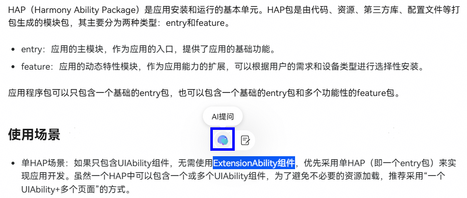
在“智能客服”窗口中，可看到相关内容的生成总结。
**图2 **智能客服

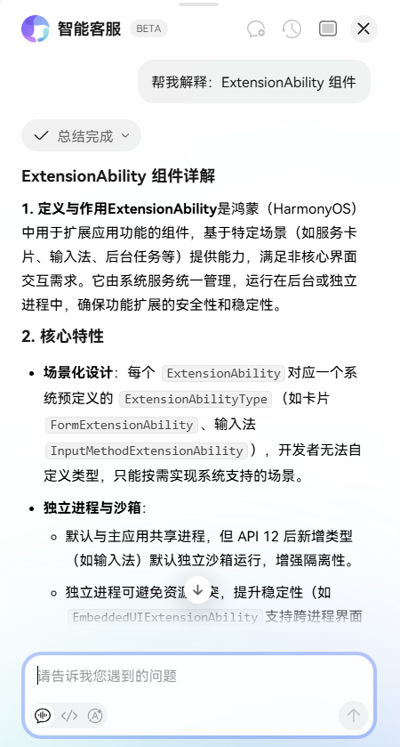

#### 2025年10月20日
#### 新增窗口旋转文档
[窗口旋转](https://developer.huawei.com/consumer/cn/doc/harmonyos-guides/window-rotation)：介绍了窗口旋转与屏幕方向的关系、旋转接口规格、旋转策略及设备差异性等内容，便于开发者系统了解窗口旋转相关内容，从而进行应用窗口旋转相关的适配与开发。

#### 新增ArkUI文档
- [管理软键盘](https://developer.huawei.com/consumer/cn/doc/harmonyos-guides/arkts-manage-keyboard)：介绍使用系统输入框组件（[TextInput](https://developer.huawei.com/consumer/cn/doc/harmonyos-references/ts-basic-components-textinput)、[TextArea](https://developer.huawei.com/consumer/cn/doc/harmonyos-references/ts-basic-components-textarea)、[Search](https://developer.huawei.com/consumer/cn/doc/harmonyos-references/ts-basic-components-search)、[RichEditor](https://developer.huawei.com/consumer/cn/doc/harmonyos-references/ts-basic-components-richeditor)）时，如何控制软键盘的弹出和收起。
- [弹出框焦点策略](https://developer.huawei.com/consumer/cn/doc/harmonyos-guides/arkts-dialog-focusable)：介绍如何通过弹出框的焦点策略来设定是否中断用户的当前操作，并将焦点转移到新弹出的弹出框上。
- [弹出框蒙层控制](https://developer.huawei.com/consumer/cn/doc/harmonyos-guides/arkts-dialog-mask)：介绍弹出框的蒙层控制功能，包括点击蒙层时是否消失、蒙层的区域、蒙层的颜色和蒙层的动画等特性。
- [UI开发调试调优](https://developer.huawei.com/consumer/cn/doc/harmonyos-guides/ui-debug-optimize)：UI开发时，调试调优的适用场景与实现方法。 UI稳定性故障调试：介绍稳定性故障的概念与分类，并提供各类稳定性问题的参考帮助，用于指导应用开发者充分利用系统提供的调试能力和工具定位各类UI相关的稳定性问题。主要包括：UI相关应用崩溃常见问题和UI相关应用无响应常见问题的现象和解决方法。 UI显示异常调试：介绍UI显示异常问题的调试方法，并结合相关案例讲解具体的解决步骤。 UI预览：介绍如何通过DevEco Studio预览UI效果并随时调整页面布局，支持页面预览和组件预览。 UI调优：介绍UI的dump和调优能力，用于提高开发效率和优化开发者体验。 UI高性能开发：介绍UI开发时，性能优化的核心思路和优化步骤。
- [构建渲染节点](https://developer.huawei.com/consumer/cn/doc/harmonyos-guides/ndk-embed-render-components)：介绍如何通过NDK接口直接构建渲染节点，包括节点树操作、属性设置及含动画的自定义绘制。
- [在NDK中保证多实例场景功能正常](https://developer.huawei.com/consumer/cn/doc/harmonyos-guides/ndk-scope-task)：介绍如何解决Native侧多实例场景下的组件操作问题，适用于NDK多窗口开发中不同UI实例间的交互场景。

#### 优化ArkUI文档
- [添加交互响应](https://developer.huawei.com/consumer/cn/doc/harmonyos-guides/arkts-interaction-development-guide-overview)：ArkUI框架提供了丰富的交互功能，支持直接处理基本输入事件，以及由这些事件驱动的手势系统，同时支持拖拽和焦点切换等复杂交互。 交互基础机制说明：介绍触摸事件、鼠标事件、轴事件等指向性事件交互的基本概念和相关原理。 输入设备与事件：介绍各类输入设备产生事件的适用场景和相关约束。 添加手势响应：介绍各类手势的触发方式和绑定方法，以及在手势冲突时的解决方法。 支持统一拖拽：介绍拖拽相关的概念、拖拽方式和拖拽能力（通用拖拽、多选拖拽等）的使用方法。 支持焦点处理：介绍焦点相关概念与规范，说明焦点处理过程中常用场景的适配方法。

#### UI开发 (基于NDK构建UI）章节目录结构调整
将[UI开发 (基于NDK构建UI）](https://developer.huawei.com/consumer/cn/doc/harmonyos-guides/arkts-use-ndk)调整至“开发”-“应用框架”-“ArkUI（方舟UI框架）”目录下，调整后的目录结构更符合基于NDK接口开发UI界面的学习历程。目录结构调整不影响原页面URL链接地址，原地址可正常访问。
**图3 **UI开发 (基于NDK构建UI）目录调整后结构

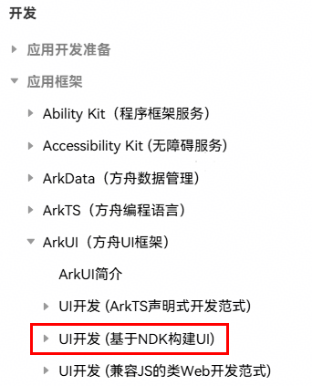

#### 自动化测试框架指南优化结构
优化前文档中，自动化测试框架的内容在同一个页面承载信息庞杂。为了提升开发者体验，便于检索，将指南分为三篇：
- [单元测试框架使用指导](https://developer.huawei.com/consumer/cn/doc/harmonyos-guides/unittest-guidelines)：作为自动化测试框架基础底座，本页面介绍单元测试框架的主要功能和开发步骤，并在原有文档基础上，补充了框架能力介绍及对应示例。
- [UI测试框架使用指导](https://developer.huawei.com/consumer/cn/doc/harmonyos-guides/uitest-guidelines)：提供UI测试框架功能全景及UI界面查找和模拟操作指导，包括界面控件精准查找、UI交互操作、外设行为模拟（如键盘输入等）等。
- [白盒性能测试框架使用指导](https://developer.huawei.com/consumer/cn/doc/harmonyos-guides/perftest-guideline)：提供对指定代码段运行时进行白盒性能测试指导，包括耗时等基础数据和启动时延等场景化性能数据的采集和度量。

#### 2025年10月14日
#### 录屏指南优化结构
优化前文档中，所有的能力均在同一个顺序列表里以步骤承载阅读体验不佳。为了提升开发者的使用体验，将录屏指南分为三篇：
- [基础流程](https://developer.huawei.com/consumer/cn/doc/harmonyos-guides/avscreencapture-c-basic-process)：介绍AVScreenCapture实例创建、音视频参数配置、回调设置、开始与停止、结果处理、资源释放等必备基础步骤。
- [自定义场景](https://developer.huawei.com/consumer/cn/doc/harmonyos-guides/avscreencapture-c-custom-scenarios)：根据视频录制、直播等特定场景进行更高级的设置，如录屏策略、旋转适配、隐私设置等。
- [常见问题](https://developer.huawei.com/consumer/cn/doc/harmonyos-guides/avscreencapture-faqs)：将持续收集开发者在使用过程中的常见问题，帮助更多的开发者自助定位、解决问题。
帮助开发者按照入门-进阶-问题解决的逻辑使用开发文档。同时，本次更新将页面内的每个功能点分小节展示，更直观地呈现系统的录屏能力，提高检索效率，便于使用。

#### 2025年9月30日
#### ArkWeb新增文档
- [获取网页内容高度](https://developer.huawei.com/consumer/cn/doc/harmonyos-guides/web-getpage-height)：通过调用[getPageHeight](https://developer.huawei.com/consumer/cn/doc/harmonyos-references/arkts-apis-webview-webviewcontroller#getpageheight)获取当前网页内容的实际高度，开发者可以根据具体需求选择合适的方法。
- [使用Web组件保存前端页面为PDF](https://developer.huawei.com/consumer/cn/doc/harmonyos-guides/web-createpdf)：提供了保存前端页面为PDF的功能，用户可以将前端页面内容保存为PDF以便分享或保存。
- [使用Web组件的智能分词能力](https://developer.huawei.com/consumer/cn/doc/harmonyos-guides/web-data-detector)：提供了H5页面内的文本分词识别功能，支持文本分词高亮、分词长按预览及文本选择菜单扩展等。

#### 2025年9月8日
#### 应用程序包新增场景指导
新增[HAP转HAR开发指导](https://developer.huawei.com/consumer/cn/doc/harmonyos-guides/hap-to-har)，HAP不支持导出接口或ArkUI组件给其他模块或应用使用，HAR支持，本页面为开发者提供该场景下通过配置项变更将HAP工程变成HAR工程的指导。

#### 2025年8月21日
#### 窗口管理新增文档
- 窗口管理新增[窗口开发术语](https://developer.huawei.com/consumer/cn/doc/harmonyos-guides/window-terminology)页面，帮助开发者更好理解窗口开发中的相关概念。
- 窗口管理补充主窗口的生命周期内容，包括生命周期状态及变化监听等，具体可见[主窗口的生命周期](https://developer.huawei.com/consumer/cn/doc/harmonyos-guides/window-overview#主窗口的生命周期)。
- 新增支持闪控球能力，提供[全局闪控球开发指导](https://developer.huawei.com/consumer/cn/doc/harmonyos-guides/floatingball-guide)，为应用提供临时的全局能力，完成跨应用交互。

#### 文本开发新增场景指导
- 新增BREAK_HYPHEN断词策略与local属性配合使用的场景示例及效果示意，具体可见[多行文本绘制与显示（ArkTS）](https://developer.huawei.com/consumer/cn/doc/harmonyos-guides/complex-text-arkts#多行文本绘制与显示)、[多行文本绘制与显示（C/C++）](https://developer.huawei.com/consumer/cn/doc/harmonyos-guides/complex-text-c#多行文本绘制与显示)。
- 新增自动间距、垂直对齐、上下标、高对比度等多样式文本绘制与显示的场景示例及效果示意，具体可见[多样式文本绘制与显示（ArkTS）](https://developer.huawei.com/consumer/cn/doc/harmonyos-guides/complex-text-arkts#多样式文本绘制与显示)、[多样式文本绘制与显示（C/C++）](https://developer.huawei.com/consumer/cn/doc/harmonyos-guides/complex-text-c#多样式文本绘制与显示)。
- 新增支持拷贝文本样式、段落样式、阴影样式，以便快速复制相关样式作用到不同文字上，具体可见[样式的拷贝、绘制与显示（C/C++）](https://developer.huawei.com/consumer/cn/doc/harmonyos-guides/complex-text-c#样式的拷贝绘制与显示)。

#### 2025年7月9日
#### 新增文档
**ArkWeb**
Longque JS Engine 提供了一批[Longque JS API指导指南](https://developer.huawei.com/consumer/cn/doc/harmonyos-guides/use-longque-js-api)，旨在HarmonyOS 平台构建稳定、高性能的应用。

#### 2025年7月2日
#### 优化了Node-API常见问题汇总指南
新增了[Node-API常见问题汇总](https://developer.huawei.com/consumer/cn/doc/harmonyos-guides/napi-questions)，方便开发者快速获取相关指导。

#### 新增并发常见问题指导文档
为了帮助开发者快速定位并解决在使用TaskPool、Worker及Sendable特性时遇到的各类问题，新增[并发常见问题指导文档](https://developer.huawei.com/consumer/cn/doc/harmonyos-guides/concurrency-faq)。
主要包括TaskPool任务不执行快速定位指导、TaskPool任务执行慢排查思路指导、TaskPool序列化失败定位指导、使用Sendable特性抛JS异常排查指导以及一些开发者咨询的高频问题及解决方案。
此指导文档也将持续不断完善并补充，助力开发者快速定位解决问题。

#### 2025年6月24日
#### 一次开发，多端部署文档路径调整
- [变更前路径](https://developer.huawei.com/consumer/cn/doc/harmonyos-guides/multi-device-overview-path-change)：“指南”-“开发”-“一次开发，多端部署”
- [变更后路径](https://developer.huawei.com/consumer/cn/doc/best-practices/bpta-multi-device-overview)：“最佳实践”-“多设备开发”-“一次开发，多端部署”

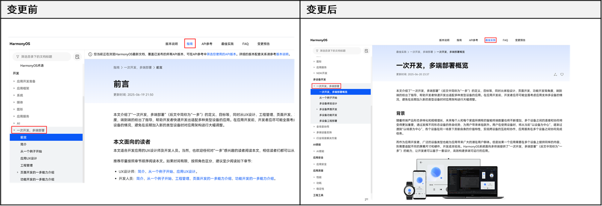

#### 2025年6月20日
#### API参考文档架构优化（试点）
在优化前的API参考文档中，一个功能模块中不同类型的元素（如函数、类、枚举、类型等）均在一个页面承载。为了提升开发者的使用体验，我们选取了几个API参考页面开展优化试点，将一个功能模块按照元素类型细分为多个子页面进行展示。
本次API参考文档架构优化对于开发者体验提升具有双重价值：一方面，通过分类展示机制能够更直观地呈现接口所属的类型，提升检索效率，便于开发者使用；另一方面，分页策略能够改善单一页面规模过大导致的阅读体验问题，包括页面加载延迟、浏览器渲染卡顿以及搜索定位不精准等。
API参考文档架构试点优化的范围如下：
- [Web组件](https://developer.huawei.com/consumer/cn/doc/harmonyos-references/ts-basic-components-web)
- [@ohos.web.webview (Webview)](https://developer.huawei.com/consumer/cn/doc/harmonyos-references/js-apis-webview)
- [@ohos.data.relationalStore (关系型数据库)](https://developer.huawei.com/consumer/cn/doc/harmonyos-references/js-apis-data-relationalstore)
- [@ohos.window (窗口)](https://developer.huawei.com/consumer/cn/doc/harmonyos-references/js-apis-window)
- [@ohos.multimedia.audio (音频管理)](https://developer.huawei.com/consumer/cn/doc/harmonyos-references/js-apis-audio)
- [@ohos.multimedia.camera (相机管理)](https://developer.huawei.com/consumer/cn/doc/harmonyos-references/js-apis-camera)
- [@ohos.multimedia.media (媒体服务)](https://developer.huawei.com/consumer/cn/doc/harmonyos-references/js-apis-media)
- [@arkts.utils (ArkTS工具库)](https://developer.huawei.com/consumer/cn/doc/harmonyos-references/js-apis-arkts-utils)

#### 新增HarmonyOS SDK API变更查询
为便于快速获取API变更范围，官网文档新增[HarmonyOS SDK API变更查询](https://developer.huawei.com/consumer/cn/apichangelog/)能力：
- 支持基于应用框架、系统、媒体、图形、应用服务、AI六大领域及Kit能力维度，变更类型维度、版本路径等维度进行筛选，查询API变更。
- 支持搜索接口名称，查询API变更。
- 支持单击接口名称，一键跳转API参考文档详情。 HarmonyOS SDK API变更查询功能为Beta体验特性，不同版本路径的变更信息持续上线中。 图4 API变更查询

#### 新增文档代码解读功能
为提升代码易理解性，官网上线文档示例代码AI“代码解读”功能，介绍代码核心知识点、代码逻辑。
使用HarmonyOS开发者官网账号登录网站，在示例代码区域单击“代码解读”即可召出。

> [!NOTE] 说明
> “代码解读”功能为Beta体验特性。

**图5 **代码解读

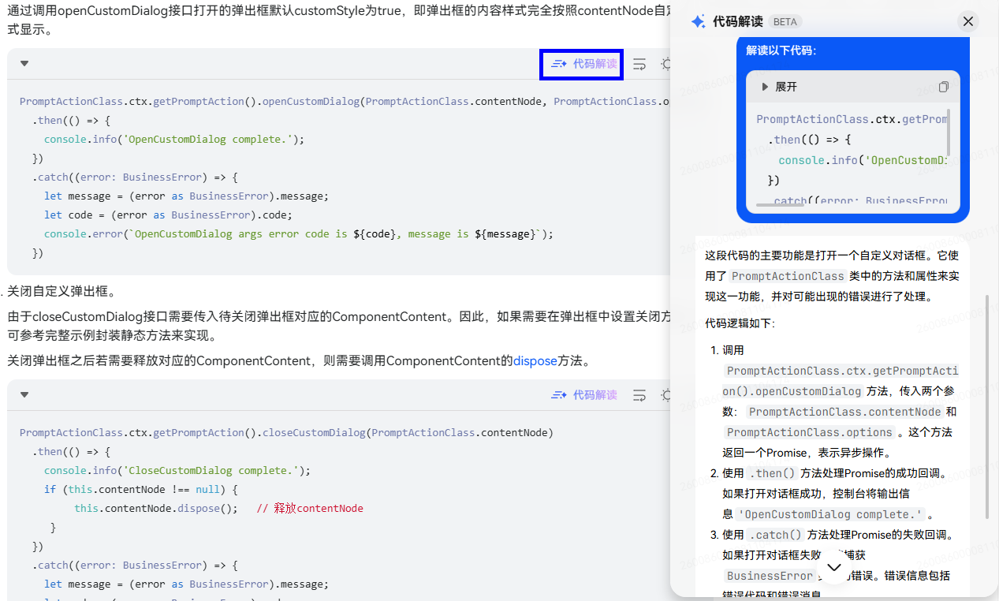

#### 新增示例代码自动换行功能
官网上线文档示例代码“自动换行”功能，提升的示例代码阅读体验，避免由于示例代码或注释过长显示不全的问题。
**图6 **示例代码自动换行

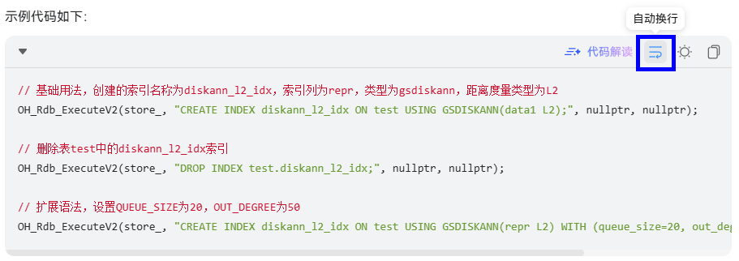

#### 2025年6月11日
#### API参考支持按设备品类筛选
为便于快速查看不同设备品类适用的API范围，API参考新增支持按设备品类筛选能力：

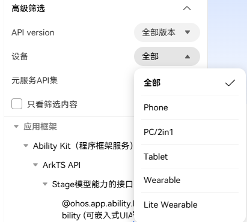
同时，每个接口下也会显示其支持的设备（默认开启，可一键隐藏）：

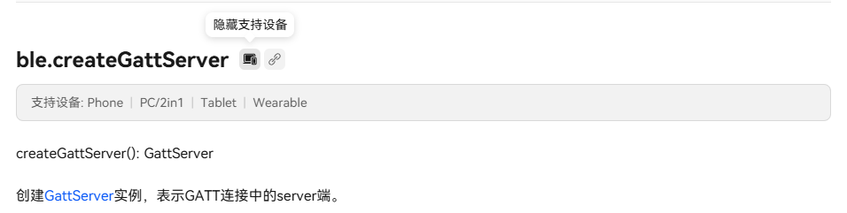

#### 版本说明新增信息
- 在“[所有HarmonyOS版本](https://developer.huawei.com/consumer/cn/doc/harmonyos-releases/overview-allversion)”中新增版本定位和新开发应用、升级应用的使用建议。
- 新增“[各版本支持设备型号清单](https://developer.huawei.com/consumer/cn/doc/harmonyos-releases/support-device)”，提供各版本开发者可使用的设备型号说明。部分版本或设备型号并非公开可获取，详见清单说明。
- 新增“[应用兼容性说明](https://developer.huawei.com/consumer/cn/doc/harmonyos-releases/app-compatibility)”，详细解释了应用工程中配置的SDK版本相关字段的含义、用法，以及这些字段对于应用在不同系统版本运行时的兼容性影响。同时，在各版本的版本概述章节，给出该版本的SDK版本相关字段配置建议，例如[5.0.5(17)版本的应用工程版本信息配置建议](https://developer.huawei.com/consumer/cn/doc/harmonyos-releases/overview-505-release#section89454563569)。

#### 2025年4月20日
#### 新增文档
**Media Kit**
[创建异步线程执行AVTranscoder视频转码](https://developer.huawei.com/consumer/cn/doc/harmonyos-guides/avtranscoder-practice)：添加视频转码的开发实践，简要介绍了视频码率和分辨率的关系，帮助开发者选择合适的码率、分辨率，并提供了使用异步线程转码的开发指导。

#### 2025年4月17日
#### 学习ArkTS语言章节目录结构调整
将[UI范式基本语法](https://developer.huawei.com/consumer/cn/doc/harmonyos-guides/arkts-ui-paradigm-basic-syntax)、[状态管理](https://developer.huawei.com/consumer/cn/doc/harmonyos-guides/arkts-state-management)、[渲染控制](https://developer.huawei.com/consumer/cn/doc/harmonyos-guides/arkts-rendering-control)节点从“入门”-“学习ArkTS语言”移至“开发”-“应用框架”-“ArkUI（方舟UI框架）”-“UI开发 (ArkTS声明式开发范式)”目录下，调整后目录结构更符合UI开发框架学习历程。
**变更影响：**
目录结构调整不影响原页面URL链接地址，原地址可正常访问。
**图7 **学习ArkTS语言章节目录结构变更对比

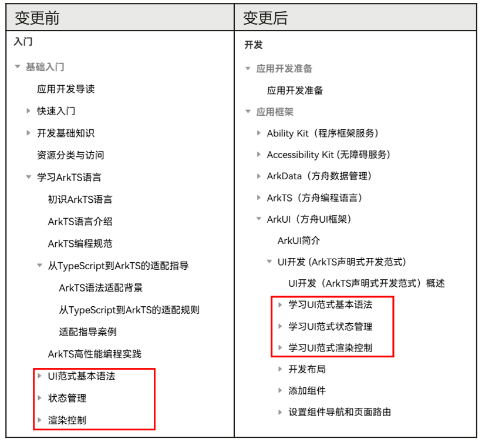

#### 2025年3月31日
#### 新增文档
**ArkGraphics 2D**
针对文本开发，新增提供了[字体管理](https://developer.huawei.com/consumer/cn/doc/harmonyos-guides/font-manager)、[文本测量](https://developer.huawei.com/consumer/cn/doc/harmonyos-guides/text-measure)、[文本绘制与显示](https://developer.huawei.com/consumer/cn/doc/harmonyos-guides/draw-text-display)三个章节内容，各章节按实现语言分为ArkTS和C/C++对应的具体指导内容。此次指南优化上新了约15个页面，进一步丰富完善了应用在开发和布局时，针对文本元素或内容进行的排版、测量、绘制和显示等场景。
- [字体管理](https://developer.huawei.com/consumer/cn/doc/harmonyos-guides/font-manager)：文本的绘制显示离不开字体的使用和管理，当前支持对各种字体资源的注册和使用。主要包括主题字体、自定义字体、系统字体。
- [文本测量](https://developer.huawei.com/consumer/cn/doc/harmonyos-guides/text-measure)：文本的绘制显示，除了依赖字体，也需要对文本进行准确的测量，便于对内容进行恰当的布局。当前支持对各种复杂样式文本进行测量，开发者可以通过相关接口获取文本的各种度量信息，比如：文本段落的长度、高度、行数、是否截断，每行文本的高度、宽度、文字个数等。
- [文本绘制与显示](https://developer.huawei.com/consumer/cn/doc/harmonyos-guides/draw-text-display)：支持按照指定起始坐标或路径的方式进行文本绘制。在进行文本绘制时，可以通过选择合适的字体、大小和颜色完成简单文本的绘制与显示；此外，还可以通过设置其他丰富的样式（装饰线、阴影等）、语言、段落等进行复杂文本的绘制与显示。

#### 2025年3月25日
#### 搜索体验变更预告
为解决官网全站搜索场景下搜索结果重复项多的问题（即存在多个版本相同内容搜索结果），开发者联盟官网优化搜索机制。从4月下旬起，将不再支持已归档版本的全站搜索。
**变更前**：全站搜索提供多个版本搜索筛选项。
**图8 **官网搜索版本筛选

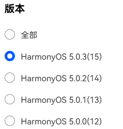
**变更后：**
- 全站搜索版本筛选仅提供[HarmonyOS 5.0.3(15)](https://developer.huawei.com/consumer/cn/doc/harmonyos-releases/503)合一版本筛选项，不再提供[HarmonyOS 5.0.2(14)](https://developer.huawei.com/consumer/cn/doc/harmonyos-releases/overview-502-release)、 [HarmonyOS 5.0.1(13)](https://developer.huawei.com/consumer/cn/doc/harmonyos-releases/overview-501)、[HarmonyOS 5.0.0(12)](https://developer.huawei.com/consumer/cn/doc/harmonyos-releases/overview-500)已归档版本选项。
- 已归档历史版本文档支持使用文档包内搜索，详细请参考[文档包内搜索体验增强](#section1126113229341)。

#### 2025年3月12日
#### 获取体验增强
**新增通过API version筛选获取支持接口范围**
[HarmonyOS 5.0.3(15)版本](https://developer.huawei.com/consumer/cn/doc/harmonyos-references/development-intro-api)API参考文档提供API version筛选功能，开发者可便捷获取某个API version支持的接口范围。
1. 打开API参考文档，在左侧导航栏“高级筛选”下拉选项中设置“API version”版本号。 图9 “API version”筛选
2. 设置目标API version后，默认显示支持的API范围，不支持的接口在导航栏中置灰。 图10 导航栏筛选后效果
3. 选择“只看筛选内容”，导航中不支持接口将被隐藏。 图11 只看筛选内容效果
**官网文档默认版本变更****为“HarmonyOS 5.0.3(15)”**
官网文档默认版本近期将由“HarmonyOS 5.0.0(12)”变更为“HarmonyOS 5.0.3(15)”。
**变更前**：以下任意入口进入文档页面，默认打开“HarmonyOS 5.0.0(12)”版本配套文档。
- 入口1：官网 ->开发->开发文档 图12 开发文档入口
- 入口2：官网->文档->文档中心 图13 文档中心入口
**变更后**：以上任意入口进入文档页面，默认打开“HarmonyOS 5.0.3(15)”版本配套文档

#### 文档维护策略变更
HarmonyOS 5.0.2(14)、 HarmonyOS 5.0.1(13)、HarmonyOS 5.0.0(12)分支官网文档版本统一收编至[HarmonyOS 5.0.3(15)版本](https://developer.huawei.com/consumer/cn/doc/harmonyos-releases/503)，历史版本文档停止更新。
后续新增版本在HarmonyOS 5.0.3(15)文档目录上前向演进。
**变更原因**：
HarmonyOS文档针对不同API version(如API 12/API 13/API 14等)提供多个文档分支，带来搜索结果重复项多等问题。
自API 15版本起HarmonyOS开发者文档官网版本合一，参考业界仅提供一套文档同时配套不同API version。

> [!NOTE] 说明
> 通过API version筛选支持接口范围可便捷了解不同API version支持接口范围，请参考获取体验增强。

**变更影响**：
推荐使用HarmonyOS 5.0.3(15)版本开发者文档。
- 历史版本文档仍可查询，新增优化文档不回合历史版本文档（历史版本文档停止更新）。
- API 15及之后版本不再新增文档分支，一个目录向前演进。

#### 2025年1月24日
#### 新增文档
**ArkGraphics 2D**
围绕实际图形的绘制与显示流程，新增提供了[画布的获取与绘制结果的显示](https://developer.huawei.com/consumer/cn/doc/harmonyos-guides/canvas-get-result-draw)、[画布操作及状态](https://developer.huawei.com/consumer/cn/doc/harmonyos-guides/canvas-operation-state)、[绘制效果](https://developer.huawei.com/consumer/cn/doc/harmonyos-guides/drawing-effect)、[图元绘制](https://developer.huawei.com/consumer/cn/doc/harmonyos-guides/primitive-drawing)四个章节内容，各章节内容下按实现语言分为ArkTS和C/C++对应的具体指导内容。
[画布的获取与绘制结果的显示](https://developer.huawei.com/consumer/cn/doc/harmonyos-guides/canvas-get-result-draw)：介绍图形绘制中画布的获取与显示。画布为图形绘制的核心，所有绘制操作都是基于画布Canvas实现的。
[画布操作及状态](https://developer.huawei.com/consumer/cn/doc/harmonyos-guides/canvas-operation-state)：介绍获取得到画布Canvas之后，可以基于画布进行的图形操作和状态处理。
[绘制效果](https://developer.huawei.com/consumer/cn/doc/harmonyos-guides/drawing-effect)：介绍基于画布，使用画刷（Brush）或画笔（Pen）添加的绘制效果。其中画刷主要用于实现填充效果；画笔主要用于实现描边效果。
[图元绘制](https://developer.huawei.com/consumer/cn/doc/harmonyos-guides/primitive-drawing)：无论多复杂的图形，都是由基础的图元组合而来。介绍了当前支持绘制的基础图元，包括几何形状绘制（点、圆、矩形等）、图片绘制和字块绘制。
[图形开发术语](https://developer.huawei.com/consumer/cn/doc/harmonyos-guides/graphic-term)：介绍图形开发过程中的术语概念。

#### 2025年1月16日
#### 新增文档
**Game Service Kit**
[游戏场景感知](https://developer.huawei.com/consumer/cn/doc/harmonyos-guides/gameservice-gameperformance-access-procedure-c)：提供了游戏场景感知的C/C++开发指导，帮助开发者快速实现游戏与系统的交互，在系统资源有限的情况下进一步改善玩家的游戏体验。
**IAP Kit**
[非续期订阅类型商品的购买](https://developer.huawei.com/consumer/cn/doc/harmonyos-guides/iap-nonrenewable)：提供了非续期订阅类型商品的[接入购买](https://developer.huawei.com/consumer/cn/doc/harmonyos-guides/iap-integrate-nonrenewable)和[权益发放](https://developer.huawei.com/consumer/cn/doc/harmonyos-guides/iap-delivering-nonrenewable)开发指导，助力应用实现非续期订阅商品的购买。
**Payment Kit**
[通用收银台接入](https://developer.huawei.com/consumer/cn/doc/harmonyos-guides/payment-common-pay-connect)：介绍了Payment Kit通用收银台[业务规则](https://developer.huawei.com/consumer/cn/doc/harmonyos-guides/payment-common-pay-introduction)、[混合支付场景](https://developer.huawei.com/consumer/cn/doc/harmonyos-guides/payment-common-pay-mix)、[纯外部支付场景](https://developer.huawei.com/consumer/cn/doc/harmonyos-guides/payment-common-pay-external)，助力应用实现混合支付、纯外部支付模式。
**Scenario Fusion Kit**
- [文件路径转换API](https://developer.huawei.com/consumer/cn/doc/harmonyos-guides/scenario-fusion-api-path-conversion)：介绍了如何将源文件路径转换为目标文件路径。
- [权限设置Button](https://developer.huawei.com/consumer/cn/doc/harmonyos-guides/scenario-fusion-button-permissiononsetting)：介绍如何使用权限设置Button，实现二次拉起权限设置弹框。
**Store Kit**
[应用内快捷方式加桌](https://developer.huawei.com/consumer/cn/doc/harmonyos-guides/appgallery-productview-addshortcut)：介绍了在应用市场推荐场景下，如何实现应用内快捷方式加桌。

#### 2024年12月6日
#### 新增文档
**ArkTS**
[模块加载副作用及优化](https://developer.huawei.com/consumer/cn/doc/harmonyos-guides/arkts-module-side-effects?catalogVersion=V13)：介绍当使用ArkTS模块化时，模块的加载和执行可能会产生非预期的顶层代码执行、全局状态变化、原型链修改、导入内容未定义等副作用，并介绍如何优化，减少副作用对应用的影响。

#### 2024年11月30日
#### 新增文档
**Share Kit**
- [宿主应用接入模式](https://developer.huawei.com/consumer/cn/doc/harmonyos-guides/share-access-mode)：介绍宿主应用接入模式（全接模式、半接模式）对应的接入方式、适用应用类型等，并提供了两种接入模式的开发指导。
- [手机应用发起碰一碰分享](https://developer.huawei.com/consumer/cn/doc/harmonyos-guides/knock-share)：介绍手机应用发起碰一碰分享的处理机制、环境要求、业务流程、推荐使用的分享卡片模板，并提供了分享App Linking直达应用开发指导。
**XEngine Kit**
[时域AI超分](https://developer.huawei.com/consumer/cn/doc/harmonyos-guides/xengine-kit-ai-temporal-upscaling)：介绍时域AI超分的使用场景、业务流程和接入步骤，助力开发者实现超采样率和超分辨率并达到抗锯齿效果。

#### 2024年11月15日
#### 新增文档
**NDK**
- [Native与Sendable ArkTS对象绑定](https://developer.huawei.com/consumer/cn/doc/harmonyos-guides-V5/use-sendable-napi-V5)：为开发者介绍如何通过napi_wrap_sendable的接口将sendable ArkTS对象与Native的C++对象绑定，后续操作时再通过napi_unwrap_sendable将ArkTS对象绑定的C++对象取出，并对其进行操作的使用。

#### 2024年11月12日
#### 新增文档
**Payment Kit**
[数字人民币支付场景](https://developer.huawei.com/consumer/cn/doc/harmonyos-guides/payment-digital-cny-pay)：介绍如何接入数字人民币支付服务，快速实现应用的数字人民币支付。
**Remote Communication Kit**
[URPC场景](https://developer.huawei.com/consumer/cn/doc/harmonyos-guides/remote-communication-urpccall)：介绍在URPC场景下如何实现远程函数调用**。**
**NearLink Kit**
从[NearLink Kit简介](https://developer.huawei.com/consumer/cn/doc/harmonyos-guides/nearlink-introduction)、[查询星闪开关状态](https://developer.huawei.com/consumer/cn/doc/harmonyos-guides/nearlink-getstate)、[发送星闪广播](https://developer.huawei.com/consumer/cn/doc/harmonyos-guides/nearlink-send-advertising)、[发起星闪扫描](https://developer.huawei.com/consumer/cn/doc/harmonyos-guides/nearlink-start-scan)、[SSAP连接及数据传输](https://developer.huawei.com/consumer/cn/doc/harmonyos-guides/nearlink-ssap-server-connect)，全面介绍如何实现星闪设备之间的连接、数据交互。

#### 优化文档
**IAP Kit**
- [IAP Kit接入规范](https://developer.huawei.com/consumer/cn/doc/harmonyos-guides/iap-access-specifications)：介绍应用接入IAP Kit的界面设计规范和接入限制，助力开发者提升应用上架效率，也确保用户获得良好的支付体验。
- [使用入门](https://developer.huawei.com/consumer/cn/doc/harmonyos-guides/iap-dev-guide)：提供了快速上手的Codelab体验、开发流程和示例代码，助力开发者快速实现应用的接入。
- [收益分析和报告](https://developer.huawei.com/consumer/cn/doc/harmonyos-guides/iap-data-analysis)：介绍应用销售数字商品（虚拟商品）后，如何自助结算、查看和下载支付报表等。
- [消耗型/非消耗型商品购买](https://developer.huawei.com/consumer/cn/doc/harmonyos-guides/iap-integrate-purchase)：优化了接入流程步骤，将业务流程划分为展示商品、购买及结果确认、发放权益，更清晰直观地展示接入流程。
- [自动续期订阅商品购买](https://developer.huawei.com/consumer/cn/doc/harmonyos-guides/iap-subscription-functions)：优化了接入流程步骤，将业务流程划分为展示商品、检查权益发放状态、购买及结果确认、发放权益，更清晰直观地展示接入流程。

#### 2024年11月5日
#### 优化文档
**Audio**** Kit**
- [使用合适的音频流类型](https://developer.huawei.com/consumer/cn/doc/harmonyos-guides/using-right-streamusage-and-sourcetype)：介绍常用的音频流类型及其适用场景，说明不同流类型对音频业务的影响。同时，指导开发者在实际开发时应当如何设置音频流类型。
- [音频焦点和音频会话](https://developer.huawei.com/consumer/cn/doc/harmonyos-guides/audio-playback-concurrency)：介绍系统的音频焦点策略，以及应用如何申请、释放音频焦点，以及应对焦点变化的方法，帮助开发者妥善地管理音频焦点，提升用户的音频体验。

#### 删除文档
**NDK**
在非ArkTS线程中回调ArkTS接口：不推荐使用uv_queue_work接口来实现“非JS线程向JS线程提交任务”的功能，否则存在冗余的线程创建。推荐[使用Node-API接口进行线程安全开发](https://developer.huawei.com/consumer/cn/doc/harmonyos-guides/use-napi-thread-safety)文章中“从任意线程往JS线程提交任务”的实现方法。uv_queue_work的使用建议，请参考[libuv指导文档](https://developer.huawei.com/consumer/cn/doc/harmonyos-references/libuv)。

#### 2024年10月29日
#### 新增文档
**ArkUI**
- [Stage模型下ArkUI全局接口开发指导](https://developer.huawei.com/consumer/cn/doc/harmonyos-guides-V5/arkts-global-interface-V5)：介绍在Stage模型下，如何获取当前组件所在的[UIContext](https://developer.huawei.com/consumer/cn/doc/harmonyos-references-V5/js-apis-arkui-uicontext-V5#uicontext)，并使用UIContext中对应的接口获取与实例绑定的对象。解决FA模型下开放的ArkUI全局接口，在调用时无法明确运行在哪个实例里，语义不明确的问题。
**ArkWeb**
- [Web渲染模式](https://developer.huawei.com/consumer/cn/doc/harmonyos-guides-V5/web-render-mode-V5)：介绍异步渲染模式和同步渲染模式的适用场景和相关规格约束。
- [使用Web组件大小自适应页面内容布局](https://developer.huawei.com/consumer/cn/doc/harmonyos-guides-V5/web-fit-content-V5)：介绍如何使用Web组件大小自适应页面内容的布局模式，使Web组件的大小根据页面内容自适应变化。适用于Web组件需要根据网页高度撑开，与其他原生组件一起滚动的场景。
**ArkTS**
- [Buffer](https://developer.huawei.com/consumer/cn/doc/harmonyos-guides-V5/buffer-V5)：提供二进制Buffer的指导，说明了Buffer的核心功能和主要应用场景。
- [Sendable对象](https://developer.huawei.com/consumer/cn/doc/harmonyos-guides-V5/arkts-sendable-V5)：ArkTS针对支持并发实例间引用传递的Sendable对象、共享容器、异步锁、Buffer、ASON等的使用提供了具体的原理规则和开发指导。
- [线程间通信场景](https://developer.huawei.com/consumer/cn/doc/harmonyos-guides-V5/interthead-communication-guide-V5)：补充介绍线程间通信的典型场景，包括使用TaskPool执行独立的耗时任务、使用TaskPool执行多个耗时任务、TaskPool任务与主线程通信、Worker和主线程的即时通信、Worker同步调用主线程接口等。
- [应用多线程开发实践案例](https://developer.huawei.com/consumer/cn/doc/harmonyos-guides-V5/multithread-develop-case-V5)：介绍应用多线程开发过程中遇到的常见场景，提供了对应的实践案例指导。
- [ArkTS运行时](https://developer.huawei.com/consumer/cn/doc/harmonyos-guides-V5/arkts-runtime-overview-V5)：介绍ArkTS运行时的主要组成模块和相关能力，针对GC垃圾回收和ArkTS模块化展开了具体介绍，便于开发者高效进行开发。
- [ArkTS编译工具链](https://developer.huawei.com/consumer/cn/doc/harmonyos-guides-V5/arkts-compilation-tool-chain-V5)：介绍ArkTS编译的基本阶段和实现流程，介绍方舟字节码的基础原理，同时提供了源码混淆、反汇编等工具的使用说明，以确保开发者了解语言编译运行过程中不同阶段、不同模块的重点作用和实现能力，便于开发者在编译运行相关期间更好地进行自定义修改或优化。
**Camera Kit**
- [相机基础动效](https://developer.huawei.com/consumer/cn/doc/harmonyos-guides-V5/camera-animation-V5)：介绍如何使用预览流截图，并通过ArkUI提供的显示动画能力实现模式切换、前后置切换、拍照闪黑三种核心场景动效。
- 使用相机预配置：提供了相机预配置的[ArkTS](https://developer.huawei.com/consumer/cn/doc/harmonyos-guides-V5/camera-preconfig-V5)、[C/C++](https://developer.huawei.com/consumer/cn/doc/harmonyos-guides-V5/camera-preconfig-native-V5)开发指导，相机预配置功能对常用的场景和分辨率进行了预配置集成，可简化开发相机应用流程，提高应用的开发效率。
- [HDR拍照](https://developer.huawei.com/consumer/cn/doc/harmonyos-guides-V5/camera-hdr-shooting-V5)：提供完整的HDR拍照开发步骤及示例，方便开发者实现HDR拍照的功能。
- [HDR录像](https://developer.huawei.com/consumer/cn/doc/harmonyos-guides-V5/camera-hdr-recording-V5)：提供完整的HDR录像开发步骤及示例，方便开发者实现HDR录像的功能。
**Share Kit**
- [手机应用发起华为分享](https://developer.huawei.com/consumer/cn/doc/harmonyos-guides-V5/share-mobilephone-harmony-share-V5)：介绍手机应用如何通过一碰发起跨端分享。
- [共享联系人信息到分享推荐区](https://developer.huawei.com/consumer/cn/doc/harmonyos-guides-V5/share-intents-share-V5)：介绍目标应用如何通过Intents Kit将联系人信息共享到分享推荐区。

#### 2024年10月25日
#### 删除文档
**Scenario Fusion Kit**
由于实时验证手机号Button开放策略变更，指南中删除了实时验证手机号Button相关内容。

#### 2024年10月22日
#### 版本号变化
HarmonyOS NEXT Release更名为HarmonyOS 5.0.0 Release。HarmonyOS 5.0.0 Release继承自HarmonyOS NEXT Release，隶属于HarmonyOS NEXT，标志着HarmonyOS NEXT经过概念阶段、开发者体验阶段、消费者体验阶段的打磨后，正式面向消费者发布。
详情请参见[HarmonyOS 5.0.0 Release版本概览](https://developer.huawei.com/consumer/cn/doc/harmonyos-releases-V5/overview-V5)。

#### 新增文档
**Camera Kit**
- 动态调整预览帧率：提供了[ArkTS](https://developer.huawei.com/consumer/cn/doc/harmonyos-guides-V5/camera-framerate-V5)、[C/C++](https://developer.huawei.com/consumer/cn/doc/harmonyos-guides-V5/camera-setframerate-native-V5)开发指导，介绍在直播、视频等场景下如何动态调整预览帧率，保证预览效果。

#### 2024年10月14日
#### 新增文档
**Ability Kit**
- 典型场景的开发指导：[配置分层图标](https://developer.huawei.com/consumer/cn/doc/harmonyos-guides-V5/layered-image-V5)。
**Camera Kit**
- [适配不同折叠状态的摄像头变更](https://developer.huawei.com/consumer/cn/doc/harmonyos-guides-V5/camera-foldable-display-V5)：介绍在设备折叠状态变更时，如何获取状态变化并切换到当前状态可用摄像头，保证拍摄的用户体验。
- [适配相机旋转角度](https://developer.huawei.com/consumer/cn/doc/harmonyos-guides-V5/camera-rotation-angle-adaptation-V5)：介绍屏幕处于不同状态时，图像如何适配以确保图像在合适的方向显示。
- [使用安全相机](https://developer.huawei.com/consumer/cn/doc/harmonyos-guides-V5/camera-secure-photo-V5)：介绍通过安全相机获取安全设备序列号的方式，与[Device Security Kit](https://developer.huawei.com/consumer/cn/doc/harmonyos-guides-V5/devicesecurity-taas-securecamera-V5)配合使用，可完成对安全摄像头捕捉到的图像数据进行签名，确保图像数据的真实性和完整性。
- [通过系统相机拍照和摄像](https://developer.huawei.com/consumer/cn/doc/harmonyos-guides-V5/camera-picker-V5)：介绍通过CameraPicker拉起系统相机完成拍摄照片或录制视频的方式，此方式由用户主动确认，无需申请相机权限，可轻松获取即时拍摄的照片或者视频。
**Media Kit**
- [视频缩放](https://developer.huawei.com/consumer/cn/doc/harmonyos-guides-V5/generate-super-resolution-video-V5)：介绍如何完成视频细节增强，可实现视频流图像内容的清晰度增强及缩放。
- [视频动态元数据生成](https://developer.huawei.com/consumer/cn/doc/harmonyos-guides-V5/generate-video-dynamic-metadata-V5)：介绍如何实现HDRVivid标准动态元数据生成。
- [视频色彩空间转换](https://developer.huawei.com/consumer/cn/doc/harmonyos-guides-V5/video-csc-V5)：介绍如何实现HDR2SDR、HDR2HDR、SDR2SDR的色彩空间转换。
**ArkUI**
[不依赖UI组件的全局自定义弹窗](https://developer.huawei.com/consumer/cn/doc/harmonyos-guides-V5/arkts-uicontext-custom-dialog-V5)：介绍如何使用UIContext中获取到的PromptAction对象提供的[openCustomDialog](https://developer.huawei.com/consumer/cn/doc/harmonyos-references-V5/js-apis-arkui-uicontext-V5#opencustomdialog12)接口来实现自定义弹窗。

#### 2024年9月30日
#### 删除文档
**Account Kit**
由于获取实名信息、实名信息校验、人脸核身、实时验证手机号能力策略变更，指南中删除了Account Kit获取实名信息、实名信息校验、人脸核身、实时验证手机号相关内容。

#### 2024年9月27日
#### 优化文档
[获取支持与帮助](https://developer.huawei.com/consumer/cn/doc/harmonyos-releases-V13/support-V13)：详细介绍官方面向公共开发者提供的支持与帮助渠道、官网文档“意见反馈”功能。

#### 2024年9月18日
#### 优化文档
**Ability Kit**
- [拉起指定类型的应用](https://developer.huawei.com/consumer/cn/doc/harmonyos-guides-V5/start-intent-panel-V5)：优化章节结构。按照被拉起的应用类型，拆分为独立节点。
- [拉起系统应用](https://developer.huawei.com/consumer/cn/doc/harmonyos-guides-V5/system-app-startup-V5)：优化文档结构。简要介绍跳转系统应用的方式，并提供了不同系统应用支持的跳转能力的清单。
**ArkUI**
- [开发应用沉浸式效果](https://developer.huawei.com/consumer/cn/doc/harmonyos-guides-V5/arkts-develop-apply-immersive-effects-V5)：优化补充文档，提供窗口全屏显示且不隐藏避让区的方式下，如何通过注册监听函数、动态获取避让区、避让状态栏和导航条，最终避免UI元素重叠，实现沉浸式效果的开发过程和示例。
- [自定义渲染 (XComponent)](https://developer.huawei.com/consumer/cn/doc/harmonyos-guides-V5/napi-xcomponent-guidelines-V5)：优化文档结构，从适用场景出发，分别介绍Native XComponent和ArkTS XComponent的使用方法，并提供相关生命周期的说明。
- [共享元素转场 (一镜到底)](https://developer.huawei.com/consumer/cn/doc/harmonyos-guides-V5/arkts-shared-element-transition-V5)：丰富一镜到底动效的场景，提供与Stack、Navigation等组件结合实现动效的方法。
- [焦点事件](https://developer.huawei.com/consumer/cn/doc/harmonyos-guides-V5/arkts-common-events-focus-event-V5)：进一步补充焦点相关概念与规范、走焦/失焦逻辑、获焦方法等。
**ArkData**
- [数据库备份与恢复](https://developer.huawei.com/consumer/cn/doc/harmonyos-guides-V5/data-backup-and-restore-V5)：优化补充文档，提供关系型数据库损坏重建对应的场景指导和示例。
**ArkWeb**
- [ArkWeb简介](https://developer.huawei.com/consumer/cn/doc/harmonyos-guides-V5/web-component-overview-V5)：优化ArkWeb在应用集成Web页面、浏览器网页、小程序等使用场景下提供的能力，同时说明ArkWeb内核的相关规格。
- [同层渲染](https://developer.huawei.com/consumer/cn/doc/harmonyos-guides-V5/web-same-layer-V5)：优化同层渲染在Web网页和三方UI框架下的使用介绍，补充整体架构逻辑与相关规格约束，并提供更丰富的场景示例。

#### 新增文档
**Ability Kit**
- [拉起金融类应用](https://developer.huawei.com/consumer/cn/doc/harmonyos-guides-V5/start-finance-apps-V5)：介绍如何拉起金融类应用扩展面板。
- [应用链接说明](https://developer.huawei.com/consumer/cn/doc/harmonyos-guides-V5/app-uri-config-V5)：提供了uri标签和linkFeature标签的配置说明和配置示例。
- 典型场景的开发指导：[集成态HSP](https://developer.huawei.com/consumer/cn/doc/harmonyos-guides-V5/integrated-hsp-V5)、[HAR转HSP指导](https://developer.huawei.com/consumer/cn/doc/harmonyos-guides-V5/har-to-hsp-V5)、[HSP转HAR指导](https://developer.huawei.com/consumer/cn/doc/harmonyos-guides-V5/hsp-to-har-V5)、[创建应用静态快捷方式](https://developer.huawei.com/consumer/cn/doc/harmonyos-guides-V5/typical-scenario-configuration-V5)、[创建应用分身](https://developer.huawei.com/consumer/cn/doc/harmonyos-guides-V5/app-clone-V5)。
**ArkUI**
- [属性字符串](https://developer.huawei.com/consumer/cn/doc/harmonyos-guides-V5/arkts-styled-string-V5)：介绍属性字符串StyledString/MutableStyledString多样化更改文本的方式。
- [使用弹窗](https://developer.huawei.com/consumer/cn/doc/harmonyos-guides/arkts-dialog-overview?catalogVersion=V13)：介绍各类弹窗的适用场景与实现方法。
- [自定义扩展](https://developer.huawei.com/consumer/cn/doc/harmonyos-guides-V5/arkts-user-defined-modifier-V5)：介绍Modifier的自定义扩展能力，通过与UI分离的方式，对已有UI组件的属性、手势、内容进行扩展修改。 AttributeModifier：介绍如何通过Modifier对象动态修改属性。 AttributeUpdater：介绍该属性对象不经过状态变量，直接更新对应属性的方法。
- [使用镜像能力](https://developer.huawei.com/consumer/cn/doc/harmonyos-guides-V5/arkts-mirroring-display-V5)：介绍镜像能力的使用场景与默认支持的组件。
- [支持适老化](https://developer.huawei.com/consumer/cn/doc/harmonyos-guides-V5/arkui-support-for-aging-adaptation-V5)：说明适老化的使用约束与触发方式等。
- [粒子动画](https://developer.huawei.com/consumer/cn/doc/harmonyos-guides-V5/arkts-particle-animation-V5)：介绍粒子动画的概念，说明粒子在颜色、透明度、大小等维度变化的实现方法。
- [帧动画](https://developer.huawei.com/consumer/cn/doc/harmonyos-guides-V5/arkts-animator-V5)：说明如何使用animator实现动画效果**。**
- [在应用程序中使用画中画功能](https://developer.huawei.com/consumer/cn/doc/harmonyos-guides-V5/pipwindow-overview-V5)：新增支持[使用typeNode实现画中画功能开发](https://developer.huawei.com/consumer/cn/doc/harmonyos-guides-V5/pipwindow-typenode-V5)的方式，提供了对应的指导内容，同时优化了文档结构。
**ArkWeb**
- [使用运动和方向传感器](https://developer.huawei.com/consumer/cn/doc/harmonyos-guides-V5/web-sensor-V5)：介绍Web组件如何通过W3C标准协议接口对接运动和方向相关的传感器。
- [应用侧与前端页面的相互调用(C/C++)](https://developer.huawei.com/consumer/cn/doc/harmonyos-guides-V5/arkweb-ndk-jsbridge-V5)：介绍ArkWeb使用native接口实现JSBridge通信的适用场景与实现方法。
- [建立应用侧与前端页面数据通道(C/C++)](https://developer.huawei.com/consumer/cn/doc/harmonyos-guides-V5/arkweb-ndk-page-data-channel-V5)：介绍前端页面和应用侧之间如何使用native方法实现两端通信。
- [使用Web组件的广告过滤功能](https://developer.huawei.com/consumer/cn/doc/harmonyos-guides-V5/web-adsblock-V5)：说明Web组件如何开启网页广告过滤，收集过滤信息等。
- [Web前进后退缓存](https://developer.huawei.com/consumer/cn/doc/harmonyos-guides-V5/web-set-back-forward-cache-V5)：说明Web组件开启前进后退缓存的方法，如何设置缓存的页面数量和页面留存的时间。
- [Web组件在不同的窗口间迁移](https://developer.huawei.com/consumer/cn/doc/harmonyos-guides-V5/web-component-migrate-V5)：介绍Web组件在不同窗口的页面上进行挂载或移除操作的方法，实现同一个Web组件在不同窗口间的迁移。
- [网页中安全区域计算和避让适配](https://developer.huawei.com/consumer/cn/doc/harmonyos-guides-V5/web-safe-area-insets-V5)：介绍Web组件如何进行安全区域计算并避让适配，支持相关设备在沉浸式效果下页面的正常显示。
**NDK**
- Node-API使用指导：介绍当前[已从Node-API标准库导出的接口](https://developer.huawei.com/consumer/cn/doc/harmonyos-references-V5/napi-V5#已从node-api组件标准库中导出的符号列表)的使用指导，包含[生命周期](https://developer.huawei.com/consumer/cn/doc/harmonyos-guides-V5/use-napi-life-cycle-V5)、[buffer](https://developer.huawei.com/consumer/cn/doc/harmonyos-guides-V5/use-napi-about-buffer-V5)、[class](https://developer.huawei.com/consumer/cn/doc/harmonyos-guides-V5/use-napi-about-class-V5)等开发。此外将HarmonyOS中[扩展接口](https://developer.huawei.com/consumer/cn/doc/harmonyos-guides-V5/use-napi-about-extension-V5)，由Node-API典型使用场景调整至Node-API使用指导。详见文档[Node-API使用指导](https://developer.huawei.com/consumer/cn/doc/harmonyos-guides-V5/napi-use-V5)。

#### 2024年9月4日
#### 新增文档
**Car Kit**
- 管理应用与系统的连接状态：介绍如何实现[注册出行业务事件监听](https://developer.huawei.com/consumer/cn/doc/harmonyos-guides-V5/car-register-events-listener-V5)、[取消注册出行业务事件监听](https://developer.huawei.com/consumer/cn/doc/harmonyos-guides-V5/car-unregister-events-listener-V5)、[获取出行业务事件信息](https://developer.huawei.com/consumer/cn/doc/harmonyos-guides-V5/car-check-sys-events-detail-V5)。
- 管理应用与系统的事件通知：介绍如何实现[注册智慧出行连接状态的监听](https://developer.huawei.com/consumer/cn/doc/harmonyos-guides-V5/car-register-connection-listener-V5)、[取消注册智慧出行连接状态的监听](https://developer.huawei.com/consumer/cn/doc/harmonyos-guides-V5/car-unregister-connection-listener-V5)、[获取智慧出行连接状态](https://developer.huawei.com/consumer/cn/doc/harmonyos-guides-V5/car-get-connection-status-V5)。
**Device Security Kit**
[安全审计](https://developer.huawei.com/consumer/cn/doc/harmonyos-guides-V5/devicesecurity-securityaudit-V5)：介绍安全审计的使用场景、约束和限制以及接入步骤等，助力应用实现审计相关业务。
**HiAI Foundation Kit**
[单算子应用](https://developer.huawei.com/consumer/cn/doc/harmonyos-guides-V5/hiaifoundation-single-operator-application-V5)：介绍单算子应用场景以及接入步骤，助力三方框架性能提升。
**Map Kit**
[设置地图元素压盖顺序](https://developer.huawei.com/consumer/cn/doc/harmonyos-guides-V5/map-display-order-V5)：介绍如何设置地图和各种覆盖物元素的层级压盖关系。
**Network Boost Kit**
- [连接迁移通知](https://developer.huawei.com/consumer/cn/doc/harmonyos-guides-V5/networkboost-nethandovercallback-V5)：介绍如何实现在弱网环境下，系统发起多网迁移（WiFi<->蜂窝，主卡<->副卡等）时，给应用提供连接迁移开始和完成通知应用提供连接迁移开始和完成通知。
- [迁移模式设置](https://developer.huawei.com/consumer/cn/doc/harmonyos-guides-V5/networkboost-reporthandovermode-V5)：介绍如何变更连接迁移模式。
**Online Authentication Kit**
[SOTER免密身份认证](https://developer.huawei.com/consumer/cn/doc/harmonyos-guides-V5/onlineauthentication-soter-V5)：介绍SOTER免密身份认证应用场景以及接入步骤，助力应用通过用户的生物特征来代替传统的密码验证，实现免密身份认证能力。

#### 2024年8月30日
#### 获取体验增强
- [文档中心](https://developer.huawei.com/consumer/cn/doc/)页面升级，优化界面风格、提供页面内左侧导航，文档获取更便捷。
- 版本筛选入口优化，通过左侧版本筛选区域下拉方式进行版本切换。 图14 文档中心版本筛选入口优化

#### 2024年8月28日
#### 新增文档
**Pen Kit**
[全局取色](https://developer.huawei.com/consumer/cn/doc/harmonyos-guides-V5/pen-image-feature-picker-V5)：介绍全局取色能力的使用场景以及接入步骤，助力应用获取手写笔/手指目标位置的图像颜色信息。

#### ArkUI组件参考目录结构优化
API参考ArkUI组件目录结构优化，将分散的组件按照使用场景进行划分，组件获取更便捷。
**图15 **ArkUI组件参考目录变更对比

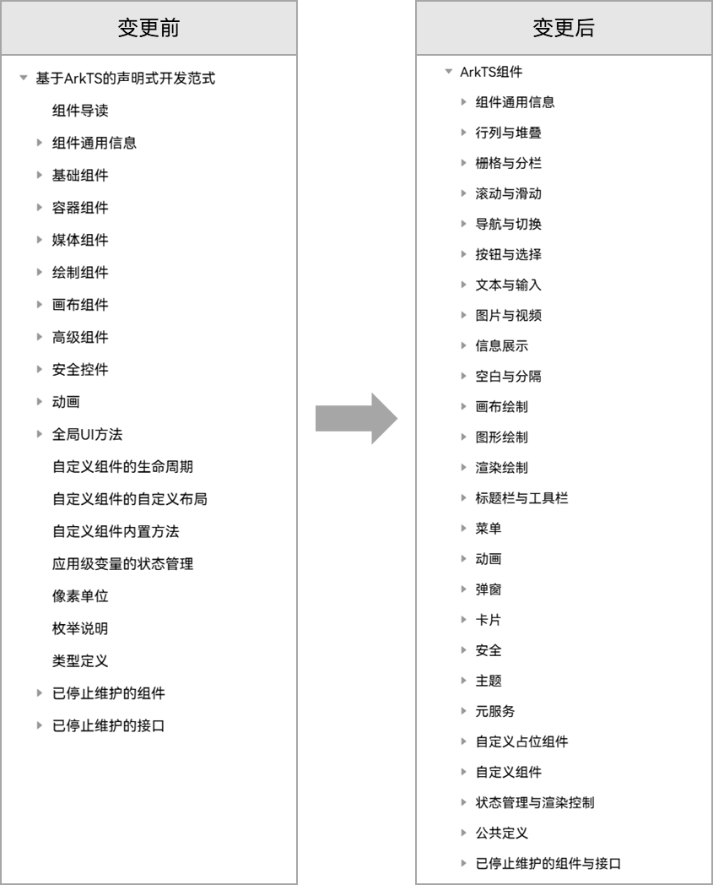

#### 2024年8月20日
#### 新增文档
**Device Security Kit**
[涉诈剧本检测](https://developer.huawei.com/consumer/cn/doc/harmonyos-guides-V5/devicesecurity-fraudriskdetection-V5)：介绍涉诈剧本检测的使用场景以及接入步骤，助力应用实现对用户支付或转账时存在欺诈威胁，给出有效提示或拦截。

#### 2024年8月9日
#### 获取体验增强
文档包内搜索入口归一，文档包内搜索框位置调整到导航目录搜索框旁边，优化搜索输入路径。
**变更前：**文档包内搜索框位于文档页面阅读区右侧。
**变更后：**文档包内搜索框位于导航栏上方。

> [!NOTE] 说明
> 文档包内搜索：支持在当前阅读的文档类型内全量搜索，如支持在版本说明书、指南、API参考等不同文档类型内全量搜索。

**图16 **文档包内搜索框入口优化效果

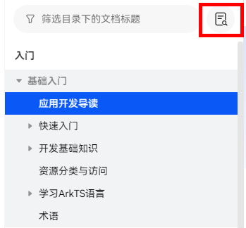

#### 2024年8月8日
#### 新增文档
**Intents Kit**
[本地搜索方案](https://developer.huawei.com/consumer/cn/doc/harmonyos-guides-V5/intents-search-rec-V5)：介绍本地搜索的场景以及接入步骤，助力开发者快速实现“一步搜索，内容直达”。
**Map Kit**
[弧线](https://developer.huawei.com/consumer/cn/doc/harmonyos-guides-V5/map-arc-V5)：介绍如何在地图上绘制弧线，包括设置弧线的位置、宽度、颜色等参数。
**Network Boost Kit**
[网络场景识别](https://developer.huawei.com/consumer/cn/doc/harmonyos-guides-V5/networkboost-scenecallback-V5)：介绍如何实现网络场景识别。
**PDF Kit**
介绍[通过PdfView组件实现](https://developer.huawei.com/consumer/cn/doc/harmonyos-guides-V5/pdf-pdfservice-implements-V5)打开PDF文档、PDF文档与图片格式互转、添加页眉页脚、添加水印、添加背景、添加批注、添加书签。
**Ringtone Kit**
介绍Ringtone Kit（铃声服务）的场景以及如何[设置铃声](https://developer.huawei.com/consumer/cn/doc/harmonyos-guides-V5/ringtone-preparations-V5)。
**Vision Kit**
[AI识图](https://developer.huawei.com/consumer/cn/doc/harmonyos-guides-V5/vision-imageanalyzer-V5)：介绍如何实现AI识图。

#### 2024年8月2日
#### 新增文档
**UI Design Kit**
从[UI Design Kit简介](https://developer.huawei.com/consumer/cn/doc/harmonyos-guides-V5/ui-design-introduction-V5)、[分层图标处理](https://developer.huawei.com/consumer/cn/doc/harmonyos-guides-V5/ui-design-layered-process-V5)、[单层图标处理](https://developer.huawei.com/consumer/cn/doc/harmonyos-guides-V5/ui-design-normal-process-V5)，全面介绍应用如何实现跟随HarmonyOS Design System高端精致设计效果UI界面。
**Weather Service Kit**
介绍如何[查询天气数据](https://developer.huawei.com/consumer/cn/doc/harmonyos-guides-V5/weather-service-introduction-V5)，用于支撑应用的天气预报、分钟级降水预报、天气预警、天气指数、天文数据等场景的实现。
**Wear Engine** **Kit**
从[Wear Engine简介](https://developer.huawei.com/consumer/cn/doc/harmonyos-guides-V5/wearengine_introduction-V5)、[开发准备](https://developer.huawei.com/consumer/cn/doc/harmonyos-guides-V5/wearengine_preparation-V5)、[手机侧应用开发](https://developer.huawei.com/consumer/cn/doc/harmonyos-guides-V5/wearengine_phonedev-V5)、[手表侧应用开发](https://developer.huawei.com/consumer/cn/doc/harmonyos-guides-V5/wearengine_watchdev-V5)、[调测验证](https://developer.huawei.com/consumer/cn/doc/harmonyos-guides-V5/wearengine_verification-V5)，全面介绍如何获取穿戴设备基础信息、应用间消息通信、发送模板化的通知到穿戴设备、获取穿戴用户状态等，实现手机与穿戴设备能力共享。
**Network Boost Kit**
[网络场景识别](https://developer.huawei.com/consumer/cn/doc/harmonyos-guides-V5/networkboost-scenecallback-V5)：介绍应用如何订阅络场景识别，网络场景信息包括数据传输的链路类型、网络场景类型、数传策略建议、弱信号信息等。

#### 2024年8月1日
#### 优化文档
**Core File Kit**
文件授权访问(ArkTS)：文档下线，其中获取并使用公共目录，调整至[获取并使用公共目录](https://developer.huawei.com/consumer/cn/doc/harmonyos-guides-V5/request-dir-permission-V5)；通过FilePicker设置永久授权获取调整至[授权持久化](https://developer.huawei.com/consumer/cn/doc/harmonyos-guides-V5/file-persistpermission-V5)。

#### 2024年7月19日
#### 公共
- 开发者文档升级至HarmonyOS NEXT Developer Beta2，兼容Developer Beta1。公共开发者在使用Developer Beta1开发套件进行开发时可能遇到官网文档与实际使用的版本不匹配的情况，此类问题请先查阅Developer Beta2版本说明，确认是否属于此次尝鲜版本变更范围，如果仍有疑问建议提交工单获得帮助。
- 开发者文档中（包括指南、API参考）示例代码均已按Kit化适配，import方式已切换为通过Kit导入。推荐开发者以此方式进行开发。

#### 新增文档
**AR Engine Kit**
- [识别平面语义](https://developer.huawei.com/consumer/cn/doc/harmonyos-guides-V5/arengine-get-plane-target-V5)：介绍支持识别的平面类型以及如何实现识别平面语义。
- [识别目标形状](https://developer.huawei.com/consumer/cn/doc/harmonyos-guides-V5/arengine-get-plane-shape-V5)：介绍支持识别的形状以及如何实现识别目标物体。
**Core Vision Kit**
- [多目标识别](https://developer.huawei.com/consumer/cn/doc/harmonyos-guides-V5/core-vision-object-detection-V5)：介绍如何检测出给定图片中的各种物体。
- [人体骨骼点检测](https://developer.huawei.com/consumer/cn/doc/harmonyos-guides-V5/core-vision-skeleton-detection-V5)：介绍人体骨骼的检测点以及如何实现人体骨骼点检测。
**Core File Kit**
[应用数据迁移适配指导](https://developer.huawei.com/consumer/cn/doc/harmonyos-guides-V5/app-data-migration-guidelines-V5)：更新了“迁移调试”工具的获取方式，HarmonyOS NEXT Developer Beta1及之后版本，开发者需要联系华为方技术支持人员申请“迁移调试”工具，模拟进行数据迁移验证。或通过“华为开发者联盟官网”->“支持”，[在线提单](https://developer.huawei.com/consumer/cn/support/)方式获取。
**Graphics Accelerate Kit**
介绍如何在Vulkan图形API平台开启[超帧内插模式](https://developer.huawei.com/consumer/cn/doc/harmonyos-guides-V5/graphics-accelerate-fg-interpolation-vulkan-V5)和[超帧外插模式](https://developer.huawei.com/consumer/cn/doc/harmonyos-guides-V5/graphics-accelerate-fg-extrapolation-vulkan-V5)。
**Map Kit**
- [绘制3D建筑物](https://developer.huawei.com/consumer/cn/doc/harmonyos-guides-V5/map-3dbuilding-V5)：介绍如何在地图上绘制3D建筑物。
- [绘制动态轨迹](https://developer.huawei.com/consumer/cn/doc/harmonyos-guides-V5/map-dyntrajectories-V5)：介绍如何在地图上绘制动态轨迹。
**Network Boost Kit**
- [系统Qos信息实时反馈](https://developer.huawei.com/consumer/cn/doc/harmonyos-guides-V5/networkboost-qoscallback-V5)：介绍应用如何订阅网络质量QoS评估信息，以便应用针对弱网等环境下实现网络自适应，包括缓存、码率、帧率、分辨率等策略的调整。
- [应用实时反馈Qoe信息](https://developer.huawei.com/consumer/cn/doc/harmonyos-guides-V5/networkboost-appreportqoe-V5)：介绍应用如何将传输体验信息通过实时反馈接口传输给网络业务模块，网络业务模块进行精细化调度，实现网络加速。
**Scan Kit**
[字节数组生成码图](https://developer.huawei.com/consumer/cn/doc/harmonyos-guides-V5/scan-generatearray-V5)：介绍如何将字节数组转换为自定义格式的码图。
**Scenario Fusion Kit**
- 实名认证场景化Button：介绍如何调用实名认证场景化Button组件跳转实名认证页面。
- 人脸核身场景化Button：介绍如何调用人脸核身Button组件跳转人脸核身页面。
**Service Collaboration Kit**
[跨设备互通能力](https://developer.huawei.com/consumer/cn/doc/harmonyos-guides-V5/servicecollaboration-servicendk-description-V5)：介绍如何通过NDK接口实现跨设备的相机、扫描、图库访问能力。
**Speech Kit**
[AI字幕控件](https://developer.huawei.com/consumer/cn/doc/harmonyos-guides-V5/speech-aicaption-guide-V5)：介绍如何实现AI字幕的展示。
**Store Kit**
[隐私管理服务](https://developer.huawei.com/consumer/cn/doc/harmonyos-guides-V5/store-privacy-V5)：介绍如何实现隐私链接查询、隐私签署状态查询、停止隐私协议和未上架应用接入隐私托管服务。

#### 优化文档
**AR Engine Kit**
优化文档结构，从介绍管理AR会话、获取设备位姿、检测环境中的平面、识别平面语义、识别目标形状等原子化场景如何实现，由部分到整体，引导开发者开发AR场景的应用（[AR物体摆放](https://developer.huawei.com/consumer/cn/doc/harmonyos-guides-V5/arengine-plane-detection-V5)）。

#### 获取体验增强
指南、API参考一级节点页面URL地址发生变更，本次版本更新升级，优化节点页面URL地址规则。如果您发现已收藏文档页面不可访问，请重新搜索并收藏新地址。
**变更前**：URL最后一段为该一级节点页面标题转义后的字符串，不易理解和记忆。
**变更后**：URL最后一段为该Kit标准英文名，方便理解、获取和记忆。
【示例】以“Ability Kit（程序框架服务）”指南为例：
变更前URL：https://developer.huawei.com/consumer/cn/doc/harmonyos-guides-V5/it_uff08_u7a0b_u5e8f_u6846_u67b6_u670d_u52a1_uff09-V5
变更后URL：https://developer.huawei.com/consumer/cn/doc/harmonyos-guides-V5/ability-kit-V5

#### 2024年7月12日
#### FAQ目录结构变更
**变更背景**
根据开发者的反馈，了解到开发者习惯于从左侧导航目录中搜索所需内容。FAQ内容在每一篇文档的内部以Section的形式呈现，无法通过左侧导航栏直接访问，导致查找效率不高。
此外，每一篇文档中有多条FAQ，开发者在提交反馈意见时，无法清晰指明是针对哪一条FAQ的意见，不便于问题定位与改进。
**变更内容**
为了提升开发者的使用体验，对FAQ的目录结构进行了以下优化：
1. 导航目录结构优化 将原来在文档内部呈现的FAQ内容，切换到文档的左侧导航目录结构中，以Topic的形式呈现。这样，开发者可以更加便捷地通过左侧导航目录查阅FAQ内容，提升获取信息的效率。
2. 分类方式优化 从原来的按照Kit进行分类，优化为按照开发旅程进行分类。使得开发者可以更加方便地根据自己所处的开发阶段查找相关的FAQ，从而提升查找的准确性和效率。
**变更效果**
通过此次变更，实现了以下效果：
- 开发者可以通过左侧导航目录直接访问每一条FAQ，提高了查找效率。
- 按照开发旅程进行分类，使得FAQ的查找更加符合开发者的实际需求。
- 每一条FAQ都独立成一篇文档，方便开发者对每一条FAQ进行使用的效果评价，便于收集更加准确的反馈意见。
- 原有的Kit页面URL地址保持不变，保证了链接的稳定性和连续性。
**图17 **FAQ目录结构变更

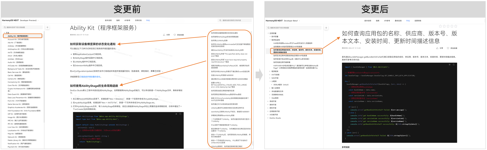

#### 2024年6月21日
#### 获取路径变更
获取方式1：[华为开发者联盟官网](https://developer.huawei.com/consumer/cn/)-“文档”页面中，提供HarmonyOS NEXT版本、HarmonyOS 3.1/4.0及以下版本配套文档获取入口。
1. 打开“华为开发者联盟”官网，单击网页右上角“文档”按钮，进入[文档获取概览页](https://developer.huawei.com/consumer/cn/doc/)。
2. 根据文档使用场景，选择设计、HarmonyOS SDK相关主题文档。
获取方式2：[华为开发者联盟官网](https://developer.huawei.com/consumer/cn/)-“开发”页面中，提供HarmonyOS NEXT版本配套文档获取入口。

#### 新增文档
**Ability Kit**
新增应用间跳转章节。
- [应用间跳转概述](https://developer.huawei.com/consumer/cn/doc/harmonyos-guides-V5/link-between-apps-overview-V5)：介绍应用间跳转的两种类型（指向性跳转和通用意图跳转），并重点针对指向性跳转中的应用链接跳转，展开介绍的运行机制和两种方式（Deep Linking和App Linking）的对比。
- 指向性跳转： （可选）使用canOpenLink判断应用是否可访问：介绍如何使用canOpenLink接口判断目标应用是否可访问。 使用Deep Linking实现应用间跳转：介绍使用Deep Linking进行应用间跳转的实现原理和开发指导。 使用App Linking实现应用间跳转：介绍使用App Linking进行应用间跳转的适用场景、实现原理和开发指导。 应用间显式跳转切换link跳转适配指导：提供从显式跳转到link跳转（即应用链接跳转）的适配指导。
- 通用意图跳转 通过startAbility拉起文件处理类应用：介绍如何使用startAbility接口拉起文件处理类应用，来打开特定类型的文件。
- [拉起系统应用](https://developer.huawei.com/consumer/cn/doc/harmonyos-guides-V5/system-app-startup-V5)：介绍拉起系统应用的方式，提供当前已支持的系统应用跳转能力清单。
**ArkUI**
- [使用NDK接口构建UI](https://developer.huawei.com/consumer/cn/doc/harmonyos-guides-V5/ndk-build-ui-overview-V5)：介绍ArkUI NDK接口提供的能力，以及如何通过NDK接口创建UI界面。 接入ArkTS界面：说明如何通过占位组件（ContentSlot）和NDK提供的UI组件接入ArkTS界面。 添加交互事件：介绍如何监听组件事件和绑定手势事件。 使用动画：介绍属性动画实现组件出现/消失转场的方法。 开发长列表：介绍如何通过懒加载（NodeAdapter）按需生成子组件，开发长列表界面。 构建弹窗：说明如何通过弹窗控制器显示自定义弹窗，设置自定义弹窗的样式和内容。 构建自定义组件：介绍自定义测算、自定义布局和自定义绘制的实现方法。 嵌入ArkTS组件：介绍如何通过ComponentContent完成对ArkTS组件的封装，将封装对象转递到Native侧。
- [Router切换Navigation](https://developer.huawei.com/consumer/cn/doc/harmonyos-guides-V5/arkts-router-to-navigation-V5)：介绍两种路由跳转方式的架构差异，说明各个业务场景下两种方式的能力对比，同时提供Router各个模块切换Navigation的方法。
**Graphics Accelerate Kit**
[OpenGTX功能](https://developer.huawei.com/consumer/cn/doc/harmonyos-guides-V5/graphics-accelerate-opengtx-V5)：介绍如何通过LTPO（动态帧率/刷新率）方案，动态调整游戏的帧率/刷新率以及设备的SOC/DDR频率。

#### 文档目录结构变更
ArkWeb开发指南目录结构优化。根据实际开发旅程，从管理网页交互、文件上传下载等维度，将分散的章节按照场景进行划分。
**图18 **ArkWeb开发指南目录变更对比

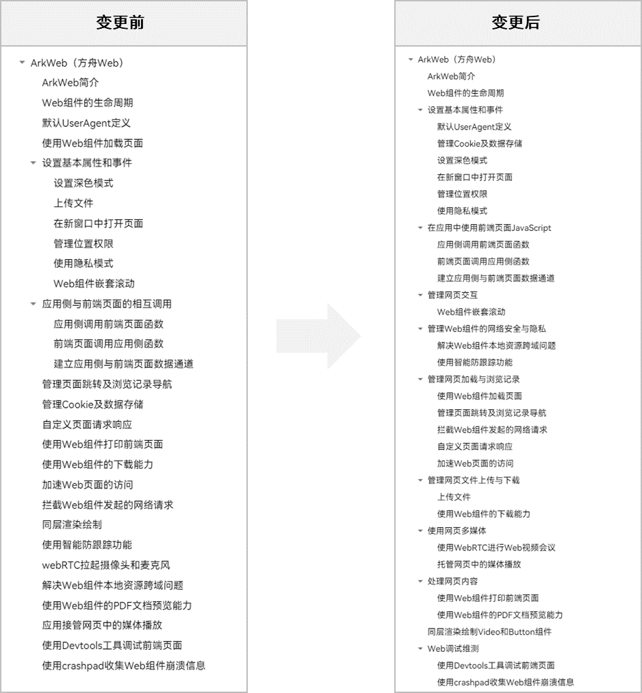

#### 2024年6月16日
#### 导航目录结构变更
开发指南和API参考导航目录结构优化，在现有Kit维度基础上增加HarmonyOS SDK分类：
应用框架、系统（安全、网络、基本功能、硬件、调测调优）、媒体、图形、应用服务、AI。
方便开发者根据不同能力Kit获取相应内容，提升获取体验。
**变更背景：**
开发者反馈文档导航中Kit划分较细，查找常用能力不高效。
开发指南和API参考导航优化，通过增加分类，将Kit能力按照不同能力维度进行汇聚呈现，提升获取体验。
**变更效果：**
仅导航结构变更，页面URL地址无变化。
**图19 **开发指南导航变更对比

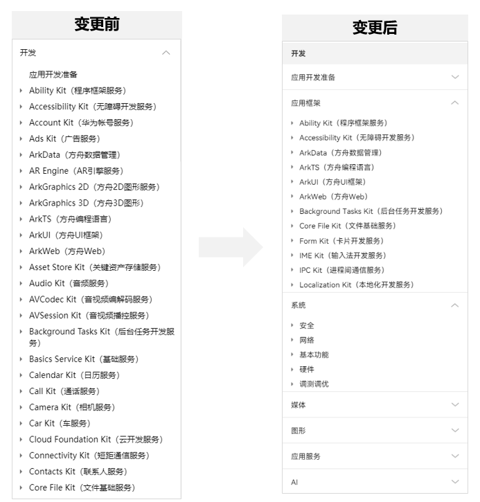

#### 获取体验增强
为了提供更优的文档获取体验，避免因文档页面中Section标题URL地址中随机数字变化产生的链接访问问题。本次网站更新升级，优化部分内容页面内Section标题URL地址规则。
**变更背景：**
页面URL地址为确保地址唯一性，每个页面URL携带一串随机数字，不同版本之间随机数字可能产生变化，Section标题URL地址继承页面URL流水号，存在频繁变更情况。
**变更效果：**
本次优化仅涉及Section标题URL地址中携带以ZH-CN_TOPIC_XXX开头的文档页面。
**图20 **页面内Section标题URL地址变更对比

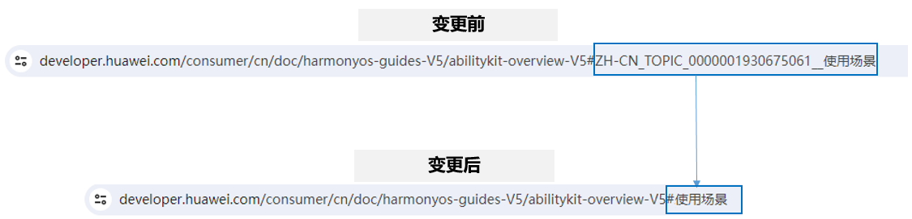

> [!NOTE] 说明
> 存在部分存量页面中链接出现：跳转到Section标题URL地址跳转不精准，重定向至页面链接的问题。 文档团队将会及时清理相关跳转不精准问题，清理期间给您带来不便敬请谅解。

#### 2024年6月10日及之前
#### 新增文档
**ArkUI**
- [自定义节点](https://developer.huawei.com/consumer/cn/doc/harmonyos-guides-V5/arkts-user-defined-node-V5)：介绍ArkUI框架提供底层实体节点部分基础能力。 自定义占位节点：可以将自定义节点挂载在占位节点上，实现自定义节点与原生组件的混合显示。 FrameNode：表示组件的实体节点，提供完全自定义节点和原生组件节点代理两个能力。 RenderNode：仅提供了设置渲染相关属性、自定义绘制内容以及节点操作的能力。 BuilderNode：通过无状态的UI方法生成组件树，可以控制开始创建的时间。
- [旋转屏动画增强](https://developer.huawei.com/consumer/cn/doc/harmonyos-guides-V5/arkts-rotation-transition-animation-V5)：介绍在原旋转屏动画基础上，如何配置渐隐和渐现的转场效果。
- [粒子动画](https://developer.huawei.com/consumer/cn/doc/harmonyos-guides-V5/arkts-particle-animation-V5)：介绍粒子在颜色、透明度、大小、速度、加速度、自旋角度等维度变化做动画的实现方法。
- [事件分发](https://developer.huawei.com/consumer/cn/doc/harmonyos-guides-V5/arkts-common-events-distribute-V5)**：**介绍触控事件的分发机制和事件响应链的收集方法。
- [设置主题换肤](https://developer.huawei.com/consumer/cn/doc/harmonyos-guides-V5/theme_skinning-V5)**：**介绍应用级和页面级的主题设置能力，并提供局部深浅色模式设置、动态换肤等功能描述。
**ArkTS**
- [共享模块开发指导](https://developer.huawei.com/consumer/cn/doc/harmonyos-guides-V5/arkts-sendable-module-V5)：支持共享模块，提供共享模块的使用规格与示例。
- [已接入Sendable的系统对象](https://developer.huawei.com/consumer/cn/doc/harmonyos-guides/arkts-sendable#sendable支持的数据类型)：目前ArkTS已支持多线程Sendable，具体可见对应支持Sendable的对象清单。
**Account Kit**
[应用跟随系统未成年人模式](https://developer.huawei.com/consumer/cn/doc/harmonyos-guides-V5/account-get-minorsprotection-V5)：介绍应用如何实现跟随系统未成年人模式。
**AR Engine**
[命中检测与运动跟踪](https://developer.huawei.com/consumer/cn/doc/harmonyos-guides-V5/arengine-hitresult-and-tracking-V5)**：**介绍如何实现命中检测与运动跟踪。
**ArkGraphics 3D**
新增提供ArkGraphics 3D各模块，为开发者提供基础3D场景绘制能力，供开发者便捷、高效地构建3D场景并完成渲染。
- [ArkGraphics 3D场景搭建以及管理](https://developer.huawei.com/consumer/cn/doc/harmonyos-guides-V5/arkgraphics3d-scene-V5)：介绍3D场景中光源、相机、模型三个关键部分的创建及管理。
- [ArkGraphics 3D资源创建以及使用](https://developer.huawei.com/consumer/cn/doc/harmonyos-guides-V5/arkgraphics3d-resource-V5)：介绍3D场景中材质、着色器、图片资源及环境资源等的创建及使用。
- [ArkGraphics 3D场景动画控制以及管理](https://developer.huawei.com/consumer/cn/doc/harmonyos-guides-V5/arkgraphics3d-animation-V5)：介绍3D场景中动画的创建、控制及使用。
**Cloud Foundation Kit**
介绍如何使用Cloud Foundation Kit在应用中[开发云函数](https://developer.huawei.com/consumer/cn/doc/harmonyos-guides-V5/cloudfoundation-function-service-V5)、[开发云数据库](https://developer.huawei.com/consumer/cn/doc/harmonyos-guides-V5/cloudfoundation-database-service-V5)、[开发云存储](https://developer.huawei.com/consumer/cn/doc/harmonyos-guides-V5/cloudfoundation-storage-service-V5)。
**Core Vision Kit**
[主体分割](https://developer.huawei.com/consumer/cn/doc/harmonyos-guides-V5/core-vision-subject-segmentation-V5)：介绍如何检测出图片中区别于背景的的前景物体或区域（即“显著主体”），并将其从背景中分离出来。
**Connectivity Kit**
[WLAN服务开发指南](https://developer.huawei.com/consumer/cn/doc/harmonyos-guides-V5/wlan-overview-V5)：介绍WLAN服务的实现原理、模式，以及P2P模块的开发指导。
**Device Certificate Kit**
[设备真实性证明](https://developer.huawei.com/consumer/cn/doc/harmonyos-guides-V5/device-attestation-intro-V5)：介绍系统提供的设备真实性证明和应用身份证明的能力。应用可校验业务请求是否来自真实设备和合法应用，帮助开发者识别黑灰产的攻击行为。
**Device Security Kit**
从[Device Security Kit简介](https://developer.huawei.com/consumer/cn/doc/harmonyos-guides-V5/devicesecurity-introduction-V5)、[服务配额](https://developer.huawei.com/consumer/cn/doc/harmonyos-guides-V5/devicesecurity-quota-V5)、[开发准备](https://developer.huawei.com/consumer/cn/doc/harmonyos-guides-V5/devicesecurity-deviceverify-activateservice-V5)、[应用设备状态检测](https://developer.huawei.com/consumer/cn/doc/harmonyos-guides-V5/devicesecurity-deviceverify-develop-V5)、[系统完整性检测](https://developer.huawei.com/consumer/cn/doc/harmonyos-guides-V5/devicesecurity-sysintegrity-check-V5)、[URL检测](https://developer.huawei.com/consumer/cn/doc/harmonyos-guides-V5/devicesecurity-urlthreat-check-V5)、（该特性在6月11日补丁版本带入）[可信应用服务](https://developer.huawei.com/consumer/cn/doc/harmonyos-guides-V5/devicesecurity-taas-dev-V5)，全面介绍应用如何实现对某台设备上的使用状态、设备环境进行管理和检测。
**Graphics Accelerate Kit**
[顶点标记](https://developer.huawei.com/consumer/cn/doc/harmonyos-guides-V5/graphics-accelerate-fg-mv-V5)：介绍增强模式的运动估计原理及顶点标记方法。
**Map Kit**
- [区划选择控件](https://developer.huawei.com/consumer/cn/doc/harmonyos-guides-V5/map-location-division-V5)：介绍如何集成区划选择控件，实现指定国家的区划信息的加载。
- [地图截图](https://developer.huawei.com/consumer/cn/doc/harmonyos-guides-V5/map-screenshots-V5)：介绍如何实现地图截图，将当前屏幕显示区域进行截屏。
**Natural Language Kit**
- [分词](https://developer.huawei.com/consumer/cn/doc/harmonyos-guides-V5/natural-language-getwordsegmentation-V5)：介绍如何实现将一段文本切分成独立的词语单元，识别出句子中的每个词汇。
- [实体抽取](https://developer.huawei.com/consumer/cn/doc/harmonyos-guides-V5/natural-language-getentity-V5)：介绍如何实现从文本中识别出具有特定意义的实体，例如人名、地名、时间日期、数字、电话号码、邮箱地址等。
**Payment Kit**
- [支付并签约](https://developer.huawei.com/consumer/cn/doc/harmonyos-guides-V5/payment-pay-and-sign-V5)：介绍如何接入支付并签约能力，让用户在支付完成后快速与商户建立签约代扣的关系。
- [签约代扣](https://developer.huawei.com/consumer/cn/doc/harmonyos-references-V5/payment-partner-withhold-V5)：介绍如何实现服务商模式签约代扣。
**Pen Kit**
介绍如何实现接入[手写套件](https://developer.huawei.com/consumer/cn/doc/harmonyos-guides-V5/pen-suite-V5)、[报点预测](https://developer.huawei.com/consumer/cn/doc/harmonyos-guides-V5/pen-point-prediction-V5)、[一笔成形](https://developer.huawei.com/consumer/cn/doc/harmonyos-guides-V5/pen-instant-shape-V5)，助力应用创造更多的手写应用场景。
**PDF Kit**
介绍如何实现[打开PDF文档](https://developer.huawei.com/consumer/cn/doc/harmonyos-guides-V5/pdf-open-docunent-V5)、以及如何在PDF文档中[添加页眉页脚](https://developer.huawei.com/consumer/cn/doc/harmonyos-guides-V5/pdf-add-headerfooter-V5)、[添加水印](https://developer.huawei.com/consumer/cn/doc/harmonyos-guides-V5/pdf-add-watermark-V5)、[添加背景](https://developer.huawei.com/consumer/cn/doc/harmonyos-guides-V5/pdf-add-background-V5)、添加批注、[添加书签](https://developer.huawei.com/consumer/cn/doc/harmonyos-guides-V5/pdf-add-bookmark-V5)。
**Scan Kit**
[“扫码直达”服务](https://developer.huawei.com/consumer/cn/doc/harmonyos-guides-V5/scan-directservice-V5)：介绍如何接入“扫码直达”服务，确保用户可通过锁屏、控制中心等系统级的常驻入口，扫应用的二维码、条形码并跳转到应用对应服务页面。
**Share Kit**
- [宿主应用配置操作区](https://developer.huawei.com/consumer/cn/doc/harmonyos-guides-V5/share-app-actions-V5)：介绍如何通过配置移除系统操作区能力。
- [应用内处理分享内容](https://developer.huawei.com/consumer/cn/doc/harmonyos-guides-V5/share-interface-description-V5)：介绍目标应用如何通过UIAbility处理分享内容。
- [二级面板关闭分享面板](https://developer.huawei.com/consumer/cn/doc/harmonyos-guides-V5/share-sec-panel-back-V5)：介绍二级面板如何直接关闭分享面板。
**Remote Communication Kit**
- [上传下载文件](https://developer.huawei.com/consumer/cn/doc/harmonyos-guides-V5/remote-communication-updownload-V5)：介绍如何将文件上传到服务器或者从服务器下载文件。
- [设置TLS版本和加密套件](https://developer.huawei.com/consumer/cn/doc/harmonyos-guides-V5/remote-communication-settls-V5)：介绍如何设置TLS版本号以及指定加密套件。
- 介绍如何[使用fetch发送异步网络请求 (C/C++)](https://developer.huawei.com/consumer/cn/doc/harmonyos-guides-V5/remote-communication-fetchsyncnetworkrequests-c-V5)、[使用fetchsync发起同步网络请求 (C/C++)](https://developer.huawei.com/consumer/cn/doc/harmonyos-guides-V5/remote-communication-fetchnetworkrequests-c-V5)等，实现[获取服务器资源](https://developer.huawei.com/consumer/cn/doc/harmonyos-guides-V5/remote-communication-getserverresources-c-V5)、[发送数据到服务器](https://developer.huawei.com/consumer/cn/doc/harmonyos-guides-V5/remote-communication-senddatatoserver-c-V5)、[断点续传](https://developer.huawei.com/consumer/cn/doc/harmonyos-guides-V5/remote-communication-httpresume-c-V5)、[双向证书校验](https://developer.huawei.com/consumer/cn/doc/harmonyos-guides-V5/remote-communication-certificateverification-c-V5)、[拦截器](https://developer.huawei.com/consumer/cn/doc/harmonyos-guides-V5/remote-communication-interceptor-c-V5)**。**
**Store kit**
[支持应用归因服务](https://developer.huawei.com/consumer/cn/doc/harmonyos-guides-V5/store-attribution-introduction-V5)：介绍如何实现[登记归因来源及转化](https://developer.huawei.com/consumer/cn/doc/harmonyos-guides-V5/store-attribution-developmentguide-V5)、[归因结果回传](https://developer.huawei.com/consumer/cn/doc/harmonyos-guides-V5/store-attribution-receive-V5)。
**Wallet Kit**
从[Wallet Kit简介](https://developer.huawei.com/consumer/cn/doc/harmonyos-guides-V5/wallet-introduction-V5)、[创建Wallet Kit服务](https://developer.huawei.com/consumer/cn/doc/harmonyos-guides-V5/wallet-preparations-V5)、[数字车钥匙](https://developer.huawei.com/consumer/cn/doc/harmonyos-guides-V5/wallet-carkey-overview-V5)、[接入交通卡](https://developer.huawei.com/consumer/cn/doc/harmonyos-guides-V5/wallet-transport-overview-V5)，全面介绍如何使用Wallet Kit在应用中接入数字车钥匙和交通卡。

#### 优化文档
《DevEco Studio使用指南》中将Code Linter支持的检查规则，从表格升级为单页面的形式展示规则详情，提供正反例、配置方法、选项等信息，方便用户查阅与使用。具体请参考[Code Linter代码检查规则](https://developer.huawei.com/consumer/cn/doc/harmonyos-guides-V5/ide-codelinter-rule-V5)。
**ArkUI**
[组件导航 (Navigation)](https://developer.huawei.com/consumer/cn/doc/harmonyos-guides-V5/arkts-navigation-navigation-V5)**：**补充页面跳转、页面返回等路由操作方法，说明页面生命周期原理与页面转场动效实现逻辑，提供系统路由表和自定义路由表定义机制与实践步骤。

#### 2024年5月
#### 新增文档
**标准**
[应用安全隐私体验建议](https://developer.huawei.com/consumer/cn/doc/harmonyos-guides-V5/security-privacy-overview-V5)：介绍应用设计、开发及检测阶段需关注的应用全生命周期的安全、隐私行为。
[应用功耗体验建议](https://developer.huawei.com/consumer/cn/doc/harmonyos-guides-V5/app-power-experience-standards-overview-V5)：介绍提升应用功耗热体验，如何合理使用应用全生命周期软硬件资源规范建议。
**Ability Kit**
[应用启动框架AppStartup](https://developer.huawei.com/consumer/cn/doc/harmonyos-guides-V5/app-startup-V5)：介绍如何使用AppStartup来设置组件的初始化顺序以及之间的依赖关系，加速应用启动。
[密码自动填充服务](https://developer.huawei.com/consumer/cn/doc/harmonyos-guides-V5/passwordvault-overview-V5)：介绍如何在应用中快速集成自动填充等功能，完成在登录、注册等场景下自动保存或填充用户密码。
**Account Kit**
[获取发票抬头](https://developer.huawei.com/consumer/cn/doc/harmonyos-guides-V5/account-select-invoice-title-V5)：介绍如何使用获取发票抬头能力，帮助应用快速打开用户发票抬头选择页或管理页，并返回用户选择的发票抬头信息。
**AR Engine**
从[AR Engine](https://developer.huawei.com/consumer/cn/doc/harmonyos-guides-V5/arengine-introduction-V5)、[开发准备](https://developer.huawei.com/consumer/cn/doc/harmonyos-guides-V5/arengine-preparations-V5)、[平面检测](https://developer.huawei.com/consumer/cn/doc/harmonyos-guides-V5/arengine-plane-detection-V5)，介绍如何实现运动跟踪、环境跟踪和命中检测等空间计算能力。
**Call kit**
[向系统通知去电消息](https://developer.huawei.com/consumer/cn/doc/harmonyos-guides-V5/call-notify-outgoing-calls-V5)：介绍如何实现向系统通知去电消息，实现来电横幅通知的展示。
[应用上报通话中的静音、扬声器事件](https://developer.huawei.com/consumer/cn/doc/harmonyos-guides-V5/call-report-audio-event-V5)：介绍如何实现应用上报通话中的静音、扬声器事件。
**Game Service Kit**
[游戏场景感知功能](https://developer.huawei.com/consumer/cn/doc/harmonyos-guides-V5/gameservice-gameperformance-dev-V5)**：**介绍游戏场景感知功能的使用场景、业务流程，以及如何订阅设备状态变化、上报游戏信息、取消订阅设备状态，帮助游戏应用感知游戏场景和运行状态的不同，使用不同策略调度系统资源以达到更精细化的优化效果。
**Graphics Accelerate Kit**
从[Graphics Accelerate Kit简介](https://developer.huawei.com/consumer/cn/doc/harmonyos-guides-V5/graphics-accelerate-introduction-V5)、超帧功能（[内插模式](https://developer.huawei.com/consumer/cn/doc/harmonyos-guides-V5/graphics-accelerate-fg-interpolation-V5)、[外插模式](https://developer.huawei.com/consumer/cn/doc/harmonyos-guides-V5/graphics-accelerate-fg-extrapolation-V5)）、[ABR功能](https://developer.huawei.com/consumer/cn/doc/harmonyos-guides-V5/graphics-accelerate-abr-V5)，全面介绍游戏应用如何快速构建超帧、ABR（自适应稳态渲染）等游戏渲染加速能力，实现游戏帧率和运行流畅度的提升、系统负载和功耗的降低等。
**IAP Kit**
[沙盒测试](https://developer.huawei.com/consumer/cn/doc/harmonyos-guides-V5/iap-sandbox-V5)：介绍如何接入IAP Kit实现在应用调测过程中，无需真实支付即可实现支付测试。
**Intent Kit**
优化章节组织结构，按照特性类别展示具体特性，提升开发者阅读体验。
[事件推荐方案](https://developer.huawei.com/consumer/cn/doc/harmonyos-guides-V5/intents-event-rec-introduction-V5)：从典型场景、卡片展示效果、接入方案，介绍接入事件推荐的步骤，助力应用将新动态主动推荐给用户。
**Map kit**
[覆盖物](https://developer.huawei.com/consumer/cn/doc/harmonyos-guides-V5/map-coverings-V5)：介绍如何为地图增加覆盖物。
**Preview Kit**
[文件预览](https://developer.huawei.com/consumer/cn/doc/harmonyos-guides-V5/preview-filepreview-V5)：新增多文件预览，用户打开文件预览可以一次性传入多个文件，可在预览窗口选择对应文件进行查看。
**Remote Communication Kit**
[自定义证书校验](https://developer.huawei.com/consumer/cn/doc/harmonyos-guides-V5/remote-communication-validation-V5)：介绍如何实现自定义服务器证书的验证。
**Scan Kit**
- [识别图像数据](https://developer.huawei.com/consumer/cn/doc/harmonyos-guides-V5/scan-decodeimage-V5)：介绍应用如何对相机预览流数据中的码图进行扫描识别，并获取信息。
**Scenario Fusion Kit**
- [选择收货地址场景化button](https://developer.huawei.com/consumer/cn/doc/harmonyos-guides-V5/scenario-fusion-button-ship-to-V5)：介绍如何使用选择收货地址Button，快速拉起地址选择页面，并返回用户选择的收货地址。
- [选择发票抬头场景化button](https://developer.huawei.com/consumer/cn/doc/harmonyos-guides-V5/scenario-fusion-button-invoice-title-V5)：介绍如何使用选择发票抬头Button，跳转发票抬头选择页面，供用户完成已保存发票抬头的选择。
- [地图选点场景化button](https://developer.huawei.com/consumer/cn/doc/harmonyos-guides-V5/scenario-fusion-button-selecting-point-V5)：介绍如何使用地图选点Button，拉起Map Kit的地图选点页面，实现用户在地图中选择位置后，位置相关信息返回Button界面。
- [智能填充](https://developer.huawei.com/consumer/cn/doc/harmonyos-guides-V5/scenario-fusion-intelligent-filling-V5)：介绍智能填充的使用场景以及如何实现复杂表单一键填充，帮助用户轻松地完成表单填写。
**Status Bar Extension Kit**
[应用接入状态栏](https://developer.huawei.com/consumer/cn/doc/harmonyos-guides-V5/statusbar-extension-guide-V5)：介绍应用如何接入状态栏，在状态栏中添加应用图标以及管理图标。
**XEngine Kit**
- [空域AI超分功能](https://developer.huawei.com/consumer/cn/doc/harmonyos-guides-V5/xengine-kit-ai-spatial-upscaling-V5)：介绍空域AI超分的使用场景、业务流程，以及接入步骤，助力应用基于单帧图像使用AI推理生成滤波参数进行超采样，实现比空域GPU超分更好的画质。
- [自适应VRS功能](https://developer.huawei.com/consumer/cn/doc/harmonyos-guides-V5/xengine-kit-adaptive-vrs-V5)：介绍自适应VRS的使用场景、业务流程，以及接入步骤，助力应用合理分配画面的计算资源，视觉无损降低渲染频次，不同的渲染图像使用不同的渲染速率，有效提高渲染性能。
- [Subpass](https://developer.huawei.com/consumer/cn/doc/harmonyos-guides-V5/xengine-kit-subpass-shading-V5)：介绍Subpass Shading功能的使用场景、业务流程，以及接入步骤，助力应用减少计算过程中的读写从而减少带宽的占用。

#### 优化文档
- 提高了《DevEco Studio使用指南》中《命令行工具》章节的层级，调整后[《命令行工具使用指南》](https://developer.huawei.com/consumer/cn/doc/harmonyos-guides-V5/ide-commandline-get-V5)层级与《DevEco Studio使用指南》并列，并将原有《编译构建》章节下的[《搭建流水线》](https://developer.huawei.com/consumer/cn/doc/harmonyos-guides-V5/ide-command-line-building-app-V5)移至《命令行工具使用指南》下。便于流水线场景的开发者快速、集中地查看命令行工具使用与流水线搭建的操作指导。
- 由于一体化变更，hvigor和hvigor-ohos-plugin已内置进DevEco Studio，[《编译构建》](https://developer.huawei.com/consumer/cn/doc/harmonyos-guides-V5/ide-build-V5)章节不再按hvigor和hvigor-ohos-plugin两个维度分别介绍，调整为按编译构建场景展开介绍编译构建各项能力，分为编译构建概述（包括构建生命周期、配置文件、构建任务）、配置构建、定制构建、优化构建、扩展构建、加固构建及编译构建问题排查。

#### 获取体验增强
为了提供更优的文档获取体验，避免因文档页面地址中随机数字变化产生的链接不可访问问题。本次网站更新升级，优化页面URL地址规则。
优化前：页面URL地址为确保地址唯一性，每个页面URL携带一串随机数字，不同版本之间随机数字可能产生变化，导致历史链接不可访问。
优化后：页面URL地址去掉随机数字，且支持优化前页面URL重定向至优化后页面URL地址。

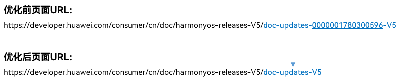

> [!NOTE] 说明
> 为解决去掉随机数字过程中产生的页面URL地址重复问题，文档修改少量重名URL地址，如果您发现已收藏文档页面不可访问，请重新搜索并收藏新地址。

#### 2024年4月
#### 新增文档
**ArkTS**
[代码混淆](https://developer.huawei.com/consumer/cn/doc/harmonyos-guides-V5/source-obfuscation-V5)**：**介绍如何使用代码混淆，降低工程被破解攻击的风险，缩短代码的类与成员的名称，减小应用的大小。
**Account Kit**
- [华为账号一键登录](https://developer.huawei.com/consumer/cn/doc/harmonyos-guides-V5/account-phone-unionid-login-V5)：介绍如何使用华为账号[LoginPanel](https://developer.huawei.com/consumer/cn/doc/harmonyos-references-V5/account-api-loginpanel-V5)组件，通过华为账号绑定的手机号实现一键登录和注册。
- [获取收货地址](https://developer.huawei.com/consumer/cn/doc/harmonyos-guides-V5/account-choose-adress-V5)**：**介绍如何使用收货地址开放能力，帮忙应用快速打开用户收货地址管理页面，并获取用户的收货地址。
- [未成年人模式](https://developer.huawei.com/consumer/cn/doc/harmonyos-guides-V5/account-minorsprotection-V5)**：**介绍应用如何实现获取未成年人模式的开启状态，以及年龄段信息。
- [获取华为账号登录状态](https://developer.huawei.com/consumer/cn/doc/harmonyos-guides-V5/account-login-state-V5)**：**介绍应用如何实现快速检测系统账号的状态，同时判断应用登录的账号和系统账号是否一致。
**Game Service Kit**
[防沉迷](https://developer.huawei.com/consumer/cn/doc/harmonyos-guides-V5/gameservice-anti-indulgence-V5)：介绍防沉迷的场景以及未成年人游戏时间自动检测功能。
**Map Kit**
- [UI控件和手势](https://developer.huawei.com/consumer/cn/doc/harmonyos-guides-V5/map-controls-and-gestures-V5)：介绍如何实现设置比例尺位置及获取当前层级的比例尺大小、指南针控件的位置、地图手势控制开关。
- [设置地图类型](https://developer.huawei.com/consumer/cn/doc/harmonyos-guides-V5/map-type-V5)：介绍如何设置三种地图类型，包括标准地图、空地图、地形图。
- [标记点聚合](https://developer.huawei.com/consumer/cn/doc/harmonyos-guides-V5/map-aggregate-V5)：介绍如何根据地图数据实现聚合效果。
- [标记](https://developer.huawei.com/consumer/cn/doc/harmonyos-guides-V5/map-marker-V5)：介绍如何在地图的指定位置添加标记，实现自定义信息窗。
**Remote Communication Kit**
[拦截器](https://developer.huawei.com/consumer/cn/doc/harmonyos-guides-V5/remote-communication-interceptor-V5)：介绍如何实现拦截HTTP请求和响应，并修改响应、请求内容。
**Speech Kit**
[朗读控件](https://developer.huawei.com/consumer/cn/doc/harmonyos-guides-V5/speech-textreader-guide-V5)：介绍应用如何实现将文本实时转化成语音并进行朗读。
**Vision Kit**
[文档扫描](https://developer.huawei.com/consumer/cn/doc/harmonyos-guides-V5/vision-documentscanner-V5)：介绍应用如何实现拍摄文档并将其转换为高清扫描件。
**XEngine Kit**
[空域GPU超分](https://developer.huawei.com/consumer/cn/doc/harmonyos-guides-V5/xengine-kit-gpu-spatial-upscaling-V5)：介绍如何基于单帧输入图像，使用空间邻域信息实现超采样，并提供了示例代码。

#### 优化文档
**Push Kit**
根据开发旅程，优化开发指导文档结构，从[Push Kit简介](https://developer.huawei.com/consumer/cn/doc/harmonyos-guides-V5/push-introduction-V5)、[开发准备](https://developer.huawei.com/consumer/cn/doc/harmonyos-guides-V5/push-preparations-V5)、[发送场景化消息](https://developer.huawei.com/consumer/cn/doc/harmonyos-guides-V5/push-scenes-V5)到[端云调试](https://developer.huawei.com/consumer/cn/doc/harmonyos-guides-V5/push-server-intro-V5)等逐步展开，提升开发者阅读体验。

#### 2024年3月
#### 新增文档
**Core Vision Kit**
- [人脸检测](https://developer.huawei.com/consumer/cn/doc/harmonyos-guides-V5/core-vision-face-detector-V5)：介绍如何实现人脸检测能力，即通过识别图片，检测是否有人脸。
- [人脸对比](https://developer.huawei.com/consumer/cn/doc/harmonyos-guides-V5/core-vision-face-comparator-V5)：介绍人脸对比能力，即通过对比两张图片中的单个人脸的相似度，判断是否为同一个人。
**Health Service Kit**
从[Health Service](https://developer.huawei.com/consumer/cn/doc/harmonyos-guides-V5/health-service-kit-ability-V5)、[接入流程](https://developer.huawei.com/consumer/cn/doc/harmonyos-guides-V5/health-application-access-V5)、[应用开发者申请资质说明](https://developer.huawei.com/consumer/cn/doc/harmonyos-guides-V5/health-application-qualifications-V5)、[开发接入](https://developer.huawei.com/consumer/cn/doc/harmonyos-guides-V5/health-data-overview-V5)，全面介绍如何实现管理用户运动健康采样数据、锻炼记录、健康记录以及读取实时三环数据。
**Map Kit**
- [自定义地图样式](https://developer.huawei.com/consumer/cn/doc/harmonyos-guides-V5/map-style-V5)：介绍通过[Petal Maps Studio](https://developer.petalmaps.com/console/studio/StyleEditor)中定义的样式管理地图样式和传入自定义JSON管理地图样式两种方式，如何实现自定义地图样式。
- [深色模式](https://developer.huawei.com/consumer/cn/doc/harmonyos-guides-V5/map-presenting-V5#section511983811718)：介绍如何实现地图的夜间模式。
**Payment Kit**
[签约代扣](https://developer.huawei.com/consumer/cn/doc/harmonyos-guides-V5/payment-withhold-process-V5)：介绍如何实现直连商户通过预签约、申请免密代扣。
**Store Kit**
[应用市场更新](https://developer.huawei.com/consumer/cn/doc/harmonyos-guides-V5/store-update-V5)：介绍应用市场升级检测、显示升级对话框接口，以及如何实现检测应用是否有待更新版本，并升级弹框提示用户更新。
**Vision Kit**
- [人脸活体检测](https://developer.huawei.com/consumer/cn/doc/harmonyos-guides-V5/vision-interactiveliveness-V5)：介绍如何验证用户是否为真实活体。
- [卡证识别](https://developer.huawei.com/consumer/cn/doc/harmonyos-guides-V5/vision-cardrecognition-V5)：介绍如何实现卡证识别，包括身份证、行驶证、驾驶证、护照、银行卡等证件的结构化识别。