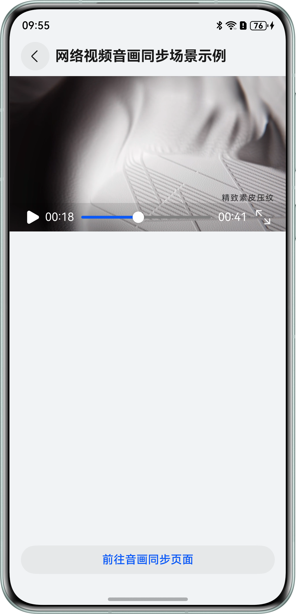
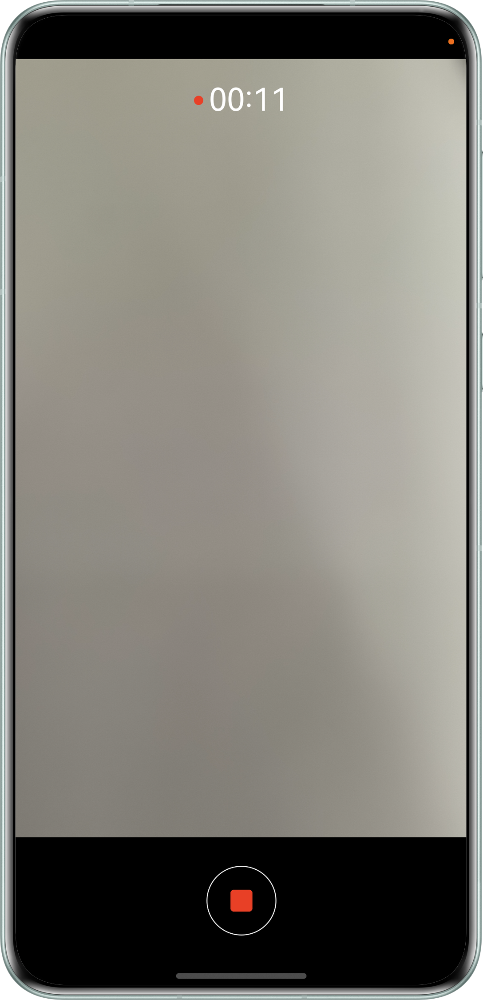
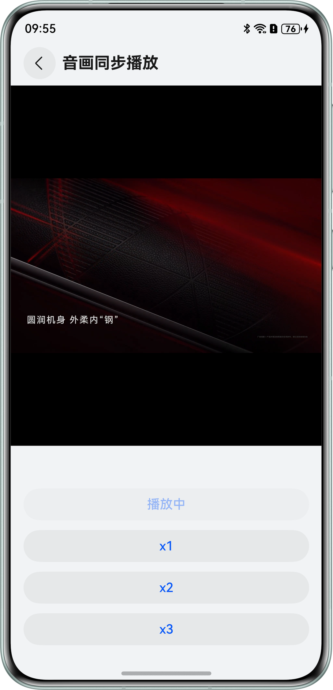

# 实现音画同步播放效果

## 介绍
本示例基于视频解码，通过计算音视频帧的延时进行音画同步适配，解决在本地视频播放、网络视频播放和录制视频播放等场景的音画不同步问题。开发者在实现解码播放视频功能时，加入音画同步模块，保持视频画面和音频同步播放，让用户在高时延场景下观看视频有更好的体验。

## 效果预览
| 应用首页                                       | 网络视频播放页面                                       | 录制页面                                          | 音画同步播放页面                                    |
|--------------------------------------------|------------------------------------------------|-----------------------------------------------|---------------------------------------------|
|  |  |  |  |

## 使用说明
1. 打开应用，有三个场景供选择：本地视频音画同步场景、网络视频音画同步场景、录制视频音画同步场景。
2. 点击进入本地视频音画同步场景，从图库选择指定视频。
3. 进入音画同步页面，播放页面有x1、x2和x3快进功能选择。
4. 点击进入网络视频音画同步场景，提供了固定的网络视频，点击可以播放。
5. 点击进入音画同步页面，后续操作同步骤3。
6. 点击进入录制视频音画同步场景。
7. 进入录制页面，录制视频后，视频将保存在图库，并且拉起图库，选择指定视频，后续操作同步骤3。

## 工程目录
```       
├──entry/src/main/cpp                 // Native层
│  ├──capbilities                     // 能力接口和实现
│  │  ├──include                      // 能力接口
│  │  ├──AudioDecoder.cpp             // 音频解码实现
│  │  ├──AudioEncoder.cpp             // 音频编码实现
│  │  ├──Demuxer.cpp                  // 解封装实现
│  │  ├──Muxer.cpp                    // 封装实现
│  │  ├──VideoDecoder.cpp             // 视频解码实现
│  │  └──VideoEcoder.cpp              // 视频编码实现
│  ├──common                          // 公共模块
│  │  ├──dfx                          // 日志实现
│  │  ├──SampleCallback.cpp           // 编解码回调实现   
│  │  ├──SampleCallback.h             // 编解码回调定义
│  │  └──SampleInfo.h                 // 功能实现公共类  
│  ├──player                          // Native层
│  │  ├──Player.cpp                   // Native层播放功能调用逻辑的实现
│  │  ├──Player.h                     // Native层播放功能调用逻辑的接口
│  │  ├──PlayerNative.cpp             // Native层播放的入口实现
│  │  └──PlayerNative.h               // Native层播放的接口
│  ├──recorder                        // 录制接口
│  │  ├──Recorder.cpp                 // 录制功能接口实现
│  │  ├──Recorder.h                   // 录制功能接口定义
│  │  ├──RecorderNative.cpp           // 录制接口调用入口
│  │  └──RecorderNative.h             // 调用入口定义
│  ├──render                          // 送显模块接口和实现
│  │  ├──include                      // 送显模块接口
│  │  ├──PluginManager.cpp            // 送显模块管理实现
│  │  └──PluginRender.cpp             // 送显逻辑实现
│  ├──types                           // Native层暴露上来的接口
│  │  ├──libplayer                    // 播放模块暴露给UI层的接口
│  │  └──librecorder                  // 录制模块暴露给UI层的接口
│  └──CMakeLists.txt                  // 编译入口       
├──ets                                // UI层
│  ├──common                          // 公共模块
│  │  ├──utils                        // 公共工具类
│  │  │   ├──CameraCheck.ets          // 相机工具类
│  │  │   ├──DateTimeUtils.ets        // 时间工具类
│  │  │   ├──FileUtil.ets             // 文件工具类
│  │  │   ├──Logger                   // 日志工具类
│  │  │   ├──PermissionUtil           // 权限工具类
│  │  │   ├──RecorderUtil             // 视频录制工具类
│  │  │   ├──RouterUtil               // 路由工具类
│  │  │   └──TimeUtils                // 时间工具类
│  │  └──CommonConstants.ets          // 参数常量
│  ├──entryability                    // 应用的入口
│  │  └──EntryAbility.ets             // 入口函数类
│  ├──entrybackupability              // 应用的后台
│  │  └──EntryBackupAbility.ets       // 后台管理类
│  ├──model                           // 数据交互类
│  │   └──CameraDateModel.ets         // 相机参数数据类  
│  ├──pages                           // 页面
│  │  ├──Index.ets                    // 首页/场景选择页面
│  │  ├──NetworkVideo.est             // 网络视频播放页面
│  │  ├──PlayerSync.ets               // 音画同步播放页面
│  │  └──Recorder.ets                 // 相机录制页面
├──resources                          // 用于存放应用所用到的资源文件
│  ├──base                            // 该目录下的资源文件会被赋予唯一的ID
│  │  ├──element                      // 用于存放字体和颜色 
│  │  ├──media                        // 用于存放图片
│  │  └──profile                      // 应用入口首页
│  ├──en_US                           // 设备语言是美式英文时，优先匹配此目录下资源
│  └──zh_CN                           // 设备语言是简体中文时，优先匹配此目录下资源
└──module.json5                       // 模块配置信息
```

## 具体实现

### 视频解码部分

1. 用户点击播放按钮后，触发点击事件，调起PhotoViewPicker()接口，该函数会调起图库的选择文件模块，拿到用户选取视频的路径;
2. 用户选择文件成功后，playNative()接口调用PlayerNative::Play()函数，进行初始化并调用解码模块开始解码；
3. 解码器Start后，输入回调会调起，将待解码的数据填入OH_AVBuffer中，调用PushInputBuffer接口，送给解码器解码，每次Start后，至少要Push一次XPS帧；
4. 解码器每解出来一帧，输出回调就会调起一次，用户需要及时调用送显或释放接口，归还buffer给解码器，由于解码器的buffer数量有上限，需要及时归还，否则达到上限后解码器就会停止工作，直到有buffer被归还；
5. 播放结束时，Callback()中napi_call_function()接口调起，执行对应的回调事件。

### 视频录制：

1. 通过cameraInput,获取相机采集数据，创建相机输入。
2. 创建previewOutput，获取预览输出流，通过XComponent的surfaceId连接，送显XComponent。
3. 通过surfaceId创建录像输出流VideoOutput输出到文件中。
4. 基于Recorder方法具体实现都封装在RecordController.ets，基于AVCodec方法具体实现都封装在AVCodecController.ets

### 音画同步部分

1. 收到视频帧的时候，通过调用OH_AudioRenderer_GetTimestamp()接口获取音频渲染位置等信息。
2. 音频未启动前，为避免出现卡顿等问题，暂不同步，视频帧直接送显。
3. 音频启动后，根据视频帧pts和音频渲染位置计算延迟，根据延迟选择音画同步策略：
    - 视频帧晚于音频帧40ms以上，直接丢弃此视频帧；
    - 视频帧晚于音频帧40ms以下，直接送显；
    - 视频帧早于音频帧时，进行渐进同步，等待一段时间送显。

## 相关权限

- 允许应用使用相机：ohos.permission.CAMERA。
- 允许应用使用麦克风：ohos.permission.MICROPHONE。

## 依赖

- 不涉及

## 约束与限制

1.本示例仅支持标准系统上运行，支持设备：直板机。

2.HarmonyOS系统：HarmonyOS 6.0.0 Release及以上。

3.DevEco Studio版本：DevEco Studio 6.0.0 Release及以上。

4.HarmonyOS SDK版本：HarmonyOS 6.0.0 Release SDK及以上。