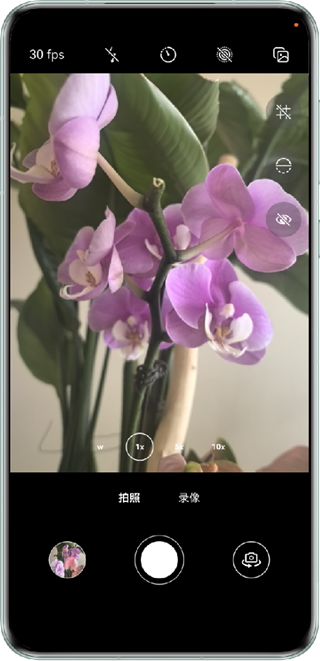

## 实现自定义相机功能

### 介绍

本示例基于Camera Kit相机服务，使用ArkTS API实现基础预览、预览画面调整（前后置镜头切换、闪光灯、对焦、调焦、设置曝光中心点等）、预览进阶功能（网格线、水平仪、人脸检测、超时暂停等）、双路预览（获取预览帧数据）、拍照（动图拍摄、延迟拍摄、音量键拍照等）、录像等核心功能。为开发者提供自定义相机开发的完整参考与实践指导。

### 效果预览

   &emsp;  

使用说明：
1. 打开应用，授权后展示预览界面。
2. 上方从左至右按钮功能依次为：预览帧率设置、闪光灯设置、延迟拍照模式设置、动态拍照模式设置、单双段拍照模式设置（单段拍照模式不支持动态拍摄）。
3. 切换录像模式，上方按钮依次为：预览帧率设置、闪关灯设置、防抖模式设置（模式不支持变焦）。
4. 右侧按钮依次为：网格线、水平仪、双路预览（获取预览帧数据）。
5. 下方按钮可拍照，录像，切换前后置摄像头。

### 工程目录

```
├──camera/src/           
│  ├──main/ets/  
│  │  ├──components             
│  │  │  ├──GridLine.ets                            // 网格线组件
│  │  │  └──LevelIndicator.ets                      // 水平仪组件
│  │  ├──constants
│  │  │  └──CameraConstants.ets                     // 常量文件
│  │  └──cameraManagers             
│  │     ├──CamaraManager.ets                       // 相机会话管理类
│  │     ├──ImageReceiverManager.ets                // ImageReceiver预览流管理类
│  │     ├──MetadataManager.ets                     // 元数据输出流管理类
│  │     ├──OutputManager.ets                       // 输出流管理类抽象接口
│  │     ├──PhotoManager.ets                        // 拍照流管理类
│  │     ├──VideoManager.ets                        // 视频流管理类
│  │     └──PreviewManager.ets                      // 预览流管理类 
│  └──Index.ets                                     // 相机模块导出文件
├──commons/src/main/ets/                               
│  └──utils           
│     └──Logger.ets                                 // 日志类  
├──entry/src/main/ets/                              
│  ├──constants
│  │  └──Constants.ets                              // 常量文件
│  ├──entryability
│  │  └──EntryAbility.ets                           // 程序入口类
│  ├──models             
│  │  └──CameraManagerModel.ets                     // 相机管理数据类
│  ├──pages             
│  │  └──Index.ets                                  // 入口预览页面
│  ├──utils             
│  │  ├──CommonUtil.ets                             // 通用工具函数模块
│  │  ├──PermissionManager.ets                      // 权限管理类
│  │  ├──RefreshableTimer.ets                       // 定时器管理类
│  │  └──WindowUtil.ets                             // 窗口工具类
│  ├──viewModels         
│  │  └──PreviewViewModel.ets                       // 预览相关的状态管理类   
│  └──views
│     ├──FuncButtonsView.ets                        // 拍照功能按钮视图
│     ├──ModeButtonsView.ets                        // 拍照模式切换按钮视图             
│     ├──OperateButtonsView.ets                     // 操作按钮视图 
│     ├──PreviewImageView.ets                       // 拍照结果预览视图 
│     ├──PreviewScreenView.ets                      // 预览画面视图
│     ├──SettingButtonsView.ets                     // 设置按钮视图            
│     └──ZoomButtonsView.ets                        // 设置焦距按钮视图  
└──entry/src/main/resources                         // 应用静态资源目录
```

### 具体实现

1. 使用Camera Kit相关能力。

### 相关权限

- ohos.permission.CAMERA：用于相机操作
- ohos.permission.MICROPHONE：麦克风权限，用于录像
- ohos.permission.MEDIA_LOCATION: 用于获取地理信息
- ohos.permission.WRITE_IMAGEVIDEO：用于写入媒体文件
- ohos.permission.READ_IMAGEVIDEO：用于读取媒体文件
- ohos.permission.APPROXIMATELY_LOCATION：用于获取设备模糊位置信息
- ohos.permission.ACCELEROMETER：用于加速度传感器


### 约束与限制

1.本示例仅支持标准系统上运行，支持设备：华为手机、平板。

2.HarmonyOS系统：HarmonyOS 5.1.1 Release及以上。

3.DevEco Studio版本：DevEco Studio 5.1.1 Release及以上。

4.HarmonyOS SDK版本：HarmonyOS 5.1.1 Release SDK及以上。

