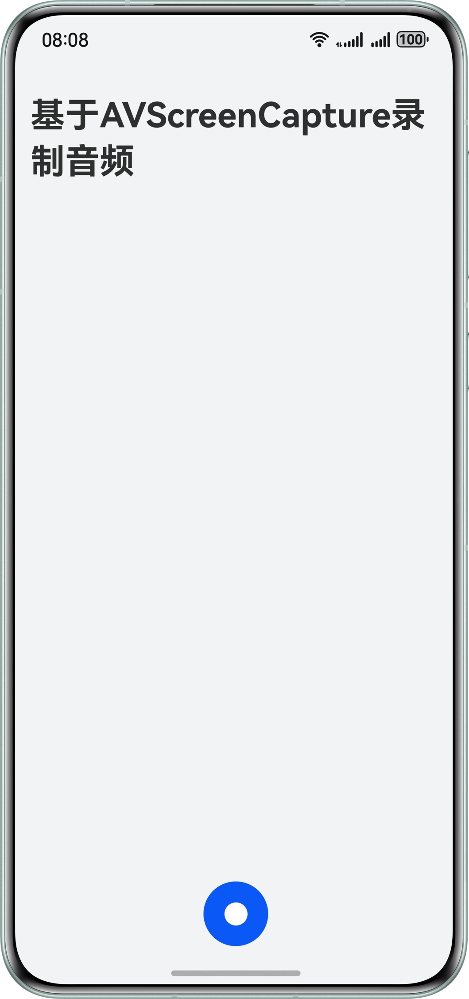

# 基于AVScreenCapture录制音频（C++）

## 项目简介

本示例基于AVScreenCapture(C++)实现了音频文件录制。AVScreenCapture可以实现屏幕录制和音频录制，开发者可以基于本示例实现音频文件录制，适用于实现简单音频录制并直接得到本地媒体文件的场景。

## 效果预览

| 首页                                                        | 录制页                                                        |
|-----------------------------------------------------------|------------------------------------------------------------|
|     |  |

## 使用说明

1. 打开应用，点击录制按钮进行音频录制。
2. 完成录制后返回，点击音频进行播放。

## 工程目录

```
├──entry/src/main/cpp                    // Native层
│  ├──capbilities                        // 接口能力实现
│  │  ├──AVScreenCapture.cpp             // 音频录制实现
│  │  └──AVScreenCapture.h               // 音频录制实现
│  ├──types                              // Native层暴露上来的接口
│  │  └──libentry                        // 录制模块暴露给UI层的接口
│  ├──CMakeLists.txt                     // 编译入口
│  └──napi_init.cpp                      // Native侧入口
├──ets                                   // UI层
│  ├──common                             // 公共模块
│  │  └──Constants.ets                   // 参数常量
│  ├──components                  
│  │  └──RecordDialog.ets                // 录制弹窗页面
│  ├──controller                         // 控制模块
│  │  └──AvPlayerController.ets          // AVplayer播放类
│  ├──entryability                       // 应用入口函数
│  │  └──EntryAbility.ets
│  ├──entrybackupability
│  │  └──EntryBackupAbility.ets
│  ├──model
│  │  └──RecordFileInfo.ets              // 录制文件实体
│  ├──pages
│  │  └──Index.ets                       // 首页
│  └──utils                              // 组件模块
│     ├──BackgroundTaskUtil.ets          // 后台任务工具类
│     ├──Logger.ets                      // 日志工具类
│     ├──PermissionUtil.ets              // 权限工具类
│     └──StringUtil.ets                  // 字符串工具类
├──resources                             // 静态资源文件
└──module.json5                          // 模块配置信息
```

## 具体实现

1. 在进入录制页面时，在Native侧创建AVScreenCapture对象。
2. 配置AVScreenCapture，包括音频配置和回调函数。
3. 启动音频录制。
4. 点击完成录制后，结束录制。

## 相关权限

1. 允许应用使用麦克风：ohos.permission.MICROPHONE。
2. 允许应用申请特殊类型长时任务：ohos.permission.KEEP_BACKGROUND_RUNNING。

## 约束与限制

1. 本示例仅支持标准系统上运行，支持设备：直板机。
2. HarmonyOS系统：HarmonyOS 6.0.0 Release及以上。
3. DevEco Studio版本：DevEco Studio 6.0.2 Release及以上。
4. HarmonyOS SDK版本：HarmonyOS 6.0.2 Release SDK及以上。