# ArkUI组件示例集合

## 项目简介

本项目是一个基于ArkUI的UI组件示例集合，旨在为开发者提供一套符合**HarmonyOS Design**设计规范的组件实现参考。

项目通过组合基础组件与样式特性，展示了如何在鸿蒙应用中打造具有“原生感”的视觉体验。开发者可以直接复用代码，或参考其实现逻辑定制自己的业务组件。本项目涵盖了六大类核心组件的样式与交互实现，具体包含：

- 操作类组件：[按钮](https://developer.huawei.com/consumer/cn/doc/design-guides/button-0000001929683228)、[核心操作栏](https://developer.huawei.com/consumer/cn/doc/design-guides/component_actionbar-0000002306891560)、[菜单](https://developer.huawei.com/consumer/cn/doc/design-guides/menu-0000001957001877)；
- 容器类组件：[半模态面板](https://developer.huawei.com/consumer/cn/doc/design-guides/bindsheet-0000001956852753)、[弹出框](https://developer.huawei.com/consumer/cn/doc/design-guides/dialog-0000001957012569)、[列表](https://developer.huawei.com/consumer/cn/doc/design-guides/list-0000001929853910)；
- 输入类组件：[数字加减](https://developer.huawei.com/consumer/cn/doc/design-guides/counter-0000001929853284)、[搜索框](https://developer.huawei.com/consumer/cn/doc/design-guides/search-0000001956852741)、[文本框](https://developer.huawei.com/consumer/cn/doc/design-guides/textinput-0000001957012557)；
- 导航类组件：[底部页签](https://developer.huawei.com/consumer/cn/doc/design-guides/bottomtab-0000001956787789)、[子页签](https://developer.huawei.com/consumer/cn/doc/design-guides/chipsgroup-0000001929788350)、[标题栏](https://developer.huawei.com/consumer/cn/doc/design-guides/titlebar-0000001929628982)；
- 展示类组件：[新事件标记](https://developer.huawei.com/consumer/cn/doc/design-guides/badge-0000001929816016)、[进度条](https://developer.huawei.com/consumer/cn/doc/design-guides/progress-0000001929656644)、[即时操作](https://developer.huawei.com/consumer/cn/doc/design-guides/component_snackbar-0000002340726169)、[即时反馈](https://developer.huawei.com/consumer/cn/doc/design-guides/toast-0000001929656648)；
- 选择类组件：[单选框](https://developer.huawei.com/consumer/cn/doc/design-guides/radio-0000001929853288)、[评分条](https://developer.huawei.com/consumer/cn/doc/design-guides/rating-0000001929853906)、[滑动条](https://developer.huawei.com/consumer/cn/doc/design-guides/slider-0000001957012565)、[开关](https://developer.huawei.com/consumer/cn/doc/design-guides/toggleswitch-0000001956852745)。

## 效果预览
|                     首页                      |                      按钮                      |                     核心操作栏                     |
| :-------------------------------------------: | :--------------------------------------------: | :------------------------------------------------: |
| 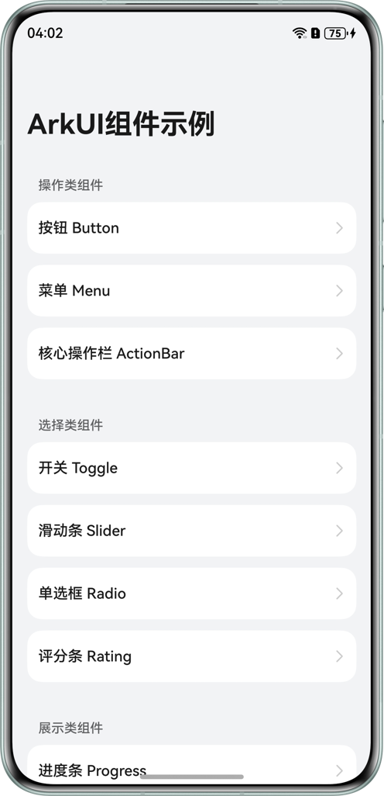 | 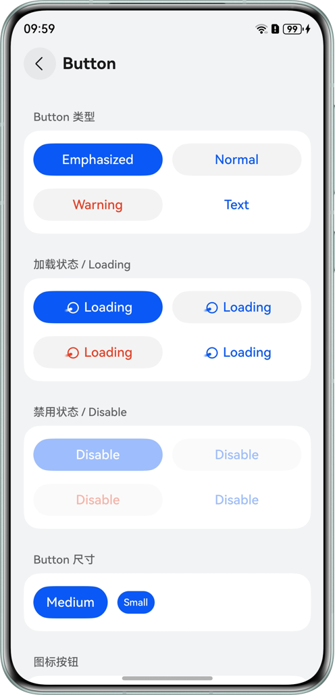 | 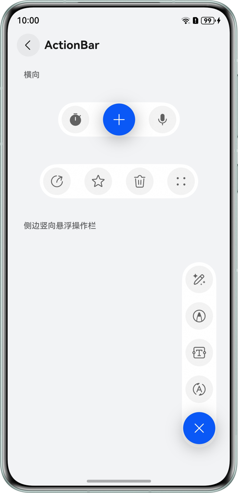 |

|                     菜单                     |                    半模态面板                     |                     弹出框                     |
| :------------------------------------------: | :-----------------------------------------------: | :--------------------------------------------: |
| 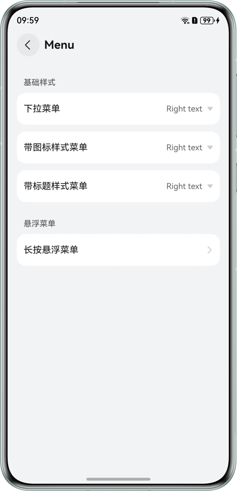 | 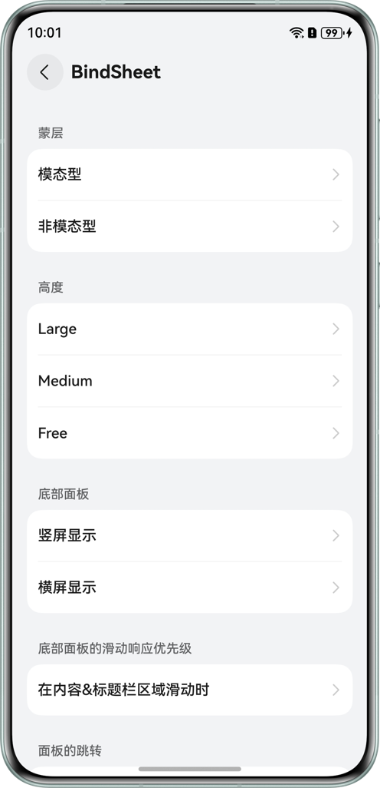 | 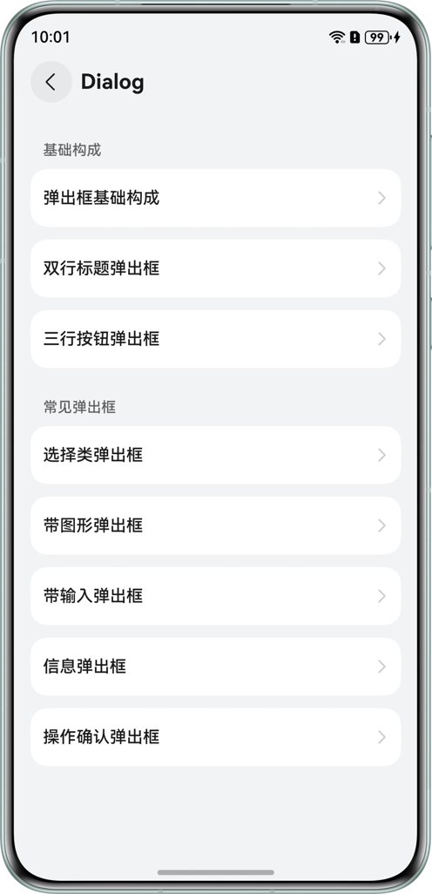 |

|                     列表                     |                    数字加减                     |                       搜索框                       |
| :------------------------------------------: | :---------------------------------------------: | :------------------------------------------------: |
| 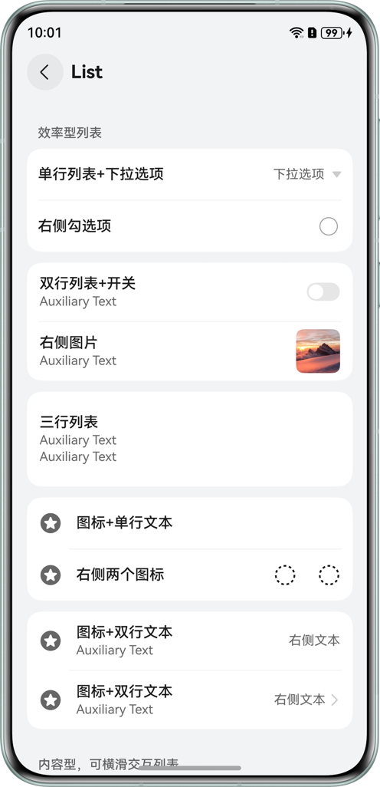 | 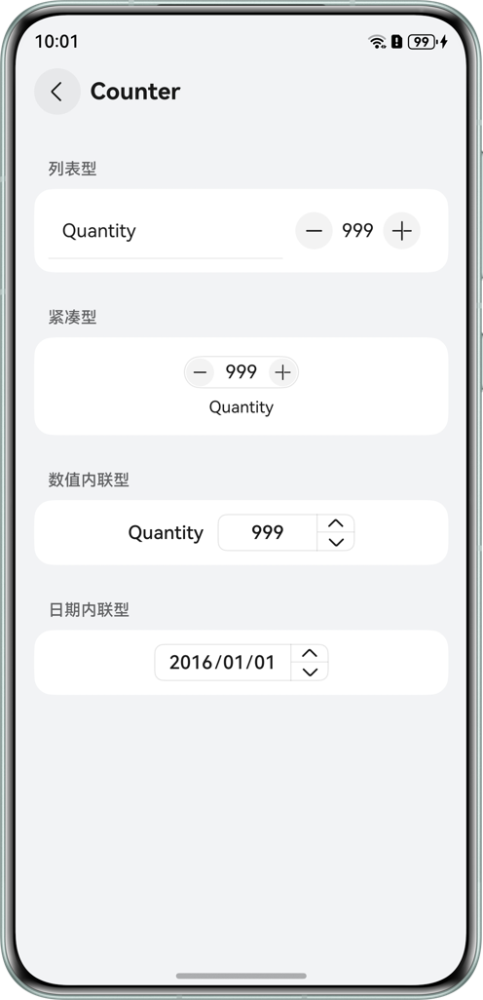 | 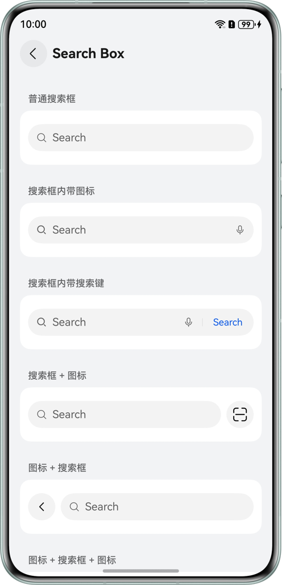 |

|                      文本框                      |                        底部页签                        |                      子页签                       |
| :----------------------------------------------: | :----------------------------------------------------: |:----------------------------------------------:|
| 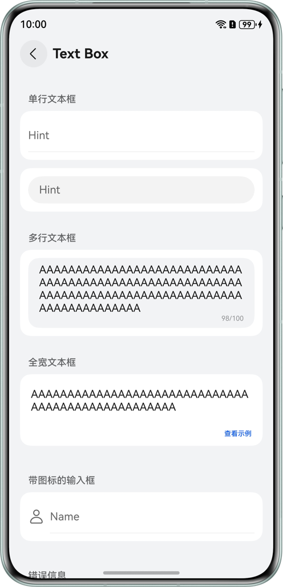 | 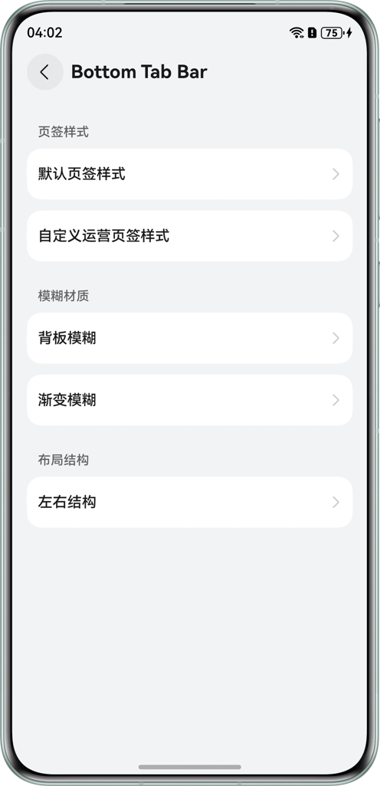 | 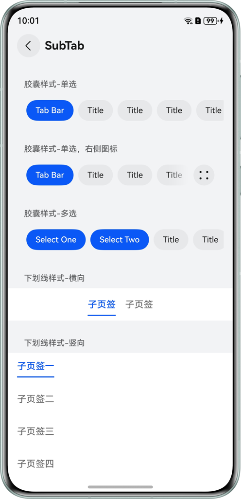 |

|                      标题栏                       |                  新事件标记                   |                      进度条                      |
| :-----------------------------------------------: | :-------------------------------------------: | :----------------------------------------------: |
| 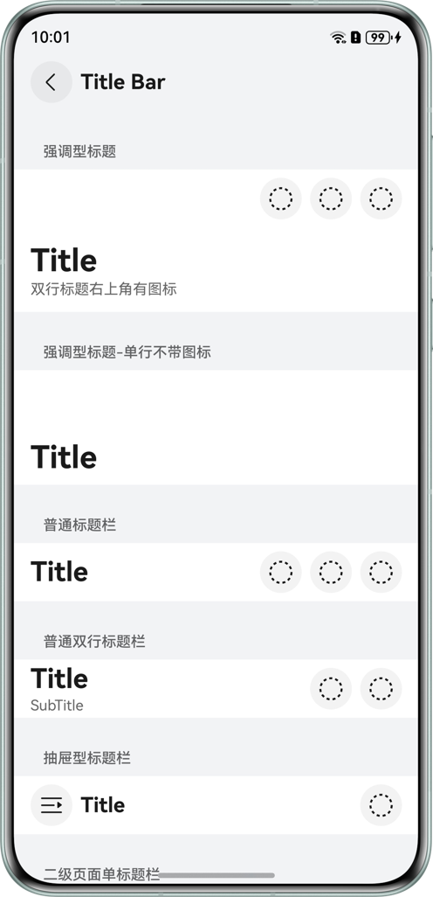 | 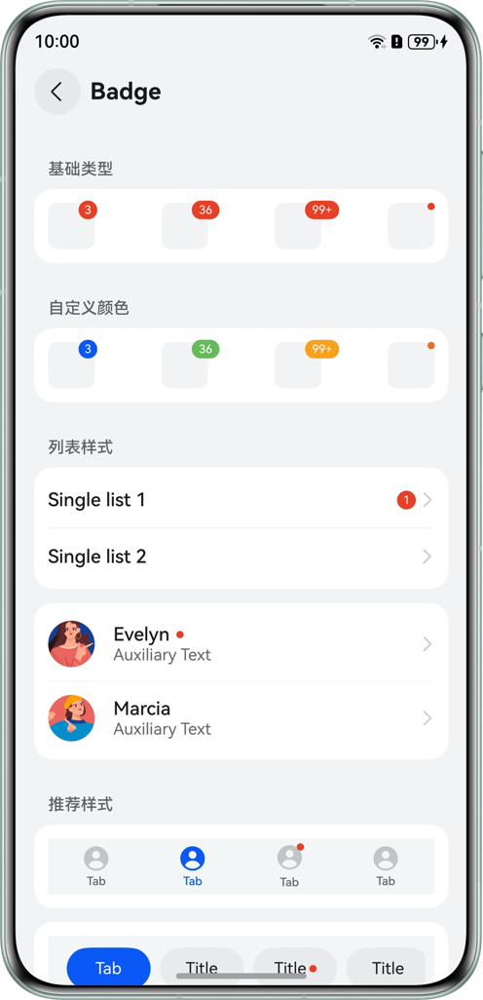 | 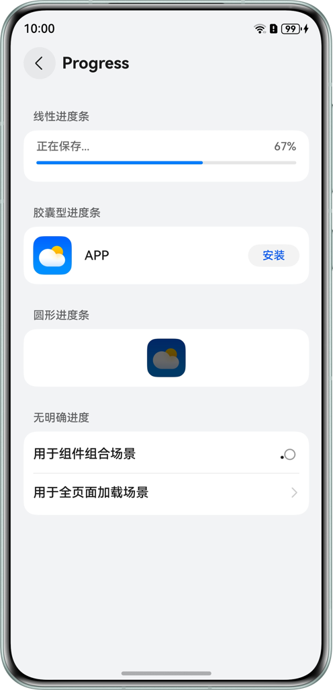 |

|                       即时操作                        |                   即时反馈                    |                    单选框                     |
| :---------------------------------------------------: | :-------------------------------------------: | :-------------------------------------------: |
| 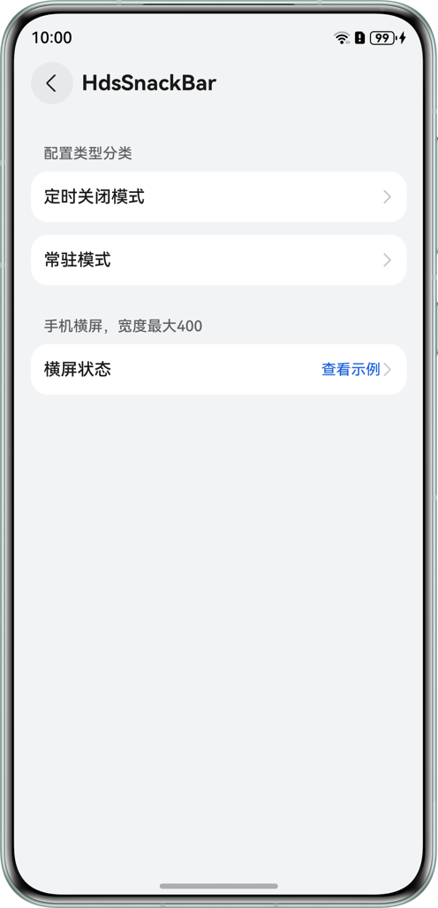 | 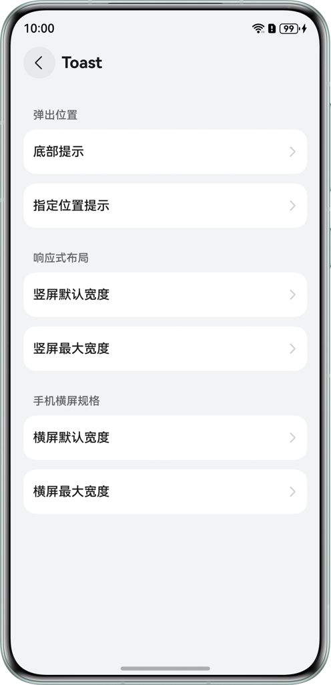 | 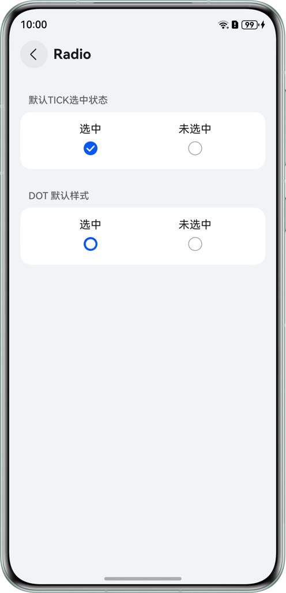 |

|                     评分条                     |                     滑动条                     |                      开关                      |
| :--------------------------------------------: | :--------------------------------------------: | :--------------------------------------------: |
| 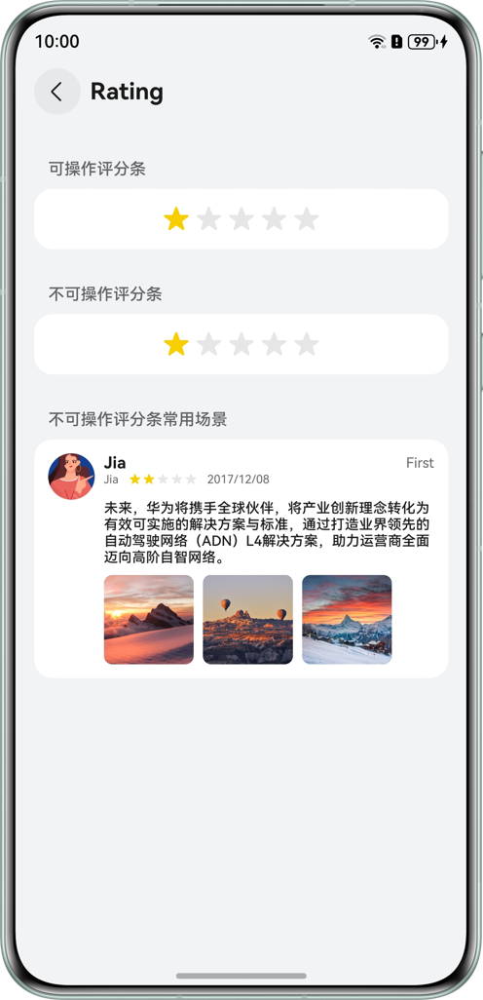 | 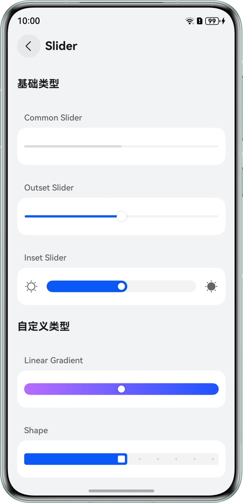 | 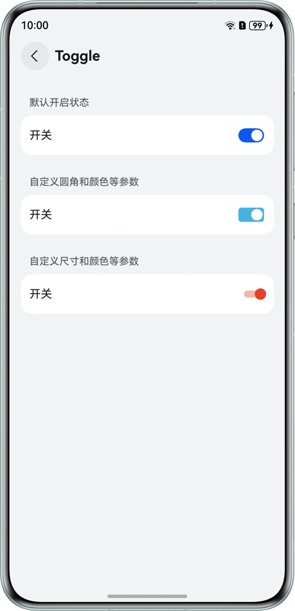 |


## 使用说明

1. 将独立的应用示例工程导入DevEco Studio进行编译构建及运行调试。
2. 安装运行后，即可在设备上查看应用示例运行效果，以及进行相关调试。

## 工程目录

```
├──entry/src/main/ets
│  ├──builder
│  │  └──CustomBuilder.ets                         // 自定义构建器函数
│  ├──components                                   // UI组件库根目录
│  │  ├──action                                    // 【操作类】组件目录
│  │  │  ├──actionbar                              // 操作栏模块
│  │  │  │  ├──ActionBarExample.ets                // 操作栏使用示例页面
│  │  │  │  └──components
│  │  │  │     ├──CollapsedActionBar.ets           // 可折叠式操作栏组件
│  │  │  │     ├──HorizontalActionBar.ets          // 水平布局操作栏组件
│  │  │  │     └──VerticalActionBar.ets            // 垂直布局操作栏组件
│  │  │  ├──button                                 // 按钮模块
│  │  │  │  ├──ButtonExample.ets                   // 按钮使用示例页面
│  │  │  │  └──components
│  │  │  │     ├──ButtonSize.ets                   // 不同尺寸按钮组件
│  │  │  │     ├──ButtonType.ets                   // 不同类型按钮组件
│  │  │  │     ├──DisableButton.ets                // 禁用状态按钮组件
│  │  │  │     ├──IconButton.ets                   // 图标按钮组件
│  │  │  │     └──LoadingButton.ets                // 加载中状态按钮组件
│  │  │  └──menu                                   // 菜单模块
│  │  │     ├──MenuExample.ets                     // 菜单使用示例页面
│  │  │     └──components
│  │  │        ├──DropdownMenu.ets                 // 下拉菜单组件
│  │  │        ├──IconStyledMenu.ets               // 图标样式菜单组件
│  │  │        ├──LongPressFloatingMenu.ets        // 长按悬浮菜单组件
│  │  │        └──TitleStyledMenu.ets              // 标题样式菜单组件
│  │  ├──container                                 // 【容器类】组件目录
│  │  │  ├──bindsheet                              // 半模态转场/挂载页模块
│  │  │  │  ├──BindSheetExample.ets                // 半模态示例页面
│  │  │  │  ├──LandscapeBindSheetExample.ets       // 横屏半模态示例
│  │  │  │  └──components
│  │  │  │     ├──BindSheetConfig.ets              // 不同配置参数的半模态弹窗
│  │  │  │     └──MutiBindSheet.ets                // 多重面板的半模态弹窗
│  │  │  ├──dialog                                 // 弹窗模块
│  │  │  │  ├──DialogExample.ets                   // 弹窗使用示例页面
│  │  │  │  └──components
│  │  │  │     ├──ActionDialog.ets                 // 操作确认弹窗
│  │  │  │     ├──BaseDialog.ets                   // 基础弹窗封装
│  │  │  │     ├──CustomSelectDialog.ets           // 自定义选择弹窗
│  │  │  │     ├──GraphicDialog.ets                // 图文混合弹窗
│  │  │  │     ├──InputDialog.ets                  // 输入框弹窗
│  │  │  │     └──MessageDialog.ets                // 消息提示弹窗
│  │  │  └──list                                   // 列表模块
│  │  │     ├──ListExample.ets                     // 列表使用示例页面
│  │  │     └──components
│  │  │        ├──ActionList.ets                   // 可操作列表
│  │  │        ├──ContentList.ets                  // 内容型列表
│  │  │        └──EfficientList.ets                // 效率型列表
│  │  ├──input                                     // 【输入类】组件目录
│  │  │  ├──counter                                // 计数器模块
│  │  │  │  ├──CounterExample.ets                  // 计数器使用示例页面
│  │  │  │  └──components
│  │  │  │     ├──CompactCounter.ets               // 紧凑型计数器
│  │  │  │     ├──InlineCounter.ets                // 数值内联计数器
│  │  │  │     ├──InlineDateCounter.ets            // 日期内联计数器
│  │  │  │     └──ListCounter.ets                  // 列表型计数器
│  │  │  ├──search                                 // 搜索模块
│  │  │  │  ├──SearchBoxExample.ets                // 搜索框使用示例页面
│  │  │  │  └──components
│  │  │  │     ├──IconSearch.ets                   // 纯图标搜索入口
│  │  │  │     ├──MixedStyleSearch.ets             // 混合样式搜索框
│  │  │  │     ├──RecommendedStyleSearch.ets       // 推荐样式搜索框
│  │  │  │     ├──SearchBoxWithSearchButton.ets    // 带搜索按钮的搜索框
│  │  │  │     └──StandardSearch.ets               // 标准搜索框
│  │  │  └──textbox                                // 文本输入框模块
│  │  │     ├──FullWidthDetailTextBox.ets          // 全宽详情输入框页面
│  │  │     ├──TextBoxExample.ets                  // 输入框使用示例页面
│  │  │     ├──components
│  │  │     │  ├──FullWidthTextBox.ets             // 全宽输入框组件
│  │  │     │  ├──IconTextBox.ets                  // 带图标输入框组件
│  │  │     │  ├──MultiLineTextBox.ets             // 多行文本输入框
│  │  │     │  ├──PasswordTextBox.ets              // 密码/隐藏文本输入框
│  │  │     │  ├──SingleLineTextBox.ets            // 单行文本输入框
│  │  │     │  ├──TextBoxWithCounter.ets           // 带字数统计输入框
│  │  │     │  └──TextBoxWithError.ets             // 带错误提示输入框
│  │  │     └──model
│  │  │        └──TextBoxStorage.ets               // 输入框数据存储模型
│  │  ├──navigation                                // 【导航类】组件目录
│  │  │  ├──bottomtabbar                           // 底部页签栏模块
│  │  │  │  ├──BackdropBlurStyleTabBar.ets         // 背景模糊风格页签
│  │  │  │  ├──BottomTabBarExample.ets             // 底部页签示例页面
│  │  │  │  ├──DefaultStyleTabBar.ets              // 默认风格页签
│  │  │  │  ├──GradientBlurTabBar.ets              // 渐变模糊风格页签
│  │  │  │  ├──LeftRightLayoutTabBar.ets           // 左右布局页签
│  │  │  │  ├──RudderStyleTabBar.ets               // 舵式风格页签
│  │  │  │  └──model
│  │  │  │     └──BottomTabModel.ets               // 底部页签数据模型
│  │  │  ├──subtab                                 // 顶部/子页签模块
│  │  │  │  ├──SubTabBarExample.ets                // 子页签示例页面
│  │  │  │  └──components
│  │  │  │     ├──CapsuleStyle.ets                 // 胶囊样式页签
│  │  │  │     └──UnderlineStyle.ets               // 下划线样式页签
│  │  │  └──titlebar                               // 标题栏模块
│  │  │     ├──TitleBarExample.ets                 // 标题栏示例页面
│  │  │     └──components
│  │  │        ├──BaseTitle.ets                    // 基础标题栏
│  │  │        ├──DrawerTitle.ets                  // 抽屉式标题栏
│  │  │        ├──EditableTitle.ets                // 可编辑标题栏
│  │  │        ├──EmphasizedTitle.ets              // 强调型标题栏
│  │  │        └──SecondaryPageTitle.ets           // 二级页面标题栏
│  │  ├──presentation                              // 【展示类】组件目录
│  │  │  ├──badge                                  // 角标/徽章模块
│  │  │  │  ├──BadgeExample.ets                    // 角标使用示例页面
│  │  │  │  └──components
│  │  │  │     ├──BaseBadge.ets                    // 基础角标
│  │  │  │     ├──CustomColoredBadge.ets           // 自定义颜色角标
│  │  │  │     ├──ListViewBadge.ets                // 列表视图角标
│  │  │  │     └──RecommendedStyleBadge.ets        // 推荐样式角标
│  │  │  ├──progress                               // 进度条模块
│  │  │  │  ├──LoadingProgressExample.ets          // 加载进度示例
│  │  │  │  ├──ProgressExample.ets                 // 进度条示例页面
│  │  │  │  └──components
│  │  │  │     ├──CapsuleProgress.ets              // 胶囊形进度条
│  │  │  │     ├──CircleProgress.ets               // 环形进度条
│  │  │  │     ├──LinearProgress.ets               // 线性进度条
│  │  │  │     └──LoadingStyleProgress.ets         // 加载样式进度条
│  │  │  ├──snackbar                               // 提醒条（即时操作组件）模块
│  │  │  │  ├──HdsSnackBarExample.ets              // 提醒条示例
│  │  │  │  ├──LandscapeSnackBarExample.ets        // 横屏提醒条示例
│  │  │  │  └──components
│  │  │  │     └──CommonSnackBar.ets               // 通用提醒条组件
│  │  │  └──toast                                  // 气泡提示/吐司模块
│  │  │     ├──BottomToast.ets                     // 底部气泡提示
│  │  │     ├──DesignatedPositionToast.ets         // 指定位置气泡提示
│  │  │     ├──LandscapeDefaultWidthToast.ets      // 横屏默认宽度提示
│  │  │     ├──LandscapeMaxWidthToast.ets          // 横屏最大宽度提示
│  │  │     ├──PortraitDefaultWidthToast.ets       // 竖屏默认宽度提示
│  │  │     ├──PortraitMaxWidthToast.ets           // 竖屏最大宽度提示
│  │  │     └──ToastExample.ets                    // 气泡提示使用示例
│  │  └──select                                    // 【选择类】组件目录
│  │     ├──radio                                  // 单选框模块
│  │     │  ├──RadioExample.ets                    // 单选框示例页面
│  │     │  └──components
│  │     │     ├──DotRadio.ets                     // 圆点样式单选框
│  │     │     └──TickRadio.ets                    // 对勾样式单选框
│  │     ├──rating                                 // 评分模块
│  │     │  ├──RatingExample.ets                   // 评分示例页面
│  │     │  └──components
│  │     │     ├──InteractiveRating.ets            // 可交互评分组件
│  │     │     └──NonInteractiveRating.ets         // 仅展示评分组件
│  │     ├──slider                                 // 滑动条模块
│  │     │  ├──SliderExample.ets                   // 滑动条示例页面
│  │     │  └──components
│  │     │     ├──BaseSlider.ets                   // 基础滑动条
│  │     │     ├──CombinationTypeSlider.ets        // 组合类型滑动条
│  │     │     └──CustomSlider.ets                 // 自定义滑动条
│  │     └──toggle                                 // 开关/切换模块
│  │        ├──ToggleExample.ets                   // 开关示例页面
│  │        └──components
│  │           ├──CustomToggle.ets                 // 自定义开关组件
│  │           └──DefaultToggle.ets                // 默认开关组件
│  ├──constants
│  │  └──CommonConstants.ets                       // 通用常量定义
│  ├──designtoken
│  │  ├──Color.ets                                 // 颜色token值
│  │  ├──CornerRadius.ets                          // 圆角半径token值
│  │  ├──Padding.ets                               // 边距token值
│  │  ├──Size.ets                                  // 尺寸token值
│  │  └──Space.ets                                 // 间距token值
│  ├──entryability
│  │  └──EntryAbility.ets                          // 应用入口能力类(Ability)
│  ├──entrybackupability
│  │  └──EntryBackupAbility.ets                    // 数据备份恢复能力类
│  ├──model
│  │  ├──BreakpointModel.ets                       // 断点/屏幕适配逻辑模型
│  │  └──BreakpointType.ets                        // 断点类型定义
│  ├──pages
│  │  └──Index.ets                                 // 应用首页/组件列表页
│  └──utils
│     ├──CommonUtils.ets                           // 通用工具类
│     ├──CryptoUtil.ets                            // 加解密工具类
│     ├──Logger.ets                                // 日志打印工具
│     └──WindowUtil.ets                            // 窗口管理工具
└──entry/src/main/resources                        // 应用资源目录
```

## 具体实现

本示例主要基于ArkTS声明式开发范式，利用HarmonyOS组件能力进行封装和扩展，实现了六大类符合HarmonyOS Design规范的UI组件。所有核心组件代码均位于`entry/src/main/ets/components`目录下，具体实现细节如下：

- **操作类组件 (`components/action`)**
  - **按钮**：基于`Button`组件进行样式组合，实现了加载中 、带图标、禁用态以及不同尺寸样式的按钮。
  - **核心操作栏**：基于`HdsActionBar`组件，实现了横向和垂直样式的核心操作类。
  - **菜单**：利用`Menu`和`MenuItem`组件，实现了下拉菜单、带图标样式菜单、带标题样式菜单以及长按悬浮菜单 (`LongPressFloatingMenu`) 交互形态的菜单。
- **容器类组件 (`components/container`)**
  - **半模态面板**：核心使用`bindSheet` 绑定构建函数，实现了模态型、非模态型、不同高度、竖屏以及横屏样式的半模态面板，同时实现了不同滑动响应优先级、同一面板内页面转换以及多重面板交互的半模态面板。
  - **弹出框**：基于`CustomContentDialog`、`SelectDialog`以及`TipsDialog`实现了基础类型、双行标题类型、选择类、带图形、带输入框、带提示信息以及带操作确认按钮的弹出框。
  - **列表**：使用`List` 、` ListItem`、 `ListItemGroup`组件，重点展示了效率型列表以及内容型列表。
- **输入类组件 (`components/input`)**
  - **搜索框**：基于`Search`组件，定制了带图标、带搜索按键以及样式组合的搜索框。
  - **文本框**：基于`TextInput`和`TextArea`组件定制了单行文本框、多行文本框、全宽文本框、带图标的文本框、错误类型、带字符计数器以及密码样式的文本类输入框。
  - **计数器（数字加减）**：通过组合`Advance.Counter`组件，实现了列表型、紧凑型 (上下布局型)、数字内联型以及日期内联型的数字加减交互。
- **导航类组件 (`components/navigation`)**
  - **底部页签**：使用`Tabs`和`HdsTabs`组件配合自定义`tabBar`，实现了背景模糊、渐变模糊等高级视觉效果，并提供了左右结构以及适配分栏布局的不同布局规则的底部页签效果。
  - **子页签**：基于`ChipGroup`以及`Tabs`组件，实现了胶囊样式、横向下划线样式以及竖向下划线样式的子页签效果。
  - **标题栏**：基于`HdsNavDestination`、`EditableTitleBar`组件，实现了强调型、普通单行、普通双行、抽屉型、二级页面单行、二级页面双行以及可编辑类型的标题栏。
- **展示类组件 (`components/presentation`)**
  - **新事件标记**：基于`Badge`组件，实现了基础类型、自定义颜色、列表和底部页签上的新事件标记。
  - **进度条**：基于`Progress`组件，实现了线性进度条、胶囊型进度条、圆形进度条；基于`LoadingProgress`实现了无明确进度的显示加载动效的效果。
  - **即时操作**：基于`HdsSnackBar`组件，实现定时关闭模式、常驻模式以及横屏状态下的即时操作栏。
  - **即时反馈**：基于`PromptAction`中的`showToast`，实现了不同弹出位置、竖屏模式下默认宽度、竖屏模式下最大宽度、横屏模式下默认宽度以及最大宽度的`Toast`弹窗。
- **选择类组件 (`components/select`)**
  - **单选框**：基于`Radio`组件，实现了勾号样式以及圆点样式的单选框。
  - **评分条**：基于`Rating`组件，实现了可操作类型评分条以及不可操作类型评分条。
  - **滑动条**：基于`Slider`组件，实现了基础类型、自定义类型以及常用组合类型的滑动条。
  - **开关**：基于`Toggle`组件，实现了默认开启/关闭状态、自定义圆角、自定义颜色、自定义尺寸样式的开关。


## 相关权限

不涉及。

## 约束与限制

1. 本示例仅支持标准系统上运行，支持设备：直板机、双折叠（Mate X系列）、三折叠。
2. HarmonyOS系统：HarmonyOS 6.0.2 Release及以上。
3. DevEco Studio版本：DevEco Studio 6.0.2 Release及以上。
4. HarmonyOS SDK版本：HarmonyOS 6.0.2 Release SDK及以上。