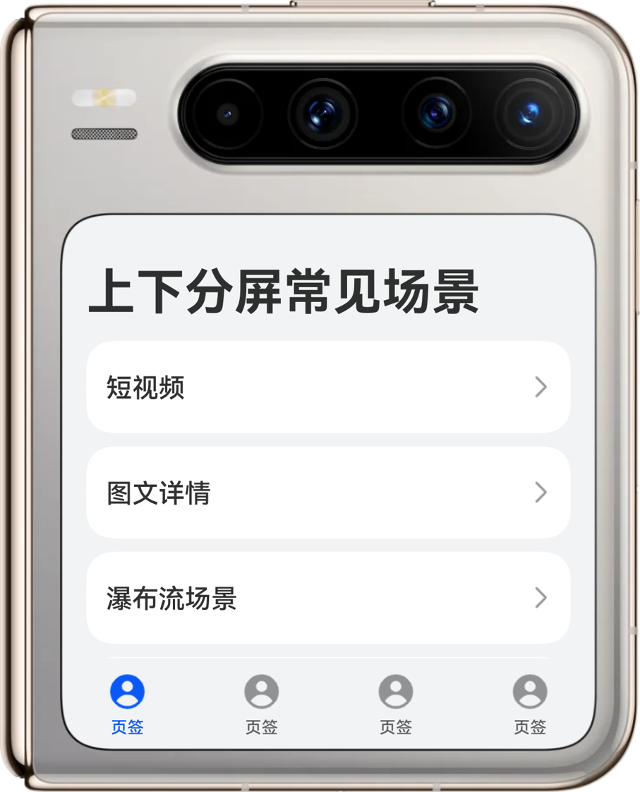
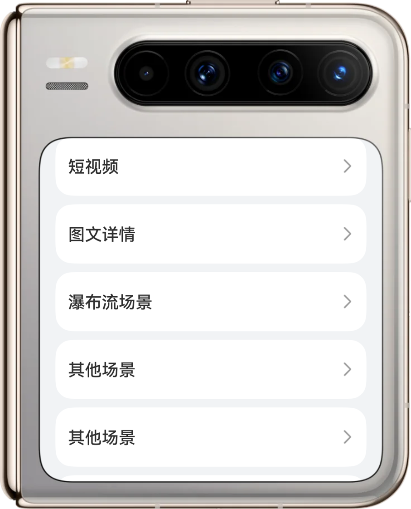
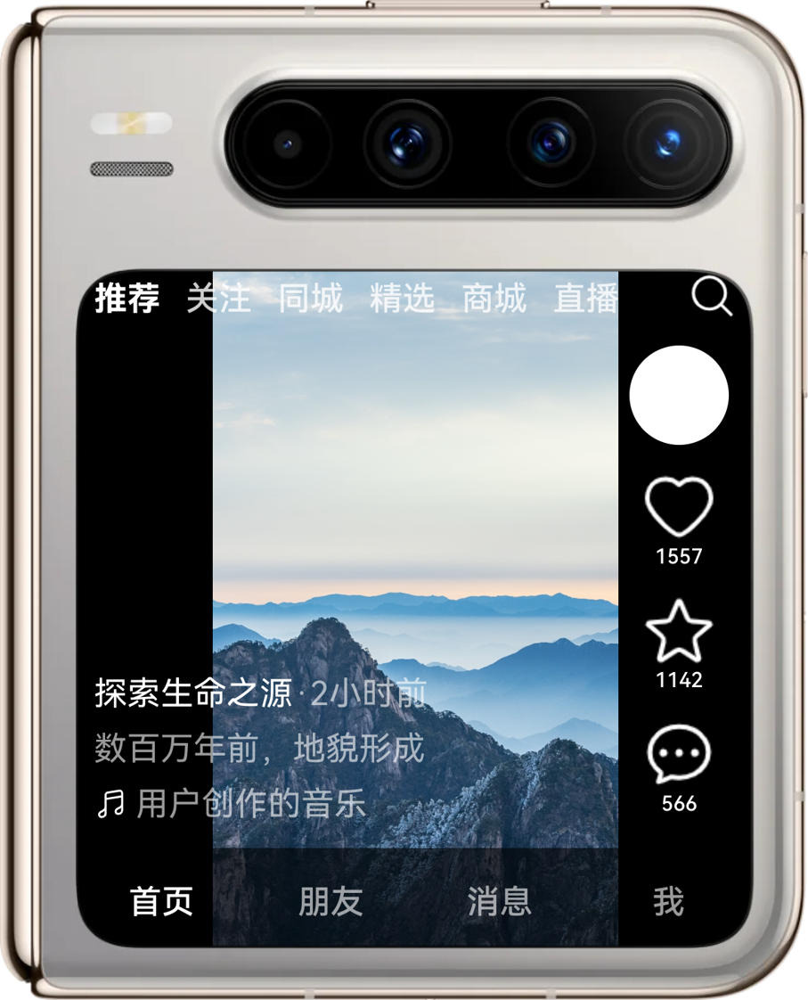
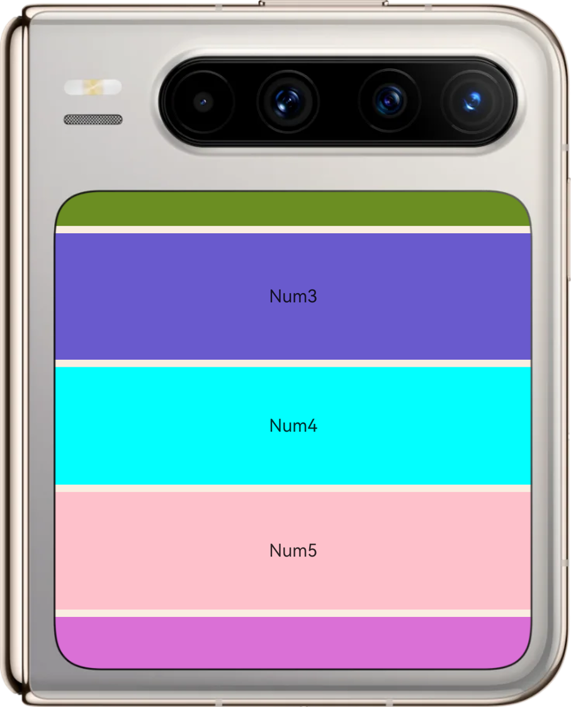
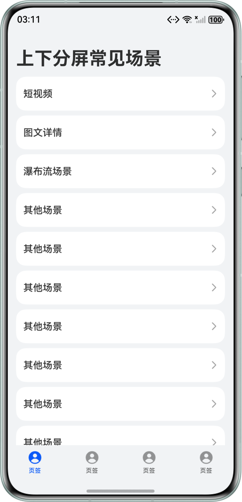
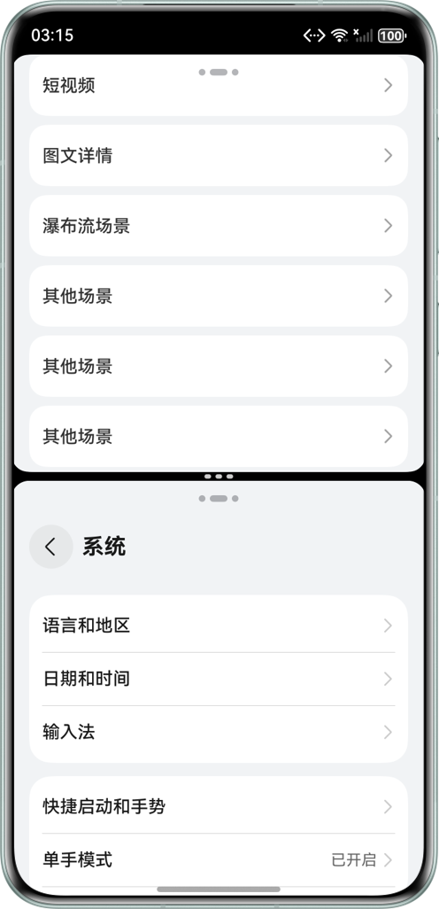
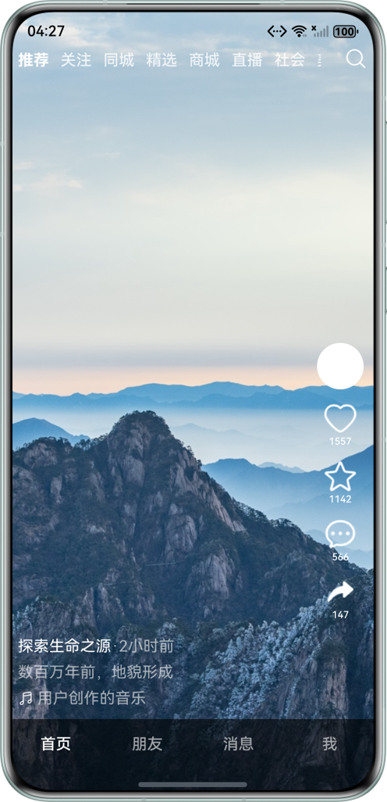
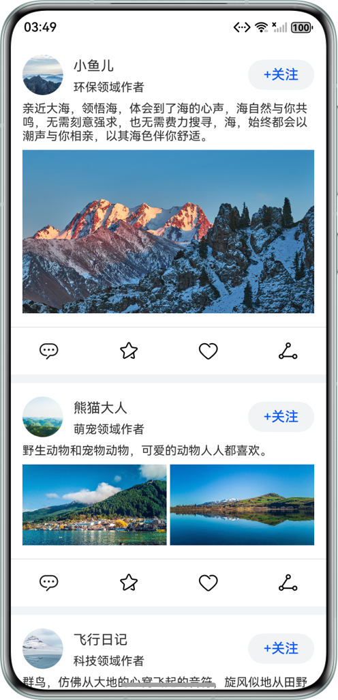
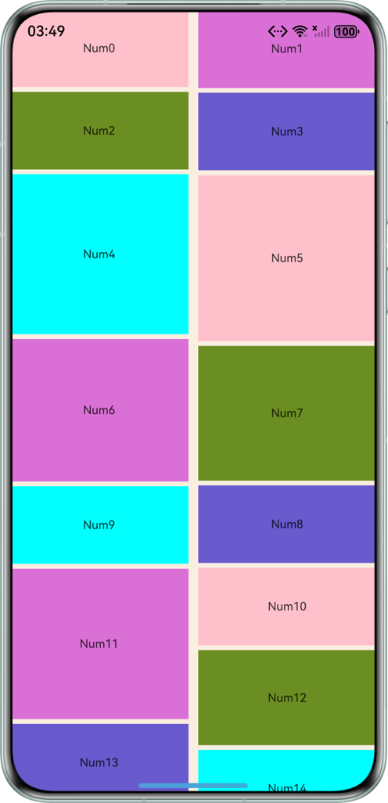

# 基于上下分屏实现滑动沉浸式浏览能力

### 介绍

本示例介绍应用在手机（直板机）上下分屏或Pura X外屏使用时的典型场景适配，包含使用List组件或Scroll组件滑动能力相关事件实现滑动沉浸式浏览，使用Scroll组件实现页面支持滑动，使用Stack组件实现短视频播放页，和使用constraintSize限制约束尺寸实现弹窗适配小窗口。

### 效果图预览

|          | 首页                                                    | 首页/分屏（动沉浸式浏览）                                                  | 短视频                                                   | 图文详情                                                  | 瀑布流场景                                                 |
|----------|-------------------------------------------------------|----------------------------------------------------------------|-------------------------------------------------------|-------------------------------------------------------|-------------------------------------------------------|
| Pura X外屏 |  |  |  |  |  |
| 直板机      |  |  |  |  |  |


### 使用说明

1. 打开应用，从底部导航条向左上角拖动应用至上下分屏。
2. 首页支持滑动沉浸式浏览，顶部标题栏和底部页签栏在滑动时隐藏，停止时使用延时动画逐渐恢复。
3. 点击短视频列表项，进入短视频播放页，侧边控件支持可滑动，点击分享按钮弹窗，弹窗支持可滑动且最大高度不超过父组件高度90%。
4. 返回首页，点击图文详情列表项，进入图文详情页，图文详情页页面支持滑动。
5. 返回首页，点击瀑布流场景，切换内外屏时，保持阅读焦点不偏移（保证屏幕可视区域的最小索引值不变）。

### 目录结构

```
entry/src/main/ets
│  ├──constants
│  │  └──CommonConstants.ets
│  ├──entryability
│  │  └──EntryAbility.ets                        // 应用入口类
│  ├──entrybackupability
│  │  └──EntryBackupAbility.ets
│  ├──pages
│  │  └──Index.ets                               // 首页
│  ├──utils
│  │  ├──WaterFlowDataSource.ets                 // 瀑布流数据源操作类
│  │  └──WindowUtil.ets                          // 窗口工具类
│  ├──viewmodels
│  │  ├──BlogViewModel.ets                       // 博客模型类
│  │  └──SideIconViewModel.ets                   // 侧边按钮模型类
│  └──views
│     ├──BlogView.ets                            // 博客视图类
│     ├──DetailView.ets                          // 图文详情视图类
│     ├──ShareDialog.ets                         // 分享弹窗类
│     ├──ShortVideoView.ets                      // 短视频视图类
│     ├──SourceView.ets                          
│     └──WaterFlowView.ets                       // 瀑布流视图类
└────entry/src/main/resources 
```

### 相关权限
不涉及。

### 依赖
不涉及。

### 约束与限制

1.本示例仅支持标准系统上运行，支持设备：华为手机。

2.HarmonyOS系统：HarmonyOS 5.0.5 Release及以上。

3.DevEco Studio版本：DevEco Studio 5.0.5 Release及以上。

4.HarmonyOS SDK版本：HarmonyOS 5.0.5 Release SDK及以上。