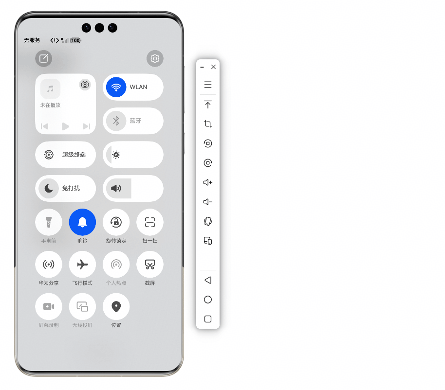

# 窗口方向

## 项目简介

本示例以窗口旋转策略实现的高频场景为载体，通过窗口级配置实现多设备的窗口方向变化。示例中实现了开发中的五个典型场景：应用首页、横竖屏游戏、图库、个股详情页&股票K线图页以及视频详情页&全屏播放页。

## 效果预览
以首页案例为例的效果图。

| 直板机、双折叠折叠态、三折叠F态                                        | 双折叠展开态、三折叠M态、三折叠G态、平板                                    |
|---------------------------------------------------------|----------------------------------------------------------|
|  |  |

## 使用说明

1. 通过Navigation组件，配置应用的路由信息。
2. 通过点击主页List的ListItem跳转进入对应的高频场景案例中。
3. 在高频场景案例的主页aboutToAppear()生命周期中设置窗口级的窗口旋转策略，并在退出当前页面时恢复上一页面的窗口策略。
4. 对于不同场景及不同设备形态切换做监听，更新符合用户体验的窗口旋转策略。

## 工程目录

```

├──commons                                  // 公共常量及工具
├──features                                 // 程序har包
│  ├──home/src/main/ets                     // 首页案例代码区
│  │  ├──model 
│  │  │  └──TabBarModel.ets                 // 底部导航条数据模型
│  │  ├──viewmodel 
│  │  │  ├──TabBarViewModel.ets             // 底部导航条视图模型
│  │  │  └──WaterFlowDataSource.ets         // 瀑布流视图模型
│  │  └──views 
│  │     └──Home.ets                        // 首页案例主页
│  ├──landscapeModeGame/src/main/ets        // 横屏游戏代码区
│  │  └──views 
│  │     └──LandscapeModeGame.ets           // 横屏游戏主页
│  ├──photos/src/main/ets                   // 图库代码区
│  │  ├──model 
│  │  │  └──PhotsTabBarModel.ets            // 图库底部导航条数据模型
│  │  ├──viewmodel 
│  │  │  ├──ListDataSource.ets              // 图库列表视图模型
│  │  │  └──PhotoTabBarViewModel.ets        // 图库底部导航条视图模型
│  │  └──views 
│  │     └──Photos.ets                      // 图库主页
│  ├──portraitModeGame/src/main/ets         // 竖屏游戏代码区
│  │  ├──constants 
│  │  │  └──PortraitConstants.ets           // 竖屏游戏常量
│  │  └──views 
│  │     └──PortraitModeGame.ets            // 竖屏游戏主页
│  ├──stockDetail/src/main/ets              // 个股详情页&股票K线图
│  │  ├──chartmodels 
│  │  │  ├──BarChartView.ets                // 股票图表
│  │  │  ├──ChartAxisFormatter.ets          // 图标数据格式化
│  │  │  └──LineChartModel.ets              // 图标数据模型
│  │  ├──model 
│  │  │  └──DataModel.ets                   // 股票数据模型
│  │  └──views 
│  │     ├──ABAWindow.ets                   // 股票K线页
│  │     ├──CommonViews.ets                 // 通用视图页
│  │     ├──StockDealDetails.ets            // 个股交易信息页
│  │     ├──StockDetail.ets                 // 个股详情主页
│  │     └──StockDetailsInfo.ets            // 个股详情信息页
│  └──videoDetail/src/main/ets              // 视频详情页&全屏播放页
│     ├──components 
│     │  ├──AllComments.ets                 // 所有基础组件汇总
│     │  ├──RelatedList.ets                 // 相关信息列表组件
│     │  └──VideoPlayer.ets                 // 播放器组件
│     ├──viewmodel 
│     │  ├──RelatedVideoViewModel.ets       // 相关视频视图模型
│     │  └──UserViewModel.ets               // 用户信息视图模型
│     └──views 
│        ├──VideoDetail.ets                 // 视频详情页
│        └──VideoDetailView.ets             // 全屏播放页
└──products                                 // 设备分类
   ├──default/src/main/ets                  // 主页代码区
   │  ├──defaultbackupability 
   │  │  └──DefaultBackupAbility.ets        // 数据备份与恢复扩展能力
   │  ├──entryability 
   │  │  └──EntryAbility.ets                // 程序入口
   │  ├──model 
   │  │  └──CardListModel.ets               // 主页列表数据模型
   │  ├──pages 
   │  │  └──Index.ets                       // 主页
   │  └──viewmodel 
   │     └──CardListViewModel.ets           // 主页列表试图模型
   └──default/src/main/resources   
      └──base/profile    
         ├──backup_config.json              // 应用数据备份配置文件
         └──main_pages.json                 // 窗口方向配置文件

```

## 具体实现

1. 通过homePage及relatedPage字段，配置应用的主页及关联页。
2. 通过fullScreenPages属性指定全屏页，配置后，对应页面展示时，将暂时退出分栏模式，切换为全屏显示。
3. 将supportLandscapeFullScreen属性设置为true，配置后，当应用请求横屏时，将退出分栏模式，切换为全屏显示。
4. 将enableReducedContainerSize属性设置为true，开启虚拟容器能力。开启后，页面中横向断点将使用原始尺寸的缩小比例，默认按照真实大小的一半计算。

## 相关权限

不涉及

## 约束与限制

1. 本示例仅支持在标准系统上运行，支持设备：直板机、双折叠、三折叠、平板。
2. HarmonyOS系统：HarmonyOS 6.1.0 Release及以上。
3. DevEco Studio版本：DevEco Studio 6.1.0 Release及以上。
4. HarmonyOS SDK版本：HarmonyOS 6.1.0 Release SDK及以上。
