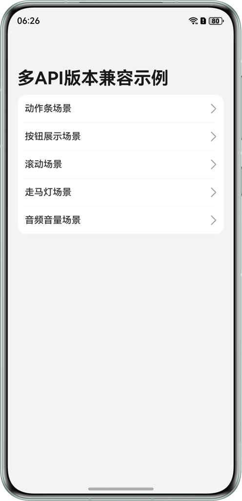
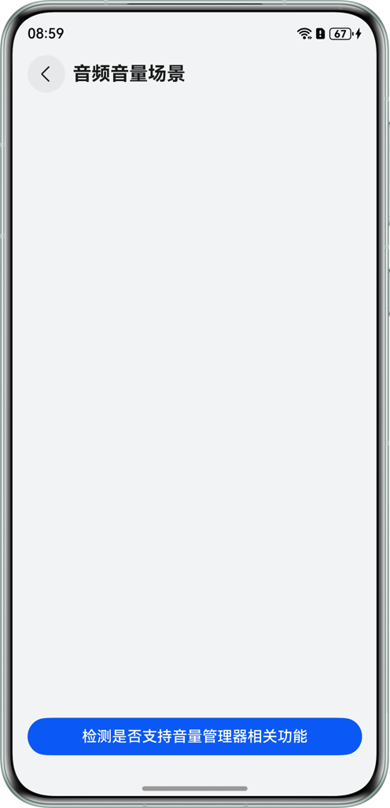

# 实现多API版本兼容

## 项目简介
本项目演示在 HarmonyOS 多版本环境下，如何在同一套代码中实现 API 能力探测与优雅降级，进而实现优雅的 API 兼容策略，覆盖 ArkTS层与Native层两类典型场景：

1. **ArkTS（UI 层）**：通过 `deviceInfo.sdkApiVersion` / `deviceInfo.distributionOSApiVersion` 判断系统版本，选择高版本新特性或低版本替代实现。
2. **Native（NAPI/C++ 层）**：
   - 通过 `dlopen + dlsym` 对动态库符号进行探测，判断某个系统 API 是否存在，从而避免低版本调用导致崩溃。
   - 通过OH_GetDistributionOSApiVersion()获取ISV发行版系统api版本并判断系统版本，选择高版本新特性或低版本特性替代实现。

## 效果预览
|                     首页                     |                   滚动场景                   |                 音频音量场景                 |
| :------------------------------------------: | :------------------------------------------: | :------------------------------------------: |
|  |  |  |

## 使用说明

1. 使用git clone下载该项目代码，并将整个应用示例工程导入DevEco Studio。

2. 打开Terminal终端，使用下面的命令初始化并更新引用的所有子模块：

   ```
   git submodule update --init --recursive
   ```

3. 执行编译构建，安装运行后，即可在设备上查看应用示例运行效果，以及进行相关调试。

## 工程目录

```
├──entry/src/main/cpp
│  ├──classdef
│  │  ├──include
│  │  │  ├──ArkUIBaseNode.h                      // 组件树操作的基类
│  │  │  ├──ArkUINode.h                          // 通用组件的封装
│  │  │  ├──ArkUIButtonNode.h                    // 实现按钮组件的封装类
│  │  │  └──NativeModuleInstance.h               // ArkUI在Native侧模块的封装接口
│  │  └──src
│  │     ├──ArkUIBaseNode.cpp                    // 组件树操作的基类
│  │     ├──ArkUINode.cpp                        // 通用组件的封装
│  │     ├──ArkUIButtonNode.cpp                  // 实现按钮组件的封装类
│  │     └──NativeModuleInstance.cpp             // ArkUI在Native侧模块的封装接口
│  ├──function
│  │  ├──include
│  │  │  ├──IntegratingWithArkts.h               // 接入ArkTS界面
│  │  │  └──NativeEntry.h                        // 管理Native组件生命周期
│  │  └──src
│  │     └──IntegratingWithArkts.cpp             // 接入ArkTS界面
│  ├──libboundscheck                             // libboundscheck三方库
│  └──types
│  │  └──libentry
│  │     ├──Index.d.ts                           // Native侧接口导出声明文件
│  │     └──oh-package.json5
│  ├──CMakeLists.txt                             // cmake配置文件
│  └──napi_init.cpp                              // 接口映射、模块注册
├──entry/src/main/ets                            // 代码区
│  ├──constants
│  │  └──CommonConstants.ets                     // 常量类
│  ├──entryability
│  │  └──EntryAbility.ets                        // 程序入口类
│  ├──entrybackupability                  
│  │  └──EntryBackupAbility.ets                  // 应用数据备份和恢复类
│  ├──pages 
│  │  ├──ActionBarScene.ets                      // HdsActionBar组件版本兼容示例展示页
│  │  ├──AudioVolumeScene.ets                    // 音频音量场景兼容示例展示页
│  │  ├──ButtonDisplayScene.ets                  // Button组件版本兼容示例展示页                           
│  │  ├──Index.ets                               // 首页                        
│  │  ├──MarqueeDisplayScene.ets                 // 走马灯场景兼容性示例展示页                    
│  │  └──ScrollScene.ets                         // 滚动场景兼容示例展示页
│  └──utils
│     ├──CommonUtils.ets                         // 通用工具类
│     └──Logger.ets                              // 日志工具类
└──entry/src/main/resources                      // 应用资源目录
```

## 具体实现
本项目采用**版本适配**与**能力探测**相结合的兼容性策略，确保应用在不同 HarmonyOS 发行版及 API 版本上均能实现功能平滑过渡与稳定运行。

### 1. ArkTS 层兼容性适配

在 ArkTS 层，以**版本判断**为核心依据，驱动 UI 渲染与逻辑能力的差异化实现：

- **版本判断基准**： 利用 `deviceInfo.sdkApiVersion` 和 `deviceInfo.distributionOSApiVersion` 接口精确获取系统软件及发行版 API 版本，作为后续适配逻辑的“数据源”。
- **基于版本的适配场景**：
  - **UI 组件差异化渲染**：针对不同版本的 UI 规范进行降级或增强处理。
    - *ActionBar*：在 API 6.0.0+ 环境中调用增强型组件 `HdsActionBar`，低版本则回退至基础组件模拟实现。
    - *Text 跑马灯*：根据版本特性，仅在 API 18+ 环境下动态开启跑马灯动画效果。
  - **特性按需动态装配**：采用“配置驱动”的开发模式。
    - *Scroll 组件*：依据当前 API 版本（如 API 12/18/20）查阅官网API参考文档，动态注册对应的交互能力；同时使用 `WeakSet` 避免重复绑定，确保内存安全。

### 2. Native 层兼容性适配

在 Native 层，通过**逻辑分支**与**符号探测**双重机制保障底层兼容性：

- **版本阈值判定**： 通过 `OH_GetDistributionOSApiVersion()` 获取 ISV 发行版版本号，与预设的版本阈值（如 `50101` 对应版本 `5.1.1`）进行比对，在运行时自动切换匹配当前系统的 UI 枚举值或业务逻辑。
- **动态符号探测**： 为避免因调用低版本缺失的 API 而导致 Crash，采用 `dlopen` 加载系统库并配合 `dlsym` 进行运行时符号探测。仅在探测到符号存在时才进行调用，从而在 C/C++ 层实现严格的防御性编程。

## 相关权限
不涉及

## 约束与限制

1. 本示例仅支持标准系统上运行，支持设备：华为手机。
2. HarmonyOS系统：HarmonyOS 5.0.5 Release及以上。
3. DevEco Studio版本：DevEco Studio 6.0.0 Release及以上。
4. HarmonyOS SDK版本：HarmonyOS 6.0.0 Release SDK及以上。

## 依赖

- 依赖[libboundscheck](https://gitcode.com/openeuler/libboundscheck)三方库