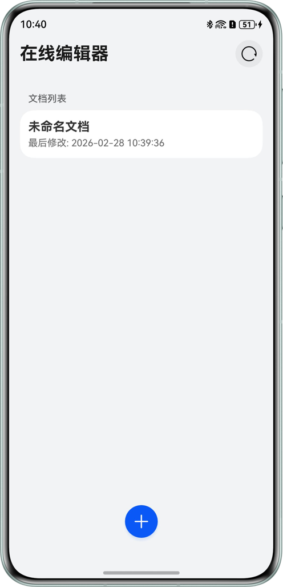
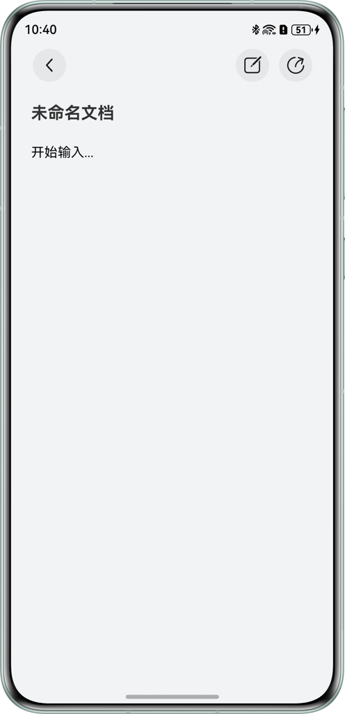
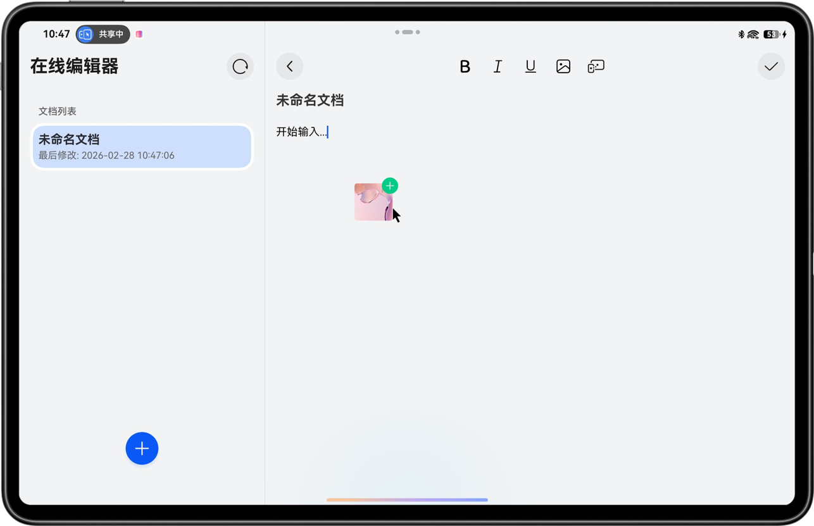
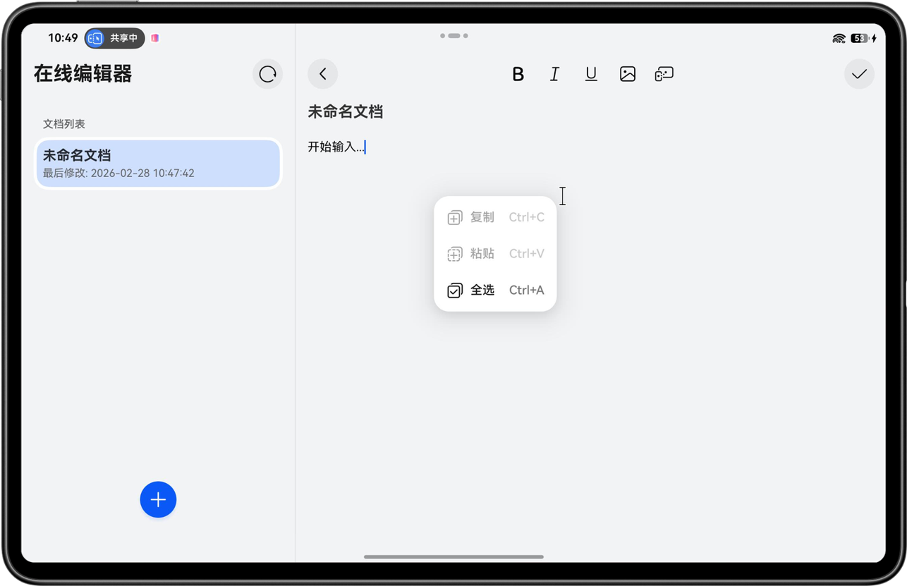
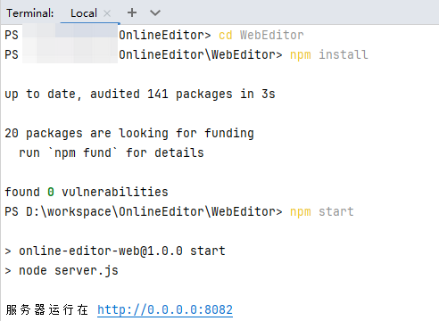

# 基于ArkWeb和自由流转实现办公编辑协同

## 项目简介

本示例基于ArkWeb和自由流转实现办公编辑协同，包括：在线文档编辑（如字体加粗、上传图片），以及跨设备协作（如跨设备剪贴板、跨设备拖拽以及在平板或PC/2in1设备上可调用手机的相机、扫描、图库等跨设备互通功能）。应用接入了华为分享能力，可通过分享面板、碰一碰或隔空传送将文档链接分享至其他设备；在PC/2in1上还支持碰一碰接收文件。本示例同时支持应用接续能力，便于在多个设备间快速切换。

## 效果预览

|                      **主页**                       |                     **编辑页**                      |                      **拖拽**                       |                      **剪贴**                       |
|:-------------------------------------------------:|:------------------------------------------------:|:-------------------------------------------------:|:-------------------------------------------------:|
|  |  |  |  |

## 使用说明

### 一、运行服务端

应用通过Web组件加载在线编辑器页面，所有文档数据、上传文件及实时协作均由本机或局域网内的Node服务端提供。**使用前必须先启动WebEditor服务端**，且确保运行应用的设备能访问该服务地址。

1. **环境要求**：本机已安装Node.js（建议v16及以上）。
2. **进入目录**：打开Terminal，在项目根目录下执行：
   ```bash
   cd WebEditor
   ```
3. **安装依赖**（首次运行或依赖变更时执行）：
   ```bash
   npm install
   ```
4. **启动服务**：
   ```bash
   npm start
   ```
5. **确认端口**：服务默认监听 **8082** 端口，启动成功后会输出类似 `Server running at http://0.0.0.0:8082`。
6. **配置应用中的服务地址**：HarmonyOS应用通过[Constants.ets](entry/src/main/ets/common/Constants.ets)中的`SERVER_IP`和`SERVER_PORT`访问服务端。请将`SERVER_IP`改为**运行上述服务的电脑在本机/局域网内的IP地址（运行服务端的设备和运行应用的设备都需要在同一局域网）**，`SERVER_PORT`与启动服务时的端口一致（默认8082）。修改后重新编译运行HarmonyOS应用即可。
7. **运行后效果如图所示**：


### 二、在线编辑器使用说明

- **文档列表（首页）**  
  进入应用后首先看到文档列表页，展示服务端已有的文档（标题、修改时间等）。在此可点击某条文档进入编辑，或通过点击底部加号图标创建新文档。当其他端文档列表变化时，可点击列表右上角刷新按钮同步。

- **创建新文档**  
  点击底部加号后，服务端会创建一篇新文档并返回其ID，应用自动跳转到该文档的编辑页面。新文档初始为简单占位内容，可直接开始编辑。

- **编辑文档**  
  - **文本输入与格式**：在编辑区域输入文字，可使用工具栏对选中内容进行加粗、斜体等格式设置。  
  - **插入图片**：通过编辑器内提供的插入图片入口，从本机图库选择图片，图片会经应用上传到服务端`uploads`目录，并在文档中插入对应引用。  
  - **保存**：编辑过程中或完成后，点击页面右上角保存按钮，会将当前文档标题与内容提交到服务端并保存；保存成功后可继续编辑或返回列表。
 
- **跨设备互通**
  在平板、PC/2in1设备上工具栏末尾还会显示一个跨设备互通图标，点击该图标可以调用其他设备的相机、扫描、图库等功能，将图片插入文档中。

- **跨设备拖拽**  
  - **使用限制**
    - 双端设备需要登录同一华为账号。
    - 双端设备需要打开Wi-Fi和蓝牙开关，并接入同一个局域网。
    - 打开键鼠共享开关，并在设置：多设备协同 -> 键鼠共享 -> 键鼠共享的设备列表中添加设备。
    - 应用本身预置的资源文件（即应用在安装前的HAP包中已经存在的资源文件）不支持跨设备拖拽。
  - **拖入**：从图库或其他支持拖拽的应用将图片、文字拖入编辑区域，应用会处理并上传到服务端，并在光标位置插入图片、文字。  
  - **拖出**：编辑区内的图片、文字可拖拽到其他应用，实现跨应用拖拽。

- **跨设备剪贴板**  
  在编辑页可使用系统剪切、复制、粘贴；若登录同一华为账号并满足跨设备协作条件，还支持跨设备剪贴板，在一台设备复制的内容可在另一台设备粘贴。

- **分享**  
  - **分享面板**
    - 文档预览模式下右上角有分享按钮图标，点击图标可将当前文档以链接形式分享出去。
  - **碰一碰**
    - 在文档页面可将文档通过碰一碰分享到对端设备。
  - **碰一碰PC/2in1设备接收文件**
    - **使用限制**
      - 手机与PC/2in1设备间碰一碰分享需登录相同的华为账号。
      - 仅支持直板手机或折叠手机直板态与PC/2in1屏幕碰一碰分享。
    - PC/2in1设备支持碰一碰接收文件，在编辑模式下通过碰一碰将文件插入到文档中，预览模式不支持碰一碰接收文件，可以分享链接给其他设备。
  - **隔空传送**
    - 隔空传送功能需在设置上打开“隔空传送”开关，在文档页面可将文档通过隔空传送分享到对端设备。

- **应用接续**  
  - **使用限制**
    - 双端设备需要登录同一华为账号。
    - 双端设备需要打开 WLAN 和蓝牙开关，或者在设置中的“多设备协同 > 高级”中启用“多设备协同增强服务”功能。
    - 双端设备需要在“设置”应用中开启“多设备协同 > 接续”功能。
    - 双端设备都需要安装该应用。
  - **接续**：在同一华为账号、多设备均安装本应用且满足接续条件时，可从一台设备“接续”到另一台设备，继续查看或编辑同一文档，减少重复打开与查找。

## 工程目录

```
├── AppScope                                                 // 应用全局配置
│   ├── resources                                            // 全局资源文件
│   └── app.json5                                            // 应用级配置（包名、版本等）
├── entry                                                    // 应用入口
│   ├── src                                                  // 源码目录
│   │   └── main                                             // 主模块
│   │       ├── ets                                          // ArkTS代码
│   │       │   ├── common                                   // 常量与全局配置
│   │       │   │   └── Constants.ets                        // 应用常量
│   │       │   ├── entryability                             // 应用入口能力
│   │       │   │   └── EntryAbility.ets                     // 主入口能力
│   │       │   ├── entrybackupability                       // 备份能力
│   │       │   │   └── EntryBackupAbility.ets               // 备份入口能力
│   │       │   ├── model                                    // 数据模型
│   │       │   │   ├── DocumentData.ets                     // 文档数据结构定义
│   │       │   │   ├── DocumentModel.ets                    // 文档列表/新建/删除HTTP服务
│   │       │   │   ├── DragDropModel.ets                    // 拖拽模型
│   │       │   │   ├── GesturesShareModel.ets               // 手势分享模型
│   │       │   │   ├── KnockShareModel.ets                  // 碰一碰分享模型
│   │       │   │   ├── ShareModel.ets                       // 分享模型
│   │       │   │   └── WebFileData.ets                      // Web文件数据模型
│   │       │   ├── pages                                    // 页面组件
│   │       │   │   └── Index.ets                            // 主页面
│   │       │   ├── utils                                    // 工具类
│   │       │   │   ├── CommonUtil.ets                       // 通用工具
│   │       │   │   ├── FileUploadUtil.ets                   // 文件上传至服务端
│   │       │   │   ├── HtmlRegexUtil.ets                    // HTML正则工具
│   │       │   │   ├── LanguageChangeListener.ets           // 系统语言切换监听
│   │       │   │   ├── NativeBridge.ets                     // Web桥接
│   │       │   │   ├── PermissionUtil.ets                   // 权限申请与校验
│   │       │   │   └── WebViewHelper.ets                    // WebView工具类
│   │       │   ├── view                                     // 视图组件
│   │       │   │   └── EditPage.ets                         // 编辑页面
│   │       │   └── viewmodel                                // 视图模型
│   │       │       ├── DocumentListDataSource.ets           // 文档列表数据源
│   │       │       ├── DocumentListViewModel.ets            // 文档列表视图模型
│   │       │       ├── EditViewModel.ets                    // 编辑页视图模型
│   │       │       └── IndexViewModel.ets                   // 编辑与跨设备协同核心ViewModel
│   │       ├── resources                                    // 应用资源
│   │       └── module.json5                                 // 模块配置
│   ├── build-profile.json5                                  // entry模块构建配置
│   ├── hvigorfile.ts                                        // entry模块构建脚本
│   └── oh-package.json5                                     // entry模块依赖配置
├── hvigor                                                   // 构建工具配置
│   └── hvigor-config.json5                                  // 构建工具配置文件
├── WebEditor                                                // Web编辑器实现
│   ├── public                                               // 前端静态资源
│   │   ├── docs                                             // 文档数据
│   │   ├── icons                                            // 图标资源
│   │   ├── js                                               // 前端脚本
│   │   ├── lib                                              // 第三方库
│   │   ├── uploads                                          // 上传文件存储
│   │   ├── edit.html                                        // 编辑页面HTML
│   │   ├── index.html                                       // 列表页面HTML
│   │   ├── i18n.js                                          // 国际化脚本
│   │   ├── script.js                                        // 前端入口与公共逻辑
│   │   └── styles.css                                       // 前端样式
│   ├── routes                                               // 后端路由
│   │   └── export.js                                        // 路由导出
│   ├── server.js                                            // 后端服务器
│   └── package.json                                         // Node依赖与脚本
├── build-profile.json5                                      // 构建配置
├── code-linter.json5                                        // 代码检查配置
├── hvigorfile.ts                                            // 构建脚本
└── oh-package.json5                                         // HarmonyOS包配置
```

## 具体实现

- **页面与路由**
  - **文档列表**：`pages/Index.ets`使用`DocumentListViewModel`拉取列表，通过`DocumentModel`请求`GET /api/documents`；新建文档调用`POST /api/document`后跳转编辑页；删除调用`DELETE /api/document/:id`。
  - **编辑页**：`view/EditPage.ets`内嵌`Web`组件，加载`${SERVER_URL}/edit.html?docId=${documentId}`，同一`WebviewController`由`IndexViewModel`持有，便于H5与HarmonyOS应用侧共享状态。

- **H5与应用通信**
  - 编辑页通过`Web`的`.javaScriptProxy()`注入`NativeBridge`实例为`window.nativeBridge`，H5调用`nativeBridge.handleAction(actionName, payload)`与HarmonyOS应用侧交互。

- **全场景协同能力**
  - **拖拽**：
    - H5设置属性`draggable="true"`支持拖拽能力。
    - [DragDropModel.ets](entry/src/main/ets/model/DragDropModel.ets)与编辑页配合处理`Web`的`onDrop`，将拖入的图片/文件上传至服务端`POST /api/upload`，并把结果通过`runJavaScript`等方式回写H5光标处。
  - **剪贴板**：系统剪贴板服务将处理相关数据，并完成数据同步，应用内默认支持。
  - **分享**：`ShareModel`聚合碰一碰分享链接、隔空传送分享链接、碰一碰接收文件。
    - **碰一碰分享链接**：由[KnockShareModel.ets](entry/src/main/ets/model/KnockShareModel.ets)实现；初始化后调用`startKnockListening()`，监听`harmonyShare.on('knockShare', { windowId }, callback)`，用户触发碰一碰后通过`target.share(shareData)`将当前文档链接分享给其他设备。
    - **隔空传送分享链接**：由[GesturesShareModel.ets](entry/src/main/ets/model/GesturesShareModel.ets)实现；初始化后调用`startGestureListening()`，监听`harmonyShare.on('gesturesShare', { windowId }, callback)`，用户触发隔空传送后通过`target.share(shareData)`将当前文档链接分享给其他设备。
    - **碰一碰接收文件**：由[KnockShareModel.ets](entry/src/main/ets/model/KnockShareModel.ets)实现；PC/2in1上编辑页通过`ShareModel.initKnockReceive()`调用`receiveLinkFromPeer(callback)`，监听`harmonyShare.on('dataReceive', { windowId, capabilities }, callback)`，收到对端碰一碰传来的文件后将文档上传至服务端并插入文档中；非编辑页调用`disableKnockReceive()`即`dataReceiveDisableListeningPC()`取消监听。
  - **跨设备互通**：通过同层渲染能力在编辑页H5内`<object type="test">`由ArkWeb的`enableNativeEmbedMode(true)`+`registerNativeEmbedRule('object','test')`识别，HarmonyOS侧在`onNativeEmbedLifecycleChange`中创建`CrossDeviceNodeController`，将服务互通按钮添加至H5页面，点击后可弹出服务互通菜单。
  - **应用接续**
    - **源端**：在[EntryAbility.ets](entry/src/main/ets/entryability/EntryAbility.ets)`onContinue`中，获取当前WebView地址（`IndexViewModel.currentInstance.controller.getUrl()`），写入`wantParam.webUrl`，供系统迁移到对端。
    - **对端**：在[EntryAbility.ets](entry/src/main/ets/entryability/EntryAbility.ets)`onCreate`或`onNewWant`中，根据`launchReason === CONTINUATION`从`want.parameters.webUrl`恢复接续数据，写入`IndexViewModel.continuationUrl`；在`pages/Index.ets`的`aboutToAppear`中根据`continuationUrl`解析文档ID（`parseDocIdFromUrl`），若为编辑页（含`/edit.html`）则调用`replacePathByName('edit', docId)`跳转到编辑页。

## 相关权限

| 权限                              | 用途    |
|---------------------------------|-------|
| ohos.permission.INTERNET        | 网络访问  |
| ohos.permission.READ_PASTEBOARD | 读取剪贴板 |

## 约束与限制

1. 本示例仅支持标准系统上运行，支持设备：直板机、双折叠（Mate X系列）、三折叠、阔折叠、平板、PC/2in1。

2. HarmonyOS系统：HarmonyOS 6.0.2 Release及以上。

3. DevEco Studio版本：DevEco Studio 6.0.2 Release及以上。

4. HarmonyOS SDK版本：HarmonyOS 6.0.2 Release SDK及以上。

5. 双端设备需要登录同一华为账号。

6. 双端设备需要打开Wi-Fi和蓝牙开关。条件允许时，建议双端设备接入同一个局域网，可提升数据传输的速度。

7. 应用接续只能在同应用之间触发，双端设备都需要有该应用。

8. 在设置中打开隔空传送、键鼠共享以及跨设备剪贴板功能。