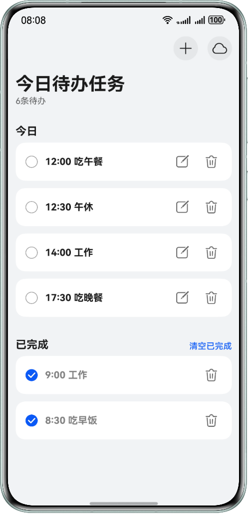

# 基于StateStore实现全局状态管理最佳实践

## 简介

本示例展示了使用StateStore状态管理库实现全局状态管理，覆盖场景：

- UI与状态数据解耦
- 子线程进行状态对象更新
- 状态更新日志埋点

解决开发者在使用ArkUI状态管理时UI组件和数据操作逻辑高度耦合的问题

## 效果预览



## 使用说明
1. 进入主页，点击右上角'+'，可以看见新建代办任务的弹窗，在里面输入框里输入完内容后，即可点击完成按钮，会在主页面显示。
2. 进入主页，点击任务条上面的编辑按钮，原内容后面可以继续输入任务内容，点击系统键盘的完成键即可保存。
3. 进入主页，点击任务条上面的删除按钮，会弹出是否删除该任务的弹窗，点击确认即可删除该任务，否则就取消当前操作。
4. 进入主页，点击任务条上的勾选框，会从下往上勾选。勾选完后，点击右上角的清空已完成字样，会有一个弹窗出来，点击确认会删掉勾选的所有任务。
5. 进入主页，点击右上角云朵图标，会同步数据到云端。

## 工程目录

```text
├──entry/src/main/ets                       // 代码区
├──components                               // UI组件
│   ├──AddSheetBuilder.ets                  // 添加todo弹窗
│   ├──AsyncProgress.ets                    // 同步进度条
│   ├──IconContainer.ets                    // Icon容器
│   └──TodoItem.ets                         // todoItem组件
├──entryability
│   └──EntryAbility.ets
├──middleware                               // 中间件
│   └──LoggerMiddleware.ets                 // 日志监控中间件
├──model                                    // 数据模型
│   └──TodoListModel.ets                    // todo列表数据
├──pages                                    // 页面
│   └──Index.ets                            // 主页
├──store                                    // store仓库
│   ├──TodoListActions.ets                  // action事件管理对象
│   ├──TodoListReducer.ets                  // reducer逻辑处理函数
│   └──TodoListStore.ets                    // todoListStore定义
└──utils                                    // 工具函数
    ├──GlobalContext.ets                    // 全局上下文工具
    ├──RdbUtil.ets                          // rdb工具
    ├──Sleep.ets                            // sleep函数
    └──TaskpoolUtil.ets                     // 子线程工具                                  
```

## 具体实现
StateStore是一款专为ArkUI深度定制的轻量级状态管理库，通过全家单例维护以HashMap存储的多实例Store，实现业务逻辑与UI的彻底解耦。其核心遵循Redux模式，在执行dispatch时，状态会严谨地流经中间件过滤、Action钩子链及Reducer更新，利用中间件的DROP或Action替换机制确保状态流转的一致性和可追溯行。该方案完美适配@Observed/@ObservedV2实现数据的响应式更新，并底层封装了Emitter与TaskPool/Worker机制，支持将@Sendable标记的任务在非UI线程处理后同步至主线程，有效解决复杂业务下的组件耦合难题，保障前台界面的极致流畅。

# StateStore简介

StateStore作为ArkUI状态与UI解耦的解决方案，支持全局维护状态，优雅地解决状态共享的问题。

StateStore库提供共享模块StateStore单例，支持根据唯一标识创建store存储对象，管理应用的全局状态，通过事件分发更新状态。依赖系统@Observed和@ObservedV2对数据改变监听的能力，驱动UI刷新。

目的是让开发者在开发过程中实现状态与UI解耦，多个组件可以方便地共享和更新全局状态，将状态管理逻辑从组件逻辑中分离出来，简化维护。

# 特性
+ 状态与UI解耦，支持数据全局化操作
+ 简化子线程并行化操作
+ 支持对数据逻辑执行预处理和后处理

# 依赖系统版本

- HarmonyOS 5.0.3 Release及以上

# 下载安装
## 使用ohpm安装依赖
```shell
ohpm install @hadss/state_store
```
> 或者按需在模块中配置运行时依赖，修改oh-package.json5
```json5
{
  "dependencies": {
    "@hadss/state_store": "^1.0.0-rc.2"
  }
}
```

# StateStore框架使用说明

[查看说明](https://gitcode.com/openharmony-sig/state_store/blob/master/README.md)

# StateStore接口和属性列表

[查看详情](https://gitcode.com/openharmony-sig/state_store/blob/master/docs/Reference.md)

# FAQ

[查看详情](https://gitcode.com/openharmony-sig/state_store/blob/master/docs/FAQ.md)

# 原理介绍

本解决方案的思路参考[redux](https://redux.js.org/api/store)和[vuex](https://vuex.vuejs.org/guide/actions.html)的全局状态管理的实现。具体原理可以学习redux和vuex，对理解本库的实现和使用有帮助。

# 相关权限
不涉及

# 约束与限制
+ 本示例仅支持标准系统上运行，支持设备：直板机、双折叠(Mate X系列)、三折叠、阔折叠、平板、PC/2in1。
+ HarmonyOS系统：HarmonyOS 5.0.3 Release及以上。
+ DevEco Studio版本：DevEco Studio 5.0.3 Release及以上。
+ HarmonyOS SDK版本：HarmonyOS 5.0.3 Release SDK及以上。

# 开源协议

本项目基于 [Apache License 2.0](./LICENSE) ，请自由地享受和参与开源。