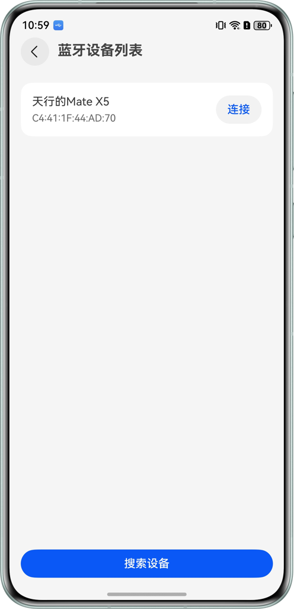
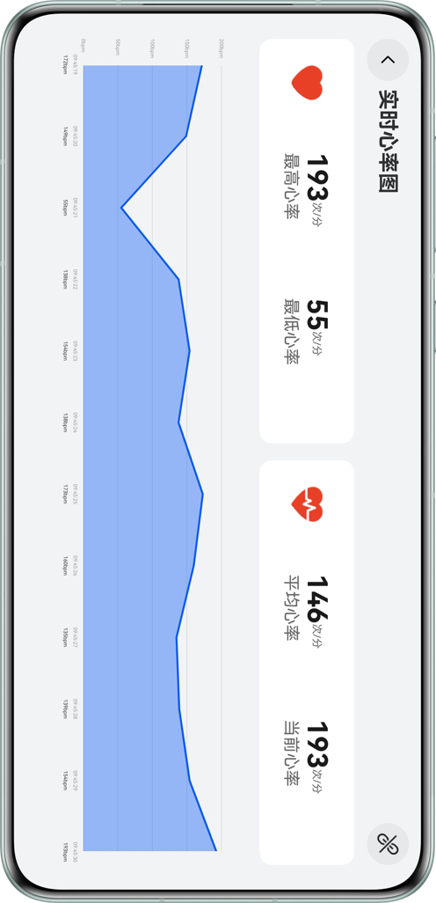
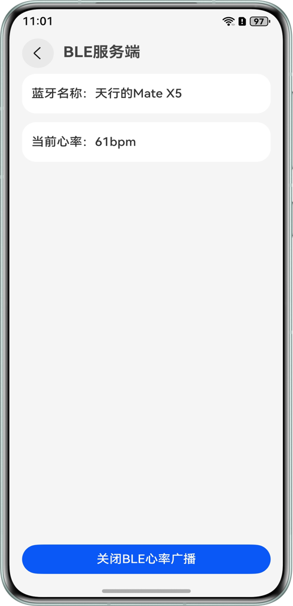

# 基于低功耗蓝牙实现设备间连接通信的能力

## 项目介绍
低功耗蓝牙（简称BLE）它是一种能够在低功耗情况下进行通信的蓝牙技术，与传统蓝牙相比，BLE的功耗更低，适用于需要长时间运行的低功耗设备，如智能手表、健康监测设备、智能家具等。
本示例主要介绍了设备之间通过蓝牙进行连接和通信的能力，BLE服务端开启广播后可传递数据、BLE客户端搜索可连接设备并在连接后接收广播数据。

## 效果图预览
|                客户端搜索设备                 |                客户端心率检测                 |                服务端心率广播                 |
| :-------------------------------------------: | :-------------------------------------------: | :-------------------------------------------: |
|  |  |  |

## 使用说明
需要两台设备，一台作为BLE服务端，一台作为BLE客户端。
* BLE服务端

  点击开启心率广播按钮后，进行数据传送。
* BLE客户端

  搜索可连接蓝牙设备，连接成功后，接收数据，并通过折线图展示。

## 工程目录

``` 
├──entry/src/main/ets                                   
│  ├──contants
│  │  └──CommonConstants.ets                            // 常量
│  ├──entryability
│  │  └──EntryAbility.ets                               // 程序入口类
│  ├──entrybackupability
│  │  └──EntryBackupAbility.ets                         // 备份恢复类
│  ├──model
│  │  └──BluetoothDevice.ets                            // 蓝牙设备
│  ├──pages
│  │  ├──client
│  │  │  ├──model
│  │  │  │  └──BluetoothClientModel.ets                 // 蓝牙客户端model层(业务逻辑层)
│  │  │  ├──view
│  │  │  │  ├──BluetoothClientView.ets                  // Bluetooth客户端页面
│  │  │  │  └──HeartRateView.ets                        // 心率折线图页面
│  │  │  └──BluetoothClientViewModel.ets                // 蓝牙客户端ViewModel层(UI驱动层)
│  │  ├──server
│  │  │  ├──model
│  │  │  │  └──BluetoothServerModel.ets                 // 蓝牙服务端model层(业务逻辑层)
│  │  │  ├──view
│  │  │  │  └──BluetoothServerView.ets                  // Bluetooth服务端页面
│  │  │  └──BluetoothServerViewModel.ets                // 蓝牙客户端ViewModel层(UI驱动层)
│  │  └──Index.ets                                      // 首页
│  ├──uicomponents                              
│  │  ├──HeartRateGraph.ets                             // 折线图UI组件
│  │  └──NavigationBar.ets                              // 导航组件
│  └──utils                              
│     ├──CommonUtils.ets                                // 通用工具类
│     └──Logger.ets                                     // 日志打印工具类
└──entry/src/main/resources                             // 应用资源目录
```

## 具体实现
> * BLE服务端
>
>   调用startAdvertising接口开始广播。
>
>   断开连接时，调用stopAdvertising接口停止广播。
> * BLE客户端
>
>   调用startBLEScan接口搜索开启了蓝牙功能的设备。
>
>   调用connect接口连接蓝牙。
>
>   调用on(type: 'BLECharacteristicChange')订阅特征值变化
>

### 客户端ViewModel层主要接口

| 方法/属性                   | 类型定义                                           | 说明                                                         |
| --------------------------- | -------------------------------------------------- | ------------------------------------------------------------ |
| getInstance                 | static getInstance(): BluetoothClientViewModel     | 获取客户端ViewModel的单例对象。                              |
| tryAutoReconnect            | async tryAutoReconnect(): Promise\<boolean\>       | 尝试基于系统持久化地址自动重连。                             |
| startBLEScan                | startBLEScan(): boolean                            | 开启 BLE 扫描。如果蓝牙未开启会提示开启。                    |
| stopBLEScan                 | stopBLEScan(): void                                | 停止BLE扫描。                                                |
| connect                     | connect(bluetoothDevice: BluetoothDevice): boolean | 连接指定的蓝牙设备。参数为 `BluetoothDevice` 对象。          |
| disconnect                  | disconnect(): void                                 | 断开连接                                                     |
| close                       | close(): void                                      | 关闭 GATT（释放资源）                                        |
| changeConnectState          | changeConnectState(): void                         | 将连接状态复位为已断开（超时等场景）                         |
| deleteDeviceById            | deleteDeviceById(deviceId?: string): void          | 从列表和持久化存储中删除指定 ID 的设备记录。                 |
| resetHeartRateStatistics    | resetHeartRateStatistics(): void                   | 重置心率统计数据 (最大值/最小值/平均值)。                    |
| resetHeartRateValue         | resetHeartRateValue(): void                        | 将当前心率置零                                               |
| availableDevices            | Array                                              | 当前扫描到的可用 BLE 设备列表，UI 监听此属性更新列表视图。（@Trace） |
| connectBluetoothDevice      | BluetoothDevice                                    | 当前连接设备（@Trace）                                       |
| heartRate                   | number                                             | 当前心率（@Trace）                                           |
| heartRateTop/Bottom/Average | number                                             | 心率统计（@Trace）                                           |
| persistentDeviceIds         | string[]                                           | 系统持久化随机地址清单（@Trace）                             |
| lastConnectedDevice         | BluetoothDevice                                    | 最近连接设备（@Trace）                                       |
| bluetoothEnable             | boolean                                            | 适配器开关状态（@Trace）                                     |

### 服务端ViewModel层主要接口

| 方法/属性            | 类型定义                                       | 说明                                                         |
| -------------------- | ---------------------------------------------- | ------------------------------------------------------------ |
| getInstance          | static getInstance(): BluetoothServerViewModel | 获取服务端ViewModel的单例对象。                              |
| toggleAdvertiser     | toggleAdvertiser(): void                       | 切换广播状态。若开启，则启动广播并开始模拟发送心率数据；若关闭，则停止广播和数据发送。 |
| stopAdvertiser       | stopAdvertiser(): void                         | 停止广播并释放 GATT Server                                   |
| deviceId             | string                                         | 当前已连接设备的随机MAC地址（@Trace）                        |
| bluetoothEnable      | boolean                                        | 蓝牙开关状态（@Trace）                                       |
| startAdvertiserState | boolean                                        | 当前是否正在进行 BLE 广播（@Trace）                          |
| localName            | string                                         | 本机蓝牙名（@Trace）                                         |
| heartRate            | number                                         | 当前模拟生成的实时心率值，用于在服务端 UI展示。（@Trace）    |

## 相关权限

1. ohos.permission.ACCESS_BLUETOOTH 允许应用接入蓝牙并使用蓝牙能力，例如配对、连接外围设备等。
2. ohos.permission.PERSISTENT_BLUETOOTH_PEERS_MAC 允许应用固化对端蓝牙设备MAC对应的虚拟地址，以实现BLE蓝牙快速回连。

## 约束与限制

* 本示例仅支持标准系统上运行，支持设备：华为手机。

* HarmonyOS系统：HarmonyOS 6.0.0 Release及以上。

* DevEco Studio版本：DevEco Studio 6.0.0 Release及以上。

* HarmonyOS SDK版本：HarmonyOS 6.0.0 Release SDK及以上。