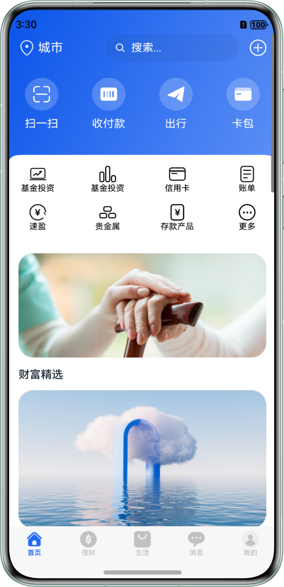
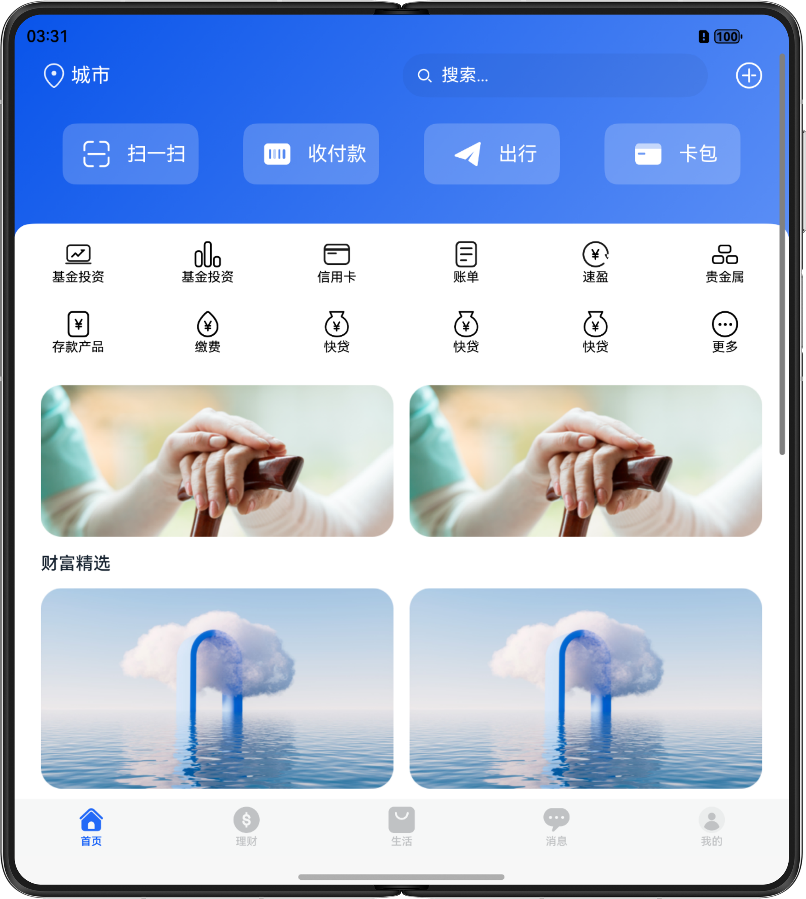

# 多设备移动支付界面

## 介绍

本篇Sample基于Scan Kit中的默认界面扫码能力与码图生成能力实现移动支付应用中常见的扫一扫和收付款功能。

## 效果预览
手机运行效果图如下：



折叠屏运行效果图如下：



tablet运行效果图如下：


## 使用说明

1. 点击扫一扫可体验扫码能力，扫码结果将以应用日志形式打印。
2. 点击收付款可体验码图生成能力（不涉及实际支付业务），该能力可用于生成包含自定义信息的二维码，可使用其他设备扫码查看生成的码图信息。


## 工程目录结构

```
├──entry/src/main/ets                                   // 代码区
│  ├──common
│  |  └──Constants.ets                                  // 常量
│  ├──entryability
│  |   └──EntryAbility.ets
│  ├──pages
│  |  ├──Home.ets                                       // 首页界面
│  |  ├──Index.ets                                      // 入口界面
│  |  ├──ReceivePaymentPage.ets                         // 收付款界面
│  |  └──ScanQRCodePage.ets                             // 自定义扫码界面
│  ├──view
│  |  ├──CashFlowCenterCard.ets                         // 收款界面底部功能条组件
│  |  ├──FunctionCard.ets                               // 功能卡片
│  |  ├──QuickFunctionCardCircle.ets                    // 快捷功能（圆形）
│  |  ├──QuickFunctionCardSquare.ets                    // 快捷功能（矩形）
│  |  ├──ScanQRCodeDialog.ets                           // 自定义扫码弹窗
│  |  └──XComponentView.ets                             // 扫码能力封装组件
│  └──viewmodel
│     ├──FortunePicksViewModel.ets                      // 财富精选数据
│     ├──PayHubViewModel.ets                            // 支付中心数据
│     ├──QuickFunctionsViewModel.ets                    // 快捷功能数据
│     ├──ReceiveMoneyServiceCardViewModel.ets           // 收付款数据
│     └──ServiceCardViewModel.ets                       // 服务卡片数据
└──entry/src/main/resources                             // 应用资源目录
```

## 具体实现
扫一扫功能使用Scan Kit（统一扫码服务）中的自定义界面扫码能力实现，需要开发者自行调用init、start、release等接口完成自定义扫码业务流程。

收付款功能主要使用Scan Kit中的码图生成能力，关键为使用createBarcode接口依照收付款所需的关键信息生成对应的支付二维码，另一侧通过扫码获取其中的关键信息，并执行相应的逻辑操作。

## 相关权限

不涉及

## 约束与限制

1. 本示例仅支持标准系统上运行，支持设备：直板机、双折叠（Mate X 系列）、平板。
2. HarmonyOS系统：HarmonyOS 5.0.5 Release及以上。
3. DevEco Studio版本：DevEco Studio 5.0.5 Release及以上。
4. HarmonyOS SDK版本：HarmonyOS NEXT 5.0.5 Release及以上。