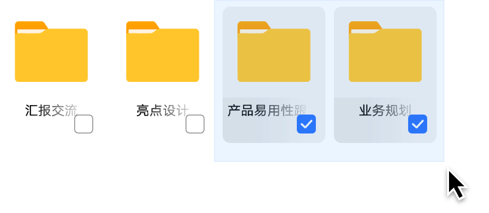
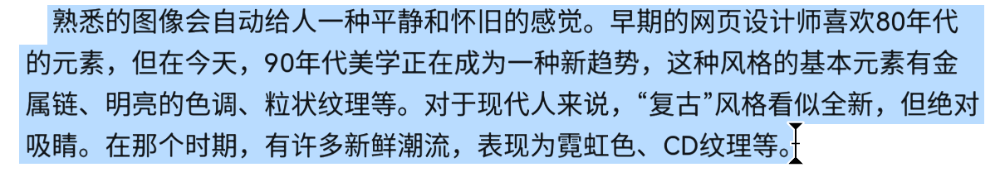
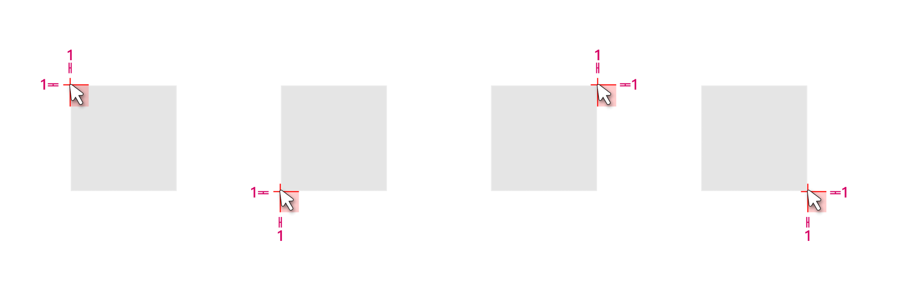

# 框选

更新时间：2025-06-20 00:30:09

来源：https://developer.huawei.com/consumer/cn/doc/design-guides/hmi-scenes-selection-0000001957005521

框选是指通过使用指针拖动选择框，使被框到的文本、文件等被选中。框选对象后，内容支持键鼠操作如拖拽、弹出菜单、加减选等。框选的对象可以为单个控件也可以为多个控件，可以为同类型的对象也可以为不同类型的对象。

框选的控件分为两类，内容类和文本类。内容类的控件主要是容器类控件如列表、宫格，文本类的控件则包含单行文本、多行文本、搜索框、富文本等。

|  |  |
| --- | --- |
| 内容类控件 | 文本类控件 |

## 发起框选

按下并移动可发起框选，抬手后完成选择。多种输入方式都能发起拖拽，鼠标和触控板交互为精细化操作，适用于内容类和文本类控件。

鼠标

鼠标按下并移动发起框选，抬手后结束框选。框选内容类对象时都会出现选框，框选文本类对象不会出现选框。

内容类对象框选

内容类对象可以从空白处发起框选，即发起框选的初始位置不在对象上。热区较大的对象可以分区处理框选热区，如 List 较长时右侧较为空白的区域为框选热区，图标和标题区为拖拽热区。

文本类对象框选

当鼠标悬浮在文本类可以框选的对象上时会变成工字形指针样式。文本类对象发起框选后没有选框，文本会呈现选中态。

## 加减选

在键鼠操作中，通常会使用 Ctrl 键和 Shift 键实现加减选，该操作也支持触屏/触控板 + 键盘的协同操作。

### 间序加减选

间序加减选即通过组合操作可以实现对象的不连续的跳选。

内容类对象

按住 Ctrl 键加上鼠标左键点选或者鼠标左键框选，间序加减选。

文本类对象

按住 Ctrl 键加上鼠标左键框选，间序加减选。

### 连续加减选

内容类对象

按住 Shift 键加上鼠标左键点选或者鼠标左键框选，连续加减选。

文本类对象

- 已有选择文本，按住 Shift ，点击或滑动文本中其他位置，可连续加减选。
- 点击：点击文本外部，已选中的文本到点击位置之间的文本被加选。点击文本内部，已选中的文本靠近点击位置的端点到点击位置之间的文本都被减选。
- 滑动：左键拖动指针在文本上滑动。滑到文本外部时，根据滑到的位置动态加选，滑到文本内部时，根据滑到的位置动态减选。

|  加选 |  加选完成 |
| --- | --- |
|  减选 |  减选完成 |

### 走焦加减选

已有选中内容，按住 Shift 和键盘方向键。从列表对应方向的最后一个项开始加选。

## 视觉规则

### 鼠标框选底板色

选框填充颜色：

引用 ohos_id_color_component_normal (#000000) 叠加 ohos_id_alpha_normal_bg

选框描边颜色：

引用 ohos_id_color_foreground_contrary 叠加 ohos_id_alpha_highlight_bg

选框描边宽度：1vp

文本选中底板颜色：

引用 ohos_id_color_text_highlight_bg (#0A59F7)

叠加 ohos_id_alpha_highlight_bg

### 框选底板位置

与光标上边缘，左边缘各留 1 vp

与光标下边缘、左边缘各留 1 vp

与光标上边缘、右边缘各留 1 vp

与光标下边缘、右边缘各留 1 vp
