# 手势

更新时间：2025-12-09 08:20:10

来源：https://developer.huawei.com/consumer/cn/doc/design-guides/hmi-touchscreen-0000001928273206

## 触屏手势

很多设备都拥有支持多点触控的屏幕，允许用户使用手指交互。它们与屏幕的接触状态、数量以及运动行为构成了触屏手势。在多数情况下，触屏可以支持多种体验，应将触屏手势作为用户首要的交互方式。

### 基础手势

用户使用手势与多种设备交互，以下内容描述了系统支持的核心基础手势。每个平台都支持基本手势，虽然基础手势对应的功能根据输入设备可能有所不同，但用户熟悉的基础手势预期在任何位置触发相同的操作效果，请避免使用熟悉的手势执行专属的操作，或者自定义独特的手势来执行用户熟悉的功能。

仅在必要时使用自定义手势，发现和记住自定义手势对用户来说可能有困难，在沉浸交互的情况下可以使用自定义手势，例如在游戏或绘图场景中自定义手势是体验的基本要素，在自定义手势时需要注意确保手势不是当前场景中执行操作的唯一方式。

手机平板高频操作方式为触屏操作，触屏基础手势需要考虑多设备拉通设计。用户通常习惯用键盘鼠标在电脑上操作，带触屏的电脑也支持触屏手势。穿戴和车机上支持部分触屏基础手势，穿戴手势的交互功能和手机平板的手势交互功能可能存在差异，但手势的基础定义是相同的。出于驾驶安全的考虑，在车机上不建议使用长按、拖拽、敲击手势。

| 手势 | 基础定义 | 图例 | 手机 | Pad | 电脑 | 穿戴 |
| --- | --- | --- | --- | --- | --- | --- |
| 点击 | 单次点击某个元素激活控件或者激活功能 |  | ✅ | ✅ | ✅ | ✅ |
| 长按 | 长按某个元素提示额外的控制或功能 |  | ✅ | ✅ | ✅ | ✅ |
| 拖拽 | 拖拽某个元素移动元素 | 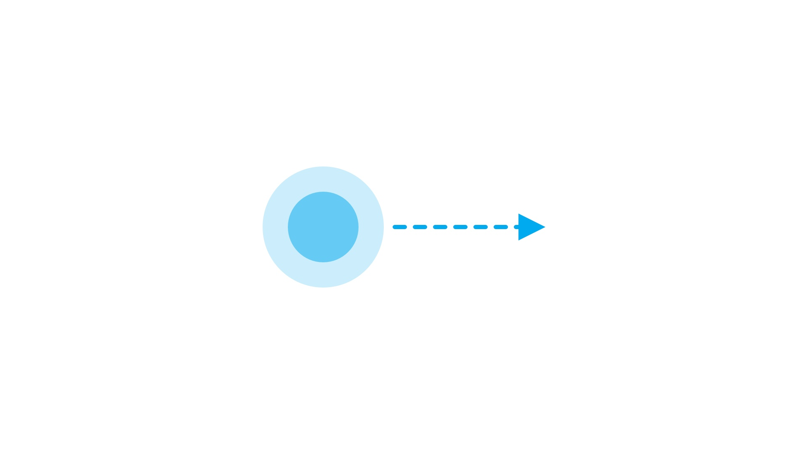 | ✅ | ✅ | ✅ | 不涉及 |
| 滑动 | 滑动以滚动或平移界面内容 | 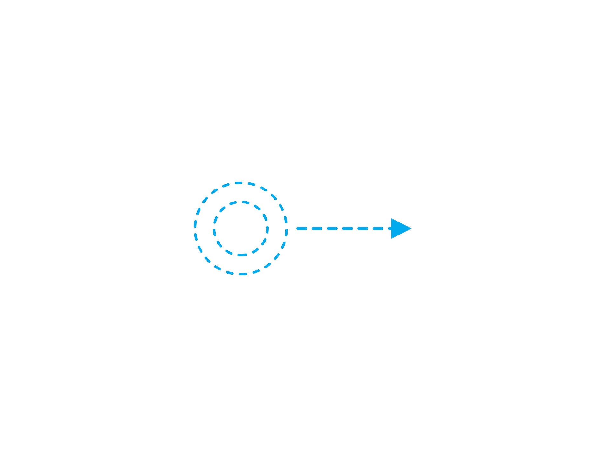 | ✅ | ✅ | ✅ | ✅ |
| 双击 | 双击放大/缩小内容 |  | ✅ | ✅ | ✅ | 不涉及 |
| 捏合 | 捏合缩放内容 | 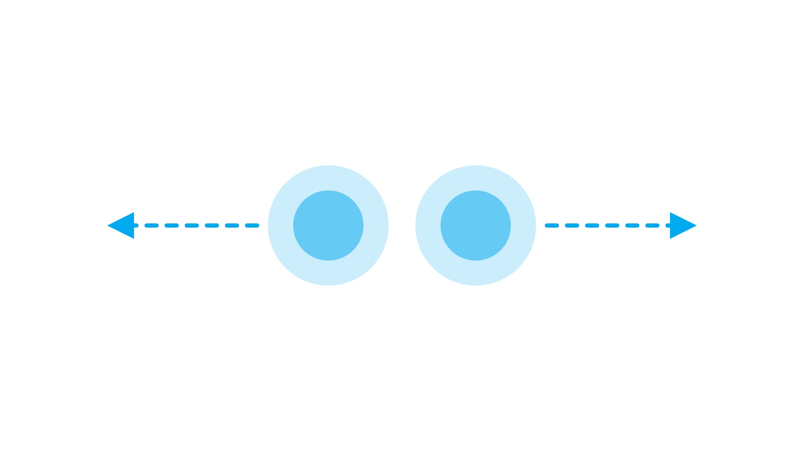 | ✅ | ✅ | ✅ | ✅ |
| 旋转 | 旋转选中内容 | 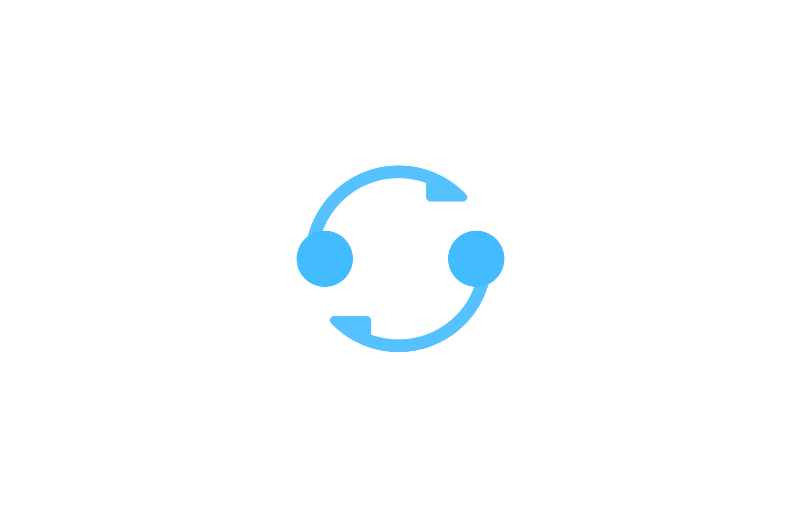 | ✅ | ✅ | ✅ | 不涉及 |
| 敲击 | 指关节敲击截屏 | 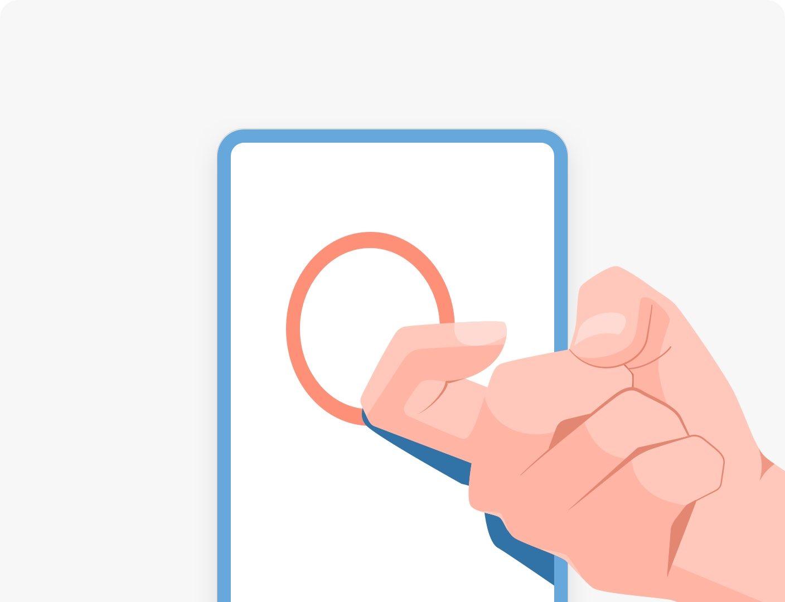 | ✅ | ✅ | 不涉及 | 不涉及 |

各设备的基础手势

### 点击

通过点击某个元素触发功能或访问界面。连贯的点击事件为按下和抬起，在有位移维度的变化下可以支持用户反悔，如抬起前将手指离开按下的区域能够撤销操作。 “按下” 也是十分常见的手势， “按下” 相较于 “点击” 可以更快地完成操作。但由于操作过程太过简单直接， “按下” 手势不给用户任何反悔的机会，因此是一个无法容错的手势。 “按下” 适用于需要快速执行或可以轻易撤销的场景，例如打开一个可以轻易关闭的提示或选项。 “抬起” 手势需要在被按下的前提下执行，在有位移维度的变化下适用于快速操作，如在射击类游戏场景中按下后抬起前，手指位移能够用于调整发射方向，手指抬起后执行发射操作。

### 长按

用户通过长按某个元素触发菜单或特定模式。注意：长按手势发现性差，常用功能不要使用长按来触发。

1.长按显示预览内容和菜单

长按对象显示预览内容和菜单。例如长按联系人列表中的某项出现预览内容和菜单， 长按桌面图标进入预览页面，页面上有桌面图标和操作菜单。预览内容通常为下一级界面内容便于快速预览，预览内容也可以是当前对象的预览图，例如图片的预览内容为图片本身，长按桌面图标时预览对象为图标，长按卡片时预览内容为对应的卡片，根据使用场景也可以设计其他的预览内容。有两种操作菜单项，针对上级界面的操作和针对当前内容的操作，针对上级界面的操作例如多选、编辑主屏幕等，应用需要根据具体的使用场景设计菜单项的内容。

|  |  |  |
| --- | --- | --- |
| 长按显示预览内容和菜单 | 从预览状态可拖出对象 | 多选对象长按聚拢预览 |

2.长按进入排序模式

长按进入排序模式。长按只响应一个事件，长按进入排序模式则不触发长按显示预览内容和菜单的功能。

|  |  |
| --- | --- |
| 长按列表排序 | 长按宫格排序 |

3.长按选择物体

长按对象选中内容，例如长按文本可选中对应文本，长按图片可选中对应物体。

| 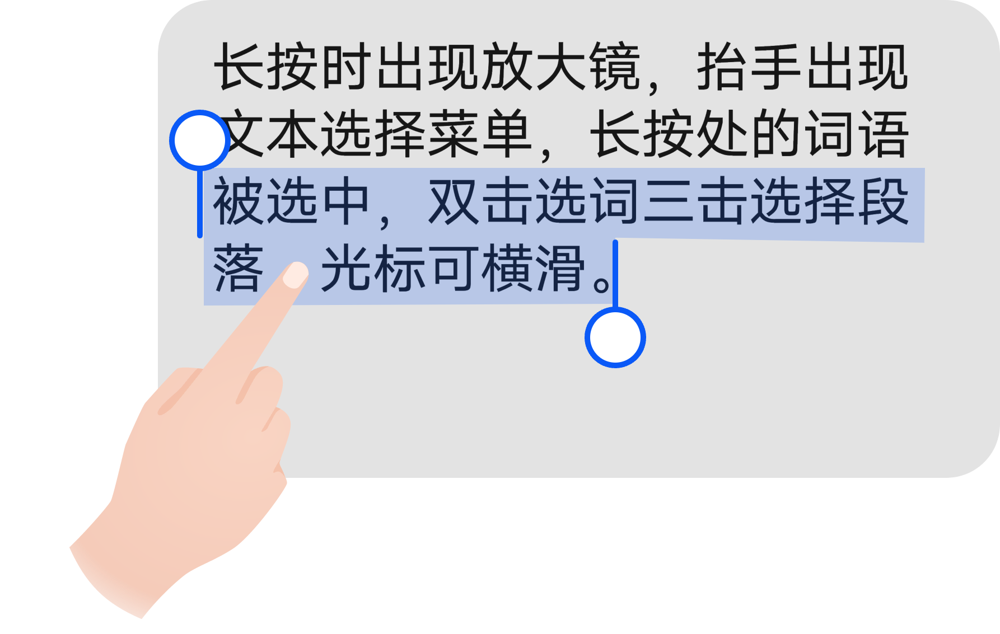 | 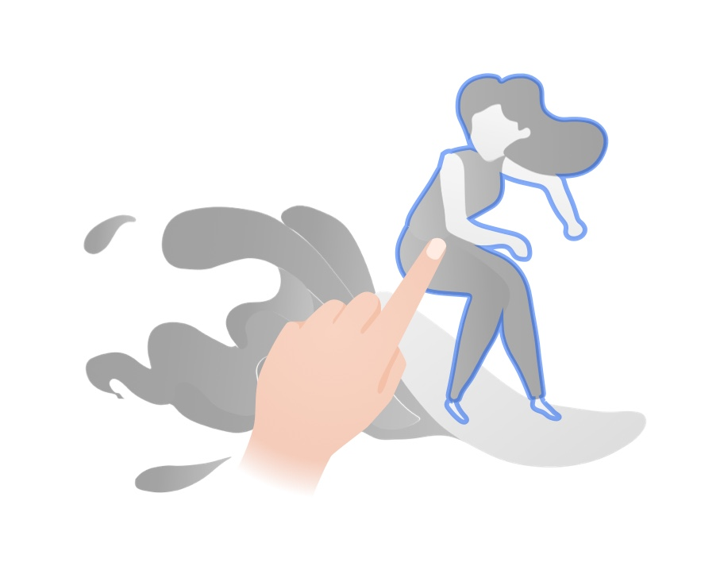 |
| --- | --- |
| 长按选择文本 | 长按图片 |

4.长按对象激活二级详情页

长按对象进入对应的功能详情页面，属于一种浅层级的轻交互，例如长按控制中心图标打开详情页。

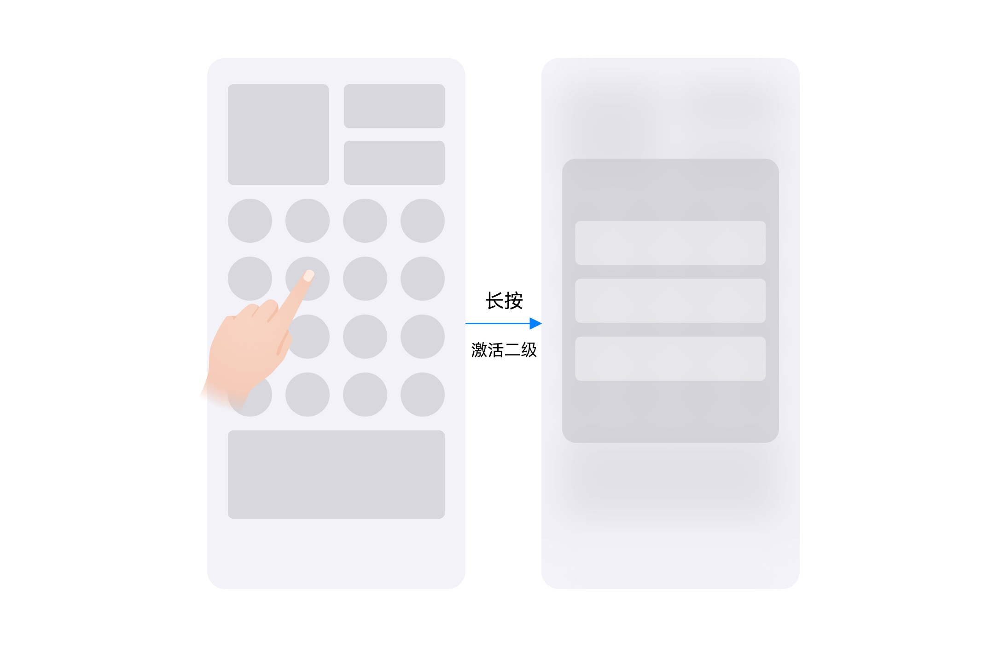

### 拖拽

长按移动后元素从一个位置移动到另外一个位置的过程为拖拽。在同应用同页面、同应用跨页面、跨应用、跨系统的场景下都能使用拖拽。同一个页面可使用拖拽，例如图标拖拽排序。同一个应用不同页面中可使用拖拽，例如在文件管理器中把文件从一个页面拖拽到另一个页面中。跨应用可使用拖拽，例如分屏时一个应用的内容可以拖拽至另一个应用。跨系统可使用拖拽，例如将内容从电脑拖拽到手机、从平板拖拽到电脑。

系统控件原生支持拖拽，文本类控件和内容类控件原生具有拖拽能力，调用系统控件则支持发起拖拽、拖拽中、释放拖拽的全流程交互，应用只需要适配数据处理能力。

拖拽过程中支持多指触屏交互，如拖拽过程中使用另一只手指滑动屏幕，拖拽过程中加选，拖拽过程中使用另一只手切换应用。

| 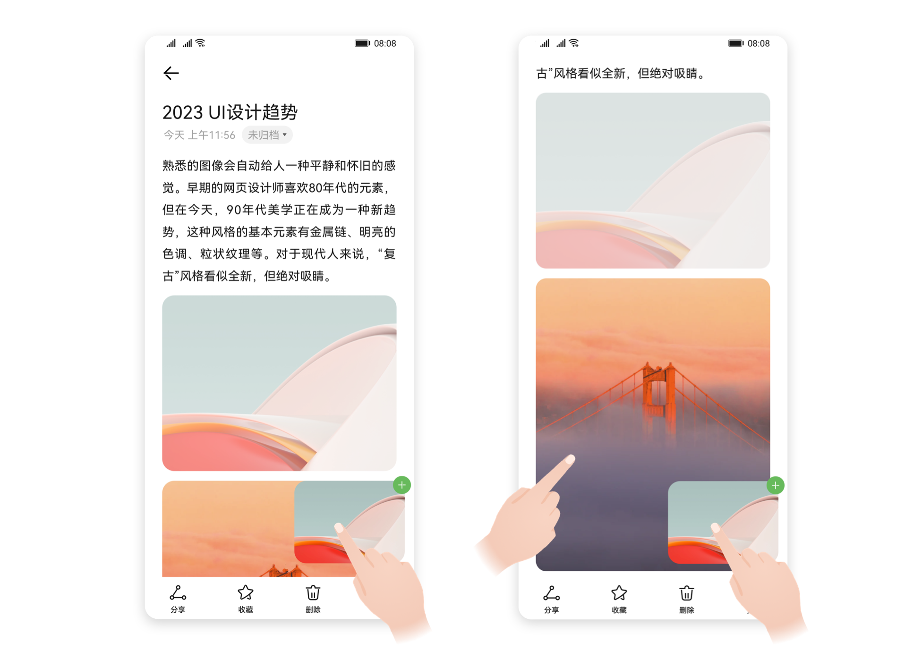 |
| --- |

### 滑动

通过滑动来平移界面内容。

常用场景：

- 上下滑动页面内容。
- 横滑切换页签。如页面中子元素定义了横滑事件，则优先响应页面子元素的横滑，后响应横滑切换页签。
- 列表横滑出现操作项按钮。左滑配置删除图标，右滑可定义次重要功能。
- 下滑关闭半模态面板。在滑动到内容区边缘时不关闭半模态面板，

- 抬手再次向下滑动后关闭半模态面板。

| 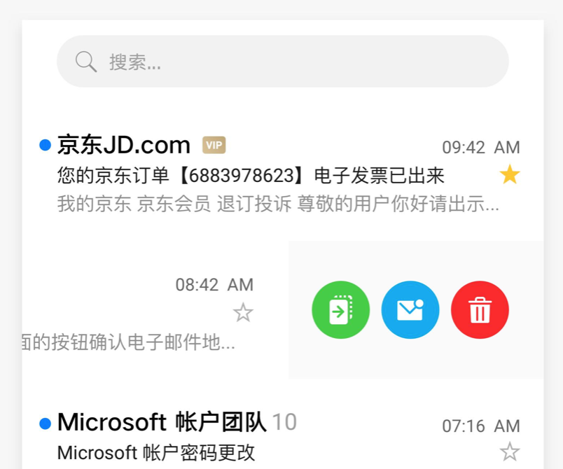 | 左滑配置删除图标                     一个应用内删除的图标相同           向左短滑出现删除图标                    右滑可定义次重要功能                     右滑可定义一个功能，最多配置一个按键           向右短滑拉出按钮           右滑可一步快滑删除 |
| --- | --- |

列表横滑出现操作项

### 双击

在不同场景中双击有不同的使用习惯，在查看图片时双击是放大或缩小内容，在观看长视频时双击是播放暂停视频。

1.双击放大图片

双击放大图片，再次双击缩小图片。大图如地图绘图软件可配置多次双击放大，双击一次放大一个尺寸。

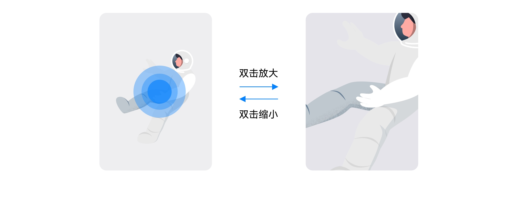

2.双击播放长视频

双击播放或暂停长视频，短视频场景中双击通常为点赞事件。

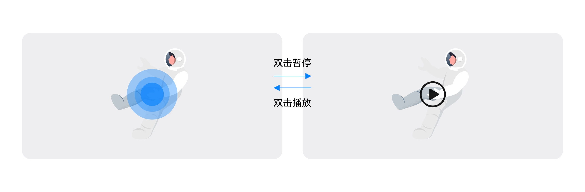

3.双击跳转至下一个未读信息

在消息列表界面，双击底部页签中已经激活的页签，页面会从当前位置跳转至下一个未读消息的位置，即下一个未读消息显示在列表的第一行。

### 捏合

使用两个手指按住屏幕朝外展开以放大内容，向内收拢以缩小内容。

1.捏合缩放画面

捏合缩放画面，例如捏合缩放图片、相机取景界面捏合缩放画面、地图捏合缩放画面、浏览器界面捏合缩放图文画面。

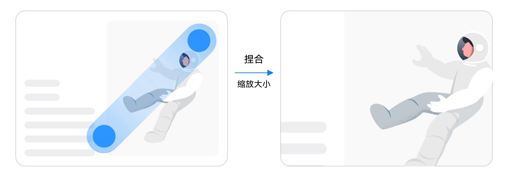

2.捏合缩放宫格

捏合缩放宫格，例如内容型页面可捏合宫格缩放重排布局。

## 系统手势

系统手势主要为系统导航手势，在应用场景设计手势时应避免和系统手势冲突。

### 系统导航手势

在手机、平板、电脑触屏交互中，避免使用系统导航手势定义非系统功能。系统导航手势为系统级全局生效手势，例在任何页面通过单指底部边缘上滑能够回到桌面。

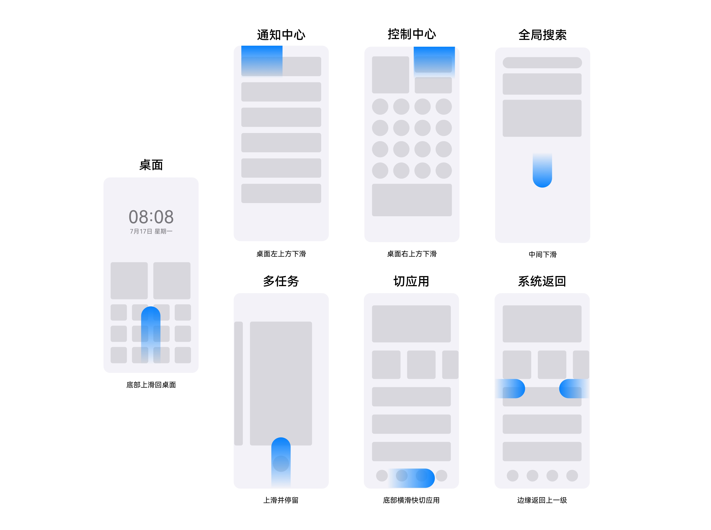

手机系统导航手势示意图

通常在任何页面单指边缘内滑可以返回上一级界面，应注意避免使用二次返回手势挽留用户。在沉浸式场景下如游戏场景直接响应返回手势可能有误操作的风险，可以在用户首次边缘内滑时弹出 Toast 提示，再滑一次退出应用。若 Toast 未消失时，再次使用返回手势，直接退出应用；若 Toast 消失后再次响应边缘内滑手势，则需重新 toast 提示。除了再滑一次退出应用，还可以通过再按一次退出应用的按钮操作退出应用。

| 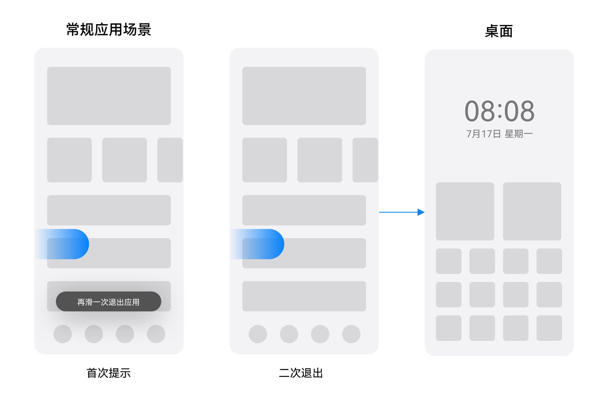 | 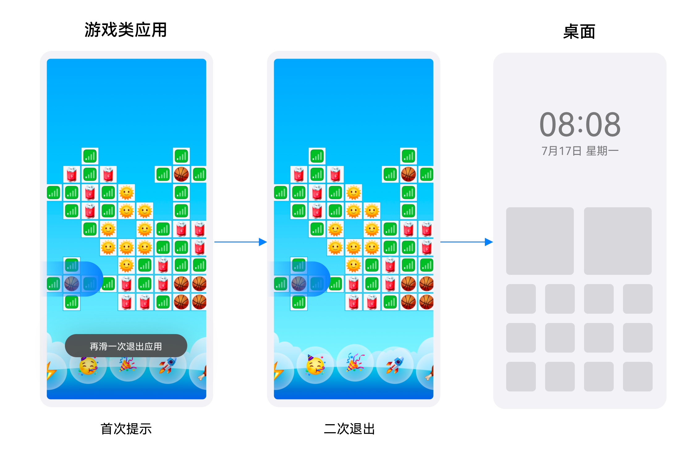 |
| --- | --- |
| 不要使用二次返回手势挽留用户 | 游戏场景避免误操作 |

系统导航手势在普通屏幕尺寸下如直板机折叠屏上为边缘手势，在大屏幕尺寸下如平板和电脑 上能通过三指非精准手势回桌面、切换多任务、快切应用，下表为多设备系统导航手势汇总。

| 功能 | 手机 | 平板 | 电脑 | 触控板 |
| --- | --- | --- | --- | --- |
| 回桌面 | 单指底部上滑 | 单指底部上滑          三指上滑 | 单指底部上滑          三指上滑 (下滑恢复窗口) | 三指上滑 (下滑恢复窗口) |
| 多任务 | 单指底部上滑停留 | 单指底部上滑停留          三指上滑停留 | 单指底部上滑停留          三指上滑停留 | 三指上滑停留 |
| 快切应用 | 单指底部左右横滑 | 单指底部左右横滑          三指左右横滑 | 单指底部左右横滑          三指左右横滑 | 三指左右横滑 |
| 通知中心 | 单指左上方下滑 | 单指左上方下滑 | - | - |
| 控制中心 | 单指右上方下滑 | 单指右上方下滑 | - | - |
| 返回 | 单指边缘内滑 | 单指边缘内滑 | 单指边缘内滑 | 单指边缘内滑 |
| 全局搜索 | 单指桌面中间下滑 | 单指桌面中间下滑 | 单指桌面中间下滑 | 三指轻点 |
| 应用中心 | NA | NA | NA | 四指捏合/张开 |
