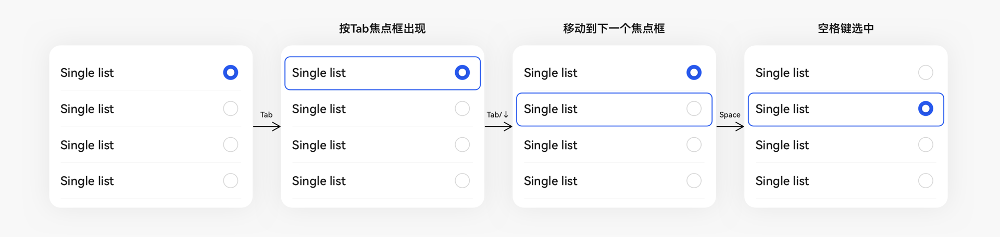
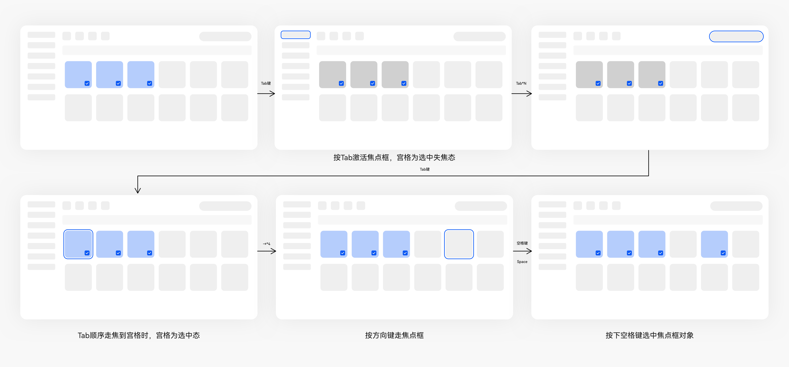
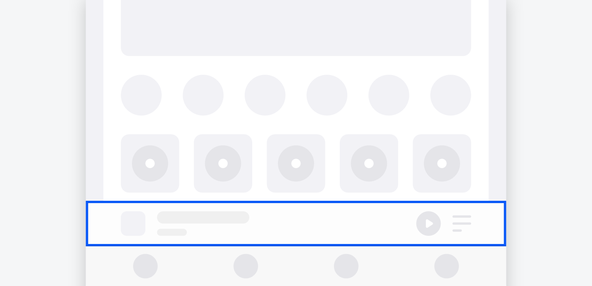
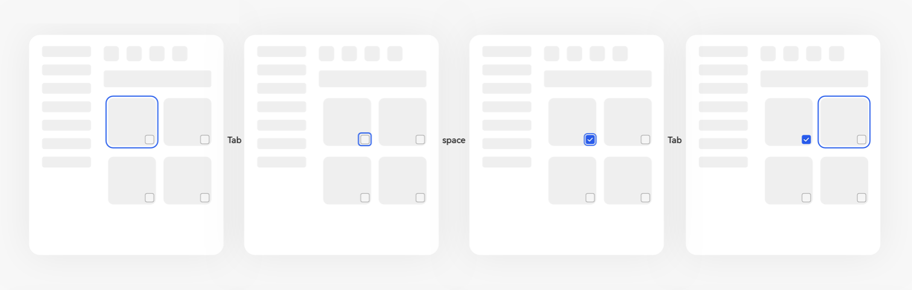
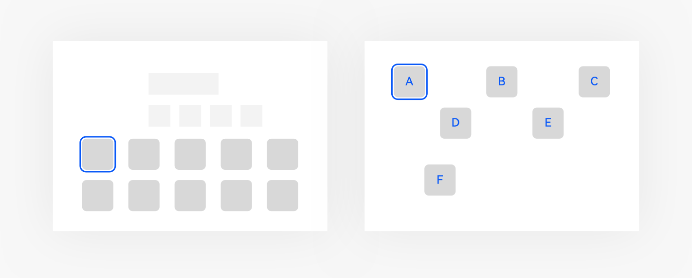
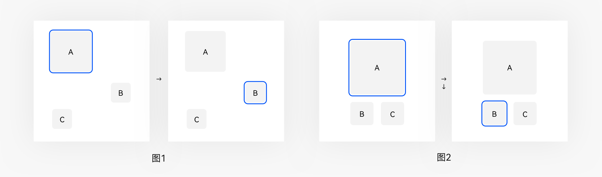
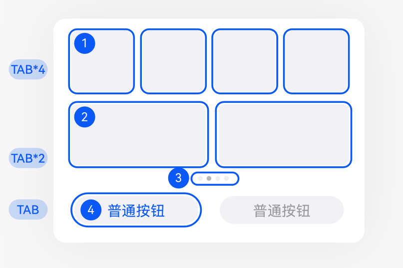

# 焦点导航

更新时间：

来源：https://developer.huawei.com/consumer/cn/doc/design-guides/hmi-focus-0000001748650376

当用户使用键盘、电视遥控器、车机摇杆/旋钮等非指向性输入设备与应用程序进行间接交互时，基于焦点的导航和交互是重要的输入手段。本节描述了基于焦点交互的通用设计原则规范，针对各输入方式和各控件的细化的焦点交互方法请参考各输入方式和各控件的具体章节。开发相关描述请参阅[焦点事件](https://developer.huawei.com/consumer/cn/doc/harmonyos-guides-V5/arkts-common-events-focus-event-V5#走焦规范)文档。
 

#### 内置支持，多端一致

当用户使用下列非指向性输入设备与应用程序进行间接交互时，基于焦点的导航和交互是重要的输入手段。各个端的走焦交互保持统一，方便用户在切换设备时快速学习理解。
  
| 操作分类 | 操作描述 | 标准键盘 (平板/电脑) | 遥控器 (电视) | 旋钮 (车) | 表冠 (智能表) | 方向键/摇杆/手柄 |
| --- | --- | --- | --- | --- | --- | --- |
| 激活 | 激活走焦状态 | Tab | 默认激活 | 默认激活 | 默认激活 | 默认激活 |
| 移动 | 移至下一个焦点/下一区域 | Tab | 方向键/触摸板滑动 | 顺时针旋转 | 顺时针旋转 | 方向键/摇杆/手柄移动 |
| 移动 | 移至上一个焦点/上一区域 | Shift + Tab | 方向键/触摸板滑动 | 逆时针旋转 | 逆时针旋转 | 方向键/摇杆/手柄反方向移动 |
| 移动 | 移动相对焦点位置 | 方向键 (除特殊标注，首尾不相连) | 方向键/触摸板滑动 | NA | NA | 方向键/摇杆/手柄移动 |
| 移动 | 移至区域内第一个焦点 | Home | NA | NA | NA | NA |
| 移动 | 移至区域内最后一个焦点 | End | NA | NA | NA | NA |
| 交互 | 激活当前焦点操作 | Space | 确认键 | 确认键 | 触屏/表冠 | 确认键 |
| 交互 | 进入当前焦点内部 | Enter | 确认键 | 确认键 | 触屏/表冠 | 确认键 |
| 交互 | 取消当前操作 | Esc | 返回键 | 返回键 | 左边缘右横滑 | 返回键 |
| 交互 | 打开当前项的上下文菜单 | Shift + F10 | 菜单键 | NA | NA | NA |
 
 

 

 
**连接标准键盘，按 Tab 键激活焦点框**
 
在平板/电脑平板上使用标准键盘，按 Tab 键激活焦点框，按方向键不激活焦点框。
 
选中态和获焦态为两个状态，单选和多选场景下的选中态和获焦态互不冲突。
 

 
单选选中态和获焦态可同时存在
 

 
多选选中态和获焦态可同时存在
 

 
 

#### 提供焦点初始默认的位置

初始焦点的位置需明确、突出，让用户有效地识别该位置，以便顺利开始走焦操作。
 
焦点的默认位置与界面层级与内容相关，确认默认焦点的规则如下：
 1. 层级优先，最顶层的界面优先。
2. 内容优先，遵循从上至下从左至右的 Z 字型方向规则。应用可自定义首焦点，若无定义首焦点则遵循默认规则，页面左上角第一个位置为默认首焦点。
3. 不要在未加载完毕的区域显示默认焦点。
  
|  |  |
| 层级优先 | 内容优先 |
 
 
 

#### 可遍历所有可获焦元素
1. 为完成所有交互任务，焦点需要能够遍历所有可获得焦点的界面元素，以保证功能的完整性。
2. 整体绝对走焦顺序的原则为：自上而下自左至右的 Z 字型顺序做遍历。
3. 页面如果没有自定义配置走焦顺序，则默认使用 Z 字形顺序做遍历。
4. 不允许焦点跨页面层级来获焦。
5. 保证界面能通过方向键移动到所有可获焦元素上，在方向键移动焦点时，优先响应元素有使用方向键交互的事件，若元素使用了方向键进行快捷操作，则方向键无法用于焦点移动。
 

 
 

#### 默认可遍历

焦点默认为全局遍历所有可获得焦点的界面元素，以保证功能的完整性。
 

 

 
 

#### 绝对走焦顺序
1. 应用可自定义走焦顺序，所有可获焦元素都会按照在屏幕上显示的顺序，或指定的顺序进入走焦顺序中。
2. 在设计应用时，可按照功能分区、视觉呈现等规则重新组织焦点顺序。
3. 用户只能按照给定的焦点顺序移动焦点。
4. 提供两种操作次序：正序和反序。当使用键盘时， Tab 键移动至下一个焦点， Shift + Tab 键移动至上一个焦点。车机旋钮右旋至下一个焦点，左旋至上一个焦点。
5. 一般来说，首尾相连。
 

 
 

#### 相对走焦顺序
1. 方向键即上下左右键输入。
2. 从当前按键的方向开始，以当前焦点为基准逐行寻找可用焦点，根据距离选择距离最近的目标焦点。
3. 若有多个焦点则按照从上到下从左到右的规则进行筛选，反序从下到上从右到左。
4. 十字方向走焦优先，垂直方向的走焦优先于斜向走焦顺序。
5. 反序走焦，往回走遇到有选中态的控件时，回到正序选中的最后一个选中态，没有选中态遵循就近原则回去。
 
**正序**
 

 
图 1 在位置 A 上按方向右键，在该方向的下一行寻找可用焦点 B，没有其他可用焦点走到 B 上。图 2 在位置 A 上按方向右键，往下一行寻找可用焦点 B ，在位置 A 上按方向下键，往下方找可用焦点 B 和 C ，按从左到右原则走到 B 上。
 
**反序**
 

 
在位置 9 上按键，在方向的下一行寻找可用焦点 (4/5/2/6)，在候选焦点中按垂直优先和从右到左原则 2>6>5>4，则位置 2 获焦。
 

 
 

#### 按区域获得焦点提高走焦效率

在由多种控件组成的可划分明显区域的界面中，可精简焦点组的数量以提升走焦效率。一般情况下，一个区域的首项为该区域获焦的默认焦点，使用 Tab 键能快速在区域的首焦点间跳转。
 
使走焦顺序更具有逻辑性，按照功能组织分区，将逻辑顺序与视觉分区进行匹配，用户更容易学习。
  
|  |  |
| 按 Tab 键在焦点组间快速移动 | 没有配置焦点组，按 Tab 遍历所有元素 |
 
 
**绝对顺序和相对顺序结合**
 1. 焦点组只做同层级遍历，按 Tab 键会遍历不同焦点组，方便用户快速走焦。
2. 当只有部分内容配置了焦点组时，按 Tab 键按照默认顺序遍历未配置焦点组的元素。
3. 没有特殊定义，按 Tab 优先以控件内部区域顺序走焦，其次响应控件间顺序走焦。
 

 

 
 

#### 焦点的默认显示/触发消失/位置记忆
1. 当设备已经连接了摇杆/旋钮等输入设备时，页面内默认显示获焦点，焦点一直显示不消失。
2. 当触发了其他交互方式，如触控/鼠标，应结束获焦状态，焦点消失。
3. 当再次回到焦点交互时，系统/程序应能记住上次焦点操作的位置。
 
 

#### 可交互才可获焦

如果构成控件的元素能够接收用户输入而改变界面状态 (跳转、移动、切换等)，则称其为可交互的，也就是说，这些元素能够获得焦点。绑定点击事件的元素默认可获得焦点，space/enter 响应事件默认为点击事件。
 
对于纯展示类内容，没有绑定任何交互事件则不可获焦，不能因为控件增加了走焦状态而额外添加功能。
 
 

#### 可交互控件

**导航类**
  
| 控件 | 是否可获焦 |
| --- | --- |
| 侧边导航栏 | 是 |
| 侧边页签 | 是 |
| 底部页签 | 是 |
| 子页签 | 是 |
| 标题栏 | 是 |
| 导航点 | 是 |
| 步骤导航器 | 是 |
| 面包屑 | 是 |
 
 
**展示类**
  
| 控件 | 是否可获焦 |
| --- | --- |
| 气泡提示 | 部分场景可获焦 |
| 新事件标记 | 否 |
| 数据可视化 | 否 |
| 范围类图表 | 否 |
| 文本 | 否 |
| 文本时钟 | 否 |
| 分割器 | 否 |
| 子标题 | 部分场景可获焦 |
| 进度条 | 部分场景可获焦 |
| 即时反馈 | 否 |
| 二维码 | 部分场景可获焦 |
| 空白 | 否 |
 
 
**操作类**
  
| 控件 | 是否可获焦 |
| --- | --- |
| 按钮 | 是 |
| 索引条 | 是 |
| 菜单 | 是 |
| 文本选择 | 是 |
| 下拉按钮 | 是 |
| 状态按钮 | 是 |
| 操作块 | 是 |
| 滚动条 | 是 |
| 工具栏 | 是 |
| 下拉刷新 | 否 |
| 数字加减 | 是 |
 
 
**媒体类**
  
| 控件 | 是否可获焦 |
| --- | --- |
| 图片 | 部分场景可获焦 |
| 幻灯片 | 是 |
| 视频 | 是 |
 
 
**选择类**
  
| 控件 | 是否可获焦 |
| --- | --- |
| 勾选 | 是 |
| 开关 | 是 |
| 单选框 | 是 |
| 多选 | 是 |
| 评分条 | 是 |
| 滑动条 | 是 |
| 选择器 | 是 |
| 颜色选择器 | 是 |
| 勾选文本 | 是 |
 
 
**容器类**
  
| 控件 | 是否可获焦 |
| --- | --- |
| 弹出框 | 是 |
| 可滑动面板 | 是 |
| 卡片 | 是 |
| 列表 | 是 |
| 网格 | 是 |
| 表视图 | 是 |
| 树视图 | 是 |
| 列布局 | 否 |
| 行布局 | 否 |
 
 
**输入类**
  
| 控件 | 是否可获焦 |
| --- | --- |
| 文本框 | 是 |
| 图案锁 | 是 |
| 搜索框 | 是 |
