# 触控板

更新时间：2025-10-29 08:04:42

来源：https://developer.huawei.com/consumer/cn/doc/design-guides/hmi-touchpad-0000002464444730

触控板同时具备精细化指向型输入（鼠标）和多指触控手势输入（触屏） 的特性，使得触控板既适合用于对指点精度有较高要求的生产力应用，也适合用于基于触摸交互优化的用户界面。

在为您的应用设计或适配触控板交互时，触控板交互应满足用户手眼分离状态下 (眼睛看着屏幕，手在触控板上盲操作) 的使用习惯，应遵循以下原则：

1. 触控板应当具备替代鼠标的功能。

2. 应用在触屏上的手势操作功能可通过在触摸板上相应的手势来实现。

## 基础手势

触控板基础手势是指与应用进行交互的相关手势，应用可结合业务特点以及手势交互规范进行对应交互的设计，一般地，触控板基础手势以一指或者二指进行交互。

| 手势 | 描述 |
| --- | --- |
| 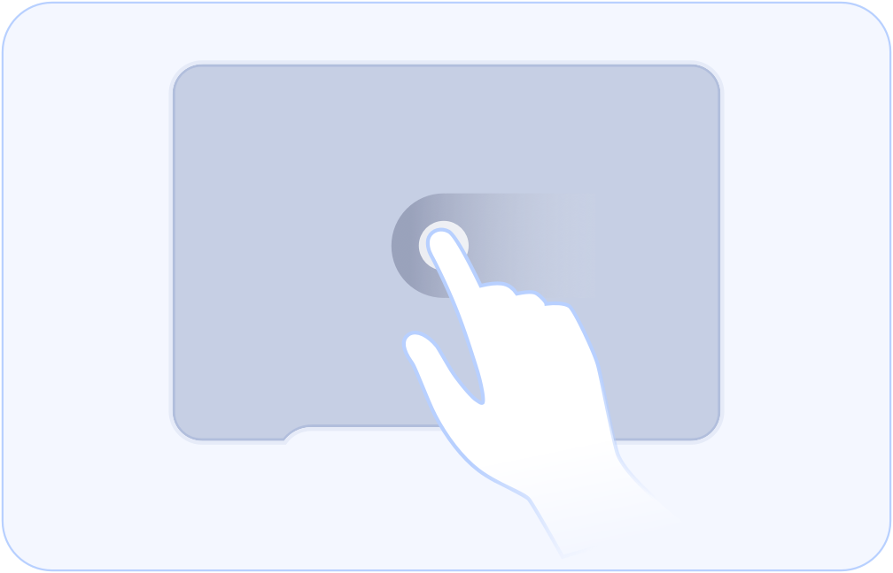 | 单指轻点后移动。 移动光标。 |
| 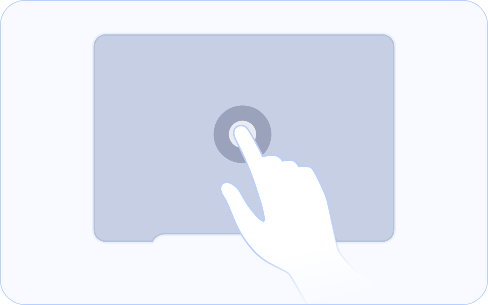 | 单击。 单指轻点或点按下去来进行点按。 |
| 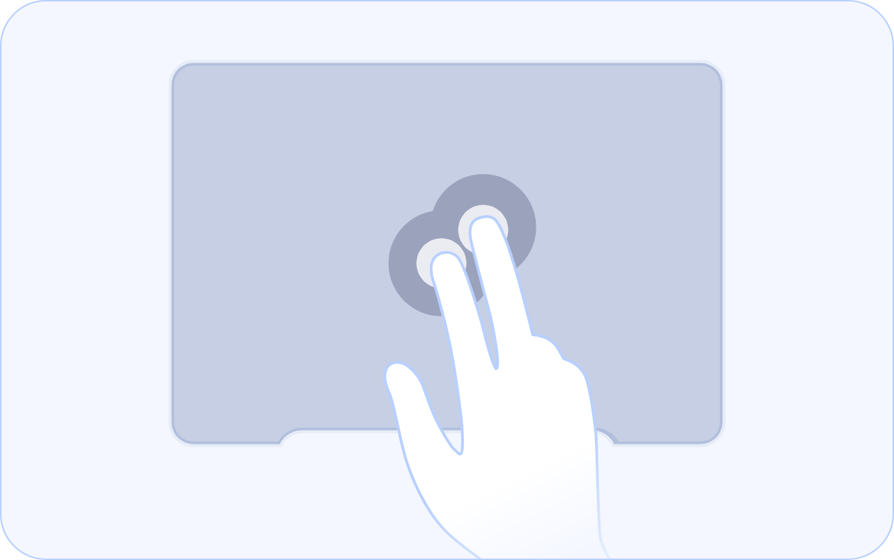 | 呼出菜单。 用双指点按或轻点 如部分触控板不支持多指交互能力，可通过点击触控板左下角或右下角触发菜单功能。 |
| 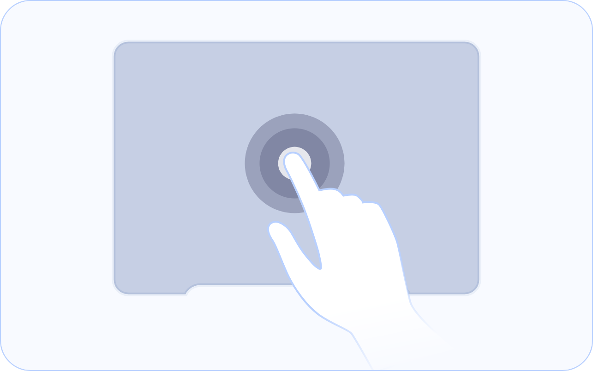 | 双击。 轻点两下，可进行某些快捷操作，如快速放大图片、点赞等。 |
| 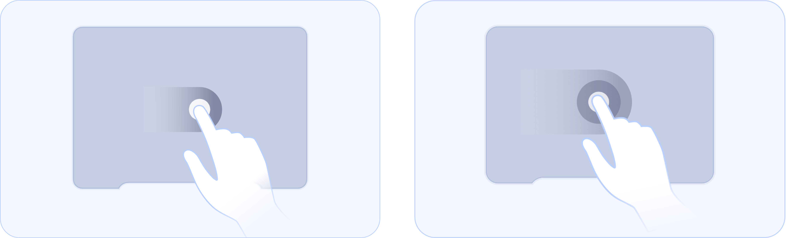 | 拖拽。 点按住并移动，或轻点两下后移动以拖拽它 单指轻点两下，第二下不抬起手指并移动可进行拖拽。 |
| 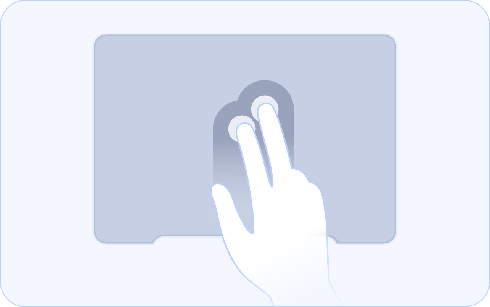 | 轻扫。 双指快速移动，可轻扫页面。 |
|  | 滚动或平移。 双指移动可上下或左右滚动。双指移动支持平移。 |
| 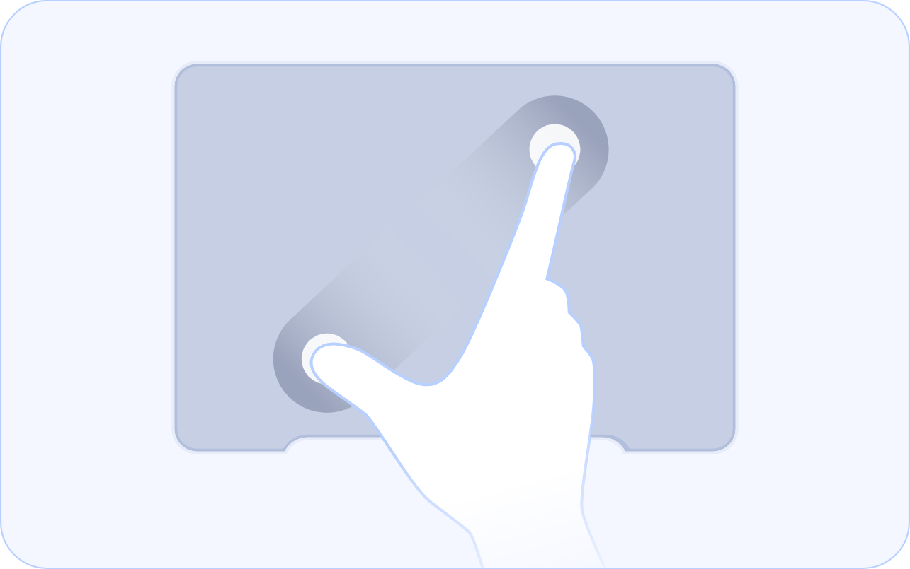 | 缩放。 双指捏合或张开，可放大或缩小。 |
| 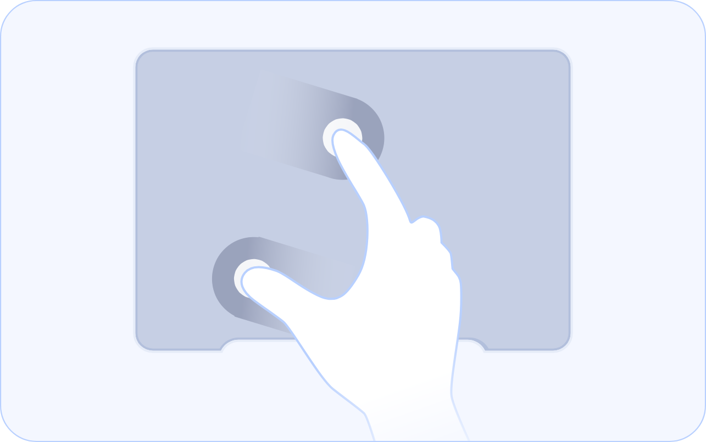 | 旋转。 双指以对方为轴心进行旋转，可旋转照片或其他项目。 |

## 系统手势

触控板系统手势是指与系统进行交互的相关手势，如返回桌面、进入多任务等，系统手势由系统统一控制，触控板系统手势通过多指手势、边缘手势或者特殊手势进行交互。

### 多指手势

| 手势 | 描述 |
| --- | --- |
| 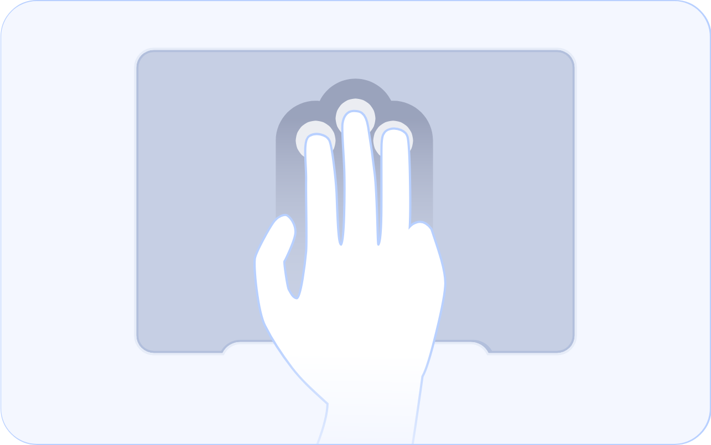 | 返回桌面。 三指上滑以返回桌面。 |
|  | 进入多任务。 三指上滑并停顿进入多任务。 |
| 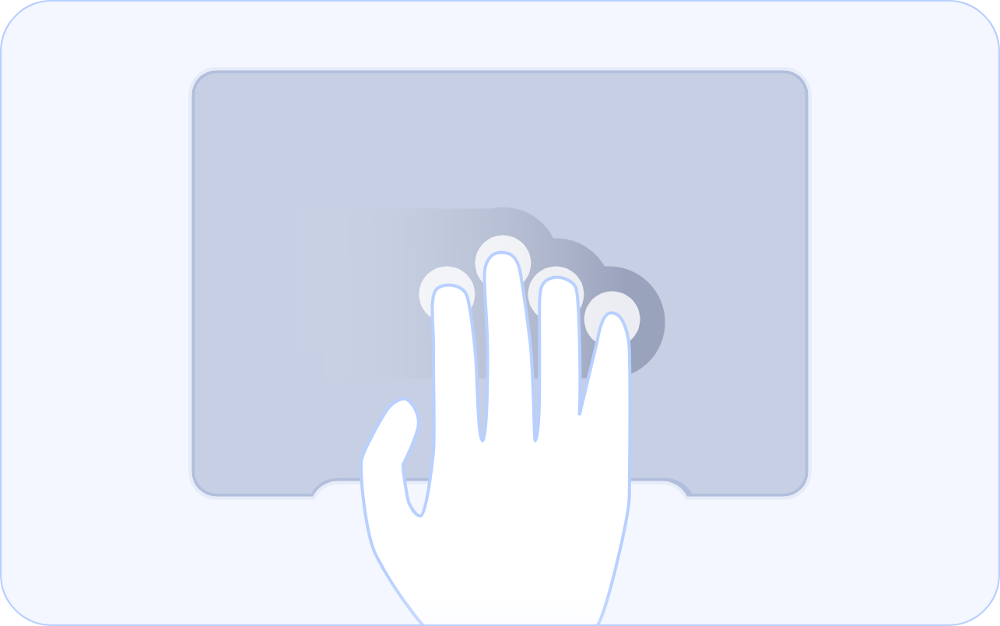 | 切换桌面。 四指横滑切换虚拟机、企业空间。 |

### 边缘手势

| 手势 | 描述 |
| --- | --- |
| 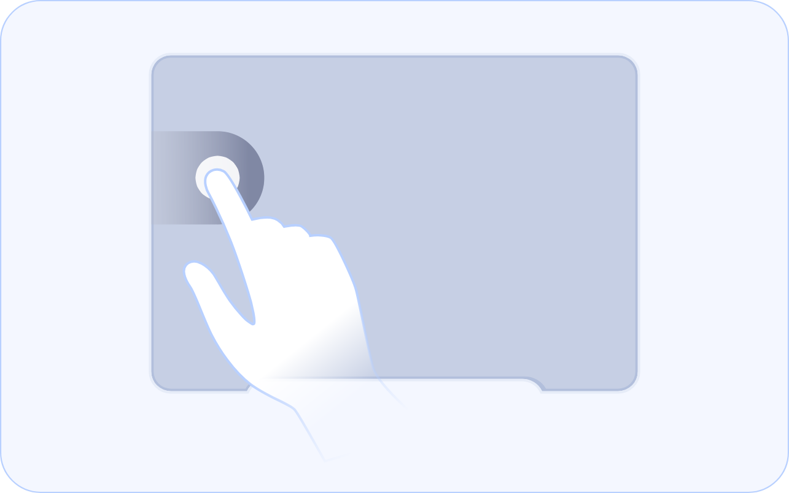 | 返回。 单指左边缘或右边缘向内滑以返回应用上一级。 |
| 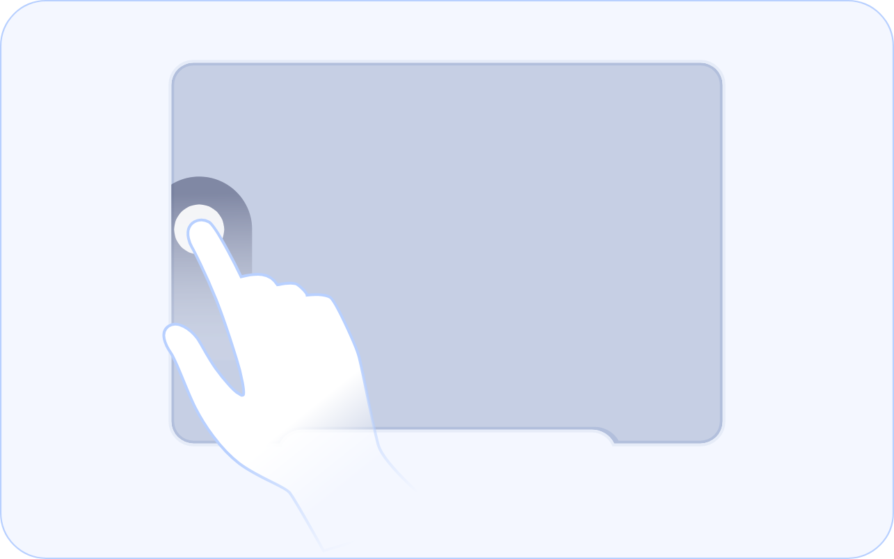 | 亮度调节。 单指左边缘滑动亮度调节。 |
| 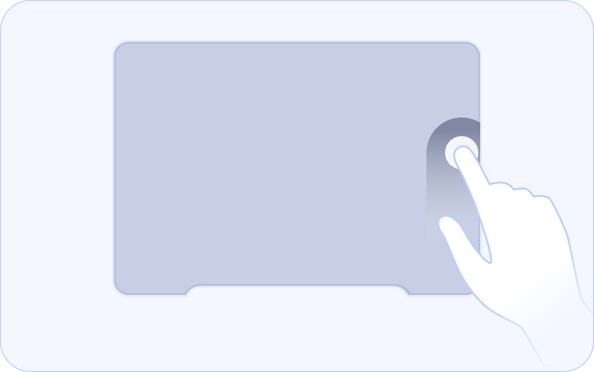 | 音量调节。 单指右边缘滑动音量调节。 |
| 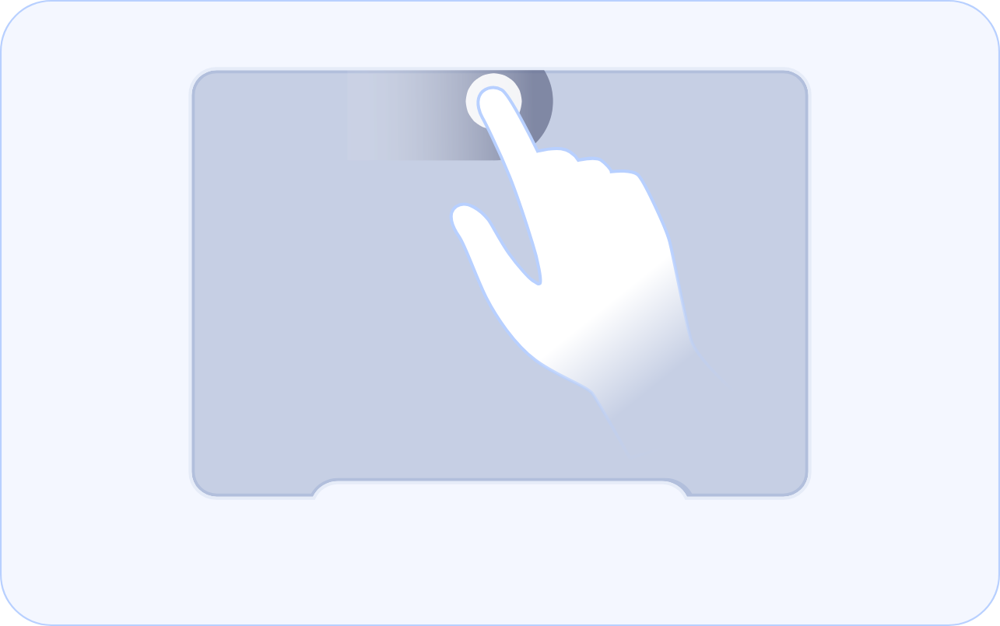 | 进度调节。 单指上边缘滑动进度调节。 |

### 特殊手势

| 手势 | 描述 |
| --- | --- |
| 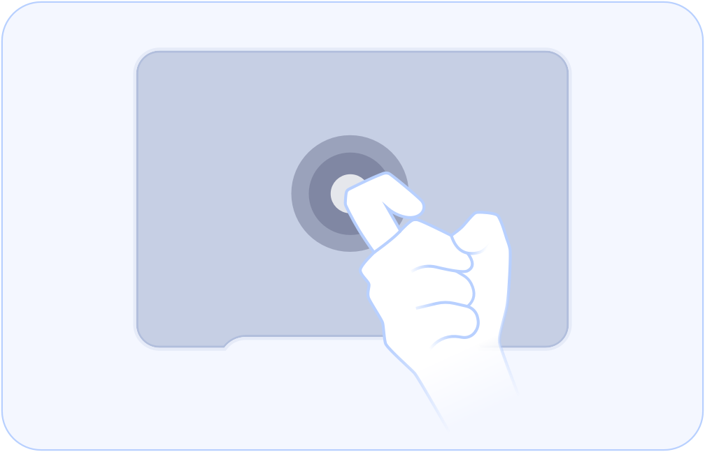 | 截图。 单指关节敲击两下进行截图。 |
| 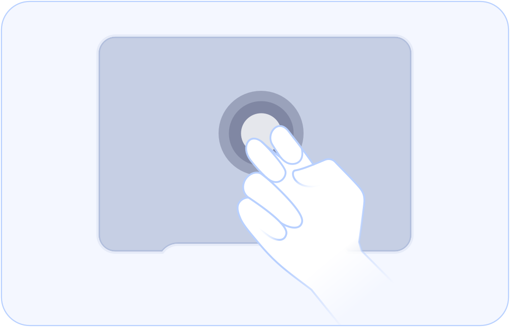 | 录屏。 双指关节敲击两下进行录屏。 |

关于光标和界面对象的悬浮态表现，请参考光标的交互。
