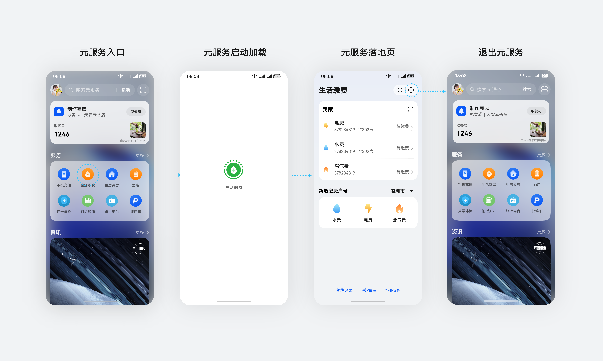
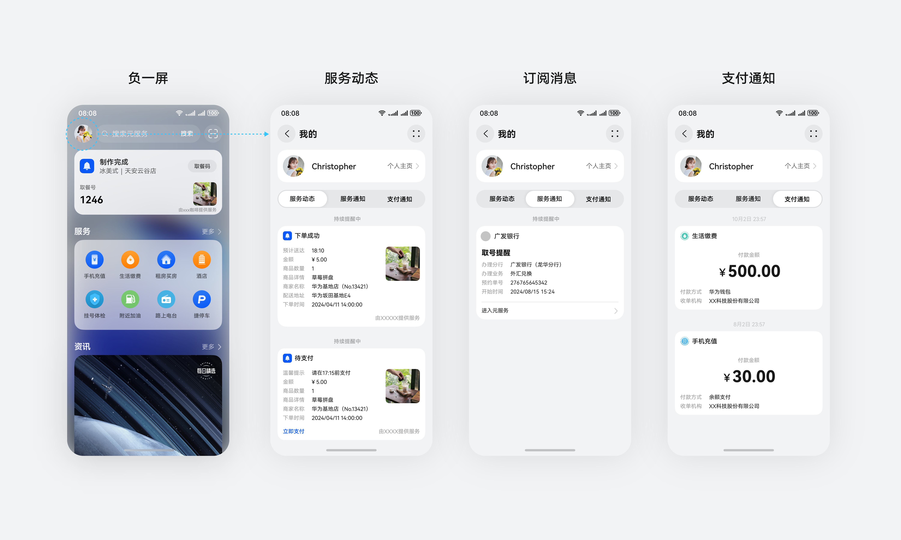
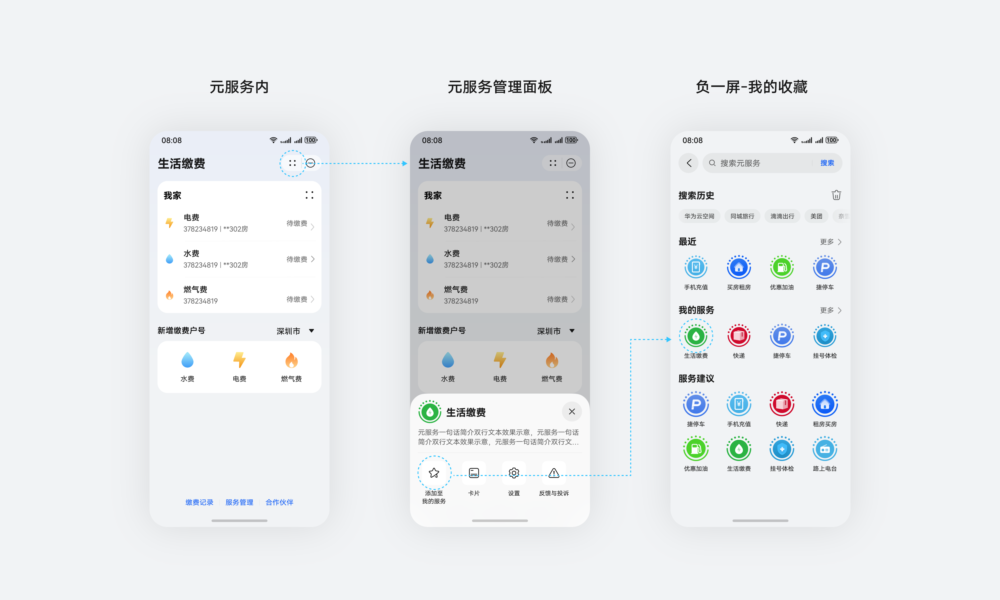
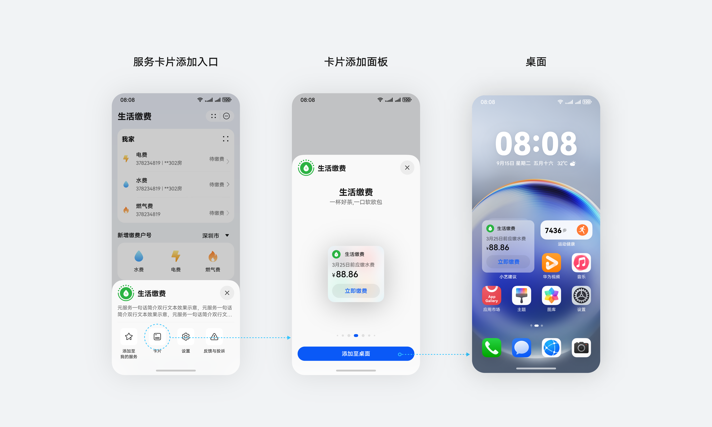

# 元服务体验场景

更新时间：

来源：https://developer.huawei.com/consumer/cn/doc/design-guides/ux-guidelines-overview-0000001900218352

#### 服务发现

无论线上或线下的方式都可以发现元服务。

线上：基于用户意图。从精准意图的搜索、用户事件触发的推荐到主动探索等场景。用户可以在设备的负一屏、全局搜索、应用市场、桌面等场景发现元服务。

线下：用户在 HarmonyOS Connect标签的支持下，用户也可以通过碰一碰、靠近或扫一扫该标签，发现并使用元服务。

#### 服务使用

使用流程：通过元服务入口打开元服务→启动加载→元服务落地页使用→退出元服务。

服务状态：服务状态可以在系统中多个地方实时显示和更新，包括锁屏、实况窗、负一屏。可通过这些系统级入口，开发者可将服务状态的变化即时触达到用户。

服务消息：服务动态、订阅消息、支付通知等服务全量消息可以在负一屏的服务消息中查看完整内容。

#### 服务管理

通过桌面、负一屏、应用市场、元服务等场景对元服务进行添加、收藏、移除等管理操作。

#### 服务分享

元服务与服务卡片支持近场与远场分享，可流转给设备也可以分享给联系人。

收到他人分享的元服务，可无需安装直接打开使用，或添加至负一屏/桌面。

