# 基础信息

更新时间：

来源：https://developer.huawei.com/consumer/cn/doc/design-guides/ux-guidelines-overview-0000001900384976

每个元服务有独立的图标、名称。基础信息将根据场景在元服务市场、元服务面板等界面展示。
 

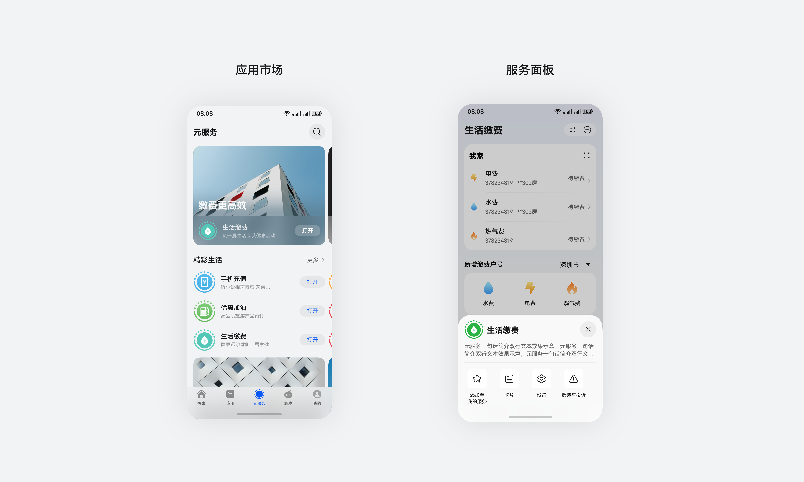

 

 

#### 名称

元服务名称应精确表示服务内容，不宜过长，确保简短、易懂、易记忆。为确保系统界面展示效果，服务名称建议不超过8个中文字符。
 
 

#### 图标

 
元服务图标与应用图标有明显区别，它继承了 HarmonyOS 的设计语言体系，内部圆形表示完整独立，外圈装饰线表示可分可合可流转的特点。
 

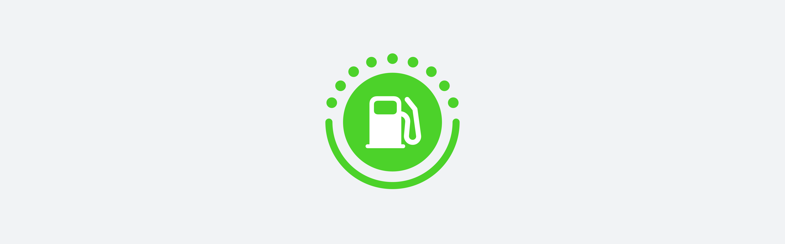

 
为便于开发者快速生成统一的元服务图标样式，我们在 DevEco Studio 提供了[元服务图标生成工具](https://developer.huawei.com/consumer/cn/doc/atomic-guides/atomic-service-icon-generation)。通过使用该工具，开发者仅需按照要求上传方形资源图，工具会自动裁剪生成完整的元服务图标。
 

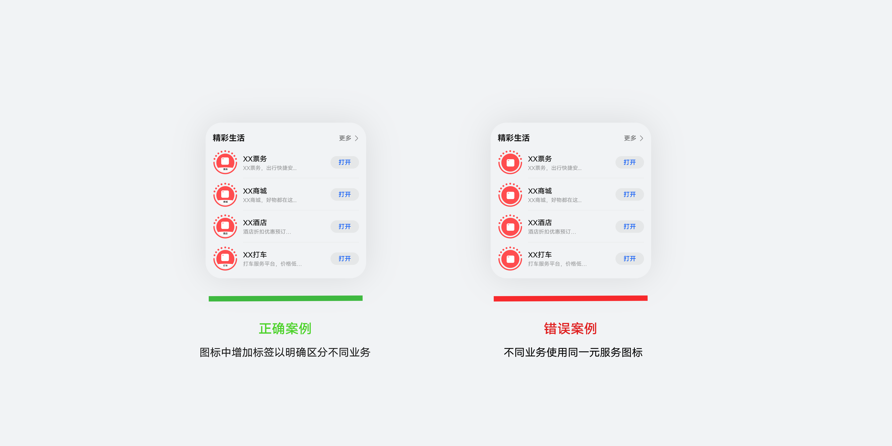

 

#### 方形资源图上传要求

 
开发者在元服务图标生成工具中上传的方形图资源需满足以下要求：
 
- 图片格式：.png、.jpeg、.jpg格式的静态图片资源
- 图片尺寸：1024 x 1024 px （正方形）
- 图片背景：不透明
- 质量要求：图标内容需清晰可辨，避免存在模糊、锯齿、拉伸等问题。

 

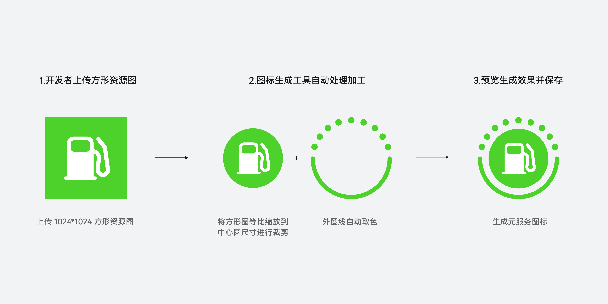

 

#### 图标资源设计

 
1）图标生成工具在生成元服务图标时，会将开发者上传的方形图等比缩放到中心圆的尺寸，然后将方形图遮罩裁剪成中心圆。开发者在设计图标资源时，需确保主体元素占比适中，避免出现主体元素占比过大，导致图标内容显示不完整；或出现主体元素占比过小，图标展示不够饱满均衡的问题。图标主体元素在图片尺寸中的建议占比为77%。
 

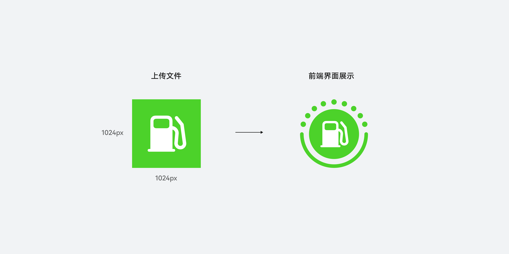

 

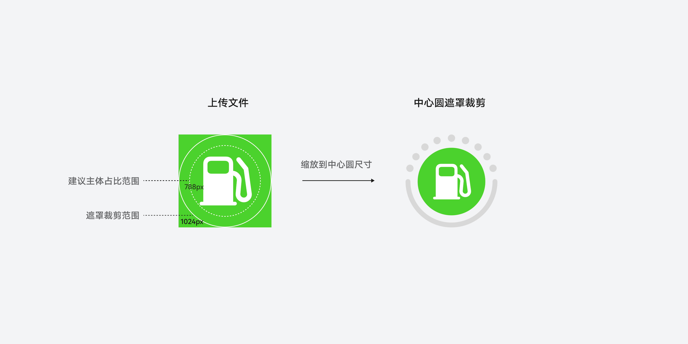

 
2）上传的资源图背景需确保为不透明背景，且资源图尺寸需满足要求。避免出现因尺寸或背景问题导致图标中心圆填充不完全的情况。（注：生成的元服务图标需确保图标中心圆为填充完全的正圆，不可出现其他形态）
 

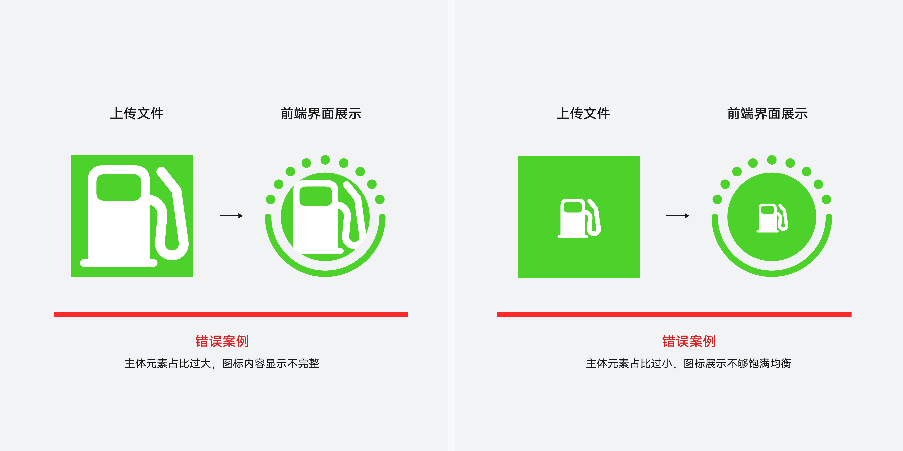

 
3）请勿使用可能误导用户的文字或图形元素，例如图标中包含新事件标记红点、HOT等元素，误导用户。
 

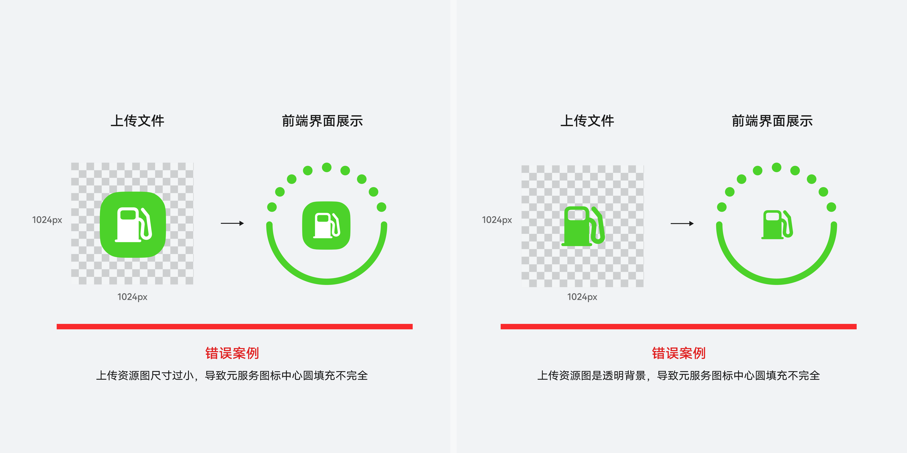

 
4）元服务图标外圈线请勿使用纯白或纯黑，以避免在纯白/纯黑页面背景上无法清晰辨识其轮廓形态。当中心圆背景为纯白/纯黑时，需给中心圆增加描边，以确保图标中心圆轮廓清晰可见。
 

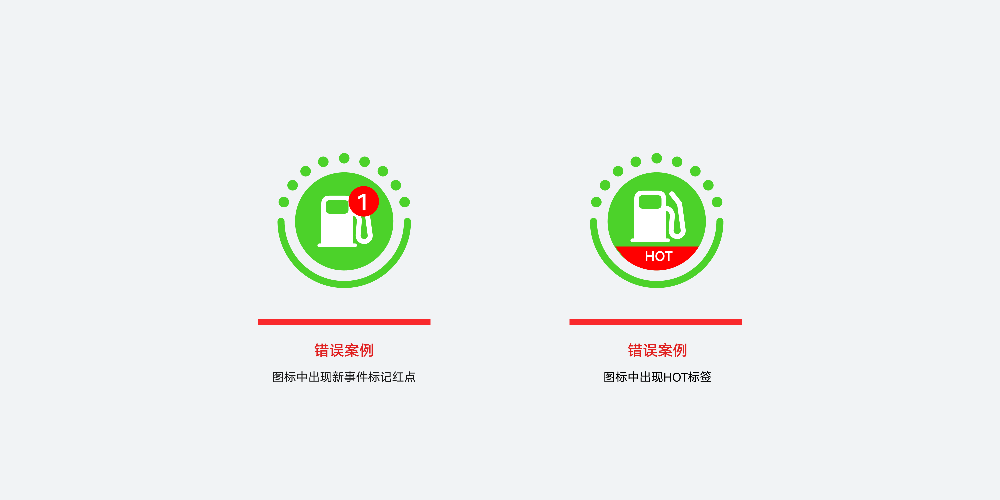

 

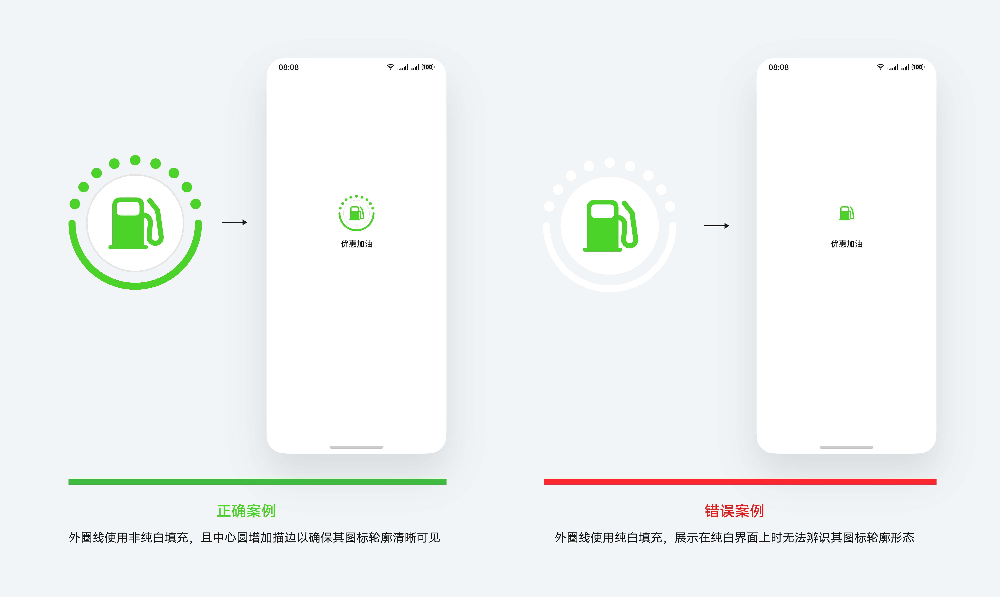

 
5）若同一开发者名下有多个元服务，建议在图标中增加业务名称标签以区分不同业务。应避免出现多个元服务使用同一元服务图标的情况。
 

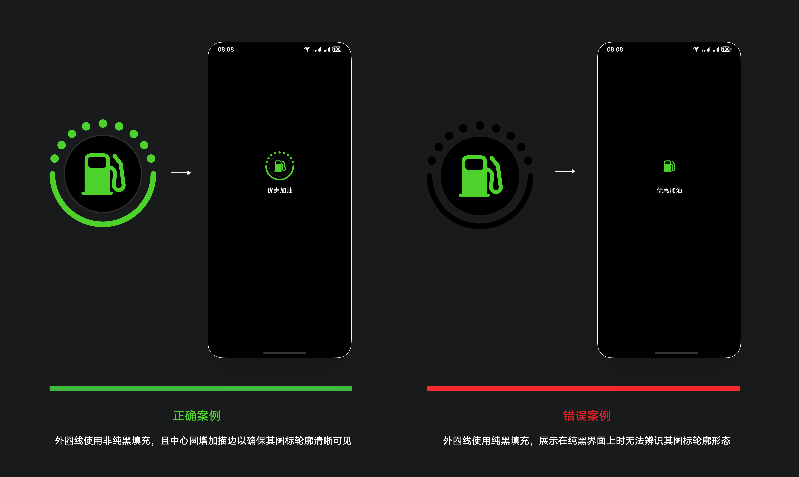
