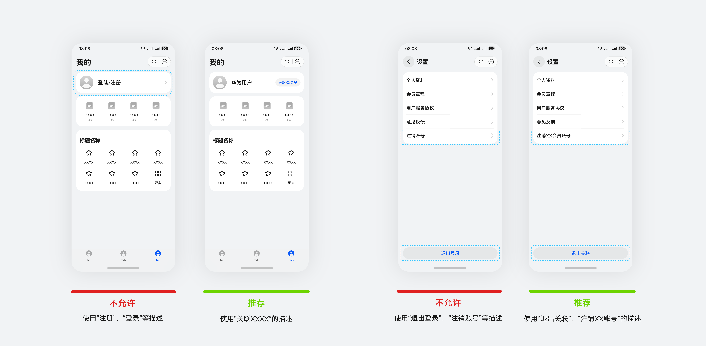
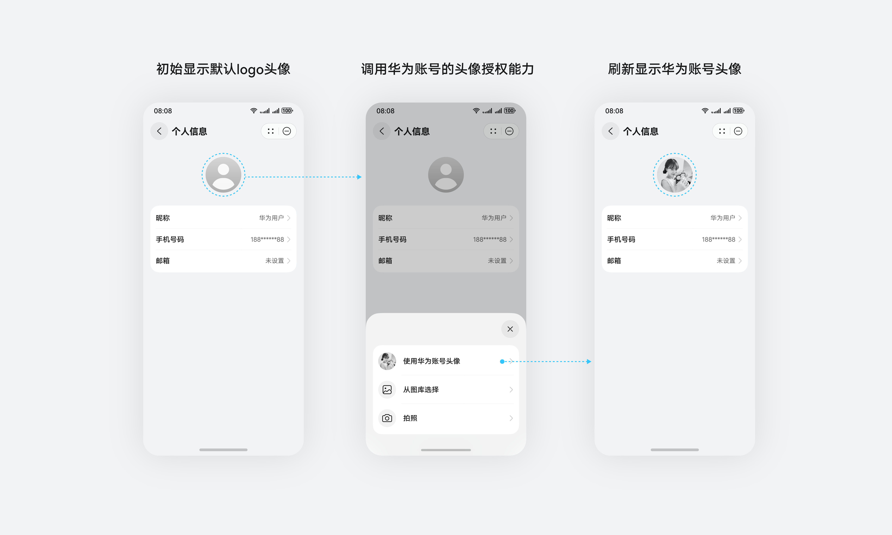
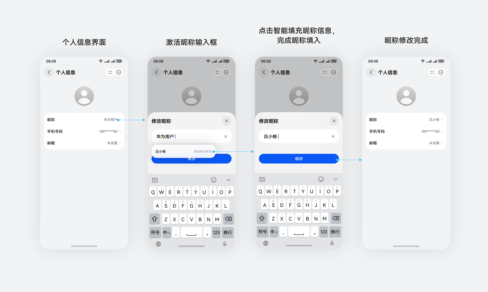
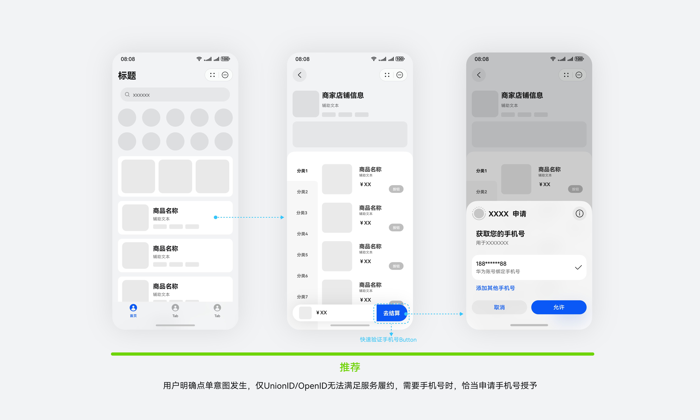
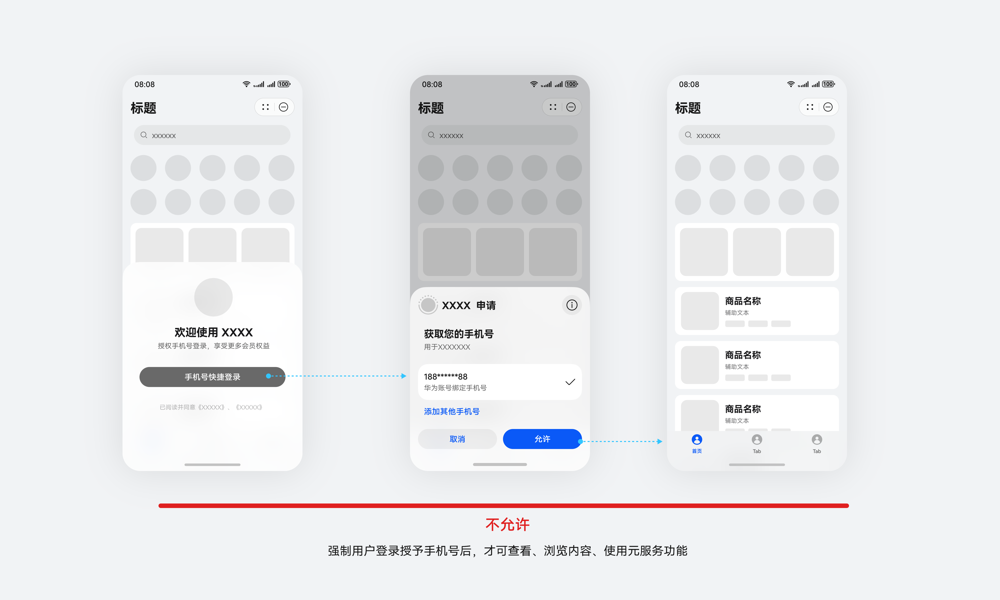
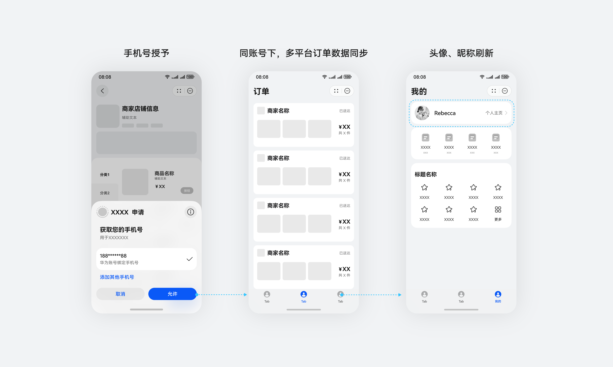
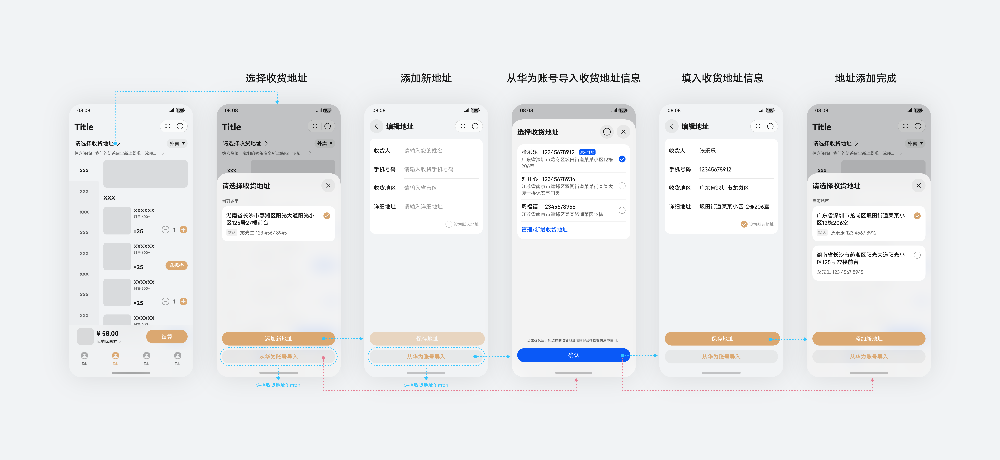
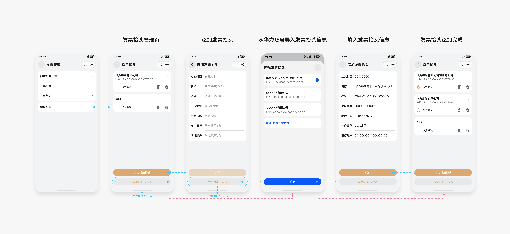

# 账号

更新时间：

来源：https://developer.huawei.com/consumer/cn/doc/design-guides/accounts-0000001967444380

#### 使用华为账号登录

 

#### 概述

华为账号（Account Kit）提供简单、快速、安全的登录功能，让用户快捷地使用华为账号登录元服务，当元服务涉及账号体系和登录能力时，需规范使用华为账号能力。通过用户授权，华为账号可提供手机号、头像、收货地址、发票抬头等用户信息，无需用户手动输入复杂信息，帮助元服务更高效的完成履约流程。元服务设计时，建议按照官方规范指引进行设计实现。
 
 

#### 静默登录

**场景约束**
 
**使用任意元服务，必须满足以下两点条件：**
 
1）用户设备已登录华为账号
 
用户使用元服务必须登录华为账号。用户设备下华为账号是否登录判断，由系统自动处理，开发者无需任何处理。
 
① 用户设备未登录华为账号时，点击任一元服务入口访问使用元服务时须先完成华为账号登录。
 
② 用户只能通过系统设置入口退出华为账号登录。用户退出华为账号登录后，系统将清理后台运行的元服务任务及进程，无法访问使用任一元服务。
 
2）用户同意平台统一的用户协议与隐私声明，相关接入指南请参阅[托管隐私声明](https://developer.huawei.com/consumer/cn/doc/app/agc-help-privacy-policy-atomic-0000002317135133)。
 

 
 
**获取 Openid & UnionID 静默登录**
 
**元服务内涉及账号体系时，需调用官方提供的登录API进行静默登录**
 
1）登录API是基于华为账号体系提供的登录能力。在用户同意隐私声明后，开发者可通过调用登录API，方便地获取用户身份标识，快速建立元服务内的用户体系，让用户直接使用服务，开展经营活动。用户打开元服务时，不需要用户点击登录/注册按钮，开发者即可获取用户唯一标识OpenID和用户在该元服务下的唯一标识UnionID，完成静默登录。开发者可以根据用户标识来生成自定义登录态，用于后续业务逻辑中前后端交互时识别用户身份，相关接入指南请参阅[静默登录](https://developer.huawei.com/consumer/cn/doc/atomic-guides/account-atomic-silent-login)。
 
2）开发者调用华为账号体系，需有页面呈现用户登录状态。如，开发者需要在“我的”相关页面呈现用户登录状态，建议使用[默认头像](https://developer.huawei.com/images/download/next/yuanfuwu-touxiang.zip) + 华为用户（或自定义昵称，如“元服务名称+用户”），并默认显示为已登录状态。
 

 

 
使用华为账号登录是元服务使用的基本要求，开发者应避免在用户界面直接使用“注册”、“登录”、“退出登录”、“注销账号”等描述，避免误导用户。 开发者不应引导用户进行账号登录，不可使用自行设计实现的登录界面，相关设计可参阅[开发者可以使用自行设计的登录界面吗？](https://developer.huawei.com/consumer/cn/doc/atomic-faqs/faqs-common-account-5)
 
元服务内如涉及使用开发者账号体系，需与华为账号建立关联，相关设计请参阅[开发者怎么在元服务中使用开发者账号体系？](https://developer.huawei.com/consumer/cn/doc/atomic-faqs/faqs-common-account-6)当开发者提供注销等账号服务，应明确操作对象，如使用“注销XX账号”等描述。
 

 

 

#### 获取华为账号用户信息

 

#### 概述

当元服务需要获取或完善用户个人资料（头像、昵称、手机号、收货地址、发票抬头）时，可通过Account Kit提供的相关能力，引导用户填写、管理相关信息并完成授权。
 
 

#### 获取头像

当元服务需要获取用户头像时，可调用华为账号的[头像授权能力](https://developer.huawei.com/consumer/cn/doc/atomic-guides/account-guide-atomic-get-avatar-nickname)，引导用户完成头像授权。
 

 
 

#### 获取昵称

当元服务需要获取用户昵称时，可调用[智能填充服务](https://developer.huawei.com/consumer/cn/doc/harmonyos-guides/scenario-fusion-intelligent-filling)获取华为账号的昵称信息，引导用户填写华为账号昵称。
 

 
 

#### 获取手机号

 
当元服务需要获取用户手机号时，可调用华为账号的[手机号授权能力](https://developer.huawei.com/consumer/cn/doc/atomic-guides/account-guide-atomic-get-phone)，引导用户完成手机号授权。
 
元服务倡导在用户意图发生时，恰当、合理向用户申请手机号权限授权，可参考如下设计：
 

 
不允许在用户刚刚进入元服务还未开始查看、浏览页面时，就弹出手机号授予申请。
 

 
**元服务开发者可通过手机号同步用户数字资产**
 
用户授权手机号后，开发者可通过手机号查找开发者账号下对应的用户账号，并将其与元服务登录的华为账号进行关联，进而将用户在其他平台的数字资产同步至元服务，如用户历史订单、会员等级等。
 
开发者可以根据业务需要，对“我的”页面中的用户头像、昵称进行刷新，支持用户主动修改。
 

 

#### 获取收货地址

当元服务需要获取用户收货地址时，可调用华为账号的[获取收货地址能力](https://developer.huawei.com/consumer/cn/doc/atomic-guides/account-guide-atomic-choose-address)，引导用户完成收货地址授权。
 
开发者可在收货地址管理界面、收货地址编辑界面等位置，设置[选择收货地址Button](https://developer.huawei.com/consumer/cn/doc/harmonyos-guides/scenario-fusion-button-ship-to)，实现用户收货地址的快速填充和使用。
 

 
 

#### 获取发票抬头

当元服务需要获取用户发票抬头时，可调用华为账号的[获取发票抬头能力](https://developer.huawei.com/consumer/cn/doc/harmonyos-guides/account-select-invoice-title)，引导用户完成发票抬头授权。
 
开发者可在发票抬头管理界面、发票抬头编辑界面等位置，设置[选择发票抬头Button](https://developer.huawei.com/consumer/cn/doc/harmonyos-guides/scenario-fusion-button-invoice-title)，实现用户发票抬头的快速填充和使用。
 

 
 

#### 常见账号问题FAQ

 
如有疑问，请参阅[常见账号问题FAQ](https://developer.huawei.com/consumer/cn/doc/atomic-faqs/faqs-common-account)以获取更多帮助。
