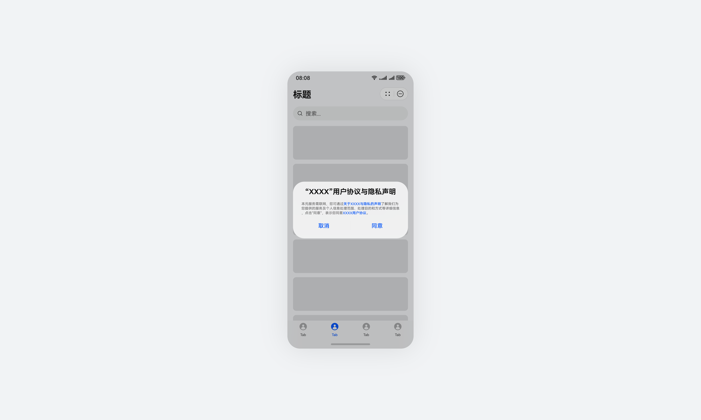
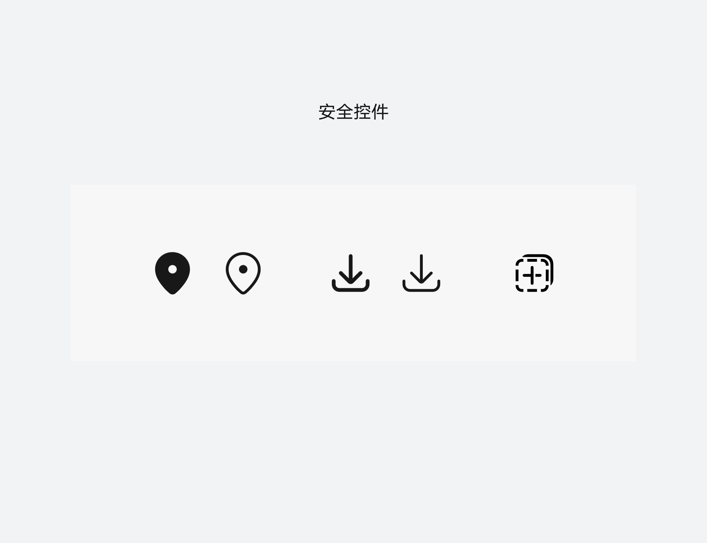
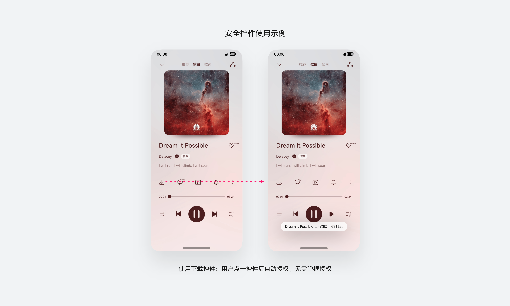
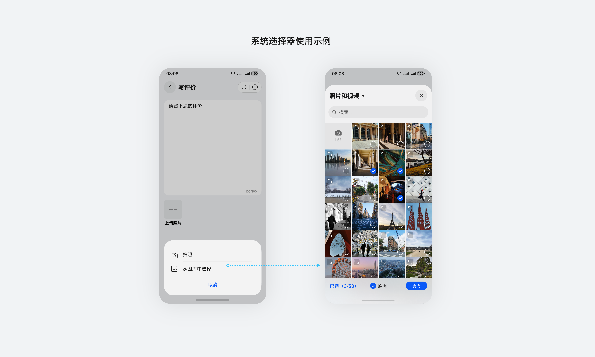
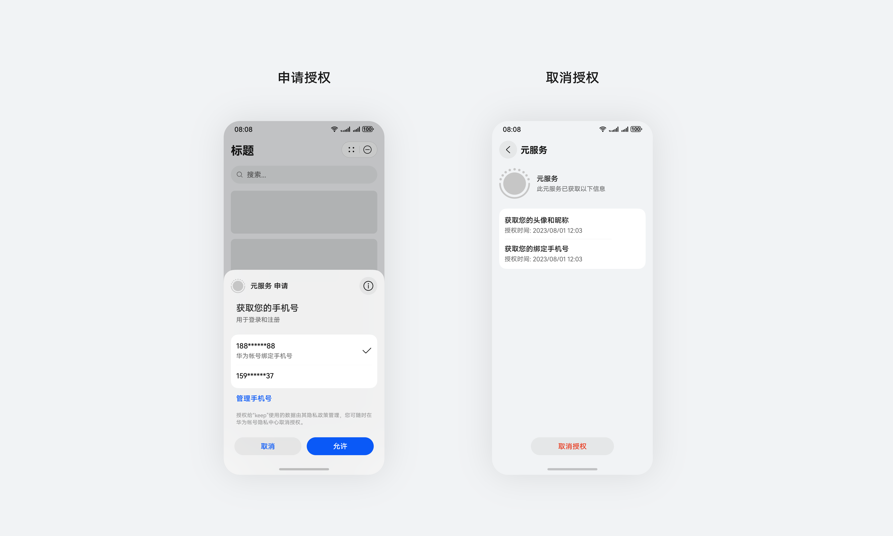
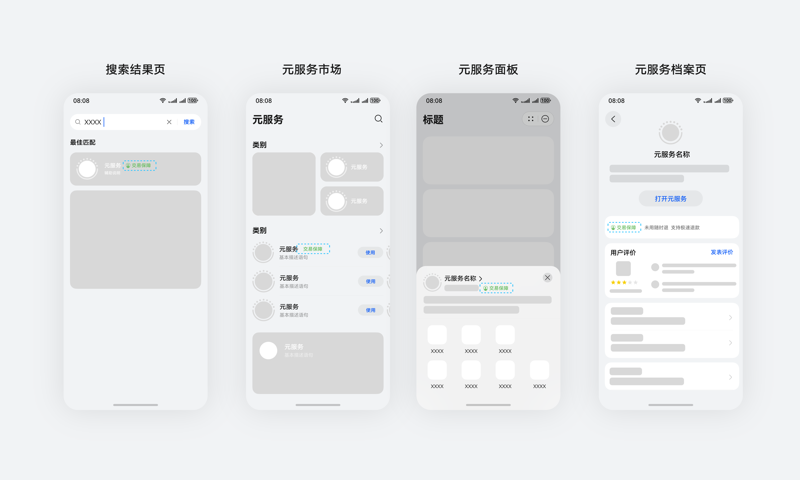

# 安全可靠

更新时间：

来源：https://developer.huawei.com/consumer/cn/doc/design-guides/ux-guidelines-overview-0000001900584166

感知到的安全是积极体验的驱动力，应提供给用户一个可感知、可控制、易使用的安全体验。
 

##### 尊重隐私，可管可控

1）信息透明：采集个人数据时，应清晰、明确地告知用户，并确保告知用户的个人信息将被如何使用。
 

 

 
2）规避风险：帮助用户规避风险，准确认识风险以及后果。在获取用户的个人数据时，可以通过调用系统提供的场景化组件来规避不可控的数据获取，如[使用安全控件](https://developer.huawei.com/consumer/cn/doc/harmonyos-guides/security-component-overview)（位置、剪贴板、保存）、[使用系统选择器](https://developer.huawei.com/consumer/cn/doc/harmonyos-guides/use-picker)（图库、文件、联系人、扫一扫、相机等）。
 

 
安全控件
 

 

 

 
系统选择器
 

 

 

 
3）可控制：权限授权、账号个人信息授权用户可控制、可反悔。
 

 

 
 

##### 安全可信，权威可靠

权威的安全认证体系
 
元服务提供了交易保障的官方认证机制，具备安全认证的元服务，具有先行赔付，以及完善的消费者权益保证服务。商家申请该认证后，在搜索结果页、元服务市场、元服务服务面板、元服务档案页等场景会有安全认证标签的露出，提升用户对该元服务安全可靠的信赖感
 

