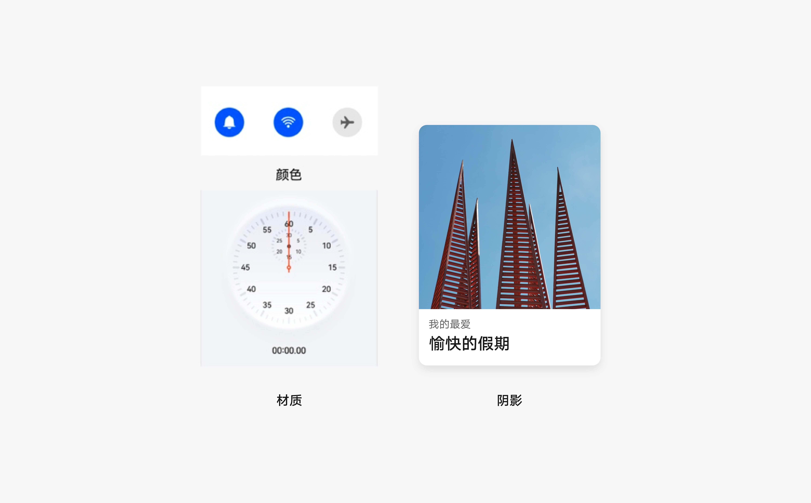
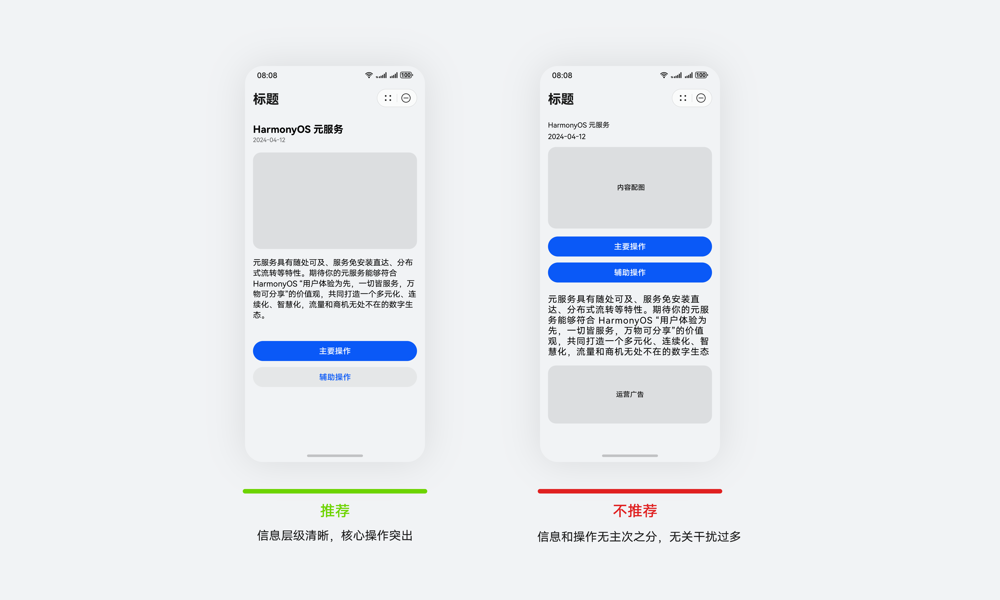
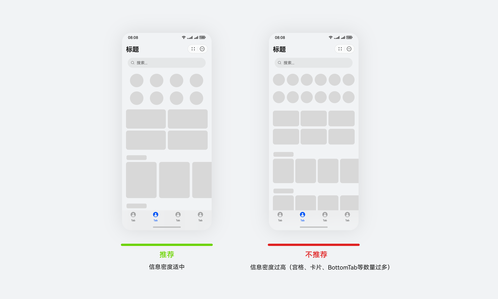
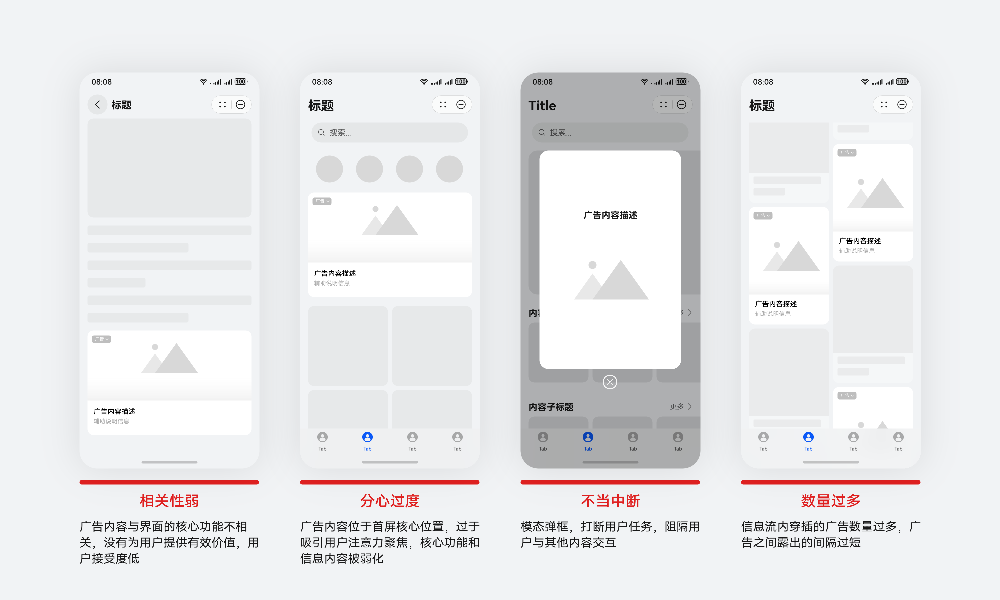
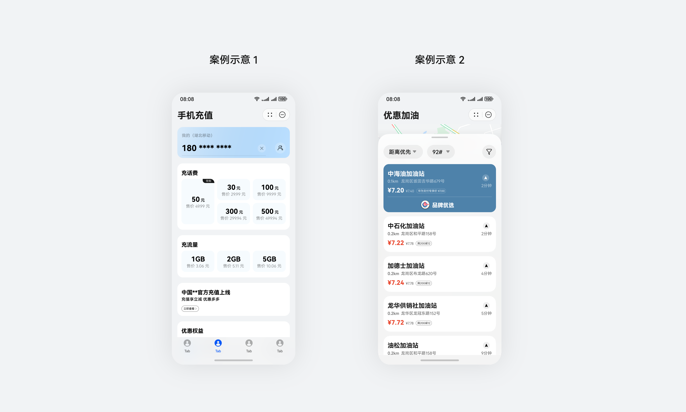
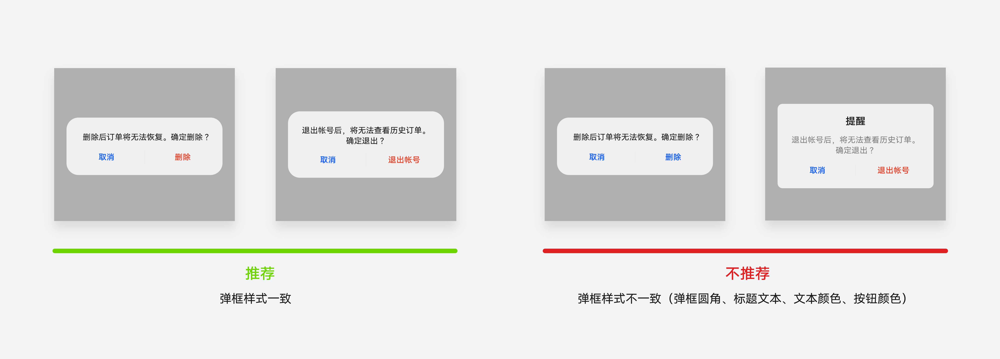
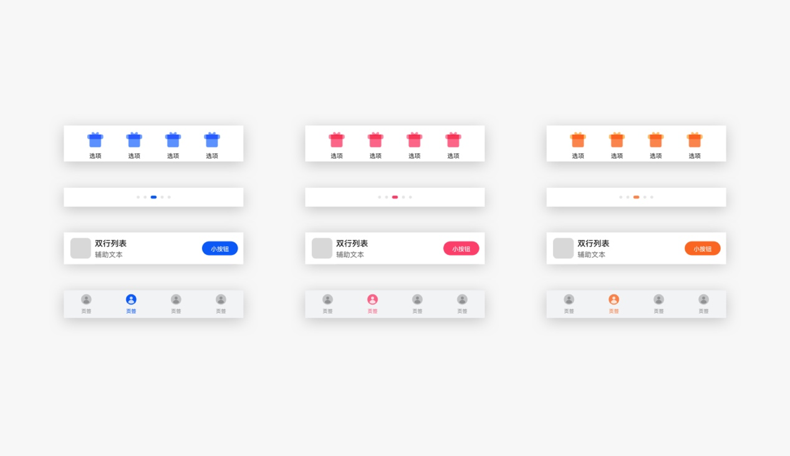

# 简洁高级

更新时间：2025-06-20 02:19:00

来源：https://developer.huawei.com/consumer/cn/doc/design-guides/ux-guidelines-overview-0000001900424082

## 可视愉悦，界面平衡

通过平衡性、层级性两个维度来确保界面具有平衡协调的信息组织性，达到舒适愉悦的视觉观感。

1）平衡性：确保页面中视觉基础范式的清晰、对齐，以及比例的平衡。

① 元素图形平衡

② 元素间大小重量平衡

③ 页面视觉平衡

④ 元素排布对齐、文本排版对齐

2）层级性：

深度层级：通过色彩明度、阴影、模糊等视觉手段，构造深度线索。界面元素的前景与背景对比清晰，易于识别。

平面层级：通过文本字号、色彩饱和度差异、元素大小差异，来构造平面层级。界面中的文字层级对比清晰，色彩重点突出，元素重点突出。

## 简洁布局，突出重点

1）突出重要信息或功能，视觉动线符合用户浏览习惯。

界面设计时，应根据内容和操作的重要程度进行合理的视觉元素排布，确保突出界面中最重要的任务或关键操作。避免过多冗余信息干扰，影响用户操作。

2）降低界面信息密度

过高的信息密度会提升页面的复杂性，加重用户的认知负荷。过低的信息密度又会导致单个页面呈现的信息量过少，降低用户获取信息的效率。需合理设计界面内的信息呈现，确保界面信息密度保持在一个适当水平。可从以下几个方面来考虑：

①　界面信息种类数适中，包括大小、色彩数量等。

②　界面信息数适中，包括组块数量、文字数量等。

③　适当留白，关键操作的交互控件在界面上足够明显，界面内合理的留白，让界面更加清晰明了。

3）避免广告信息干扰用户，弱化广告感

高感知的内容与用户当前的任务目标不符时，就会产生广告感。过度的无关信息会导致用户感到界面杂乱，不简洁。可从这几个维度进行价值评估：

· 价值适用：提供与任务相关的信息内容，达成用户目标。

· 分心适度：避免视觉设计引起过渡凸显，维护用户注意力聚焦。

· 中断适时：降低广告组件中断用户任务所带来的的用户成本，且时机得当。

· 数量适中：控制整体数量，保持适度平衡，不过多打扰。

## 精致细节，体现品质

界面从布局、图标、颜色、材质、文字，保持清晰。

界面布局：布局平衡，间距一致。

文字质量：在不同的背景亮度下，文字保持清晰易读。

图片质量：图片的显示应清晰易识别，减少模糊感、块面感，色彩还原度高。

图标质量：图标表意清晰；图标线条粗细、风格一致；使用一种图标风格，单个界面最多两种图标风格。

## 界面一致，易学易用

每个界面相同场景处理方式保持一致，包括布局、颜色、材质、字体。

## 多彩特征，多元有序

色彩是用户对界面感知的第一印象，通过不同颜色的运用，可以创造出不同的情感和氛围。

元服务可以使用符合品牌特色的特征色作为界面主色，所有界面操作元素统一一种颜色。

