# 轻量高效

更新时间：

来源：https://developer.huawei.com/consumer/cn/doc/design-guides/ux-guidelines-overview-0000001939183197

##### 导航清晰，入口明确

 
1）导航应该提供清晰的路径。用户使用的时候，能够知道当前处在界面的什么位置，操作后将会跳转到什么位置。建议开发者直接调用元服务官方提供的导航栏 ([AtomicServiceNavigation](https://developer.huawei.com/consumer/cn/doc/harmonyos-references/ohos-atomicservice-atomicservicenavigation)) 控件。提供以下3种样式：纯文本/图形文本、品牌Logo、品牌Logo+名称文本。
 

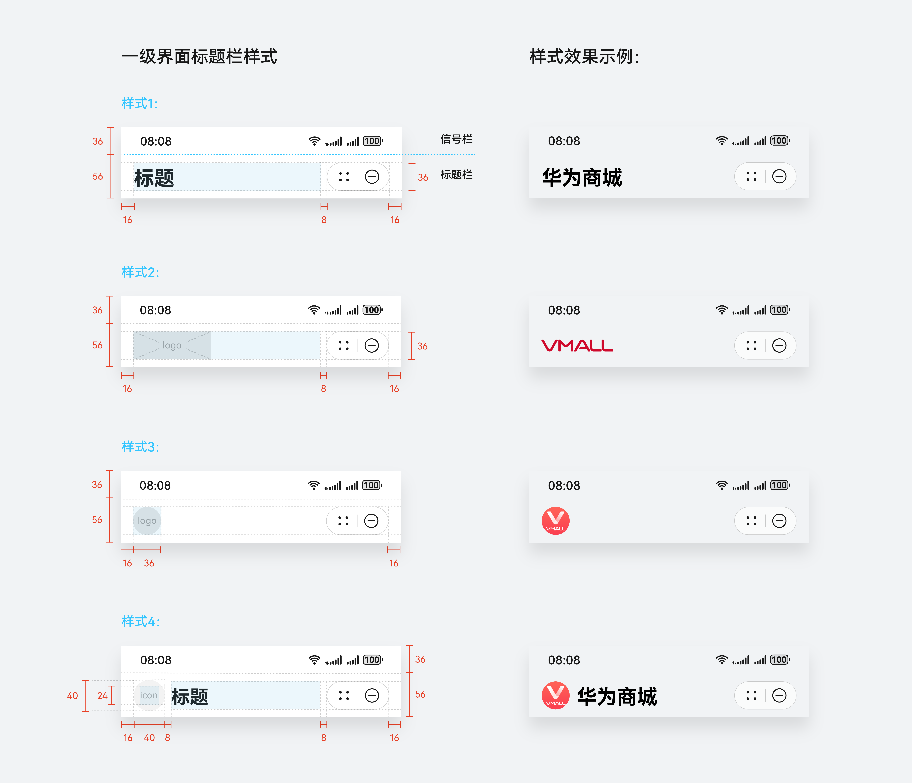

 

 
若开发者选择自行设计开发导航样式，请确保导航简洁清晰，避免以下设计：
 

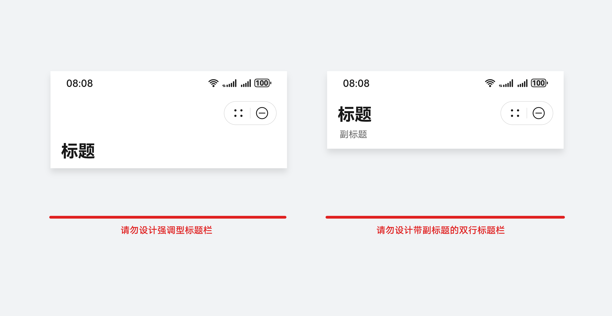

 

 
2）次级页面左上角的返回键交互行为统一定义为“返回上一层”，而非“返回前一个界面”。
 

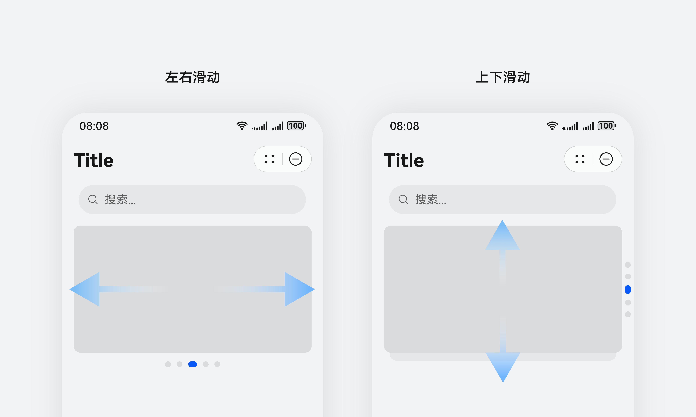

 

 
3）元服务所有界面的标题栏右侧，会统一放置元服务胶囊（Menubar）。开发者在界面设计中请注意合理避让该区域，避免功能冲突。整个标题栏区域的信息应保持简洁易识别，元服务胶囊左侧请勿放置功能图标。
 

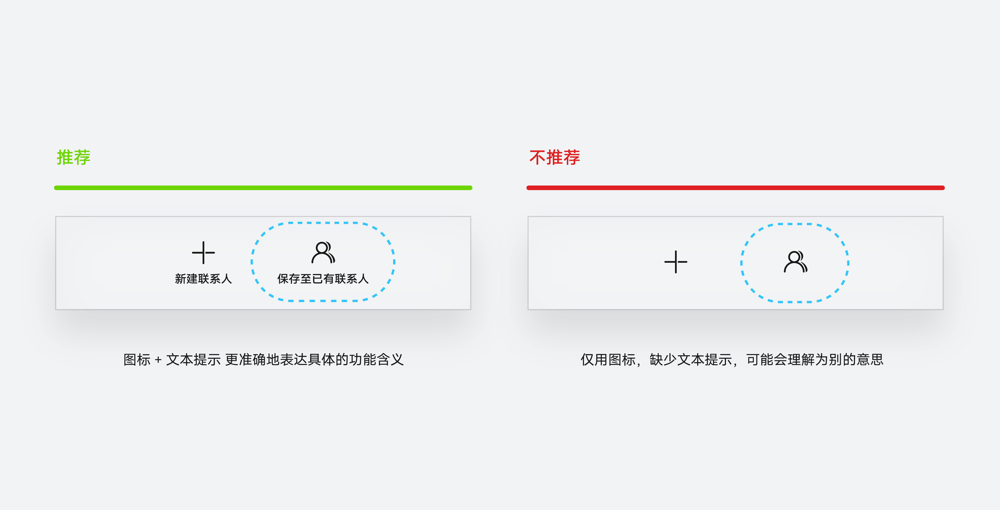

 

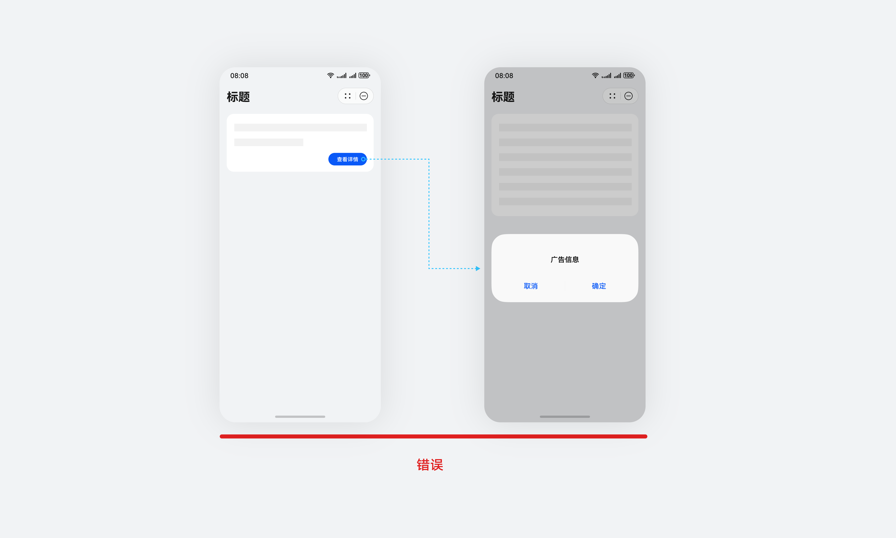

 

 
4）每个界面中功能的入口和出口必须明确、清晰、稳定， 通过界面元素，帮助用户清晰认知界面层级和当前所在位置。
 

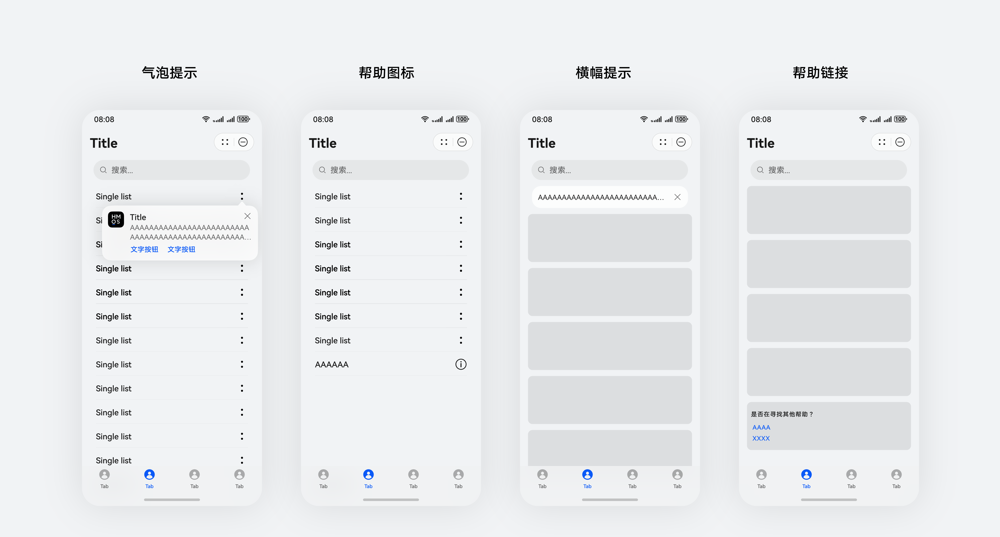

 

##### 轻量架构，高效触达

1）轻量架构：元服务的信息架构应保持简洁轻量，界面中只提供对用户有核心价值的内容。
 
① 一级页面通过底部页签对内容进行组织架构，一级页面顶部导航栏不再使用多页签对内容进行分类。
 

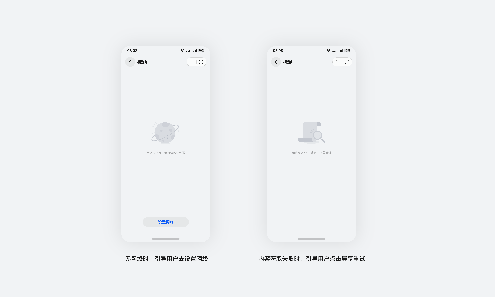

 

 
② 元服务底部页签的数量最多不超过5个，最少不少于2个，若页签数量超过上限，建议重新对元服务信息架构进行组织梳理。建议开发者直接调用元服务官方提供的底部页签 ([AtomicServiceTabs](https://developer.huawei.com/consumer/cn/doc/harmonyos-references/ohos-atomicservice-atomicservicetabs)) 控件，图标/文本样式均支持自定义。
 
运营图标配置规则：支持在底部页签上配置运营图标，图标运营位最多一个。若底部页签数量为单数，则运营位需位于最中间的页签上。若底部页签数量为双数，则运营位可位于任意页签。
 

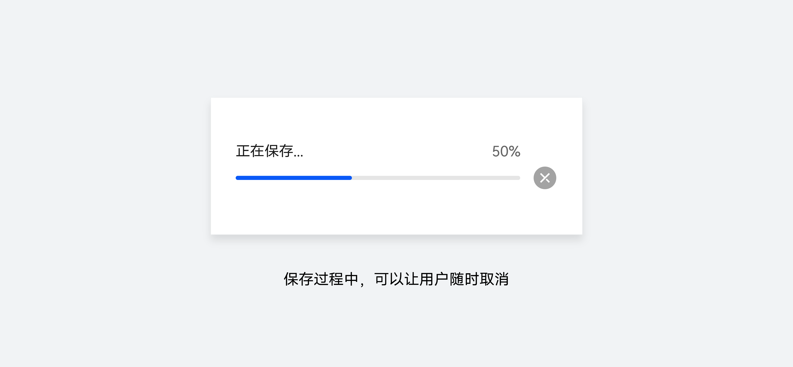

 

 
2）功能高效触达：核心功能的关键操作在首屏可发现、易操作。
 
功能操作是否易发现，可以从复杂操作入口是否有提示、入口发现的困难度这几个维度考虑设计。
 

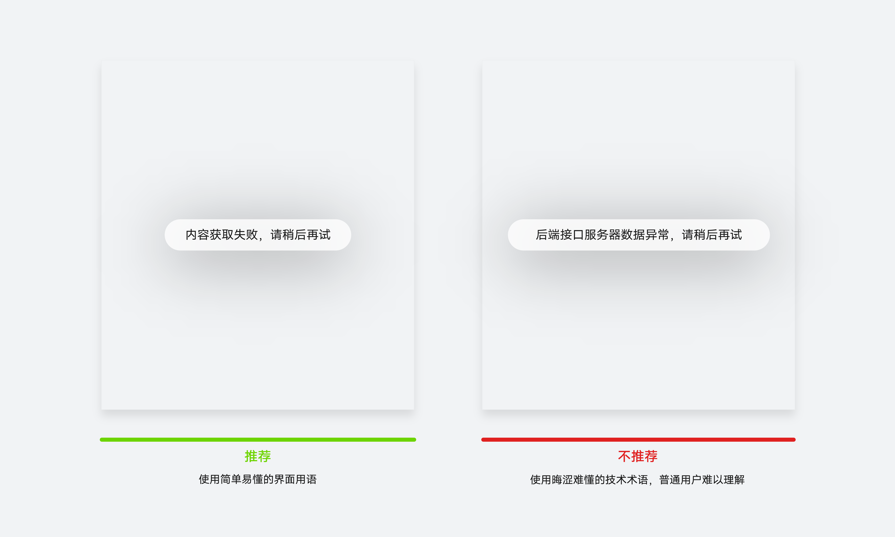

 

 
3）页面层级合理：界面跳转关系与转场效果符合层级逻辑，浅层操作减少界面跳转。
 

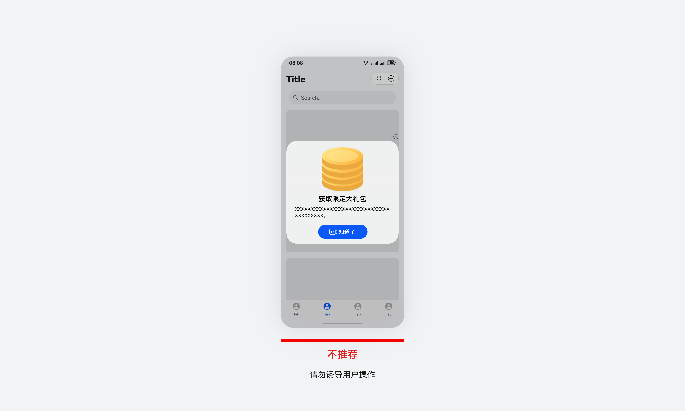

 

 
 

##### 直觉交互，符合预期

1) 遵循基础交互与手势，屏幕边缘左右滑动返回与退出。
 
2) 操作合理性：
 
① 遵循基础交互与手势，屏幕边缘左右滑动返回与退出。
 
② 可见性(状态、变化、内容可见)，任何操作都有实时反馈。
 
③ 不要假设用户的推理能力，要设想用户偏好简单易懂的操作。
 
④ 运用同理心来衡量设计是否符合用户心智模型，确保交互控件的行为和意图符合用户认知。
 

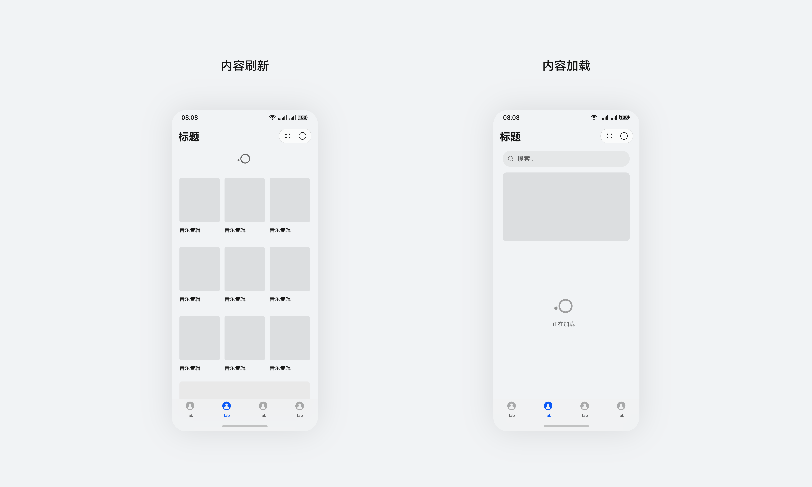

 

 
3）内容易理解性：界面中的图标、提示信息易于理解，一看就懂。
 

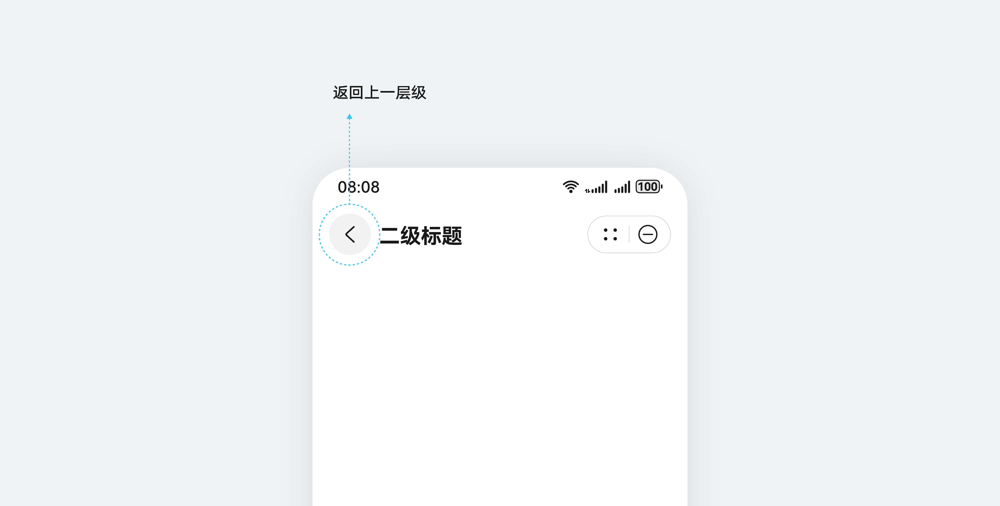

 

 
4）体验连贯性：使用过程中不应被弹窗、跳转等打断主流程。
 

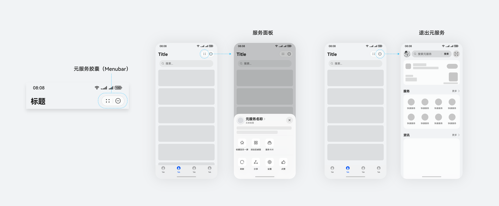

 

 
 

##### 容错防呆，消除歧义

1）为用户提供简单易学的引导和提示，降低出错概率。
 

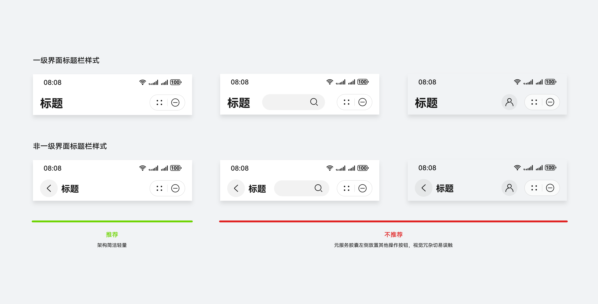

 

 
2）不可避免出现错误时，除了告知操作失败，应该给出解决方案的建议。如无网络时，引导用户去设置网络；内容获取失败时，引导用户点击屏幕重试。
 

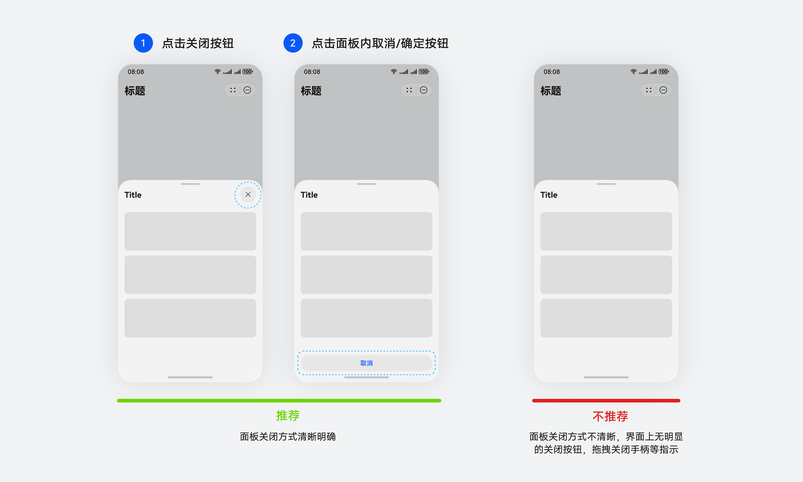

 

 
3）任何需要用户等待的操作，都需要提供暂停或取消的方式。
 

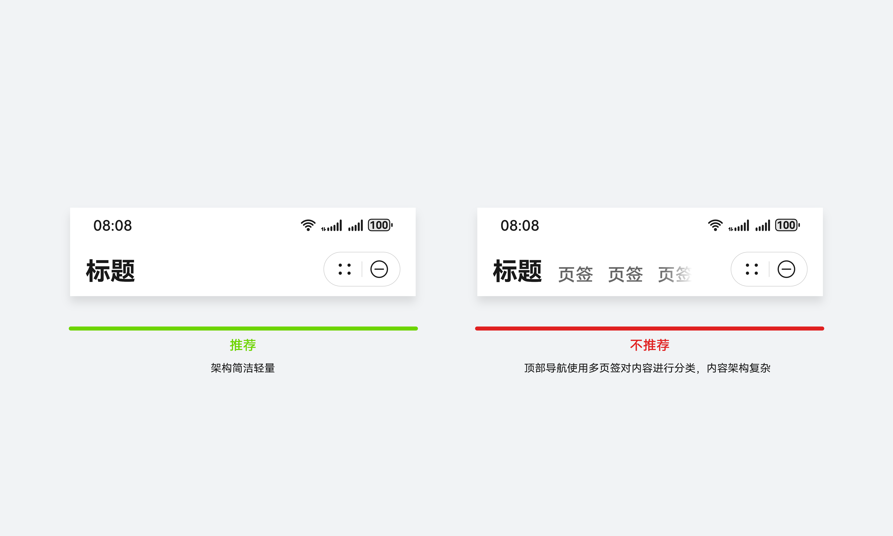

 

 
 

##### 友好表达，通俗易懂

1）使用用户容易理解的自然语言，避免技术术语词汇与生僻的缩写。
 

 

 
2）运营性质的界面用语，避免诱导性用语引导用户点击。
 

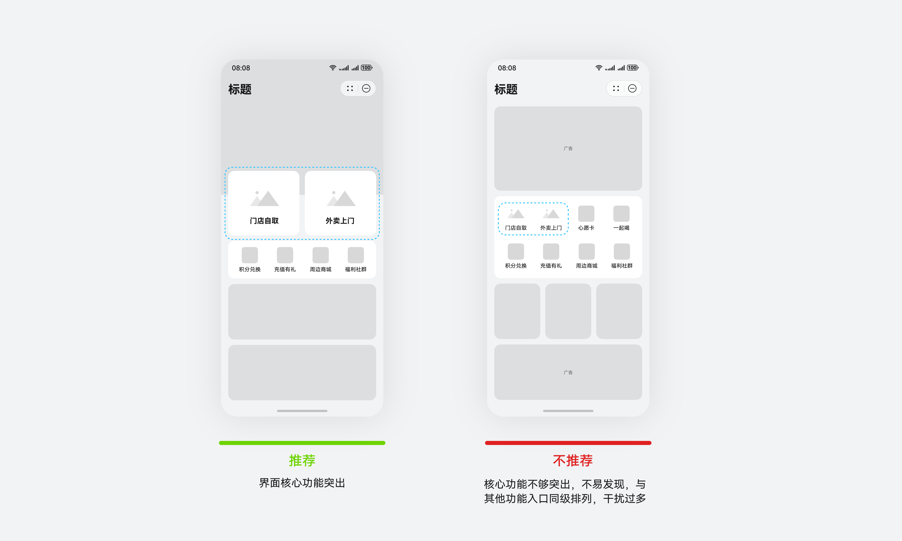

 

 
 

##### 及时反馈，缓解等待

数据的获取和加载时长应尽可能缩短，以避免用户长时间等待。当不可避免地出现需要加载和等待的场景时，需提供及时的反馈以缓解用户的等待焦虑。
 

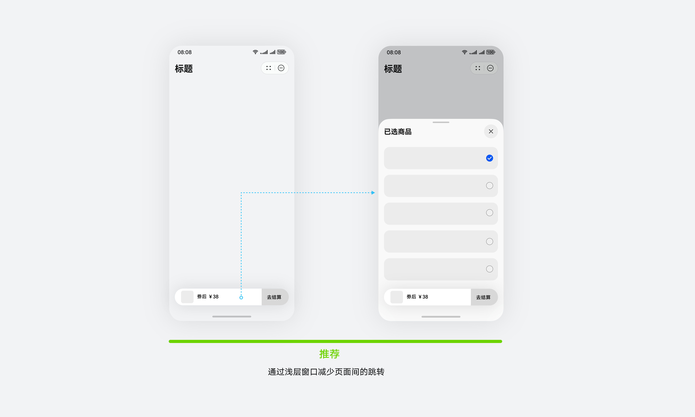
