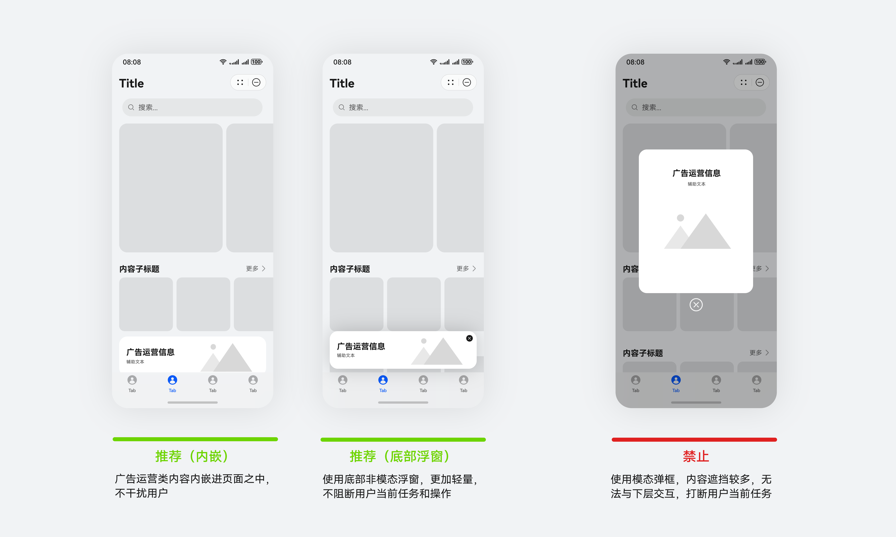
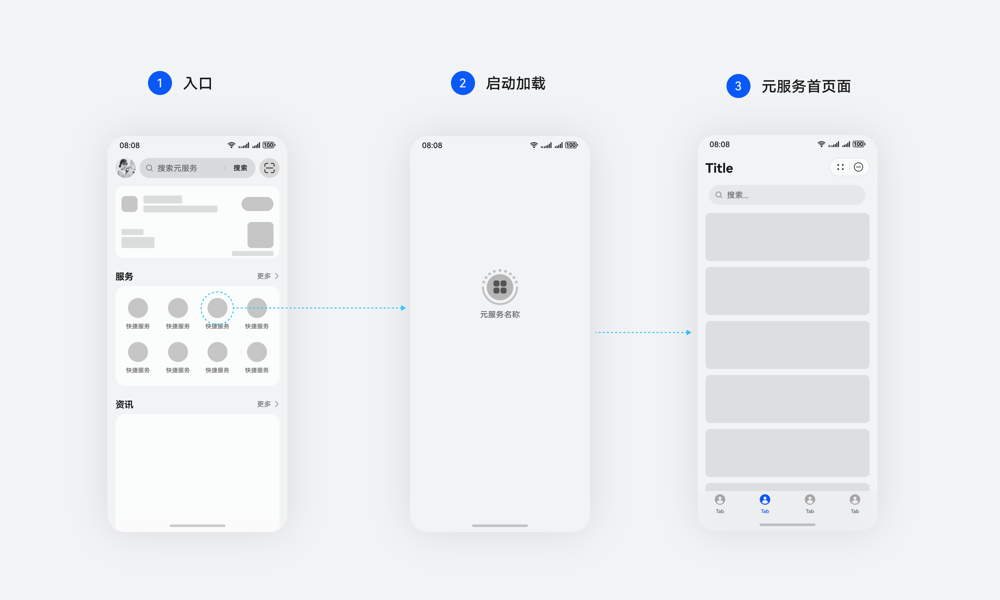
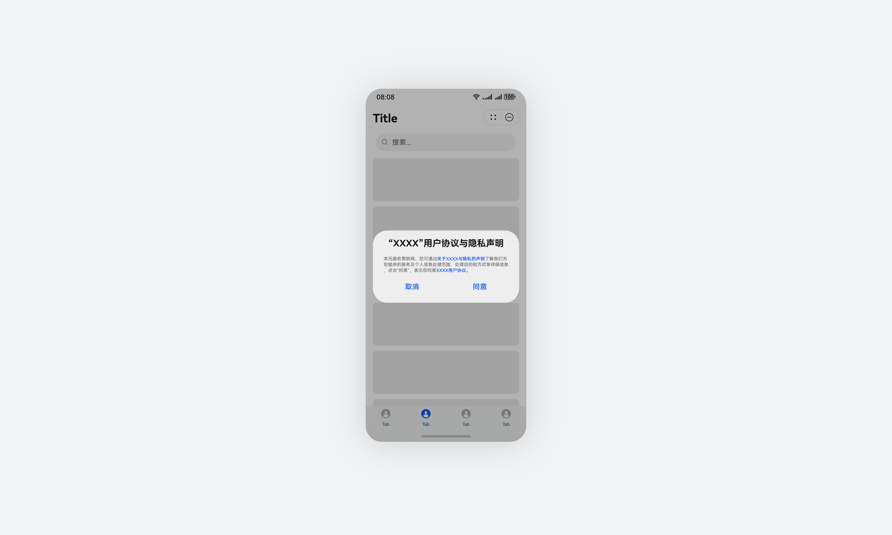
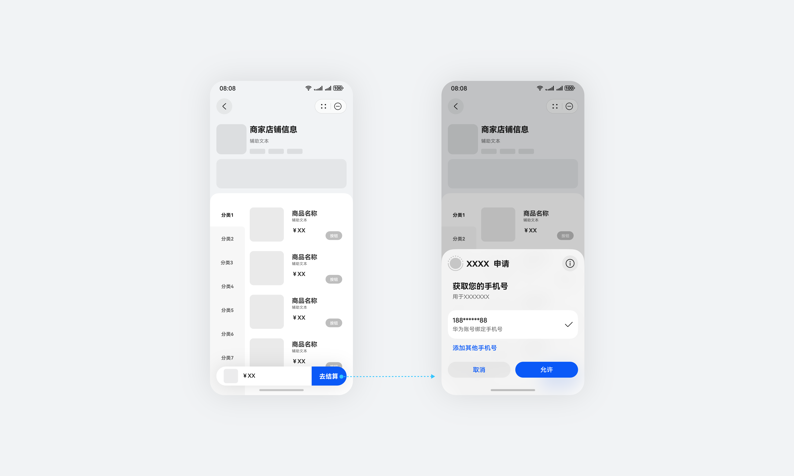
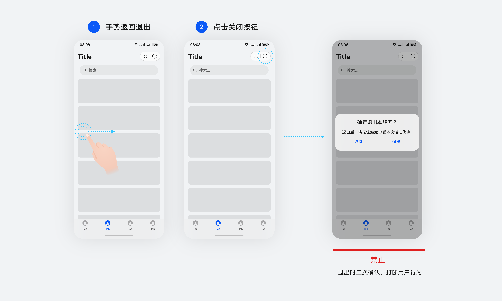
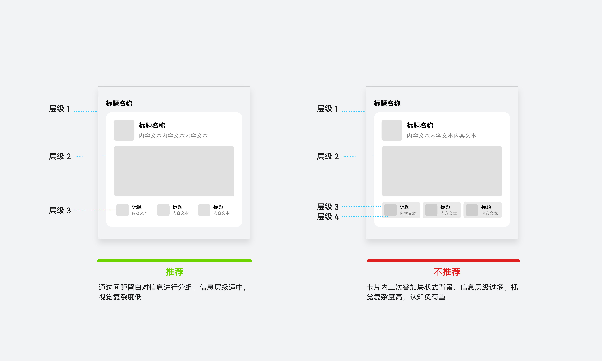
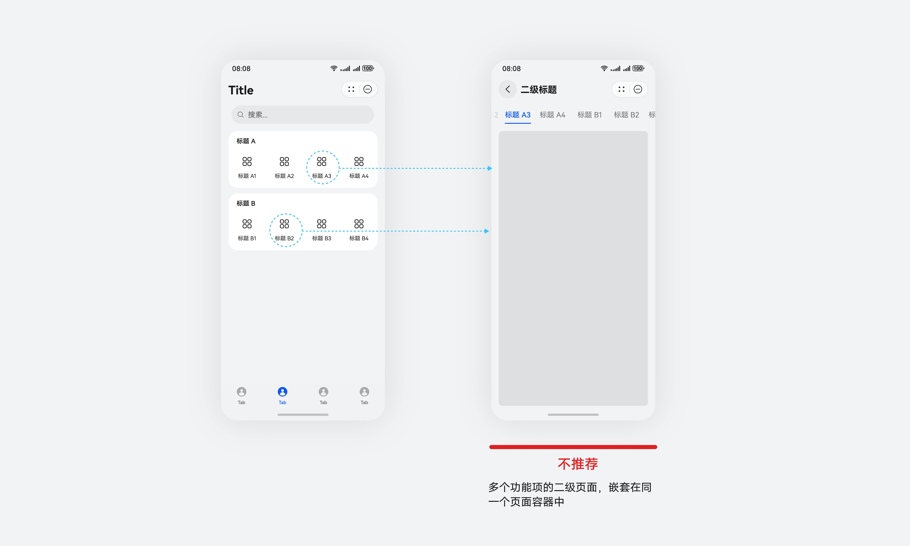
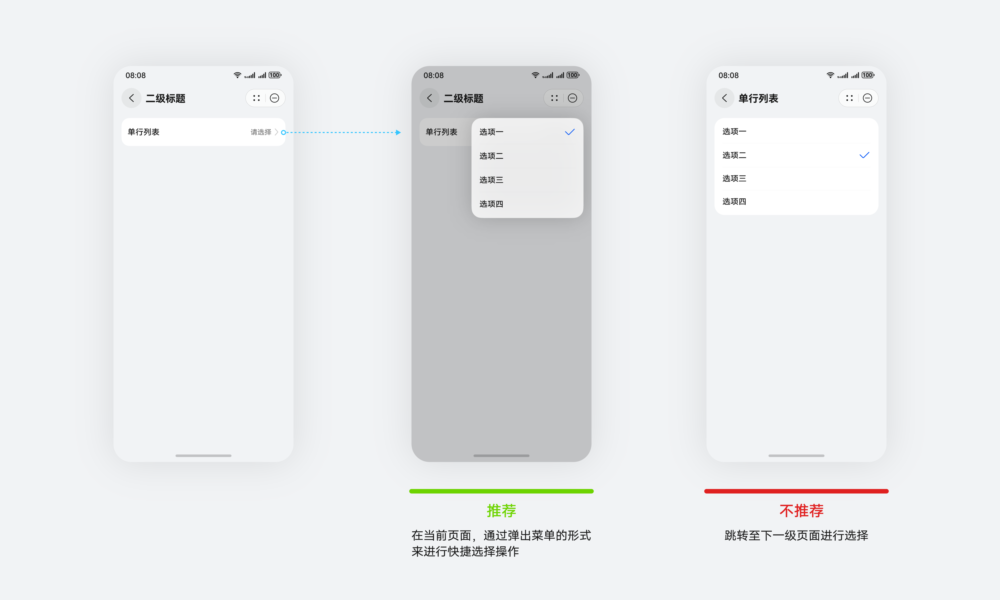
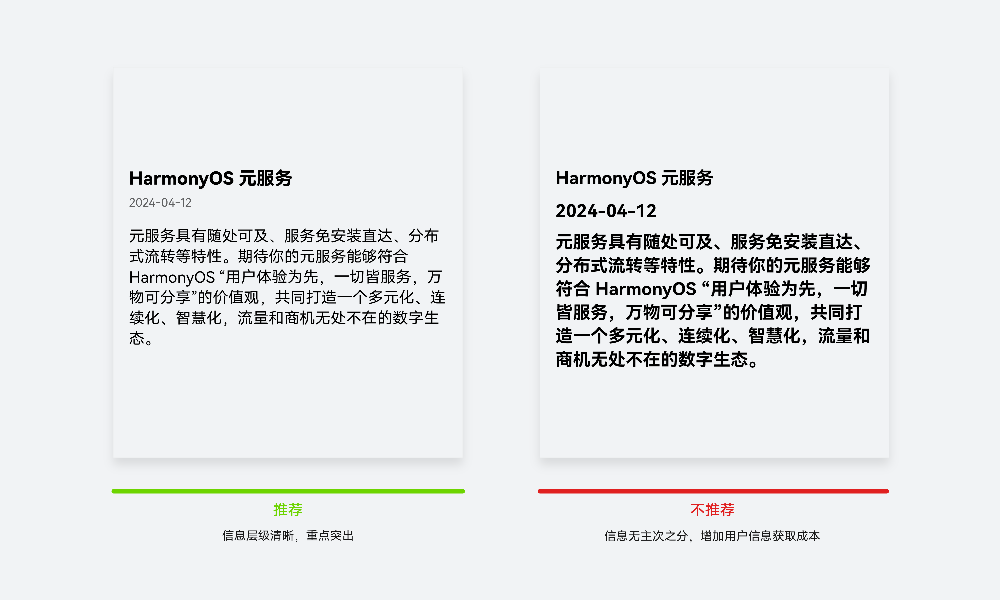

# 通用友好

更新时间：

来源：https://developer.huawei.com/consumer/cn/doc/design-guides/ux-guidelines-overview-0000001900422910

#### 即点即用、秒开清爽

#### 启动无开屏、无广告，无重复加载

① 通过元服务图标、服务卡片、场景调用等方式打开元服务，无开屏界面。非用户主动操作，应尽量避免出现广告弹框干扰用户。若确有运营需要，建议将广告内容内嵌入页面之中，或使用更加轻量的底部非模态浮窗，以减少对用户任务的打断。

② 进入启动界面时只有一个加载，无重复加载。

#### **一键授权、一键登录、一键退出**

① 首次进入元服务，一键完成隐私声明和用户协议的同意与签署。

② 调用华为账号统一的授权能力，一键完成账号个人信息授权。

③ 通过系统返回手势、关闭等方式，一键关闭元服务。不允许二次弹框打断用户行为。

#### 减少界面信息层级，减少层数嵌套和层级跳转

① 减少界面内信息层级，单页面内不超过3个主要的信息层级。人因实验数据表明，大于3级的时候，视觉复杂度会显著的变高。

② 减少界面内层级相互嵌套情况

③ 减少界面层级跳转。

#### 高级简约、自然流畅

#### **界面布局简洁，重点突出**

降低信息复杂性：界面信息简洁，重点信息突出，没有多余或不必要的信息

#### **转场自然流畅，操作响应即时**

自然流畅的动效表达能有效提升用户主观感受：

① 自然合理：界面转场要清晰表达层级关系，通过动效传递不同的交互层级隐喻，界面过渡变化符合心理预期。

② 精致流畅：画面变化连贯丝滑，无抖动、卡顿、闪跳等现象。

③ 及时可控：操作响应无延迟感，操控感舒适高效

详细动效设计指南请参阅：[动效](https://developer.huawei.com/consumer/cn/doc/design-guides/transition-animation-0000001750078488)
