# 便捷生活类

更新时间：

来源：https://developer.huawei.com/consumer/cn/doc/design-guides/convenient-life-0000001957252465

便捷生活类场景主要包括点餐、观影、看攻略等。此类场景在宽屏上可以让用户拥有更高效和流畅的使用体验。

开发指南，请参阅[一多开发实例(便捷生活)](https://developer.huawei.com/consumer/cn/doc/best-practices/multi-convenient-life)。

##### 首页的自适应布局

首页采用自适应布局进行适配，在宽屏上，建议一排显示更多图标数量，但折叠屏不超过一排8个，平板横屏不超过一排12个。折叠屏展开态上3列宫格布局最佳，平板横屏默认5列宫格布局最佳。在更宽的屏幕上也可以通过挪移布局进行更多体验创新。

##### 美食页面

##### 搜索列表

在搜索结果的显示上，建议宽屏设备上通过重复布局展示更多内容。

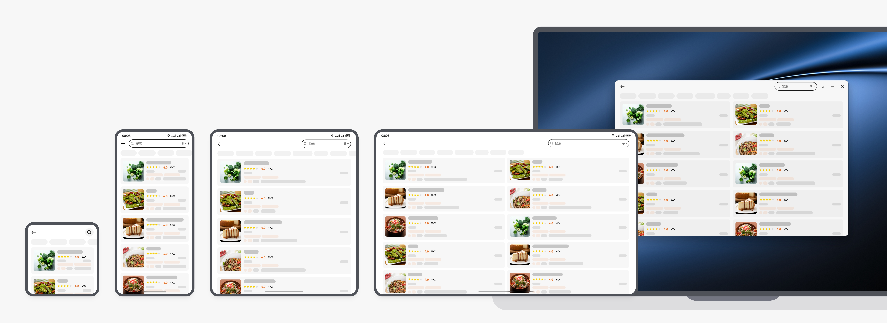

##### 店铺页

在店铺页进行宽屏适配时，建议默认使用分栏布局来提高交互效率。分栏形成后，左侧内容固定不变，新页面始终在右侧区域替换，以实现“列表+详情”快速切换的效果。在折叠屏上通常建议分栏比例为1:1，在平板上为4:6。

支持分栏、全屏切换：在折叠屏/平板上，该场景形成分栏后，支持用户手动切换为全屏，交互更自由。

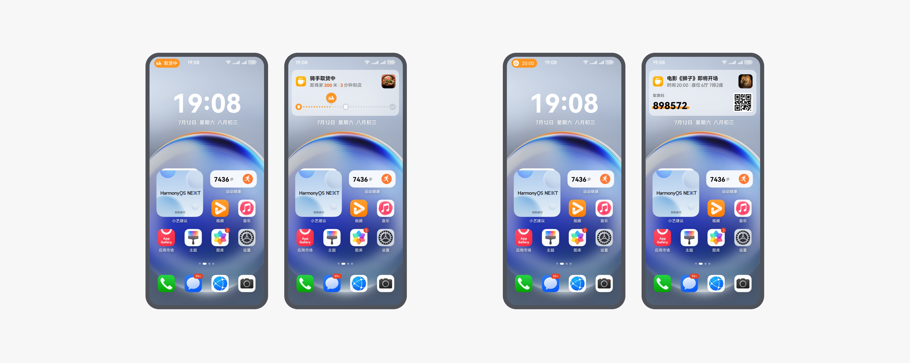

##### 详情页

从店铺页分栏进入美食详情页后，依然保持分栏显示，同时也支持手动切换成全屏。

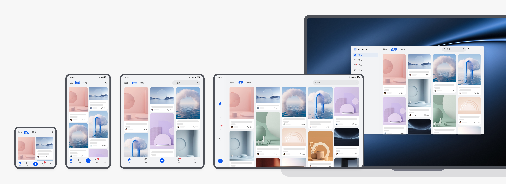

顶部单张大图适配：在8栅格和4栅格的设备上，如果顶部商品图片数量只有1张时，建议保证图片高度不超过0.5倍屏高，若图片超过则上下智能裁剪，同时图片支持向下滑动展开，以查看完整图片内容。

##### 选规格

当用户选择美食的具体规格时，建议调用半模态窗口显示：在手机态为置底的悬浮面板，折叠屏上为窗口居中显示，平板上为窗口跟手显示。

窗口高度动态变化：半模态窗口的高度跟随规格的内容动态变化，最低不低于320vp，最高不超过90%屏幕短边宽度。

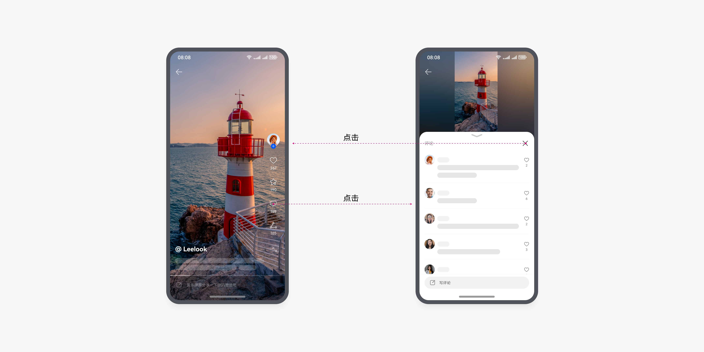

##### 电影

在电影购票流程的页面上，建议在宽屏上进行适当的布局调整，让内容显示更多，同时保证沉浸感。

##### 选电影

随着屏幕的宽度的变化，建议采用挪移布局，上下结构变成左右结构；另外，原本列表显示的内容，也可以考虑变成宫格/瀑布流显示，以获得更佳的使用体验。

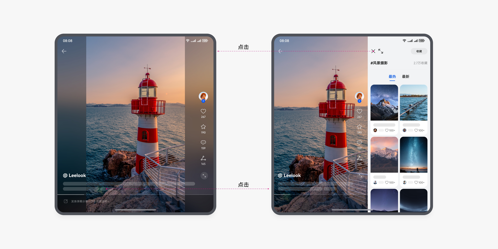

##### 电影简介

在手机和折叠屏上，建议使用自适应布局。在平板等更大屏幕设备上，建议采用挪移布局，上下结构变成左右结构，左侧固定显示电影的基本信息。

##### 选影院

在折叠屏上，可以考虑挪移布局，上下变左右结构，横滑变竖滑。在平板上，建议在左右布局的基础上，可以考虑展示当前选中影片的预告片等。

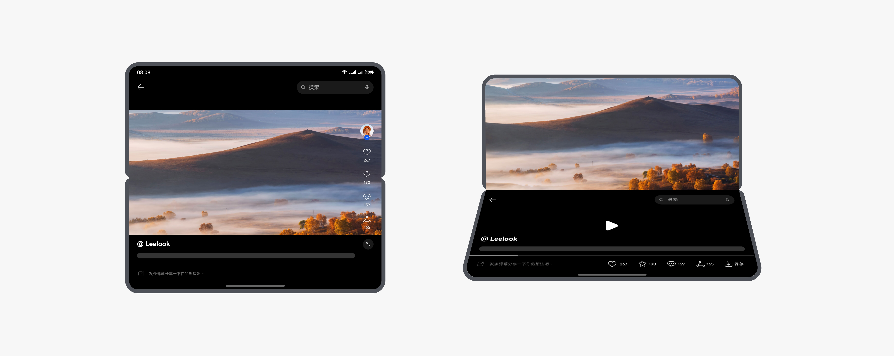

##### 实况窗

实况窗是一种帮助用户聚焦进行中任务、方便快速查看和即时处理的消息提醒，包含胶囊态、卡片态。在点外卖和电影开场提醒等场景中十分实用：

点击卡片空白处，进入对应详情页。其他实况通知详细内容，请查看实况通知章节。

##### 推荐

推荐页经常使用宫格或瀑布流布局。在宽屏设备上，通常显示更多列数，且宫格和瀑布流布局支持双指缩放。

##### 短视频

##### 视频详情看评论

短视频详情页宽屏适配时，折叠屏上点击评论按钮后显示评论列表，平板默认展开评论列表。宽屏背景使用毛玻璃效果可提升页面沉浸感。

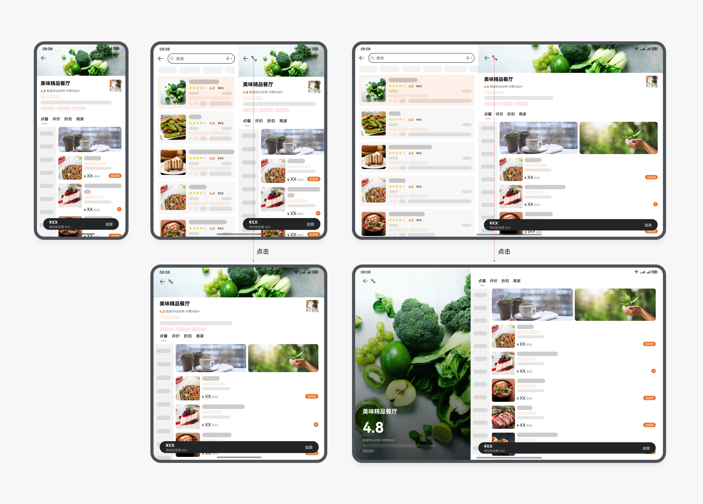

点击评论按钮后，手机端底部向上展开评论面板的示例：

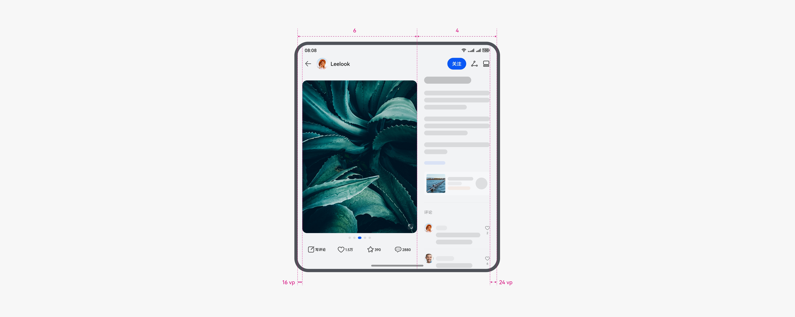

##### 查看更多辅助信息

点击视频下方的标签文字按钮或卡片、链接等，可通过右侧的面板呈现打开的内容。

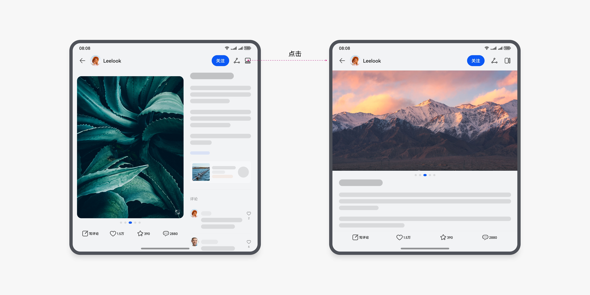

多端查看辅助信息的示例：

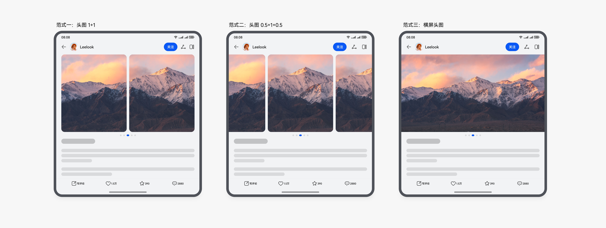

返回或关闭右侧辅助面板时，恢复全屏浏览视频。

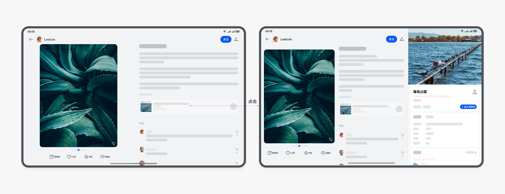

##### 视频悬停

短视频场景需要适配悬停体验，在上半屏显示短视频内容和相关的文本信息，下半屏显示操作类功能；视频播完后自动播放下一个视频，智能优先筛选横向视频。

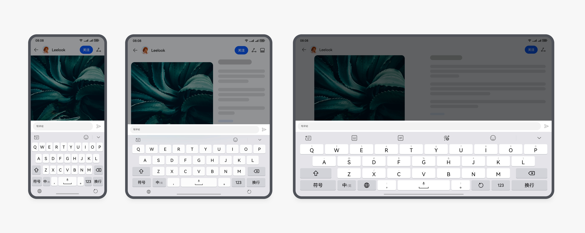

##### 直播间

在直播时，经常会有聊天互动的诉求，手机上默认全屏显示直播内容，在折叠屏、平板、电脑上将聊天面板在侧边展开，在看直播的同时也能享受聊天的乐趣，增加互动性。

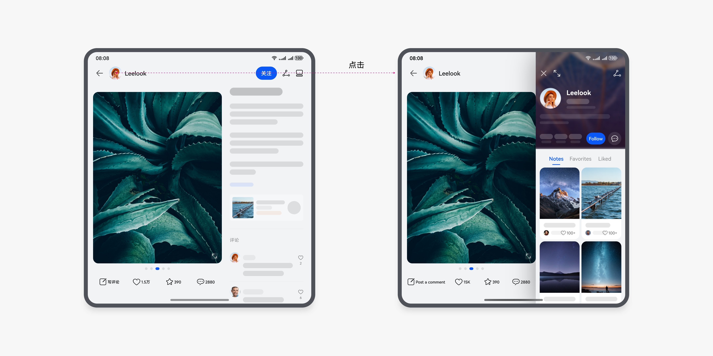

##### 笔记详情

##### 图文笔记

在阅读笔记详情时，为确保更好的阅读体验，折叠屏、平板以及电脑 建议采用挪移布局：将文字挪移到图片右侧，实现图文对照阅读效果。折叠屏尺寸接近方形，建议允许用户手动切换布局，提供更自由的阅读体验。

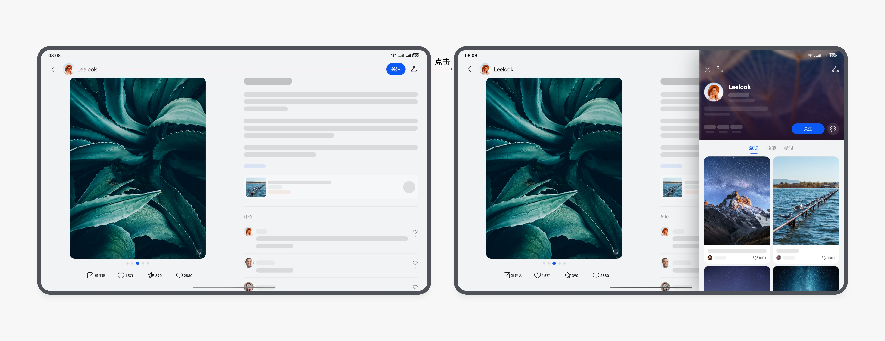

折叠屏上建议按照约3:2的图文区域宽度比例，平板和电脑上建议按照1:1的图文区域宽度比例。

折叠屏图文详情：

在折叠屏上的图文占比为 6:4,图片右侧贴合文字区域，且与左侧页边距应尽量缩小，保证图片最大化显示。

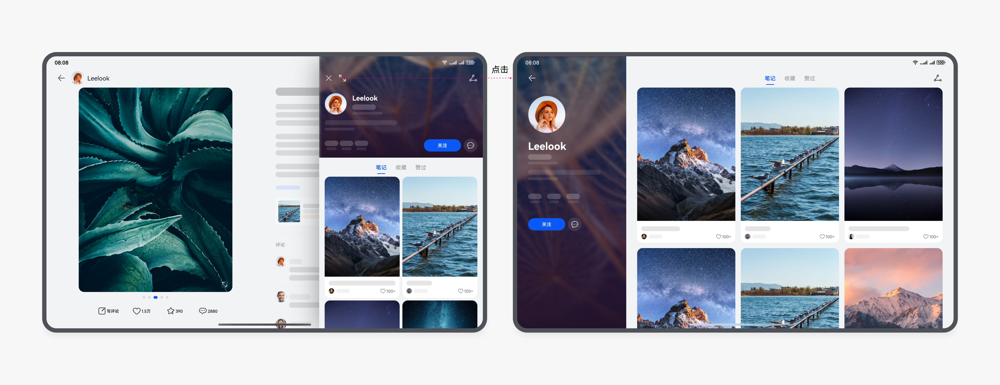

通过按钮切换布局的示例：

折叠屏的图文详情页，上下布局的三种范式：

在平板上，点商品链接进入下一层级页面时，商品详情面板右侧推挤显示：

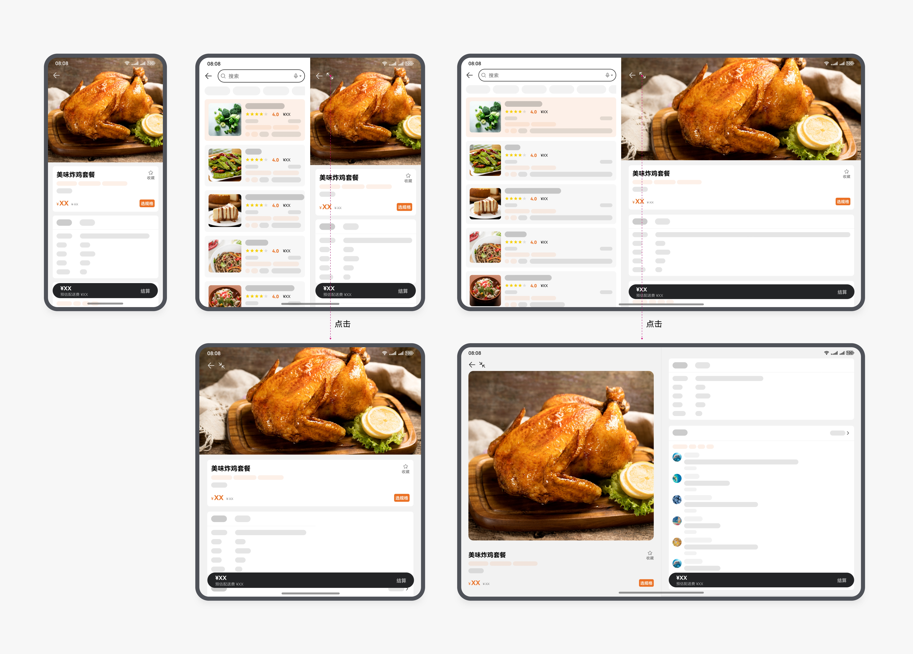

多端键盘输入：

##### 图文浏览效果

图片点击放大：

双指滑动放大：

沉浸式图文同看：

横图缩小浏览：

##### 个人主页

在笔记详情里面，点击用户头像，折叠屏、平板侧边面板覆盖在原界面中显示该用户的个人主页。

折叠屏：

平板：

个人主页侧边面板支持手动切换成全屏显示：

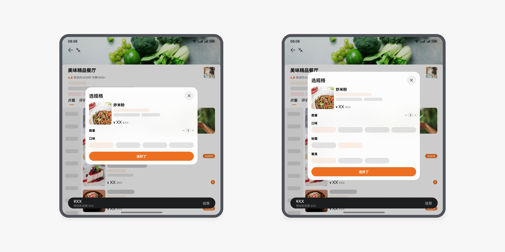

不同设备的屏幕宽度不同，建议在宽屏设备上采用挪移布局，上下结构变成左右结构；列表内容显示可以考虑宫格/瀑布流形式。

##### 关注动态

##### 范式一：单列卡片变分栏+宫格/瀑布流布局

手机上的顶部关注列表和动态卡片，在宽屏设备上挪移布局并形成分栏，在更宽的平板和电脑上可露出更多列的动态卡片，成为分栏加宫格/瀑布流布局。

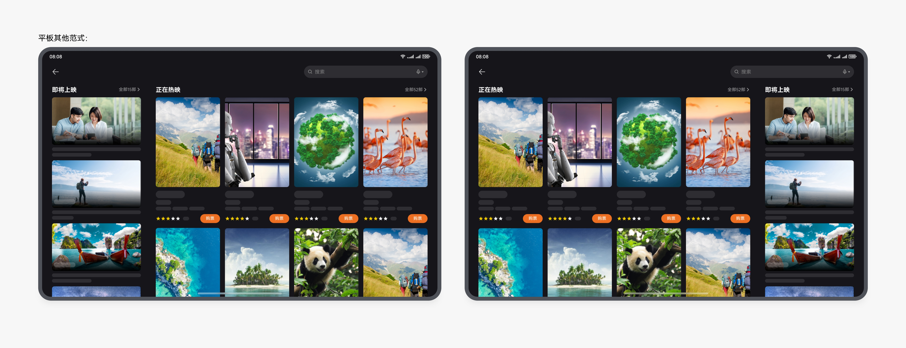

##### 范式二：单列卡片变宫格/瀑布流布局

也可以直接从手机的单列卡片到宽屏设备的宫格/瀑布流结构，随着屏幕宽度的增加显示更多列数内容。

##### 范式三：单列卡片变宽

手机上的单列动态卡片，在宽屏设备上可露出更多辅助信息变成更宽的动态卡片。

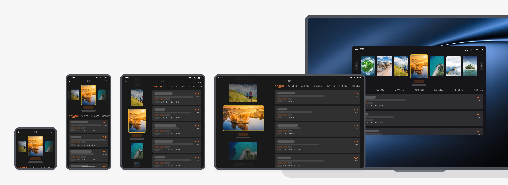
