# 出行导航类

更新时间：2025-08-19 02:56:06

来源：https://developer.huawei.com/consumer/cn/doc/design-guides/travel-and-navigation-0000001957391017

| 出行导航类场景通常包含查询地点信息，路线建议，导航，打车等核心功能，用户可以通过悬浮面板体验到面板与底层地图间的交互，围绕此核心场景，此类应用有如下特点： 手机使用底部半模态面板，其他设备上使用侧边半模态面板面板支持多档位高度滑动调节面板默认高度，需要依据屏幕尺寸的不同而有所区分，充分发挥屏幕尺寸优势折叠屏&平板上侧边的半模态面板支持用户自行拖拽至左侧或右侧位置建议折叠屏和平板等宽屏设备上，Tab 放置在半模态面板内 |
| --- |
|    |

## 首页

1. 直板机上使用底板的半模态面板。在折叠屏、平板等宽屏设备上，使用侧边的半模态面板而非全屏拉伸的底板面板，减少面板对地图的遮挡。
2. 面板默认高度，依据屏幕尺寸的不同而有所区分：手机和折叠屏设备使用「中」高度的面板高度，减少对地图的遮挡。宽屏端设备因为屏幕空间足够，面板默认以最高高度展示。
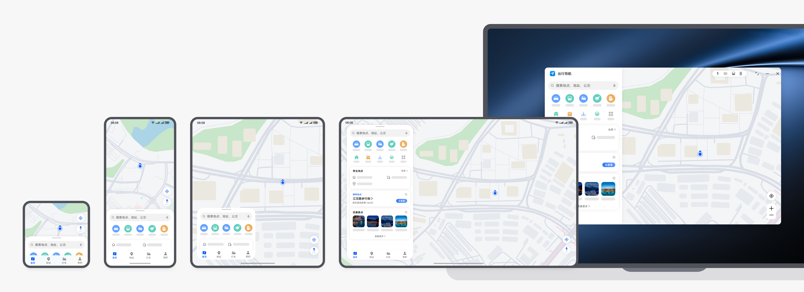

半模态面板的开发指南，请参阅 API 参考 (bindsheet)。

### 面板支持多档位高度滑动调节

面板默认以「中」高度展示，露出快捷功能和常用地点，方便用户快捷操作；面板下拉可收起，仅保留露出搜索，释放更多的屏幕空间给地图；面板上滑可以进入最大高度档位，可为展示更多内容信息；点击地图可以完全隐藏/显示面板。

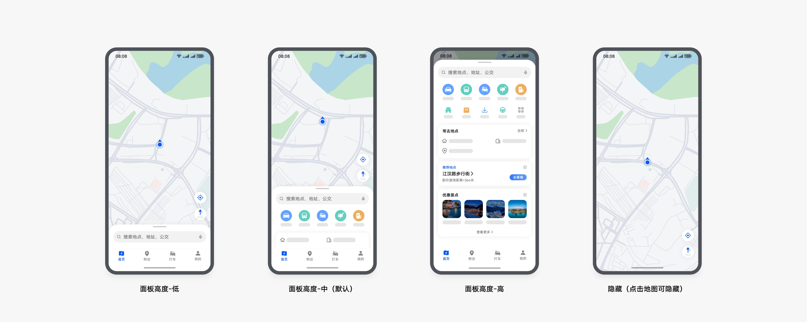

面板高度：低

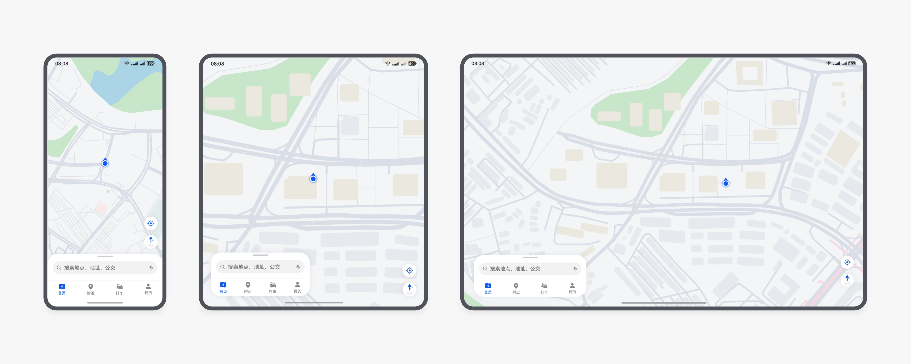

面板高度：中

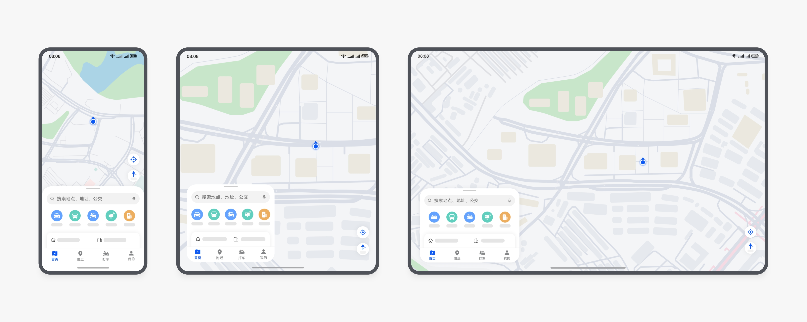

面板高度：高

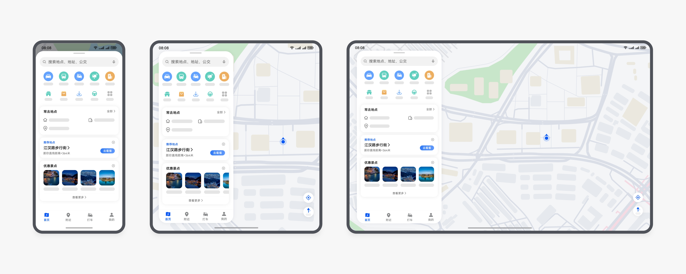

面板隐藏

面板隐藏时，可以达到沉浸式浏览地图的体验。

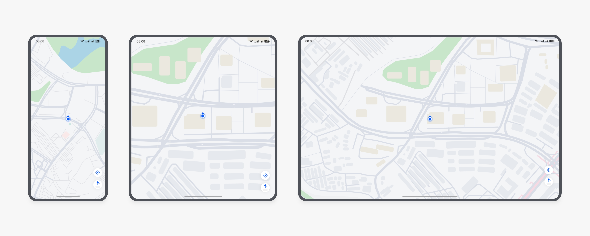

多档位高度滑动调节面板高度

点击地图空白处可以隐藏面板，再次点击可以显示面板。

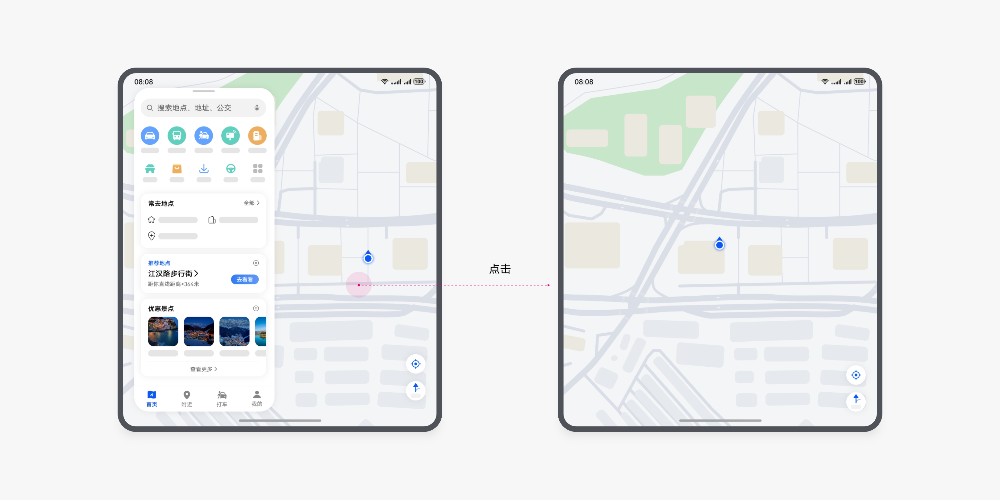

### 创新布局

考虑到用户体验，以及左利手/右利手不同的操作习惯，面板在折叠屏和平板设备上可以拖动至屏幕右侧。

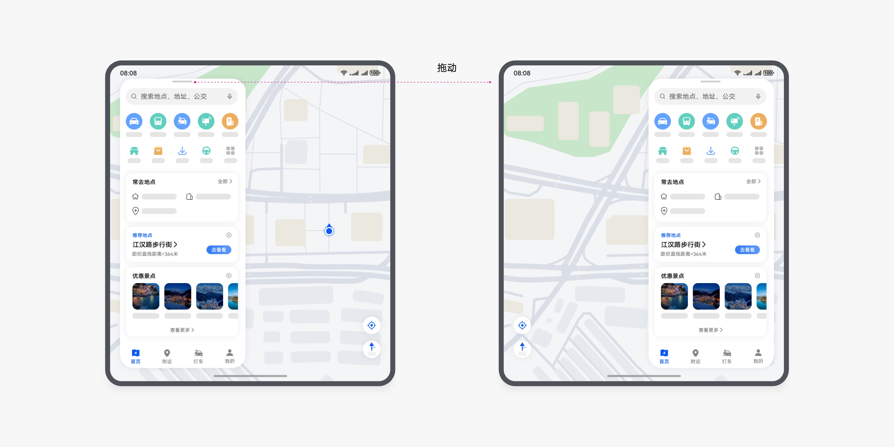

侧边面板可拖动

在折叠屏和平板设备上，半模态面板默认固定在屏幕左侧，可通过面板上方 bar 来拖动至屏幕右侧。

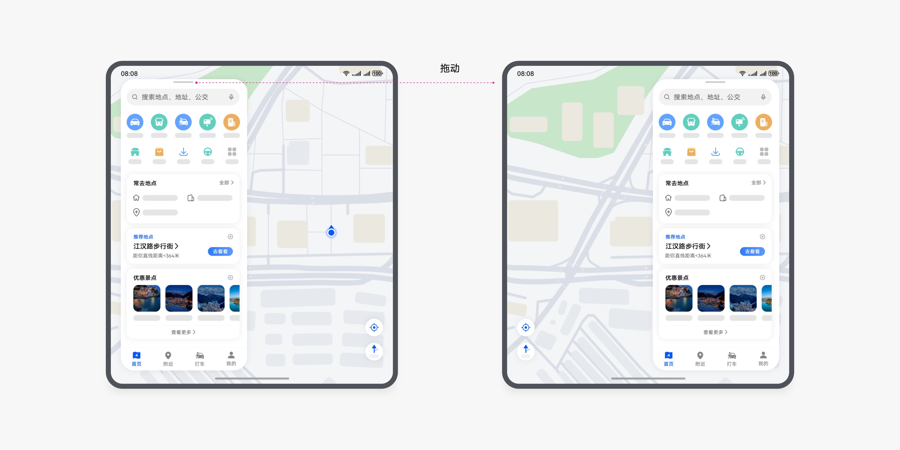

### 地点详情信息

范式一

地图选点后，多端设备地点详情在原有面板上覆盖展示 (以确保足够的运营类商业露出)。

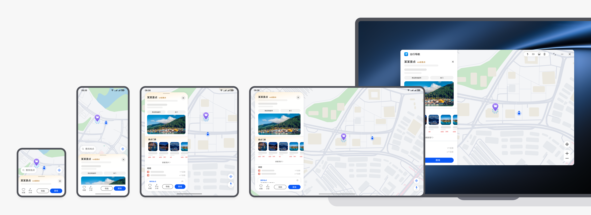

范式二

地图选点后，手机和折叠屏设备上无变化，平板和电脑设备上地点详情在位置点附近以 Popover 形式展示。

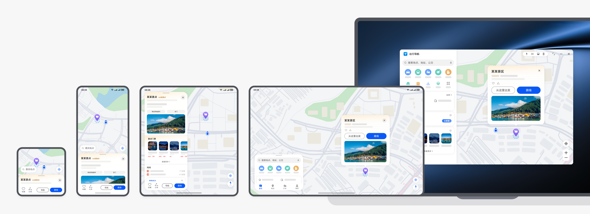

上滑查看更多地点信息

在手机和折叠屏上滑面板可查看更多地点详情信息。

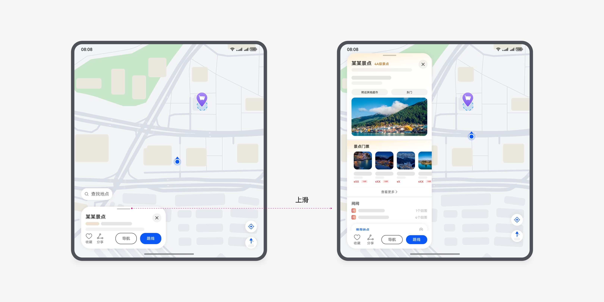

在平板上 Popover 区域内上滑查看更多内容，在电脑上 Popover 区域内使用鼠标滚轮滑动查看更多内容。

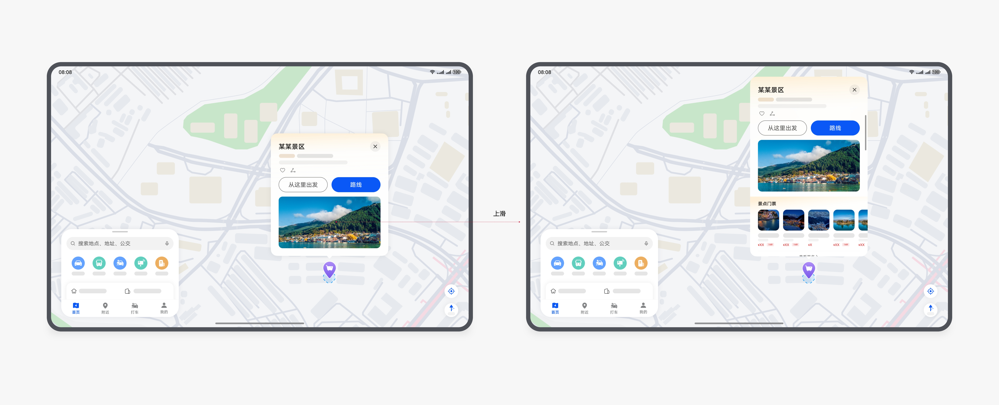

## 搜索

搜索场景是地图类应用核心功能之一，点击搜索可以拉起面板，以面板最大高度显示，搜索结果以列表结构显示。建议在手机和折叠屏上，搜索框限制在面板内。

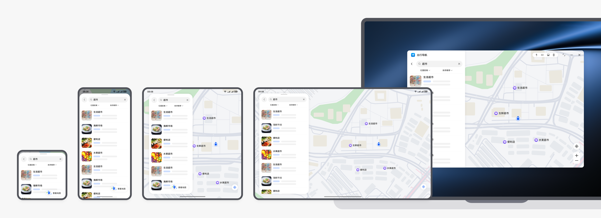

### 下滑面板地图与面板范式一

在手机和折叠屏设备上，下滑面板可以直接以卡片形式展示结果选点详情；在平板和电脑设备上，搜索列表和 Popover 同时展示，充分利用屏幕尺寸优势，方便查看地点信息。

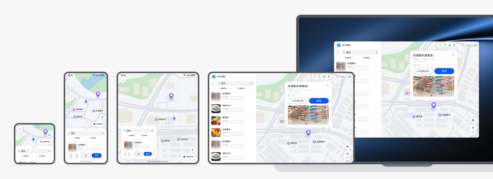

### 范式二

在手机和折叠屏设备上，搜索结果面板下滑，仍显示结果列表与地图多点定位；在平板和电脑设备上，搜索列表和 Popover 同时展示。

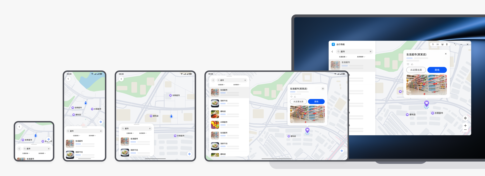

## 路线

在多设备上，点击面板内的起点/终点输入框可以拉起面板，以面板最大高度显示，搜索结果以列表结构显示。建议在手机和折叠屏上，输入框限制在面板内。

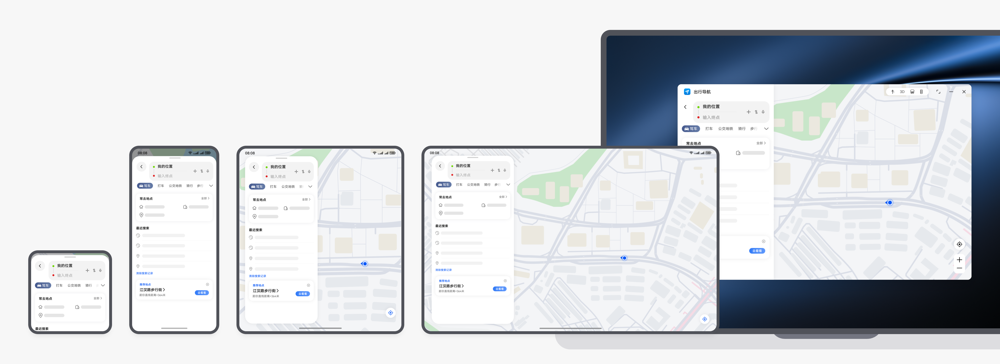

### 路线建议

在手机、折叠屏和平板设备上，路线搜索结果默认以面板中高度显示，同时展示面板内的路线建议和地图中的路线展示，可以达到更好的使用体验；在电脑设备上，路线结果使用列表结构。

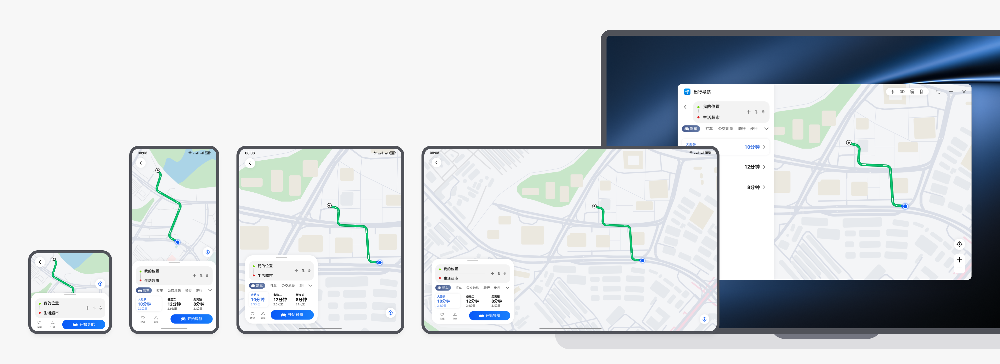

自适应布局

在折叠屏和平板设备上，面板内的路线结果使用小卡片样式显示，在上滑至最大高度后，路线推荐方案布局自适应变化，可以提升在大屏设备上的使用体验。

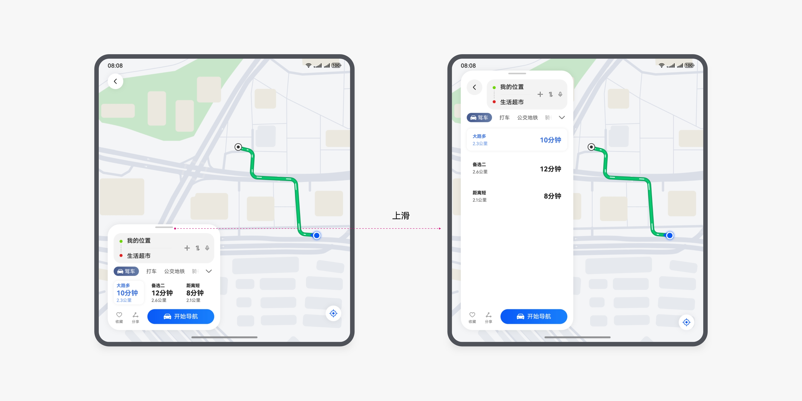

### 导航

导航功能作为出行导航的核心场景之一，建议多端设备上统一设计方案。在手机设备上，顶部背景面板与底部半模态面板使用沉浸式的设计，与设备边框不留间距；在折叠屏和平板设备上，沿用悬浮面板的设计，部分内容在大屏上通过自适应布局带来更好使用体验；在电脑设备上，无导航功能，可以通过点击路线结果，展示具体的出行方案。

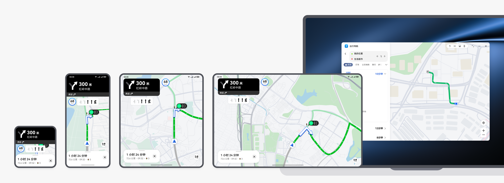

### 打车

打车功能在出行导航场景中经常用到，因此在面板首页有固定的打车入口。进入打车页面时，多端设备上面板高度默认中档位高度显示，展示打车目的地搜索框和常用功能区域，地图上显示打车起点定位。在手机上，同时展示半模态面板和地图选点；在大屏设备上，露出更多地图，提升使用体验。

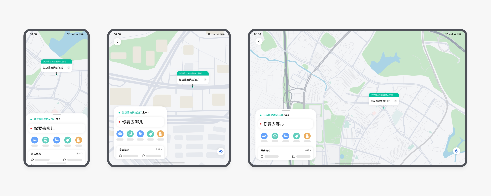

选择车型

选择起点和终点后，进入车型选择列表，在多端设备上，车型列表在半模态面板上展示，打车路线在地图上展示。

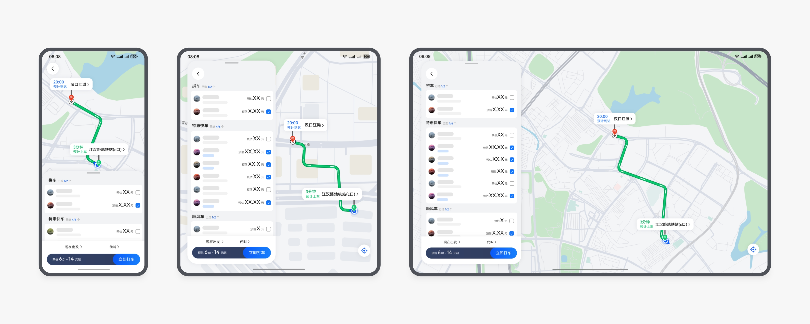

便捷打车

另一种打车方式通常是在搜索地点结果后，在推荐路线页面，侧边面板上横向选择出行方式为打车，可直接打车。在多设备上，侧边面板的内容一致，在大屏设备上有更大的地图体验效果更好。

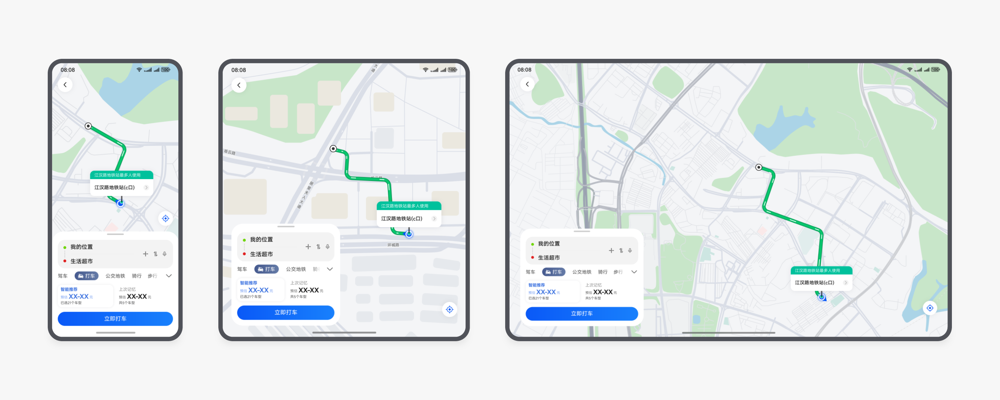

## 实况窗

实况通知是一种帮助用户聚焦进行中任务、方便快速查看和即时处理的消息提醒，包含胶囊态、卡片态。在地图导航场景中，导航和打车时都可在实况通知中展示重要信息。

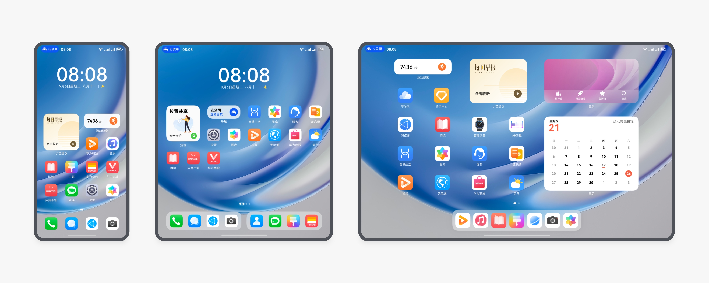

### 多种状态

1. 同一个事件活动在不同场景下仅出现一个形态，如当前事件所承载的落地页在前台，则当前无胶囊；如当前为通知中心/锁屏，则不显示胶囊。
2. 通知中心的实况通知卡片会默认显示在顶部，避免滥用对用户造成打扰。

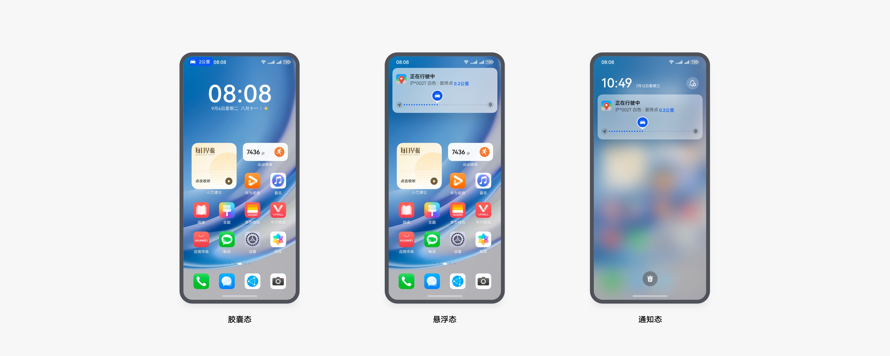

实况窗的开发指南，请参阅 Live View Kit。

## 服务卡片

1. 在地图导航场景中，将此类应用的重要信息或操作指令以卡片的形式展示在桌面，通过点击可以直达对应的功能界面，从而直达服务，减少体验层级。
2. 用户在桌面服务长按卡片即可发现编辑选项，点击后进入编辑界面。

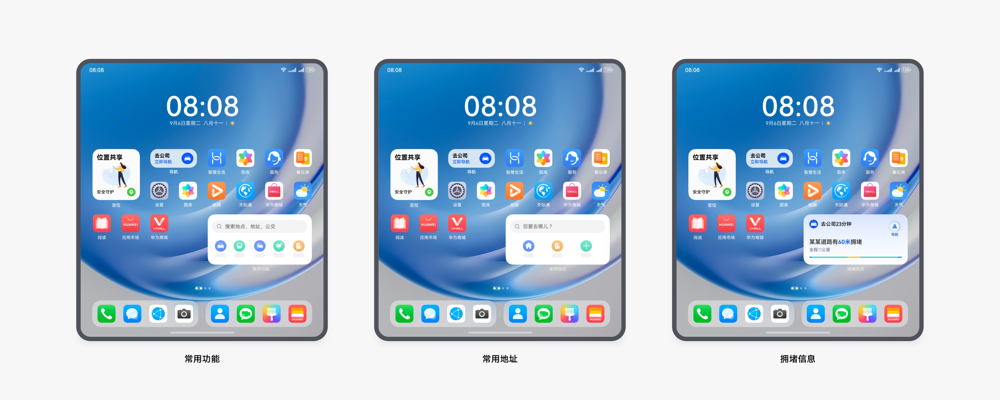
