# 办公类

更新时间：

来源：https://developer.huawei.com/consumer/cn/doc/design-guides/office-0000002315825496

商务办公类应用一般效率优先，用于日常文档处理、日程会议管理等场景，满足撰写文档、团队协作、日常管理等需求。此类应用有以下特征：
 
- 内容信息偏多，较多事项、条目和文件
- 沉浸式编辑和查看体验
- 同时打开多个文档

 

##### 高效应用布局

 
在办公应用的设计中，分栏布局能够显著提升用户操作效率和信息获取的便捷性。常见的组合包括“二分栏”和“三分栏”。分栏设计可以让多个信息呈现更加清晰，以三分栏为例，A 栏帮助用户快速选择和切换：B 栏则用于多条内容的提炼呈现，可以是列表或宫格形式；C 栏则显示详细信息。
 

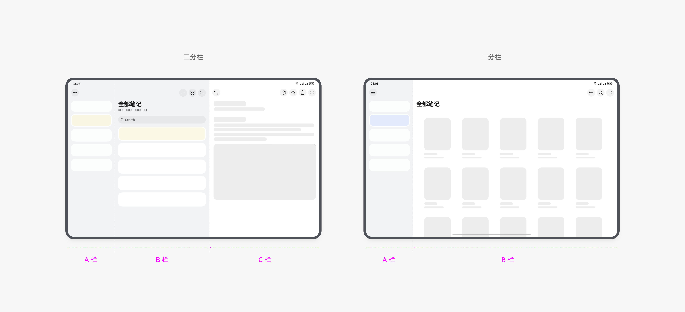

 

 
三分栏切换示意：A 栏选择分类，B 栏列表切换，C 栏查看对应下一级详细内容
 

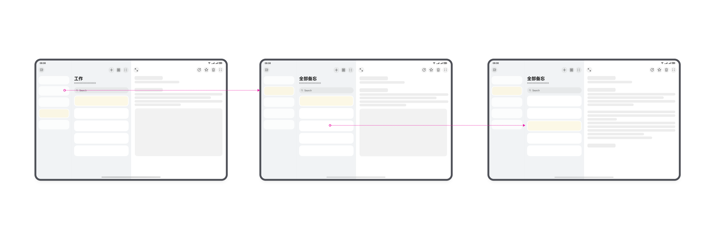

 
三分栏多端示意
 

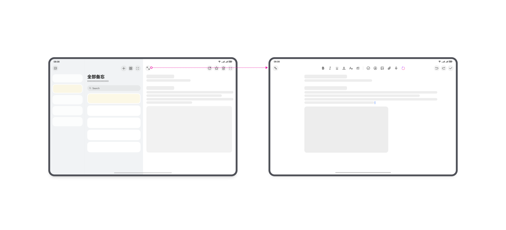

 
二分栏切换示意：A 栏选择分类，C 栏查看分类下的内容
 

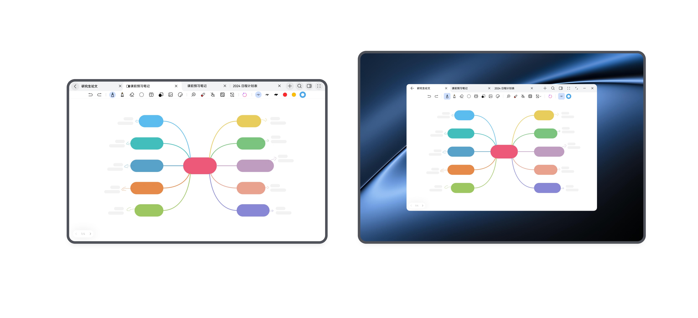

 
二分栏多端示意
 

 

##### 布局灵活切换

 
灵活布局即兼顾三分栏高效选择和沉浸式编辑查看场景，ABC 三栏可以灵活的显示和隐藏。
 
在大屏设备，A 栏悬浮收起展开。
 

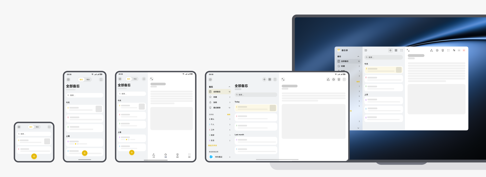

 

 

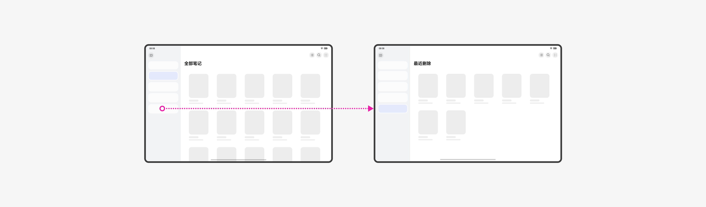

 
通过按钮右侧也可以支持收起和展开。
 

 
应用示例：
 

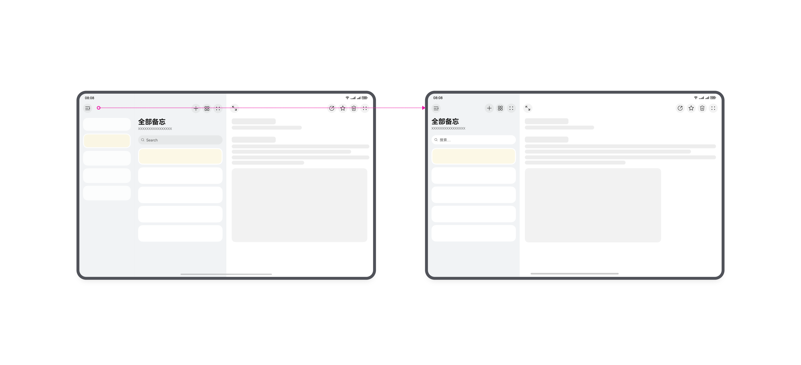

 
栏和栏之间也支持比例拖动
 

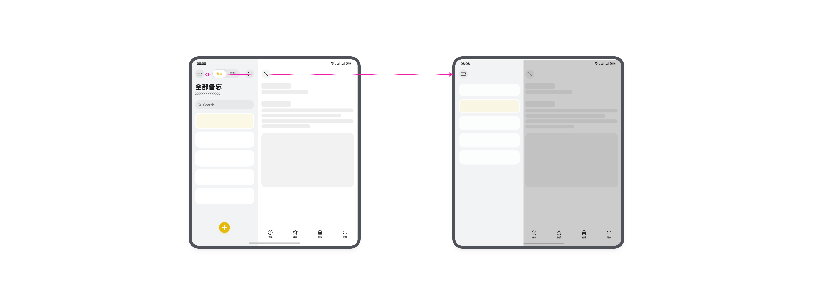

 
“全屏”按钮，点击可进入全屏模式，适合复杂内容的详细编辑。
 

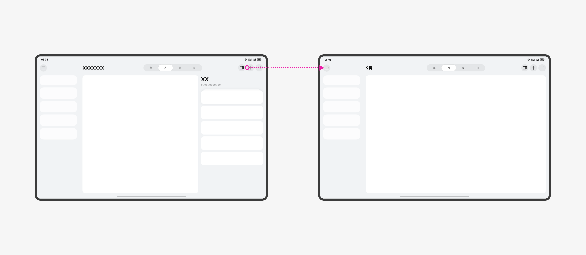

 

##### 文档多开

 
文档多开适用于同时编辑或查看多个文件，如多文档编辑、多图像处理等场景。应用可以通过页签或子窗的形式来呈现。
 

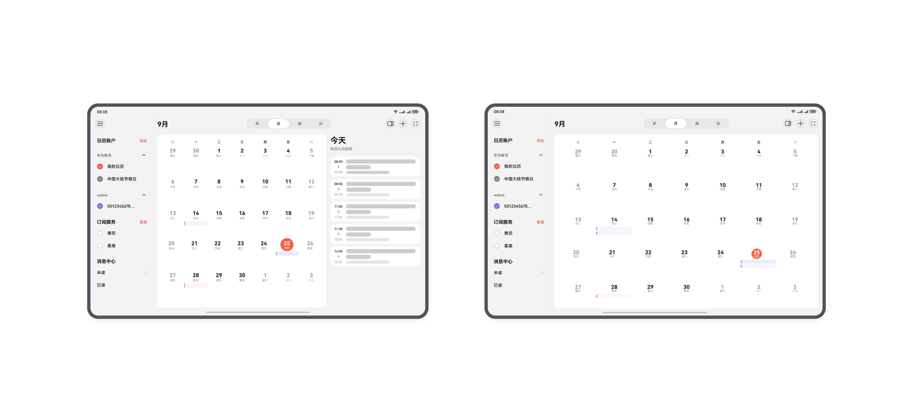

 

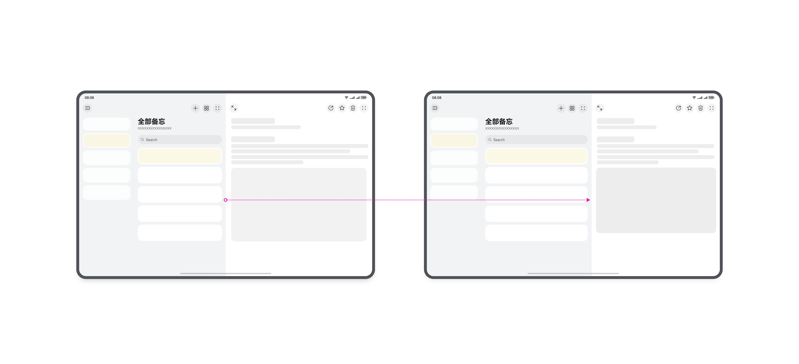
