# 影音娱乐类

更新时间：2026-01-07 02:22:08

来源：https://developer.huawei.com/consumer/cn/doc/design-guides/responsive-design-examples1-0000001957369849

长视频、短视频、直播、音乐等类型的应用或业务场景很常见。这类场景的核心都是沉浸式的视频播放和互动，围绕此核心场景，此类应用有如下特点：

- 海量视频内容资源 (一应俱全)
- 沉浸式视频播放状态 (持续粘性)
- 简单的信息架构，层级扁平 (适合做特殊设计优化)
- 快捷的手势交互，易学，沉浸感强 (操作流)
- 注重作者与观赏者的互动 (社交因素)
- 探索延展相关业务：多方同台直播、视频内商品推广 (商业机会)

## 长视频

### 沉浸式广告

在视频应用中，首页顶部往往会有广告内容。针对影音场景，使用沉浸式广告图可以达到更好的沉浸式体验效果。

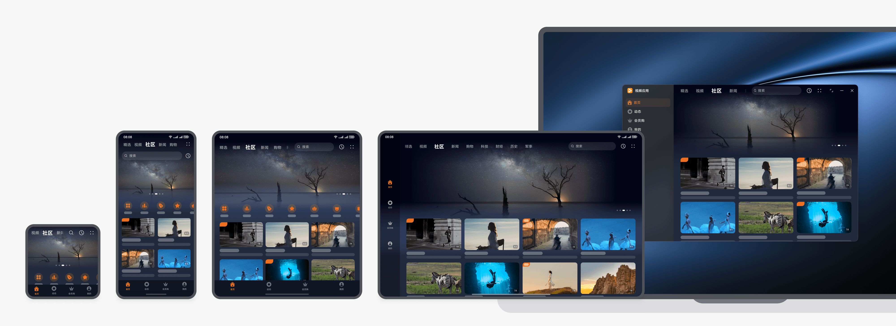

### 自适应广告卡片

也可以使用卡片样式的广告图，在宽屏设备上广告卡片延伸布局，同时结合设备的物理尺寸适当进行广告卡片的形变，广告图内容自适应裁剪。需要确保卡片样式的广告图在多端都有较好的显示效果。

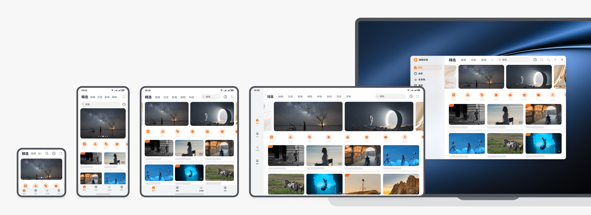

除了广告卡片的自适应形变外，还可以基于设备物理尺寸进行广告卡片的布局创新。

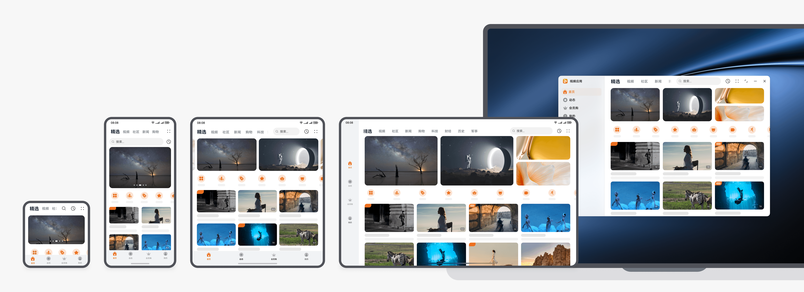

本场景的开发指南，请参阅一多开发实例(长视频)-首页。

### 可缩放宫格卡片

视频应用首页通常会有宫格卡片，通常折叠屏和平板竖屏最佳 3 列卡片，平板横屏最佳 5 列卡片。为满足不同用户群体对于卡片大小和浏览效率的诉求，宫格或瀑布流的布局建议支持通过双指缩放进行卡片列数的调整。

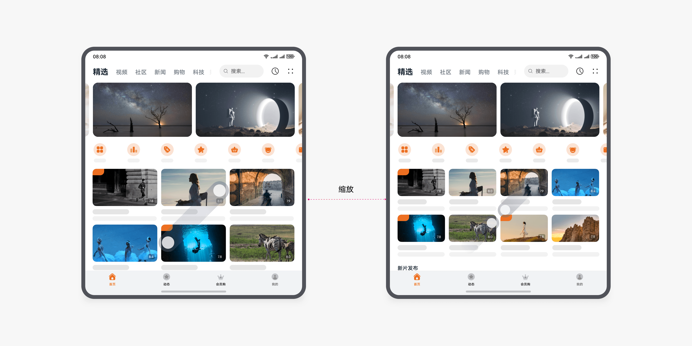

本场景的开发指南，请参阅一多开发实例(长视频)-首页。

### 长按播放预览

长按视频卡片后，可进行视频内容的播放预览，并针对该视频内容提供一些快捷操作菜单。应用根据业务诉求自定义长按后的菜单项内容。

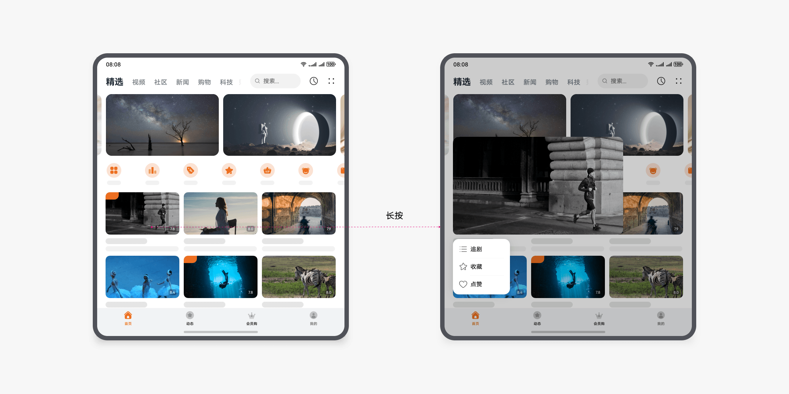

本场景的开发指南，请参阅一多开发实例(长视频)-首页。

### 浅层级搜索

在应用内进行搜索时，建议原页面内容和搜索页面的层级不切换，搜索框一镜到底的变化，提供更轻的搜索体验。同时充分利用搜索推荐页、搜索结果页在宽屏设备上显示面积大的优势，提升搜索效率。

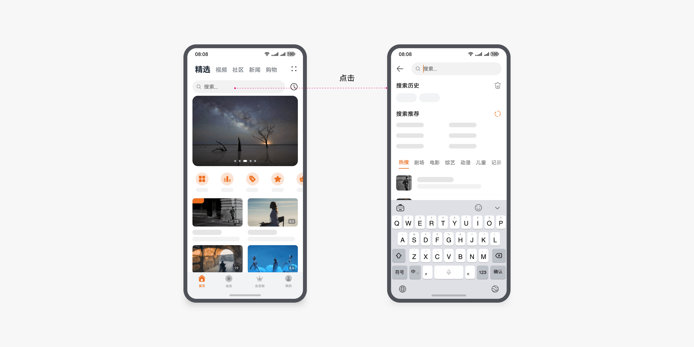

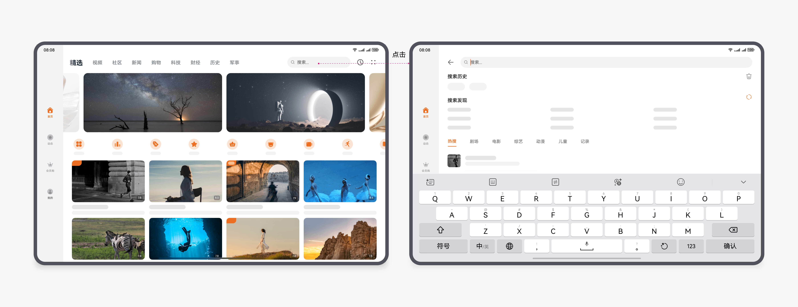

本场景的开发指南，请参阅一多开发实例(长视频)-搜索页。

### 边看边评

看视频时，经常会有同时看评论的诉求。在折叠屏上，可向上拖动调整评论区高度，提供更大的评论区域；在平板横屏时默认右侧显示评论区域，可向左拖动调整评论区宽度，提供更大的评论区域；在电脑设备上可自由调节视频应用窗口尺寸，视频和评论区域的布局跟随窗口尺寸自适应调整。

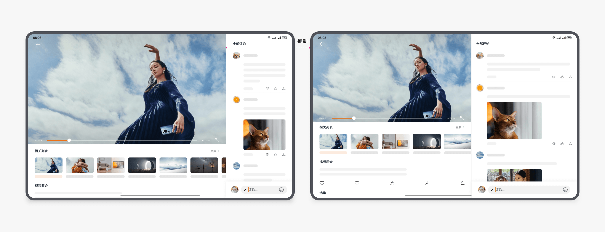

本场景的开发指南，请参阅一多开发实例(长视频)-视频详情页。

### 沉浸全屏播放

全屏播放视频，上下有黑边时，弹幕仅在上方黑边区域内显示；上下没有黑边时，建议在视频画面内显示的弹幕不要太多。电脑设备上播放视频时，建议支持沉浸式窗口样式。

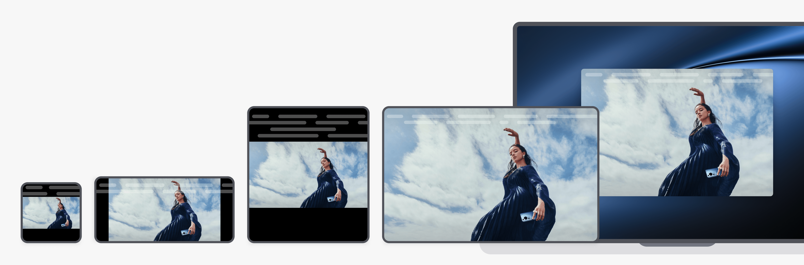

全屏播放视频时，点击选集、倍数等操作，通过侧边或底部面板的方式来呈现临时的操作内容。

在手机横屏、折叠屏折叠态横屏、平板和电脑上，从屏幕右侧触发侧边面板；在折叠屏展开态从屏幕底部触发底部面板，展开态和悬停态的体验一致。

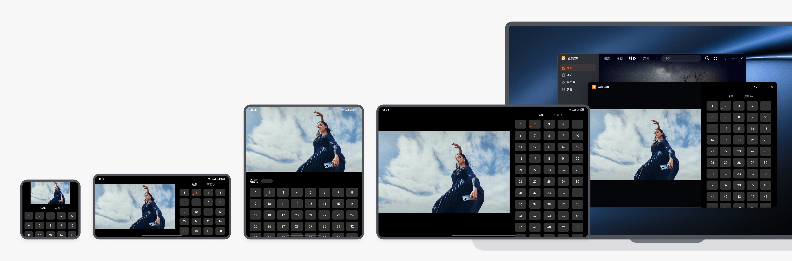

在类似折叠屏展开态这种方形尺寸屏幕的设备上，点击“全屏播放”按钮，视频画面不旋转。

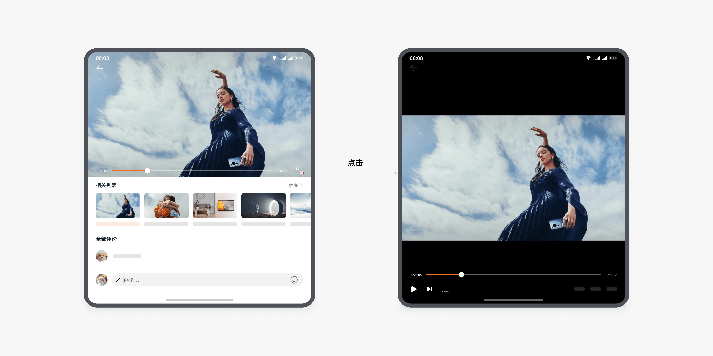

### 视频悬停播放

在折叠屏展开态，全屏播放视频或在视频详情页播放视频时，将设备折叠，以上两种情况均自动切换至悬停态的沉浸播放视频体验。

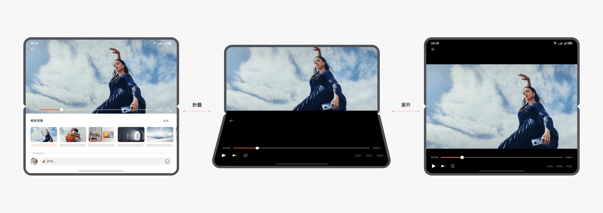

本场景的开发指南，请参阅一多开发实例(长视频)-全屏播放页。

## 短视频

### 侧边面板边看边评

浏览短视频同时看评论是常见的操作，在宽屏设备上可以通过侧边面板为用户提供更好的边看边评体验。

在手机和折叠屏上，默认全屏显示短视频内容，点击评论按钮后分别在底部或侧边展开评论面板。在平板和电脑上由于屏幕足够宽，可直接显示短视频的评论内容。

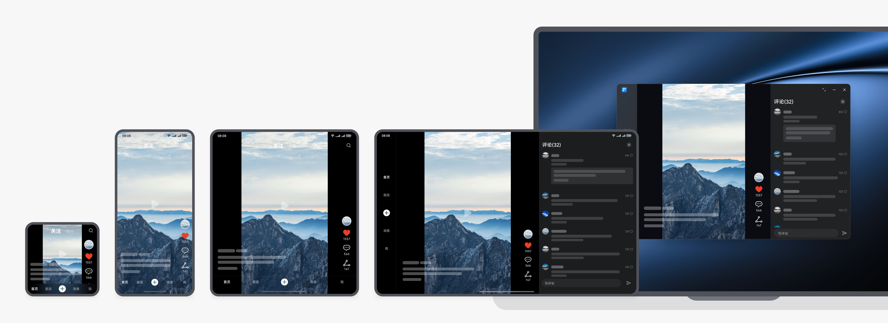

在手机或折叠屏上，点击评论按钮展开评论面板：

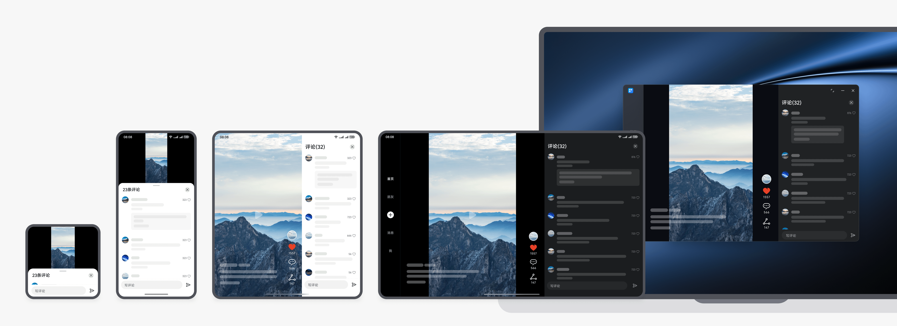

查看横向短视频时，点击展开评论：

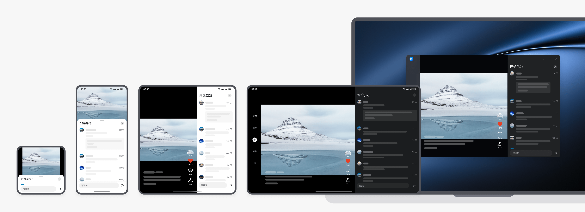

同时显示短视频和评论时，建议支持继续上滑切换短视频内容：

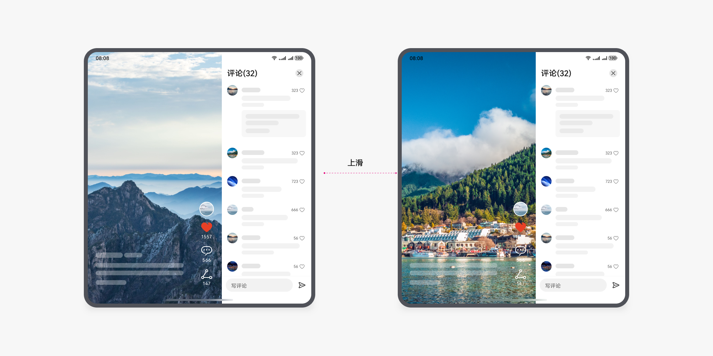

本场景的开发指南，请参阅一多开发实例(短视频)-评论页。

### 侧边面板个人详情

还可以在侧边面板显示个人详情页，提供快速切换视频的体验。

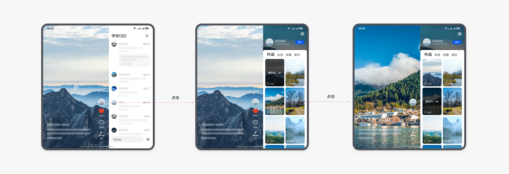

多端的个人详情页面：

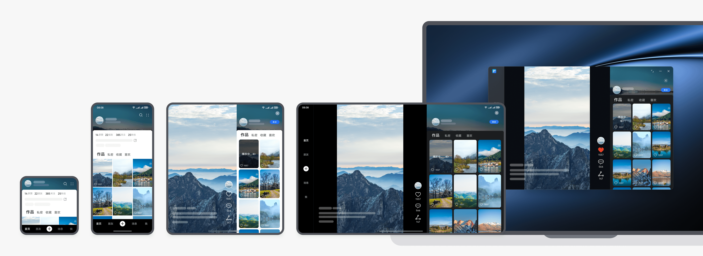

本场景的开发指南，请参阅一多开发实例(短视频)-个人作品页。

### 侧边面板快捷手势

在通过宫格瀑布流界面点击进入的视频播放页中，可以提供全局滑动手势，帮助用户实现更浅层的浏览、筛选体验。

- 在屏内右滑，调出左侧侧边面板，呈现上一级的宫格瀑布流，切换其他视频播放；
- 在屏内左滑，调出右侧侧边面板，呈现下一级的个人详情页，挑选该博主的其他视频播放。

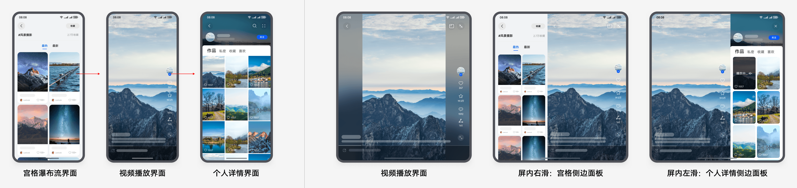

需注意，应用在划分快捷手势热区时，需避开全局系统返回手势热区。

系统返回手势在屏幕两侧的热区宽度均为 16vp，多端保持一致。

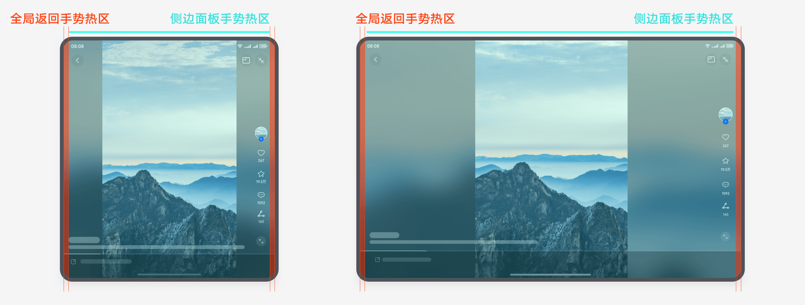

多端的宫格瀑布流页面：

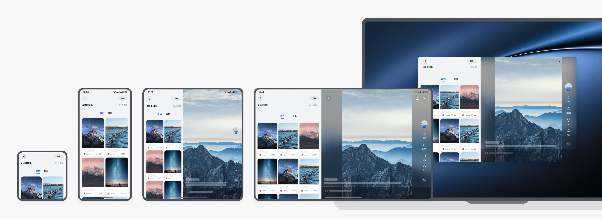

### 画中画体验

建议支持画中画能力，用户可在浏览其他内容的同时通过悬浮小窗继续观看视频。

- 开启方式一：点击视频播放页的画中画按钮，调起悬浮小窗；
- 开启方式二：点击返回键或使用全局返回手势，在返回上一级界面的同时调起悬浮小窗。
- 首次使用时，建议直接调起授权弹窗，引导用户开启画中画权限。

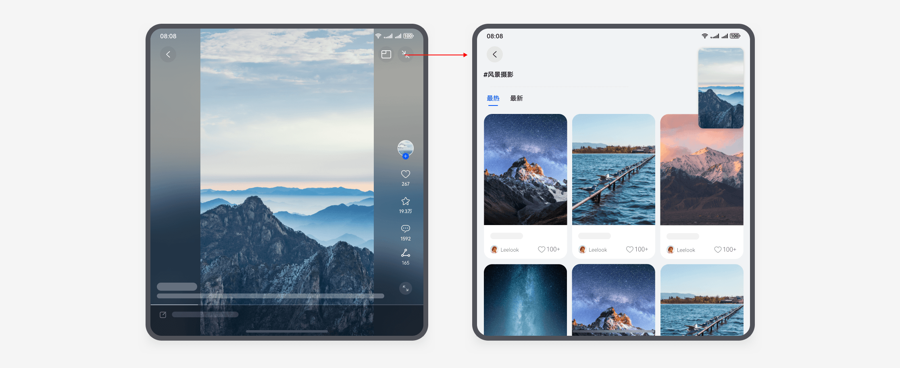

### 半模态窗口分享

在应用内进行分享等快捷操作时，可以通过系统的半模态控件，实现更轻的分享体验，避免大面积的页面跳转，也可以直接调用系统提供的分享能力。

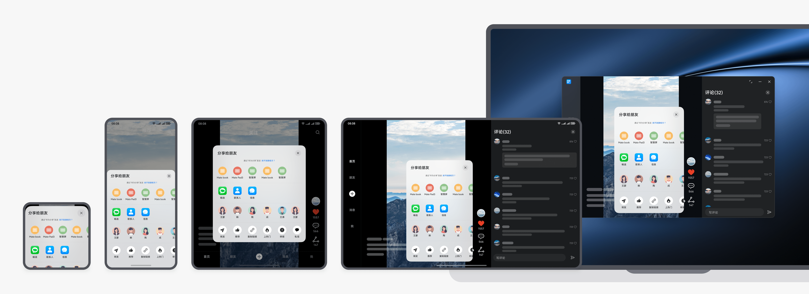

### 短视频悬停

短视频场景需要适配悬停体验，在上半屏显示短视频内容和相关的文本信息，下半屏显示操作类功能。

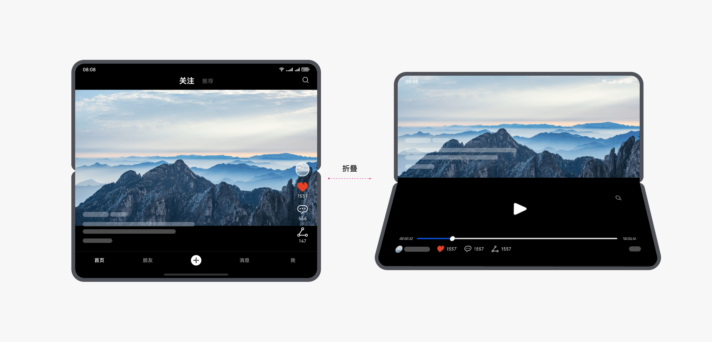

## 音乐听书

### 沉浸广告

音乐听书类应用中，比如音乐厅页面，顶部沉浸式广告，建议在直板机和折叠屏上可保持沉浸体验，在平板和电脑上可变为自适应卡片创新布局。

### 浅层级搜索

搜索页是音乐听书类应用的典型页面，建议在直板机和折叠屏上全屏显示，平板和电脑上可考虑在搜索框下方以浅层窗口的样式出现。

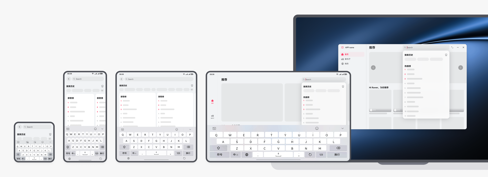

搜索后结果列表，在直板机上单列呈现，在折叠屏、平板和电脑上双列，可呈现更多信息，提升用户获取信息的效率。

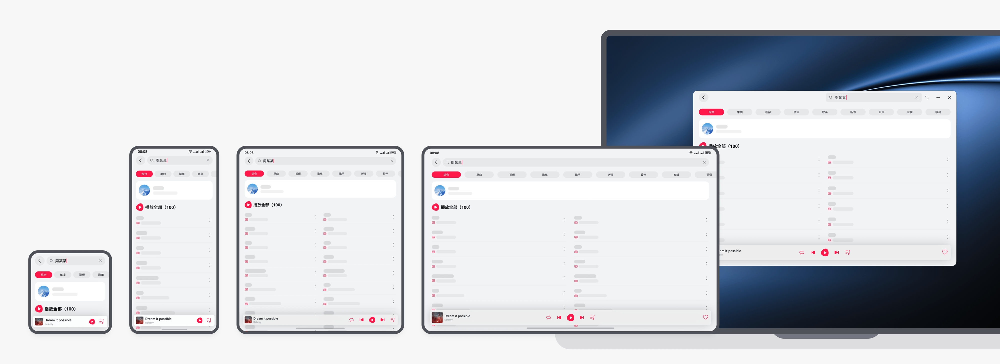

### 左右布局播放

播放页面，在折叠屏、平板和电脑上左右布局，左侧歌曲配图和播放按钮右侧歌词（或音频正文内容），提高屏幕的使用效率，避免图片或留白过大。

### 浅层窗口列表

在播放页切换歌曲的场景直板机上半模态列表，在折叠屏、平板和电脑上可调用半模态窗口，实现更轻的歌曲切换，避免页面大面积跳转。

### 排行榜

排行榜页面，在直板机上一般单列，建议在折叠屏、平板和电脑上重复布局，单列变为双列。宽屏显示更多的内容，提升用户获取信息效率。

