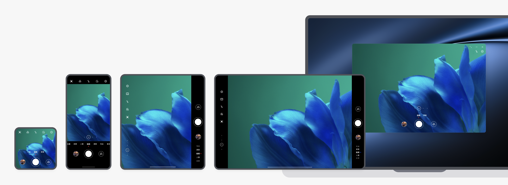
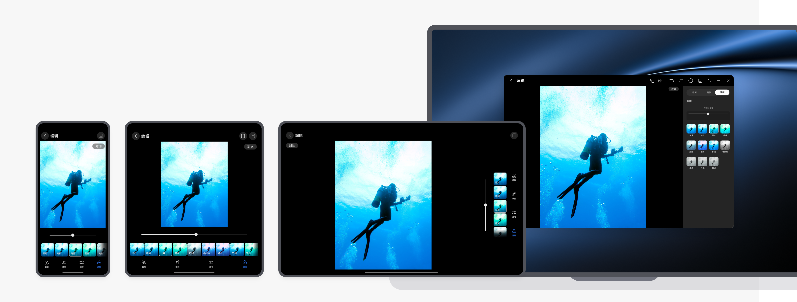

# 拍摄美化类

更新时间：

来源：https://developer.huawei.com/consumer/cn/doc/design-guides/responsive-design-examples3-0000001746498074

拍摄美化场景主要包括拍摄、图片视频浏览以及图片视频的美化编辑等。拍摄美化类的应用通常有修图、加水印、加文本、特效处理等功能。在用户进行图像处理后，可以增强图片的观赏性和分享性。

此类应用有如下特点：

 - 界面简洁
 - 操作方式易于理解
 - 图像处理功能丰富
 - 支持批量处理，高效率和体验优化

#### 沉浸式拍照

#### 自适应布局

拍摄时，基于不同设备的物理尺寸和持握方式自动调整快门键等按钮的位置，以便提供大尺寸屏幕上更易操作的使用体验。

#### 图片浏览

浏览图片时，建议随着屏幕变宽展示更多的图片数量，但要注意信息过密的问题。手机、折叠屏、平板建议每行分别显示4、6、8张图片，平板上默认显示侧边目录栏。

图片浏览界面，建议支持通过双指缩放调整列数。

缩放手势调整宫格列数的开发指南，请参阅 [API 参考 (PinchGesture)。](https://developer.huawei.com/consumer/cn/doc/harmonyos-references/ts-basic-gestures-pinchgesture)

#### 图片选择器

在进行图片选择器的设计时，建议根据不同屏幕尺寸设备，自动调整布局和大小以适应。

#### 查看图片详情

全屏查看图片时，应优先确保图片在不同设备上都能完整显示，不存在截断情况。

#### 图片编辑

图片或视频编辑时，在手机和折叠屏上，建议默认上下布局，在平板和电脑上建议默认左右布局；在折叠屏上，建议提供布局切换按钮，允许手动调整布局样式。

在折叠屏上，通过按钮切换上下布局和左右布局的示例：

自适应布局的开发指南，请参阅[自适应布局场景。](https://developer.huawei.com/consumer/cn/doc/best-practices/bpta-multi-device-adaptive-layout)
