# 新闻阅读类

更新时间：

来源：https://developer.huawei.com/consumer/cn/doc/design-guides/responsive-design-examples4-0000001746657290

新闻阅读类应用，本质是信息的聚合。首页、详情页、阅读小说类页面是此类应用的典型核心场景。在宽屏设备中，首页需要进行延伸布局、重复布局等适配，以确保浏览效率更高；详情页使用左右布局往往能获得更舒适的阅读方式，达到边看边评的效果。阅读小说类页面适配时， 页面布局能够根据屏幕尺寸自动调整，保证用户在不同设备的阅读体验。

##### 新闻类

##### 首页

**首页的响应式布局**

新闻信息流页面，应充分利用宽屏的优势，显示更多内容。可通过延伸布局、重复布局、瀑布插卡流布局等达到更好的宽屏浏览体验。

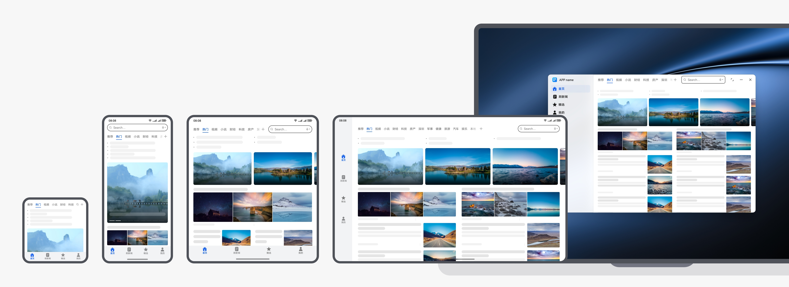

本场景的开发指南，请查阅[一多开发实例（新闻阅读类）- 首页推荐](https://developer.huawei.com/consumer/cn/doc/best-practices/multi-news-read#section14315171817575)。

**顶部文字要闻：**采用挪移布局，将下方的新闻挪到右侧，在折叠屏、平板上依次递增一列 (折叠屏 2 列，平板 3 列)。

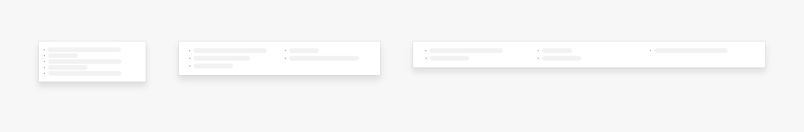

挪移布局的开发指南，请参阅[典型布局场景。](https://developer.huawei.com/consumer/cn/doc/best-practices/bpta-multi-device-page-layout)

**新闻大图卡片：**

范式 1：采用延伸布局，图片比例可跟随屏幕尺寸自适应变化，同时显示更多卡片数量。

范式 2：折叠屏采用杂志化卡片样式，直接露出新闻标题和摘要，平板可显示更多的宽卡片。

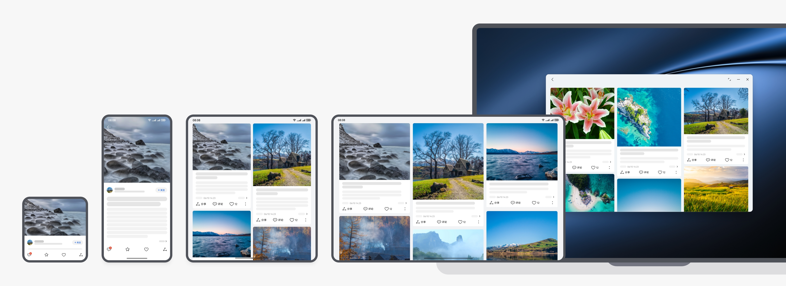

延伸布局的开发指南，请参阅[自适应布局。](https://developer.huawei.com/consumer/cn/doc/best-practices/bpta-multi-device-adaptive-layout)

**上文下图：**在折叠屏上保持原有布局，在平板及更宽的设备上重复布局。

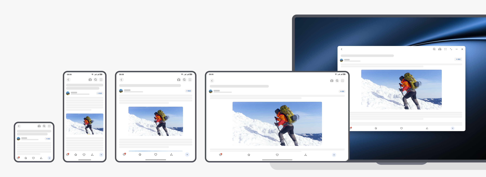

**左文右图：**手机上的单列信息，在折叠屏和平板上重复布局。

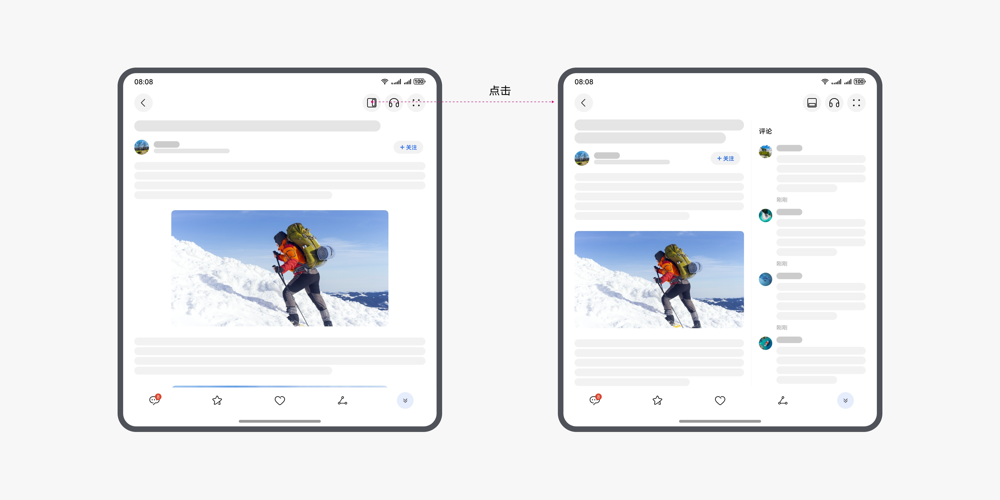

重复布局的开发指南，请参阅[典型布局场景](https://developer.huawei.com/consumer/cn/doc/best-practices/bpta-multi-device-page-layout)。

**竖向视频卡片：**手机上的左图右文卡片，在折叠屏和平板上显示更多列该卡片内容。

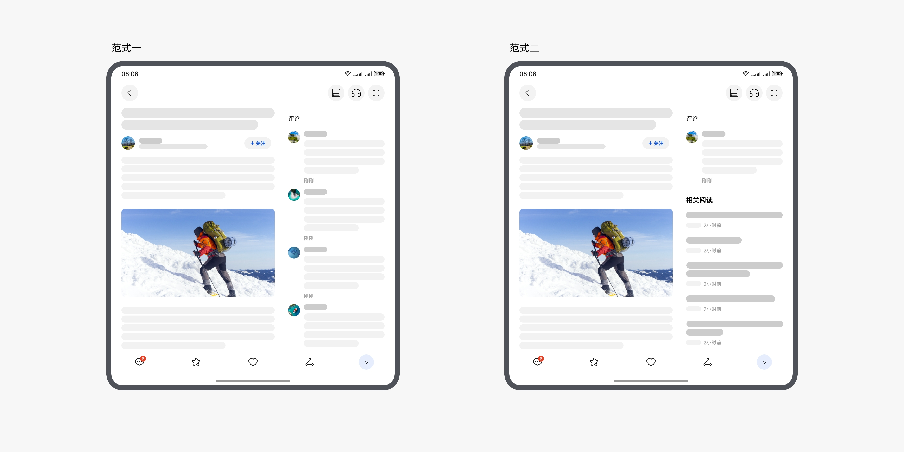

**大视频类新闻：**

范式 1：在折叠屏、平板上依次递增一列 (折叠屏 2 列，平板 3 列)，保证屏幕空间利用率。

范式 2：通过在大屏上通过挪移布局和添加摘要的方式，从上下布局自动切换为左右布局。

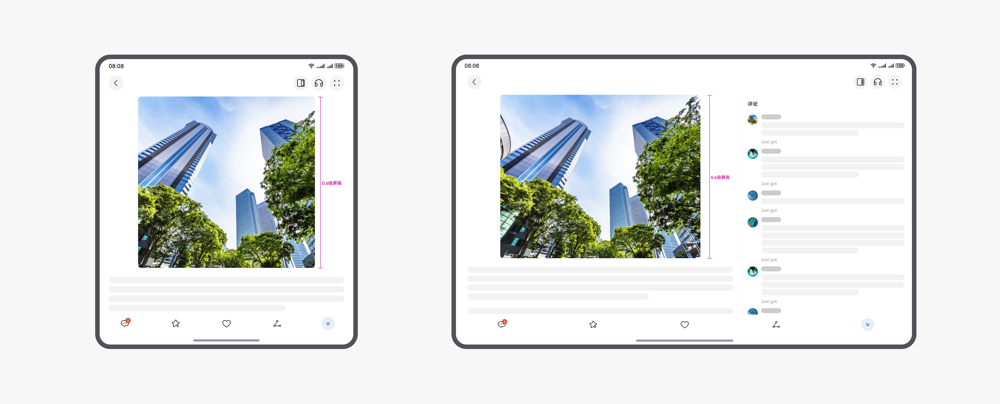

**横向滑动小视频：**该结构支持横向滑动，建议采用延伸布局，随着屏幕面积的增加，一屏显示更多小视频数量。

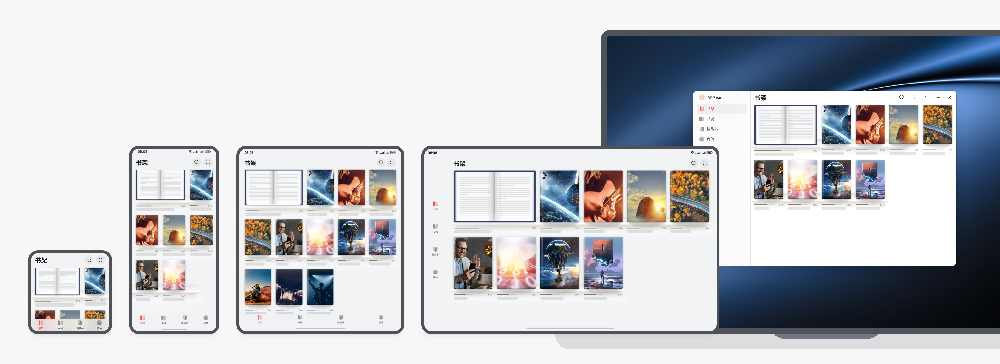

**首页的创新布局**

**列表变瀑布流**

手机上的图文列表布局，无论是上文下图还是左文右图，在折叠屏和平板上切换为瀑布流布局。

本场景的开发指南，请查阅[一多开发实例（新闻阅读类）- 精选发现](https://developer.huawei.com/consumer/cn/doc/best-practices/multi-news-read#section195858247711)。

**列表变宫格**

手机上的列表结构的新闻，在宽屏设备上切换为宫格布局。

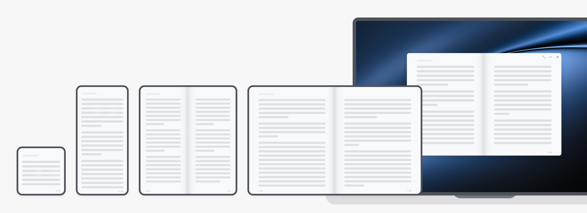

**全屏新闻变瀑布流**

刷新闻是近年来出现一种新型新闻阅读模式，可以让用户沉浸地阅读新闻，但在宽屏设备上图片直接放大会导致图片过高，一屏幕内信息量太少的问题。建议针对本场景，可采用手机上的全屏新闻，在宽屏设备上自动切换为瀑布流布局。

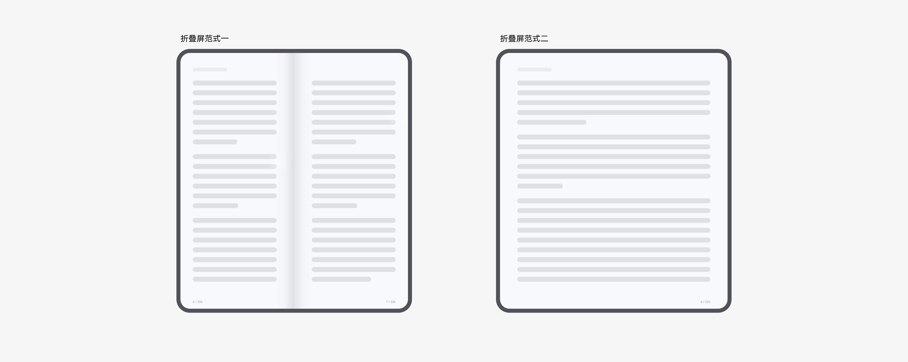

本场景的开发指南，请参阅[一多开发实例 (新闻阅读)-刷新闻](https://developer.huawei.com/consumer/cn/doc/best-practices/multi-news-read#section16811756205811)。

##### 新闻详情页

**边看边评**

当用户阅读新闻详情时，为确保沉浸式阅读体验，默认全屏图文显示，保持两侧边距适中，避免图文内容左右留白。同时，为确保更高的屏幕空间利用率建议采用挪移布局，将评论区挪移到新闻右侧，实现边看边评的效果。建议允许用户手动切换布局，提供更自由的新闻阅读体验。

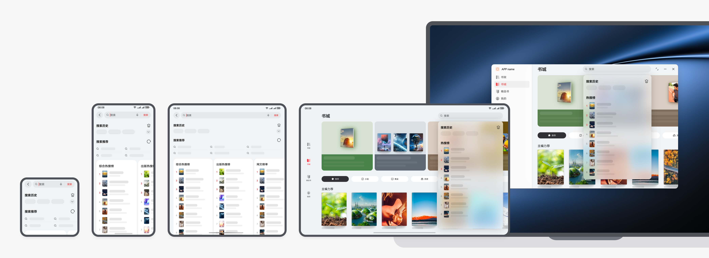

折叠屏上建议按照约 6:4 的正文与评论的宽度比例，平板和更大尺寸的屏幕设备上建议右侧评论区固定 480vp 的宽度。

通过按钮切换布局的示例：

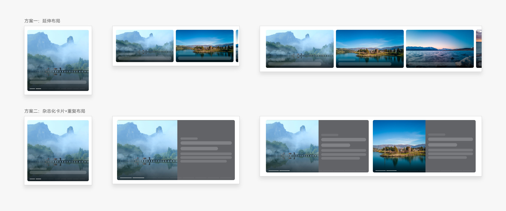

当评论内容少时，评论下方可露出更多相关内容的示例：

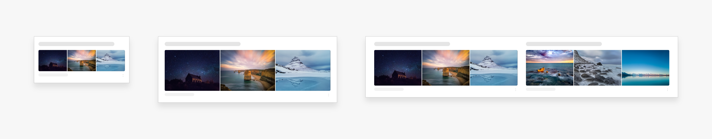

在折叠屏和平板上，竖向或者方形图片经常出现图片过高导致一屏显示不完整的情况，严重影响浏览效率。针对本情况，建议竖向图片高度约 0.6 倍屏幕高 ( 超长图除外) 。

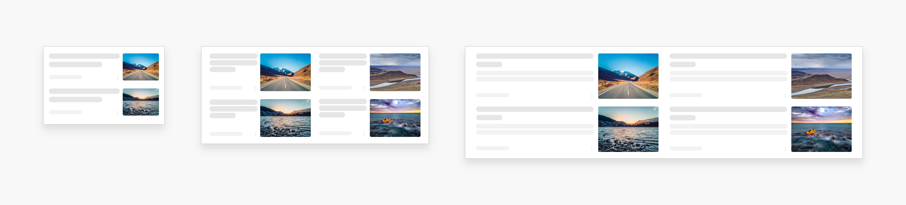

本场景的开发指南，请参阅[一多开发实例（新闻阅读类）- 新闻详情](https://developer.huawei.com/consumer/cn/doc/best-practices/multi-news-read#section14945393581)。

**沉浸浏览**

在新闻详情页，建议通过上滑时隐藏标题栏、工具栏，下滑或停留超过一定时长恢复显示标题栏、工具栏的方式，提供更沉浸的浏览体验。

**文字大小调节**

在阅读新闻时，为满足不同用户群体对于文字大小和浏览效率的诉求，建议支持通过双指缩放调整文字大小。

##### 阅读类

在该场景下，需充分考虑多设备兼容性和舒适便捷的阅读体验。针对不同页面场景，我们要找到合适的页面布局，以提升在不同设备上的用户体验。

##### 书架

**重复布局**

书架是阅读场景的常用页面，根据不同设备的屏幕尺寸，调整书架的布局和元素大小。在折叠屏及平板上，建议采用重复布局，增加一屏书籍显示数量，以容纳更多的书籍信息。

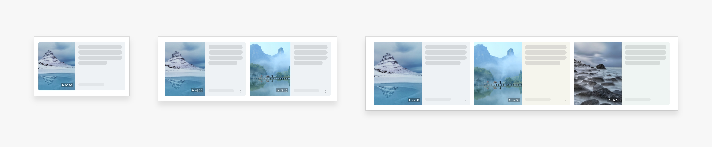

**沉浸浏览**

在浏览书籍列表时，建议采用沉浸浏览的方式：上滑时隐藏标题栏、工具栏，下滑或停留超过一定时长恢复显示标题栏、工具栏的方式，提供更沉浸的浏览体验。

##### 书籍简介

简介提供了书籍的主要内容概述，帮助读者快速了解书籍的主题、风格和故事梗概。在折叠屏和平板上，可以考虑双页显示，即左右两块阅读区域，提高阅读效率。

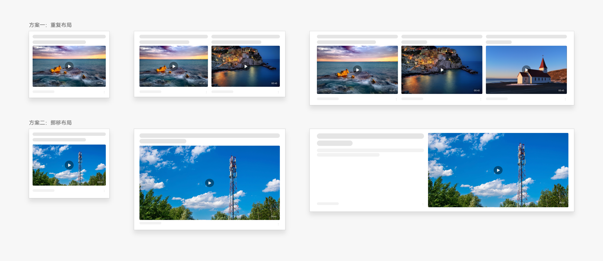

##### 阅读器

**阅读页**

随着屏幕变宽，阅读内容可以考虑采用双页布局的方式，避免1行文本字数过多导致阅读困难。

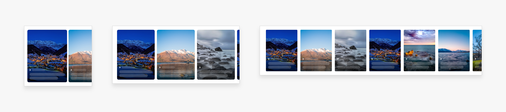

折叠屏可以考虑默认双页布局，支持手动切换为单页；平板则建议始终保持双页显示。

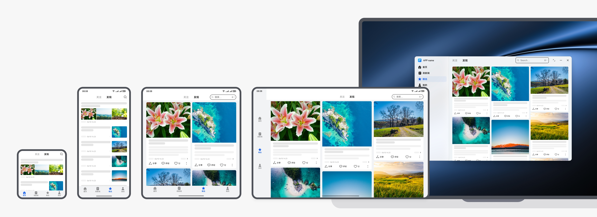

**文字大小调节**

在阅读页中，文字大小舒适度至关重要，建议可以通过双指缩放的交互方式，来达到快速切换文字大小档位的目的，提高操作效率。

##### 搜索

在不同设备上，搜索推荐应能自动调整展示形式。例如，手机和折叠屏上全屏显示推荐内容，平板上则可以考虑窗口化显示，即在搜索框下方以浅层窗口的样式出现。

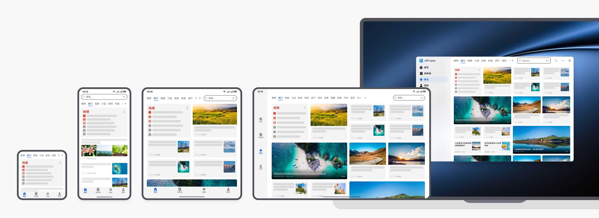
