# 旅游住宿类

更新时间：

来源：https://developer.huawei.com/consumer/cn/doc/design-guides/tourist-accommodation-0000001957241545

旅游住宿、订票类场景通常包含火车/飞机订票，订酒店，查询票务信息等核心功能，围绕此核心功能，此类场景旨在让用户拥有流畅沉浸的用户体验，提供更轻便高效的交互体验。
 

 

#### 购票

 

#### 首页

 
首页通常主要展示查询车票的入口、入口图标区、热门资讯和酒店预订等信息。
 
平板上充分利用宽屏优势，采用挪移布局，左侧查询车票的入口、入口图标区、热门资讯固定，右侧酒店卡片可以纵向滑动。
 

 

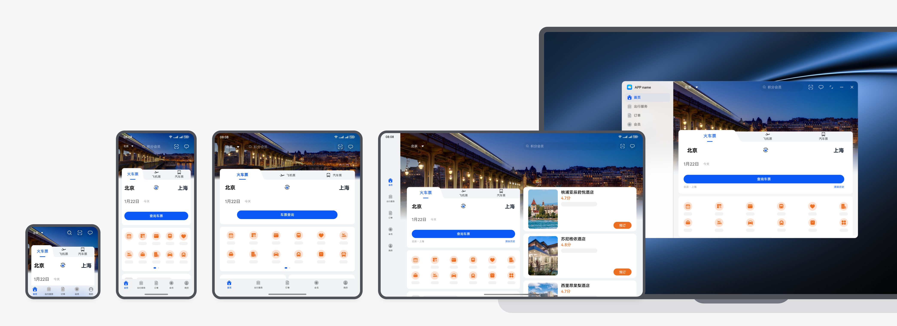

 

#### 时间选择

 
选择查询车票的时间，折叠屏、平板和电脑通过系统的半模态控件，拉起日历控件。
 

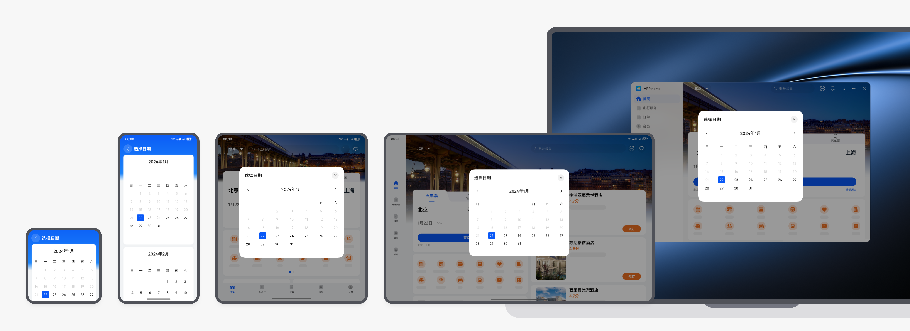

 
本场景的开发指南，请参阅[一多开发实例（旅行订票)-时间选择页。](https://developer.huawei.com/consumer/cn/doc/best-practices/multi-travel-accommodation#section147288193403)
 

#### 车票查询

 
查询车票结果页面展示查询日期当日的车次卡片，在折叠屏上保持原有布局，在平板、电脑上使用分栏布局提高效率。
 

 

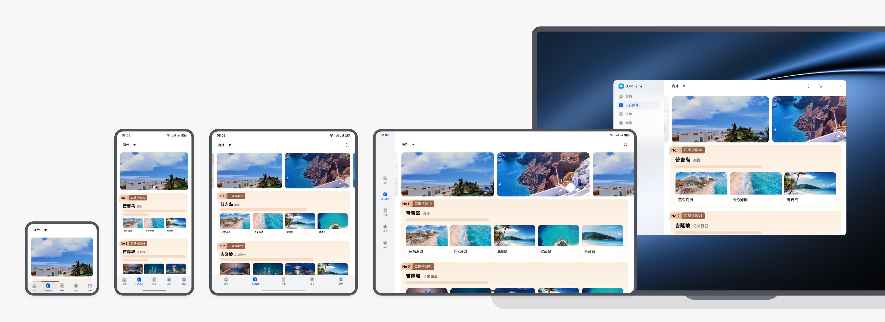

 

 
上滑之后日期上移至标题栏，收起上方子页签、操作块等元素和下方工具栏，以展示更多车次内容。
 

 

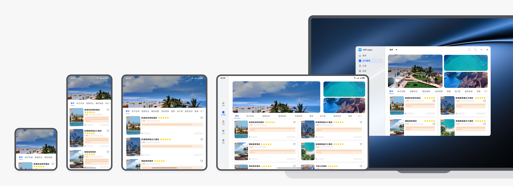

 
本场景的开发指南，请参阅[一多开发实例（旅行订票)-查询车票上滑](https://developer.huawei.com/consumer/cn/doc/best-practices/multi-travel-accommodation#section052546194213)。
 

#### 信息填写

 
在平板、电脑上使用分栏布局提高效率，左边选择车次，右边填写用户信息。
 

 

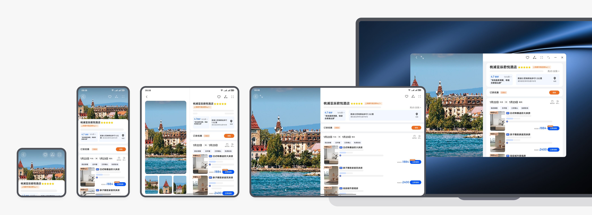

 
本场景的开发指南，请参阅[一多开发实例（旅行订票)-填写购票信息页](https://developer.huawei.com/consumer/cn/doc/best-practices/multi-travel-accommodation#section3911202734415)。
 

#### 提交订单

 

 

 

#### 订单

 

#### 查看订单

 
手机上使用列表布局，折叠屏、平板和电脑使用宫格布局。手机和折叠屏订单页直接露出待支付或已经预定的车票信息。
 

 

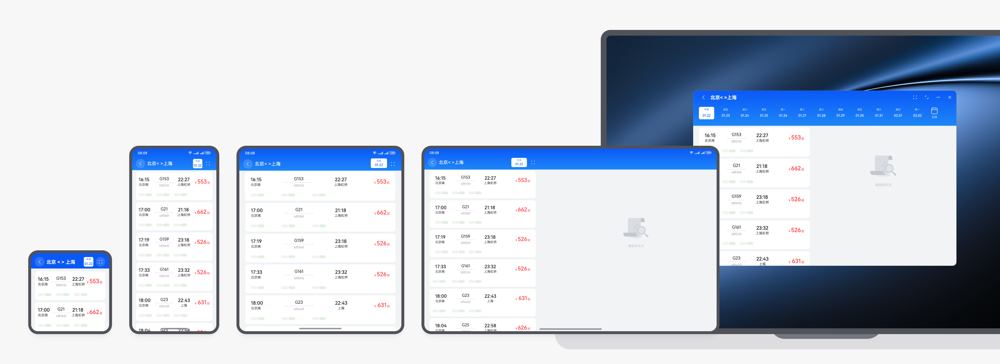

 

 

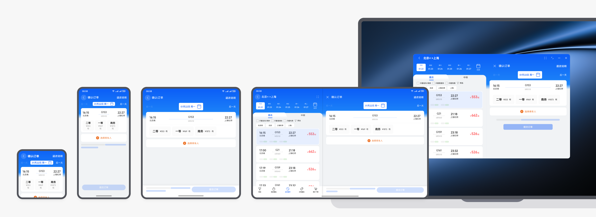

 
本场景的开发指南，请参阅[一多开发实例（旅行订票)-订单信息页。](https://developer.huawei.com/consumer/cn/doc/best-practices/multi-travel-accommodation#section755015294519)
 

#### 已支付订单

 
在平板、电脑上使用分栏布局查看订单提高效率，左边订单列表，右边订单详情。
 

 

 

#### 实况通知

 
实况通知是一种帮助用户聚焦进行中任务、方便快速查看和即时处理的消息提醒，包含胶囊态、卡片态。在购票出行等场景中十分实用：
 

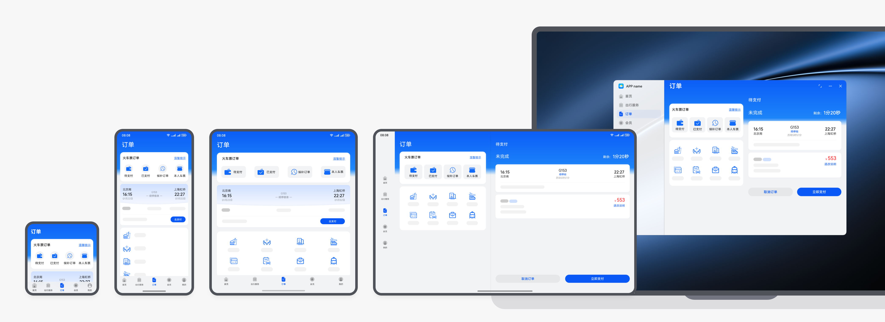

 

#### 酒店

 

#### 酒店首页

 
使用卡片样式的广告图，在宽屏设备上广告卡片延伸布局，同时结合设备的物理尺寸适当进行广告卡片的形变，广告图内容自适应裁剪。需要确保卡片样式的广告图在多端都有较好的显示效果
 

 

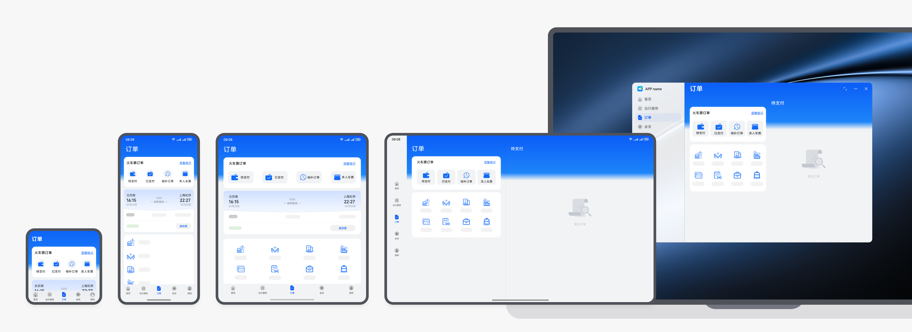

 

 
本场景的开发指南，请参阅[一多开发实例（旅行订票)-酒店首页。](https://developer.huawei.com/consumer/cn/doc/best-practices/multi-travel-accommodation#section41871019476)
 

#### 酒店排行榜

 
手机、折叠屏上使用沉浸式banner，平板、电脑上采用左大右小的布局。
 

 

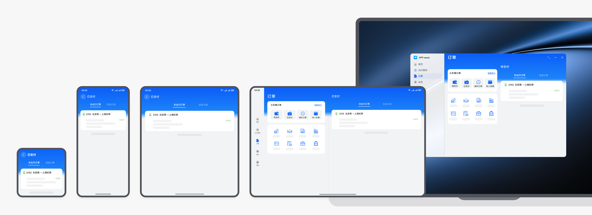

 
本场景的开发指南，请参阅[一多开发实例（旅行订票)-酒店排行榜页面。](https://developer.huawei.com/consumer/cn/doc/best-practices/multi-travel-accommodation#section159523974711)
 

#### 酒店详情

 
手机上使用可以左右滑动的上面酒店图片，下面酒店详情的布局。宽屏上使用左图右详情布局
 

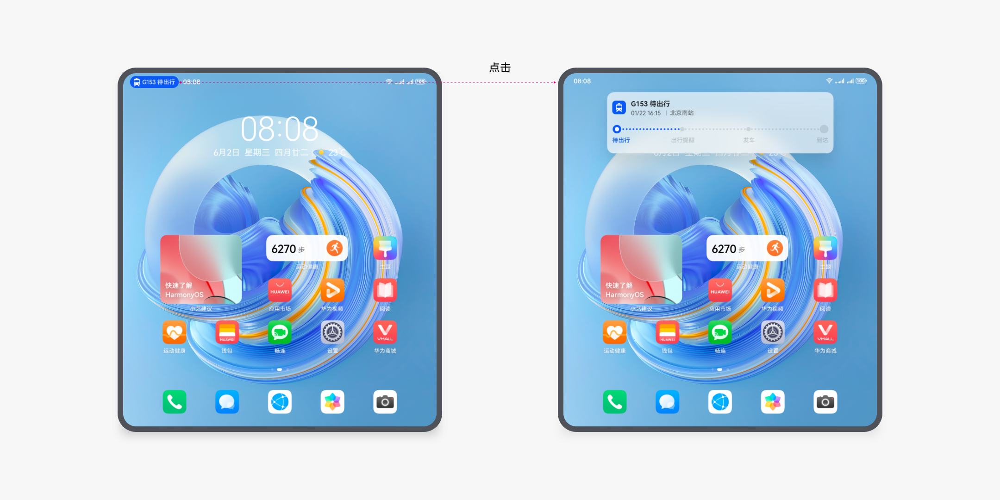

 
本场景的开发指南，请参阅[一多开发实例（旅行订票)-酒店详情页。](https://developer.huawei.com/consumer/cn/doc/best-practices/multi-travel-accommodation#section185431244812)
